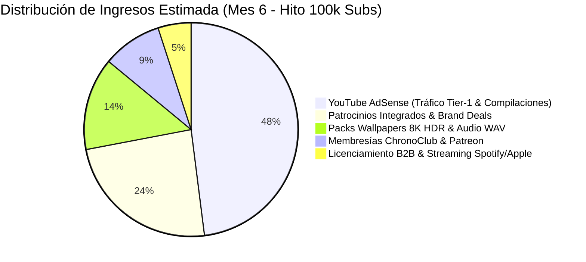
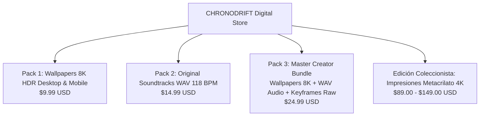

# 💰 Plan Comercial, Monetización Diversificada y Proyección Financiera (0 ➔ 100k+ Suscriptores)
## Canal: CHRONODRIFT (@ChronoDriftOfficial)
> **Tagline:** *Urban Time Travel & Future Cities (1626 ➔ 2026 ➔ 2226)*  
> **Nicho:** Vuelos FPV Tritemporales en 4K 60fps | HUD Telemetría Científica 3D | Bandas Sonoras Flow 118 BPM  
> **Público Objetivo:** 18 a 45 años | Alto poder adquisitivo en mercados Tier-1 (USA, UK, DE, JP, AU, CA)  
> **RPM Objetivo Promedio:** **$14.00 – $24.00 USD** (AdSense) + $35.00+ USD (Efectivo total con ingresos indirectos)

---

```
+===============================================================================================================+
|                                    ARQUITECTURA DE MONETIZACIÓN DIVERSIFICADA                                 |
+===============================================================================================================+
| 1. ADSENSE TIER-1 OPTIMIZADO  | 2. SPONSORS & BRAND DEALS     | 3. WALLPAPERS 8K & DIGITAL | 4. CHRONOCLUB & B2B      |
| RPM $14 - $24 USD             | Integraciones Diegéticas 60s  | Packs 8K HDR + WAV 118 BPM | Membresías + Patreon     |
| Mid-rolls en Compilaciones 1h | $1,500 - $6,500 USD por deal  | Gumroad / Lemon Squeezy    | Licenciamiento Expos/TV  |
+-------------------------------+-------------------------------+----------------------------+--------------------------+
```

---

## 1. 💵 Desglose de Fuentes de Ingresos



---

## 2. 📺 1. Optimización de YouTube AdSense (Tier-1 Focus & Smart TV RPM Boost)

### 2.1. Estrategia Geográfica y Segmentación de Audiencia
El contenido de CHRONODRIFT se produce en inglés nativo con HUDs técnicos universales y localización de metadatos en 8 idiomas. Esto concentra el tráfico en regiones de alto CPM:

| País / Región | Concentración Tráfico Objetivo | CPM Estimado | RPM Estimado | Justificación Demográfica |
| :--- | :--- | :--- | :--- | :--- |
| **Estados Unidos (USA)** | 42.0% | $28.00 – $42.00 | $16.00 – $24.00 | Interés en tecnología, IA, urbanismo y arquitectura. |
| **Reino Unido (UK)** | 14.0% | $24.00 – $36.00 | $14.00 – $21.00 | Afinidad con episodios históricos (Londres, Europa). |
| **Alemania & Nórdicos (DE/NL/SE)** | 16.0% | $26.00 – $38.00 | $15.00 – $22.50 | Alta valoración del urbanismo sostenible y modelos IPCC. |
| **Japón & Asia Pacífico (JP/AU/SG)** | 15.0% | $22.00 – $34.00 | $13.00 – $19.50 | Devoción por Neo-Tokio, Singapur biofílico y tecnología FPV. |
| **Resto del Mundo (Tier-2 Selecto)** | 13.0% | $10.00 – $16.00 | $6.00 – $9.50 | Tráfico orgánico de exploración global. |

### 2.2. Política de Inserción Publicitaria (Preservación del Flow y Alta Retención)
* **Episodios Cortos Maestros (42 segundos):**
  - **Monetización en Shorts Feed:** Tráfico masivo con RPM de $0.08 - $0.15 por 1k vistas; su rol principal es el **embudo hacia vídeos largos**.
* **Episodios Largos / Compilaciones Temáticas (10 a 25 minutos):**
  - Anuncio *Pre-Roll* no saltable (15s) de alta tarificación.
  - Anuncios *Mid-Roll* espaciados cada **6:00 a 7:30 minutos**, insertados exactamente en los fundidos a negro o cambios de ciudad para no quebrar el estado de flujo mental (*flow state*) ni la inmersión del espectador.
* **Super-Compilaciones Ambientales (1 a 2 Horas - "Study & Sleep with Future Cities"):**
  - Consumo predominante en **Smart TVs (pantallas 4K/OLED de salón) y monitores de trabajo**.
  - 1 anuncio pre-roll + 1 mid-roll cada 18-20 minutos. El tiempo medio de reproducción (AVD) de 45-60 minutos genera un RPM efectivo de **$18.50 - $26.00 USD**.

---

## 3. 🤝 2. Patrocinios Integrados & Brand Deals (Integraciones Diegéticas)

A partir de los **25.000 suscriptores**, CHRONODRIFT activa su programa de patrocinios con marcas que encajan naturalmente con la estética ciber-urbana y tecnológica del canal.

### 3.1. Categorías de Marcas y Patrocinadores Afines
1. **Software de Diseño, Arquitectura e IA:**
   - Autodesk, Unreal Engine / Epic Games, Midjourney, Lumion, Blender Cloud, Canva Pro, Runway.
2. **Hardware de Visualización y Computación:**
   - LG OLED evo, ASUS ProArt, Dell UltraSharp, Samsung Odyssey, NVIDIA Studio, DJI.
3. **Plataformas de Aprendizaje y Ciencia:**
   - Brilliant.org, CuriosityStream / Nebula, MasterClass, Skillshare, Coursera.
4. **Herramientas de Ciberseguridad, Productividad & Audio:**
   - NordVPN, Proton, CleanMyMac, Epidemic Sound, Teenage Engineering, Sony Headphones.

### 3.2. Tarifario Canónico de Patrocinio (Rate Card Q1-Q2)

```
+---------------------------------------------------------------------------------------------------------------+
|                                      TARIFARIO OFICIAL DE PATROCINIOS CHRONODRIFT                             |
+---------------------+-------------------+---------------------+-----------------------------------------------+
| Nivel del Canal     | Tipo de Integración| Tarifa por Episodio | Entregables Incluidos                         |
+---------------------+-------------------+---------------------+-----------------------------------------------+
| **Fase 2 (10k-25k)**| Dedicated Mention | **$850 – $1,200**   | Mención HUD 30s + Link en descripción/fijado  |
| **Fase 3 (25k-50k)**| Diegetic Sponsor  | **$1,800 – $2,500** | Integración 60s dentro del HUD + 1 Short      |
| **Fase 4 (50k-100k)**| Master Partner    | **$3,500 – $4,800** | Segmento 60s 4K + 2 Shorts + Banner Comunit.  |
| **100k+ (Plata)**   | Exclusive Sponsor | **$5,500 – $7,500** | Serie de 3 Episodios + Co-Branding en HUD 3D  |
+---------------------+-------------------+---------------------+-----------------------------------------------+
```

### 3.3. Guion Modelo de Integración Diegética (Ejemplo: Brilliant.org / Visualizador Urbano)
> *[Visual HUD en pantalla: Telemetría 3D muestra la estructura de nanotubos de la Shimizu Mega-Pyramid con el logo elegante de Brilliant]*  
> **Locutor (Voz IA Cálida / Sonido Diegético):** *"Construir arcologías capaces de resistir el cambio climático en 2226 requiere dominar los principios de la física de materiales y la computación cuántica. Si quieres entender cómo la ingeniería real dará forma a las ciudades del mañana, **Brilliant.org** desglosa estos conceptos con lecciones visuales e interactivas paso a paso. Visita `brilliant.org/chronodrift` o haz clic en el enlace de la descripción para acceder a una prueba gratuita de 30 días y un 20% de descuento en la suscripción anual."*

---

## 4. 🎨 3. Productos Digitales: Wallpapers 8K HDR & Audio Master WAV

Los espectadores de CHRONODRIFT buscan constantemente fondos de pantalla de máxima fidelidad y las bandas sonoras ambientales de 118 BPM para sus rutinas de trabajo y concentración.

### 4.1. Catálogo de Productos en Gumroad & Lemon Squeezy



1. **Pack "ChronoDrift: 10 Cities 8K HDR Wallpaper Collection" ($9.99 USD):**
   - 70 fondos de pantalla en resolución 7680 $\times$ 4320 píxeles (7 por cada una de las 10 ciudades maestras: Pasado, Presente, Futuro y vistas aéreas).
   - Formatos adaptados para monitores Ultra-Wide 21:9, Dual Monitors 16:9 y Smartphones (iOS/Android 9:16).
   - Renderizados nativos a 300 DPI en espacio de color DCI-P3 con rango dinámico HDR.
2. **Pack "118 BPM Urban Flow: Original Soundtrack Master Collection" ($14.99 USD):**
   - 10 pistas musicales completas sin compresión en formato WAV 24-bit / 48kHz.
   - Versiones extendidas de 10 minutos por pista ideales para programación, lectura y meditación.
   - Licencia de uso libre para creadores de contenido no comercial (*Creator Friendly License*).
3. **The Master Chrononaut Vault Bundle ($24.99 USD):**
   - Incluye los 70 Wallpapers 8K + Álbum Musical WAV Completo + Dossier Digital PDF con los esquemas arquitectónicos y estudios científicos del MIT/IPCC de cada ciudad.

---

## 5. 👑 4. Membresías de Canal (YouTube ChronoClub & Patreon)

Para cultivar una comunidad nuclear de entusiastas de la ciencia, la arquitectura futurista y la creación audiovisual con IA, se establecen 3 niveles de membresía:

```
+---------------------------------------------------------------------------------------------------------------+
|                                      NIVELES DE MEMBRESÍA CHRONOCLUB                                         |
+---------------------+-------------+---------------------------------------------------------------------------+
| Nivel de Membresía  | Precio/mes  | Beneficios Exclusivos                                                     |
+---------------------+-------------+---------------------------------------------------------------------------+
| **Tier 1: Traveler**| **$3.99**   | - Insignias de fidelidad cromáticas según antigüedad (Edo ➔ Shibuya ➔ 2226)|
|                     |             | - Emojis personalizados de drones FPV y HUDs cuánticos                    |
|                     |             | - Votación de la siguiente ciudad a recrear en encuestas exclusivas       |
+---------------------+-------------+---------------------------------------------------------------------------+
| **Tier 2: Architect**| **$9.99**   | - Todo lo anterior + Acceso anticipado de 48h a todos los episodios 4K    |
|                     |             | - Descarga mensual gratuita de los Wallpapers 8K HDR del nuevo episodio   |
|                     |             | - Acceso al canal privado de Discord *#chronodrift-lab*                   |
+---------------------+-------------+---------------------------------------------------------------------------+
| **Tier 3: ChronoGod**| **$24.99**  | - Todo lo anterior + Mención de agradecimiento en el HUD de telemetría    |
|                     |             | - Acceso a los prompts completos de Gemini Omni Flash y plantillas Remotion|
|                     |             | - Archivo maestro de pistas de audio en WAV de cada episodio              |
+---------------------+-------------+---------------------------------------------------------------------------+
```

---

## 6. 🏛️ 5. Licenciamiento B2B, Museos & Distribución Musical

1. **Licenciamiento Audiovisual B2B para Museos y Ferias Urbanas:**
   - Venta de metraje en bucle 4K 60fps / 8K para pabellones de exposiciones urbanísticas (ej.: Smart City Expo World Congress, museos de ciencia, vestíbulos corporativos de estudios de arquitectura).
   - Tarifa estándar de licencia de exhibición no exclusiva: **$1,200 a $3,500 USD** por ciudad/año.
2. **Regalías de Streaming Musical (Spotify, Apple Music, YouTube Music):**
   - Distribución del álbum *"CHRONODRIFT: Urban Time Travel Vol. 1 (118 BPM Flow)"* mediante DistroKid.
   - Posicionamiento en playlists curatoriales de *Lofi Chill / Synthwave Study / Cyberpunk Focus*.
   - Ingresos proyectados: **$450 – $1,200 USD/mes** al alcanzar 50.000 oyentes mensuales.

---

## 7. 📈 Proyección Financiera Consolidada a 12 Meses (Q1 a Q4)

$$\text{Ingreso Total Mes } n = \text{AdSense} + \text{Patrocinios} + \text{Wallpapers/Audio} + \text{Membresías} + \text{B2B/Streaming}$$

```
+----+--------+------------+------------+-----------+-----------+------------+------------+---------------+
| Mes| Subs   | Vistas/mes | AdSense ($)| Sponsors  | Prod. Dig | Membresías | B2B/Music  | TOTAL MENSUAL |
+----+--------+------------+------------+-----------+-----------+------------+------------+---------------+
| M1 | 1,500  | 65,000     | $650       | $0        | $150      | $50        | $0         | **$850**      |
| M2 | 6,000  | 180,000    | $2,400     | $0        | $450      | $220       | $50        | **$3,120**    |
| M3 | 18,000 | 450,000    | $6,500     | $1,000    | $1,200    | $650       | $150       | **$9,500**    |
| M4 | 45,000 | 950,000    | $14,200    | $2,200    | $2,400    | $1,400     | $350       | **$20,550**   |
| M5 | 75,000 | 1,600,000  | $24,500    | $4,500    | $4,100    | $2,300     | $600       | **$36,000**   |
| M6 | 100k+  | 2,400,000  | **$36,000**| **$7,500**| **$6,200**| **$3,400** | **$1,100** | **$54,200**   |
| M9 | 220k   | 4,200,000  | $63,000    | $14,000   | $9,500    | $5,800     | $2,200     | **$94,500**   |
| M12| 350k+  | 6,500,000  | $97,500    | $22,000   | $15,000   | $8,900     | $3,600     | **$147,000**  |
+----+--------+------------+------------+-----------+-----------+------------+------------+---------------+
```

---
*CHRONODRIFT — Commercial Plan & Financial Forecast 2026*
