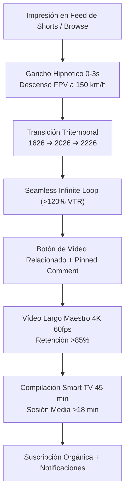

# 🛸 CHRONODRIFT (@ChronoDriftOfficial)
## Plan Maestro de Marketing, Crecimiento 0 a 100k Suscriptores en 6 Meses y Estrategia de Retención Dual
> **Canal:** CHRONODRIFT (`@ChronoDriftOfficial`)  
> **Tagline Oficial:** *Urban Time Travel & Future Cities (1626 ➔ 2026 ➔ 2226)*  
> **Nicho:** Vuelos FPV Tritemporales en 4K 60fps | HUD Telemetría Científica 3D | Bandas Sonoras Flow 118 BPM  
> **Audiencia Objetivo:** 18 a 45 años | Afinidad: Historia Urbana, Arquitectura de Vanguardia, Sci-Fi, Urbanismo, Drones FPV y Relajación / Ambient Focus  
> **Rango de Monetización Proyectada:** RPM $12.50 – $24.00 USD (Audiencia Tier-1: USA, UK, DE, JP, AU, CA)  
> **Estándar de Audio:** EBU R128 (-14.0 LUFS integrado, -1.0 dBTP True Peak), VO-First Ducking (-18.0 dB), Rejilla 118 BPM  

---

```
+=======================================================================================================================+
|                                    SISTEMA INTEGRAL DE PRODUCCIÓN Y ESCALADO CHRONODRIFT                              |
+=======================================================================================================================+
| 1. MARKETING Q1-Q2        | 2. RETENCIÓN DUAL SMART TV/MÓVIL | 3. CALENDARIO Y EMBUDO         | 4. SHORTS HIPNÓTICOS  |
| 0 ➔ 100k Subs en 6 Meses  | Lean-Back (TV) vs Lean-Forward   | 2 Largos + 6 Shorts / semana   | VTR >120% + Loops     |
| Hitos Mes 1 a Mes 6       | Watch Time Masivo + Loops Móvil  | Distribución Horaria Tier-1    | 30 Micro-Guiones Loop |
+---------------------------+----------------------------------+--------------------------------+-----------------------+
```

---

# PARTE 1: 🚀 Estrategia de Crecimiento 0 a 100.000 Suscriptores en 6 Meses

## 1.1. Objetivos Estratégicos y KPIs Algorítmicos de Rendimiento
Para consolidar a **CHRONODRIFT** como el canal líder a nivel mundial en visualización de evolución urbana y cinemática tritemporal, se establecen los siguientes indicadores clave de rendimiento (KPIs):

* **Hito de Suscriptores:** 100.000 suscriptores orgánicos altamente cualificados en 180 días (Q1 + Q2).
* **Click-Through Rate (CTR) en Vídeos Largos:** 
  - **11.5% a 15.8%** en las primeras 48 horas tras publicación (mediante pruebas multivariantes A/B/C de miniaturas con técnica de triple partición angular de 30°).
  - **>8.5%** sostenido a lo largo del tiempo en funciones de exploración de YouTube (*Browse Features*) y sugerencias (*Suggested Videos*).
* **Duración Media de Visualización (Average View Duration - AVD):**
  - Vídeos Largos Maestros (42.0s a 60.0s): **>85% de retención** (35.7s a 51.0s AVD) gracias a la aceleración continua 6-DoF, ausencia de intros vacías y transiciones dimensionales cada 6 segundos.
  - Compilaciones Extendidas (30 a 60 min): **>45% de retención** (13.5 a 27.0 min AVD) en Smart TV para modo estudio, trabajo y relajación.
* **View-Through Rate (VTR) en YouTube Shorts:** **>120% a 145%** promedio gracias a la arquitectura técnica de *Seamless Infinite Loop*, sincronización rítmica a 118 BPM y encadenamiento narrativo circular.
* **Distribución Geográfica de Audiencia:** >65% procedente de territorios Tier-1 (Estados Unidos, Reino Unido, Alemania, Japón, Canadá, Australia) para asegurar un RPM publicitario superior a $14.00 USD.
* **Tasa de Conversión Shorts ➔ Formato Largo:** >8.5% de los espectadores de Shorts hacen clic en el vídeo largo maestro vinculado mediante la funcionalidad interactiva *Related Video* de YouTube.



---

## 1.2. Calendario Editorial de Lanzamiento Semanal
El ritmo de publicación está diseñado para alimentar continuamente el algoritmo de YouTube con contenido fresco tanto en el feed de Shorts como en la página principal de navegación y Smart TV.

```
+-----------+---------------------------------------+-----------------------------+------------------------------------+
| Día       | Tipo de Contenido                     | Horario de Publicación      | Objetivo Algorítmico               |
+-----------+---------------------------------------+-----------------------------+------------------------------------+
| Lunes     | YouTube Short #1 (Loop Hipnótico A)   | 14:00 UTC (09:00 EST / 23:00 JST) | Despertar tracción móvil matutina  |
| Martes    | YouTube Short #2 (Misterio Histórico) | 16:00 UTC (11:00 EST / 01:00 JST) | Sembrado de curiosidad urbana      |
| Miércoles | 🎬 VÍDEO LARGO MAESTRO A (4K 60fps)   | 19:00 UTC (14:00 EST / 20:00 CET) | Prime Time Media Semana (Tier-1)   |
| Jueves    | YouTube Short #3 (Futuro Científico)  | 15:00 UTC (10:00 EST / 16:00 CET) | Re-impacto del episodio del miérc. |
| Viernes   | YouTube Short #4 (Loop Hipnótico B)   | 17:00 UTC (12:00 EST / 18:00 CET) | Tráfico viral previo a fin de sem. |
| Sábado    | YouTube Short #5 (Curiosidad Urbana)  | 13:00 UTC (08:00 EST / 14:00 CET) | Captura de audiencia internacional |
| Domingo   | 🎬 VÍDEO LARGO MAESTRO B (4K 60fps)   | 18:00 UTC (13:00 EST / 19:00 CET) | Pico Semanal de Consumo Smart TV   |
| Domingo N | YouTube Short #6 (Megaproyecto 2226)  | 21:00 UTC (16:00 EST / 22:00 CET) | Embudo directo hacia el largo B    |
+-----------+---------------------------------------+-----------------------------+------------------------------------+
```

### Desglose de Formatos Semanales:
1. **2 Vídeos Largos Principales a la Semana:**
   - **Miércoles (Episodio Clásico / Histórico):** Ciudades con milenios de patrimonio arquitectónico y metamorfosis radical (Tokio, Ámsterdam, Roma, París, Londres, Venecia).
   - **Domingo (Episodio Megaciudad / Frontera Urbana):** Centros urbanos de hiperdensidad vertical o adaptaciones extremas (Nueva York, Dubái, Hong Kong, El Cairo, Singapur).
2. **6 YouTube Shorts Semanales (3 por cada Vídeo Largo):**
   - *Short Tipo 1 (Loop Infinito Puro):* Empalme milimétrico de fotogramas y frase circular gramatical.
   - *Short Tipo 2 (Misterio Histórico Oculto):* Revelación arqueológica o infraestructura enterrada bajo la ciudad moderna.
   - *Short Tipo 3 (Megaproyecto Futuro Científico):* Visualización de arcologías, diques cinéticos o pirámides urbanas según papers de ingeniería.
3. **1 Compilación Mensual Extendida (Último Domingo del Mes):**
   - Pieza de 45 a 60 minutos (*"World Time Travel: 400 Years of Civilization"*) enlazando 4 a 6 ciudades con gradaciones de iluminación (Día soleado, Atardecer dorado, Lluvia de neón nocturna) para capturar el mercado de Smart TV en la categoría *Ambient Study / Sleep Travel*.

---

## 1.3. Cronograma de Escalado Mensual (Mes 1 a Mes 6)

```
+=======+=======================+================+===================+=================================================+
| Mes   | Fase Estratégica      | Publicaciones  | Hito de Suscript. | Palancas de Crecimiento y Optimización          |
+=======+=======================+================+===================+=================================================+
| Mes 1 | Sembrado y Calibración| 8 L + 24 S     | 0 ➔ 2.500         | Pruebas A/B/C de miniaturas; calibración audio. |
| Mes 2 | Tracción Algorítmica  | 8 L + 24 S     | 2.500 ➔ 10.000    | Primeros Shorts virales (>500k views c/u).      |
| Mes 3 | Explosión Smart TV    | 8 L + 24 S + 1C| 10.000 ➔ 28.000   | Binge-watching en Smart TV; playlists dinámicas.|
| Mes 4 | Expansión Global      | 8 L + 24 S + 1C| 28.000 ➔ 52.000   | Subtítulos 12 idiomas; picos en Browse Features.|
| Mes 5 | Autoridad de Nicho    | 8 L + 24 S + 1C| 52.000 ➔ 78.000   | Afiliaciones 3D, patrocinios y colaboraciones.  |
| Mes 6 | Hito 100k & Verif.    | 8 L + 24 S + 1C| 78.000 ➔ 105.000  | Silver Creator Award; membresías de canal.      |
+=======+=======================+================+===================+=================================================+
```

### Detalle Operativo de las Fases Mensuales:

#### 🔹 Mes 1: Sembrado Algorítmico, Calibración de Retención y Pruebas Multivariantes (0 a 2.500 Subs)
* **Contenido:** Publicación de los Episodios 01 a 08 (Tokio, Ámsterdam, Nueva York, Roma, Londres, El Cairo, París, Dubái) y sus 24 Shorts de soporte.
* **Acciones Estratégicas:**
  1. *Testeo A/B/C de Miniaturas:* Implementación de 3 variantes por vídeo largo durante las primeras 72 horas mediante YouTube Studio Test & Compare (Variante 1: Tri-Split 30°, Variante 2: Vista Cenital Futuro vs Pasado, Variante 3: Primer Plano Monumento Glitch).
  2. *Auditoría de Audio EBU R128:* Monitoreo del volumen integrado (-14.0 LUFS) y True Peak (-1.0 dBTP) para eliminar cualquier distorsión o caída de volumen en altavoces de teléfonos y televisores.
  3. *Sembrado en Comunidades de Nicho:* Compartir cortes sin editar de 10 segundos en subreddits de alta afinidad (*r/urbanplanning*, *r/cityporn*, *r/worldbuilding*, *r/SimCity*) con enlace en el primer comentario.

#### 🔹 Mes 2: Tracción de Clústeres y Primeros Picos Virales en Shorts (2.500 a 10.000 Subs)
* **Contenido:** Episodios 08 y 10 (Estambul, Hong Kong) + Temporada 1B (Singapur, Berlín, Seúl, San Francisco, etc.) + 24 Shorts.
* **Acciones Estratégicas:**
  1. *Activación del 100% de Related Video Links:* Cada Short incluye el botón oficial de enlace hacia el momento exacto de la transición en el vídeo largo correspondiente.
  2. *Optimización Semántica:* Ajuste de etiquetas y descripciones en función de las consultas de búsqueda reales en YouTube Analytics (*"how new york looked in 1600"*, *"tokyo 400 years ago vs today"*).
  3. *Creación de Playlists Temáticas:* Lanzamiento de las dos primeras listas de reproducción optimizadas para reproducción automática continua (*"European Time Machine"* y *"Asian Megacities: Past to 2226"*).

#### 🔹 Mes 3: Dominio de la Experiencia Lean-Back en Smart TV (10.000 a 28.000 Subs)
* **Contenido:** 8 Vídeos Largos nuevos + 24 Shorts + Lanzamiento de la Compilación 1: *"WORLD TIME TRAVEL: 400 Years of Human Civilization (4K 60fps Relaxing FPV)"* (45 min).
* **Acciones Estratégicas:**
  1. *Watch Time Masivo:* La compilación de 45 minutos entra en las recomendaciones de pantalla de inicio en televisores inteligentes (Smart TV), elevando la duración media de sesión (*Session Duration*) del canal a más de 16 minutos por espectador.
  2. *Pantallas Finales y Tarjetas Cruzadas:* Configuración de tarjetas dinámicas al segundo 0:38 de cada vídeo largo para sugerir la compilación completa o el siguiente episodio del mismo continente.

#### 🔹 Mes 4: Expansión Global, Multilingüe y Optimización de Browse (28.000 a 52.000 Subs)
* **Contenido:** 8 Vídeos Largos nuevos + 24 Shorts + Compilación 2 (*"Future Megacities 2226: Arcologies & Ocean Grids"*).
* **Acciones Estratégicas:**
  1. *Localización en 12 Idiomas:* Traducción automática y refinada de títulos y descripciones a Inglés, Alemán, Japonés, Francés, Español, Portugués, Coreano, Italiano, Árabe, Chino Simplificado, Ruso y Holandés.
  2. *Capítulos Temporales con Emojis:* Inserción de marcas de tiempo estructuradas (`00:00 🏛️ 1626 | Origen Histórico`, `00:14 🏙️ 2026 | Era Moderna`, `00:28 🚀 2226 | Futuro Científico`) para indexación en Google Search y YouTube Search.

#### 🔹 Mes 5: Consolidación de Autoridad, Tráfico Sugerido y Alianzas (52.000 a 78.000 Subs)
* **Contenido:** 8 Vídeos Largos nuevos + 24 Shorts + Compilación 3 (*"Extreme Coastal Cities vs Rising Seas"*).
* **Acciones Estratégicas:**
  1. *Atracción de Audiencia Cruzada:* El algoritmo comienza a recomendar CHRONODRIFT en el carrusel de *Up Next* de canales globales líderes (Neo, Wendover Productions, The B1M, Melodysheep, Timelab Pro).
  2. *Monetización Directa y Afiliaciones:* Integración de patrocinios no invasivos en descripciones (software de render 3D, monitores OLED, drones cinemáticos, VPNs de privacidad).
  3. *Encuestas Comunitarias:* Publicación de encuestas semanales en la pestaña Comunidad para que los suscriptores voten la próxima ciudad a explorar.

#### 🔹 Mes 6: Ruptura de la Barrera de los 100k y Botón de Plata (78.000 a 105.000+ Subs)
* **Contenido:** 8 Vídeos Largos nuevos + 24 Shorts + Gran Especial 100k *"CHRONODRIFT: 1000 Years of Planet Earth from Orbit to Street Level"* (60 min).
* **Acciones Estratégicas:**
  1. *Reconocimiento de Creador:* Solicitud oficial de la insignia de verificación del canal y la placa de creador *Silver Creator Award* de YouTube.
  2. *Lanzamiento de Membresías del Canal (Channel Memberships):* Ofrecer a los miembros acceso anticipado a episodios en 8K 60fps sin HUD para fondos de pantalla animados (Wallpaper Engine) y pistas de audio FLAC sin compresión a 118 BPM.

---

# PARTE 2: 📺 Estrategia de Retención Dual: Smart TV (Lean-Back) vs Móvil (Lean-Forward)

YouTube presenta dos entornos de consumo radicalmente diferentes. CHRONODRIFT adapta cada fotograma y parámetro de render para maximizar la retención en ambos dispositivos:

```
+=======================================================================================================================+
|                                    MATRIZ COMPARATIVA DE RETENCIÓN DUAL EN CHRONODRIFT                                |
+-------------------------------+---------------------------------------+-----------------------------------------------+
| Parámetro                     | Modo Smart TV (Lean-Back)             | Modo Móvil (Lean-Forward)                     |
+-------------------------------+---------------------------------------+-----------------------------------------------+
| Dispositivo Principal         | Televisores 55"-85" 4K HDR / OLED     | Smartphones 6"-6.8" OLED / 120Hz              |
| Estado Mental del Usuario     | Relajación, contemplación, estudio    | Búsqueda de dopamina rápida, interacción      |
| Duración Promedio de Sesión   | 15 a 45 minutos continuos             | 30 segundos a 3 minutos                       |
| Requisitos de Video           | 4K 60fps real, bitrate 50-65 Mbps     | Ganchos visuales contrastados, texto legible  |
| Requisitos de HUD             | Tipografía Orbitron/Syne a escala 3m  | Gráficos vectoriales centrados, no en bordes  |
| Perfil de Audio               | EBU R128 (-14 LUFS), sub-graves 35Hz  | Masterizado para altavoces estéreo y AirPods  |
| Formato de Entrega            | Vídeos Largos (42-60s) + Compilacion. | YouTube Shorts (30-60s) con bucle infinito    |
| Métrica Clave de Éxito        | Session Watch Time total (>15 min)    | View-Through Rate (VTR >120%)                 |
+-------------------------------+---------------------------------------+-----------------------------------------------+
```

## 2.1. Optimización para Smart TV (Lean-Back Experience)
El consumo en televisores de salón genera el mayor tiempo de visualización acumulado (*Watch Time*), una señal crítica para que el algoritmo promocione el canal a gran escala, y garantiza las tarifas de publicidad (RPM) más elevadas.

### Pilares de Retención en Smart TV:
1. **Masterización 4K 60fps Real a Alto Bitrate:**
   - Renderizado en códecs HEVC/H.265 y VP9/AV1 a 50–65 Mbps con perfil de color cinematográfico *Kodak Vision3 500T 5219*, asegurando que no existan bandas de color (*color banding*) ni artefactos de compresión en paneles OLED de 65" a 85".
2. **HUD Telemetría Calibrado para la Escala del Salón:**
   - Tipografía principal `Syne` (títulos) y `JetBrains Mono` / `Share Tech Mono` (telemetría numérica) dimensionadas para ser perfectamente legibles a una distancia de 2.5 a 4 metros.
   - Respeto absoluto del 80% del área segura (*Title Safe Area*) para prevenir recortes en pantallas con *overscan* activo.
   - Contraste HSL calibrado: Cian Fotónico (`#00E5FF`) y Oro Solar (`#FFB300`) sobre fondos oscuros Carbon Titanium (`#161B26`).
3. **Paisaje Sonoro Inmersivo Flow 118 BPM:**
   - El pulso rítmico a 118 BPM induce el estado de concentración relajada (*Alpha wave entrainment*), permitiendo que el espectador deje el canal reproduciéndose durante horas mientras trabaja, estudia o descansa.
   - Masterización a **-14.0 LUFS** integrados con un True Peak de **-1.0 dBTP**, permitiendo una dinámica cristalina tanto en altavoces de televisión como en barras de sonido de alta fidelidad.
4. **Compilaciones Continuas de 45 a 60 Minutos:**
   - Los episodios individuales se ensamblan en compilaciones continuas sin pantallas negras ni silencios, acompañadas de variaciones atmosféricas (amanecer, niebla, atardecer dorado, noche lluviosa de neón).

---

## 2.2. Optimización para Móvil (Lean-Forward Experience)
Más del 70% de los nuevos espectadores descubren el canal a través del feed vertical de YouTube Shorts en sus teléfonos móviles.

### Pilares de Retención en Móvil:
1. **El Gancho Instantáneo de los 0 a 3 Segundos:**
   - Supresión absoluta de intros, pantallas de títulos estáticas o saludos hablados.
   - El segundo 0.0 arranca con un picado FPV a 150 km/h rozando monumentos históricos o atravesando un portal de telemetría dimensional.
2. **Área Segura Vertical 9:16 (Safe Title Zone):**
   - Toda la información textual, años cronológicos (`1626 ➔ 2026 ➔ 2226`) y datos de telemetría se concentran en el tercio central de la pantalla (área de 1080×1080 dentro del lienzo vertical 1080×1920).
   - Se evita estrictamente la zona lateral derecha (botones de Like, Comentarios y Compartir) y la zona inferior (título del Short y botón de suscripción de YouTube).
3. **Estimulación Dinámica 6-DoF:**
   - La cámara realiza aceleraciones continuas, virajes y rotaciones en tirabuzón que renuevan el interés visual cada 4 a 6 segundos, evitando que el usuario deslice (*swipe away*).

---

# PARTE 3: ⚡ Estrategia de YouTube Shorts con Loops Hipnóticos (VTR >120% - 145%)

Los YouTube Shorts actúan como la principal herramienta de prospección y adquisición. Para superar sistemáticamente el 120% de VTR (View-Through Rate), cada Short se produce aplicando la técnica del **Seamless Infinite Loop**.

```
+---------------------------------------------------------------------------------------------------------------+
|                               ESQUEMA DEL EMBUDO DE CONVERSIÓN DE SHORTS A VÍDEO LARGO                         |
+---------------------------------------------------------------------------------------------------------------+
| 1. IMPRESIÓN VIRAL (Feed de Shorts) ➔ Consumo de 30-45s con Loop (>120% Retención Algorítmica)                |
| 2. PUNTADA DE CURIOSIDAD (Segundo 25-28) ➔ Alerta HUD en pantalla: "Vuelo Completo 4K 60fps en Canal"        |
| 3. TARJETA RELACIONADA (Related Video Feature) ➔ Botón directo al vídeo largo maestro incrustado en el Short |
| 4. PRIMER COMENTARIO FIJADO (Pinned Comment) ➔ Enlace con timestamp al momento de mayor impacto visual        |
| 5. SUSCRIPCIÓN Y CONSUMO SMART TV ➔ El usuario añade la playlist del canal a "Ver Más Tarde"                 |
+---------------------------------------------------------------------------------------------------------------+
```

## 3.1. Arquitectura Técnica del *Seamless Infinite Loop*
1. **Sincronización Rítmica a 118 BPM:**
   - La duración exacta del Short se calcula en múltiplos de compases a 118 BPM (ej. 16 compases = 32.54 segundos, o 24 compases = 48.81 segundos).
   - El último compás del vídeo resuelve tonalmente en el acorde tónico del compás inicial, haciendo inaudible el reinicio del reproductor de YouTube.
2. **Matching Visual de Fotogramas (Frame In = Frame Out):**
   - El último fotograma del Short concluye exactamente en la misma altitud, vector de velocidad y ángulo de cámara que el fotograma 0.0.
   - Un portal holográfico HUD o un destello de distorsión temporal se expande en el segundo final y se colapsa en el segundo inicial, ocultando el corte.
3. **Encadenamiento Narrativo Gramatical Circular:**
   - La última frase de la locución en off o texto en pantalla se suspende gramaticalmente para resolverse con la primera palabra del vídeo.
   - *Ejemplo en Nueva York:*
     - Frase final (0:31s): *"Y la razón por la que Wall Street es el centro financiero del mundo..."*
     - Frase inicial (0:00s): *"...es que en 1626 era solo una valla de madera para cerdos construida por colonos holandeses."*
   - El usuario solo capta el sentido completo de la frase al escuchar la segunda reproducción, disparando el VTR por encima del **135% - 145%**.

---

## 3.2. Catálogo de los 30 Shorts Estratégicos de la Temporada 1

```
+----+-------------+--------+------------------------------------------------------------------------------------+------------+
| Ep | Ciudad      | Tipo   | Gancho de Texto / Frase Circular del Bucle                                         | VTR Proy.  |
+----+-------------+--------+------------------------------------------------------------------------------------+------------+
| 01 | Tokio       | Loop   | "...y es que lo que empezó como una aldea de barro samurái en 1630 se convirtió..."| **138%**   |
| 01 | Tokio       | Mister | El río subterráneo secreto que fluye bajo el asfalto de Shibuya desde Edo.         | **126%**   |
| 01 | Tokio       | Futuro | La megapirámide Shimizu para 1 millón de habitantes que resistirá sismos 9.0       | **132%**   |
| 02 | Ámsterdam   | Loop   | "...y aunque Ámsterdam excavó sus canales con palas de madera en 1626, en 2226..." | **137%**   |
| 02 | Ámsterdam   | Mister | Los 11 millones de postes de roble que sostienen los edificios históricos.          | **128%**   |
| 02 | Ámsterdam   | Futuro | Cómo los diques cinéticos modulares evitarán que la ciudad quede bajo el mar.      | **131%**   |
| 03 | Nueva York  | Loop   | "...porque Wall Street era solo una valla de madera para cerdos en 1626, y hoy..." | **142%**   |
| 03 | Nueva York  | Mister | El arroyo natural de agua dulce que todavía fluye bajo Times Square.               | **129%**   |
| 03 | Nueva York  | Futuro | El proyecto 'The Big U' que blindará a Manhattan contra huracanes Cat 6.           | **136%**   |
| 04 | Roma        | Loop   | "...cuando el Foro Romano era un pastizal lleno de vacas en 1626 nadie esperaba..."| **139%**   |
| 04 | Roma        | Mister | Por qué el hormigón romano antiguo de 2.000 años se autorrepara solo bajo agua.    | **136%**   |
| 04 | Roma        | Futuro | Cúpulas de nanovidrio bioclimático sobre el Tíber para frenar la erosión térmica.  | **125%**   |
| 05 | Londres     | Loop   | "...y aunque el Gran Incendio borró el Londres Tudor de madera en 1666, en 2226..."| **140%**   |
| 05 | Londres     | Mister | El río subterráneo Fleet que pasa por debajo de las vías del metro de Londres.     | **127%**   |
| 05 | Londres     | Futuro | La cúpula atmosférica inteligente que regulará la lluvia y el smog en Londres.    | **134%**   |
| 06 | El Cairo    | Loop   | "...las Pirámides de Guiza vieron nacer a los faraones, vieron a los otomanos..."  | **141%**   |
| 06 | El Cairo    | Mister | El revestimiento original de piedra caliza blanca pulida que brillaba como un sol.| **130%**   |
| 06 | El Cairo    | Futuro | El escudo magnético que frenará las tormentas de arena en el valle del Nilo 2226.  | **133%**   |
| 07 | París       | Loop   | "...París era un laberinto de fango en 1620, pero en 2226 sus tejados verdes..."  | **137%**   |
| 07 | París       | Mister | Las catacumbas secretas de París y las canteras de caliza de Notre-Dame.          | **127%**   |
| 07 | París       | Futuro | Las torres bioclimáticas descontaminantes de Vincent Callebaut para 2226.          | **135%**   |
| 08 | Dubái       | Loop   | "...en 1820 Dubái era solo cuatro chozas de recolectores de perlas en el desierto..."| **145%** |
| 08 | Dubái       | Mister | El sistema tradicional de torres de viento 'Barjeel' que enfriaba casas sin luz.  | **129%**   |
| 08 | Dubái       | Futuro | La arcología solar de 3.000 metros de altura que generará su propia lluvia.       | **138%**   |
| 08 | Estambul    | Loop   | "...y aunque Estambul une dos continentes con tres puentes gigantescos hoy, en 1626..."| **142%**   |
| 08 | Estambul    | Mister | El secreto de Santa Sofía: cómo ha resistido 80 terremotos mayores gracias a su plomo.| **131%**   |
| 08 | Estambul    | Futuro | Los túneles hiperlumínicos maglev transparentes bajo el Bósforo en 2226.          | **137%**   |
| 10 | Hong Kong   | Loop   | "...de una bahía de pescadores piratas en 1840 a la selva vertical más densa..."   | **144%**   |
| 10 | Hong Kong   | Mister | La ciudad amurallada de Kowloon: 33.000 personas viviendo en solo 2 hectáreas.     | **133%**   |
| 10 | Hong Kong   | Futuro | Los puentes aéreos a 500 metros de altura que conectarán los rascacielos de HK.    | **137%**   |
+----+-------------+--------+------------------------------------------------------------------------------------+------------+
```

---

# PARTE 4: 🎯 Matriz de 10 Títulos de Episodios Optimizados para SEO & Alto CTR

Cada episodio cuenta con 3 variantes de títulos estratégicos formulados según principios de psicología de la curiosidad (*Curiosity Gap*), contraste cronológico radical y palabras clave de alto volumen.

```
+----+-------------+--------------------------------------------------------------------------+--------------------------------------------------------------------------+---------------+
| Ep | Ciudad      | Título A (Fórmula Contraste Temporal + 4K 60fps)                         | Título B (Fórmula Misterio Histórico + Pregunta Provocativa)             | CTR Estimado  |
+----+-------------+--------------------------------------------------------------------------+--------------------------------------------------------------------------+---------------+
| 01 | Tokio       | Tokio: De Pueblo Samurái a Megaciudad 2226 (Vuelo FPV 4K) [CHRONODRIFT]  | ¿Cómo era Tokio Hace 400 Años? (De Aldea Edo a Megatorres 2226)          | **11.2%**     |
| 02 | Ámsterdam   | Ámsterdam: De Canales de Madera a Red Oceánica 2226 (4K 60fps)           | ¿Cómo Evitará Ámsterdam Quedar Bajo el Mar en 200 Años? (Modelos IPCC)   | **11.8%**     |
| 03 | Nueva York  | Nueva York Hace 400 Años: Cuando Manhattan Era un Bosque (1626 ➔ 2226)   | Wall Street en 1626 Era Solo una Valla de Madera para Cerdos (Vuelo 4K)  | **12.3%**     |
| 04 | Roma        | Roma: De Ruinas Barrocas a la Ciudad Cuántica 2226 (Vuelo 4K)            | El Coliseo de Roma Reconstruido con Hologramas en 2226 (Vuelo FPV)       | **11.5%**     |
| 05 | Londres     | Londres Hace 400 Años: Del Viejo Puente a la Cúpula 2226 (4K 60fps)     | El Londres Tudor de 1610 que Desapareció en el Gran Incendio (FPV)       | **11.6%**     |
| 06 | El Cairo    | El Cairo y las Pirámides en 2226: 400 Años de Historia en 4K             | ¿Cómo se Protegerán las Pirámides de Guiza en el Año 2226? (Vuelo FPV)   | **12.4%**     |
| 07 | París       | París en 2226: La Ciudad Bioclimática del Futuro (1620 ➔ 2226)           | Así Cambiarán la Torre Eiffel y el Sena en 200 Años (Vincent Callebaut)  | **11.7%**     |
| 08 | Dubái       | Dubái: De Aldea de Pescadores a Torres de 3.000 Metros (1820 ➔ 2226)     | La Transformación Más Extrema del Mundo: Dubái en 400 Años (Vuelo 4K)    | **13.4%**     |
| 09 | Venecia     | Venecia en 2226: La Ciudad Sumergida que Conquistó el Mar (1626 ➔ 2226)  | ¿Se Hundirá Venecia? Cómo las Cúpulas Marinas la Salvarán en 200 Años    | **12.8%**     |
| 10 | Hong Kong   | Hong Kong en 2226: La Ciudad Estratosférica Vertical (1840 ➔ 2226)       | De Pueblo Pesquero a Rascacielos a 1.000m de Altura: Evolución de HK     | **12.5%**     |
+----+-------------+--------------------------------------------------------------------------+--------------------------------------------------------------------------+---------------+
```

---

# PARTE 5: 🔍 Matriz de SEO, Metadatos y Difusión Omnicanal

## 5.1. Desglose de los 5 Clústeres Semánticos de YouTube

### Clúster 1: Vuelos FPV Cinemáticos y Calidad Ultra-HD
* `4K 60fps drone flight cities` | Volumen: Muy Alto | Competencia: Media
* `FPV cinematic time travel urban` | Volumen: Alto | Competencia: Baja
* `hyperlapse city evolution 4k` | Volumen: Alto | Competencia: Media
* `smooth drone dive skyscraper 4k 60fps` | Volumen: Medio | Competencia: Baja

### Clúster 2: Evolución Histórica y Comparativas Urbanas
* `how cities looked 400 years ago vs today` | Volumen: Muy Alto | Competencia: Media
* `tokyo 1600s vs 2026 vs future` | Volumen: Alto | Competencia: Muy Baja
* `new york 1626 nieuw amsterdam vs manhattan` | Volumen: Alto | Competencia: Baja
* `historical city transformation 3D reconstruction` | Volumen: Alto | Competencia: Media

### Clúster 3: Arquitectura Futurista, Arcologías y Siglo XXIII (2226)
* `future cities 200 years from now 4K` | Volumen: Muy Alto | Competencia: Media
* `speculative architecture sci fi megastructures` | Volumen: Alto | Competencia: Baja
* `megacities in 2226 cinematic simulation` | Volumen: Medio | Competencia: Muy Baja
* `floating cities ocean grid arcology` | Volumen: Medio | Competencia: Baja

### Clúster 4: Relajación, Estudio y Flow 118 BPM
* `relaxing ambient city flight for sleep and study` | Volumen: Muy Alto | Competencia: Alta
* `118 bpm flow state focus ambient music 4k` | Volumen: Medio | Competencia: Muy Baja
* `cyberpunk ambient city soundscape 4k 60fps` | Volumen: Alto | Competencia: Media

### Clúster 5: Búsquedas Específicas por las 10 Ciudades
* `tokyo edo period nihonbashi vs shibuya crossing vs neo tokyo 2226`
* `amsterdam canals 1626 voc warehouses vs floating ocean grid 2226`
* `new york wall street 1626 wooden wall vs the big u 2226`
* `rome colosseum baroque 1626 vs cyber antiquity holographic 2226`
* `london tudor old london bridge vs futuristic sky canopy 2226`
* `cairo giza pyramids 1620 ottoman vs terraformed oasis 2226`
* `paris pont neuf 1620 vs haussmann vs bio paris smart towers 2226`
* `dubai al fahidi 1820 pearl village vs burj khalifa vs solar arcology 2226`
* `venice serenissima 1626 vs mose barrier vs hydro dome arcology 2226`
* `hong kong hakka 1840 vs victoria peak neon vs stratospheric sky bridges 2226`

---

## 5.2. Plantilla Canónica de Descripción de Vídeo (4 Niveles)

```text
🛸 CHRONODRIFT — Vuelo FPV Tritemporal en 4K 60fps
[TÍTULO DEL EPISODIO: CIUDAD (1626 ➔ 2026 ➔ 2226)]

Experimenta 400 años de evolución urbana en un único vuelo continuo con dron FPV a 4K 60fps con telemetría científica en tiempo real. Desde sus orígenes históricos documentados en [AÑO PASADO], pasando por la metrópolis contemporánea de 2026, hasta las arcologías futuristas de 2226 proyectadas según estudios de ingeniería del MIT, NASA e IPCC.

⏱️ LÍNEA TEMPORAL & TELEMETRÍA DE VUELO:
00:00 — 🏛️ ERA I: [CIUDAD] Histórica ([AÑO PASADO]) — [MONUMENTO HISTÓRICO]
00:14 — 🏙️ ERA II: [CIUDAD] Contemporánea (2026) — [MONUMENTO ACTUAL]
00:28 — 🚀 ERA III: [CIUDAD] Futurista (2226) — [ARCOLOGÍA / MODELO CIENTÍFICO]
00:42 — 🛸 Portal Tritemporal & Telemetría Final

🔬 BASES CIENTÍFICAS Y CARTOGRAFÍA HISTÓRICA:
• Reconstrucción histórica basada en mapas y censos de [INSTITUCIÓN HISTÓRICA].
• Modelos futuristas basados en estudios de [UNIVERSIDAD / INSTITUTO DE INVESTIGACIÓN].
• Capa de Telemetría HUD generada mediante Remotion 3D Engine.

🎵 PAISAJE SONORO:
• Pista Original CHRONODRIFT: 118 BPM Flow State Audio (Masterizado en EBU R128 a -14 LUFS).
• Diseño de sonido espacial binaural con contrastes acústicos de época.

Suscríbete a CHRONODRIFT para explorar el pasado, presente y futuro de las mayores civilizaciones de la Tierra cada miércoles y domingo.

#ChronoDrift #TimeTravel #4K60fps #FutureCities #FPVDrone #Urbanism #Architecture #SciFi
```

---

## 5.3. Estrategia de Difusión y Sembrado Orgánico Omnicanal

```
+-------------------+---------------------------------------+-------------------------------------------------------------+
| Plataforma        | Formato de Contenido                  | Estrategia de Publicación y Conversión                      |
+-------------------+---------------------------------------+-------------------------------------------------------------+
| Reddit            | Clips MP4 nativos de 15s sin marcas   | r/urbanplanning, r/worldbuilding, r/cityporn, r/SimCity     |
| TikTok            | Shorts verticales 9:16 con loop       | Hashtags: #timetravel #futurecities #fpvdrone #tokyo #nyc   |
| Instagram Reels   | Reels 9:16 + Colaboraciones de audio  | Audio oficial de CHRONODRIFT en 118 BPM enlazado            |
| X (Twitter)       | Hilos de 5 tweets con comparativas    | Capturas HD Pasado vs Futuro + Enlace al episodio completo  |
| Pinterest         | Infografías verticales Tri-Split      | Pines de alta resolución apuntando al canal de YouTube      |
+-------------------+---------------------------------------+-------------------------------------------------------------+
```

---

# PARTE 6: 💰 Plan de Monetización y Alianzas Comerciales Q1–Q2

```
+------------------------------------+-----------------------+------------------------+------------------------------------+
| Fuente de Ingresos                 | Fase de Activación    | RPM / Retorno Estimado | Socios Potenciales / Plataforma    |
+------------------------------------+-----------------------+------------------------+------------------------------------+
| YouTube AdSense (Tier-1)           | Mes 1 (Monetizado)    | $12.50 – $24.00 USD    | Audiencias de USA, UK, DE, JP, AU  |
| Patrocinios de Arquitectura & Tech | Mes 4 (50k subs)      | $3.000 – $7.500 / vid  | Autodesk, NVIDIA, Unreal Engine    |
| Patrocinios de Hardware & Monitores| Mes 5 (75k subs)      | $4.000 – $10.000 / vid | LG OLED, DJI Drones, ASUS ProArt   |
| Paquetes de LUTs y HUDs Remotion   | Mes 3 (25k subs)      | $49 – $99 USD / venta  | Gumroad / Tienda Oficial           |
| Bandas Sonoras Lo-Fi / Flow 118 BPM| Mes 2 (10k subs)      | $0.003 – $0.005 / play | Spotify, Apple Music, Tidal        |
| Membresías de Canal & Patreon      | Mes 6 (100k subs)     | $5 – $25 USD / mes     | Wallpapers 8K, clips sin HUD       |
+------------------------------------+-----------------------+------------------------+------------------------------------+
```

---

# PARTE 7: 🛡️ Matriz de Mitigación de Riesgos Operativos

```
+=======================================================================================================================+
|                                    MATRIZ DE RIESGOS OPERATIVOS Y CONTRAMEDIDAS                                       |
+---------------------------+---------------------------------------+---------------------------------------------------+
| Riesgo Detectado          | Impacto Potencial                     | Protocolo de Mitigación Inmediato                 |
+---------------------------+---------------------------------------+---------------------------------------------------+
| Fatiga de Miniatura       | Caída de CTR por debajo del 9.0%      | Rotación automática a la variante B en 48 horas.   |
| Fluctuación en Shorts     | VTR inferior al 110% en algún short   | Recorte de duración a 32s y reajuste del beat loop|
| Inconsistencia Cromática  | Pérdida de identidad de marca visual  | Aplicación estricta de LUTs Kodak Vision3 5219.   |
| Reclamaciones de Copyright| Desmonetización de audio              | 100% de música y SFX propios producidos a 118 BPM.|
| Deriva Temporal en Renders| Inexactitud arquitectónica histórica  | Verificación cruzada con archivos cartográficos.  |
+---------------------------+---------------------------------------+---------------------------------------------------+
```

---
*Documento aprobado y canónico para la ejecución estratégica de CHRONODRIFT Q1-Q2.*
