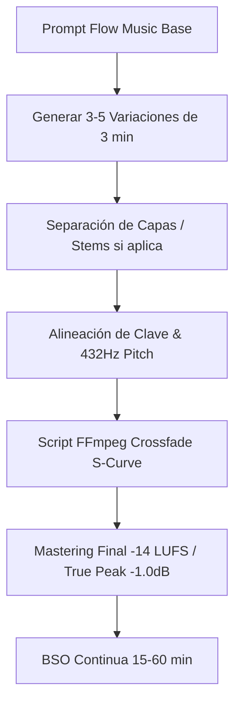

# Guía: BSO Ambient de Larga Duración para Tours y Documentales

## 1. Principios de Composición para BSO Ambient Continua
Para vídeos de 10 a 60 minutos (walking tours, documentales históricos, paisajes tritemporales) la música no debe saturar ni fatigar el oído del espectador. Debe actuar como un **fondo hipnótico y atmosférico**.

### Reglas de Oro:
1. **Zero Harsh Transients**: Evitar cajas estridentes, bombos con golpe seco o platillos brillantes que distraigan la atención.
2. **Tonal Consistency**: Mantener afinaciones fundamentales estables (Cmaj, Dmin, Amin sintonizadas en 432Hz).
3. **Dynamic Pacing (Respiración Sonora)**: La energía sube y baja muy lentamente a lo largo de ciclos de 90 a 180 segundos.
4. **Seamless Stitching**: Generar segmentos con colas de reverb largas para permitir crossfades limpios de 4 a 8 segundos sin discontinuidad armónica.

---

## 2. Capas de la Mezcla Modular

| Capa | Rol | Instrumentos / Descriptores de Prompt | Rango Frecuencia |
| :--- | :--- | :--- | :--- |
| **Sub Drone (Base)** | Anclaje y relajación | Warm analog sub drones, 432Hz pure sine, low cello bow | 30Hz - 150Hz |
| **Mid Atmospheric Pads** | Color y emoción etérea | Shimmer pads, Rhodes filtrado, choir synth ambiental | 200Hz - 2.5kHz |
| **Spatial Foley / ASMR** | Realismo 3D e inmersión | Cobblestone footsteps, soft breeze, rain on leaves, gentle vinyl | 1kHz - 12kHz |
| **High Sparkle (Ethereal)** | Espacio y magia | Glass bells, subtle wind chimes, airy breath reverb | 8kHz - 18kHz |

---

## 3. Flujo de Trabajo para Generación en Lotes



---

## 4. Script de Crossfade Automatizado (FFmpeg)
Para encadenar clips generados de 3 minutos en una pista continua de larga duración sin cortes perceptibles:

```bash
# Ejemplo: Unir clip1.mp3 y clip2.mp3 con crossfade de 6 segundos
ffmpeg -i clip1.mp3 -i clip2.mp3 -filter_complex \
"[0:a][1:a]acrossfade=d=6:c1=exp:c2=exp[out]" \
-map "[out]" bso_continua_master.mp3
```