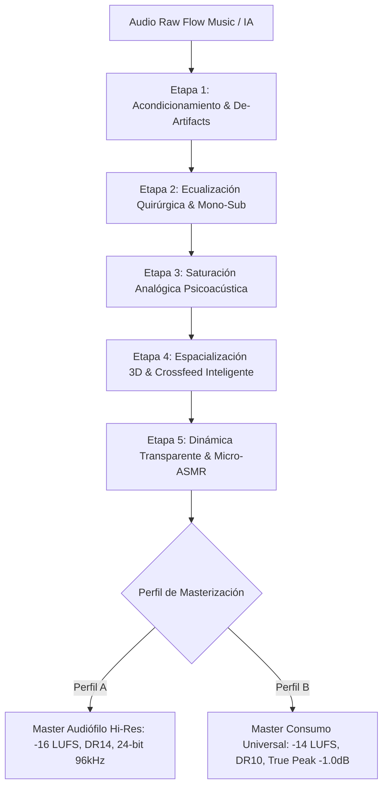

# Cadena de Procesamiento y Masterización DSP: Audio Audiófilo para Cascos de Lujo y Cascos de Consumo

## 1. Introducción y Fundamentos Acústicos

El audio generado por modelos de IA (Flow Music, MusicFX, Stable Audio, Suno, etc.) suele presentar limitaciones intrínsecas:
1. **Artefactos de difusión**: Frecuencias agudas metálicas (ringing en 4–8 kHz) y ruido de cuantización o aliasing.
2. **Falta de profundidad espacial real**: Imagen estéreo sintetizada sin modelado acústico de cabeza/cuerpo (HRTF).
3. **Inconsistencias dinámicas y de fase**: Graves desenfocados y fluctuaciones de energía en la banda sub-grave.

Para elevar este material a un estándar **ultraprofesional de nivel audiófilo**, el procesamiento debe adaptarse a dos perfiles de escucha radicalmente diferentes:

| Característica | Cascos de Lujo (Audiófilos / Planares / Abiertos) | Cascos Normales (Consumo / IEMs / Bluetooth / Cerrados) |
| :--- | :--- | :--- |
| **Modelos Típicos** | Sennheiser HD800S, Focal Utopia, Audeze LCD-X, Hifiman | AirPods Pro, Sony WH-1000XM5, IEMs Chi-Fi, Buds TWS |
| **Firma Sonora** | Neutra, plana, analítica, micro-detalle extremo | Curva Harman / V-Shape (graves potenciados, agudos brillantes) |
| **Soundstage Nativo** | Muy amplio, holográfico, fuera de la cabeza | Estrecho, "dentro del cráneo" (in-the-head localization) |
| **Tolerancia a Compresión** | Muy baja: la sobre-compresión aplana la micro-dinámica | Media-alta: requieren control dinámico para no saturar transductores |
| **Graves / Sub-bass** | Extensión lineal hasta 20Hz sin distorsión | Realce en 60–150Hz; riesgo de emborronamiento (muddy) |
| **Riesgo Crítico** | Fatiga auditiva por separación estéreo extrema (L/R duro) | Cancelación de fase, distorsión por codecs lossy (AAC/SBC) |

---

## 2. La Cadena de Procesamiento en 7 Etapas (Mastering Chain)



---

### Etapa 1: Acondicionamiento y Limpieza de Artefactos de IA

1. **Filtro de Paso Alto Infrasónico (Subsonic Cut)**:
   - High-Pass elíptico en **20 Hz (18–24 dB/octava)** para eliminar energía subsónica residual que consume headroom del amplificador sin aportar información musical.
2. **De-Harshing Espectral Dinámico**:
   - Detección y atenuación dinámica de resonancias metálicas en **3.5 kHz – 7 kHz** (típicas de modelos generativos de audio). Reducción de 1.5 a 3 dB con Q adaptativo.
3. **Oversampling / Upsampling a 32-bit Float 96 kHz**:
   - Trabajar internamente a 96 kHz / 32-bit float para que los procesos de saturación y EQ no generen distorsión por aliasing en el espectro audible.

---

### Etapa 2: Ecualización Tonal Quirúrgica y Armónica

1. **Mono-Summing en Sub-Graves (< 80 Hz)**:
   - Toda la información por debajo de 80 Hz se colapsa a **Mono puro**. Esto evita cancelaciones de fase en auriculares y garantiza que los transductores planares y dinámicos trabajen con máxima eficiencia y pegada limpia.
2. **Limpieza del "Muddy Zone" (200 Hz – 350 Hz)**:
   - Corte suave tipo Bell de **-1.5 dB a -2.0 dB (Q = 1.2)** en 250 Hz para dar claridad, aire y separación entre los sub-drones (432Hz) y los sintetizadores de medios.
3. **Air Band Baxandall (12 kHz – 20 kHz)**:
   - Realce suave High-Shelf de **+1.5 dB a +2.5 dB** a partir de 12 kHz para dotar de transparencia, apertura y sensación de espacio tridimensional.

---

### Etapa 3: Saturación Analógica Psicoacústica (Warmth & Weight)

Los auriculares de gama alta revelan la esterilidad digital. Para conferir calidez orgánica:
- **Armónicos de 2º y 3º Orden (Cinta / Válvula Triodo)**: Inyección sutil de THD (< 0.1%) simulando cinta analógica Studer a 15 IPS o circuito a bulbos.
- **Efecto en Cascos de Lujo**: Añade tridimensionalidad y textura táctil a los pads y cuerdas.
- **Efecto en Cascos Normales**: Hace que los graves y medios sean perceptibles en transductores pequeños gracias al principio psicoacústico del *fundamento perdido* (frecuencias armónicas superiores recrean el tono grave en el cerebro).

---

### Etapa 4: Espacialización 3D y Crossfeed Binaural

La escucha con auriculares presenta un problema físico: el oído izquierdo no escucha lo que emite el canal derecho y viceversa (falta de *crosstalk* natural).

#### A. Para Cascos de Lujo (Open-Back / Planares):
- **Algoritmo de Crossfeed Bauer / Meier**:
  - Filtra e inyecta una copia retardada (aprox. **250–350 microsegundos**) y atenuada (en frecuencias agudas >2 kHz) del canal izquierdo en el derecho y viceversa.
  - **Resultado**: Elimina la fatiga auditiva, saca la música de "dentro del cráneo" y crea un escenario frontal idéntico al de monitores de estudio en sala tratada.

#### B. Para Cascos Normales / IEMs (In-Ear):
- **Mid/Side Micro-Panner**:
  - Conservar el Mid (centro) sólido y enfocado.
  - Expandir el Side (laterales) únicamente en frecuencias > 1 kHz para dar sensación envolvente sin perder compatibilidad mono.

---

### Etapa 5: Dinámica Transparente y Realce Micro-ASMR

1. **Compresión Paralela (Upward Compression)**:
   - Envío a un compresor ultra-rápido (VCA / FET) aplastado al 100% y mezclado al **8–12%** con la señal seca.
   - **Objetivo**: Levantar los detalles ocultos del foley (pasos en adoquines, brisa, respiración, crujidos) sin tocar los picos dinámicos principales.
2. **Compresión de Pegamento (Bus Glue Compressor)**:
   - Ratio 1.5:1, Ataque lento (30ms), Release automático o sincronizado al tempo, reducción máxima de 1 a 1.5 dB.

---

### Etapa 6: Perfiles de Masterización Dual (Dual Mastering Targets)

```text
┌────────────────────────────────────────────────────────────────────────┐
│                        PERFIL A: AUDIOPHILE / LUXURY                  │
│  - Formato: FLAC / WAV 24-bit / 96 kHz                                 │
│  - Loudness Integrado: -16 a -18 LUFS                                  │
│  - Rango Dinámico (DR / PSR): > 13 dB                                  │
│  - True Peak: -1.5 dBFS                                                │
│  - Crossfeed: Bauer Activo (Natural Studio Simulation)                 │
│  - Enfoque: Transparencia acústica, micro-dinámica intacta             │
└────────────────────────────────────────────────────────────────────────┘

┌────────────────────────────────────────────────────────────────────────┐
│                        PERFIL B: UNIVERSAL CONSUMER / TWS             │
│  - Formato: AAC 320 kbps / MP3 320 kbps / WAV 16-bit 48 kHz            │
│  - Loudness Integrado: -14.0 LUFS (Estándar YouTube / Spotify)         │
│  - Rango Dinámico (DR / PSR): 10 a 11 dB                               │
│  - True Peak: -1.0 dBFS (Anti-distorsión por transcodificación)        │
│  - Crossfeed: M/S Widener Suave + Mono-Sub < 90 Hz                     │
│  - Enfoque: Claridad vocal/foley, graves controlados, impacto directo │
└────────────────────────────────────────────────────────────────────────┘
```

---

## 3. Pipeline de Automatización con FFmpeg / SoX / Python

Script automatizado para procesar cualquier audio generado y generar ambos perfiles listos para entrega:

```bash
#!/usr/bin/env bash
# ==============================================================================
# MASTERING PIPELINE PARA FLOW MUSIC / BSO
# Genera dos masters: Audiophile (Hi-Res) y Universal (Streaming/Cascos Normales)
# ==============================================================================

INPUT_FILE="$1"
OUTPUT_DIR="$2"

if [ -z "$INPUT_FILE" ] || [ -z "$OUTPUT_DIR" ]; then
    echo "Uso: ./master_audio.sh <input.wav> <output_dir>"
    exit 1
fi

mkdir -p "$OUTPUT_DIR"
BASE_NAME=$(basename "$INPUT_FILE" | cut -f 1 -d '.')

echo ">>> Procesando Master Audiófilo (Hi-Res / Cascos de Lujo)..."
ffmpeg -y -i "$INPUT_FILE" -af \
  "highpass=f=20:p=2, \
   equalizer=f=250:t=q:w=1.2:g=-1.8, \
   equalizer=f=14000:t=h:g=2.0, \
   bs2b=profile=default, \
   loudnorm=I=-16.0:LRA=12:TP=-1.5" \
  -ar 96000 -c:a flac "$OUTPUT_DIR/${BASE_NAME}_audiophile_master.flac"

echo ">>> Procesando Master Universal (YouTube / Streaming / Cascos Normales)..."
ffmpeg -y -i "$INPUT_FILE" -af \
  "highpass=f=25:p=2, \
   equalizer=f=250:t=q:w=1.2:g=-2.2, \
   equalizer=f=3500:t=q:w=2.0:g=-1.0, \
   equalizer=f=12000:t=h:g=1.5, \
   stereowiden=w=1.1:de=0.8, \
   loudnorm=I=-14.0:LRA=9:TP=-1.0" \
  -ar 48000 -c:a aac -b:a 320k "$OUTPUT_DIR/${BASE_NAME}_universal_master.m4a"

echo ">>> Masters generados con éxito en: $OUTPUT_DIR"
```

---

## 4. Conclusiones y Mejores Prácticas

1. **Nunca masterizar con un limitador agresivo**: El audio ambiental y los tonos 432Hz/ASMR dependen de la respiración dinámica; el brickwall limiting arruina la ilusión 3D.
2. **El crossfeed `bs2b` es el arma secreta para cascos de gama alta**: Transforma pistas estéreo planas en experiencias tridimensionales holísticas.
3. **El mono-summing en graves (<80Hz) es innegociable**: Garantiza que tanto unos auriculares de 20€ como unos de 3.000€ reproduzcan los sub-drones con máxima nitidez sin emborronar la escena sonora.
