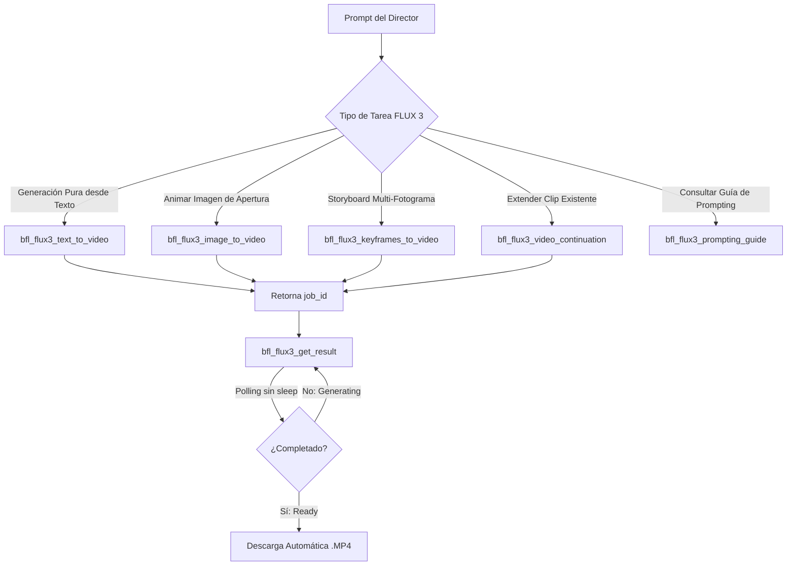

# ⚡ Guía Maestra Operativa: FLUX 3 (Black Forest Labs) & Video Diffusion

> **Ubicación:** `docs/investigaciones/nodos_capacidades/flux3/01_guia_maestra_operativa_flux3.md`  
> **Motor:** FLUX 3 Video Diffusion (Black Forest Labs)  
> **Integración:** Hermes Tools & Replicate H100 / ZeroGPU  

---

## 1. Visión General y Capacidades de FLUX 3

FLUX 3 representa el estado del arte en generación de vídeo fotorrealista y cinemático mediante modelos de difusión latente y arquitecturas de transformadores de rectificación de flujo (Flow Matching). Permite la creación de planos cinematográficos con movimiento coherente, texturas físicas analógicas (grano Kodak 35mm, lentes anamórficas), física de iluminación realista y generación sincronizada de audio atmosférico.

### 🌟 Puntos Fuertes de FLUX 3
- **Generación Text-to-Video, Image-to-Video y Keyframes-to-Video** en resolución nativa 720p a 24 fps.
- **Continuación de vídeo fluida** encadenando segmentos desde el último fotograma del clip anterior.
- **Audio sincronizado nativo** generado conjuntamente con el movimiento visual.
- **Storyboarding preciso por fotogramas clave** (1 a 10 imágenes fijadas a índices específicos de fotogramas a 24fps).
- **Cero artefactos plásticos de CGI** cuando se emplean descriptores ópticos y químicos analógicos.

---

## 2. Catálogo de Herramientas Hermes para FLUX 3

Hermes cuenta con 6 herramientas nativas especializadas para operar FLUX 3 sin necesidad de gestionar manualmente llamadas HTTP de bajo nivel:



### Tabla de Herramientas y Parámetros

| Herramienta | Parámetros Clave | Descripción y Uso |
| :--- | :--- | :--- |
| `bfl_flux3_text_to_video` | `prompt`, `aspect_ratio`, `duration` (5-20s), `resolution` (`720p`), `generate_audio` (bool), `grounding` (bool), `seed` | Genera vídeo + audio desde cero basado exclusivamente en la descripción en lenguaje natural. |
| `bfl_flux3_image_to_video` | `prompt`, `input_image` (path o URL), `aspect_ratio`, `duration`, `generate_audio`, `grounding`, `seed` | Toma una imagen como el fotograma exacto 0 y genera el movimiento continuo hacia adelante. |
| `bfl_flux3_keyframes_to_video` | `prompt`, `input_images` (1-10 imágenes), `keyframe_indices` (0 a 480 @ 24fps), `duration` (5, 10, 15, 20s), `aspect_ratio`, `generate_audio` | Fija imágenes en fotogramas específicos a 24fps; la IA interpola el movimiento y las transiciones entre ellas. |
| `bfl_flux3_video_continuation` | `prompt` (*"Continue this video from its final frames:..."*), `input_video` (max 15s, <50MB), `duration` (5-15s), `aspect_ratio`, `generate_audio` | Extiende un vídeo previo a partir de sus últimos fotogramas manteniendo sujeto y continuidad. |
| `bfl_flux3_get_result` | `id` (job_id), `save_to` (directorio o path opcional) | Realiza polling del trabajo hasta que finaliza y descarga automáticamente el vídeo a disco. |
| `bfl_flux3_prompting_guide` | *(Sin argumentos)* | Devuelve la guía de prompting oficial y mejores prácticas de grounding. |

---

## 3. Fórmula Canónica de Prompting para FLUX 3 (7 Dimensiones)

Para obtener resultados fotorrealistas sin aspecto artificial ni deformaciones, el prompt debe ordenarse siguiendo la **Estructura Canónica en 7 Bloques**:

$$\text{Prompt} = \mathbf{Sujeto} + \mathbf{Detalle Visual} + \mathbf{Acción/Movimiento} + \mathbf{Cámara} + \mathbf{Iluminación} + \mathbf{Entorno} + \mathbf{Audio} + \mathbf{Estilo Óptico}$$

```text
[1. Sujeto Principal]: An elderly Japanese cyber-artisan in a high-tech workshop...
[2. Detalles Visuales Específicos]: Weathered hands with micro-cybernetic knuckles, wearing a dark canvas apron...
[3. Acción y Movimiento]: Meticulously soldering a glowing neon holographic crystal, steady calm breathing...
[4. Cámara y Óptica]: 35mm anamorphic prime lens, slow push-in dolly shot at eye level, shallow depth of field (f/1.8)...
[5. Iluminación y Colorimetría]: Warm amber tungsten desk lamp contrasting with cool cyan neon backlight, volumetric dust motes...
[6. Entorno y Atmósfera]: Rainy Neo-Tokyo alley visible through wet textured glass in the background...
[7. Audio Sincronizado]: Soft electric solder hum, gentle rain against glass, faint distant maglev train rumble, no music...
[8. Estilo y Quimiometría]: Kodak Vision3 500T 35mm film grain, photorealistic documentary look, zero CGI sheen.
```

> [!IMPORTANT]
> **Palabras Prohibidas (Anti-CGI)**: Nunca uses términos como *"Unreal Engine"*, *"8K"*, *"Octane Render"*, *"hyperrealistic CGI"* ni *"trending on ArtStation"*. Estos términos fuerzan al modelo hacia estética de videojuego plástico. En su lugar usa términos ópticos reales: *"shot on Arri Alexa Mini LF"*, *"Kodak 35mm film stock"*, *"subsurface skin scattering"*, *"natural motion blur"*.

---

## 4. Keyframing y Storyboarding a 24 FPS

Al utilizar `bfl_flux3_keyframes_to_video`, debes calcular los índices de fotogramas exactos multiplicando los segundos por 24:

| Tiempo en Segundos | Índice de Fotograma (24 fps) | Ejemplo de Plano (Shibuya 2326) |
| :---: | :---: | :--- |
| **0.0 s** | `0` | Fotograma inicial: Plano aéreo general a 150m de altura |
| **3.0 s** | `72` | Descenso vertical por el cañón holográfico |
| **6.0 s** | `144` | Nivel peatonal: Cruce de Shibuya futurista |
| **10.0 s** | `240` | Plano detalle medio: Mirada del transeúnte con implante ocular |
| **15.0 s** | `360` | Pitch-up final hacia la torre central |

> [!TIP]
> **Consistencia de Sujetos en Keyframes**: Genera los fotogramas clave con un generador consistente como **NanoBanana Pro 2 (Imagen 3)** o **FLUX 3 Image** manteniendo el mismo seed base y descripción de vestuario/arquitectura antes de alimentarlos a `bfl_flux3_keyframes_to_video`.

---

## 5. Pipeline de Escalado Local en CPU (720p ➔ 1080p / 4K UHD)

Para optimizar costes ($0.48 en 720p draft en vez de $4.00 por render 4K nativo), VideoPro procesa el escalado en el servidor VPS mediante filtros de interpolación lanczos y texturizado de grano:

```bash
# Escalado de alta calidad a 1080p FHD con preservación de grano
ffmpeg -y -i input_720p.mp4 -vf \
  "scale=1920:1080:flags=lanczos, \
   unsharp=lx=5:ly=5:la=0.6:cx=5:cy=5:ca=0.0, \
   noise=c1s=4:c1f=t+u" \
  -c:v libx264 -preset slow -crf 18 -c:a copy output_1080p.mp4

# Escalado a 4K UHD (3840x2160 @ 147 Mbps)
ffmpeg -y -i input_720p.mp4 -vf \
  "scale=3840:2160:flags=lanczos, \
   unsharp=lx=5:ly=5:la=0.8:cx=5:cy=5:ca=0.0" \
  -c:v libx264 -preset slow -crf 16 -c:a copy output_4k.mp4
```

---

## 6. Documentos y Referencias Relacionadas

- [Índice de Investigaciones FLUX 3](file:///home/ubuntu/workspace/pro/hermes/10_videopro/docs/investigaciones/nodos_capacidades/flux3/00_INDICE_FLUX3.md)
- [Diagnóstico de Inferencia y Audio Sync](file:///home/ubuntu/workspace/pro/hermes/10_videopro/docs/investigaciones/nodos_capacidades/flux3/investigacion_flux3_audio_sync.md)
- [Guía Maestra de Upscale CPU](file:///home/ubuntu/workspace/pro/hermes/10_videopro/docs/investigaciones/nodos_capacidades/flux3/08_guia_maestra_flux3_upscale_cpu.md)
- [Metodología Anti-CGI y Consistencia Facial](file:///home/ubuntu/workspace/pro/hermes/10_videopro/docs/investigaciones/nodos_capacidades/flux3/09_metodologia_anti_cgi_y_consistencia_facial.md)
