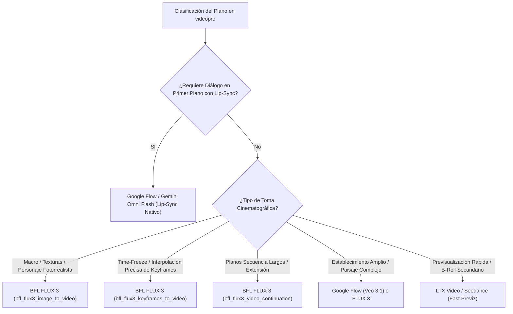

# ⚖️ BENCHMARK TÉCNICO Y MATRIZ DE DECISIÓN: GOOGLE FLOW vs. BFL FLUX 3

Este informe técnico analiza las capacidades, rendimiento, estabilidad en VPS y viabilidad económica de los dos motores de vídeo de referencia en **videopro**: **Google Flow (Gemini Omni Flash)** y **BFL FLUX 3 (Nous Research / Hermes Video Kit)**.

---

## 1. COMPARATIVA TÉCNICA DETALLADA

| Dimensión / Criterio | Opción A: Google Flow (Gemini Omni Flash) | Opción B: BFL FLUX 3 (API Nous Research) | Opción C: LTX Video / Seedance (Local/Previz) |
| :--- | :--- | :--- | :--- |
| **Arquitectura de Ejecución** | Headless Browser (Playwright + CDP + Xvfb) | Backend REST API nativo (Hermes Video Kit) | Servidor Local PyTorch / ComfyUI |
| **Infraestructura Requerida** | VPS Linux con Chromium + display virtual Xvfb | Microservicio ligero Python/HTTP | Servidor con GPU NVIDIA dedicada (24GB+ VRAM) |
| **Inyección de Referencias** | Slots de Ingredientes (`@character`, `<FIRST_FRAME>`, `<IMAGE_REF_0..5>`) | Keyframes indexados a 24fps + Imagen en Frame 0 | Latent Conditioning Frame 0 + IP-Adapter |
| **Control de Cámara** | Trazos vectoriales en Canvas WebGL | Vectores de movimiento parametrizados por API | LoRAs de cámara / CameraCtrl |
| **Lip-Sync Integrado** | **Nativo y Multimodal** (`Dialogue: "..."`) | **No** (Requiere pipeline desacoplado) | **No** (Solo vídeo) |
| **Renderizado de Audio** | **Nativo** (FX + Diálogo estéreo 48kHz) | **No** (Requiere TTS + Remotion/FFmpeg) | **No** (Mudo) |
| **Fidelidad Anatómica y Grano** | Media-Alta (Tendencia a suavizado) | **Máxima** (DiT state-of-the-art, grano 35mm) | Media (Rápido, artefactos en manos/rostros) |
| **Adherencia Óptica/Prompt** | Alta (Comprende terminología de lente) | **Extrema** (T5-XXL + CLIP prompt fidelity) | Media-Baja (Requiere prompts condensados) |
| **Estabilidad y Uptime** | **Baja-Media** (Sensible a cambios en DOM y 2FA) | **Extrema (99.9% uptime, determinista)** | **Total** (Bajo control local) |
| **Latencia por Toma (10s)** | 60s – 300s (Dependiente de cola Labs) | 25s – 45s (Inferencia predecible) | 5s – 15s (Inferencia ultra-rápida) |
| **Coste Operativo** | Fijo con Gemini Ultra (~21,99 €/mes) / Cuotas | Pago por uso (Pay-as-you-go) por segundo | Coste fijo de servidor bare-metal / $0 marginal |

---

## 2. ANÁLISIS DE LA OPCIÓN A: GOOGLE FLOW (GEMINI OMNI FLASH)

### Ventajas Clave
1. **Sincronización Labial Nativa (*Zero-Shot Phoneme Alignment*):**
   - Al procesar `Dialogue: "..."`, el modelo genera simultáneamente la voz sintética y los movimientos musculares, fonemas, lengua y microexpresiones faciales en perfecta sincronía cuadro a cuadro a 24fps, sin necesidad de herramientas externas como Wav2Lip o SadTalker.
2. **Audio Ambiental Integrado:**
   - Genera pistas de audio estéreo a 48kHz directamente correlacionadas con la física del vídeo (lluvia, motores, pasos, atmósfera).
3. **Coste Mensual Predecible:**
   - La suscripción a Gemini Ultra / Google One AI Premium permite un volumen de generación elevado con coste fijo mensual.

### Riesgos y Puntos Débiles
1. **Fragilidad de la Automatización Web:** Los cambios no anunciados en la UI de Google Labs (clases CSS ofuscadas, mutaciones del Shadow DOM) pueden romper los scripts de Playwright.
2. **Detección de Bots y Desafíos OAuth:** Riesgo de activación de reCAPTCHA o invalidación de tokens de sesión que requieran intervención interactiva.
3. **Variabilidad en Colas de Render:** Tiempos de espera que pueden superar los 300s por clip bajo alta demanda.

---

## 3. ANÁLISIS DE LA OPCIÓN B: BFL FLUX 3 (API NOUS RESEARCH)

### Ventajas Clave
1. **Integración API REST Pura (Zero-GUI):**
   - Sin dependencias de navegadores ni display servers. Invocación limpia y concurrente mediante las herramientas nativas de Hermes (`bfl_flux3_image_to_video`, `bfl_flux3_keyframes_to_video`, `bfl_flux3_video_continuation`).
2. **Control Determinista por Keyframes:**
   - Permite fijar un mapa temporal de fotogramas ($\mathcal{K} = \{(t_0, \mathbf{I}_0), (t_{24}, \mathbf{I}_1), \dots\}$) garantizando transiciones libres de parpadeo (*flickering*).
3. **Calidad de Textura y Grano Fílmico:**
   - Arquitectura Diffusion Transformer (DiT) con reproducción fidedigna de emulsión analógica Kodak Vision3, porosidad de la piel y detalles anatómicos sin deformaciones.

### Riesgos y Puntos Débiles
1. **Ausencia de Audio Nativo:** Requiere sintetizar el voiceover previamente con TTS (`VibeVoice` / `ElevenLabs` / `Edge-TTS`) y ensamblar la banda sonora en postproducción.
2. **Resolución Nativa 720p:** Requiere una etapa de upscaling posterior (Pillow/Real-ESRGAN/FFmpeg) para exportaciones finales a 1080p/4K.

---

## 4. MATRIZ DE DECISIÓN CINEMATOGRÁFICA (ENRUTAMIENTO HÍBRIDO)

### Reglas de Enrutamiento por Tipo de Plano:
* **Diálogos a Cámara (Talking Head):** $\rightarrow$ **Google Flow (Gemini Omni Flash)** por su sincronización fonética impecable.
* **Primeros Planos Dramáticos (Close-Up / ECU):** $\rightarrow$ **BFL FLUX 3** por fidelidad micro-textural en ojos, piel y luz.
* **Acción Rápida o Time-Freeze:** $\rightarrow$ **BFL FLUX 3 Keyframes** para fijar la trayectoria espacial sin deformación anatómica.
* **Paisajes Monumentales / Macro Escenarios:** $\rightarrow$ **FLUX 3** o **Google Flow (Veo 3.1)**.
* **Previsualización de Storyboard (Fast Previz):** $\rightarrow$ **LTX Video / Seedance** para validar ritmo y encuadre a coste cero.

---

## 5. CONCLUSIÓN ARQUITECTÓNICA

La estrategia ganadora para `videopro` es la **Arquitectura Híbrida Inteligente**:
1. **80% del Metraje (Planos cinemáticos, b-roll y macro):** Generado con **BFL FLUX 3 vía API** por su estabilidad 24/7 en VPS, determinismo y textura fílmica.
2. **20% del Metraje (Planos con habla a cámara):** Dirigido a **Google Flow (Gemini Omni Flash)** para aprovechar el lip-sync nativo con fallback automático en caso de timeout.
3. **Masterización Unificada:** Ensamblaje en **Remotion / MoviePy 2.x + FFmpeg** con normalización de audio a -14 LUFS y *ducking* dinámico de -18dB.
