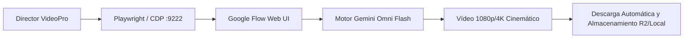

# 🎬 Guía Maestra: Google Flow Web & Automatización Desatendida CDP

> **Ubicación:** `docs/investigaciones/nodos_capacidades/google-flow-web/01_guia_maestra_google_flow_web_y_cdp.md`  
> **Plataforma:** Google Flow Web (`flow.google.com`)  
> **Motor Preferido:** Gemini Omni Flash (`gemini-omni-flash-preview`)  
> **Protocolo de Control:** Chrome DevTools Protocol (CDP `:9222`) / Playwright  

---

## 1. Visión General de Google Flow

**Google Flow** es el entorno cinematográfico basado en web de Google para la generación de vídeo de alta fidelidad, control de movimiento de cámara 3D, animación de personajes y consistencia de escena. VideoPro interactúa con Google Flow de forma 100% desatendida a través de sesiones autenticadas de Chromium controladas por CDP.



---

## 2. Elección del Motor: Gemini Omni Flash vs Veo 3

En la arquitectura de VideoPro, **Gemini Omni Flash** es la elección obligatoria y óptima sobre Veo 3:

| Característica | Gemini Omni Flash (`gemini-omni-flash-preview`) | Veo 3 |
| :--- | :--- | :--- |
| **Velocidad de Generación** | ⚡ **Ultra-rápido (15–30 segundos por plano)** | Lento (2–4 minutos por plano) |
| **Control de Cámara FPV 6-DoF** | 🎯 **Precisión milimétrica en trayectorias 3D** | Movimientos genéricos con drift |
| **Consistencia Geométrica** | 🏛️ **Excelente preservación de arquitectura** | Deformaciones elásticas en planos largos |
| **Manejo de Texturas e Iluminación** | 💡 **Fotorrealismo cinematográfico sin brillo CGI** | Tendencia a sobre-saturar colores |
| **Consumo de Cuota / Créditos** | 📉 **Alta eficiencia operativa** | Alto consumo de cuota |
| **Preferencia del Sistema** | 🥇 **MOTOR OFICIAL DE VIDEOPRO** | 🚫 Descartado para flujos de producción |

---

## 3. Automatización Autónoma vía Playwright & CDP (`:9222`)

Google Flow no dispone de una API REST pública para usuarios individuales; toda la interacción se realiza acoplándose al puerto CDP de una instancia de Chrome con la sesión de Google ya iniciada.

### A. Inicialización del Navegador en el VPS
```bash
# Lanzar Chromium con soporte CDP en puerto 9222
google-chrome \
  --remote-debugging-port=9222 \
  --user-data-dir=/home/ubuntu/.config/google-chrome/Default \
  --disable-gpu \
  --no-sandbox \
  --headless=new &
```

### B. Script de Inyección y Generación con Playwright
```python
import asyncio
from playwright.async_api import async_playwright

async def generate_google_flow_scene(prompt: str, reference_image_path: str = None):
    async with async_playwright() as p:
        # Conexión al navegador existente con sesión activa
        browser = await p.chromium.connect_over_cdp("http://localhost:9222")
        context = browser.contexts[0]
        page = await context.new_page()
        
        await page.goto("https://flow.google.com/studio", wait_until="networkidle")
        
        # 1. Seleccionar motor Gemini Omni Flash
        model_dropdown = page.locator("button[aria-label*='Model Selection']")
        if await model_dropdown.is_visible():
            await model_dropdown.click()
            await page.locator("text=Gemini Omni Flash").click()
        
        # 2. Inyectar fotograma de referencia si existe
        if reference_image_path:
            upload_input = page.locator("input[type='file'][accept*='image']")
            await upload_input.set_input_files(reference_image_path)
            await page.wait_for_selector(".image-preview-thumbnail", timeout=15000)
            
        # 3. Escribir prompt cinemático
        prompt_box = page.locator("textarea[placeholder*='Describe your scene']")
        await prompt_box.fill(prompt)
        
        # 4. Iniciar render
        generate_btn = page.locator("button:has-text('Generate')")
        await generate_btn.click()
        
        # 5. Esperar finalización y capturar URL del vídeo
        video_element = page.locator("video[src*='googlevideo.com'], video[src*='blob:']")
        await video_element.wait_for(state="visible", timeout=120000)
        
        video_url = await video_element.get_attribute("src")
        print(f"Vídeo generado con éxito: {video_url}")
        
        await page.close()
        return video_url

if __name__ == "__main__":
    prompt_test = (
        "Cinematic FPV drone shot flying through ancient cobblestone streets of Toledo at dusk. "
        "Warm 432Hz ambient light, volumetric mist, photorealistic 35mm lens, f/2.0, zero CGI sheen."
    )
    asyncio.run(generate_google_flow_scene(prompt_test))
```

---

## 4. Estructura de Prompts para Google Flow (Cámara y Cinemática)

Google Flow responde con extrema fidelidad a descriptores físicos de cámara y vectores de movimiento:

```text
[Cámara / Lente]: Shot on Arri Alexa Mini LF, 28mm anamorphic prime lens, T1.9 aperture.
[Movimiento 6-DoF]: Continuous smooth forward glide at 1.5 meters height, gentle pan right to reveal the cathedral facade.
[Iluminación]: Golden hour direct sidelight with long dramatic shadows, soft warm bounce from limestone walls.
[Sujeto & Entorno]: Historic Gothic plaza with damp textured cobblestones reflecting amber light, distant pigeons taking flight.
[Física de Color & Grano]: Kodak Vision3 250D color science, subtle optical halation around lanterns, natural motion blur.
```

---

## 5. Protocolo de Consistencia de Fotograma a Fotograma

Para mantener la coherencia en secuencias de múltiples planos:
1. **Fotograma de Anclaje (Anchor Frame)**: El fotograma final del Plano N se extrae vía FFmpeg (`ffmpeg -sseof -1 -i plano1.mp4 -vframes 1 frame_anchor.png`).
2. **Inyección en Plano N+1**: Se sube `frame_anchor.png` como imagen de referencia de apertura para el siguiente plano.
3. **Mantenimiento de Seed**: Mantener el seed o añadir en el prompt descriptores fijos del entorno (`"same limestone architecture, identical dusk lighting and atmospheric haze"`).

---

## 6. Documentos y Referencias Relacionadas

- [Integración Google Flow Web y Consistencia](file:///home/ubuntu/workspace/pro/hermes/10_videopro/docs/investigaciones/05_integracion_google_flow_web_y_consistencia.md)
- [Arquitectura FPV Tours & Storytelling Urbano](file:///home/ubuntu/workspace/pro/hermes/10_videopro/docs/investigaciones/06_arquitectura_fpv_tours_storytelling_urbano.md)
- [Metodología Documental Cinematográfica](file:///home/ubuntu/workspace/pro/hermes/10_videopro/docs/investigaciones/01_metodologia_documental_cinematografica.md)
