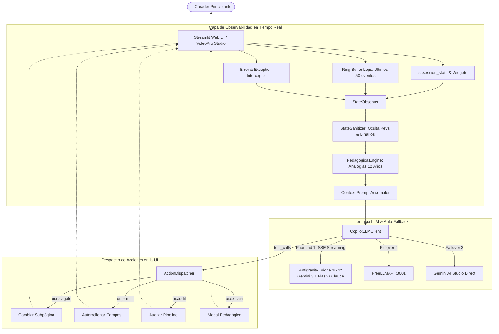

# 🤖 Copilot Agéntico Universal y Observabilidad en Tiempo Real en VideoPro Studio

> **Pilar:** `02_canales_youtube` / `autoasistencia_ia_y_ux_guiada`  
> **Estado:** `🟢 ESPECIFICACIÓN TÉCNICA ACTIVA`  
> **Arquitectura:** Hermes Agent Copilot Engine v3.0  
> **Conectividad:** Antigravity Proxy (:8742) / Gemini 3.6 Flash / FreeLLMAPI (:3001)

---

## 🎯 1. Diagnóstico: El Reto de la Autoasistencia en Suites Complejas

Al interactuar con suites de generación de vídeo, automatización de YouTube y orquestación multimodal, el usuario novato suele sentirse abrumado ante términos técnicos (*ACEScg, Sidechain Ducking -18dB, 6-DoF, RPM Tier 1, Prompting 7 Capas*).

Para transformar a cualquier principiante en un creador autónomo, se ha desarrollado el **Copilot Agéntico Universal**: un asistente interactivo contextual que:
1. **"Ve" en tiempo real la pantalla activa** (inspección no invasiva de `st.session_state`, formularios, errores y logs en buffer).
2. **Responde en lenguaje pedagógico ultra-simple** ("explicado para 12 años") utilizando analogías cotidianas para conceptos complejos.
3. **Es un Agente Actuador (UI Action Agent):** No solo habla; puede ejecutar acciones en la interfaz con confirmación humana (*Human-in-the-Loop*).
4. **Está disponible con 1 clic en todas las páginas** mediante un botón flotante y un Drawer lateral Glassmorphism.



---

## 🛰️ 2. Observabilidad en Tiempo Real (`app/core/copilot/state_observer.py`)

### A. Anatomía del Contexto de Pantalla
El observador extrae periódicamente:
- **Vista y Subpestaña Actual:** `active_view`, `active_subtab`, `active_scene_index`.
- **Valores de Formulario:** Prompts, relación de aspecto, duración, voces seleccionadas y campos modificados (`dirty_fields`).
- **Registro de Consola en Memoria:** `StreamlitLogRingBuffer` mantiene los últimos 50 logs para diagnosticar errores sin pedirle al usuario que abra la consola.
- **Detector de Errores con Analogías Pedagógicas:**

| Error Críptico Real | Analogía Pedagógica (12 Años) | Solución Guiada en 1 Clic |
| :--- | :--- | :--- |
| `CUDA out of memory (OOM)` | *"La mesa de dibujo de la tarjeta gráfica se llenó porque intentamos pintar un lienzo gigante."* | Reducir resolución de 1080p a 720p o bajar duración de escena a 4s. |
| `HTTP 429 Rate Limit` | *"El camarero de la cocina de IA está atendiendo a mucha gente y nos pide esperar 1 minuto."* | Esperar 30s o conmutar al motor de voz local Kokoro. |
| `FFmpeg Non-Zero Exit Code` | *"Una de las fotos del álbum tenía pegamento arrugado y el ensamblador no pudo cerrarlo."* | Verificar pista BGM y asegurar que la locución terminó de grabarse. |
| `Voice ID not found` | *"El actor de doblaje seleccionado no vino hoy al estudio."* | Seleccionar una voz estándar de la lista (`es_alvaro` o `af_sarah`). |

---

## ⚡ 3. Inferencia de Baja Latencia y Memoria Aislada (`app/core/copilot/llm_client.py`)

- **Latencia TTFT < 300ms:** Utiliza `httpx.AsyncClient` con HTTP/2, pooling de sockets y consumo de líneas SSE `data:`.
- **Aislamiento Estricto por Vista:** Las conversaciones en la pestaña de `youtube` no contaminan ni mezclan su contexto con las de `settings` o `timeline`. Cada una mantiene su memoria persistente en `storage/copilot_memory/`.
- **Filtrado de Latidos:** Elimina de forma invisible los latidos de sincronización `: keep-alive\n\n`.

---

## 🛠️ 4. Sistema de Acciones Asistidas / Tool Calling (`app/core/copilot/action_dispatcher.py`)

El Copilot cuenta con 4 herramientas maestras tipadas compatibles con OpenAI Functions:

1. `navigate_to_subpage(view, subpage)`: Transiciona la interfaz a la sección correcta cuando el usuario dice *"Llévame a configurar el audio"*.
2. `fill_channel_data(name, niche, rpm)`: Rellena formularios con proyecciones de negocio cuando el usuario dice *"Pon mi canal en el nicho de viajes con 22 RPM"*.
3. `run_pipeline_audit()`: Ejecuta la validación técnica completa del sistema y sintetiza los resultados.
4. `explain_metric(metric_name)`: Despliega una tarjeta modal interactiva con la fórmula matemática, umbrales recomendados y consejos de optimización.

---

## 🎨 5. Componente Visual Floating Drawer (`webui/components/copilot_drawer.py`)

El asistente se integra en cualquier vista Streamlit con **1 sola línea de código**:

```python
from webui.components.copilot_drawer import render_copilot_drawer

# Renderiza el disparador flotante y el drawer lateral
render_copilot_drawer(
    page_name="YouTube Monetization",
    page_context={"niche": "Viajes Temporales", "rpm_target": 22.50}
)
```

### Elementos Visuales del Drawer:
- **Badge de Estado Vivo:** Indicador pulsante verde (`Hermes Copilot SOTA`).
- **Tarjeta "¿Qué hace esta pantalla?":** Resumen de 2 frases comprensible al instante.
- **Pastillas de Acción Rápida (Quick Actions):** Botones con 1 clic para generar dossiers, prompts 7 capas o comprobar monetización.
- **Chat Interactivo:** Con streaming fluido de tokens y soporte Markdown.
