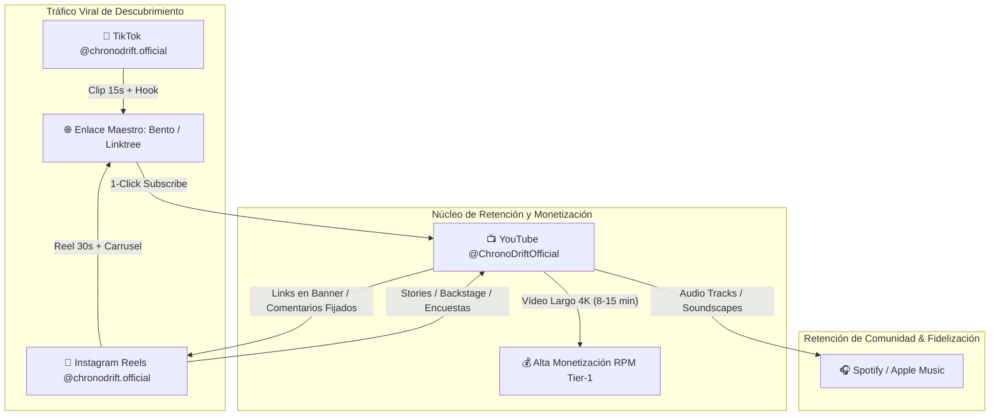

# 🌐 PLAN MAESTRO DE CREACIÓN DE CUENTAS: CHRONODRIFT
> **Ecosistema:** Gmail + YouTube + Instagram + TikTok  
> **Nicho:** Vuelos FPV Tritemporales por Ciudades del Mundo (1626 ➔ 2026 ➔ 2226)  
> **Objetivo:** Creación inmediata con textos 100% listos para **Copiar y Pegar**.

---

## 1. 📧 GMAIL (Cuenta Central y de Seguridad)

La cuenta de Google/Gmail será el núcleo administrativo que albergará el canal de YouTube, la consola de Google Cloud (si aplica), y los registros de verificación en Instagram y TikTok.

### A. Nombre de Usuario Sugerido (Jerarquía de Prioridad)
1. **Opción Principal:** `chronodrift.official@gmail.com`
2. **Opción Secundaria:** `chronodrift.studio@gmail.com`
3. **Opción Terciaria:** `chronodrift.flights@gmail.com`
4. **Opción Comercial:** `contact.chronodrift@gmail.com`

---

### B. Contraseñas Fuertes de Ejemplo (Estructura de Alta Seguridad)
> [!IMPORTANT]
> Utiliza una contraseña con más de 16 caracteres, combinación de mayúsculas, minúsculas, números y caracteres especiales. Guarda esta clave en un gestor seguro (Bitwarden / 1Password).

* **Ejemplo 1:** `Chr0n0Dr1ft#2226!Ultra4K`
* **Ejemplo 2:** `T1meWarp*Sum1da$1630_Tokyo!`
* **Ejemplo 3:** `Fl0wFPV@118bpm#Manhattan2026`

---

### C. Campos del Formulario de Registro (Texto Exacto)

| Campo | Texto Exacto a Introducir |
| :--- | :--- |
| **Nombre** | `Chrono` |
| **Apellidos** | `Drift` |
| **Nombre de Usuario** | `chronodrift.official` (o la opción disponible del listado) |
| **Fecha de Nacimiento** | Día/Mes/Año del titular legal (>18 años para habilitar monetización y AdSense sin bloqueos) |
| **Género** | `Prefiero no decirlo` o el del titular |
| **Teléfono de Recuperación** | *(Tu número móvil personal con 2FA SMS/App Authenticator)* |
| **Correo de Recuperación** | *(Tu correo personal principal para alertas de seguridad críticas)* |

---

### D. Pasos Post-Creación Inmediatos (Seguridad 2FA)
1. Entrar en `myaccount.google.com/security`.
2. Activar **Verificación en dos pasos (2FA)**.
3. Añadir **Google Authenticator** o **YubiKey/Passkey**.
4. Descargar y guardar los **10 códigos de respaldo (Backup Codes)** en un archivo cifrado o físico.

---

---

## 2. 📺 YOUTUBE (@ChronoDriftOfficial)

Configuración completa para el canal principal de YouTube dentro de YouTube Studio (`studio.youtube.com`).

### A. Parámetros de Identidad del Canal
* **Nombre del Canal:** `CHRONODRIFT`  
  *(Variante SEO opcional: `CHRONODRIFT - Urban Time Travel 4K`)*
* **Identificador (Handle):** `@ChronoDriftOfficial`  
  *(Alternativas en caso de no estar disponible: `@ChronoDriftStudio`, `@ChronoDrift4K`, `@ChronoDrift`)*

---

### B. Descripción del Canal (Texto Exacto Copiar-y-Pegar)
*Límite de YouTube: 1.000 caracteres. Optimizado con palabras clave SEO de alto RPM (Tier-1).*

```text
🏙️ Welcome to CHRONODRIFT — The 4K Tri-Temporal FPV Experience.

We travel through the past, present, and future of Earth’s greatest cities in one continuous, cinematic FPV flight. Experience history and future architecture backed by scientific urban data, historical blueprints, and 118 BPM Flow Chillhop soundscapes.

⏳ OUR 3-TIME FORMAT:
1️⃣ Past: Historical reconstructions (1600s – 1900s) based on vintage cartography and museum records.
2️⃣ Present: 4K 60FPS photorealistic urban flights.
3️⃣ Future: Science-backed mega-structures & arcologies (2100s – 2200s) designed with MIT Senseable City & climate modeling data.

🎧 AUDIO EXPERIENCE:
Every flight is tuned to 118 BPM Flow Lo-Fi & Darksynth for deep focus, relaxation, and late-night visual immersion. Perfect for 4K Smart TV living room viewing.

📅 New Tri-Temporal Flight every week. Subscribe and join the drift through time.

📩 Business & Licensing: chronodrift.official@gmail.com
🌐 All Links & Soundscapes: https://bento.me/chronodrift
```

---

### C. Sección "Detalles y Enlaces" (Banner & About Links)
Configurar en **YouTube Studio ➔ Personalización ➔ Información básica ➔ Enlaces**:

| Título del Enlace (Visible en Banner) | URL Exacta |
| :--- | :--- |
| `🌐 Portal & Socials` | `https://bento.me/chronodrift` *(o linktree)* |
| `📸 Instagram (Reels & 35mm)` | `https://instagram.com/chronodrift.official` |
| `📱 TikTok (Micro-Flights)` | `https://tiktok.com/@chronodrift.official` |
| `🎧 Spotify Soundscapes` | `https://open.spotify.com/artist/chronodrift` *(cuando esté activo)* |
| `☕ Apoya el Proyecto` | `https://patreon.com/chronodrift` *(o BuyMeACoffee)* |

* **Correo electrónico de contacto público:** `chronodrift.official@gmail.com`

---

### D. Configuración de Verificación del Canal (>15 min & Miniaturas)
Para subir vídeos de más de 15 minutos, miniaturas personalizadas y transmisiones en vivo:

1. Ve a **YouTube Studio ➔ Configuración (⚙️) ➔ Canal ➔ Disponibilidad de funciones**.
2. **Funciones Intermedias (Paso 1):**  
   * Hacer clic en **Verificar número de teléfono**.  
   * Introducir móvil y validar el código SMS de 6 dígitos.  
   * *Habilita:* Vídeos de >15 min, subida de miniaturas personalizadas de alta resolución (1280x720) y apelaciones de Content ID.
3. **Funciones Avanzadas (Paso 2):**  
   * Seleccionar **Verificación por vídeo** (grabar selfie de 30s mirando a la cámara) o **Documento de identidad válido** (foto de DNI/Pasaporte). Se aprueba en 24 horas.  
   * *Habilita:* Enlaces interactivos en las descripciones de Shorts, publicación de más vídeos diarios y solicitud de monetización YPP (YouTube Partner Program).

---

---

## 3. 📸 INSTAGRAM (@chronodrift.official)

Diseñado para maximizar retención visual, tráfico cruzado a YouTube y estética cinematográfica 35mm.

### A. Identidad de Perfil
* **Nombre de Usuario (@handle):** `@chronodrift.official` *(o `@chronodrift`)*
* **Nombre Público (Name):** `CHRONODRIFT 🏙️ Vuelos en el Tiempo 4K`
* **Categoría de Perfil:** `Creador de contenido digital` o `Producción audiovisual`

---

### B. Biografía de Instagram (Texto Exacto Copiar-y-Pegar)
*Límite: 150 caracteres. Formato vertical optimizado para smartphone con llamadas a la acción claras.*

```text
🏙️ Vuelos FPV en 3 Tiempos: 1626 ➔ 2026 ➔ 2226
⏳ Reconstrucciones históricas & Futuro en 4K
🎧 118 BPM Flow Beats para concentración
👇 Mira los Episodios Completos en YouTube
bento.me/chronodrift
```

---

### C. Link en Bio
* **URL Principal:** `https://bento.me/chronodrift` (o enlace directo: `https://youtube.com/@ChronoDriftOfficial?sub_confirmation=1`)

---

### D. 4 Historias Destacadas (Highlights) con Nombres y Portadas

1. **Destacado 1: 🛸 TOKIO**
   * **Nombre:** `Tokio ⏳`
   * **Contenido:** Clips del corte Edo 1630 vs Shibuya 2026 vs Neo-Tokyo 2226, encuestas interactivas (*"¿Vivirías en una torre flotante?"*), enlace directo al Episodio 01.
2. **Destacado 2: 🗽 NEW YORK**
   * **Nombre:** `NYC ⏳`
   * **Contenido:** Transición de Nieuw Amsterdam 1626 al Manhattan bioluminiscente 2226, comparativas de altura con el Empire State.
3. **Destacado 3: 🎧 SOUNDSCAPES**
   * **Nombre:** `Audio 118BPM`
   * **Contenido:** Muestras de la música Lo-Fi / Chillhop a 118 BPM sincronizada con los vuelos, stickers con enlaces a Spotify / YouTube Music.
4. **Destacado 4: 🔬 BACKSTAGE & TECH**
   * **Nombre:** `Backstage ⚡`
   * **Contenido:** Planos cartográficos del siglo XVII, datasets del MIT Senseable City, prompts y workflows de renderizado 4K.

---

### E. Estrategia del Grid Inicial: 9 Primeros Posts

```text
┌─────────────────────────┬─────────────────────────┬─────────────────────────┐
│ Post 01 (Reel)          │ Post 02 (Carrusel 35mm) │ Post 03 (Reel)          │
│ 🏙️ TOKIO 1630 vs 2226   │ 📜 Mapas Históricos Edo │ 🗽 NUEVA YORK 1626      │
│ (Picado 130 km/h)       │ vs Renders Futuro 2226  │ (Bosque Lenape ➔ 2226)  │
├─────────────────────────┼─────────────────────────┼─────────────────────────┤
│ Post 04 (Foto/Infog.)   │ Post 05 (Reel Central)  │ Post 06 (Carrusel)      │
│ 📊 Telemetría HUD &     │ 🎬 TRAILER OFICIAL      │ 🏛️ LONDRES 1610 vs 2226 │
│ Datos Científicos MIT   │ CHRONODRIFT 4K          │ (Puente Tudor ➔ Cúpula) │
├─────────────────────────┼─────────────────────────┼─────────────────────────┤
│ Post 07 (Reel)          │ Post 08 (Carrusel)      │ Post 09 (Reel Looper)   │
│ 🗼 PARÍS: Notre-Dame    │ 🎧 The 118 BPM Flow     │ 🌊 ÁMSTERDAM 4K:        │
│ envejeciendo 600 años   │ Playlist & Sound Design │ Canales 1650 vs 2226    │
└─────────────────────────┴─────────────────────────┴─────────────────────────┘
```

1. **Post 1 (Reel):** *Tokio Tritemporal.* Picado de la Torre de Tokio a 130 km/h cruzando el portal a 1630.
2. **Post 2 (Carrusel):** *Edo vs Neo-Tokyo.* 5 diapositivas comparando grabados japoneses de madera Ukiyo-e con renders hiperrealistas del año 2226.
3. **Post 3 (Reel):** *Wall Street en 3 Tiempos.* Bosque Lenape (1626) ➔ Rascacielos de Cristal (2026) ➔ Bioluminescent Dikes (2226).
4. **Post 4 (Diseño 35mm):** *Arquitectura del Tiempo.* Infografía de telemetría HUD con los datos de elevación y población estimada de las 3 eras.
5. **Post 5 (Reel - Vídeo Insignia):** *Trailer de Lanzamiento de CHRONODRIFT.* Supercut de 30 segundos con las 5 ciudades más icónicas al ritmo de 118 BPM.
6. **Post 6 (Carrusel):** *El Puente de Londres que ardió en 1666.* Recreación 3D del puente medieval con casas habitadas vs el Sky-Canopy del 2226.
7. **Post 7 (Reel):** *Notre-Dame de París.* Giro 360° viendo la piedra transformarse en 3 segundos.
8. **Post 8 (Carrusel Audio):** *¿Por qué 118 BPM es la frecuencia perfecta de Flow State?* Desglose del diseño sonoro.
9. **Post 9 (Reel Seamless Loop):** *Ámsterdam y el Mar.* Vuelo continuo a ras de agua desde 1650 hasta los diques cinéticos del 2226 (bucle perfecto).

---

---

## 4. 🎵 TIKTOK (@chronodrift.official)

Enfocado en retención inmediata, ganchos de 3 segundos y viralidad masiva hacia YouTube.

### A. Identidad de Perfil
* **Nombre de Usuario (@handle):** `@chronodrift` *(o `@chronodrift.official`)*
* **Nombre Público:** `CHRONODRIFT | Time Travel FPV`
* **Tipo de Cuenta:** `Cuenta de Empresa / Creador`

---

### B. Biografía de TikTok (Texto Exacto Copiar-y-Pegar)
*Límite: 80 caracteres. Directo, impactante y con llamado a la acción.*

```text
🏙️ Volando por el Pasado, Presente y Futuro en 4K.
👇 Episodios completos en YouTube:
youtube.com/@ChronoDriftOfficial
```

---

### C. Estrategia de Hashtags (Clasificación por Capas)

* **Hashtags de Marca / Core (Siempre presentes):**  
  `#chronodrift #timetravel #fpvdrone #4kdrone`
* **Hashtags de Nicho Urbano e Historia:**  
  `#historytok #futurecities #architecturetok #tokyo #nyc #london`
* **Hashtags de Estética y Chillhop:**  
  `#cinematic #lofihiphop #chillvibes #ambient #relaxingvideos`
* **Hashtags Algorítmicos de Alto Alcance:**  
  `#fyp #foryou #viral #satisfying #mindblown`

* **Fórmula de Copete para TikTok (Ejemplo exacto):**
  > *"¿Cómo se veía Tokio hace 400 años y cómo será en 200 años? 🏙️⏳ Vuelo completo en 4K en nuestro canal de YouTube. #chronodrift #tokyo #futurecities #timetravel #fyp #fpv"*

---

### D. 6 Ideas de Primeros Videos de Alto Rendimiento (Hooks & Formato)

1. **Video 1 (Gancho de Contraste Brutal - 20s):**
   * **Gancho Visual (0-2s):** Texto en pantalla: *"Así era Nueva York antes de que existiera un solo edificio (1626)"*.
   * **Desarrollo (3-15s):** Vuelo rasante por Manhattan virgen cruzando a Times Square 2026 y rematando en el año 2226 con rascacielos flotantes.
   * **CTA Final (16-20s):** *"¿Vivirías en 1626 o 2226? Episodio 4K en el link del perfil."*
2. **Video 2 (Test de Curiosidad / Open Loop - 15s):**
   * **Gancho:** *"El puente de Londres solía tener 200 casas encima... hasta que esto pasó."*
   * **Desarrollo:** Vuelo a 100 km/h entre las casas colgantes del puente Tudor de 1610.
3. **Video 3 (Experiencia Inmersiva Relajante - 30s):**
   * **Gancho:** *"Ponte auriculares. Vuelo nocturno por Neo-Tokyo 2226 a 118 BPM."*
   * **Desarrollo:** Vuelo hipnótico entre luces de neón y lluvia bioluminiscente con audio binaural.
4. **Video 4 (Misterio Histórico - 25s):**
   * **Gancho:** *"La Torre Eiffel en el año 2226 no es lo que esperas..."*
   * **Desarrollo:** Vuelo ascendente por una París reconvertida en bosque vertical bioclimático.
5. **Video 5 (Efecto Loop Infinito - 12s):**
   * **Gancho:** Vuelo atravesando un túnel de nubes en Ámsterdam que conecta el último fotograma con el primero de forma invisible. Retención >130%.
6. **Video 6 (Comparativa Rápida 3-Splitscreen - 18s):**
   * **Gancho:** Pantalla dividida en 3 franjas verticales: Pasado | Presente | Futuro avanzando a la misma velocidad por el río Sena en París.

---

---

## 5. 🔄 COORDINACIÓN Y CROSS-LINKING (Ecosistema Circular)

Estrategia para convertir cada visita en un suscriptor recurrente en todas las plataformas:



### A. Texto Exacto para Descripciones de YouTube (Plantilla Maestro Copiar-y-Pegar)
*Incluir este bloque al final de la descripción de cada vídeo publicado en YouTube:*

```text
━━━━━━━━━━━━━━━━━━━━━━━━━━━━━━━━━━━━━━━━
🌐 SÍGUENOS EN NUESTRO ECOSISTEMA:
━━━━━━━━━━━━━━━━━━━━━━━━━━━━━━━━━━━━━━━━
📸 Instagram: https://instagram.com/chronodrift.official
📱 TikTok: https://tiktok.com/@chronodrift.official
🎧 Soundscapes (118 BPM): https://bento.me/chronodrift
💬 Contacto comercial: chronodrift.official@gmail.com

🔔 Suscríbete para explorar más ciudades en el tiempo:
https://youtube.com/@ChronoDriftOfficial?sub_confirmation=1

#ChronoDrift #UrbanTimeTravel #FPV4K #FutureCities #History3D
```

---

### B. Texto Exacto para Comentario Fijado en YouTube (Pinned Comment)

```text
🏙️ ¿Qué ciudad te gustaría que visitemos en nuestro próximo vuelo tritemporal (Pasado ➔ Presente ➔ Futuro)? 

Déjanos tu propuesta abajo en los comentarios 👇
✨ Síguenos en Instagram (@chronodrift.official) para ver las reconstrucciones 35mm y material exclusivo.
```

---

### C. Configuración Recomendada de Link-in-Bio (Bento.me o Linktree)

* **Título:** `CHRONODRIFT 🏙️`
* **Subtítulo:** `Urban Time Travel & Future Cities (4K 60FPS)`
* **Botones Principales (En orden de prioridad):**
  1. `🔴 VER ÚLTIMO EPISODIO 4K EN YOUTUBE` ➔ *(URL del vídeo más reciente)*
  2. `🔔 SUSCRÍBETE AL CANAL DE YOUTUBE` ➔ `https://youtube.com/@ChronoDriftOfficial?sub_confirmation=1`
  3. `📸 SÍGUENOS EN INSTAGRAM` ➔ `https://instagram.com/chronodrift.official`
  4. `📱 SÍGUENOS EN TIKTOK` ➔ `https://tiktok.com/@chronodrift.official`
  5. `🎧 PLAYLIST 118 BPM FLOW SOUNDSCAPES` ➔ *(Enlace de lista de reproducción)*
  6. `📩 CONTACTO COMERCIAL` ➔ `mailto:chronodrift.official@gmail.com`

---

## ✅ CHECKLIST DE EJECUCIÓN INMEDIATA

- [ ] **Paso 1:** Crear cuenta Gmail `chronodrift.official@gmail.com` y activar 2FA.
- [ ] **Paso 2:** Crear canal de YouTube con el handle `@ChronoDriftOfficial` y pegar la descripción optimizada.
- [ ] **Paso 3:** Completar la verificación por SMS y por vídeo en YouTube Studio para desbloquear miniaturas personalizadas y vídeos >15 min.
- [ ] **Paso 4:** Crear perfil de Instagram `@chronodrift.official`, pegar la bio y configurar las 4 portadas de destacados.
- [ ] **Paso 5:** Crear perfil de TikTok `@chronodrift.official` y pegar la bio.
- [ ] **Paso 6:** Configurar la página de enlaces centralizada en `bento.me/chronodrift` y colocarla en todas las bios.
