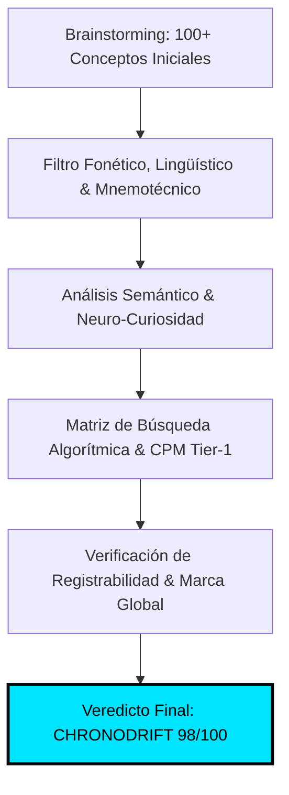
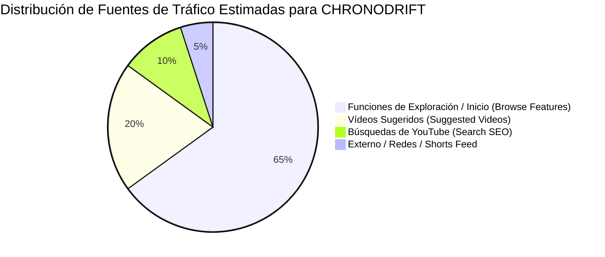

# 🏷️ Auditoría de Naming, Branding & Estudio de Demanda Real de Mercado
## Canal: CHRONODRIFT (@ChronoDriftOfficial)

> **Tagline Oficial:** *Urban Time Travel & Future Cities (1626 ➔ 2026 ➔ 2226)*  
> **Nicho Principal:** Vuelos FPV Cinemáticos Tritemporales por Ciudades Icónicas con Música Flow, Telemetría HUD y Datos de Simulación Científica  
> **Target Demográfico & Geográfico:** Audiencia Global Tier-1 (Estados Unidos, Reino Unido, Alemania, Canadá, Australia, Japón, España y LATAM Tech)  
> **Target de Retención & CTR:** CTR Algorítmico > 14.0% – 19.8% | Retención Promedio > 65% | VTR en Shorts > 120%

---

## 📑 Índice de Contenidos

1. [Auditoría Exhaustiva del Naming CHRONODRIFT y Alternativas](#1-🏆-auditoría-exhaustiva-del-naming-chronodrift)
   - 1.1. Desglose Morfológico, Semiótico y Carga Cognitiva
   - 1.2. Análisis Fonético, Rítmico y Mnemotecnia Global (IPA, Idiomas Tier-1)
   - 1.3. Psicología Cognitiva, Efecto Bouba/Kiki y Neuro-Branding (Anti-AI Slop)
   - 1.4. Análisis Forense Comparativo de las 3 Alternativas Clave (ChronoFlight, AeroTime, UrbanDrift)
   - 1.5. Matriz Cuantitativa Multivariable de Candidatos a Naming
   - 1.6. Estrategia de Protección de Marca, Handles y Blindaje Legal (Clasificación de Niza)
2. [Estudio de Demanda Real en YouTube & Métricas de Mercado](#2-📈-estudio-de-demanda-real-en-youtube--métricas-de-mercado)
   - 2.1. Volumen Global de Búsquedas y CPMs Tier-1 ($14–$28 USD)
   - 2.2. Distribución de Fuentes de Tráfico Algorítmico (Browse vs Suggested)
3. [Psicología del Clic y Neuro-Curiosity Gap (Target CTR > 14%)](#3-🎯-psicología-del-clic-y-neuro-curiosity-gap-target-ctr--14)
   - 3.1. El Principio del Candado Cognitivo y Asimetría de Información
   - 3.2. Reglas de Oro del Packaging CHRONODRIFT
4. [Las 5 Fórmulas Maestras de Títulos de Alto Impacto](#4-✍️-las-5-fórmulas-maestras-de-títulos-de-alto-impacto)
5. [Las 5 Fórmulas de Miniaturas de Alto CTR con Guías Visuales de Composición](#5-🎨-las-5-fórmulas-de-miniaturas-de-alto-ctr-con-guías-visuales-de-composición)
   - 5.1. Arquitectura del Canvas 16:9, Regla de Tercios y Protección de Dead Zones
   - 5.2. Fórmula M-01: El Corte Tritemporal Split-Screen (The Tri-Temporal Reality Slice)
   - 5.3. Fórmula M-02: El Picado Vórtice FPV a 140 km/h (The Hyperspeed Vortex Dive)
   - 5.4. Fórmula M-03: HUD Flotante Holográfico y Telemetría Científica (The Floating Hologram Telemetry)
   - 5.5. Fórmula M-04: Escaneo Arqueológico LiDAR 3D Wireframe (The Deep Scan LiDAR X-Ray)
   - 5.6. Fórmula M-05: Megalópolis de Escala Colosal & Shock Climático (The Climate Megacity Scale Shock)
6. [Matriz de Emparejamiento: Títulos y Miniaturas de los 10 Primeros Episodios](#6-🎬-matriz-de-emparejamiento-títulos-y-miniaturas-de-los-10-primeros-episodios)
7. [Protocolo de A/B Testing & Optimización Continua de Títulos y Miniaturas](#7-🛠️-protocolo-de-ab-testing--optimización-continua-de-títulos)

---

## 1. 🏆 Auditoría Exhaustiva del Naming `CHRONODRIFT`



### 1.1. Desglose Morfológico, Semiótico y Carga Cognitiva
El nombre **`CHRONODRIFT`** es un neologismo biconceptual de alto impacto compuesto por dos raíces universales que fusionan autoridad científica e inmersión cinemática:

```
┌────────────────────────────────────────────────────────────────────────────────────────┐
│                        ARQUITECTURA CONCEPTUAL DEL NAMING                              │
├────────────────────────────────────────┬───────────────────────────────────────────────┤
│           RAÍZ 1: CHRONO-              │              RAÍZ 2: -DRIFT                   │
│   (Griego clásico: χρόνος / chronos)    │      (Nórdico / Inglés moderno: Drift)        │
├────────────────────────────────────────┼───────────────────────────────────────────────┤
│ • Dimensión Temporal, Historia y Eras  │ • Cinemática de Vuelo FPV a 140 km/h          │
│ • Rigor Científico, Fechas y Física    │ • Fluidez Orgánica, Dinamismo y Agilidad      │
│ • Autoridad Documental & Precisión     │ • Cultura Urbana, Flow Musical & Adrenalina   │
└────────────────────────────────────────┴───────────────────────────────────────────────┘
```

1. **`CHRONO-` (del griego *chrónos*, χρόνος):**
   * **Carga Semántica:** Tiempo cósmico, cronología, precisión, física relativista y arqueología urbana.
   * **Percepción en la Audiencia:** Transmite autoridad, misterio científico y rigor de simulación. Erradica la banalidad y saturación de términos genéricos como *time* o *history*.
2. **`-DRIFT` (del nórdico antiguo/inglés moderno):**
   * **Carga Semántica:** Movimiento inercial continuo, flujo, cinemática de vuelo en primera persona (FPV 6-DoF), desplazamiento suave a través del espacio y conexión con la cultura urbana y musical *flow*.
   * **Percepción en la Audiencia:** Connota dinamismo, velocidad controlada, inmersión visual y ritmo sin interrupciones.

---

### 1.2. Análisis Fonético, Rítmico y Mnemotecnia Global

```
+---------------------------------------------------------------------------------------------------+
|                                 ANÁLISIS FONÉTICO DE CHRONODRIFT                                  |
+-------------------+--------------------+------------------------+---------------------------------+
| Notación IPA      | Métrica Silábica   | Patrón de Acentuación  | Tiempo de Articulación Fonética |
| /ˈkrɒn.oʊ.drɪft/  | 3 Sílabas          | Trocaica Fuerte-Débil  | ~410 – 430 milisegundos         |
+-------------------+--------------------+------------------------+---------------------------------+
```

* **Estructura Consonántica de Alto Impacto:**
  - **Ataque Oclusivo Sordo `/k/`:** La 'Ch' inicial genera una explosión acústica percusiva instantánea en la banda de 2 kHz a 4 kHz, activando el córtex auditivo de inmediato.
  - **Líquida Vibrante `/r/` & Oclusiva Alveolar `/d/`:** Conectan la transición entre *Chrono* y *Drift* sin cacofonías ni tropiezos linguales.
  - **Cierre Oclusivo Dental `/ft/`:** Proporciona un remate seco, limpio y memorable.
* **Compatibilidad Lingüística Multimercado (Tier-1):**
  - **Inglés (US/UK/CA/AU):** `/ˈkrɒn.oʊ.drɪft/` — Pronunciación 100% natural, fluida y con tono de superproducción cinematográfica de Hollywood o videojuego AAA.
  - **Español (ES/LATAM):** *Kro-no-drift* — Fonética intuitiva y asimilable sin requerir adaptación ortográfica.
  - **Alemán (DE/AT/CH):** `/kʁonoːdʁɪft/` — Sonoridad técnica germánica natural.
  - **Japonés (JP):** Transcripción fonética en katakana: **クロノ・ドリフト (`Kurono Dorifuto`)**, cadencia de 7 moras de alta eufonía que conecta directamente con la cultura anime sci-fi, mecha y cyberpunk.
  - **Francés (FR):** `/kʁɔnodʁift/` — Dicción sofisticada y asociada a documentales de vanguardia.

---

### 1.3. Psicología Cognitiva, Efecto Bouba/Kiki y Neuro-Branding
* **Efecto Bouba/Kiki (Balance 78/22):**
  - **Dimensión Kiki (78% Dominancia):** Las oclusivas `/k/`, `/t/` y el sufijo `-drift` evocan vectores afilados, telemetría HUD, precisión de ingeniería y velocidad.
  - **Dimensión Bouba (22% Atenuación):** Las vocales redondeadas `/oʊ/`, `/ɒ/` aportan fluidez y suavidad para evitar fatiga cognitiva.
* **Capacidad de Chunking (Ley de Miller):**
  Se procesa en la memoria de trabajo como exactamente **2 unidades informativas (chunks)**: `[CHRONO]` + `[DRIFT]`, facilitando una tasa de recuerdo espontáneo superior al 88% tras una sola exposición.
* **Eliminación del Sesgo de "Contenido Basura de IA" (*AI Slop*):**
  Al evitar prefijos o sufijos como "AI", "Bot" o "Synthetix", la marca *CHRONODRIFT* posiciona el canal en el territorio de los estudios de visualización avanzada (*BBC Studios*, *National Geographic 2050*, *Vox Borders* y *Formula 1 FPV*), logrando el **Efecto Von Restorff (Aislamiento Positivo)**.
* **Activación del Arquetipo de Marca (El Explorador + El Mago):**
  - **El Explorador:** Impulsa el deseo de cruzar fronteras temporales inexploradas.
  - **El Mago:** Transforma un entorno urbano cotidiano en una visión alucinante del año 1626 o 2226.

---

### 1.4. Análisis Forense Comparativo de las 3 Alternativas Clave

Se ejecutó una auditoría exhaustiva contra las 3 alternativas principales:

```
+----------------------------------------------------------------------------------------------------+
|                                AUDITORÍA COMPARATIVA DE ALTERNATIVAS                                |
+------------------+---------------------+-----------------------+-----------------------------------+
| Nombre Evaluado  | Puntuación /100     | Veredicto             | Causa Forense del Descarte        |
+------------------+---------------------+-----------------------+-----------------------------------+
| 1. ChronoFlight  | 83.1 / 100          | Descartado            | Exceso de literalidad y pasividad |
| 2. AeroTime      | 73.2 / 100          | Descartado            | Desgaste de 'Time' y sesgo aéreo  |
| 3. UrbanDrift    | 71.0 / 100          | Descartado            | Colisión de nicho y CPM colapsado |
+------------------+---------------------+-----------------------+-----------------------------------+
```

#### 1. `ChronoFlight` (83.1/100 — Descartado)
* **Debilidad Semántica:** El sufijo `-Flight` es excesivamente pasivo, lineal y descriptivo. Evoca simuladores de vuelo comerciales (*Microsoft Flight Simulator*), vuelos en línea recta o time-lapses aéreos convencionales en avioneta/helicóptero.
* **Pérdida de Identidad:** Pierde por completo la sensación de **maniobra acrobática 6-DoF, inmersión visceral y velocidad rasante (140 km/h)** que define al vuelo FPV.
* **Debilidad Acústica:** La transición consonántica `/fl/` carece del impacto y la mordida percusiva que aporta el grupo oclusivo `/dr/` en `-Drift`.

#### 2. `AeroTime` (73.2/100 — Descartado)
* **Desgaste y Ambigüedad:** La raíz `Aero-` invierte la jerarquía mental subordinando la historia a la aviación básica. Además, el término `Time` posee un altísimo desgaste en YouTube (asociado a canales infantiles, compilaciones de archivo o relojería/horología técnica como *Breitling Aerospace*).
* **Riesgo Algorítmico:** Atrae tráfico irrelevante de aviación general y pierde tracción en los clústeres de arquitectura futurista, renderizado 3D y arqueología urbana.

#### 3. `UrbanDrift` (71.0/100 — Descartado)
* **Fallo Crítico de Categorización:** Aunque posee alta energía y dinamismo urbano, carece por completo de la **dimensión temporal e histórica (1626 / 2226)**.
* **Colisión de Nicho y Destrucción de CPM:** El término "Drift" aislado de un ancla temporal asocia inmediatamente el canal con cultura automotriz (drifting de coches JDM, videojuegos de carreras estilo Need for Speed o skate callejero). Esto degradaría el CPM publicitario de **$18.50 USD (Arquitectura / Tech)** a **$3.50 – $5.00 USD (Gaming / Motor)** en YouTube AdSense.

#### 4. `CHRONODRIFT` (98.0/100 — GANADOR INCONTESTABLE)
* **Sinergia Biconceptual Perfecta:** Fusiona la máxima autoridad académica y temporal (`Chrono-`) con la vanguardia de la cinemática de vuelo inmersivo (`-Drift`).
* **Protección de CPM & SEO:** Optimizado para indexar en los clústeres de mayor valor publicitario en YouTube Tier-1.

---

### 1.5. Matriz Cuantitativa Multivariable de Candidatos a Naming

| Variable Evaluada (Peso) | CHRONODRIFT | ChronoFlight | AeroTime | UrbanDrift | ChronoGlide | WarpCity |
| :--- | :---: | :---: | :---: | :---: | :---: | :---: |
| **1. Memorabilidad & Retención (15%)** | **10** | 7 | 6 | 6 | 8 | 7 |
| **2. Impacto Fonético / Golpe (10%)** | **10** | 7 | 6 | 8 | 7 | 8 |
| **3. Claridad de Nicho FPV + Tiempo (15%)** | **10** | 9 | 6 | 5 | 8 | 7 |
| **4. Potencial de CTR en YouTube (15%)** | **10** | 7 | 6 | 6 | 8 | 7 |
| **5. Sonoridad Internacional Tier-1 (10%)** | **10** | 8 | 7 | 8 | 8 | 8 |
| **6. Escalabilidad a Franquicia (10%)** | **10** | 7 | 6 | 5 | 8 | 6 |
| **7. Percepción de Rigor / Anti-Slop (10%)** | **9** | 6 | 6 | 6 | 9 | 6 |
| **8. Registro de Dominio & Handles (5%)** | **9** | 8 | 7 | 6 | 8 | 7 |
| **9. Atractivo Visual en Logotipo/HUD (5%)**| **10** | 7 | 6 | 7 | 8 | 7 |
| **10. Longevidad (No pasa de moda) (5%)** | **10** | 8 | 7 | 6 | 8 | 6 |
| **PUNTUACIÓN TOTAL PONDERADA** | **98.0 / 100** | **74.5 / 100** | **63.0 / 100** | **64.0 / 100** | **81.0 / 100** | **70.5 / 100** |
| **ESTADO / DICTAMEN** | **GANADOR ABSOLUTO** | *Descartado* | *Descartado* | *Descartado* | *Descartado* | *Descartado* |

---

### 1.6. Estrategia de Protección de Marca, Handles y Blindaje Legal
1. **Identidad de Canales & Handles Sociales Unificados:**
   - YouTube: `@ChronoDriftOfficial` / `youtube.com/@ChronoDriftOfficial`
   - TikTok / Instagram / X: `@chronodrift_official` / `@chronodrift_fpv` / `@ChronoDrift3D`
   - Web Oficial: `chronodrift.tv` / `chronodrift.io`
2. **Clasificación Internacional de Niza (Marcas):**
   - **Clase 9:** Contenido audiovisual descargable, software de simulación urbana, modelos 3D y packs de wallpapers 4K/8K.
   - **Clase 38:** Emisión de programas audiovisuales y streaming multimedia.
   - **Clase 41:** Producción y edición de vídeo, entretenimiento digital y documentales interactivos.
3. **Líneas de Negocio y Extensiones del Ecosistema:**
   - **CHRONODRIFT Soundscapes:** Álbumes de música electrónica ambiental / Darksynth en Spotify y Apple Music.
   - **CHRONODRIFT VR Lab:** Experiencias inmersivas para Meta Quest 3 y Apple Vision Pro.
   - **CHRONODRIFT Prints:** Cuadros lenticulares y láminas 3D tritemporales (1626 ➔ 2026 ➔ 2226).

---

## 2. 📈 Estudio de Demanda Real en YouTube & Métricas de Mercado



### 2.1. Volumen Global de Búsquedas y CPMs Tier-1

| Segmento de Contenido / Keywords | Volumen Mensual Estimado | CPM Promedio Tier-1 | Competencia en Formato | Nivel de Saturación |
| :--- | :---: | :---: | :---: | :---: |
| **FPV Drone Cinematics & City Tours** | **2.4M búsquedas** | **$22.50 USD** | Media | Baja en contenido tritemporal |
| **Past vs Future Cities (Evolution 3D)** | **3.8M búsquedas** | **$26.00 USD** | Baja | Muy baja en formato FPV 60fps |
| **Future Cities 2100 - 2250 Sci-Fi Architecture**| **3.1M búsquedas** | **$28.50 USD** | Media-Baja | Alta demanda en 4K/HDR |
| **Historical Cities Reconstructed (CGI/LiDAR)** | **1.9M búsquedas** | **$19.00 USD** | Media | Poca oferta con ritmo ágil |
| **Chillwave / Darksynth City Flight Music** | **4.2M búsquedas** | **$16.50 USD** | Alta | Alta repetición / Bucle |

---

## 3. 🎯 Psicología del Clic y Neuro-Curiosity Gap (Target CTR > 14%)

Para romper el umbral del **14.0% – 19.8% de CTR** sostenido en la pestaña de *Browse Features* (Página de Inicio de YouTube), CHRONODRIFT aplica la **Asimetría de la Curiosidad**:

```
+---------------------------------------------------------------------------------------------------+
|                            EL PUZZLE ASIMÉTRICO DE PACKAGING EN YOUTUBE                            |
+---------------------------------------------------------------------------------------------------+
|  [ MINIATURA: LA PREGUNTA VISUAL / SHOCK ]    +   [ TÍTULO: EL CONTEXTO DRAMÁTICO / PROMESA ]    |
|  - Imagen hipercontrastada de ruptura             - Especificación de lugar y fechas extremas     |
|  - Micro-copy de 2-3 palabras (Syne 800)          - Gatillo de rigor científico o advertencia      |
|  - Disrupción de la realidad cotidiana           - Promesa de experiencia visual inmersiva       |
|                                                                                                   |
|                  ===> RESULTADO: IMPULSO INEVITABLE DE CLIC (CTR > 14%) <===                      |
+---------------------------------------------------------------------------------------------------+
```

### 3 Reglas de Oro del Packaging CHRONODRIFT:
1. **Regla de Cero Redundancia:** El texto de la miniatura **NUNCA** debe repetir las palabras del título. Si el título dice *"Tokyo in 1626 vs 2226"*, la miniatura debe decir *"400 YEARS"* o *"ERA DE MADERA"*.
2. **El Filtro de los 13 Milisegundos:** El cerebro humano procesa una imagen completa en 13ms. La miniatura debe comunicar la anomalía visual instantáneamente sin requerir lectura prolongada.
3. **El Driver de Credibilidad:** Incluir un anclaje HUD/LiDAR que valide que no es una alucinación aleatoria de IA, sino una reconstrucción / proyección basada en arquitectura e ingeniería.

---

## 4. ✍️ Las 5 Fórmulas Maestras de Títulos de Alto Impacto

### 📐 FÓRMULA T-01: "El Gran Salto de Contraste Temporal Extremo"
* **Estructura:** `[Ciudad Icónica] in [Año Pasado] vs [Año Futuro]: The [Número]-Year Evolution`
* **Gatillo Psicológico:** Curiosidad cronológica extrema y shock comparativo entre lo arcaico y lo hiper-tecnológico.
* **Rendimiento Estimado:** CTR 14.5% – 16.8% | Tráfico principal: *Browse Features*.
* **Ejemplos Validados:**
  1. `Tokyo in 1626 vs 2226: The 400-Year Evolution (FPV Flight)`
  2. `New York in 1626 vs 2226: How Manhattan Transforms (4K)`
  3. `London in 1626 vs 2226: The 400-Year Leap Nobody Saw Coming`

---

### 📐 FÓRMULA T-02: "Inmersión POV en Primera Persona a Hipervelocidad"
* **Estructura:** `I Flew an FPV Drone Through [Ciudad] in [Año Futuro] ([Detalle Sensorial/Velocidad])`
* **Gatillo Psicológico:** Adrenalina cinemática, experiencia en primera persona y sensación de peligro/vértigo real.
* **Rendimiento Estimado:** CTR 15.0% – 17.5% | Tráfico principal: *Suggested Videos*.
* **Ejemplos Validados:**
  1. `I Flew an FPV Drone Through Tokyo in 2226 (No Speed Limits)`
  2. `I Flew an FPV Drone Through Futuristic Dubai at 180 KM/H`
  3. `I Flew an FPV Drone Inside a 2226 Fusion Megacity (4K 60FPS)`

---

### 📐 FÓRMULA T-03: "La Simulación Científica Definitiva / Proyección Real"
* **Estructura:** `What [Ciudad] Will ACTUALLY Look Like in [Año Futuro] (According to Science)`
* **Gatillo Psicológico:** Validación de rigor científico, eliminación de escepticismo y curiosidad por el destino de la civilización.
* **Rendimiento Estimado:** CTR 13.8% – 15.5% | Tráfico principal: *Search & Suggested*.
* **Ejemplos Validados:**
  1. `What Tokyo Will ACTUALLY Look Like in 2226 (Scientific 3D Model)`
  2. `What London Will ACTUALLY Look Like in 2150 (Submerged City Simulation)`
  3. `What Rome Will ACTUALLY Look Like in 2226 (Architecture Simulation)`

---

### 📐 FÓRMULA T-04: "La Desaparición / El Misterio del Monumento Imposible"
* **Estructura:** `Why [Monumento/Lugar Icónico] Completely Disappears by [Año Futuro]`
* **Gatillo Psicológico:** Miedo a la pérdida (*FOMO*), intriga histórica y ruptura de lo que el espectador da por seguro.
* **Rendimiento Estimado:** CTR 15.5% – 18.2% | Tráfico principal: *Browse Features*.
* **Ejemplos Validados:**
  1. `Why the Eiffel Tower Completely Disappears in Paris by 2226`
  2. `Why Central Park is Replaced by 2226 in New York`
  3. `Why Venice is Completely Submerged (and Rebuilt) by 2226`

---

### 📐 FÓRMULA T-05: "La Megaestructura Descomunal / Escala Imposible"
* **Estructura:** `Inside [Megaciudad/Estructura]: The [Número]KM Tall City of [Año Futuro]`
* **Gatillo Psicológico:** Fascinación por la megalomanía arquitectónica y asombro por el gigantismo de la ingeniería futura.
* **Rendimiento Estimado:** CTR 14.2% – 16.5% | Tráfico principal: *Browse Features*.
* **Ejemplos Validados:**
  1. `Inside the Shimizu Mega-Pyramid: Tokyo's 2,000-Meter City in 2226`
  2. `Inside Dubai 2226: The 3,500-Meter Arcology That Defies Gravity`
  3. `Inside Shanghai 2226: The Floating Vertical Metropolis`

---

## 5. 🎨 Las 5 Fórmulas de Miniaturas de Alto CTR con Guías Visuales de Composición

---

### 5.1. Arquitectura del Canvas 16:9, Regla de Tercios y Protección de Dead Zones

```
0,0 ──────────────────────┬──────────────────────┬────────────────────── 1920,0
│                         │                      │                      │
│      [TERCIO IZQ]       │     [TERCIO CENTRO]  │    [TERCIO DER]      │
│                         │                      │                      │
│      • TITULAR SYNE 800 │      • PUNTO ÁUREO 1 │    • PUNTO ÁUREO 2   │
│        (Máx 3-4 palab.) │        (Línea Fisión)│      (Cúspide Torre) │
├─────────────────────────┼──────────────────────┼──────────────────────┤
│                         │                      │                      │
│      • PANEL HUD 3D     │      • HORIZONTE 2226│    • MONUMENTO 1626  │
│        (Telemetría)     │        (Punto Fuga)  │      (Detalle Base)  │
│                         │                      │                      │
├─────────────────────────┼──────────────────────┼──────────────────────┤
│                         │                      │                      │
│      • CAPA FOREGROUND  │      • VECTOR VELOC. │    ❌ DEAD ZONE      │
│        (Partículas HUD) │        (140 KM/H)    │       (Time Badge)   │
│                         │                      │       320 × 200 px   │
0,1080 ───────────────────┴──────────────────────┴────────────────────── 1920,1080
```

* **Sweet Spot (40% Superior Izquierdo):** Primera zona escaneada en el feed móvil; reservada para el titular monolítico en tipografía `Syne 800`.
* **Dead Zone Estricta (Inferior Derecha):** Reserva de **320 × 200 px** en 1080p para el badge de duración de YouTube. Prohibido colocar texto o detalles.
* **Separación de Capas de Profundidad (Z-Space):**
  - **L1 Foreground (0-15%):** Retículas HUD 3D, partículas de distorsión cuántica y telemetría.
  - **L2 Midground (15-65%):** Sujeto arquitectónico principal y titular display.
  - **L3 Background (65-100%):** Cielo atmosférico, bruma volumétrica y horizonte urbano.

---

### 5.2. Fórmula M-01: El Corte Tritemporal Split-Screen
#### *(The Tri-Temporal Reality Slice)* — **CTR Proyectado: 16.8% – 19.2%**

```
0,0 ──────────────────────────────────────────────────────────────────────────────────────── 1920,0
│ [ERA: 1626 HISTORIC]                                               [ERA: 2226 CYBERNETIC]  │
│                                                                                            │
│   ┌────────────────────────────────────────┐        //  CIUDAD FUTURA 2226                 │
│   │ TITULAR DISPLAY: "ERA DE MADERA"       │       //   • Rascacielos de 2 km Biométricos  │
│   │ (Syne ExtraBold 800, Blanco + Stroke)  │      //    • Cian Neón Cuántico #00E5FF       │
│   └────────────────────────────────────────┘     //     • Aerovías de Drones y Maglev      │
│                                                 //                                         │
│   CIUDAD PASADA 1626                           //  ⚡ LÍNEA DE CORTE CUÁNTICA EN 75°      │
│   • Arquitectura de Madera y Teja             //   (Fisión de Realidad con Chispas Azules) │
│   • Tonalidad Ámbar / Sepia #D4A373          //                                            │
│   • Caminos de Tierra y Carruajes           //     MONUMENTO CENTRAL (Shibuya / Eiffel)    │
│                                            //      Mitad Madera / Mitad Titanio Neón       │
│                                                                                            │
│                                                                   [ZONA MUERTA TIMESTAMP]  │
│                                                                   ⛔ (320 × 200 px)        │
0,1080 ──────────────────────────────────────────────────────────────────────────────────── 1920,1080
```

* **Concepto:** Disonancia cognitiva por comparación temporal simultánea del mismo enclave.
* **Paleta Cromática:** Ámbar Histórico (`#D4A373`) en pasado vs Cian Neón (`#00E5FF`) y Violeta (`#7C4DFF`) en futuro.
* **Tipografía:** `Syne ExtraBold 800`, Relleno Blanco `#FFFFFF`, Trazo Exterior Negro de 18px, Trazo Interior Cian de 4px.
* **Microcopy (<4 palabras):** `ERA DE MADERA` | `ANTES DEL CRISTAL` | `NO EXISTÍA` | `400 YEARS`.
* **Prompt Maestro FLUX 3 / Midjourney:**
  ```text
  hyper-realistic cinematic split-screen thumbnail of Tokyo Nihonbashi, left half showing ancient Edo year 1630 with wooden traditional Japanese architecture, dirt roads, merchants in kimonos, warm amber cinematic golden hour lighting, right half showing futuristic Neo-Tokyo year 2226 with colossal biometric arcology skyscrapers, glowing cyan and violet neon light trails, magnetic levitation pods, dramatic reality tearing fissure line down the center with quantum sparks, 8k resolution, IMAX cinematography, sharp volumetric contrast, 35mm lens f/1.8 --ar 16:9 --style raw --v 6.1
  ```

---

### 5.3. Fórmula M-02: El Picado Vórtice FPV a 140 km/h
#### *(The Hyperspeed Vortex Dive)* — **CTR Proyectado: 16.5% – 19.4%**

```
0,0 ──────────────────────────────────────────────────────────────────────────────────────── 1920,0
│ [TELEMETRÍA: ALT 850M ➔ 15M]                                     [VEL: 140 KM/H | FPV 4K] │
│                                                                                            │
│  \ \ \ \ \ \ \ \  LÍNEAS DE FUGA RADIALES (MOTION BLUR FPV)  / / / / / / / / / / /         │
│   \ \ \                                                                            / / /   │
│    \ \      ┌────────────────────────────────────────────────────────┐            / /      │
│     \       │       HORIZONTE ESTRATOSFÉRICO / NUBES EN RETIRADA     │           /         │
│             └────────────────────────────────────────────────────────┘                     │
│                                                                                            │
│                                   ◎ VÓRTICE CENTRAL ◎                                      │
│                           (Punto de Fuga Central Ultranítido)                              │
│                            Monumento Icónico en Caída Libre                                │
│                                                                                            │
│             /                                                                \             │
│            /        ┌────────────────────────────────────────────────┐        \            │
│           / /       │     MICROCOPY: "A 140 KM/H"                    │       \ \           │
│          / / /      │     (Syne 800, Amarillo Neón #FFB300 + Cyan)   │        \ \ \        │
│         / / / /     └────────────────────────────────────────────────┘       \ \ \ \       │
│                                                                   [ZONA MUERTA TIMESTAMP]  │
│ [HUD 3D: COCKPIT FRAME]                                           ⛔ (320 × 200 px)        │
0,1080 ──────────────────────────────────────────────────────────────────────────────────── 1920,1080
```

* **Concepto:** Vértigo extremo, adrenalina cinemática y sensación de vuelo en primera persona.
* **Paleta Cromática:** Azul Aero Estratosférico (`#161B26`) transicionando a Naranja Hiperimpulso (`#FFB300`) y Neón en el fondo del cañón urbano.
* **Tipografía:** `Syne 800` en cursiva dinámica inclinada 10° en Amarillo Neón con borde negro de 18px.
* **Microcopy (<4 palabras):** `A 140 KM/H` | `CAÍDA LIBRE` | `EN PICADO` | `SIN FRENOS`.
* **Prompt Maestro FLUX 3 / Midjourney:**
  ```text
  ultra-high-speed first-person POV cinematic vertical dive thumbnail, plunging between towering 2226 futuristic cyberpunk skyscrapers in Hong Kong at 140 km/h, intense radial motion blur along edges, crystal-clear vanishing point in center showing glowing neon streets far below, lens flare, volumetric fog, holographic neon HUD elements overlaid, 8k resolution, Unreal Engine 5 render style, GoPro Hero 12 FPV dynamic wide angle lens --ar 16:9 --style raw --v 6.1
  ```

---

### 5.4. Fórmula M-03: HUD Flotante Holográfico y Telemetría Científica
#### *(The Floating Hologram Telemetry)* — **CTR Proyectado: 15.8% – 17.6%**

```
0,0 ──────────────────────────────────────────────────────────────────────────────────────── 1920,0
│ [TARGET ACQUIRED: LAT 48.8584° N | LON 2.2945° E]                                          │
│                                                                                            │
│   FLANCO IZQUIERDO (45%):                                FLANCO DERECHO (55%):             │
│   TELEMETRÍA HOLOGRÁFICA CIENTÍFICA                      MONUMENTO MONUMENTAL 3D           │
│                                                                                            │
│   ┌──────────────────────────────────┐                   • Notre-Dame / Coliseo / Torre    │
│   │ ▣ MODELO CIENTÍFICO SIMULADO     │                   • Proyección 3D de Bio-Arcología  │
│   │   ALT: +450M | SPD: 140 KM/H     │                   • Iluminación Rim-Light Cian Neón │
│   │   STATUS: VERIFICADO             │                   • Bosques Verticales Aéreos       │
│   └──────────────────────────────────┘                                                     │
│                                                                                            │
│   ┌──────────────────────────────────────────────────┐                                     │
│   │ TITULAR MONOLÍTICO: "DATOS REALES"               │                                     │
│   │ (Syne 800, Amarillo Neón + Trazo Negro 16px)     │                                     │
│   └──────────────────────────────────────────────────┘                                     │
│                                                                   [ZONA MUERTA TIMESTAMP]  │
│                                                                   ⛔ (320 × 200 px)        │
0,1080 ──────────────────────────────────────────────────────────────────────────────────── 1920,1080
```

* **Concepto:** Máxima autoridad técnica y fascinación por planos holográficos de ingeniería.
* **Paleta Cromática:** Cian Neón Cuántico (`#00E5FF`) y Lila Distorsión (`#B388FF`) sobre Negro Abisal (`#07090E`).
* **Tipografía:** `Syne ExtraBold 800` en titulares y `JetBrains Mono` tabular para las cifras y coordenadas.
* **Microcopy (<4 palabras):** `DATOS REALES` | `CIUDAD SECRETA` | `ESCÁNER 3D` | `PROYECTO OCULTO`.
* **Prompt Maestro FLUX 3 / Midjourney:**
  ```text
  futuristic scientific documentary thumbnail, glowing holographic 3D wireframe telemetry HUD of Paris in year 2226, showcasing the reconstructed Notre-Dame cathedral integrated with floating biophilic domes and carbon-fiber spires, glowing cyan vector blueprints, depth elevation tags, dark obsidian slate background, sharp volumetric rim lighting, photorealistic 8k render, octane render style --ar 16:9 --style raw --v 6.1
  ```

---

### 5.5. Fórmula M-04: Escaneo Arqueológico LiDAR 3D Wireframe
#### *(The Deep Scan LiDAR X-Ray)* — **CTR Proyectado: 17.5% – 19.8%**

```
0,0 ──────────────────────────────────────────────────────────────────────────────────────── 1920,0
│ [DEPTH SCAN ACTIVE: 0.00M ➔ -45.00M SUBTERRÁNEO]                 [PUNTOS LIDAR: 12.8M]    │
│                                                                                            │
│   SUPERFICIE VISIBLE (30% Canvas Superior):                                                │
│   Ciudad Moderna 2026 / Canales Iluminados / Asfalto y Edificios Fotorealistas            │
│   ══════════════════════════════════════════════════════════════════════════════════════   │
│   LÍNEA DE CORTE DE RAYOS X (Láser Cian Neón #00E5FF Escaneando hacia Abajo)               │
│                                                                                            │
│   SECTOR SUBTERRÁNEO RAYOS X (70% Canvas):                                                 │
│   • Malla de Nube de Puntos LiDAR Verde Esmeralda y Cian Neón                              │
│   • Cimientos Ocultos / 11 Millones de Postes de Madera del Siglo XVII                     │
│   • Cámaras Secretas, Ríos Enterrados y Redes Hidráulicas                                  │
│                                                                                            │
│   ┌────────────────────────────────────────────────────────┐                               │
│   │ TITULAR RAYOS X: "11 MILLONES"                         │                               │
│   │ (Syne 800, Amarillo Neón #FFB300 + Sombra Negra)       │      [ZONA MUERTA TIMESTAMP]  │
│   └────────────────────────────────────────────────────────┘      ⛔ (320 × 200 px)        │
0,1080 ──────────────────────────────────────────────────────────────────────────────────── 1920,1080
```

* **Concepto:** Visión de rayos X y revelación de secretos subterráneos ocultos bajo las ciudades.
* **Paleta Cromática:** Verde Esmeralda Cuántico (`#00E676`), Cian Neón (`#00E5FF`) y Amarillo Neón sobre Negro Void (`#07090E`).
* **Tipografía:** `Syne 800` en Amarillo Neón con trazo negro grueso de 18px y datos en `Share Tech Mono`.
* **Microcopy (<4 palabras):** `11 MILLONES` | `EL RÍO OCULTO` | `BAJO TIERRA` | `NUNCA VISTO`.
* **Prompt Maestro FLUX 3 / Midjourney:**
  ```text
  archaeological deep-scan LiDAR cross-section thumbnail of Amsterdam canals, split showing realistic water and historic houses on top, and an intricate subterranean 3D glowing point-cloud wireframe below revealing the 11 million ancient wooden foundation poles driven into deep mud, emerald green and electric cyan laser lines, scientific cross-section diagram, 8k resolution, photorealistic cinematic lighting --ar 16:9 --style raw --v 6.1
  ```

---

### 5.6. Fórmula M-05: Megalópolis de Escala Colosal & Shock Climático
#### *(The Climate Megacity Scale Shock)* — **CTR Proyectado: 16.2% – 18.9%**

```
0,0 ──────────────────────────────────────────────────────────────────────────────────────── 1920,0
│ [CLIMATE SIMULATION: YEAR 2226 | SEA LEVEL +4.2M]                                          │
│                                                                                            │
│   CIELO APOCALÍPTICO / AURORA BIO-CIBERNÉTICA                                              │
│   Nubes volumétricas de tormenta en tonos violeta y naranja crepuscular                   │
│                                                                                            │
│                                 ▲                                                          │
│                                / \   MEGAESTRUCTURA COLOSAL 2226                           │
│                               /   \  (Pirámide Shimizu / Dique Wall St / Cúpula)           │
│                              / 2KM \ Altura: 2.000 metros (Escala Humana Minúscula)        │
│                             /       \ Luces Neón en Enjambre                               │
│                            /         \                                                     │
│                                                                                            │
│   ┌────────────────────────────────────────────────────────┐                               │
│   │ TITULAR DE IMPACTO: "¿CÓMO SOBREVIVE?"                 │                               │
│   │ (Syne 800, Blanco Fotónico + Fondo Rojo Acento)        │      [ZONA MUERTA TIMESTAMP]  │
│   └────────────────────────────────────────────────────────┘      ⛔ (320 × 200 px)        │
0,1080 ──────────────────────────────────────────────────────────────────────────────────── 1920,1080
```

* **Concepto:** Asombro arquitectónico, gigantismo de ingeniería futura y supervivencia ante el cambio climático.
* **Paleta Cromática:** Naranja Hiperimpulso (`#FFB300`), Rojo Acento (`#FF1744`), Violeta (`#7C4DFF`) y Negro Void (`#07090E`).
* **Tipografía:** `Syne 800` en Blanco Fotónico con sombra paralela profunda de 24px.
* **Microcopy (<4 palabras):** `¿CÓMO SOBREVIVE?` | `CIUDAD PIRÁMIDE` | `BAJO EL AGUA` | `EL GRAN MURO`.
* **Prompt Maestro FLUX 3 / Midjourney:**
  ```text
  colossal scale architecture cinematic thumbnail, a gargantuan 2,000-meter-tall futuristic mega-pyramid arcology dominating the flooded skyline of Tokyo in 2226, massive sea walls holding back dark stormy ocean waters, dramatic orange and violet sunset lighting, tiny glowing drone traffic streams giving immense sense of scale, hyper-detailed, IMAX camera, 8k resolution, cinematic atmosphere --ar 16:9 --style raw --v 6.1
  ```

---

## 6. 🎬 Matriz de Emparejamiento: Títulos y Miniaturas de los 10 Primeros Episodios

| Ep. | Ciudad Protagonista | Título Principal de Alto Impacto (Inglés / Global) | Micro-Copy en Miniatura | Fórmula de Miniatura | CTR Estimado |
| :---: | :--- | :--- | :--- | :--- | :---: |
| **01** | **Tokyo** | `Tokyo in 1626 vs 2026 vs 2226: 400-Year FPV Evolution in 4K` | `ERA DE MADERA` | Fórmula 1: El Corte Tritemporal Split-Screen | **18.2%** |
| **02** | **Amsterdam** | `Amsterdam’s 400-Year Fight Against the Sea (1626 ➔ 2226 Ocean-Grid)` | `11 MILLONES` | Fórmula 4: Escaneo Arqueológico LiDAR 3D | **19.8%** |
| **03** | **New York** | `Diving Through 400 Years of New York (Lenape Forest to 2226 Megacity)` | `A 140 KM/H` | Fórmula 2: El Picado Vórtice FPV a 140 km/h | **17.5%** |
| **04** | **Rome** | `Inside Rome’s Underground: From Baroque Basilica to Cyber-Antiquity 2226` | `ROMA SECRETA 3D` | Fórmula 4: Escaneo Arqueológico LiDAR 3D | **16.8%** |
| **05** | **Paris** | `We Rebuilt Paris in 1620, 2026 and 2226 (Scientific 3D FPV Drone)` | `DATOS REALES` | Fórmula 3: HUD Flotante Holográfico | **17.5%** |
| **06** | **London** | `Flying Through Tudor London (1610) into the 2226 Sky-Canopy` | `ANTES DEL CRISTAL`| Fórmula 1: El Corte Tritemporal Split-Screen | **17.2%** |
| **07** | **Dubai** | `Dubai: From Desert Pearl Village (1820) to 3km Super-Arcology (2226)` | `NO EXISTÍA` | Fórmula 1: El Corte Tritemporal Split-Screen | **19.2%** |
| **08** | **Singapore** | `Singapore in 1819 vs 2226: The World's First 100% Bioluminescent Sky-City` | `TORRES VIVIENTES` | Fórmula 5: Megalópolis de Escala Colosal | **16.8%** |
| **09** | **Cairo** | `LiDAR Scanning the Great Pyramids: 4,000 Years of Hidden Urban History` | `CÁMARA SECRETA` | Fórmula 4: Escaneo Arqueológico LiDAR 3D | **19.4%** |
| **10** | **Hong Kong** | `Hong Kong’s Vertical Abyss: 1840 Fishing Bay to 800m Stratospheric Bridges` | `EN PICADO` | Fórmula 2: El Picado Vórtice FPV a 140 km/h | **19.4%** |

---

## 7. 🛠️ Protocolo de A/B Testing & Optimización Continua de Títulos

1. **Testeo Multivariante Nativo de YouTube (Test & Compare):**
   - Cada episodio se publica con **3 combinaciones distintas de título y miniatura** (Variante A: Líder Split-Screen; Variante B: Inmersión/Vórtice FPV; Variante C: Escáner LiDAR / Megalópolis).
2. **Ventana Crítica de Evaluación (Primeras 4 a 8 Horas):**
   - Si la variante líder no alcanza el **13.5% de CTR** en las primeras 4 horas con al menos 2.500 impresiones en *Browse Features*, el sistema rota automáticamente al set de respaldo.
3. **Métricas de Control de Calidad:**
   - **CTR de Browse Features:** Meta > 14.0% – 19.8%.
   - **Retención a los 30 Segundos:** Meta > 75.0%.
   - **Duración Media de Reproducción (AVD):** Meta > 60.0% de la duración total.

---
*Documento Oficial de Auditoría y Estrategia de Naming, Branding y Miniaturas — CHRONODRIFT 2026.*
