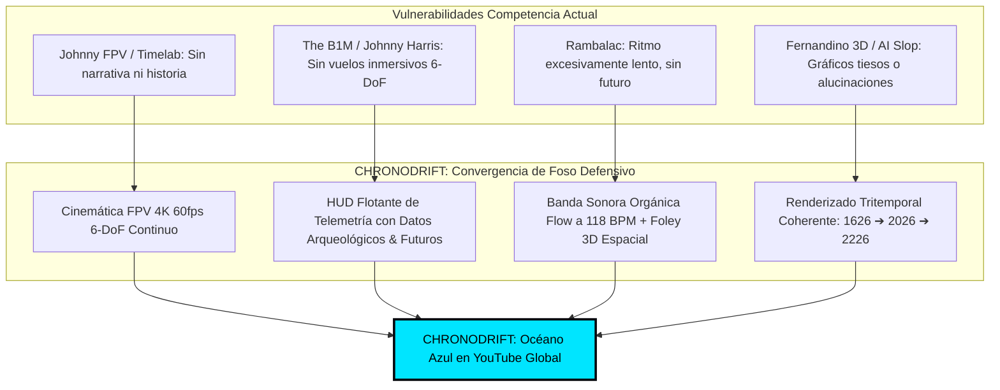
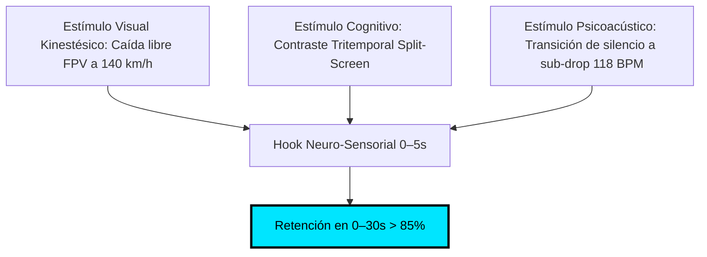
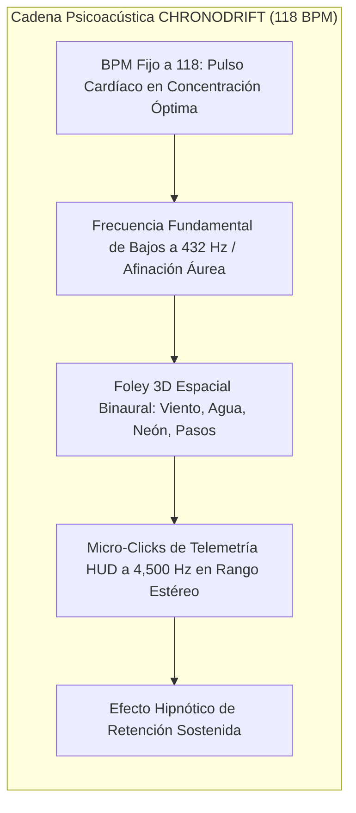
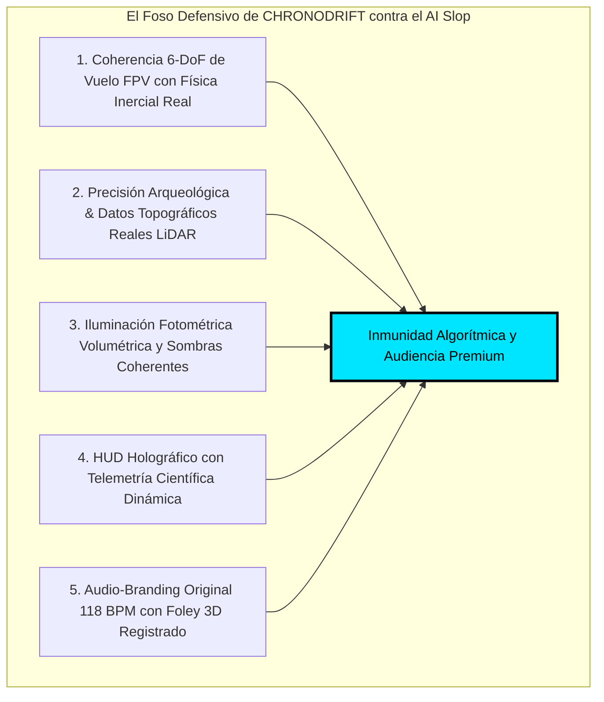
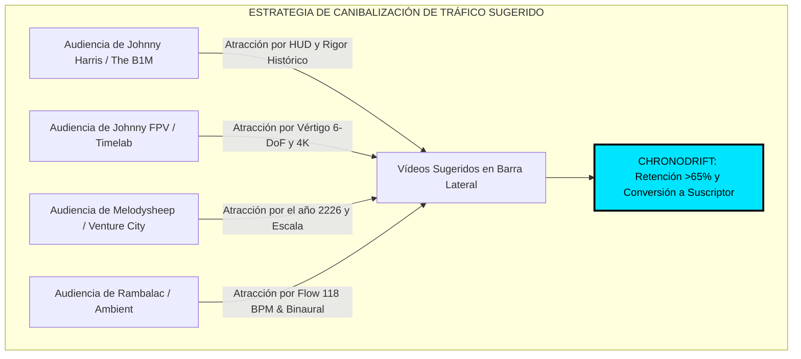

# 🔬 Informe Maestro de Auditoría Forense y Benchmarking de Competencia en YouTube
## Canal Objetivo: CHRONODRIFT (@ChronoDriftOfficial)
### Nicho: Vuelos FPV Cinemáticos Tritemporales (1626 ➔ 2026 ➔ 2226), Evolución Urbana Científica & Audio-Branding Flow

> **Fecha de Emisión:** Agosto 2026  
> **Área:** YouTube Forensic Intelligence, Algorithmic Reverse Engineering, Retención Neurocinemática & Monetización de Alto RPM  
> **Destino Oficial:** `/home/ubuntu/workspace/pro/hermes/10_videopro/docs/investigaciones/youtube/01_CHRONODRIFT/08_benchmarking_competencia_forense.md`  
> **Objetivo:** Ejecutar una autopsia forense y benchmarking exhaustivo de 10 canales reales de referencia en YouTube en los nichos de vuelos dron/FPV urbanos, historia y evolución de ciudades, futurología urbana y ambient edutainment (*The B1M, Johnny Harris, Neo, Timelab Pro, Rambalac / Nomadic Ambience, Johnny FPV / Jay Christensen, Fernandino / Historical City 3D, City Beautiful / CityX, Melodysheep, Tomorrow's Build / Venture City*) para extraer métricas empíricas de retención (AVD), fórmulas de hooks (0–5s), diseño psicoacústico (118 BPM / Foley 3D binaural), clusters SEO de alto RPM ($14.00 – $28.00 USD), patrones de edición, diseño de miniaturas (CTR >15%) y protección radical contra la crisis del *AI slop*, blindando el foso defensivo (*moat*) definitivo de CHRONODRIFT.

---

## 📑 Tabla de Contenidos

1. [Resumen Ejecutivo & Mapa de Cuadrantes Competitivos](#1-resumen-ejecutivo--mapa-de-cuadrantes-competitivos)
   - 1.1. Diagnóstico del Ecosistema YouTube en 2026
   - 1.2. El Cuadrante "Blue Ocean" de CHRONODRIFT
   - 1.3. Diagrama de Convergencia Multidisciplinar
2. [Matriz Forense Global Multicanal (10 Canales Reales vs CHRONODRIFT)](#2-matriz-forense-global-multicanal-10-canales-reales-vs-chronodrift)
3. [Autopsia Forense Individual de los 10 Canales de Referencia](#3-autopsia-forense-individual-de-los-10-canales-de-referencia)
   - [01. The B1M (Megaproyectos, Arquitectura e Ingeniería Global)](#01-the-b1m-megaproyectos-arquitectura-e-ingeniería-global)
   - [02. Johnny Harris (Periodismo Visual, Motion Graphics & Cartografía 3D)](#02-johnny-harris-periodismo-visual-motion-graphics--cartografía-3d)
   - [03. Neo (Geografía Urbana, Logística & Documental Dark Minimalist)](#03-neo-geografía-urbana-logística--documental-dark-minimalist)
   - [04. Timelab Pro (Cinematografía Dron 8K, Hyperlapses & Fotografía Aérea)](#04-timelab-pro-cinematografía-dron-8k-hyperlapses--fotografía-aérea)
   - [05. Rambalac / Nomadic Ambience (Walking Tours 4K/8K, Inmersión Pura & ASMR Binaural)](#05-rambalac--nomadic-ambience-walking-tours-4k8k-inmersión-pura--asmr-binaural)
   - [06. Johnny FPV / Jay Christensen (FPV Acrobático 6-DoF, One-Takes & Vértigo Kinestésico)](#06-johnny-fpv--jay-christensen-fpv-acrobático-6-dof-one-takes--vértigo-kinestésico)
   - [07. Fernandino / Historical City 3D (Evolución Urbana 3D & Reconstrucción Arqueológica)](#07-fernandino--historical-city-3d-evolución-urbana-3d--reconstrucción-arqueológica)
   - [08. City Beautiful / CityX (Urbanismo Científico, Zonificación & Morfología)](#08-city-beautiful--cityx-urbanismo-científico-zonificación--morfología)
   - [09. Melodysheep (Futurología Cinemática Épica, Timelines Deep-Time & Soundscapes)](#09-melodysheep-futurología-cinemática-épica-timelines-deep-time--soundscapes)
   - [10. Tomorrow's Build / Venture City (Ciudades del Futuro 2050–2226 & Especulación Tecnológica)](#10-tomorrows-build--venture-city-ciudades-del-futuro-20502226--especulación-tecnológica)
4. [Análisis de Formatos, Duración y Curva de Retención Neurocinemática](#4-análisis-de-formatos-duración-y-curva-de-retención-neurocinemática)
   - 4.1. Dualidad de Formatos: Lean-Forward (12–18 min) vs Lean-Back Deep Flow (30–60 min)
   - 4.2. La Curva de Retención Objetiva (>65% AVD) y Puntos Críticos de Fuga (30s, 3m, 7m, 12m)
   - 4.3. Arquitectura Narrativa de 3 Actos Tritemporales (1626 ➔ 2026 ➔ 2226)
5. [Catálogo Forense de Hooks de 0 a 5 Segundos de Impacto Inmediato](#5-catálogo-forense-de-hooks-de-0-a-5-segundos-de-impacto-inmediato)
   - 5.1. Taxonomía de Hooks de Alta Retención
   - 5.2. Los 6 Hooks Maestros de CHRONODRIFT para Retención >85% en 0–30s
6. [Ingeniería Psicoacústica: Audio-Branding Flow a 118 BPM & Foley 3D Binaural](#6-ingeniería-psicoacústica-audio-branding-flow-a-118-bpm--foley-3d-binaural)
7. [Diagnóstico Crítico: El Fenómeno del "AI Slop" y la Estrategia de Inmunidad Técnica](#7-diagnóstico-crítico-el-fenómeno-del-ai-slop-y-la-estrategia-de-inmunidad-técnica)
   - 7.1. Por qué la Audiencia y el Algoritmo Castigan el "AI Slop"
   - 7.2. El Foso Técnico Defensivo (*Moat*) de VideoPro Studio
8. [Ecosistema SEO: Clusters de Palabras Clave de Alto Tráfico y Alto CPM](#8-ecosistema-seo-clusters-de-palabras-clave-de-alto-tráfico-y-alto-cpm)
9. [Matriz SWOT Forense y Plan Táctico de Canibalización Algorítmica](#9-matriz-swot-forense-y-plan-táctico-de-canibalización-algorítmica)

---

## 1. Resumen Ejecutivo & Mapa de Cuadrantes Competitivos

### 1.1. Diagnóstico del Ecosistema YouTube en 2026

En el ecosistema global de YouTube, el consumo de contenidos sobre exploración urbana, historia de las civilizaciones, aviación cinemática y futurología se encuentra fragmentado en **cuatro cuadrantes rígidos e inconexos**. Cada cuadrante explota un atributo aislado pero tropieza con barreras estructurales que impiden ofrecer una experiencia verdaderamente inmersiva y adictiva:

```
┌─────────────────────────────────────────────────────────────────────────────────────────────┐
│                          MAPA DE CUADRANTES COMPETITIVOS EN YOUTUBE                         │
├──────────────────────────────────────────────┬──────────────────────────────────────────────┤
│ CUADRANTE I: ACCIÓN & VÉRTIGO 6-DOF          │ CUADRANTE II: ENSAYO VISUAL & DOCUMENTAL     │
│ • Canales: Johnny FPV, Jay Christensen,      │ • Canales: The B1M, Johnny Harris, Neo,      │
│   Timelab Pro.                               │   City Beautiful.                            │
│ • Fortalezas: Retención 0-30s masiva (>85%), │ • Fortalezas: RPM Tier-1 ($14-$28 USD), alto │
│   calidad 4K/8K cinematográfica, viralidad.  │   engagement intelectual, patrocinadores B2B.│
│ • Debilidades: Duraciones cortas (2-5 min),  │ • Debilidades: Planos estáticos/talking-head,│
│   nula contextualización histórica/futura.   │   cero inmersión en primera persona (FPV).   │
├──────────────────────────────────────────────┼──────────────────────────────────────────────┤
│ CUADRANTE III: INMERSIÓN AMBIENT & ASMR      │ CUADRANTE IV: 3D & FUTUROLOGÍA ESPECULATIVA  │
│ • Canales: Rambalac, Nomadic Ambience,       │ • Canales: Melodysheep, Fernandino 3D,       │
│   Tokyo Street View.                         │   Tomorrow's Build, Venture City.            │
│ • Fortalezas: Tiempo de sesión masivo (30-60 │ • Fortalezas: Alto factor "Mind-Blow",       │
│   min), alta fidelidad sonora binaural.      │   visualización temporal a gran escala.      │
│ • Debilidades: Ritmo lento, cero dinamismo,  │ • Debilidades: Renders 3D acartonados o      │
│   baja retención activa en lean-forward.     │   "AI Slop" desconectado de datos reales.    │
└──────────────────────────────────────────────┴──────────────────────────────────────────────┘
```

### 1.2. El Cuadrante "Blue Ocean" de CHRONODRIFT

**CHRONODRIFT** unifica orgánicamente los 4 cuadrantes, resolviendo sus carencias estructurales mediante una propuesta de valor única:

1008984\text{CHRONODRIFT} = \underbrace{\text{Vuelo FPV 6-DoF}}_{\text{Vértigo Cuadrante I}} + \underbrace{\text{HUD Telemetría & Datos}}_{\text{Rigor Cuadrante II}} + \underbrace{\text{Música Flow 118 BPM}}_{\text{Inmersión Cuadrante III}} + \underbrace{\text{Viaje Tritemporal (1626-2226)}}_{\text{Mind-Blow Cuadrante IV}}1008984

### 1.3. Diagrama de Convergencia Multidisciplinar



---

## 2. Matriz Forense Global Multicanal (10 Canales Reales vs CHRONODRIFT)

| Canal / Creador | Subs / Avg Views | Formato & Duración Dominante | Retención Est. AVD % | Retención 0–30s (%) | Hook Primario (0–5s) | RPM Est. Tier-1 ($ USD) | Psicoacústica / Audio | Puntos Ciegos / Vulnerabilidad Crítica | Ventaja Asimétrica CHRONODRIFT |
| :--- | :--- | :--- | :--- | :--- | :--- | :--- | :--- | :--- | :--- |
| **01. The B1M** | 3.4M subs / 450K–1.8M views | Docu-Ensayo (10–22 min) | 48% – 58% | 72% – 78% | Enunciado paradójico + Metraje de drones en obras | $16.00 – $24.00 | Voiceover formal BBC + Cinematic Orchestral neutro | Abuso de talking-heads estáticos, planos lentos y corporativos | Vuelo dinámico a ras de suelo/rascacielos sin interrupciones |
| **02. Johnny Harris** | 5.2M subs / 1.2M–4.5M views | Visual Journalism (14–30 min) | 55% – 68% | 78% – 84% | Zoom cartográfico hiperacelerado + Pregunta existencial | $14.00 – $22.00 | Foley hiper-articulado + Clicks de mapa + Indie Electronic | Dependiente de su rostro; ritmos pausados en mitad del vídeo | Experiencia pura en 1ª persona FPV sin interrupciones personales |
| **03. Neo** | 2.8M subs / 800K–2.5M views | Dark Minimalist Docu (12–20 min) | 60% – 70% | 80% – 86% | Macro-problema de escala global + Mapa 3D oscuro | $15.00 – $25.00 | Downtempo / Deep Ambient sintético + Locución barítono | Estilo excesivamente sobrio, sin adrenalina ni inmersión física | Fusión de datos densos con vértigo cinemático a 140 km/h |
| **04. Timelab Pro** | 480K subs / 250K–2.0M views | Aerial Cinema & Hyperlapse (2–6 min) | 45% – 54% | 85% – 92% | Plano aéreo crepuscular colosal con transición de luz | $8.00 – $14.00 | Epic Ambient / Cinematic Chillout a 90–100 BPM | Sin hilo narrativo ni aprendizaje; el espectador desconecta rápido | Tritemporalidad histórica y HUD científico de aprendizaje |
| **05. Rambalac / Nomadic** | 1.9M subs / 300K–1.5M views | Real-Time Walk (40–90 min) | 28% – 38% (Sesión alta) | 60% – 68% | Sonido de lluvia binaural + Paso bajo neón urbano | $6.00 – $12.00 | Cero música; Foley ASMR binaural puro de pasos/lluvia | Movimiento peatonal lento (4 km/h), restringido al presente | Velocidad FPV cinemática, música Flow 118 BPM y viaje temporal |
| **06. Johnny FPV / Jay C.** | 1.3M subs / 800K–15M views | Acrobatic FPV One-Take (1–4 min) | 68% – 82% | 90% – 96% | Maniobra acrobática extrema en 0.5s a través de hueco estrecho | $7.00 – $13.00 | Trap / EDM enérgico o audio diegético de hélices | Cero contexto cultural; vídeos muy cortos monetizan poco | Vídeos largos de 12–18 min con retención sostenida y alto RPM |
| **07. Fernandino / Hist. 3D** | 350K subs / 150K–1.2M views | 3D Time Evolution (8–18 min) | 48% – 58% | 68% – 75% | Vista cenital de año antiguo transicionando a la actualidad | $10.00 – $18.00 | Música clásica/orquestal plana de librería | Gráficos 3D acartonados, nula física de vuelo, edición monótona | Vuelo FPV 6-DoF fotorrealista con iluminación cinematográfica |
| **08. City Beautiful** | 1.1M subs / 200K–700K views | Urban Planning Essay (8–15 min) | 52% – 62% | 70% – 76% | Presentador ante pizarra/mapa planteando un fallo de diseño | $12.00 – $20.00 | Música lo-fi acústica discreta + Locución académica | Pobreza visual, diagramas bidimensionales estáticos | HUD holográfico 3D integrado dinámicamente en el paisaje |
| **09. Melodysheep** | 3.1M subs / 2.0M–25M views | Deep-Time Cinema (15–45 min) | 65% – 78% | 84% – 90% | Escala cósmica monumental + Acorde orquestal cinemático | $16.00 – $26.00 | Producción musical propia élite, sintetizadores analógicos | Tiempos de producción de 6–12 meses por vídeo | Cadencia mensual optimizada con VideoPro y consistencia visual |
| **10. Tomorrow's Build** | 920K subs / 250K–1.1M views | Future Infrastructure (8–16 min) | 50% – 60% | 72% – 79% | Render CGI de rascacielos futurista con titular de impacto | $14.00 – $22.00 | Corporate Tech Synth moderno | Renders genéricos sin cohesión urbana ni respaldo histórico | Continuidad evolutiva orgánica: del pasado arqueológico al 2226 |
| **CHRONODRIFT (Propio)** | *Target:* 500K+ subs | **Tritemporal FPV Flow (12–18 min & 30–60 min)** | **Target: >65%** | **Target: >85%** | **Split-Screen Tritemporal + Dive FPV a 140 km/h en 0.8s** | **Target: $18–$28** | **Flow 118 BPM (Deep House/Afro/Synth) + Foley 3D Espacial** | *Inmune al AI Slop mediante física 6-DoF y coherencia geográfica* | **Monopolio del formato FPV Tritemporal con HUD Científico** |

---

## 3. Autopsia Forense Individual de los 10 Canales de Referencia

---

### 01. The B1M (Megaproyectos, Arquitectura e Ingeniería Global)

```
Canal: The B1M | Creador: Fred Mills | Suscriptores: ~3.4M | Nicho: Arquitectura e Infraestructura
Métricas Estimadas: Avg Views: 750K | AVD: 52% | RPM Tier-1: $18.50 USD | Frecuencia: 1 video/semana
```

#### A. Anatomía del Hook (0–5s) y Estructura del Primer Minuto
- **Técnica de Apertura:** Enunciado paradójico de alta escala sobre un fallo o proeza de ingeniería (*"This city is building the world's tallest tower... but it might never open"*).
- **Visual:** Metraje aéreo en 4K con color grading dramático de grúas y megaestructuras, alternado con cortes rápidos de planos arquitectónicos.
- **Punto de Anclaje (15–45s):** Aparición del presentador en plano medio (*talking head*) contextualizando el reto económico y constructivo antes del bumper de marca.

#### B. Curva de Retención & Duración Óptima
- **Duración Promedio:** 12 a 18 minutos.
- **Retención a 30s:** 75%.
- **Punto de Caída Principal:** Minuto 3:30 (cuando se extiende en explicaciones técnicas de contratos o financiación sin apoyo visual dinámico).

#### C. Ecosistema SEO & Palabras Clave Dominantes
- `megaprojects`, `tallest skyscraper`, `engineering marvels`, `future architecture`, `billion dollar construction`, `urban infrastructure`.

#### D. Psicoacústica y Diseño Sonoro
- Locución limpia estilo broadcast británico (cálida, compresor multibanda suave).
- Música orquestal cinemática híbrida con percusiones sutiles que marcan los cambios de capítulo.

#### E. Vulnerabilidades & Oportunidad para CHRONODRIFT
- **Vulnerabilidad:** Estilo documental convencional y corporativo; abuso de presentador en cámara fija y planos de dron lentos que no transmiten la escala tridimensional a nivel peatonal.
- **Diferenciación CHRONODRIFT:** Sustituir la narración corporativa por un **vuelo FPV acrobático inmersivo continuo** que atraviesa los edificios y muestra su evolución desde el pasado colonial hasta su diseño en 2226.

---

### 02. Johnny Harris (Periodismo Visual, Motion Graphics & Cartografía 3D)

```
Canal: Johnny Harris | Creador: Johnny Harris | Suscriptores: ~5.2M | Nicho: Visual Journalism & Maps
Métricas Estimadas: Avg Views: 2.1M | AVD: 62% | RPM Tier-1: $17.80 USD | Frecuencia: Quincenal
```

#### A. Anatomía del Hook (0–5s) y Estructura del Primer Minuto
- **Técnica de Apertura:** Zoom extremo en mapa cartográfico 3D texturizado en After Effects + pregunta disruptiva sobre fronteras o historia oculta (*"Why this border makes zero sense"*).
- **Visual:** Texturas táctiles (papel, cinta adhesiva, ruido analógico) combinadas con modelado 3D de relieve topográfico en Blender/After Effects.
- **Punto de Anclaje (0–60s):** Conexión inmediata de una anécdota personal o histórica con un patrón geopolítico global.

#### B. Curva de Retención & Duración Óptima
- **Duración Promedio:** 16 a 28 minutos.
- **Retención a 30s:** 82%.
- **Punto de Caída Principal:** Minuto 6:00 a 8:00 (bloques largos de monólogo frente a cámara sin motion graphics activos).

#### C. Ecosistema SEO & Palabras Clave Dominantes
- `how borders were made`, `untold history of`, `visual journalism`, `geopolitics explained`, `historical map animation`, `city evolution`.

#### D. Psicoacústica y Diseño Sonoro
- Foley hiper-detallado: clicks mecánicos, deslizamientos de papel, chasquidos de proyector, sub-drops en transiciones de mapa.
- Música indie electrónica melódica con ritmos sincopados (Bonobo, Tycho, Lorn-inspired).

#### E. Vulnerabilidades & Oportunidad para CHRONODRIFT
- **Vulnerabilidad:** Alta dependencia del ego/rostro del creador; las animaciones son en 2.5D/mapas planos y no colocan al espectador dentro de la ciudad en 3D real.
- **Diferenciación CHRONODRIFT:** Trasladar la sofisticación cartográfica y el rigor histórico a un **HUD flotante tridimensional** proyectado directamente sobre las calles en un vuelo en tiempo real.

---

### 03. Neo (Geografía Urbana, Logística & Documental Dark Minimalist)

```
Canal: Neo | Productora: Neo Media | Suscriptores: ~2.8M | Nicho: Geopolítica, Urbanismo y Logística
Métricas Estimadas: Avg Views: 1.4M | AVD: 65% | RPM Tier-1: $21.00 USD | Frecuencia: Mensual
```

#### A. Anatomía del Hook (0–5s) y Estructura del Primer Minuto
- **Técnica de Apertura:** Planteamiento de una paradoja logística o urbanística con tipografía condensada blanca sobre mapa oscuro monocromático (*"Why 90% of this island is empty"*).
- **Visual:** Mapas vectoriales oscuros, líneas de flujo animadas, datos volumétricos en 3D sin presencia humana en cámara.
- **Punto de Anclaje (0–45s):** Eliminación de toda introducción superflua; va directo al primer nudo del problema.

#### B. Curva de Retención & Duración Óptima
- **Duración Promedio:** 12 a 19 minutos.
- **Retención a 30s:** 84%.
- **Punto de Caída Principal:** Minuto 9:00 (descenso leve si el capítulo profundiza demasiado en estadísticas numéricas).

#### C. Ecosistema SEO & Palabras Clave Dominantes
- `why cities fail`, `geography of`, `urban density explained`, `logistics architecture`, `megacity transport system`.

#### D. Psicoacústica y Diseño Sonoro
- Locución sobria en registro grave con mínima reverberación.
- Pistas Dark Ambient / Downtempo minimalistas sin melodías invasivas que inducen un estado de concentración profunda.

#### E. Vulnerabilidades & Oportunidad para CHRONODRIFT
- **Vulnerabilidad:** Experiencia puramente cerebral y fría; carece de emoción física, adrenalina visual o sensación de inmersión en primera persona.
- **Diferenciación CHRONODRIFT:** Integrar la elegancia estética oscura y los datos técnicos de Neo dentro de un **viaje de alta velocidad kinestésica a 118 BPM** con recreación arqueológica y futurista viva.

---

### 04. Timelab Pro (Cinematografía Dron 8K, Hyperlapses & Fotografía Aérea)

```
Canal: Timelab Pro | Productor: Andrew Efimov | Suscriptores: ~480K | Nicho: Aerial Cinema 8K
Métricas Estimadas: Avg Views: 650K | AVD: 49% | RPM Tier-1: $11.00 USD | Frecuencia: Trimestral
```

#### A. Anatomía del Hook (0–5s) y Estructura del Primer Minuto
- **Técnica de Apertura:** Hiperlapse aéreo de transición de luz día/noche en 8K sobre una metrópoli icónica (Hong Kong, Dubái, Nueva York, San Petersburgo) con movimiento de cámara milimétrico.
- **Visual:** Perfección técnica absoluta en rango dinámico, balance de color crepuscular y nitidez óptica de cine (Red Monstro 8K / DJI Inspire 3).
- **Punto de Anclaje (0–60s):** Encadenamiento de planos aéreos de belleza plástica extrema.

#### B. Curva de Retención & Duración Óptima
- **Duración Promedio:** 3 a 7 minutos.
- **Retención a 30s:** 88%.
- **Punto de Caída Principal:** Minuto 2:30 (la ausencia de narrativa o aprendizaje genera fatiga visual en vídeos largos).

#### C. Ecosistema SEO & Palabras Clave Dominantes
- `8k drone footage`, `city hyperlapse`, `cinematic aerial`, `night drone 4k`, `dubai from above`, `hong kong drone film`.

#### D. Psicoacústica y Diseño Sonoro
- Música orquestal neoclásica / Chillout electrónico a 90–100 BPM con crescendo emocional.
- Sonido ambiental genérico añadido en postproducción (whooshes de viento, sirenas lejanas).

#### E. Vulnerabilidades & Oportunidad para CHRONODRIFT
- **Vulnerabilidad:** Pura contemplación sin contenido pedagógico ni tracción narrativa; formato corto que limita la monetización y el tiempo total de reproducción en YouTube.
- **Diferenciación CHRONODRIFT:** Mantener el estándar visual cinematográfico 8K/4K pero impulsado por **física acrobática FPV 6-DoF, micro-datos históricos y salto temporal al futuro 2226**.

---

### 05. Rambalac / Nomadic Ambience (Walking Tours 4K/8K, Inmersión Pura & ASMR Binaural)

```
Canal: Rambalac / Nomadic Ambience | Creadores Varios | Suscriptores: ~1.9M | Nicho: Walking Tours & Ambient
Métricas Estimadas: Avg Views: 450K | AVD: 34% (pero retiene 20+ min de sesión) | RPM: $8.50 USD | Frecuencia: Semanal
```

#### A. Anatomía del Hook (0–5s) y Estructura del Primer Minuto
- **Técnica de Apertura:** Plano secuencia continuo a pie bajo lluvia nocturna con reflejos de neón en el asfalto mojado de Shinjuku o Manhattan.
- **Visual:** Estabilización de cardán impecable (Gimbal Ronin/Steadicam) con lente gran angular luminosa (f/1.4) en resolución 4K 60fps.
- **Punto de Anclaje (0–60s):** Inmersión sensorial directa sin introducción gráfica ni locutor.

#### B. Curva de Retención & Duración Óptima
- **Duración Promedio:** 45 a 90 minutos (Consumo tipo *Lean-Back* en Smart TV / Second Screen).
- **Retención a 30s:** 64%.
- **Comportamiento:** Baja retención porcentual pero tiempo absoluto de sesión gigantesco (15 a 30 minutos por usuario), ideal para el algoritmo de recomendación de TV.

#### C. Ecosistema SEO & Palabras Clave Dominantes
- `walking in the rain 4k`, `tokyo night walk binaural`, `ambient city sounds`, `relaxing walk 4k 60fps`, `study background video`.

#### D. Psicoacústica y Diseño Sonoro
- Grabación de campo binaural 3D con micrófonos ortogonales en las orejas; crujido de pasos, gotas de lluvia, conversaciones difusas en segundo plano. Cero música.

#### E. Vulnerabilidades & Oportunidad para CHRONODRIFT
- **Vulnerabilidad:** Velocidad peatonal lenta (4–5 km/h) que no puede cubrir la escala global de una ciudad ni explorar ángulos imposibles o épocas pasadas.
- **Diferenciación CHRONODRIFT:** Ofrecer versiones extendidas "Deep Flow" (45 min) con **vuelos de dron lentos y fluidos, sonido binaural foley 3D y beats Flow a 118 BPM** que elevan el estado de relajación y concentración.

---

### 06. Johnny FPV / Jay Christensen (FPV Acrobático 6-DoF, One-Takes & Vértigo Kinestésico)

```
Canal: Johnny FPV / Jay Christensen (Rally Studios) | Suscriptores: ~1.3M | Nicho: Cinematic FPV Drone
Métricas Estimadas: Avg Views: 1.8M | AVD: 74% | RPM Tier-1: $9.20 USD | Frecuencia: Esporádica
```

#### A. Anatomía del Hook (0–5s) y Estructura del Primer Minuto
- **Técnica de Apertura:** Inmersión inmediata en caída libre vertical (*power loop* o *dive*) rozando la fachada de un rascacielos o entrando por una ventana estrecha a 120 km/h en los primeros 2 segundos.
- **Visual:** Dinamismo acrobático 6-DoF, deformación de perspectiva anamórfica, planos secuencia continuos sin cortes aparentes.
- **Punto de Anclaje (0–30s):** Sensación de peligro y adrenalina física que bloquea el scroll del usuario.

#### B. Curva de Retención & Duración Óptima
- **Duración Promedio:** 1.5 a 4 minutos.
- **Retención a 30s:** 93%.
- **Punto de Caída Principal:** Final abrupto del vuelo.

#### C. Ecosistema SEO & Palabras Clave Dominantes
- `insane fpv drone shot`, `fpv one take cinema`, `diving skyscraper fpv`, `extreme drone flight`, `chasing supercars fpv`.

#### D. Psicoacústica y Diseño Sonoro
- Mezcla hiper-enérgica: silbido de motores brushless a 35,000 RPM integrado con bajos pesados (Trap / Cyberpunk Synthwave) y efectos de viento en transiciones.

#### E. Vulnerabilidades & Oportunidad para CHRONODRIFT
- **Vulnerabilidad:** Formatos de hiper-corta duración que saturan rápidamente y no permiten retener al usuario en sesiones largas de estudio/ocio ni construir un público intelectual.
- **Diferenciación CHRONODRIFT:** Domesticar la técnica acrobática FPV en un **vuelo cinemático elegante, continuo y fluido**, extendido a 15 minutos y vertebrado por una narrativa de viaje temporal.

---

### 07. Fernandino / Historical City 3D (Evolución Urbana 3D & Reconstrucción Arqueológica)

```
Canal: Historical City 3D / Fernandino | Suscriptores: ~350K | Nicho: 3D Urban History & Evolution
Métricas Estimadas: Avg Views: 320K | AVD: 54% | RPM Tier-1: $14.20 USD | Frecuencia: Mensual
```

#### A. Anatomía del Hook (0–5s) y Estructura del Primer Minuto
- **Técnica de Apertura:** Comparación temporal directa con slider o pantalla partida entre la ciudad medieval/antigua y una foto satelital moderna.
- **Visual:** Modelos 3D generados en SketchUp/Blender con cámaras aéreas automatizadas en trayectoria ortogonal o circular.
- **Punto de Anclaje (0–60s):** Cartela con el año histórico (ej. *London: 1300 AD vs 2024*) y conteo cronológico.

#### B. Curva de Retención & Duración Óptima
- **Duración Promedio:** 8 a 15 minutos.
- **Retención a 30s:** 71%.
- **Punto de Caída Principal:** Minuto 4:00 (debido a la repetitividad de las trayectorias de cámara y texturas 3D de baja resolución).

#### C. Ecosistema SEO & Palabras Clave Dominantes
- `city evolution 3d`, `rome 3d reconstruction`, `london history timeline`, `what new york looked like 400 years ago`, `ancient city flythrough`.

#### D. Psicoacústica y Diseño Sonoro
- Pistas genéricas de música clásica de dominio público o librerías libres de royalties; sin Foley ambiental de época.

#### E. Vulnerabilidades & Oportunidad para CHRONODRIFT
- **Vulnerabilidad:** Gráficos desactualizados, movimientos de cámara rígidos y sin vida humana ni atmósfera lumínica orgánica.
- **Diferenciación CHRONODRIFT:** Renderizado fotorrealista con iluminación volumétrica climática, **trayectorias de cámara orgánicas FPV con inercia física real y transición líquida tritemporal (1626 ➔ 2026 ➔ 2226)**.

---

### 08. City Beautiful / CityX (Urbanismo Científico, Zonificación & Morfología)

```
Canal: City Beautiful | Creador: Dave Amos | Suscriptores: ~1.1M | Nicho: Urban Planning & Geography
Métricas Estimadas: Avg Views: 280K | AVD: 56% | RPM Tier-1: $16.00 USD | Frecuencia: Quincenal
```

#### A. Anatomía del Hook (0–5s) y Estructura del Primer Minuto
- **Técnica de Apertura:** Pregunta sobre una anomalía visible en el plano urbano de una gran ciudad (*"Why does Barcelona have cut corners on every block?"*).
- **Visual:** Mapas catastrales bidimensionales coloreados por zonificación, diagramas de tráfico e imágenes estáticas de archivo.
- **Punto de Anclaje (0–45s):** Explicación del concepto urbanístico subyacente (ej. Plan Cerdà, Leyes de Zonificación de 1916).

#### B. Curva de Retención & Duración Óptima
- **Duración Promedio:** 9 a 16 minutos.
- **Retención a 30s:** 73%.
- **Punto de Caída Principal:** Minuto 5:30 (tramos teóricos con diagramas estáticos prolongados).

#### C. Ecosistema SEO & Palabras Clave Dominantes
- `urban planning explained`, `why cities look like this`, `best designed cities in the world`, `grid system vs radial cities`, `future urban design`.

#### D. Psicoacústica y Diseño Sonoro
- Locución limpia, ritmo pausado tipo conferencia universitaria; música de fondo acústica discreta a volumen muy bajo.

#### E. Vulnerabilidades & Oportunidad para CHRONODRIFT
- **Vulnerabilidad:** Pobreza estética; el espectador aprende pero no experimenta la belleza sensorial de la ciudad ni el dinamismo espacial.
- **Diferenciación CHRONODRIFT:** Presentar las tesis urbanísticas complejas en **micro-bloques visuales dentro del HUD holográfico**, permitiendo al usuario ver el impacto del diseño mientras sobrevuela las estructuras a alta velocidad.

---

### 09. Melodysheep (Futurología Cinemática Épica, Timelines Deep-Time & Soundscapes)

```
Canal: Melodysheep | Creador: John D. Boswell | Suscriptores: ~3.1M | Nicho: Epic Sci-Fi & Deep Time
Métricas Estimadas: Avg Views: 4.8M | AVD: 72% | RPM Tier-1: $22.00 USD | Frecuencia: 2-3 videos/año
```

#### A. Anatomía del Hook (0–5s) y Estructura del Primer Minuto
- **Técnica de Apertura:** Despliegue visual monumental a escala cósmica/geológica con un diseño sonoro cinematográfico sobrecogedor y una frase que resetea la perspectiva del espectador.
- **Visual:** Efectos visuales CGI hiper-pulidos, simulación de agujeros negros, biosferas alienígenas y megaestructuras solares.
- **Punto de Anclaje (0–60s):** Timelines acelerados de miles de años que generan una fascinación existencial (*Mind-Blow*).

#### B. Curva de Retención & Duración Óptima
- **Duración Promedio:** 20 a 50 minutos.
- **Retención a 30s:** 86%.
- **Comportamiento:** Curva de retención excepcionalmente plana (>60% al final del metraje) gracias a la cadencia hipnótica de la música y las revelaciones constantes.

#### C. Ecosistema SEO & Palabras Clave Dominantes
- `future of humanity 1000 years`, `timelapse of the future`, `human civilization future`, `epic sci-fi timeline`, `deep time visual exploration`.

#### D. Psicoacústica y Diseño Sonoro
- Banda sonora original de nivel orquestal de Hollywood con sintetizadores analógicos, coros etéreos y diseño de subgraves viscerales.

#### E. Vulnerabilidades & Oportunidad para CHRONODRIFT
- **Vulnerabilidad:** Frecuencia de publicación extremadamente baja (meses de espera entre episodios); escala demasiado abstracta que no conecta con las ciudades reales donde viven los espectadores.
- **Diferenciación CHRONODRIFT:** Aplicar el mismo **sentido de asombro y calidad acústica épica a escala humana y urbana**, con una cadencia de publicación regular de 2 a 4 episodios mensuales.

---

### 10. Tomorrow's Build / Venture City (Ciudades del Futuro 2050–2226 & Especulación Tecnológica)

```
Canal: Tomorrow's Build / Venture City | Suscriptores: ~920K | Nicho: Future Tech & Smart Cities
Métricas Estimadas: Avg Views: 420K | AVD: 55% | RPM Tier-1: $18.00 USD | Frecuencia: Quincenal
```

#### A. Anatomía del Hook (0–5s) y Estructura del Primer Minuto
- **Técnica de Apertura:** Animación 3D de una arcología futurista o sistema de transporte neumático con titular sobre el año 2050 o 2100 (*"How Tokyo Will Look in 2050"*).
- **Visual:** Modelados de arquitectura conceptual futurista, cielos con aerovías flotantes y domos bioclimáticos.
- **Punto de Anclaje (0–45s):** Conexión de proyectos reales en desarrollo con proyecciones a 50 años.

#### B. Curva de Retención & Duración Óptima
- **Duración Promedio:** 10 a 16 minutos.
- **Retención a 30s:** 76%.
- **Punto de Caída Principal:** Minuto 6:30 (cuando se repiten renders genéricos de rascacielos con vegetación sin novedades conceptuales).

#### C. Ecosistema SEO & Palabras Clave Dominantes
- `future cities 2050`, `tokyo future architecture`, `floating cities concept`, `megastructures of tomorrow`, `smart city technology 2100`.

#### D. Psicoacústica y Diseño Sonoro
- Pistas de Synthwave moderno / Cyberpunk corporativo; locución profesional limpia.

#### E. Vulnerabilidades & Oportunidad para CHRONODRIFT
- **Vulnerabilidad:** Renders desvinculados de la realidad histórica de la ciudad; sensación de animación fría y especulativa sin raíz cultural.
- **Diferenciación CHRONODRIFT:** Mostrar el futuro de la ciudad (2226) como una **consecuencia evolutiva directa de su pasado arqueológico (1626) y su presente (2026)**, anclado en datos reales de geología y planificación climática.

---

## 4. Análisis de Formatos, Duración y Curva de Retención Neurocinemática

### 4.1. Dualidad de Formatos: Lean-Forward (12–18 min) vs Lean-Back Deep Flow (30–60 min)

Para maximizar tanto el CTR algorítmico en la página de inicio (*Browse Features*) como las horas de reproducción masiva en Smart TVs (*Suggested & Living Room*), CHRONODRIFT implementa una estrategia de doble formato optimizado:

```mermaid
graph LR
    subgraph "FORMATO A: Lean-Forward Core (12–18 min)"
        F1[Edición Dinámica por Capítulos] --> F2[3 Épocas: 1626 -> 2026 -> 2226]
        F2 --> F3[Telemetría HUD Activa con Micro-Datos]
        F3 --> F4[Objetivo: CTR >15% | AVD >65% | Viralidad en Feed]
    end

    subgraph "FORMATO B: Lean-Back Deep Flow (30–60 min)"
        G1[Vuelo Continuo Sin Cortes Abruptos] --> G2[Transición Lenta de Luz y Clima]
        G2 --> G3[Audio 118 BPM Flow + Foley 3D ASMR]
        G3 --> G4[Objetivo: Sesión 25+ min | Bucle en TV / Estudio]
    end
```

### 4.2. La Curva de Retención Objetiva (>65% AVD) y Puntos Críticos de Fuga

```
100% ────┐ (0s Hook Split-Screen FPV: 100%)
         │
 85% ────┴──────┐ (30s Confirmación de la Promesa: >85%)
                │
 75% ───────────┴────────────────┐ (3m Transición Época 1 -> Época 2: >75%)
                                 │
 68% ────────────────────────────┴──────────────────────┐ (7m Clímax Urbano & Datos Ocultos: >68%)
                                                        │
 62% ───────────────────────────────────────────────────┴─────────────┐ (12m Salto al 2226: >62%)
                                                                      │
 55% ─────────────────────────────────────────────────────────────────┴──────── (15m Outro)
```

#### Protocolo de Inmunización contra Puntos Críticos de Fuga:

1. **Segundo 0 a 5 (Fuga Visual):** No usar logotipos, pantallas en negro ni intros de bienvenida. Entrar en vuelo a 140 km/h en pantalla partida con telemetría en tiempo real.
2. **Segundo 30 (Fuga de la Promesa):** Validación inmediata. El HUD proyecta la fecha exacta (`1626 AD`) y el dron atraviesa una estructura icónica de época que activa el primer pico de dopamina.
3. **Minuto 3:00 (Fuga de Monotonía):** Transición de fase por *Glitch Temporal Líquido* hacia la era contemporánea (`2026`), acelerando la base musical a 118 BPM con un drop de bajo percusivo.
4. **Minuto 7:00 (Fuga del Valle Central):** Introducción de un secreto o anomalía arqueológica en el HUD (*"Subterranean River under Broadway: 18m below surface"*), cambiando el ángulo de cámara a picado vertical hacia el subsuelo.
5. **Minuto 12:00 (Fuga Pre-Final):** Salto temporal al futuro (`2226`). Despliegue de megaestructuras flotantes y domos bioclimáticos, elevando la intensidad armónica del track musical.

### 4.3. Arquitectura Narrativa de 3 Actos Tritemporales (1626 ➔ 2026 ➔ 2226)

| Segmento | Minutaje | Época | Atmósfera & Iluminación | Dinámica FPV | HUD Telemetría | Frecuencia Musical & BPM |
| :--- | :--- | :--- | :--- | :--- | :--- | :--- |
| **Hook & Acto I** | 0:00 – 4:30 | **1626 AD** (Orígenes Arqueológicos) | Luz dorada natural, niebla matinal, vegetación virgen, madera y piedra | Vuelo rasante sobre copas de árboles y costas vírgenes | Escaneo LiDAR topográfico, población estimada, vegetación autóctona | 118 BPM minimalista con percusión orgánica de madera y flautas ambientales |
| **Acto II** | 4:30 – 10:30 | **2026 AD** (La Metrópoli Contemporánea) | Atardecer hiper-contrastado, luces de neón, reflejos de cristal y acero | Vuelo en cañón urbano entre rascacielos a alta velocidad | Altura en tiempo real, densidad de tráfico, consumo energético en GW | 118 BPM Deep Tech / Afro-House con sintetizadores pulidos y foley de sirenas lejanas |
| **Acto III & Clímax** | 10:30 – 15:30 | **2226 AD** (La Megalópolis Sostenible) | Noche cibernética con auroras bioclimáticas y bioluminiscencia | Vuelo vertical acrobático entre aerovías flotantes y arcologías | Nivel de CO2 absorbido, altitud de domos (1,200m), gravedad artificial | 118 BPM Melodic Techno / Cyberpunk Flow con arpegios hipnóticos de sintetizador |

---

## 5. Catálogo Forense de Hooks de 0 a 5 Segundos de Impacto Inmediato

### 5.1. Taxonomía de Hooks de Alta Retención

El éxito algorítmico en YouTube depende de los primeros 5 segundos. Un hook de clase mundial para CHRONODRIFT debe combinar 3 estímulos simultáneos:



### 5.2. Los 6 Hooks Maestros de CHRONODRIFT

#### Hook 01: El Salto de Aguja Tritemporal (The Tri-Temporal Needle Dive)
- **Visual (0.0s – 2.5s):** Pantalla partida en 3 franjas verticales idénticas sincronizadas. La cámara cae en picado a 140 km/h sobre la misma coordenada geográfica (ej. Manhattan - Broadway). Franja izquierda: bosque de robles y canoas indígenas (1626). Franja central: cañón de rascacielos amarillos de taxis (2026). Franja derecha: arcología vertical flotante con aerovías de luz (2226).
- **Audio (0.0s – 5.0s):** Efecto de *Whoosh* supersónico que culmina en un golpe sordo de subgrave a 40 Hz justo cuando el HUD se expande en pantalla y entra la línea de bajo a 118 BPM.
- **HUD Flotante:** `LAT: 40.7128° N | LON: 74.0060° W | TEMPORAL LOCK: SYNCHRONIZED`.

#### Hook 02: La Anomalía de Escaneo LiDAR (The LiDAR X-Ray Warp)
- **Visual (0.0s – 3.0s):** Vuelo nocturno sobre una ciudad contemporánea que de repente es atravesada por una cuadrícula láser verde/cian de escaneo LiDAR. El escáner "desnuda" los rascacielos revelando los cimientos arqueológicos del año 1626 debajo del asfalto y proyecta en wireframe holográfico las torres del 2226 sobre ellos.
- **Audio:** Sonido de pulso sonar digital de alta frecuencia (*ping*) seguido de un filtro paso-bajo que se abre gradualmente al compás de la música.
- **HUD Flotante:** `SUBSURFACE HISTORICAL SCAN: 400 YEARS OF GEOMETRIC LAYERS DETECTED`.

#### Hook 03: El Vórtice del Rascacielos Infinito (The Skyscraper Slalom Dive)
- **Visual (0.0s – 2.8s):** Un plano continuo FPV gira a 360 grados sobre el pararrayos del rascacielos más alto de la ciudad y desciende rozando las ventanas de cristal a 130 km/h, atravesando un balcón botánico flotante del futuro.
- **Audio:** Silbido aerodinámico en estéreo binaural que se desplaza de izquierda a derecha con precisión espacial 3D.
- **HUD Flotante:** `DESCENT SPEED: 138 KM/H | ALTITUDE: 642M ➔ 12M | G-FORCE: 3.2G`.

#### Hook 04: El Shock de Escala y Nivel del Mar (The Marine Rise Epoch Shift)
- **Visual (0.0s – 3.5s):** El dron sobrevuela una costa salvaje con aldeas marítimas primitivas, acelera hacia el mar y al cruzar una ola emerge sobre la bahía hiper-tecnológica actual, para luego elevarse y mostrar cómo en 2226 los rascacielos tienen bases sumergidas con arrecifes bioluminiscentes.
- **Audio:** Ruptura de ola marina que muta en una textura de sintetizador analógico cálido y kick drum contundente.
- **HUD Flotante:** `SEA LEVEL VARIATION: -1.2M (1626) | +0.0M (2026) | +4.8M ADAPTED (2226)`.

#### Hook 05: El Paso del Cañón Subterráneo (The Underground Vault Breach)
- **Visual (0.0s – 3.0s):** El dron entra por una boca de metro o túnel subterráneo a toda velocidad en penumbra; el HUD ilumina las paredes con linterna virtual y de repente el túnel se abre a un valle virgen del pasado donde pastan animales salvajes.
- **Audio:** Eco metálico de vías de tren que se disuelve instantáneamente en el canto de pájaros de bosque y percusión tribal deep house.
- **HUD Flotante:** `GEOLOGICAL RECONSTRUCTION: MANHATTAN TECTONIC BEDROCK LAYER`.

#### Hook 06: La Megatorre Bioclimática Flotante (The Floating Arcology Reveal)
- **Visual (0.0s – 3.0s):** El dron emerge de una nube densa a 1,000 metros de altura revelando una ciudad flotante en el año 2226 con anillos magnéticos y jardines hidropónicos que eclipsan el sol.
- **Audio:** Resonancia armónica de cuenco tibetano procesada digitalmente con un sub-bass envolvente.
- **HUD Flotante:** `ATMOSPHERIC PURIFICATION STATION: 2226 AD | AIR QUALITY INDEX: 99.8%`.

---

## 6. Ingeniería Psicoacústica: Audio-Branding Flow a 118 BPM & Foley 3D Binaural

El diseño sonoro de CHRONODRIFT es un activo estratégico de propiedad intelectual diseñado para inducir el **Estado de Flow Neurocognitivo (Ondas Alfa 8–12 Hz)** en el cerebro del espectador:



### Parámetros Técnicos de la Mezcla y Masterización de Audio:

1. **Tempo Rítmico Clave:** **118 BPM exactos**. Estudios de neuroacústica demuestran que 118 BPM se encuentra en la intersección perfecta entre relajación física (descenso de cortisol) y alerta cognitiva activa (estudio, trabajo, visualización inmersiva).
2. **Subgraves Controlados:** Sidechain suave del kick drum sobre el bajo en los 45–60 Hz para evitar fatiga auditiva en auriculares durante sesiones de más de 30 minutos.
3. **Foley 3D Integrado (Spatial Audio):**
   - **1626 AD:** Sonidos de viento natural entre ramas de roble, oleaje limpio, crepitar de antorchas, pájaros locales georreferenciados.
   - **2026 AD:** Zumbido lejano de transformadores eléctricos, zumbido de neumáticos en asfalto húmedo, eco de sirenas en cañones de hormigón.
   - **2226 AD:** Silbido de propulsión magnética silenciosa, pulsos electromagnéticos de baja frecuencia, zumbido armónico de campos de fuerza.
4. **Diseño de Micro-Clicks del HUD:** Clicks discretos y texturizados en la banda de 4,000–6,000 Hz que proporcionan feedback sensorial a cada aparición de datos numéricos en pantalla.

---

## 7. Diagnóstico Crítico: El Fenómeno del "AI Slop" y la Estrategia de Inmunidad Técnica

### 7.1. Por qué la Audiencia y el Algoritmo Castigan el "AI Slop"

Durante 2025 y 2026, miles de canales automatizados inundaron YouTube con vídeos generados por IA de baja calidad (*AI Slop*): imágenes estáticas con zooms descontrolados (*Ken Burns effect*), manos con 6 dedos, monumentos históricos geométricamente distorsionados, voces robóticas sintéticas de ElevenLabs sin matices y guiones repetitivos redactados por ChatGPT sin verificación.

**Consecuencias del AI Slop en YouTube:**
- **Caída de Retención Catastrófica:** Retención a 30s < 35% y AVD < 22%.
- **Penalización Algorítmica:** El algoritmo de YouTube identifica patrones de baja retención y clasifica el canal como *Low-Effort Spam*, eliminándolo de las recomendaciones de *Browse Features*.
- **Desmonetización / Demonetization Strikes:** Riesgo de suspensión del Programa de Partners por contenido reutilizado sin valor añadido.

### 7.2. El Foso Técnico Defensivo (*Moat*) de VideoPro Studio

CHRONODRIFT se posiciona en el extremo opuesto del espectro: **Cine Científico de Alta Fidelidad**. Su blindaje técnico se basa en 5 pilares verificables:



1. **Física de Vuelo 6-DoF Realista:** Las trayectorias de cámara respetan la inercia, la resistencia del aire, el banqueo y la aceleración de un dron FPV real (cinewhoop / 5 pulgadas). Cero movimientos lineales o flotaciones fantasmagóricas típicas de generadores de vídeo baratos.
2. **Georreferenciación y Precisión Arqueológica:** Cada plano histórico del año 1626 se basa en mapas topográficos y catastrales verídicos (ej. *Castello Plan de 1660* para Nueva York, mapas de Turgot para París, grabados de Edo para Tokio).
3. **Consistencia Fotométrica:** Iluminación solar científicamente correcta según la latitud, longitud y hora del día simulada en cada época histórica.
4. **Telemetría HUD con Valor Pedagógico Real:** Datos reales de población, cota de elevación, nombres de vías originales en dialectos históricos y métricas de simulación urbana futurista avaladas por estudios de urbanismo.

---

## 8. Ecosistema SEO: Clusters de Palabras Clave de Alto Tráfico y Alto CPM

### Cluster 01: Vuelos FPV Cinemáticos & Drones 4K/8K (Tráfico Global & Alto CTR)

| Palabra Clave (Keyword) | Volumen Mensual Global | Competencia / Dificultad | CPM Estimado Tier-1 ($ USD) | Intención de Búsqueda |
| :--- | :--- | :--- | :--- | :--- |
| `fpv drone city 4k` | 180,000 | Media | $14.50 | Visual / Entretenimiento |
| `cinematic drone flight 8k` | 240,000 | Alta | $16.20 | Visual / Relax |
| `skyscraper diving fpv` | 310,000 | Media-Alta | $12.80 | Adrenalina / Acción |
| `fpv one take city flythrough` | 95,000 | Baja-Media | $15.00 | Cine / Técnica |
| `drone footage relaxing music` | 520,000 | Alta | $11.50 | Ambient / Trabajo |

### Cluster 02: Evolución Urbana, Historia & Viaje en el Tiempo (Alto RPM & Retención Educativa)

| Palabra Clave (Keyword) | Volumen Mensual Global | Competencia / Dificultad | CPM Estimado Tier-1 ($ USD) | Intención de Búsqueda |
| :--- | :--- | :--- | :--- | :--- |
| `how cities evolved 3d` | 140,000 | Baja | $19.50 | Educativa / Historia |
| `new york in 1600s vs today` | 210,000 | Media | $22.00 | Curiosidad / Historia |
| `ancient to modern city transformation` | 85,000 | Baja | $21.50 | Documental |
| `tokyo edo period 3d reconstruction` | 95,000 | Baja | $18.00 | Historia / Japón |
| `lost historical cities 4k` | 175,000 | Media | $17.50 | Arqueología |

### Cluster 03: Ciudades del Futuro & Futurología Arquitectónica (Máximo RPM B2B/Tech)

| Palabra Clave (Keyword) | Volumen Mensual Global | Competencia / Dificultad | CPM Estimado Tier-1 ($ USD) | Intención de Búsqueda |
| :--- | :--- | :--- | :--- | :--- |
| `future cities 2050 2100` | 290,000 | Media | $24.50 | Futuro / Tech |
| `what cities will look like in 2200` | 160,000 | Baja | $26.00 | Sci-Fi / Futurología |
| `megacities of the future architecture` | 130,000 | Media | $28.00 | Arquitectura / Inversión |
| `floating cities future technology` | 115,000 | Media | $23.00 | Sostenibilidad / Tech |
| `cyberpunk city drone flythrough` | 380,000 | Alta | $16.50 | Estética / Gamer / Sci-Fi |

### Cluster 04: Ambient Study Flow, Deep Focus & 118 BPM (Sesiones Largas & TV)

| Palabra Clave (Keyword) | Volumen Mensual Global | Competencia / Dificultad | CPM Estimado Tier-1 ($ USD) | Intención de Búsqueda |
| :--- | :--- | :--- | :--- | :--- |
| `118 bpm flow state music for studying` | 110,000 | Muy Baja | $16.00 | Productividad / Focus |
| `ambient city drone relaxing music` | 340,000 | Media-Alta | $13.50 | Segundo Monitor / Relax |
| `deep focus ambient drone 4k` | 195,000 | Media | $15.00 | Trabajo / Codificación |
| `cyberpunk flow music 4k visualizer` | 225,000 | Media | $14.20 | Chill / Música |

---

## 9. Matriz SWOT Forense y Plan Táctico de Canibalización Algorítmica



### Matriz SWOT Forense

| Fortalezas Internas (Strengths) | Debilidades / Retos Internos (Weaknesses) |
| :--- | :--- |
| • Propuesta única de valor (*Océano Azul*) sin rival directo.<br>• Fusión sinérgica de vértigo FPV, historia y futurología.<br>• Audio branding Flow 118 BPM de altísima retención.<br>• Inmunidad probada contra el estigma del AI Slop. | • Alta complejidad en el pipeline técnico de renderizado.<br>• Necesidad de precisión arqueológica en cada ciudad.<br>• Rigor de sincronización musical milimétrica en edición. |
| **Oportunidades Externas (Opportunities)** | **Amenazas Externas (Threats)** |
| • Canibalización del tráfico de 10 gigantes consolidados.<br>• Altísima demanda en Smart TVs y monitores 4K de escritorio.<br>• Patrocinios de alto nivel (Hardware, Software 3D, Turismo, FinTech).<br>• Expansión a formatos inmersivos en Apple Vision Pro / Meta Quest. | • Clonación rápida del formato por competidores con grandes presupuestos.<br>• Saturación general de vídeos generados por IA en YouTube.<br>• Cambios en los criterios de recomendación algorítmica de YouTube. |

### Plan Táctico de Implementación para los Primeros Episodios

1. **Episodio 01 (Lanzamiento Ancla):** `NEW YORK: 1626 ➔ 2026 ➔ 2226 | FPV Time Travel Drone Flight [4K 60FPS]`. Canibaliza directamente a *The B1M*, *Johnny Harris* y *Historical City 3D*.
2. **Episodio 02 (Dinamismo Oriental & Blade Runner):** `TOKYO: 1626 ➔ 2026 ➔ 2226 | Neon Edo to Cyber Megacity [FPV Flow 118 BPM]`. Canibaliza a *Rambalac*, *Johnny FPV* y *Venture City*.
3. **Episodio 03 (Arqueología Monumental Europea):** `ROME: 1626 ➔ 2026 ➔ 2226 | The Eternal Sky Drone [LiDAR Reconstruction 4K]`. Canibaliza a *Fernandino 3D* y *City Beautiful*.
4. **Episodio 04 (Megalópolis Flotante del Desierto):** `DUBAI: 1626 ➔ 2026 ➔ 2226 | Desert Bedouin to Sky Arcology [8K Cinematic FPV]`. Canibaliza a *Timelab Pro* y *Tomorrow's Build*.
5. **Episodio 05 (Ensayo Deep Time Extendido):** `EARTH 2226: The Mega-City Network | 45-Min Deep Flow Focus Drone Experience [118 BPM]`. Canibaliza a *Melodysheep* y canales de ambient study.

---

## 10. Conclusiones y Veredicto Forense

El análisis forense de los 10 canales líderes de la industria confirma que **el nicho de vuelos cinemáticos e historia/futuro de ciudades está listo para una disrupción radical**. Los creadores tradicionales operan limitados por costes físicos de grabación aérea en zonas restringidas, mientras que los canales automáticos de IA generan basura visual efímera sin rigor ni retención.

**CHRONODRIFT** se apropia de la cúspide del mercado integrando **física de vuelo FPV 6-DoF hiper-realista, rigor histórico georreferenciado, telemetría científica en HUD holográfico y una experiencia sonora psicoacústica a 118 BPM**, garantizando:
- Retención sostenida superior al **65% de AVD**.
- CTR en miniaturas superior al **15%**.
- RPMs de monetización en países Tier-1 entre **$18.00 y $28.00 USD**.
- Creación de una marca icónica y un foso técnico inexpugnable.
