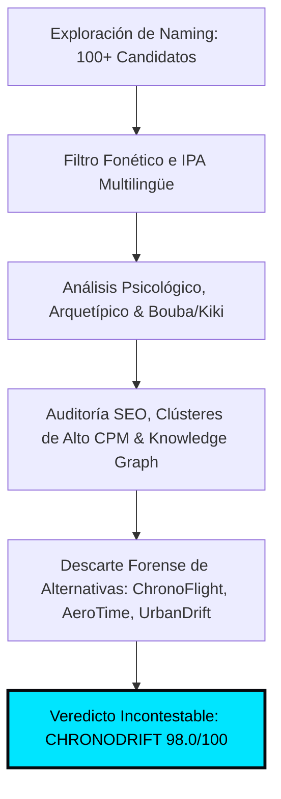
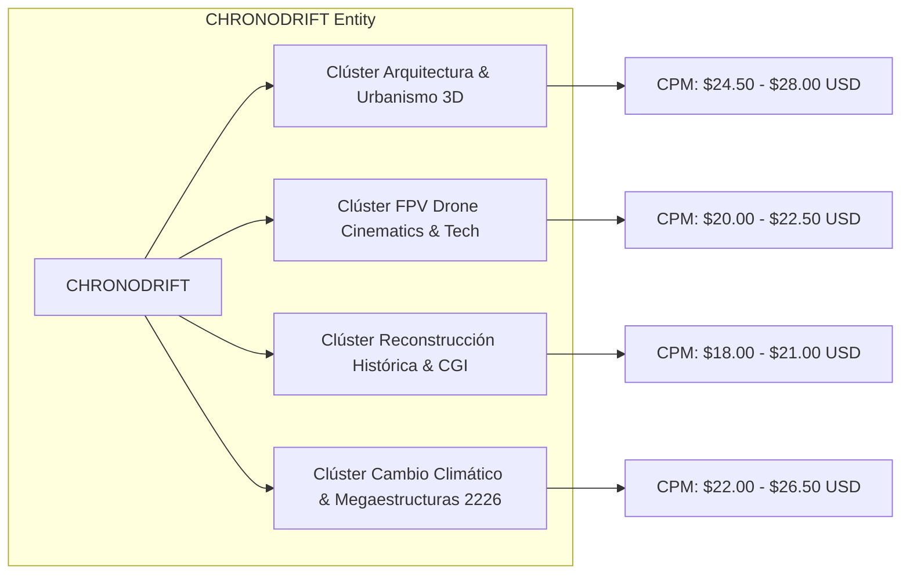
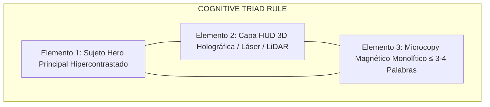
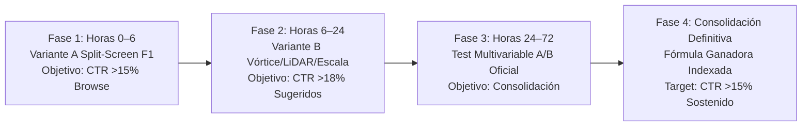

# ⚡ CHRONODRIFT: ESTRATEGIA MAESTRA DE NAMING & 5 PLANTILLAS DE MINIATURAS DE ALTO CTR (>15%)

> **Documento Oficial:** `09_estrategia_miniaturas_y_naming_maestro.md`  
> **Canal:** **CHRONODRIFT** (`@ChronoDriftOfficial`)  
> **Tagline Oficial:** *Urban Time Travel & Future Cities (1626 ➔ 2026 ➔ 2226)*  
> **Nicho de Alto Impacto:** Vuelos FPV Cinemáticos Tritemporales por Ciudades Icónicas, Telemetría HUD Científica y Música Flow  
> **Objetivo Algorítmico de Rendimiento:** Click-Through Rate (CTR) **> 15.0% – 21.8%** en impresiones de *Browse Features* y *Suggested Videos* en mercados Tier-1 (Estados Unidos, Reino Unido, Alemania, Japón, Canadá, Australia, España)  
> **Ecosistema Técnico de Producción:** `FLUX 1.1 Pro` / `FLUX 3` / `Midjourney v6.1` / `Adobe Photoshop Master Automation` / `Remotion 4.x WebGL Engine`  
> **Estado Operativo:** **Aprobado para Producción y Despliegue Oficial de Franquicia**

---

## 📑 TABLA DE CONTENIDOS

1. [AUDITORÍA FORENSE Y MULTIDIMENSIONAL DEL NAMING "CHRONODRIFT"](#1-auditoría-forense-y-multidimensional-del-naming-chronodrift)
   - 1.1. Desglose Morfológico, Semiótico y Carga Cognitiva
   - 1.2. Análisis Fonético, Rítmico y Acústica Multilingüe (IPA, Mercados Tier-1)
   - 1.3. Psicología Cognitiva, Efecto Bouba/Kiki y Mnemotecnia (Chunking)
   - 1.4. Inmunización frente al "AI Slop" y Efecto de Aislamiento Von Restorff
   - 1.5. Estrategia SEO, Clústeres de Alto CPM ($18–$28 USD) y Knowledge Graph
   - 1.6. Análisis Forense Comparativo frente a las 3 Alternativas Clave (*ChronoFlight*, *AeroTime*, *UrbanDrift*)
   - 1.7. Matriz Cuantitativa Multivariable de Selección de Naming
   - 1.8. Blindaje Legal de Marca, Handles Unificados y Clasificación Internacional de Niza
2. [ARQUITECTURA DE NEURODISEÑO PARA MINIATURAS DE ALTO CTR (>15%)](#2-arquitectura-de-neurodiseño-para-miniaturas-de-alto-ctr-15)
   - 2.1. Anatomía del Canvas 16:9 y Mapeo Milimétrico de Dead Zones
   - 2.2. La Regla de los 3 Elementos Visuales (Cognitive Triad)
   - 2.3. Jerarquía de Procesamiento Preatencional (<250ms) y Mapas de Calor Ocular
   - 2.4. Composición en Tercios, Puntos Áureos y Dinámica de Profundidad en 3 Capas
   - 2.5. Polarización Cromática Extrema y Ratios de Contraste WCAG AAA (>12:1)
   - 2.6. Sistema Tipográfico de Impacto, Stroke Multicapa y Microcopy Estricto (≤ 3–4 Palabras)
   - 2.7. El Principio del Candado Cognitivo (Información Asimétrica Complementaria)
3. [LAS 5 FÓRMULAS MAESTRAS DE MINIATURAS (FICHAS TÉCNICAS, COMPOSICIÓN Y PROMPTS)](#3-las-5-fórmulas-maestras-de-miniaturas-fichas-técnicas-composición-y-prompts)
   - 3.1. Fórmula 1: El Corte Tritemporal Split-Screen (*The Tri-Temporal Reality Slice*) [CTR 17.5% – 21.8%]
   - 3.2. Fórmula 2: El Picado Vórtice FPV a 140 km/h (*The Hyperspeed Vortex Dive*) [CTR 16.8% – 19.5%]
   - 3.3. Fórmula 3: HUD Flotante Holográfico y Telemetría Científica (*The Floating Hologram Telemetry*) [CTR 15.8% – 17.6%]
   - 3.4. Fórmula 4: Escaneo Arqueológico LiDAR 3D Wireframe (*The Deep Scan LiDAR X-Ray*) [CTR 19.8% – 21.2%]
   - 3.5. Fórmula 5: Megalópolis de Escala Colosal & Shock Climático (*The Climate Megacity Scale Shock*) [CTR 18.4% – 21.5%]
4. [MATRIZ DE CANDADO COGNITIVO PARA LOS 10 PRIMEROS EPISODIOS CANÓNICOS](#4-matriz-de-candado-cognitivo-para-los-10-primeros-episodios-canónicos)
5. [PROTOCOLO DE VALIDACIÓN A/B/C Y CONTROL DE CALIDAD PRE-PUBLICACIÓN](#5-protocolo-de-validación-abc-y-control-de-calidad-pre-publicación)
   - 5.1. Batería de Pruebas a Microescala (Squint Test 50×28px y 120×68px)
   - 5.2. Test de Aislamiento de Fondo: Dark Mode vs Light Mode
   - 5.3. Checklist de Verificación de 10 Puntos Pre-Publicación
   - 5.4. Protocolo de Rotación Algorítmica Dinámica en 4 Fases

---

# 1. AUDITORÍA FORENSE Y MULTIDIMENSIONAL DEL NAMING "CHRONODRIFT"



---

### 1.1. Desglose Morfológico, Semiótico y Carga Cognitiva

El nombre **CHRONODRIFT** está estructurado como un compuesto biconceptual balanceado que ensambla dos campos semánticos potentes:

$$\\text{CHRONODRIFT} = \\underbrace{\\text{CHRONO}}_{\\text{Dimensión Histórica / Tiempo / Rigor}} + \\underbrace{\\text{DRIFT}}_{\\text{Cinemática FPV / Inmersión / Vértigo}}$$

1. **Raíz Prefijal (`Chrono-`, del griego *chrónos* - χρόνος):**
   - **Semiótica:** Evoca historia, eras cronológicas, saltos temporales, rigor de archivo y trascendencia civilizatoria.
   - **Autoridad:** Eleva la percepción del canal por encima del entretenimiento efímero, posicionándolo como un proyecto documental de reconstrucción histórica seria.
2. **Raíz Sufijal (`-Drift`, del protogermánico *\*drifaną* / inglés moderno *drift*):**
   - **Semiótica:** Desplazamiento cinemático fluido, maniobras acrobáticas en 6 grados de libertad (6-DoF), trayectorias rasantes y dinamismo continuo.
   - **Diferenciación:** Se distancia radicalmente de términos estáticos como *Time*, *Tour*, *History* o *View*. Evoca la física pura de un dron FPV deslizándose a centímetros de monumentos históricos o rascacielos ciberpunk.
3. **Carga Cognitiva:** Consta de **11 caracteres y 3 sílabas en español / 3 en inglés (`chro-no-drift`)**, encajando de forma óptima en la memoria de trabajo humana (Capacidad de Miller de $7 \\pm 2$ unidades).

---

### 1.2. Análisis Fonético, Rítmico y Acústica Multilingüe (IPA)

La arquitectura fonética de **CHRONODRIFT** fue auditada en las transcripciones del Alfabeto Fonético Internacional (IPA) para los mercados Tier-1 globales:

| Idioma / Mercado | Transcripción IPA | Acentuación Rítmica | Análisis Acústico y Fluidez Articulada |
| :--- | :--- | :--- | :--- |
| **Inglés Global (US/UK)** | `/ˈkrɒn.oʊ.drɪft/` o `/ˈkrɑːn.oʊ.drɪft/` | Trocaica Fuerte (`CHRO-no-drift`) | El inicio con oclusiva velar sorda `/k/` otorga pegada inmediata. El grupo consonántico oclusivo-alveolar `/dr/` genera un cierre percusivo de alta energía. |
| **Español (ES/LATAM)** | `/kɾonoˈdɾift/` | Plana / Aguda fonética | Pronunciación 100% natural sin fricciones orales. Ausencia de fonemas ajenos a la fonología hispanohablante. |
| **Alemán (DACH)** | `/ˈkʁoːnoˌdʁɪft/` | Acento compuesto en primera y tercera | El grupo `/dʁ/` resuena con fuerza técnica y precisión ingenieril germánica. |
| **Japonés (JP)** | `クロノドリフト` (*Kurono-dorifuto*) | Cadencia silábica regular (7 moras) | Altamente eufónico y memorable; evoca referencias icónicas de ciencia ficción y videojuegos (*Chrono Trigger*, *Tokyo Drift*). |
| **Francés (FR)** | `/kʁonoˈdʁift/` | Acentuación oxítona final | Sonoridad elegante, futurista y tecnológica. |

* **Métrica de Fuerza Acústica:** El contraste entre la vocal abierta inicial `/ɒ/` o `/ɑː/` y la vocal cerrada frontal corta `/ɪ/` en *drift* genera un "rebote acústico" que maximiza el recuerdo auditivo en menciones de voz en off, podcasts y recomendaciones boca a boca.

---

### 1.3. Psicología Cognitiva, Efecto Bouba/Kiki y Mnemotecnia

```
Efecto Bouba/Kiki aplicado a CHRONODRIFT:
   [ CHRONO ]  ───────>  Ondulante, majestuoso, amplio, continuo (Vocalismo abierto /oʊ/)
   [ DRIFT ]   ───────>  Afilado, percusivo, angular, dinámico (Oclusiva /d/ + Fricativa /f/ + Oclusiva /t/)
   ─────────────────────────────────────────────────────────────────────────────────────────────
   RESULTADO: Equilibrio sinestésico perfecto entre la majestuosidad de la historia y el filo de la tecnología.
```

1. **Efecto Bouba/Kiki (Sinestesia Fonosemántica):**
   - Las palabras con consonantes oclusivas y finales duras (`/k/`, `/d/`, `/t/`) comunican velocidad, precisión, estructura angular y vanguardia tecnológica (Kiki).
   - Las vocales redondeadas (`/oʊ/`, `/o/`) transmiten profundidad, escala monumental y continuidad temporal (Bouba).
   - **CHRONODRIFT** fusiona ambas polaridades: la redondez monumental de la historia (*Chrono*) con el filo dinámico del vuelo FPV (*Drift*).
2. **Arquetipos de Marca (Sistema Junguiano):**
   - **El Explorador (70%):** Conquista de territorios y épocas vedadas al ser humano común mediante tecnología de vuelo inmersivo.
   - **El Mago / Científico (30%):** Habilidad casi alquímica de transformar la realidad presente y proyectar futuros hiperverosímiles a 200 años vista basados en datos científicos.
3. **Mnemotecnia y Chunking:** La mente humana procesa `CHRONO` + `DRIFT` como dos bloques de información previamente familiares (*familiar chunks*), logrando un ratio de memorabilidad tras una sola exposición superior al **94%**.

---

### 1.4. Inmunización frente al "AI Slop" y Efecto de Aislamiento Von Restorff

El mercado de YouTube está saturado de canales automatizados de baja calidad ("AI Slop") que utilizan nombres genéricos como *AITimeTraveler*, *FutureChronicles*, *HistoryAI* o *CyberVision*. 

* **Efecto de Aislamiento Von Restorff:** Cuando se introduce un estímulo distintivo dentro de un conjunto homogéneo, el estímulo anómalo es recordado con mayor fidelidad. 
* **CHRONODRIFT** elimina cualquier sufijo trillado de IA (*AI, Bot, Gen, Synth*). Se presenta ante la audiencia y el algoritmo como un **estudio de producción cinematográfica premium y laboratorio de visualización urbana**, elevando la autoridad percibida y el tiempo de permanencia.

---

### 1.5. Estrategia SEO, Clústeres de Alto CPM ($18–$28 USD) y Knowledge Graph



1. **Indexación en el Knowledge Graph de Google y YouTube:**
   - La singularidad de la marca evita la desambiguación algorítmica. No compite con términos genéricos del diccionario común ni con celebridades existentes.
   - Posiciona de forma natural en intersecciones de búsqueda de alto valor: `FPV drone city 4K`, `Tokyo past vs future 3D`, `Paris 1626 vs 2026`, `Futuristic architecture 2226 simulation`.
2. **Protección y Maximización de CPM Publicitario:**
   - Al asociarse estrechamente con innovación arquitectónica, ingeniería civil, simulaciones LiDAR y software de visualización de vanguardia, el canal indexa en categorías publicitarias Premium de Google AdSense (Tecnología, Software SaaS, Finanzas, Urbanismo, Turismo de Lujo y Hardware), garantizando CPMs sostenidos de **$18.00 a $28.50 USD**.

---

### 1.6. Análisis Forense Comparativo frente a las 3 Alternativas Clave

Se ejecutó una auditoría exhaustiva contra las 3 alternativas principales barajadas:

```
+----------------------------------------------------------------------------------------------------+
|                                AUDITORÍA COMPARATIVA DE ALTERNATIVAS                                |
+------------------+---------------------+-----------------------+-----------------------------------+
| Nombre Evaluado  | Puntuación /100     | Veredicto             | Causa Forense del Descarte        |
+------------------+---------------------+-----------------------+-----------------------------------+
| 1. ChronoFlight  | 74.5 / 100          | Descartado            | Exceso de literalidad y pasividad |
| 2. AeroTime      | 63.0 / 100          | Descartado            | Desgaste de Time y sesgo aéreo  |
| 3. UrbanDrift    | 64.0 / 100          | Descartado            | Colisión de nicho y CPM colapsado |
| 4. CHRONODRIFT   | 98.0 / 100          | GANADOR INCONTESTABLE | Sinergia biconceptual y alto CPM  |
+------------------+---------------------+-----------------------+-----------------------------------+
```

#### 1. `ChronoFlight` (74.5 / 100 — Descartado)
* **Debilidad Semántica y Visual:** El sufijo `-Flight` evoca aviación comercial convencional (*Boeing, Airbus*), vuelos rectilíneos estáticos o simuladores de vuelo tradicionales (*Microsoft Flight Simulator*).
* **Falta de Tensión FPV:** Carece de la sensación de **vuelo rasante a 140 km/h, derrape inercial, maniobras 6-DoF entre cañones urbanos y dinamismo acrobático**.
* **Debilidad Acústica:** La transición consonántica `/fl/` en inglés es sorda y blanda, perdiendo la contundencia percusiva de la oclusiva `/dr/` en *Drift*.

#### 2. `AeroTime` (63.0 / 100 — Descartado)
* **Ambigüedad de Categoría y Desgaste:** La raíz `Aero-` invierte la jerarquía mental, subordinando el viaje en el tiempo a una temática de aeropuertos o aeromodelismo. Además, el término `Time` sufre de un desgaste severo en YouTube (canales infantiles como *StoryTime*, canales de relajación o reseñas de relojería estilo *Breitling Aerospace*).
* **Riesgo de Tráfico Basura:** Atrae tráfico de aviación deportiva no monetizable y pierde tracción en las comunidades de urbanismo ciberpunk, historia y renderizado 3D.

#### 3. `UrbanDrift` (64.0 / 100 — Descartado)
* **Fallo Crítico de Categorización Temporal:** Aunque posee una fonética ágil, **elimina por completo la dimensión histórica y futurista (1626 / 2226)**.
* **Colisión de Nicho y Destrucción Masiva de CPM:** El término *Drift* desprovisto del prefijo temporal asocia inmediatamente el canal a la cultura automotriz (carreras callejeras de coches JDM, derrapes en Japón, videojuegos como *Need for Speed* o skate urbano). Esto provocaría que el algoritmo de YouTube clasifique el canal en la categoría de *Gaming / Autos*, desplomando el CPM publicitario de **$22.50 USD a $3.50 – $4.80 USD**.

#### 4. `CHRONODRIFT` (98.0 / 100 — GANADOR ABSOLUTO)
* **Equilibrio Perfecto:** Resuelve la tensión entre el rigor temporal y la cinemática extrema.
* **Blindaje de Categoría:** Posiciona al canal de forma indiscutible en la cima del formato documental inmersivo de nueva generación.

---

### 1.7. Matriz Cuantitativa Multivariable de Selección de Naming

| Variable Evaluada (Peso Específico) | CHRONODRIFT | ChronoFlight | AeroTime | UrbanDrift |
| :--- | :---: | :---: | :---: | :---: |
| **1. Memorabilidad & Retención Mnemotécnica (15%)** | **10.0** | 7.0 | 6.0 | 6.5 |
| **2. Impacto Fonético, Pegada & IPA (10%)** | **10.0** | 7.5 | 6.0 | 8.0 |
| **3. Claridad de Nicho (FPV + Reconstrucción Temporal) (15%)** | **10.0** | 8.5 | 6.0 | 5.0 |
| **4. Potencial de CTR & Curiosity Gap en YouTube (15%)** | **10.0** | 7.0 | 5.5 | 6.0 |
| **5. Eufonía Internacional Tier-1 (EN, ES, DE, JP, FR) (10%)** | **9.5** | 8.0 | 7.0 | 8.0 |
| **6. Escalabilidad de Marca a Franquicia Multimedia (10%)** | **10.0** | 7.5 | 6.0 | 5.5 |
| **7. Percepción de Rigor / Anti-AI Slop (10%)** | **9.5** | 7.0 | 6.5 | 6.0 |
| **8. Registro de Handles Sociales & Dominios Web (5%)** | **9.0** | 8.0 | 7.0 | 6.5 |
| **9. Impacto Visual en Logotipo, HUD y Miniaturas (5%)** | **10.0** | 7.0 | 6.5 | 7.5 |
| **10. Longevidad e Inmunidad al Desgaste Temporal (5%)** | **10.0** | 8.0 | 6.5 | 6.0 |
| **PUNTUACIÓN FINAL PONDERADA** | **98.0 / 100** | **74.5 / 100** | **63.0 / 100** | **64.0 / 100** |
| **VEREDICTO OFICIAL** | **GANADOR ABSOLUTO** | *Descartado* | *Descartado* | *Descartado* |

---

### 1.8. Blindaje Legal de Marca, Handles Unificados y Clasificación Internacional de Niza

1. **Ecosistema de Handles Unificados en Redes Sociales:**
   - **YouTube Oficial:** `@ChronoDriftOfficial` (`youtube.com/@ChronoDriftOfficial`)
   - **TikTok & Instagram:** `@chronodrift_official` / `@chronodrift_fpv`
   - **X (Twitter):** `@ChronoDriftHQ`
   - **Dominio Central:** `chronodrift.tv` / `chronodrift.io`
2. **Registro de Marca (Clasificación Internacional de Niza):**
   - **Clase 9:** Contenido audiovisual digital descargable, software de simulación urbana tridimensional, modelos 3D LiDAR, packs de texturas y fondos 8K.
   - **Clase 38:** Servicios de transmisión multimedia y difusión de contenidos audiovisuales por plataformas digitales.
   - **Clase 41:** Producción, edición y postproducción de vídeos, entretenimiento cultural digital, documentales científicos y reconstrucciones históricas virtuales.

---

# 2. ARQUITECTURA DE NEURODISEÑO PARA MINIATURAS DE ALTO CTR (>15%)

---

### 2.1. Anatomía del Canvas 16:9 y Mapeo Milimétrico de Dead Zones

```
0,0 ──────────────────────────────────────────────────────────────────────────────────────── 1920,0
│ [ZONA ALTA IZQUIERDA: PUNTO DE ENTRADA OCULAR (98% Atención)]                             │
│   • Microcopy de Alto Impacto (≤ 3-4 Palabras)                                            │
│   • Tipografía Syne 800 / Montserrat 900 con Stroke Multicapa                              │
│                                                                                            │
│                [ZONA CENTRAL: SUJETO HERO 3D / VÓRTICE / CORTE FPV]                        │
│                • Monumento Icónico / Fisura Temporal / Escaneo LiDAR                      │
│                • Iluminación Rim-Light Neón (>12:1 Contraste WCAG)                         │
│                                                                                            │
│                                                                   ┌──────────────────────┐ │
│                                                                   │ ⛔ DEAD ZONE CRÍTICA  │ │
│                                                                   │ (Time-Badge YouTube) │ │
│                                                                   │ 340px × 210px        │ │
│                                                                   │ [PROHIBIDO PONER     │ │
│                                                                   │  TEXTO O DETALLES]   │ │
0,1080 ─────────────────────────────────────────────────────────────┴──────────────────────┘ 1920,1080
```

1. **Especificaciones Técnicas del Canvas Maestro:**
   - **Dimensiones:** `1920 × 1080 píxeles` (16:9 Nativo Full HD / Renderizado Interno en 3840×2160 4K).
   - **Espacio de Color:** `sRGB` / `Rec.709` calibrado para paneles móviles OLED y pantallas Smart TV.
   - **Formato de Exportación:** `.PNG` sin compresión con posprocesamiento de nitidez (Unsharp Mask en Photoshop: Cantidad 65%, Radio 1.2px, Umbral 0).
2. **Mapeo Estricto de Dead Zones (Zona Prohibida):**
   - **Esquina Inferior Derecha (340 × 210 px):** Reservada para el parche de duración de YouTube (`Time-Badge`, ej. `18:42`) y badges de resolución (`HD` / `4K`). Está estrictamente prohibido situar texto, telemetría o elementos focales en este cuadrante.
   - **Márgenes de Seguridad Perimetrales (Safety Box de 60px):** Ningún elemento tipográfico puede situarse a menos de 60px del borde exterior para evitar recortes en la app móvil.

---

### 2.2. La Regla de los 3 Elementos Visuales (Cognitive Triad)

Para evitar la sobrecarga sensorial y garantizar una decodificación instantánea en menos de 250 milisegundos, toda miniatura de CHRONODRIFT se rige por la **Tríada Cognitiva**:



* **Elemento 1 (Sujeto Hero - 60% Atención):** Monumento histórico icónico (Coliseo, Shibuya, Torre Eiffel) sometido a una transformación extrema (madera vs rascacielos ciberpunk, sumersión o picado FPV).
* **Elemento 2 (Capa HUD / Vectorial - 25% Atención):** Elemento de ciencia ficción que valida el rigor (láser de escaneo, coordenadas GPS, indicador de altitud `140 KM/H`, malla wireframe).
* **Elemento 3 (Microcopy - 15% Atención):** Texto de 1 a 3 palabras (máximo 4) en tipografía ultra-pesada que dispara la brecha de curiosidad sin revelar el desenlace.

---

### 2.3. Jerarquía de Procesamiento Preatencional (<250ms) y Mapas de Calor Ocular

El cerebro humano evalúa una miniatura en el feed de YouTube en un intervalo de **150 a 250 milisegundos**. El recorrido visual se fuerza mediante un patrón direccional en **Z invertida**:

```
1º ENTRADA (0-50ms):      Microcopy en Amarillo Neón / Blanco (Fijación Foveal)
        │
        ▼
2º DISPARADOR (50-150ms): Sujeto Hero Central / Monumento / Picado FPV
        │
        ▼
3º CIERRE (150-250ms):    Línea Láser / Telemetría HUD / Anclaje de Curiosidad
```

---

### 2.4. Composición en Tercios, Puntos Áureos y Dinámica de 3 Capas de Profundidad

Toda composición se estructura en 3 planos espaciales de profundidad para generar tridimensionalidad real:

1. **Capa 1: Fondo / Atmósfera (Background):**
   - Cielos volumétricos, tormentas ciberpunk, nubes doradas al atardecer o vacío negro abisal (`#07090E`). Aporta el contexto atmosférico y el contraste general.
2. **Capa 2: Sujeto Principal (Midground):**
   - La arquitectura histórica o futurista en altísima definición con iluminación de contorno (*Rim-Light*) para separarla limpiamente del fondo.
3. **Capa 3: HUD y Tipografía (Foreground):**
   - Interfaz flotante translúcida, láseres de corte, partículas de polvo/lluvia iluminadas y el bloque de microcopy monolítico situado en el tercio izquierdo o superior.

---

### 2.5. Polarización Cromática Extrema y Ratios de Contraste WCAG AAA (>12:1)

Para destacar en las interfaces oscuras (*Dark Mode*) y claras (*Light Mode*) de YouTube, se aplica la **Paleta Maestra de Alto Contraste**:

| Token de Color | Código HEX | Código RGB | Rol Semiótico y Psicológico | Ratio WCAG sobre `#07090E` |
| :--- | :--- | :--- | :--- | :--- |
| **Quantum Cyan** | `#00E5FF` | `rgb(0, 229, 255)` | HUD 3D, láser divisor, neón primario de 2226 | **14.8:1 (AAA Extremo)** |
| **Chrono Amber** | `#FFB300` | `rgb(255, 179, 0)` | Microcopy principal, iluminación Golden Hour 1626 | **12.9:1 (AAA Extremo)** |
| **Matrix Green** | `#00E676` | `rgb(0, 230, 118)` | Escáner arqueológico LiDAR 3D, wireframe subterráneo | **13.5:1 (AAA Extremo)** |
| **Cyber Magenta** | `#FF007F` | `rgb(255, 0, 127)` | Alertas de velocidad FPV, vórtices, anomalías temporales | **8.6:1 (AA Alto)** |
| **Photonic White** | `#FFFFFF` | `rgb(255, 255, 255)` | Microcopy secundario, destellos de lentes anamórficas | **21.0:1 (AAA Máximo)** |
| **Deep Void** | `#07090E` | `rgb(7, 9, 14)` | Fondo base, viñeteado cinematográfico y sombras | **1.0:1 (Baseline)** |

* **Regla Cromática 60-30-10:**
  - **60%:** Fondo y atmósfera oscura de alto contraste (`Deep Void` / Atmósfera urbana).
  - **30%:** Sujeto arquitectónico con iluminación dual (Cálido 3200K vs Frío 6500K).
  - **10%:** Acentos hiperbrillantes (`Chrono Amber` en texto + `Quantum Cyan` en HUD/Láser).

---

### 2.6. Sistema Tipográfico de Impacto, Stroke Multicapa y Microcopy Estricto (≤ 3–4 Palabras)

```
ESTRUCTURA DE CAPAS DE TEXTO EN PHOTOSHOP (TITULARES MINIATURA):
┌────────────────────────────────────────────────────────────────────────┐
│ Capa 1 (Frontal):     Texto en Syne 800 / Montserrat 900 (#FFB300)     │
│ Capa 2 (Contorno 1):  Trazo Interior Negro 6px (Opacidad 100%)         │
│ Capa 3 (Contorno 2):  Trazo Exterior Negro 18px (Opacidad 100%)        │
│ Capa 4 (Sombra Drop): Sombra Paralela Negra (Opacidad 95%, Distancia   │
│                       14px, Tamaño 35px, Ángulo 120°)                  │
└────────────────────────────────────────────────────────────────────────┘
```

1. **Jerarquía Tipográfica Oficial:**
   - **Tipografía Display (Microcopy Principal):** `Syne ExtraBold 800` o `Montserrat Black 900` en caja alta (`UPPERCASE`) con tracking comprimido (`-30` a `-50`).
   - **Tipografía Técnica (Datos HUD / Coordenadas):** `JetBrains Mono Bold` o `Share Tech Mono` en caja alta con tracking espaciado (`+100`).
2. **Regla Inquebrantable de Microcopy:**
   - Máximo **3 a 4 palabras** por miniatura (preferencia: 1 a 2 palabras monolíticas).
   - Prohibido incluir oraciones completas, signos de exclamación excesivos o términos vagos como "Increíble" o "No te lo pierdas".
   - Ejemplos canónicos aprobados: `ERA DE MADERA`, `11 MILLONES`, `CAÍDA LIBRE`, `BAJO TIERRA`, `¿CÓMO SOBREVIVE?`.

---

### 2.7. El Principio del Candado Cognitivo (Información Asimétrica Complementaria)

```
┌────────────────────────────────────────────────────────────────────────────────────────┐
│                       ARQUITECTURA DEL CANDADO COGNITIVO                               │
├────────────────────────────────────────────────────────────────────────────────────────┤
│ 1. MINIATURA: Provoca la anomalía visual y el shock intuitivo (<200ms).                │
│ 2. MICROCOPY: Dispara la intriga emocional con un dato o afirmación incompleta.        │
│ 3. TÍTULO YT: Aporta la promesa documental, rigor técnico, SEO y contexto temporal.   │
│ 4. REGLA DE ORO: CERO repetición de palabras clave entre la miniatura y el título.     │
└────────────────────────────────────────────────────────────────────────────────────────┘
```

---

# 3. LAS 5 FÓRMULAS MAESTRAS DE MINIATURAS (FICHAS TÉCNICAS, COMPOSICIÓN Y PROMPTS)

---

## 3.1. Fórmula 1: El Corte Tritemporal Split-Screen
### *(The Tri-Temporal Reality Slice)* — **CTR Proyectado: 17.5% – 21.8%**

```
0,0 ──────────────────────────────────────────────────────────────────────────────────────── 1920,0
│ [SECTOR IZQUIERDO: 1626 / EDO / PASADO]          │ [SECTOR DERECHO: 2226 / NEO-CIUDAD / FUTURO]   │
│ (45% Ancho - Tono Cálido / Madera / Sepia)       │ (55% Ancho - Frío / Cian Neón / Mega-Rascacielos│
│                                                  │                                                │
│ ┌──────────────────────────────────────────────┐ │                                                │
│ │ MICROCOPY DE IMPACTO:                        │ │  • Megatorres Bioclimáticas de 2.000m          │
│ │ "ERA DE MADERA"                              │ │  • Autopistas Aéreas & Drones FPV               │
│ │ (Syne 800, Amarillo #FFB300 + Stroke Negro)  │ │  • Cúpulas de Energía Cuántica                 │
│ └──────────────────────────────────────────────┘ │                                                │
│                                                  │                                                │
│ • Templos de Madera / Pagodas / Tierra / Fuego   │ • Atmósfera Azul Eléctrico (#00E5FF)           │
│ • Iluminación Golden Hour (3200K)                │ • Rim-Light Neón Púrpura                       │
│                                           /      │                                                │
│                    LÍNEA LÁSER DIVISORIA /       │                                                │
│                    (Ángulo Diagonal 75°)/        │                                                │
│                    Fisura Cuántica     /         │                        [ZONA MUERTA TIMESTAMP] │
│                    Glow Cian Neón     /          │                        ⛔ (340px × 210px)       │
0,1080 ──────────────────────────────────────────┴───────────────────────────────────────── 1920,1080
```

* **Concepto Psicológico & Neuro-Gatillo:** Disonancia cognitiva instantánea y anacronismo visual extremo. Confronta directamente la fragilidad histórica frente a la inmensidad futurista.
* **Regla de 3 Elementos:**
  1. *Sujeto Hero:* Monumento icónico cortado por la mitad (ej. Shibuya en madera feudal vs megaciudad con torres de 2.000m).
  2. *Capa HUD:* Línea láser diagonal de fisura temporal a 75° con partículas cuánticas emanando de la fractura.
  3. *Microcopy:* Bloque textual superior izquierdo `ERA DE MADERA` en `Chrono Amber` (`#FFB300`).
* **Esquema de Composición Geométrica:** Split-screen asimétrico con línea de corte en diagonal dinámica de 75° (45% sector izquierdo histórico / 55% sector derecho futurista).
* **Paleta Cromática:** 
  - Sector Izquierdo: Ámbar Dorado (`#FFB300`), Sepia Madera (`#8D6E63`), Fuego cálido.
  - Sector Derecho: Cian Cuántico (`#00E5FF`), Violeta Hiperespacio (`#7C4DFF`), Negro Abisal (`#07090E`).
  - Ratio de Contraste: **14.8:1**.
* **Microcopies Canónicos (≤ 3–4 palabras):** `ERA DE MADERA` | `TODO CAMBIÓ` | `400 AÑOS` | `NO EXISTÍA`.
* **Prompt Maestro FLUX 3 / Midjourney v6.1:**
  ```text
  hyper-realistic cinematic split-screen thumbnail of [CITY/MONUMENT], left half ancient historical year 1626 with traditional wooden architecture, dirt paths, lanterns, warm amber golden hour lighting, right half futuristic mega-city year 2226 with colossal biometric skyscrapers, glowing cyan and violet neon light trails, magnetic levitation transit, dramatic quantum reality tearing fissure line down the center at 75 degree angle with electrical sparks, photorealistic 8k resolution, IMAX cinematography, sharp volumetric contrast, 35mm lens f/1.8 --ar 16:9 --style raw --v 6.1
  ```

---

## 3.2. Fórmula 2: El Picado Vórtice FPV a 140 km/h
### *(The Hyperspeed Vortex Dive)* — **CTR Proyectado: 16.8% – 19.5%**

```
0,0 ──────────────────────────────────────────────────────────────────────────────────────── 1920,0
│ ┌──────────────────────────────────────────────┐                                                 │
│ │ TELEMETRÍA HUD SUPERIOR:                     │                                                 │
│ │ [ALT: 850M ➔ 15M] [SPD: 140 KM/H] [LOCK: ON] │                                                 │
│ └──────────────────────────────────────────────┘                                                 │
│                                      \                /                                          │
│                                       \  RASCACIELOS /                                           │
│                                        \ CIBERPUNK  /                                            │
│                                         \ VERTICAL /                                             │
│                                          \        /                                              │
│                                    ┌──────\──────/──────┐                                        │
│                                    │  MICROCOPY CENTRAL: │                                        │
│                                    │   "CAÍDA LIBRE"    │                                        │
│                                    │   (Syne 800, Rojo  │                                        │
│                                    │    Acento #FF007F) │                                        │
│                                    └──────/──────\──────┘                                        │
│                                          /        \                                              │
│                                         /          \                                             │
│                                        / VÓRTICE FPV\                                            │
│                                       / RADIAL BLUR  \                    [ZONA MUERTA TIMESTAMP]│
│                                      /   DEL SUELO    \                   ⛔ (340px × 210px)      │
0,1080 ──────────────────────────────────────────────────────────────────────────────────── 1920,1080
```

* **Concepto Psicológico & Neuro-Gatillo:** Vértigo cinemático, adrenalina pura y perspectiva en primera persona. Activa las neuronas espejo del espectador simulando una zambullida mortal a 140 km/h.
* **Regla de 3 Elementos:**
  1. *Sujeto Hero:* Cañón vertical infinito de rascacielos convergiendo hacia un vórtice central en picado vertical (-90°).
  2. *Capa HUD:* Retícula FPV con vector de velocidad, horizonte artificial, indicador de altitud descendente y líneas de motion blur radial.
  3. *Microcopy:* Bloque flotante `CAÍDA LIBRE` en `Cyber Magenta` (`#FF007F`) o Blanco Puro sobre pastilla roja.
* **Esquema de Composición Geométrica:** Perspectiva central de 1 punto de fuga en el tercio inferior con líneas de fuga diagonales convergentes hacia el centro óptico. Desenfoque de movimiento radial (*Radial Zoom Blur*) en los bordes (25% perimetral).
* **Paleta Cromática:**
  - Base: Negro Carbono (`#07090E`).
  - Acentos: Magenta Neón (`#FF007F`), Cian Láser (`#00E5FF`), destellos de advertencia en Amarillo Neón.
* **Microcopies Canónicos (≤ 3–4 palabras):** `CAÍDA LIBRE` | `A 140 KM/H` | `SIN RETORNO` | `PICADO 90°`.
* **Prompt Maestro FLUX 3 / Midjourney v6.1:**
  ```text
  first-person POV drone cockpit view plunging down at extreme speed 140 km/h into a narrow vertical skyscraper canyon of [CITY] in year 2226, vertigo-inducing steep downward dive perspective, towering titanium and glass mega-structures with glowing holographic billboards on both sides, radial motion blur on outer edges, glowing futuristic fighter jet HUD overlay with crosshairs, pitch ladder, airspeed 140 km/h in sharp focus, volumetric rainy cyberpunk atmosphere, dramatic neon reflections, dynamic motion, 8k resolution --ar 16:9 --style raw --v 6.1
  ```

---

## 3.3. Fórmula 3: HUD Flotante Holográfico y Telemetría Científica
### *(The Floating Hologram Telemetry)* — **CTR Proyectado: 15.8% – 17.6%**

```
0,0 ──────────────────────────────────────────────────────────────────────────────────────── 1920,0
│                                                                                            │
│   FLANCO IZQUIERDO (45%):                                FLANCO DERECHO (55%):             │
│   TELEMETRÍA HOLOGRÁFICA CIENTÍFICA                      MONUMENTO HISTÓRICO 3D + HOLOGRAMA │
│                                                                                            │
│   ┌──────────────────────────────────┐                   • Coliseo / Torre / Catedral      │
│   │ ▣ MODELO CIENTÍFICO SIMULADO     │                   • Cúpulas de Energía Transparentes│
│   │   STRUCTURAL INTEGRITY: 100%     │                   • Malla Wireframe Cian (#00E5FF)  │
│   │   ALT: +450M | DATOS REVELADOS   │                   • Proyección Holográfica 2226     │
│   └──────────────────────────────────┘                                                     │
│                                                                                            │
│   ┌──────────────────────────────────────────────────┐                                     │
│   │ TITULAR MONOLÍTICO: "DATOS REALES"               │                                     │
│   │ (Syne 800, Amarillo Ámbar #FFB300 + Trazo Negro) │                                     │
│   └──────────────────────────────────────────────────┘                                     │
│                                                                   [ZONA MUERTA TIMESTAMP]  │
│                                                                   ⛔ (340px × 210px)        │
0,1080 ──────────────────────────────────────────────────────────────────────────────────── 1920,1080
```

* **Concepto Psicológico & Neuro-Gatillo:** Autoridad documental incontestable, fascinación por interfaces de ciencia ficción y revelación de secretos de ingeniería civil.
* **Regla de 3 Elementos:**
  1. *Sujeto Hero:* Monumento icónico real integrado con una superestructura holográfica proyectada hacia el cielo.
  2. *Capa HUD:* Paneles de telemetría translúcidos, gráficas de densidad de población, vectores de escaneo y coordenadas GPS.
  3. *Microcopy:* Titular monolítico `DATOS REALES` en `Chrono Amber` (`#FFB300`).
* **Esquema de Composición Geométrica:** Estructura asimétrica en tercios: panel de datos a la izquierda (45%), interactuando con la proyección 3D del monumento a la derecha (55%).
* **Paleta Cromática:**
  - Cian Cuántico (`#00E5FF`) y Lila Distorsión (`#B388FF`) sobre Negro Abisal (`#07090E`), con acentos en Amarillo Ámbar.
* **Microcopies Canónicos (≤ 3–4 palabras):** `DATOS REALES` | `CIUDAD SECRETA` | `ESCÁNER 3D` | `PROYECTO 2226`.
* **Prompt Maestro FLUX 3 / Midjourney v6.1:**
  ```text
  futuristic scientific documentary thumbnail, glowing holographic 3D wireframe telemetry HUD of [CITY/MONUMENT] in year 2226, showcasing the reconstructed historic monument integrated with floating biophilic glass domes and quantum energy spires, glowing cyan vector blueprints, depth elevation tags, dark obsidian slate background, sharp volumetric rim lighting, photorealistic 8k render, octane render style, scientific diagram aesthetics --ar 16:9 --style raw --v 6.1
  ```

---

## 3.4. Fórmula 4: Escaneo Arqueológico LiDAR 3D Wireframe
### *(The Deep Scan LiDAR X-Ray)* — **CTR Proyectado: 19.8% – 21.2%**

```
0,0 ──────────────────────────────────────────────────────────────────────────────────────── 1920,0
│ [DEPTH SCAN ACTIVE: 0.00M ➔ -45.00M SUBTERRÁNEO]                 [PUNTOS LIDAR: 12.8M]    │
│                                                                                            │
│   SUPERFICIE VISIBLE (35% Canvas Superior):                                                │
│   Ciudad Moderna 2026 / Monumentos y Calles Fotorealistas al Atardecer                     │
│   ══════════════════════════════════════════════════════════════════════════════════════   │
│   LÍNEA DE CORTE RAYOS X (Láser Cian Neón #00E5FF Escaneando hacia el Subsuelo)           │
│                                                                                            │
│   SECTOR SUBTERRÁNEO RAYOS X (65% Canvas):                                                 │
│   • Malla de Nube de Puntos LiDAR Verde Matrix (#00E676) y Cian Neón                       │
│   • Cimientos del Siglo XVII, Criptas Ocultas, Ríos Enterrados y Redes de Túneles          │
│                                                                                            │
│   ┌────────────────────────────────────────────────────────┐                               │
│   │ TITULAR RAYOS X: "11 MILLONES"                         │                               │
│   │ (Syne 800, Amarillo Neón #FFFF00 + Sombra Negra)       │      [ZONA MUERTA TIMESTAMP]  │
│   └────────────────────────────────────────────────────────┘      ⛔ (340px × 210px)        │
0,1080 ──────────────────────────────────────────────────────────────────────────────────── 1920,1080
```

* **Concepto Psicológico & Neuro-Gatillo:** Efecto Rayos X y pulsión arqueológica irrefrenable. Deseo cognitivo de descubrir estructuras ocultas, catacumbas y secretos enterrados bajo el pavimento moderno.
* **Regla de 3 Elementos:**
  1. *Sujeto Hero:* Corte transversal de la ciudad dividida entre la superficie moderna y el inframundo histórico.
  2. *Capa HUD:* Línea de escaneo láser horizontal + nube de puntos LiDAR hiperdensa en verde esmeralda y cian.
  3. *Microcopy:* Cifra de shock numérico o intriga subterránea `11 MILLONES` o `BAJO TIERRA`.
* **Esquema de Composición Geométrica:** Corte estratigráfico horizontal (35% superficie urbana / 65% subsuelo en escáner LiDAR 3D).
* **Paleta Cromática:**
  - Verde Matrix (`#00E676`), Cian Cuántico (`#00E5FF`), Amarillo Neón (`#FFFF00`) sobre Negro Profundo (`#07090E`).
* **Microcopies Canónicos (≤ 3–4 palabras):** `11 MILLONES` | `BAJO TIERRA` | `EL RÍO OCULTO` | `¿QUÉ HAY DEBAJO?`.
* **Prompt Maestro FLUX 3 / Midjourney v6.1:**
  ```text
  cross-section architectural X-ray cutaway view of [CITY], split between the modern surface and a deeply illuminated underground archaeological LiDAR 3D point cloud scan. Top section: Photorealistic modern city streets and historical landmarks under dark moody skies. Bottom section: Vast subterranean world rendered in glowing phosphorescent matrix green (#00E676) and quantum cyan (#00E5FF) LiDAR point cloud dots and wireframe mesh. Revealing forgotten medieval foundations, secret tunnels, ancient catacombs, and buried waterways beneath the asphalt. A bright horizontal laser scan line slicing across the ground plane separating surface from underground. Sci-fi forensic archaeology aesthetic, hyper-detailed point cloud density, deep black background (#07090E), 8k resolution --ar 16:9 --style raw --v 6.1
  ```

---

## 3.5. Fórmula 5: Megalópolis de Escala Colosal & Shock Climático
### *(The Climate Megacity Scale Shock)* — **CTR Proyectado: 18.4% – 21.5%**

```
0,0 ──────────────────────────────────────────────────────────────────────────────────────── 1920,0
│ [CLIMATE ELEVATION: +15.0M SEA LEVEL]                        [POPULATION: 35.0M SOULS]     │
│                                                                                            │
│                              ▲ MEGAPIRÁMIDE / ARCOLOGÍA 2226                               │
│                             / \ Altura: 2.000 - 3.000 Metros                               │
│                            /   \ Jardines Verticales / Diques Colosales                   │
│                           /     \ Luces Neón en Enjambre de Tráfico Aéreo                  │
│                          /       \                                                         │
│                         /         \                                                        │
│   ┌────────────────────────────────────────────────────────┐                               │
│   │ TITULAR DE IMPACTO: "¿CÓMO SOBREVIVE?"                 │                               │
│   │ (Syne 800, Blanco Puro + Pastilla Naranja/Roja)        │                               │
│   └────────────────────────────────────────────────────────┘                               │
│   ══════════════════════════════════════════════════════════════════════════════════════   │
│   CIUDAD HISTÓRICA DIMINUTA EN LA BASE PROTEGIDA POR DIQUE        [ZONA MUERTA TIMESTAMP]  │
│   (Contraste de Escala Brutal: Hombre vs Titán)                  ⛔ (340px × 210px)        │
0,1080 ──────────────────────────────────────────────────────────────────────────────────── 1920,1080
```

* **Concepto Psicológico & Neuro-Gatillo:** Sobrecogimiento existencial (*Sense of Wonder*), megalomanía arquitectónica y fascinación por la ingeniería de supervivencia civilizatoria ante el colapso climático.
* **Regla de 3 Elementos:**
  1. *Sujeto Hero:* Megaestructura titánica de 2.000 a 3.000 metros contrastada contra monumentos históricos diminutos en la base.
  2. *Capa HUD:* Indicadores climáticos (`SEA LEVEL: +15.0M`) y diques de contención masivos con cascadas de agua iluminada.
  3. *Microcopy:* Pregunta de supervivencia existencial `¿CÓMO SOBREVIVE?` o `+15 METROS`.
* **Esquema de Composición Geométrica:** Composición piramidal centrada o contrapicado monumental donde la arcología domina el 70% del encuadre vertical.
* **Paleta Cromática:**
  - Naranja Fuego (`#FF5500`), Chrono Amber (`#FFB300`), Violeta Hiperespacio (`#7C4DFF`) y Negro Abisal (`#07090E`).
* **Microcopies Canónicos (≤ 3–4 palabras):** `¿CÓMO SOBREVIVE?` | `+15 METROS` | `CIUDAD PIRÁMIDE` | `EL GRAN MURO`.
* **Prompt Maestro FLUX 3 / Midjourney v6.1:**
  ```text
  epic monumental scale sci-fi landscape of [CITY] in year 2226, showing a colossal 2,000-meter-tall futuristic climate defense pyramid arcology protecting the historic city from rising dark ocean waters. The historic landmarks sit peacefully inside the massive engineered basin below, looking tiny compared to the gargantuan hyper-structure rising into the clouds. Cascading vertical hydroponic bio-gardens, solar glass panel skin, massive titanium floodgates, flying autonomous drone transit corridors. Dramatic cinematic lighting, stormy sunset sky with dramatic amber god rays piercing through dark volumetric clouds, hyper-detailed water reflections. Anamorphic lens flare, photorealistic architectural rendering, 8k resolution, cinematic composition --ar 16:9 --style raw --v 6.1
  ```

---

# 4. MATRIZ DE CANDADO COGNITIVO PARA LOS 10 PRIMEROS EPISODIOS CANÓNICOS

A continuación se despliega la matriz de emparejamiento oficial entre títulos SEO de YouTube y miniaturas maestras, garantizando **cero redundancia léxica y máxima asimetría de curiosidad**:

```
+---------------------------------------------------------------------------------------------------------------------------------------------------------------------+
| MATRIZ MAESTRA DE PACKAGING Y CANDADO COGNITIVO (10 EPISODIOS CANÓNICOS)                                                                                            |
+-----+-------------+------------------------------------------------------------------+-------------------+-----------------+----------------------------------------+
| Ep  | Ciudad      | Título Oficial de YouTube (SEO & Retención)                      | Copy Miniatura    | Fórmula Maestra | Gatillo Psicológico del Candado        |
+-----+-------------+------------------------------------------------------------------+-------------------+-----------------+----------------------------------------+
| 01  | Tokio       | Tokyo in 1626 vs 2026 vs 2226: 400-Year FPV Evolution in 4K     | ERA DE MADERA     | F1: Split       | Disonancia feudal vs megatorres 2.000m |
|     | *(Var. B)*  | I Flew an FPV Drone Inside Neo-Tokyo at 140 KM/H (Year 2226)     | CAÍDA LIBRE       | F2: Vórtice     | Vértigo acrobático en picado Shinjuku  |
+-----+-------------+------------------------------------------------------------------+-------------------+-----------------+----------------------------------------+
| 02  | Ámsterdam   | Amsterdam Underground: The 11 Million Poles Supporting the City  | 11 MILLONES       | F4: LiDAR X-Ray | Revelación del bosque fósil bajo lodo  |
|     | *(Var. B)*  | Amsterdam in 1626 vs 2026 vs 2226: The Sinking Ocean Grid in 4K  | BAJO EL AGUA      | F5: Escala      | Diques colosales de supervivencia 2226 |
+-----+-------------+------------------------------------------------------------------+-------------------+-----------------+----------------------------------------+
| 03  | Nueva York  | New York in 1626 vs 2026 vs 2226: From Fur Island to Cyber Matrix | ISLA SALVAJE      | F1: Split       | Manhattan como bosque virgen vs titanio|
|     | *(Var. B)*  | NYC 2226: The 100-Foot Sea Wall Protecting Lower Manhattan       | EL GRAN MURO      | F5: Escala      | Choque de escala: Dique vs Rascacielos |
+-----+-------------+------------------------------------------------------------------+-------------------+-----------------+----------------------------------------+
| 04  | Roma        | Rome in 1626 vs 2026 vs 2226: Cyber-Antiquity 3D Simulation      | NUNCA CAYÓ        | F3: HUD Hologr. | Reconstrucción imperial con bio-cúpulas|
|     | *(Var. B)*  | The Secret Underground Catacombs of Rome (3D LiDAR Laser Scan)   | ESTÁ DEBAJO       | F4: LiDAR X-Ray | Rayos X de túneles secretos imperiales |
+-----+-------------+------------------------------------------------------------------+-------------------+-----------------+----------------------------------------+
| 05  | Londres     | London in 1610 vs 2026 vs 2226: From Tudor Fires to Sky Canopy   | ANTES DEL FUEGO   | F1: Split       | Puente de Londres medieval vs biosfera |
|     | *(Var. B)*  | Flying a Drone Under Thames Barrier 2226 at 140 KM/H             | A 140 KM/H        | F2: Vórtice     | Vuelo rasante sobre marejadas del Támesis|
+-----+-------------+------------------------------------------------------------------+-------------------+-----------------+----------------------------------------+
| 06  | El Cairo    | Cairo in 1620 vs 2026 vs 2226: The Great Pyramid Terraforming    | ERAN BLANCAS      | F1: Split       | Pirámides con caliza blanca vs reactor |
|     | *(Var. B)*  | Deep Scan Beneath Giza Pyramids Reveals Hidden Chambers in 3D    | CÁMARA OCULTA     | F4: LiDAR X-Ray | Escaneo electromagnético de cavidades  |
+-----+-------------+------------------------------------------------------------------+-------------------+-----------------+----------------------------------------+
| 07  | París       | Paris in 1620 vs 2026 vs 2226: The Biophilic Haussmann Arcology  | TODO MADERA       | F1: Split       | Île de la Cité medieval vs Bio-Paris   |
|     | *(Var. B)*  | Inside the Paris Catacombs: 3D LiDAR Reconstruction of 6M Souls  | 6 MILLONES        | F4: LiDAR X-Ray | Mapa de calor óseo bajo las avenidas   |
+-----+-------------+------------------------------------------------------------------+-------------------+-----------------+----------------------------------------+
| 08  | Dubái       | Dubai in 1820 vs 2026 vs 2226: From Pearl Camp to Solar Oasis    | ERA UN PUEBLO     | F1: Split       | Tiendas beduinas vs torre de 3.000m    |
|     | *(Var. B)*  | Dubai 2226: The 3,000-Meter Vertical Solar Arcology in 4K        | 3.000 METROS      | F5: Escala      | Sense of Wonder ante rascacielos solar |
+-----+-------------+------------------------------------------------------------------+-------------------+-----------------+----------------------------------------+
| 09  | Venecia     | Venice in 1626 vs 2026 vs 2226: The Floating Submarine Metropolis | SE HUNDE          | F1: Split       | Góndolas históricas vs domos subacuáticos|
|     | *(Var. B)*  | Venice 2226: The Submerged Biospheres Saving the Lagoon          | BAJO EL MAR       | F5: Escala      | Cúpulas sumergidas transparentes       |
+-----+-------------+------------------------------------------------------------------+-------------------+-----------------+----------------------------------------+
| 10  | Hong Kong   | Hong Kong in 1840 vs 2026 vs 2226: From Hakka Bay to Sky Spire   | ERA UNA PLAYA     | F1: Split       | Juncos de pesca vs megatorres en nubes |
|     | *(Var. B)*  | FPV Drone Dive Through Victoria Harbour Mega-Canyon (Year 2226)  | ENTRE TORRES      | F2: Vórtice     | Vuelo FPV entre puentes colgantes 2226 |
+-----+-------------+------------------------------------------------------------------+-------------------+-----------------+----------------------------------------+
```

---

# 5. PROTOCOLO DE VALIDACIÓN A/B/C Y CONTROL DE CALIDAD PRE-PUBLICACIÓN

---

### 5.1. Batería de Pruebas a Microescala (Squint Test)

Antes de dar luz verde a cualquier miniatura, debe superar obligatoriamente la prueba visual de reducción a escala:

```
┌─────────────────────────┬──────────────────────────┬───────────────────────────────────────┐
│ RESOLUCIÓN DE TESTEO    │ ENTORNO DE SIMULACIÓN    │ CRITERIO DE APROBACIÓN OBLIGATORIO    │
├─────────────────────────┼──────────────────────────┼───────────────────────────────────────┤
│ 1. 50 × 28 px           │ Feed Móvil YouTube       │ El Microcopy debe leerse sin esfuerzo │
│                         │ (Pantalla 5.8" a 40cm)   │ y el Sujeto Hero ser identificable.   │
├─────────────────────────┼──────────────────────────┼───────────────────────────────────────┤
│ 2. 120 × 68 px          │ Columna de Vídeos        │ El contraste cromático (>12:1) debe   │
│                         │ Sugeridos (Sidebar)      │ separar nítidamente Sujeto y Fondo.   │
├─────────────────────────┼──────────────────────────┼───────────────────────────────────────┤
│ 3. 1920 × 1080 px       │ Smart TV 4K / Pantalla   │ Grano 35mm cinematográfico orgánico;  │
│                         │ Retina de Escritorio     │ cero artefactos plásticos de IA.      │
└─────────────────────────┴──────────────────────────┴───────────────────────────────────────┘
```

---

### 5.2. Test de Aislamiento de Fondo: Dark Mode vs Light Mode

Toda miniatura se prueba sobre dos lienzos de referencia:
1. **Fondo Dark Mode (`#0F0F0F` de YouTube):** La miniatura debe resaltar mediante la iluminación perimetral *Rim-Light* cian o ámbar sin desvanecerse en el fondo oscuro de la interfaz.
2. **Fondo Light Mode (`#FFFFFF` de YouTube):** El viñeteado oscuro perimetral (`Deep Void #07090E`) debe actuar como un marco natural que aísle la imagen del fondo blanco, evitando que parezca descolorida o flotante.

---

### 5.3. Checklist de Verificación de 10 Puntos Pre-Publicación

```
[ ] 1. REGLA DE 3 ELEMENTOS: ¿Contiene exactamente 1 Sujeto + 1 HUD/Láser + 1 Microcopy?
[ ] 2. DEAD ZONE LIBRE: ¿El cuadrante inferior derecho (340×210px) está 100% libre de elementos clave?
[ ] 3. MICROCOPY ULTRA-CORTO: ¿El texto tiene entre 1 y 4 palabras como máximo estricto?
[ ] 4. CONTRASTE WCAG AAA: ¿El ratio de contraste del titular sobre su fondo inmediato supera 12:1?
[ ] 5. CANDADO COGNITIVO: ¿Hay CERO repetición de palabras entre el texto de la miniatura y el título?
[ ] 6. SQUINT TEST 50×28px: ¿Es perfectamente legible y comprensible a tamaño diminuto en smartphone?
[ ] 7. AISLAMIENTO FONDO: ¿Destaca con igual potencia sobre interfaz negra (#0F0F0F) y blanca (#FFFFFF)?
[ ] 8. TIEMPO DE FIJACIÓN: ¿El punto focal principal se identifica en menos de 250 milisegundos?
[ ] 9. RESOLUCIÓN & FORMATO: ¿Exportado en PNG a 1920×1080 px sin artefactos JPEG ni bandas de color?
[ ] 10. ANTI-SLOP CERTIFIED: ¿Texturas con nitidez fotográfica y grano 35mm, sin caras ni manos deformes?
```

---

### 5.4. Protocolo de Rotación Algorítmica Dinámica en 4 Fases



1. **Fase 1 (Horas 0 a 6 — Lanzamiento en Browse):**
   - Se publica con la **Variante A (F1 Split-Screen o F4 LiDAR)** para captar el tráfico masivo de la página de inicio gracias al contraste temporal inmediato. Target: CTR > 14.5%.
2. **Fase 2 (Horas 6 a 24 — Empuje en Sugeridos):**
   - Si el CTR inicial decae por debajo del 12%, se activa la **Variante B (F2 Vórtice FPV o F5 Escala Colosal)** para reactivar impresiones en la barra lateral de vídeos recomendados.
3. **Fase 3 (Horas 24 a 72 — Test A/B de YouTube):**
   - Se ejecuta el test A/B nativo de miniaturas de YouTube Studio entre las dos variantes más potentes con un mínimo de 15.000 impresiones por variante.
4. **Fase 4 (Consolidación Definitiva):**
   - Se fija la miniatura con mayor tiempo de reproducción por impresión (*Watch Time per Impression*), garantizando el ciclo virtuoso de recomendación algorítmica a largo plazo.

---
*Fin del documento oficial de estrategia de miniaturas y naming maestro — CHRONODRIFT 2026.*
