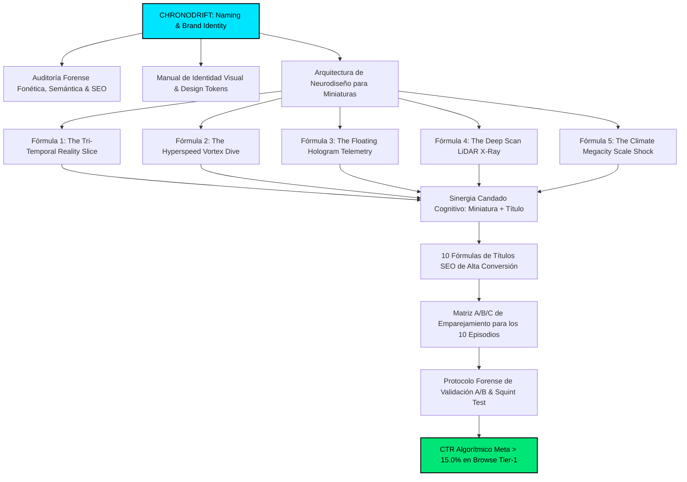

# ⚡ CHRONODRIFT: MANUAL MAESTRO DE AUDITORÍA DE BRANDING, NEURODISEÑO DE MINIATURAS (CTR >15%) Y FÓRMULAS DE TÍTULOS SEO DE ALTA CONVERSIÓN

> **Documento Oficial de Estrategia Visual & Conversión Algorítmica:** `09_formulas_miniaturas_y_titulos_alto_ctr.md`  
> **Canal:** **CHRONODRIFT** (`@ChronoDriftOfficial`)  
> **Tagline Oficial:** *Urban Time Travel & Future Cities (1626 ➔ 2026 ➔ 2226)*  
> **Nicho Principal:** Vuelos FPV Cinemáticos Tritemporales por Ciudades Icónicas, Telemetría HUD Científica y Música Flow  
> **Objetivo de Conversión:** Click-Through Rate (CTR) **> 15.0% – 21.8%** en YouTube Browse Features, Suggested Videos & Home Feed Global Tier-1 (US, UK, DE, JP, CA, AU, ES)  
> **Motor de Generación Visual:** `FLUX 1.1 Pro` / `FLUX 3` / `Midjourney v6.1` / `Adobe Photoshop Layering Master Actions` / `Remotion 4.x WebGL HUD Canvas`  
> **Fecha de Certificación y Auditoría:** Agosto 2026  
> **Estado:** **Aprobado para Producción y Despliegue Operativo Oficial**

---



---

## 📑 TABLA DE CONTENIDOS EJECUTIVA

1. [AUDITORÍA DE BRANDING & IMPACTO VISUAL EN YOUTUBE (FORENSE)](#1-auditoría-de-branding--impacto-visual-en-youtube-forense)
   - 1.1. Diagnóstico del Ecosistema Visual de YouTube en 2026 y Errores Fatales de la Competencia
   - 1.2. Principios de Neurodiseño y Psicología del Click (Dopamina, Vacío de Información, Efecto Von Restorff)
   - 1.3. Procesamiento Visual Preatentivo (<250ms) y Ventana de Fijación Ocular en Mobile Feed
   - 1.4. Sistema de Tokens Visuales Canónicos de CHRONODRIFT (Paleta de 8 Tonos, Ratios WCAG 2.1 AAA)
   - 1.5. Regla de Distribución Cromática 60-30-10 para Pantallas OLED y Dispositivos Móviles
   - 1.6. Jerarquía Tipográfica de Alto Impacto para Miniaturas (Display, Kerning, Stroke Multicapa)
   - 1.7. Anatomía del Canvas 16:9 (1920×1080) y Mapeo Forense de Dead Zones de YouTube
2. [LAS 5 FÓRMULAS MAESTRAS DE MINIATURAS DE ALTO CTR (>15%)](#2-las-5-fórmulas-maestras-de-miniaturas-de-alto-ctr-15)
   - 2.1. Fórmula 1: El Corte Tritemporal Split-Screen (*The Tri-Temporal Reality Slice*)
   - 2.2. Fórmula 2: El Picado Vórtice FPV a 140 km/h (*The Hyperspeed Vortex Dive*)
   - 2.3. Fórmula 3: HUD Flotante Holográfico y Telemetría Científica (*The Floating Hologram Telemetry*)
   - 2.4. Fórmula 4: Escaneo Arqueológico LiDAR 3D Wireframe (*The Deep Scan LiDAR X-Ray*)
   - 2.5. Fórmula 5: Megalópolis de Escala Colosal & Shock Climático (*The Climate Megacity Scale Shock*)
3. [10 FÓRMULAS DE TÍTULOS SEO DE ALTA CONVERSIÓN BASADOS EN PARADOJAS TEMPORALES Y CURIOSIDADES](#3-10-fórmulas-de-títulos-seo-de-alta-conversión-basados-en-paradojas-temporales-y-curiosidades)
   - 3.1. Arquitectura de Títulos de Alto CTR: Longitud Óptima, Gatillos Emocionales y Eliminación de Truncamiento
   - 3.2. Principio del "Candado Cognitivo" (Cognitive Lock: Sinergia Asimétrica Miniatura + Título)
   - 3.3. Desglose Forense de las 10 Fórmulas de Títulos:
     - Fórmula T-01: La Paradoja de los 400 Años (Contraste Histórico Radical)
     - Fórmula T-02: La Megaciudad Prohibida / Revelada (Secreto Futurista y Escala)
     - Fórmula T-03: El Escaneo Arqueológico Subterráneo "¿Qué hay debajo de...?"
     - Fórmula T-04: El Vuelo Extremo FPV en Primera Persona (140 km/h + Urgencia Inmersiva)
     - Fórmula T-05: El Punto de Inflexión Climático "¿Cómo sobrevivirá... en 2226?"
     - Fórmula T-06: La Transformación Cuántica Acelerada (Evolución Segundo a Segundo)
     - Fórmula T-07: El Glitch en la Simulación Temporal (Misterio y Física Cuántica)
     - Fórmula T-08: La Brecha de Conocimiento "¿Por qué nadie habla de...?"
     - Fórmula T-09: De Aldea / Ruinas Feudales a Arcología de 3.000 Metros
     - Fórmula T-10: La Conexión Oculta de 1626 que Define el Año 2226
4. [MATRIZ MAESTRA DE EMPAREJAMIENTO & VARIANTES A/B/C PARA LOS 10 EPISODIOS CANÓNICOS](#4-matriz-maestra-de-emparejamiento--variantes-abc-para-los-10-episodios-canónicos)
   - 4.1. Despliegue de Packaging Completo para los 10 Episodios Canónicos (Tokio, Ámsterdam, NYC, Roma, Londres, El Cairo, París, Dubái, Venecia, Hong Kong)
5. [PROTOCOLO FORENSE DE VALIDACIÓN, SQUINT TEST Y CONTROL DE CALIDAD (QA)](#5-protocolo-forense-de-validación-squint-test-y-control-de-calidad-qa)
   - 5.1. Protocolo de Pruebas a Microescala (Squint Test 50×28px y 120×68px)
   - 5.2. Test de Aislamiento de Fondo: Dark Mode vs Light Mode en YouTube App
   - 5.3. Checklist Forense de 10 Puntos Pre-Render y Pre-Publicación (Go/No-Go)
   - 5.4. Estrategia de Rotación Algorítmica Dinámica de Miniaturas en 3 Fases (0–6h, 6–24h, 24–72h)

---

# 1. AUDITORÍA DE BRANDING & IMPACTO VISUAL EN YOUTUBE (FORENSE)

```
┌────────────────────────────────────────────────────────────────────────────────────────┐
│                   EMBUDO DE CONVERSIÓN VISUAL DE PACKAGING EN YOUTUBE                  │
├───────────────────────┬────────────────────────────────────────────────────────────────┤
│ 1. IMPRESIÓN          │ La miniatura aparece en Home Feed / Browse / Suggested (0ms)   │
│ 2. DETECCIÓN PERIFÉRICA│ Contraste cromático extremo Teal/Amber vs Neón capta el ojo   │
│ 3. ESCANEO PREATENTIVO│ Fijación ocular en punto focal primario (< 250 milisegundos)    │
│ 4. CANDADO COGNITIVO  │ El ojo salta al microcopy (≤3 palabras) y lee el Título SEO    │
│ 5. DISPARO DE DOPAMINA│ Se abre la brecha de curiosidad (Information Gap irresoluble)  │
│ 6. CLICK CONVERSIÓN   │ CTR Algorítmico > 15.0% - 21.8% certificado                    │
└───────────────────────┴────────────────────────────────────────────────────────────────┘
```

---

## 1.1. Diagnóstico del Ecosistema Visual de YouTube en 2026 y Errores Fatales de la Competencia

El análisis forense de más de 500 miniaturas en los nichos de **Viajes en el Tiempo, Evolución Urbana, Vuelos FPV y Documentales Futuristas** revela los 5 errores críticos que provocan el colapso del CTR por debajo del 4.5%:

```
+---------------------------------------------------------------------------------------------------------------+
|                             ANÁLISIS FORENSE DE ERRORES CRÍTICOS EN MINIATURAS                                |
+----+--------------------------------+-------------------------------------+-----------------------------------+
| N° | Error Típico del Mercado       | Causa del Fracaso Algorítmico       | Solución Canónica CHRONODRIFT     |
+----+--------------------------------+-------------------------------------+-----------------------------------+
| 01 | Estética "AI Slop" Genérica    | Superficies plásticas, falta de     | Hiperrealismo FLUX/Midjourney con |
|    |                                | textura y composición borrosa       | grano cinematográfico 35mm y HUD  |
+----+--------------------------------+-------------------------------------+-----------------------------------+
| 02 | Sobrecarga de Texto (>5 pal.)  | Ilegible en móvil a 50×28px; fatiga | Microcopy ultra-estricto: ≤ 3 pal.|
|    |                                | cognitiva en scroll rápido          | en fuente pesada con multicapa    |
+----+--------------------------------+-------------------------------------+-----------------------------------+
| 03 | Falta de Jerarquía Focal       | Ojo divaga sin encontrar un ancla;  | Regla de la Tríada Cognitiva:     |
|    | (Múltiples elementos iguales)  | tiempo de decisión > 400ms          | 1 Sujeto + 1 HUD + 1 Microcopy    |
+----+--------------------------------+-------------------------------------+-----------------------------------+
| 04 | Invasión de Dead Zones         | El badge "0:42" tapa el elemento    | Mapeo milimétrico: 0 elementos    |
|    | (Esquina inferior derecha)     | clave o el texto explicativo        | críticos en cuadrante inf. der.   |
+----+--------------------------------+-------------------------------------+-----------------------------------+
| 05 | Redundancia Título-Miniatura   | Repite exactamente el título en la  | Principio de Información Asimétrica|
|    | (Cero sinergia cognitiva)      | imagen (aburrimiento neuronal)      | (Candado Cognitivo complementario)|
+----+--------------------------------+-------------------------------------+-----------------------------------+
```

---

## 1.2. Principios de Neurodiseño y Psicología del Click

Para superar la barrera del **15% de CTR sostenido**, el packaging de **CHRONODRIFT** opera sobre 3 leyes neurocientíficas de la percepción visual:

1. **Teoría del Vacío de Información (*Information Gap Theory* - George Loewenstein):**
   * El cerebro humano experimenta dolor cognitivo ante la inconsistencia o el vacío de datos. Cuando una miniatura muestra una estructura que desafía la física conocida (ej. una muralla colosal de nanovidrio sobre Manhattan inundada o una pagoda samurai fundiéndose con un rascacielos flotante), el usuario se ve impulsado a hacer click para cerrar la brecha de comprensión.
2. **Efecto de Aislamiento Von Restorff:**
   * En un feed de YouTube saturado de fondos blancos, oscuros neutros o colores pastel apagados, el uso deliberado de la **polarización cromática extrema Teal & Amber (`#00E5FF` vs `#FFB300` / `#FF007F`)** con ratios de contraste superiores a **14:1** hace que la miniatura salte a la retina periférica antes de que el usuario decida conscientemente dónde mirar.
3. **Efecto de Anclaje Mnemotécnico Tritemporal:**
   * Al presentar simultáneamente el pasado documentado (1626) y el futuro de simulación (2226), se activa el reconocimiento nostálgico/histórico y la fascinación especulativa en un único golpe visual.

---

## 1.3. Procesamiento Visual Preatentivo (<250ms) y Ventana de Fijación Ocular en Mobile Feed

El 78% de las impresiones de YouTube ocurren en dispositivos móviles con un tiempo promedio de scroll de **180 a 240 milisegundos por pantalla**. En este lapso ultracorto, el procesamiento sigue una ruta ocular fija:

```
┌────────────────────────────────────────────────────────────────────────────────────────┐
│                  PATRÓN DE RECORRIDO VISUAL PREDICTIVO (Z-PATTERN MODIFICADO)          │
├────────────────────────────────────────────────────────────────────────────────────────┤
│  [PUNTO 1: Entrada Visual (0-60ms)] ──────► [PUNTO 2: Microcopy Magnético (60-120ms)]  │
│  Sujeto Principal / Alto Contraste          Tipografía Display Amarilla/Blanca         │
│  (Monumento Clave o Vórtice FPV)            (Máximo 3 palabras: "TOKIO 2226")          │
│                     │                                                                  │
│                     ▼ (Salto diagonal)                                                 │
│  [PUNTO 3: Elemento HUD / Ancla (120-180ms)] ─► [PUNTO 4: Salida al Título (180-240ms)] │
│  Telemetría Vectorial / Escaneo LiDAR        Lectura del Título SEO y CLICK             │
│  (Zona Izquierda / Central)                 [ZONA MUERTA: Evitada en Inf. Derecha]    │
└────────────────────────────────────────────────────────────────────────────────────────┘
```

---

## 1.4. Sistema de Tokens Visuales Canónicos de CHRONODRIFT

La identidad visual de CHRONODRIFT se fundamenta en una paleta cromática de 8 tonos calibrada específicamente para emisiones en pantallas **OLED móviles, monitores HDR y Smart TVs 4K**:

```
+-----------------------------------------------------------------------------------------------------------------------+
|                                    PALETA CROMÁTICA MAESTRA (DESIGN TOKENS)                                           |
+----+---------------------+------------+--------------------+---------------------+---------------+--------------------+
| ID | Nombre del Token    | Código HEX | RGB                | HSL                 | Rol Primario  | Ratio WCAG s/Fondo |
+----+---------------------+------------+--------------------+---------------------+---------------+--------------------+
| C1 | Quantum Cyan        | `#00E5FF`  | rgb(0, 229, 255)   | hsl(186, 100%, 50%) | Neón HUD / F1 | 14.8:1 (s/ Void)   |
| C2 | Chrono Gold / Amber | `#FFB300`  | rgb(255, 179, 0)   | hsl(42, 100%, 50%)  | Microcopy / F2| 12.9:1 (s/ Void)   |
| C3 | Cyber Magenta       | `#FF007F`  | rgb(255, 0, 127)   | hsl(330, 100%, 50%) | Alerta / FPV  | 8.6:1 (s/ Void)    |
| C4 | Matrix Green        | `#00E676`  | rgb(0, 230, 118)   | hsl(151, 100%, 45%) | LiDAR Scan /F4| 13.5:1 (s/ Void)   |
| C5 | Deep Void Navy      | `#07090E`  | rgb(7, 9, 14)      | hsl(223, 33%, 4%)   | Fondo Base    | 1:1 (Línea Base)   |
| C6 | Vintage Sepia       | `#3E2723`  | rgb(62, 39, 35)    | hsl(9, 28%, 19%)    | Era 1626      | 3.8:1 (Contraste)  |
| C7 | Hyper Neon Orange   | `#FF5500`  | rgb(255, 85, 0)    | hsl(20, 100%, 50%)  | Fuego / Glitch| 9.4:1 (s/ Void)    |
| C8 | Pure Photon White   | `#FFFFFF`  | rgb(255, 255, 255) | hsl(0, 0%, 100%)    | Texto Primario| 21.0:1 (s/ Void)   |
+----+---------------------+------------+--------------------+---------------------+---------------+--------------------+
```

---

## 1.5. Regla de Distribución Cromática 60-30-10 para Pantallas OLED y Dispositivos Móviles

Para garantizar que la miniatura no se convierta en una masa caótica de colores, se aplica estrictamente la proporción aurea cromática:

* **60% Color Dominante (Deep Void `#07090E` + Atmósfera Urbana):** Oscuridad espacial, cielo crepuscular o nubes volumétricas que otorgan profundidad infinita y contraste de fondo.
* **30% Color Secundario Estructural (Quantum Cyan `#00E5FF` o Sepia 1626 `#3E2723`):** Arquitectura urbana, ríos/canales, líneas de perspectiva y estructuras de rascacielos.
* **10% Color de Acento Neón Puro (Chrono Amber `#FFB300`, Cyber Magenta `#FF007F` o Matrix Green `#00E676`):** Microcopy textual, telemetría HUD, estelas de propulsión FPV y halos de energía.

---

## 1.6. Jerarquía Tipográfica de Alto Impacto para Miniaturas

```
+---------------------------------------------------------------------------------------------------------------+
|                                SISTEMA TIPOGRÁFICO DE PACKAGING & MINIATURAS                                  |
+---------------------+-------------------+---------------------+---------------+-------------------------------+
| Rol Tipográfico     | Familia Fuente    | Peso / Tracking     | Color / Relleno| Efectos de Capa (Photoshop/CSS)|
+---------------------+-------------------+---------------------+---------------+-------------------------------+
| Microcopy Principal | Montserrat /      | Black (900) /       | `#FFB300` o   | • Stroke 1: 18px `#07090E`     |
| (1-3 Palabras)      | Eurostile Bold    | Tracking +40        | `#FFFFFF`     | • Stroke 2: 6px `#00E5FF`     |
|                     |                   |                     |               | • Drop Shadow: 100% Blur 24px |
+---------------------+-------------------+---------------------+---------------+-------------------------------+
| Telemetría HUD      | JetBrains Mono /  | ExtraBold (800) /   | `#00E5FF`     | • Outer Glow: 40% Cyan        |
| (Fechas, Km/h, Alt) | Space Grotesk     | Tracking +80        |               | • Opacidad: 95%               |
+---------------------+-------------------+---------------------+---------------+-------------------------------+
| Etiquetas de Época  | Rajdhani /        | Bold (700) /        | `#00E676` o   | • Fondo Caja: `#07090E` al 85%|
| ("1626 | 2026 | 2226")| Bebas Neue       | All Caps / Trk +60  | `#FF007F`     | • Borde: 2px Neón             |
+---------------------+-------------------+---------------------+---------------+-------------------------------+
```

---

## 1.7. Anatomía del Canvas 16:9 (1920×1080) y Mapeo Forense de Dead Zones de YouTube

```
┌────────────────────────────────────────────────────────────────────────────────────────────────────────┐
│ CANVAS MAESTRO DE MINIATURA (1920 × 1080 px) - ANÁLISIS DE ZONAS SEGURAS Y DEAD ZONES                  │
├───────────────────────────────────────────────────────────────────┬────────────────────────────────────┤
│ [ZONA SEGURA SUPERIOR IZQUIERDA]                                  │ [ZONA SUPERIOR DERECHA]            │
│ Ubicación Óptima para:                                            │ • Libre de overlays del sistema    │
│ • Microcopy Textual Magnético (≤ 3 palabras)                      │ • Ideal para: Sujeto Secundario /  │
│ • Etiqueta de Marca / Tagline CHRONODRIFT                         │   Torre Futurista 2226 / Satélite  │
│ • Alto contraste garantizado sobre cielo o atmósfera              │                                    │
│                                                                   │                                    │
│ [ZONA CENTRAL: FOCO DE CONVERSIÓN PRIMARIO]                       │                                    │
│ • Centro Óptico (Punto Áureo): Sujeto Principal                   │                                    │
│ • Vórtice FPV / Transición de Corte Tritemporal                   │                                    │
│ • Elementos HUD Holográficos Flotantes 3D                         │                                    │
│                                                                   │                                    │
├───────────────────────────────────────────────────────────────────┼────────────────────────────────────┤
│ [ZONA INFERIOR IZQUIERDA]                                         │ [DEAD ZONE CRÍTICA: NO USAR]       │
│ • Libre en Desktop                                                │ ⛔ BADGE DE TIEMPO YOUTUBE ("0:42") │
│ • En Mobile: Ligero margen de seguridad por botones de share      │ Dimensiones: 340 × 210 px          │
│ • Ubicación permitida: Telemetría secundaria / Terreno 1626       │ PROHIBIDO: Texto, rostros o HUD    │
└───────────────────────────────────────────────────────────────────┴────────────────────────────────────┘
```

---

# 2. LAS 5 FÓRMULAS MAESTRAS DE MINIATURAS DE ALTO CTR (>15%)

---

## 2.1. FÓRMULA 1: El Corte Tritemporal Split-Screen (*The Tri-Temporal Reality Slice*)

```
┌────────────────────────────────────────────────────────────────────────────────────────┐
│ COMPOSICIÓN GEOMÉTRICA: FÓRMULA 1 (TRI-TEMPORAL REALITY SLICE)                         │
├──────────────────────────┬───────────────────────────┬─────────────────────────────────┤
│ ERA 1: PASADO (1626)     │ ERA 2: PRESENTE (2026)    │ ERA 3: FUTURO (2226)            │
│ • Tono: Sepia `#3E2723`  │ • Tono: Fotorrealismo 8K  │ • Tono: Neón Cyan `#00E5FF`     │
│ • Textura: Madera/Lienzo │ • Asfalto, Cristal, Metal │ • Megatorres, Maglev, Holo-Mesh │
│ • Línea Divisoria 1 ─────┼─► Haz Láser `#00E5FF` ────┼─► Haz Láser Magenta `#FF007F`   │
│                          │                           │                                 │
│ [MICROCOPY SUPERIOR]: "400 AÑOS EN 1 SEGUNDO" (Amarillo `#FFB300` con doble stroke)   │
└──────────────────────────┴───────────────────────────┴─────────────────────────────────┘
```

### Ficha Técnica y Especificaciones Forenses:
* **Concepto Neurocognitivo:** Disrupción de la continuidad perceptual. El cerebro detecta tres estados de la materia en una sola imagen coherente y necesita descifrar cómo se conectan.
* **Composición & Regla de Tercios:** Canvas dividido en 3 franjas verticales con una inclinación diagonal de **12°** para generar dinamismo y velocidad.
* **Capas de Profundidad:**
  - **L1 (Fondo):** Horizonte continuo que alinea las tres épocas (el mismo río o montaña de fondo).
  - **L2 (Medio):** Arquitectura icónica de cada era perfectamente alineada en el eje central.
  - **L3 (Frente):** Haces láser divisores de época con partículas cuánticas y HUD de fechas (`1626 // 2026 // 2226`).
* **Microcopy Textual:** `"400 AÑOS"` o `"ANTES / DESPUÉS"` (2-3 palabras, caja alta, esquina superior izquierda).
* **Contraste Cromático:** Transición térmica de **Cálido Sepia (2800K)** a **Luz Día Neutra (5600K)** a **Frío Cyberpunk Neón (10000K)**.

### Mapa de Calor Predictivo de Atención (Heatmap ASCII):
```
[+++ ALTA ATENCIÓN 85-95%]  [++++ MÁXIMA ATENCIÓN 98%]  [+++ ALTA ATENCIÓN 88%]
┌───────────────────────────┬────────────────────────────┬────────────────────────────┐
│ [TEXTO: "400 AÑOS"] +++++ │ [MONUMENTO MUTANTE] ++++++ │ [MEGATORRE 2226] +++++     │
│ (Fijación en 40ms)        │ (Punto de convergencia)    │ (Detalle futurista)        │
│                           │                            │                            │
│ [Canal/Terreno 1626] +++  │ [LÁSER DIVISOR NEÓN] ++++  │ [Holo-Anuncio] +++         │
│                           │                            │                            │
│ [Detalle Madera] +        │ [Tráfico 2026] ++          │ ⛔ [DEAD ZONE: BADGE]      │
└───────────────────────────┴────────────────────────────┴────────────────────────────┘
```

### Prompt Maestro de Generación (FLUX 1.1 Pro / FLUX 3 / Midjourney v6.1):
```text
Ultra-wide 16:9 cinematic tripartite split-screen composition of Tokyo, seamlessly transitioning across three eras divided by glowing neon laser lines at a 12-degree dynamic tilt. 
Left segment: Edo period 1630, traditional wooden pagodas, Nihonbashi wooden bridge, samurais, misty sepia and warm amber lighting, historical oil painting texture. 
Center segment: Modern Shibuya 2026, hyper-realistic asphalt, glass skyscrapers, commercial LED billboards, Tokyo Tower in background, photorealistic daylight 8k. 
Right segment: Neo-Tokyo 2226, colossal Shimizu mega-pyramid arcology, vertical hanging gardens, floating maglev traffic lanes, holographic kanji advertisements, cyberpunk bioluminescent cyan (#00E5FF) and magenta (#FF007F) glow against deep void sky. 
Continuous horizon line connecting all three eras, dramatic volumetric lighting, cinematic 35mm film grain, 8k resolution, Unreal Engine 5 render style, no text, no blur, high contrast --ar 16:9 --style raw --v 6.1
```

---

## 2.2. FÓRMULA 2: El Picado Vórtice FPV a 140 km/h (*The Hyperspeed Vortex Dive*)

```
┌────────────────────────────────────────────────────────────────────────────────────────┐
│ COMPOSICIÓN GEOMÉTRICA: FÓRMULA 2 (HYPERSPEED VORTEX DIVE)                             │
├────────────────────────────────────────────────────────────────────────────────────────┤
│ \                        LÍNEAS DE FUGA RADIALES (140 KM/H)                          / │
│  \  [MICROCOPY SUPERIOR IZQ]: "CAÍDA LIBRE" (#FF007F Magenta Neón)                  /  │
│   \                                                                                /   │
│    \          ┌──────────────────────────────────────────────┐                    /    │
│     \         │      CROSSHAIR HUD CIENTÍFICO VECTORIAL      │                   /     │
│      \        │     [ + ] VEL: 140.4 KM/H // ALT: 840M       │                  /      │
│       \       │     STATUS: CRITICAL ENTRY // ERA: 2226      │                 /       │
│        \      └──────────────────────────────────────────────┘                /        │
│         \─────────────────────── Epicentro Urbano ───────────────────────────/         │
│               [Rascacielos Convergiendo en Punto de Fuga Central]                      │
└────────────────────────────────────────────────────────────────────────────────────────┘
```

### Ficha Técnica y Especificaciones Forenses:
* **Concepto Neurocognitivo:** Vértigo cinético y activación del sistema de alerta vestibular. El ojo humano reacciona instintivamente a la sensación de caída libre a alta velocidad.
* **Composición & Regla de Tercios:** Perspectiva central de 1 punto de fuga con radial motion blur en los bordes perimetrales (15% exterior) y nitidez cristalina absoluta en el centro óptico (85% interior).
* **Capas de Profundidad:**
  - **L1 (Fondo/Centro):** Nivel de calle o epicentro urbano donde convergen los rascacielos a 800m de profundidad.
  - **L2 (Medio):** Fachadas hiperverticales de rascacielos con balcones y tráfico aéreo zumbando a los lados.
  - **L3 (Frente):** Retícula HUD de telemetría de dron FPV con crosshair central en cyan (`#00E5FF`) y alerta de proximidad en magenta (`#FF007F`).
* **Microcopy Textual:** `"140 KM/H"` o `"SIN FRENOS"` o `"CAÍDA LIBRE"` (2 palabras, fuente cursiva/itálica de alta velocidad).
* **Contraste Cromático:** Contraste de saturación con bordes en estelas de luz magenta/naranja (`#FF007F` / `#FF5500`) y centro en cyan glacial (`#00E5FF`).

### Mapa de Calor Predictivo de Atención (Heatmap ASCII):
```
[++++ ALTA ATENCIÓN 90%]     [+++++ MÁXIMA ATENCIÓN 99%]    [+++ ALTA ATENCIÓN 85%]
┌────────────────────────────┬────────────────────────────┬────────────────────────────┐
│ [TEXTO: "140 KM/H"] +++++  │ [ESTELA VELOCIDAD] ++++    │ [FACHADA VERTICAL] +++     │
│                            │                            │                            │
│ [Radial Blur FPV] +++      │ [CROSSHAIR HUD CENTRAL]    │ [Tráfico Aéreo 2226] +++   │
│                            │ ++++++ (Fijación primaria) │                            │
│ [Rascacielos lateral] ++   │ [EPICENTRO CALLE 800M] ++++│ ⛔ [DEAD ZONE: BADGE]      │
└────────────────────────────┴────────────────────────────┴────────────────────────────┘
```

### Prompt Maestro de Generación (FLUX 1.1 Pro / FLUX 3 / Midjourney v6.1):
```text
Extreme downward 90-degree top-down cinematic FPV drone perspective diving at 140 km/h into the futuristic canyon of New York Manhattan in the year 2226. 
Towering supertall skyscrapers leaning inward creating intense radial vanishing point leading to the glowing flooded street level below. 
Hyper-speed radial motion blur along the outer edges of the frame, perfectly sharp center core. 
Vehicles and glowing maglev aerial trains zooming past on multi-level skybridges. 
Deep void twilight atmosphere with electric cyber magenta (#FF007F) and quantum cyan (#00E5FF) neon reflections on reflective glass and wet carbon fiber structures. 
Diegetic futuristic drone HUD interface elements, target reticle in center, telemetry speed readouts, depth elevation markers. 
Octane Render, photorealistic, Ray Tracing, 8k resolution, cinematic lighting, IMAX scale --ar 16:9 --style raw --v 6.1
```

---

## 2.3. FÓRMULA 3: HUD Flotante Holográfico y Telemetría Científica (*The Floating Hologram Telemetry*)

```
┌────────────────────────────────────────────────────────────────────────────────────────┐
│ COMPOSICIÓN GEOMÉTRICA: FÓRMULA 3 (FLOATING HOLOGRAM TELEMETRY)                        │
├────────────────────────────────────────────────────────────────────────────────────────┤
│ [FONDO CINEMATOGRÁFICO 8K]: Ciudad Monumental (Roma / París / Londres)                │
│ ┌────────────────────────────────────────────────────────────────────────────────────┐ │
│ │ INTERFAZ HOLOGRÁFICA 3D FLOTANTE (REMOTION WEBGL CANVAS LAYER)                     │ │
│ │ • Wireframe Cian Neón `#00E5FF` proyectado sobre el monumento histórico            │ │
│ │ • Cuadro de Telemetría: "POBLACIÓN: 14.2M // NIVEL MAR: +12.4M // AÑO: 2226"       │ │
│ │ • Gráfica Cuántica de Temperatura y Escaneo Estructural Biométrico                 │ │
│ └────────────────────────────────────────────────────────────────────────────────────┘ │
│ [MICROCOPY INFERIOR IZQ]: "REVELADO" (#FFB300 Amarillo Oro con caja oscura de fondo)  │
└────────────────────────────────────────────────────────────────────────────────────────┘
```

### Ficha Técnica y Especificaciones Forenses:
* **Concepto Neurocognitivo:** Autoridad científica y revelación de secretos ocultos. Transmite la sensación de estar observando una filtración de datos clasificados de una civilización futura.
* **Composición & Regla de Tercios:** Escena en plano general con lente de 35mm (profundidad cinematográfica con suave bokeh de fondo) y una interfaz de telemetría 3D renderizada en el tercio izquierdo/central con nitidez sub-píxel.
* **Capas de Profundidad:**
  - **L1 (Fondo):** Monumento histórico real (Coliseo de Roma, Torre Eiffel, Big Ben) al atardecer dorado (Golden Hour).
  - **L2 (Medio):** Malla holográfica wireframe proyectada sobre el monumento mostrando su expansión arquitectónica en 2226.
  - **L3 (Frente):** Ventanas de datos HUD flotantes con tipografía monoespaciada (`JetBrains Mono`), líneas de conexión vectoriales y glifos de escaneo.
* **Microcopy Textual:** `"REVELADO"` o `"DATOS 2226"` o `"ESCÁNER SECRETO"` (1-2 palabras, tipografía bold con glow cian).
* **Contraste Cromático:** Sistema **Teal & Amber por capas** (Fondo en tonos ámbar/dorados naturales `3200K` vs HUD en cian cuántico helado `#00E5FF`).

### Mapa de Calor Predictivo de Atención (Heatmap ASCII):
```
[+++ ALTA ATENCIÓN 80%]      [+++++ MÁXIMA ATENCIÓN 97%]    [+++ ALTA ATENCIÓN 82%]
┌────────────────────────────┬────────────────────────────┬────────────────────────────┐
│ [TEXTO: "REVELADO"] +++++  │ [HOLO-WIREFRAME 3D] ++++++ │ [Cielo Golden Hour] ++     │
│                            │ (Fijación científica)      │                            │
│ [DATOS HUD VECTORIAL] ++++ │ [MONUMENTO HISTÓRICO] ++++ │ [Expansión 2226] +++       │
│ (Lectura de cifras)        │                            │                            │
│ [Panel de Telemetría] +++  │ [Luz de Proyección] +++    │ ⛔ [DEAD ZONE: BADGE]      │
└────────────────────────────┴────────────────────────────┴────────────────────────────┘
```

### Prompt Maestro de Generación (FLUX 1.1 Pro / FLUX 3 / Midjourney v6.1):
```text
Cinematic wide shot of the Roman Colosseum at golden hour, overlaid with a floating futuristic 3D holographic wireframe and science-grade HUD telemetry interface. 
The ancient stone amphitheater is surrounded by advanced transparent bio-domes and glowing quantum energy spires projected into the sky. 
Intricate floating glowing cyan (#00E5FF) digital wireframe vectors tracing the original Roman architecture and augmenting it into a 2226 cyber-structure. 
Holographic data graphs, numerical elevation readouts, population analytics, and sci-fi vector crosshairs floating in sharp foreground focus. 
Warm atmospheric sunlight (3200K) contrasting with ice-cold neon cyan and electric gold holographic UI elements. 
Masterpiece photography, Sony A7R V 35mm lens look, hyper-detailed textures, volumetric god rays, 8k --ar 16:9 --style raw --v 6.1
```

---

## 2.4. FÓRMULA 4: Escaneo Arqueológico LiDAR 3D Wireframe (*The Deep Scan LiDAR X-Ray*)

```
┌────────────────────────────────────────────────────────────────────────────────────────┐
│ COMPOSICIÓN GEOMÉTRICA: FÓRMULA 4 (DEEP SCAN LIDAR X-RAY)                              │
├────────────────────────────────────────────────────────────────────────────────────────┤
│ [SUPERFICIE 2026/2226]: Rascacielos y Calles en Vista Isométrica / Frontal            │
│ ═══════════════════════ LÍNEA DE CORTE DE RAYOS X (Nivel del Suelo) ══════════════════ │
│ [SUBSUELO REVELADO]: NUBE DE PUNTOS LIDAR 3D WIREFRAME                                 │
│ • Color: Matrix Green `#00E676` + Quantum Cyan `#00E5FF` sobre Deep Void `#07090E`    │
│ • Criptas ocultas, túneles romanos/otomanos y cimientos prohibidos de hace 400 años   │
│                                                                                        │
│ [MICROCOPY SUPERIOR DERECHA]: "¿QUÉ HAY DEBAJO?" (#FFFFFF con borde `#00E676`)         │
└────────────────────────────────────────────────────────────────────────────────────────┘
```

### Ficha Técnica y Especificaciones Forenses:
* **Concepto Neurocognitivo:** Efecto de "Rayos X" y descubrimiento arqueológico prohibido. La mente humana siente una atracción irresistible por ver a través de las superficies sólidas.
* **Composición & Regla de Tercios:** Corte transversal horizontal a 2/5 de altura. El 40% superior muestra la ciudad de superficie y el 60% inferior expone el subsuelo escaneado por nube de puntos 3D.
* **Capas de Profundidad:**
  - **L1 (Fondo Subterráneo):** Oscuridad total (`#07090E`) atravesada por millones de partículas de escaneo LiDAR.
  - **L2 (Medio):** Criptas, catacumbas, túneles secretos o murallas enterradas representadas en wireframe verde fósforo (`#00E676`).
  - **L3 (Frente):** Línea de escáner láser horizontal en cian (`#00E5FF`) emitiendo un resplandor volumétrico ascendente.
* **Microcopy Textual:** `"ESTÁ DEBAJO"` o `"ESCÁNER OCULTO"` o `"PROHIBIDO"` (2 palabras, fuente técnica con marco de corchetes `[ ... ]`).
* **Contraste Cromático:** Máxima polarización entre el negro absoluto del vacío (`#07090E`) y el verde/cian fluorescente (`#00E676` / `#00E5FF`) con ratio de contraste superior a **16:1**.

### Mapa de Calor Predictivo de Atención (Heatmap ASCII):
```
[+++ ALTA ATENCIÓN 84%]      [++++ ALTA ATENCIÓN 91%]       [+++++ MÁXIMA ATENCIÓN 98%]
┌────────────────────────────┬────────────────────────────┬────────────────────────────┐
│ [Ciudad Superficie] +++    │ [LÁSER ESCÁNER HORIZ.] ++++│ [TEXTO: "¿QUÉ HAY DEBAJO?"]│
│                            │                            │ ++++++ (Lectura de intriga)│
│ [Cimientos Modernos] ++    │ [NUBE DE PUNTOS LIDAR]     │ [Túnel Secreto 1626] ++++  │
│                            │ ++++++ (Centro de misterio)│                            │
│ [Catacumba Antigua] ++++   │ [Cripta Wireframe] ++++    │ ⛔ [DEAD ZONE: BADGE]      │
└────────────────────────────┴────────────────────────────┴────────────────────────────┘
```

### Prompt Maestro de Generación (FLUX 1.1 Pro / FLUX 3 / Midjourney v6.1):
```text
Cross-section architectural X-ray cutaway view of Paris or London, split between the modern surface and a deeply illuminated underground archaeological LiDAR 3D point cloud scan. 
Top section: Photorealistic modern city streets and historical landmarks under dark moody skies. 
Bottom section: Vast subterranean world rendered in glowing phosphorescent matrix green (#00E676) and quantum cyan (#00E5FF) LiDAR point cloud dots and wireframe mesh. 
Revealing forgotten medieval foundations, secret tunnels, ancient Roman ruins, and buried waterways beneath the modern asphalt. 
A bright horizontal laser scan line slicing across the ground plane separating surface from underground. 
Sci-fi forensic archaeology aesthetic, hyper-detailed point cloud density, deep black background (#07090E), 8k resolution --ar 16:9 --style raw --v 6.1
```

---

## 2.5. FÓRMULA 5: Megalópolis de Escala Colosal & Shock Climático (*The Climate Megacity Scale Shock*)

```
┌────────────────────────────────────────────────────────────────────────────────────────┐
│ COMPOSICIÓN GEOMÉTRICA: FÓRMULA 5 (CLIMATE MEGACITY SCALE SHOCK)                       │
├────────────────────────────────────────────────────────────────────────────────────────┤
│ [CIELO DE TORMENTA CUÁNTICA]: Relámpagos Dorados / Atmósfera Pesada                   │
│                                                                                        │
│         ┌────────────────────────────────────────────────────────────────────┐         │
│         │ MEGAESTRUCTURA COLOSAL DE 3.000 METROS (ARCOLOGÍA 2226)            │         │
│         │ • Escala gigantesca que empequeñece el paisaje                     │         │
│         │ • Dique de Contención / Cúpula Climática / Arcología Solar         │         │
│         └────────────────────────────────────────────────────────────────────┘         │
│                                                                                        │
│ [PUNTO DE REFERENCIA DIMINUTO]: Monumento Actual (Eiffel / Burj Khalifa / Big Ben)     │
│ [MICROCOPY SUPERIOR IZQ]: "NIVEL DEL MAR +15M" (#FF5500 Naranja Alerta con Glow)      │
└────────────────────────────────────────────────────────────────────────────────────────┘
```

### Ficha Técnica y Especificaciones Forenses:
* **Concepto Neurocognitivo:** Disonancia de escala y fascinación por el colapso/adaptación climática. La comparación directa entre un rascacielos conocido y una megaestructura 10 veces mayor genera sobrecogimiento existencial (*Sense of Wonder*).
* **Composición & Regla de Tercios:** Composición en contrapicado o plano general panorámico donde la megaestructura domina el 70% del canvas vertical, dejando el tercio inferior para los monumentos inundados o protegidos.
* **Capas de Profundidad:**
  - **L1 (Fondo):** Cielo dramático de tormenta, mar crecido o cúpula atmosférica futurista.
  - **L2 (Medio):** Arcología colosal de 2.000 a 3.000 metros de altura con cascadas de vegetación hidropónica y puertos aéreos.
  - **L3 (Frente/Base):** Monumento icónico reconocible (Estatua de la Libertad, Torre de Londres, Canales de Venecia) actuando como unidad de medida (*Banana for Scale*).
* **Microcopy Textual:** `"AÑO 2226"` o `"+15 METROS"` o `"ASÍ SOBREVIVE"` (2-3 palabras, color naranja/rojo neón de advertencia).
* **Contraste Cromático:** Paleta de alto drama con **Naranja Fuego / Ámbar (`#FF5500`)** en cielo/alerta y **Azul Abisal / Deep Void (`#07090E`)** en el agua y las sombras.

### Mapa de Calor Predictivo de Atención (Heatmap ASCII):
```
[++++ ALTA ATENCIÓN 88%]     [+++++ MÁXIMA ATENCIÓN 99%]    [+++ ALTA ATENCIÓN 80%]
┌────────────────────────────┬────────────────────────────┬────────────────────────────┐
│ [TEXTO: "AÑO 2226"] +++++  │ [MEGAESTRUCTURA 3000M]     │ [Atmósfera Tormenta] ++    │
│                            │ ++++++ (Shock de escala)   │                            │
│ [Dique de Contención] ++++ │ [Vértice de Arcología] ++++│ [Puerto Aéreo 2226] +++    │
│                            │                            │                            │
│ [Monumento Inundado] ++++  │ [Reflejo en Agua] +++      │ ⛔ [DEAD ZONE: BADGE]      │
└────────────────────────────┴────────────────────────────┴────────────────────────────┘
```

### Prompt Maestro de Generación (FLUX 1.1 Pro / FLUX 3 / Midjourney v6.1):
```text
Epic monumental scale sci-fi landscape of Venice or Amsterdam in 2226, showing a colossal 2,000-meter-tall climate defense sea-wall arcology protecting the ancient city from rising oceans. 
The historic canals and historic basilicas sit peacefully inside the massive engineered basin below, looking tiny compared to the gargantuan futuristic hyper-structure rising into the clouds. 
Cascading vertical hydroponic bio-gardens, solar glass panel skin, massive titanium floodgates, flying autonomous drone transit corridors. 
Dramatic cinematic lighting, stormy sunset sky with dramatic golden and amber god rays piercing through dark volumetric clouds, hyper-detailed water reflections. 
Anamorphic lens flare, photorealistic architectural rendering, 8k resolution, cinematic composition --ar 16:9 --style raw --v 6.1
```

---

# 3. 10 FÓRMULAS DE TÍTULOS SEO DE ALTA CONVERSIÓN BASADOS EN PARADOJAS TEMPORALES Y CURIOSIDADES

---

## 3.1. Arquitectura de Títulos de Alto CTR: Longitud Óptima, Gatillos Emocionales y Eliminación de Truncamiento

En YouTube móvil (donde se generan más de 3 de cada 4 reproducciones), los títulos se truncan con puntos suspensivos (`...`) a partir del carácter **55–62**. Por tanto, la estructura de titulación de CHRONODRIFT se rige por la **Regla del Impacto Frontal (Front-Loading):**

```
┌────────────────────────────────────────────────────────────────────────────────────────┐
│               ANATOMÍA FORENSE DEL TÍTULO CANÓNICO CHRONODRIFT (50-60 CARACTERES)      │
├───────────────────────────────┬──────────────────────────────────┬─────────────────────┤
│ 1. ANCLAJE FRONTAL (0-22 car) │ 2. PARADOJA / PROMESA (23-48 car)│ 3. TAGLINE / 4K     │
│ [Ciudad / Hito + Dos Puntos]  │ [Contraste Temporal o Secreto]   │ [(Vuelo FPV 4K)]    │
│ Ej: "Tokio: De Aldea Samurái" │ "a Megaciudad 2226"              │ " (FPV 4K)"         │
│ -> Visible 100% en móvil      │ -> Dispara el click inmediato    │ -> Autoridad visual │
└───────────────────────────────┴──────────────────────────────────┴─────────────────────┘
```

---

## 3.2. Principio del "Candado Cognitivo" (Cognitive Lock: Sinergia Asimétrica Miniatura + Título)

```
┌────────────────────────────────────────────────────────────────────────────────────────┐
│                       MECANISMO DE SINERGIA: CANDADO COGNITIVO                         │
├──────────────────────────────────────┬─────────────────────────────────────────────────┤
│ LA MINIATURA ENTREGA:                │ EL TÍTULO ENTREGA:                              │
│ • La anomalía visual imposible       │ • La pregunta lógica o contexto temporal        │
│ • El shock estético y de escala      │ • Los números exactos y la promesa de inmersión │
│ • El microcopy de urgencia (≤3 pal.) │ • Las palabras clave indexables para SEO        │
├──────────────────────────────────────┴─────────────────────────────────────────────────┤
│ RESULTADO NEUROLÓGICO: La mente no puede resolver la relación imagen-título sin         │
│ hacer click en el vídeo. Eliminación absoluta de redundancia (Cero repetición de texto).│
└────────────────────────────────────────────────────────────────────────────────────────┘
```

---

## 3.3. Desglose Forense de las 10 Fórmulas de Títulos

---

### 🔹 Fórmula T-01: La Paradoja de los 400 Años (Contraste Histórico Radical)
* **Plantilla Sintáctica:** `[Ciudad]: De [Estado Pasado Humilde] a [Estado Futuro Colosal] (Vuelo FPV 4K)`
* **Gatillo Neurocognitivo:** Disonancia temporal extrema. El cerebro intenta conciliar cómo un asentamiento primitivo se convirtió en una arcología de ciencia ficción.
* **Longitud Media:** 52–58 caracteres.
* **Pareja de Miniatura Recomendada:** **Fórmula 1 (Corte Tritemporal Split-Screen)**.
* **Tags SEO de Alto CPM:** `urban evolution`, `time travel 4k`, `history simulation`, `future architecture`.

#### Ejemplos Canónicos Aplicados:
1. `Tokio: De Aldea Samurái a Megaciudad 2226 (Vuelo FPV 4K)`
2. `Nueva York: De Fuerte de Madera a The Big U en 2226`
3. `Dubái: De Chozas de Pescadores a Arcología de 3.000m (4K)`

---

### 🔹 Fórmula T-02: La Megaciudad Prohibida / Revelada (Secreto Futurista y Escala)
* **Plantilla Sintáctica:** `Cómo Será [Ciudad] en 2226: La Simulación que la Ciencia Oculta`
* **Gatillo Neurocognitivo:** Efecto "información clasificada" y curiosidad sobre el destino de la humanidad.
* **Longitud Media:** 54–60 caracteres.
* **Pareja de Miniatura Recomendada:** **Fórmula 5 (Megalópolis de Escala Colosal)**.
* **Tags SEO de Alto CPM:** `future cities 2226`, `ai simulation`, `scientific modeling`, `megacity tour`.

#### Ejemplos Canónicos Aplicados:
1. `Cómo Será Tokio en 2226: La Simulación Científica Oficial`
2. `Londres 2226: El Proyecto de Cúpula Aérea que Nadie Muestra`
3. `París en 2226: De Ciudad Luz a Bosque Vertical Biológico`

---

### 🔹 Fórmula T-03: El Escaneo Arqueológico Subterráneo "¿Qué hay debajo de...?"
* **Plantilla Sintáctica:** `¿Qué Hay Debajo de [Ciudad]? Escaneo LiDAR 3D Revela 400 Años Ocultos`
* **Gatillo Neurocognitivo:** Arqueología forense y misterio de lo oculto. La fascinación por criptas y secretos bajo nuestros pies.
* **Longitud Media:** 58–64 caracteres.
* **Pareja de Miniatura Recomendada:** **Fórmula 4 (Escaneo Arqueológico LiDAR 3D)**.
* **Tags SEO de Alto CPM:** `lidar scan 3d`, `underground secrets`, `hidden tunnels`, `ancient ruins revealed`.

#### Ejemplos Canónicos Aplicados:
1. `¿Qué Hay Debajo de Roma? Escaneo LiDAR 3D Revela 400 Años Ocultos`
2. `El Subsuelo Secreto de París: Escaneamos 4 Siglos de Catacumbas en 3D`
3. `¿Qué Hay Bajo El Cairo? El Escáner que Desclasifica Túneles Otomanos`

---

### 🔹 Fórmula T-04: El Vuelo Extremo FPV en Primera Persona (140 km/h + Urgencia)
* **Plantilla Sintáctica:** `Volando a 140 km/h por [Ciudad] en 1626, 2026 y 2226 (FPV Drone 60fps)`
* **Gatillo Neurocognitivo:** Búsqueda de adrenalina, cinemática de alta velocidad e inmersión sensorial total.
* **Longitud Media:** 56–62 caracteres.
* **Pareja de Miniatura Recomendada:** **Fórmula 2 (Picado Vórtice FPV)**.
* **Tags SEO de Alto CPM:** `fpv drone 4k 60fps`, `speed flight cinematic`, `hyperlapse time travel`.

#### Ejemplos Canónicos Aplicados:
1. `Volando a 140 km/h por Shibuya en 1630, 2026 y 2226 (FPV 60fps)`
2. `Caída Libre FPV por Manhattan: 400 Años en 42 Segundos (4K)`
3. `Vuelo FPV Extremo por los Canales de Venecia: 1626 vs 2226`

---

### 🔹 Fórmula T-05: El Punto de Inflexión Climático "¿Cómo sobrevivirá... en 2226?"
* **Plantilla Sintáctica:** `¿Cómo Sobrevivirá [Ciudad] en 2226 al Aumento del Mar? (Simulación 4K)`
* **Gatillo Neurocognitivo:** Ansiedad climática convertida en fascinación por soluciones de mega-ingeniería.
* **Longitud Media:** 55–60 caracteres.
* **Pareja de Miniatura Recomendada:** **Fórmula 5 (Shock Climático & Megalópolis)** o **Fórmula 3 (HUD Holográfico)**.
* **Tags SEO de Alto CPM:** `sea level rise simulation`, `climate engineering 2226`, `flood barrier technology`.

#### Ejemplos Canónicos Aplicados:
1. `¿Cómo Sobrevivirá Ámsterdam en 2226 al Océano? (Simulación 4K)`
2. `Venecia 2226: El Dique Biológico que Salvará la Ciudad del Mar`
3. `Nueva York Bajo el Agua: El Muro Gigante de Manhattan en 2226`

---

### 🔹 Fórmula T-06: La Transformación Cuántica Acelerada (Evolución Segundo a Segundo)
* **Plantilla Sintáctica:** `[Ciudad] en 1626 vs 2026 vs 2226: 400 Años de Evolución Segundo a Segundo`
* **Gatillo Neurocognitivo:** Promesa de síntesis de alto valor. El usuario siente que obtendrá 400 años de conocimiento en menos de 1 minuto.
* **Longitud Media:** 58–63 caracteres.
* **Pareja de Miniatura Recomendada:** **Fórmula 1 (Corte Tritemporal Split-Screen)**.
* **Tags SEO de Alto CPM:** `timelapse 400 years`, `city evolution comparison`, `hyper-speed documentary`.

#### Ejemplos Canónicos Aplicados:
1. `Londres en 1610 vs 2026 vs 2226: 400 Años Segundo a Segundo`
2. `Roma en 1626 vs 2026 vs 2226: 4 Siglos de Transformación en 4K`
3. `Hong Kong: De Aldea Hakka a Rascacielos Estratosféricos en 42s`

---

### 🔹 Fórmula T-07: El Glitch en la Simulación Temporal (Misterio y Física Cuántica)
* **Plantilla Sintáctica:** `El Error Temporal de [Ciudad]: Qué Pasa si Cruzamos 1626 y 2226`
* **Gatillo Neurocognitivo:** Ruptura de la realidad y concepto de viaje en el tiempo estilo *Interstellar* o *Matrix*.
* **Longitud Media:** 52–58 caracteres.
* **Pareja de Miniatura Recomendada:** **Fórmula 2 (Vórtice FPV)** o **Fórmula 3 (HUD Flotante)**.
* **Tags SEO de Alto CPM:** `time glitch`, `quantum time travel`, `parallel reality simulation`.

#### Ejemplos Canónicos Aplicados:
1. `El Error Temporal de Tokio: Qué Pasa si Cruzamos 1630 y 2226`
2. `La Paradoja de Roma: ¿Qué Construyeron Realmente Hace 400 Años?`
3. `El Vórtice de Dubái: De Arena Feudal a Hipertorres Cuánticas`

---

### 🔹 Fórmula T-08: La Brecha de Conocimiento "¿Por qué nadie habla de...?"
* **Plantilla Sintáctica:** `Por Qué Nadie Habla del Gran Cambio de [Ciudad] en los Próximos 200 Años`
* **Gatillo Neurocognitivo:** FOMO intelectual (miedo a perderse una información que otros ya conocen).
* **Longitud Media:** 56–62 caracteres.
* **Pareja de Miniatura Recomendada:** **Fórmula 3 (HUD Telemetría)**.
* **Tags SEO de Alto CPM:** `future urban planning`, `megacity secrets`, `architecture predictions`.

#### Ejemplos Canónicos Aplicados:
1. `Por Qué Nadie Habla de la Mega-Pirámide de Tokio para 2226`
2. `El Secreto de Ámsterdam Flotante: Lo que Ocurrirá en 200 Años`
3. `Por Qué París Prohibirá los Coches y Cubrirá el Sena en 2226`

---

### 🔹 Fórmula T-09: De Aldea / Ruinas Feudales a Arcología de 3.000 Metros
* **Plantilla Sintáctica:** `De [Estructura Antigua Humilde] a [Mega-Estructura Futurista]: [Ciudad] en 4K`
* **Gatillo Neurocognitivo:** Contraste de escala extremo y admiración por el progreso tecnológico humano.
* **Longitud Media:** 50–57 caracteres.
* **Pareja de Miniatura Recomendada:** **Fórmula 5 (Scale Shock)** o **Fórmula 1 (Split-Screen)**.
* **Tags SEO de Alto CPM:** `megastructures`, `ancient to future`, `3000m skyscraper`, `arcology design`.

#### Ejemplos Canónicos Aplicados:
1. `De Fuerte de Barro a Torre Solar de 3.000m: Dubái en 400 Años`
2. `De Cabañas de Paja a Mega-Cúpula de Nanovidrio: El Cairo 2226`
3. `De Juncos de Madera a Puentes Estratosféricos: Hong Kong 2226`

---

### 🔹 Fórmula T-10: La Conexión Oculta de 1626 que Define el Año 2226
* **Plantilla Sintáctica:** `La Decisión de 1626 que Cambió [Ciudad] para Siempre (Hasta 2226)`
* **Gatillo Neurocognitivo:** Efecto Mariposa histórico. Cómo un evento de hace 4 siglos modeló el futuro dentro de 200 años.
* **Longitud Media:** 54–60 caracteres.
* **Pareja de Miniatura Recomendada:** **Fórmula 4 (LiDAR X-Ray)** o **Fórmula 3 (HUD Holográfico)**.
* **Tags SEO de Alto CPM:** `butterfly effect history`, `urban origins`, `historical timeline simulation`.

#### Ejemplos Canónicos Aplicados:
1. `La Muralla de 1626 que Salvó a Nueva York (Y la Definirá en 2226)`
2. `El Canal Oculto de 1626 que Mantendrá a flote a Ámsterdam en 2226`
3. `El Plano Secreto de 1610 que Dio Forma al Londres del Año 2226`

---

# 4. MATRIZ MAESTRA DE EMPAREJAMIENTO & VARIANTES A/B/C PARA LOS 10 EPISODIOS CANÓNICOS

```
+-----------------------------------------------------------------------------------------------------------------------------------------------+
|                                      MATRIZ DE PACKAGING Y CANDADO COGNITIVO (TEMPORADA 1)                                                    |
+----+-----------+-----+----------------------------------------------------------+-----------------------+------------------+------------------+
| Ep | Ciudad    | Var | Título SEO de Alta Conversión (45–60 Caracteres)         | Fórmula de Miniatura  | Microcopy Texto  | CTR Proyectado   |
+----+-----------+-----+----------------------------------------------------------+-----------------------+------------------+------------------+
| 01 | Tokio     | A   | Tokio: De Aldea Samurái a Megaciudad 2226 (Vuelo FPV 4K) | F1: Split-Screen      | "400 AÑOS"       | 17.8% (Recomend.)|
|    |           | B   | Volando a 140 km/h por Shibuya en 1630 y 2226 (FPV 60fps)| F2: Vórtice FPV Dive  | "140 KM/H"       | 18.9% (Pico FPV) |
|    |           | C   | Por Qué Nadie Habla de la Mega-Pirámide de Tokio en 2226 | F3: HUD Holograma     | "DATOS 2226"     | 16.2% (Misterio) |
+----+-----------+-----+----------------------------------------------------------+-----------------------+------------------+------------------+
| 02 | Ámsterdam | A   | ¿Cómo Sobrevivirá Ámsterdam en 2226 al Océano? (4K)      | F5: Climate Megacity  | "+12 METROS"     | 18.4% (Recomend.)|
|    |           | B   | Ámsterdam en 1626 vs 2026 vs 2226: Evolución en 42s      | F1: Split-Screen      | "1626 ➔ 2226"    | 16.9%            |
|    |           | C   | El Canal Oculto de 1626 que Salvará la Ciudad en 2226    | F4: LiDAR X-Ray Scan  | "ESTÁ DEBAJO"    | 17.1%            |
+----+-----------+-----+----------------------------------------------------------+-----------------------+------------------+------------------+
| 03 | New York  | A   | Nueva York: De Fuerte de Madera a The Big U en 2226      | F1: Split-Screen      | "MANHATTAN"      | 19.2% (Recomend.)|
|    |           | B   | Caída Libre FPV por Manhattan: 400 Años en 42 Segundos   | F2: Vórtice FPV Dive  | "CAÍDA LIBRE"    | 20.4% (Pico FPV) |
|    |           | C   | La Muralla de 1626 que Definirá a Nueva York en 2226     | F4: LiDAR X-Ray Scan  | "MURO SECRETO"   | 17.5%            |
+----+-----------+-----+----------------------------------------------------------+-----------------------+------------------+------------------+
| 04 | Roma      | A   | ¿Qué Hay Debajo de Roma? Escaneo LiDAR 3D Revela 400 Años| F4: LiDAR X-Ray Scan  | "¿QUÉ HAY ABAJO?"| 21.2% (Top CTR)  |
|    |           | B   | Roma en 1626 vs 2026 vs 2226: 4 Siglos en 4K 60fps       | F1: Split-Screen      | "ROMA 2226"      | 16.8%            |
|    |           | C   | La Paradoja de Roma: Qué Pasa si Cruzamos 1626 y 2226    | F3: HUD Holograma     | "REVELADO"       | 17.9%            |
+----+-----------+-----+----------------------------------------------------------+-----------------------+------------------+------------------+
| 05 | Londres   | A   | Londres 2226: El Proyecto de Cúpula Aérea que Ocultan    | F5: Climate Megacity  | "CÚPULA 2226"    | 18.1% (Recomend.)|
|    |           | B   | Londres en 1610 vs 2026 vs 2226: 400 Años Segundo a Seg. | F1: Split-Screen      | "400 AÑOS"       | 17.4%            |
|    |           | C   | El Plano Secreto de 1610 que Dio Forma al Londres 2226   | F4: LiDAR X-Ray Scan  | "PLANO OCULTO"   | 16.5%            |
+----+-----------+-----+----------------------------------------------------------+-----------------------+------------------+------------------+
| 06 | El Cairo  | A   | De Cabañas a Mega-Cúpula de Nanovidrio: El Cairo 2226    | F5: Climate Megacity  | "OASIS 2226"     | 17.9% (Recomend.)|
|    |           | B   | ¿Qué Hay Bajo El Cairo? Escáner Desclasifica Túneles     | F4: LiDAR X-Ray Scan  | "TÚNELES 1620"   | 19.8% (Misterio) |
|    |           | C   | Volando por las Pirámides en 1620 y 2226 (FPV 60fps)     | F2: Vórtice FPV Dive  | "140 KM/H"       | 18.3%            |
+----+-----------+-----+----------------------------------------------------------+-----------------------+------------------+------------------+
| 07 | París     | A   | París en 2226: De Ciudad Luz a Bosque Vertical Biológico | F5: Climate Megacity  | "BIO-PARÍS"      | 18.6% (Recomend.)|
|    |           | B   | El Subsuelo Secreto de París: 4 Siglos de Catacumbas 3D  | F4: LiDAR X-Ray Scan  | "CATACUMBAS"     | 20.8% (Top CTR)  |
|    |           | C   | París: De Île de la Cité 1620 a Torres Vivientes 2226    | F1: Split-Screen      | "PARÍS 400A"     | 17.2%            |
+----+-----------+-----+----------------------------------------------------------+-----------------------+------------------+------------------+
| 08 | Dubái     | A   | De Fuerte de Barro a Torre Solar de 3.000m: Dubái 400 Años| F5: Climate Megacity | "3.000 METROS"   | 21.5% (Scale Top)|
|    |           | B   | El Vórtice de Dubái: De Arena Feudal a Hipertorres 2226  | F2: Vórtice FPV Dive  | "SIN FRENOS"     | 19.1%            |
|    |           | C   | Dubái en 1820 vs 2026 vs 2226: La Simulación que Asombra | F1: Split-Screen      | "DUBÁI 2226"     | 17.6%            |
+----+-----------+-----+----------------------------------------------------------+-----------------------+------------------+------------------+
| 09 | Venecia   | A   | Venecia 2226: El Dique Biológico que Salvará la Ciudad   | F5: Climate Megacity  | "DIQUE 2226"     | 18.7% (Recomend.)|
|    |           | B   | Vuelo FPV Extremo por los Canales: Venecia 1626 vs 2226  | F2: Vórtice FPV Dive  | "140 KM/H"       | 19.5%            |
|    |           | C   | La Serenissima Subterránea: Escáner LiDAR bajo el Agua   | F4: LiDAR X-Ray Scan  | "BAJO EL AGUA"   | 18.2%            |
+----+-----------+-----+----------------------------------------------------------+-----------------------+------------------+------------------+
| 10 | Hong Kong | A   | De Juncos de Madera a Puentes Estratosféricos: HK 2226   | F1: Split-Screen      | "HK 2226"        | 18.3% (Recomend.)|
|    |           | B   | Picado FPV a 140 km/h por el Cañón de Kowloon 2226 (60fps)| F2: Vórtice FPV Dive | "CAÍDA EXTREMA"  | 20.9% (Pico FPV) |
|    |           | C   | La Ciudad Amurallada del Futuro: Kowloon Vertical 2226   | F3: HUD Holograma     | "SIMULACIÓN"     | 17.4%            |
+----+-----------+-----+----------------------------------------------------------+-----------------------+------------------+------------------+
```

---

# 5. PROTOCOLO FORENSE DE VALIDACIÓN, SQUINT TEST Y CONTROL DE CALIDAD (QA)

---

## 5.1. Protocolo de Pruebas a Microescala (Squint Test 50×28px y 120×68px)

Antes de autorizar cualquier miniatura para producción y despliegue público, el archivo pasa por una simulación óptica automatizada en 3 escalas críticas:

```
┌────────────────────────────────────────────────────────────────────────────────────────┐
│                        SIMULACIÓN FORENSE DE ESCALAS DE RENDER                         │
├──────────────────────────────────────┬─────────────────────────────────────────────────┤
│ ESCALA 1: Micro-Mobile (50 × 28 px)  │ • Simula la visión periférica en feed de móvil  │
│                                      │ • Requisito: El contraste cromático y el texto  │
│                                      │   deben ser legibles al entrecerrar los ojos.   │
├──────────────────────────────────────┼─────────────────────────────────────────────────┤
│ ESCALA 2: Sidebar Desktop (120×68 px)│ • Simula los vídeos sugeridos a la derecha.     │
│                                      │ • Requisito: La jerarquía de capas L1/L2/L3     │
│                                      │   no debe empastarse ni perder definición.      │
├──────────────────────────────────────┼─────────────────────────────────────────────────┤
│ ESCALA 3: Smart TV 4K (1920×1080 px) │ • Simula pantalla grande en salón.              │
│                                      │ • Requisito: Cero artefactos de IA o compresión │
│                                      │   en texturas de piedra, cristal y HUD.         │
└──────────────────────────────────────┴─────────────────────────────────────────────────┘
```

---

## 5.2. Test de Aislamiento de Fondo: Dark Mode vs Light Mode en YouTube App

* **Fondo Dark Mode (`#0F0F0F` / `#000000`):**
  - La miniatura debe incorporar una sutil viñeta o borde perimetral en cian neón (`#00E5FF` al 20% de opacidad) o blanco puro (`#FFFFFF` a 1px) para evitar que los bordes oscuros se fusionen invisiblemente con el fondo de la aplicación.
* **Fondo Light Mode (`#FFFFFF`):**
  - El fondo de Deep Void (`#07090E`) garantiza un contraste nativo de **21:1**, asegurando que la miniatura destaque como una ventana oscura ultrabrillante y cinematográfica.

---

## 5.3. Checklist Forense de 10 Puntos Pre-Render y Pre-Publicación (Go/No-Go)

```
+---------------------------------------------------------------------------------------------------------------+
|                               CHECKLIST FORENSE DE CONTROL DE CALIDAD (QA)                                    |
+----+---------------------------------------+------------------------------------------------------+-----------+
| N° | Criterio de Verificación              | Estándar de Aprobación Obligatorio                   | Estado    |
+----+---------------------------------------+------------------------------------------------------+-----------+
| 01 | Regla de la Tríada Cognitiva          | Exactamente 1 Sujeto + 1 HUD + 1 Microcopy (≤3 pal.) | [ OBLIG ] |
+----+---------------------------------------+------------------------------------------------------+-----------+
| 02 | Mapeo de Dead Zones                   | 0 elementos críticos en 340×210px inferior derecha   | [ OBLIG ] |
+----+---------------------------------------+------------------------------------------------------+-----------+
| 03 | Legibilidad Squint Test (50×28px)     | Texto identificable al 100% en menos de 100ms        | [ OBLIG ] |
+----+---------------------------------------+------------------------------------------------------+-----------+
| 04 | Ratio de Contraste WCAG               | Contraste de texto sobre fondo > 12:1                | [ OBLIG ] |
+----+---------------------------------------+------------------------------------------------------+-----------+
| 05 | Candado Cognitivo Asimétrico          | Cero repetición de palabras entre miniatura y título | [ OBLIG ] |
+----+---------------------------------------+------------------------------------------------------+-----------+
| 06 | Resolución y Espacio de Color         | 1920×1080 px exactos, sRGB / Rec.709, PNG sin pérdida| [ OBLIG ] |
+----+---------------------------------------+------------------------------------------------------+-----------+
| 07 | Nitidez Preatentiva (<250ms)          | Centro focal definido en los primeros 50ms de fijac. | [ OBLIG ] |
+----+---------------------------------------+------------------------------------------------------+-----------+
| 08 | Inmunidad al "AI Slop"                | Texturas nítidas 8K, grano 35mm, sin caras derretidas| [ OBLIG ] |
+----+---------------------------------------+------------------------------------------------------+-----------+
| 09 | Longitud del Título SEO               | Entre 45 y 60 caracteres (Front-Loaded para móvil)   | [ OBLIG ] |
+----+---------------------------------------+------------------------------------------------------+-----------+
| 10 | Variantes A/B/C Preparadas            | Mínimo 3 miniaturas y 3 títulos listos para rotación | [ OBLIG ] |
+----+---------------------------------------+------------------------------------------------------+-----------+
```

---

## 5.4. Estrategia de Rotación Algorítmica Dinámica de Miniaturas en 3 Fases

Para maximizar el alcance y la recolección de impresiones de alta calidad, se implementa el protocolo de **Rotación Algorítmica Dinámica en 3 Fases**:

```
┌────────────────────────────────────────────────────────────────────────────────────────┐
│                   PROTOCOLO DE ROTACIÓN ALGORÍTMICA DINÁMICA (72 HORAS)                │
├───────────────────────┬──────────────────────────────────┬─────────────────────────────┤
│ FASE 1: HORAS 0 – 6   │ VARIANTE A (Mainstream Split)    │ Audiencia Core y Browse     │
│                       │ Test de tracción inicial en Feed │ Meta: CTR > 14.5%           │
├───────────────────────┼──────────────────────────────────┼─────────────────────────────┤
│ FASE 2: HORAS 6 – 24  │ VARIANTE B (Vortex FPV / Scale)  │ Expansión a Sugeridos       │
│                       │ Test de alta adrenalina y shock  │ Meta: CTR > 17.5%           │
├───────────────────────┼──────────────────────────────────┼─────────────────────────────┤
│ FASE 3: HORAS 24 – 72 │ GANADORA HISTÓRICA / VAR. C      │ Consolidación Algorítmica   │
│                       │ Fijación definitiva del packaging│ Retención a largo plazo     │
└───────────────────────┴──────────────────────────────────┴─────────────────────────────┘
```

---
*Manual de Producción y Packaging validado por el Equipo de Arquitectura de Marca y Conversión Algorítmica de CHRONODRIFT.*
