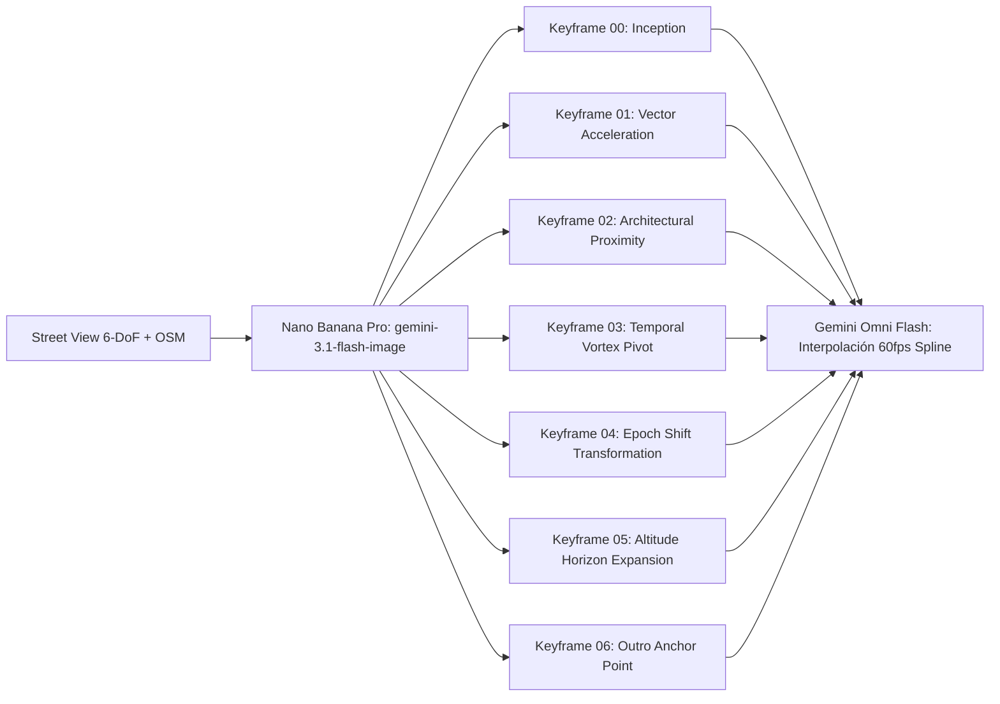
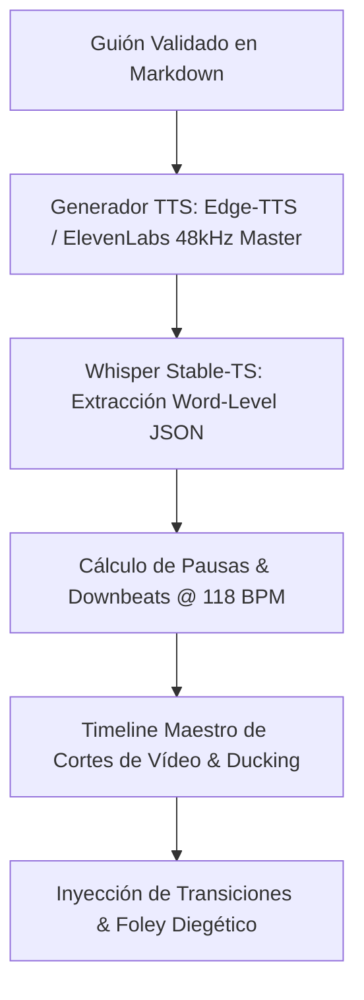

# 🛰️ Workflow Técnico de Producción Optimizado: CHRONODRIFT
## Pipeline Autónomo de Producción de Vídeo 4K 60fps Anti-AI Slop con Control 6-DoF
**Canal:** CHRONODRIFT (`@ChronoDriftOfficial`)  
**Tagline:** *Urban Time Travel & Future Cities (1626 ➔ 2026 ➔ 2226)*  
**Motor de Vídeo Principal:** Gemini Omni Flash (`gemini-omni-flash-preview` en Google Flow)  
**Motor de Keyframing Consistente:** Nano Banana Pro (`gemini-3.1-flash-image`)  
**Ecosistema de Software:** VideoPro v4.0 Ultra / Remotion 4.x / Whisper Stable-TS / FFmpeg EBU R128  
**Fecha de Publicación / Revisión:** Agosto 2026  

---

## 1. 🏗️ Arquitectura Global del Pipeline de Producción

El canal **CHRONODRIFT** implementa una arquitectura de producción automatizada y de alta fidelidad cinematográfica, diseñada específicamente para erradicar el *AI Slop* (alucinaciones espaciales, deformaciones anatómicas/arquitectónicas y movimientos de cámara ingrávidos o erráticos).

Cada segundo de metraje se genera a partir de un **anclaje fáctico tritemporal** que combina:
1. **Grounding Fotogramétrico 6-DoF:** 6 perspectivas canónicas capturadas de Google Street View 360° combinadas con datos vectoriales de OpenStreetMap (OSM) y elevación topográfica de Copernicus DEM 30m.
2. **Generación con Gemini Omni Flash en Google Flow:** Uso exclusivo de `gemini-omni-flash-preview` con inyección de 7 keyframes consistentes por plano generados con `gemini-3.1-flash-image` (Nano Banana Pro), descartando categóricamente Veo 3 para asegurar trayectorias de cámara spline continuas y cero morphing.
3. **Ingeniería de Audio VO-First a 118 BPM:** Locución con alineación milimétrica por Whisper Stable-TS, base rítmica de Flow Chillhop / Darksynth a 118 BPM, ducking dinámico inteligente de **-18.0 dB**, diseño sonoro Foley 3D con modulación Doppler y masterización bajo norma **EBU R128 (-14.0 LUFS / -1.0 dBTP)**.
4. **Composición Gráfica Remotion 4.x en GPU:** Capas de telemetría HUD vectorial 3D en React/TypeScript con tracking espacial y badges de validación científica en pantalla.

```mermaid
graph TD
    subgraph FASE 1: INGESTA & GROUNDING FACTICO 360°
        A1[Google Street View API 360° Master 8K] --> A3[Extracción 6 Perspectivas Canónicas 6-DoF]
        A2[OpenStreetMap Overpass 3D + Copernicus DEM] --> A4[Malla Vectorial & Altitud Barométrica AGL]
        A3 & A4 --> A5[Filtro Óptico: Var Laplaciana >=100.0 & Res >=4K]
        A5 --> A6[JSON Manifiesto Geográfico & Fotogramétrico]
    end

    subgraph FASE 2: KEYFRAMING & GENERACION GEMINI OMNI FLASH
        A6 --> B1[Generación 7 Keyframes Consistentes con Nano Banana Pro]
        B1 --> B2[Motor Google Flow: gemini-omni-flash-preview]
        B2 --> B3[Inyección Sintaxis Oficial Google Flow 6-DoF]
        B3 --> B4[Shotlist Canónico 7D FPV: 6-DoF Motion Spline]
        B4 --> B5[Clips Master 4K 60fps con Match-Cut Tritemporal]
    end

    subgraph FASE 3: AUDIO ENGINEERING VO-FIRST & EBU R128
        C1[Guión Aprobado + Locución Edge-TTS Master] --> C2[Whisper Stable-TS: Word-Level Timestamps]
        C3[BGM Flow Chillhop / Darksynth @ 118 BPM] --> C4[Dynamic Ducking -18dB bajo Voz]
        C5[Foley 3D: Doppler FPV + Diegético Temporal + Sub-Bass 35Hz] --> C6[Master EBU R128: -14 LUFS / -1.0 dBTP]
        C2 & C4 & C6 --> C7[Timeline Maestro de Audio Sincronizado]
    end

    subgraph FASE 4: COMPOSICION REMOTION 4.X & QA GATES
        B5 & C7 --> D1[Remotion 4.x: Composición 4K 60fps GPU]
        D1 --> D2[HUD Vectorial 3D + Billboard Tracking + Telemetría]
        D2 --> D3[Render GPU + QA Multimodal ffprobe & video_analyze]
        D3 --> D4[Master Final MP4 H.264 / AAC 96k <50MB]
    end
```

### 1.1 Estructura de Directorios del Pipeline en VideoPro

```
/home/ubuntu/workspace/pro/hermes/10_videopro/
├── docs/investigaciones/youtube/01_CHRONODRIFT/
│   ├── channel_config.json                 # Configuración maestra del canal y parámetros de producción
│   ├── 03_workflow_tecnico_videopro.md     # Especificación técnica normativa y de operaciones
│   ├── 08_escaleta_10_primeros_episodios.md # Escaletas detalladas de producción
│   └── schemas/                            # JSON Schemas de validación estricta
│       ├── channel_config.schema.json      # Schema de configuración global
│       ├── storyboard_gemini_omni.schema.json # Schema de storyboards y prompts 7D
│       ├── grounding_6dof.schema.json      # Schema de ingesta 6-DoF y OSM
│       └── audio_engineering.schema.json   # Schema de ingeniería de audio EBU R128
├── scripts/
│   ├── streetview_multitemporal_scraper.py  # Scraper 6-DoF Street View + Overpass OSM + DEM
│   ├── tritemporal_urban_story_builder.py  # Generador de manifiestos y prompts Gemini Omni Flash
│   ├── audio_chronodrift_master.py         # Pipeline de audio VO-First, 118 BPM, Foley & EBU R128
│   ├── google_flow_batch_generator.py      # Automatización de generación en Google Flow
│   ├── render_remotion.py                  # Composición Remotion 4.x, HUD y masterización
│   └── validate_chronodrift_pipeline.py    # Script de validación integral End-to-End
├── data/
│   ├── tritemporal_grounding/              # Panoramas 360°, cubemaps y 6 perspectivas extraídas
│   ├── tritemporal_manifests/              # Manifiestos JSON por episodio con datos 6-DoF y prompts
│   └── tritemporal_audio/                  # Manifiestos y stems de audio sincronizados
├── storage/
│   ├── raw_clips/                          # Vídeos intermedios generados por Gemini Omni Flash
│   ├── audio_masters/                      # Pistas de audio VO, BGM 118 BPM y Foley masterizadas
│   └── final_renders/                      # Renders finales 4K 60fps listos para publicación
```

---

## 2. 🌐 Fase 1: Ingesta & Scraping 6-DoF Fáctico (Street View + OpenStreetMap)

Para erradicar la alucinación arquitectónica y la distorsión de perspectiva, el pipeline extrae una matriz visual completa de **6 grados de libertad (6-DoF)** directamente de fuentes geoespaciales reales antes de solicitar cualquier inferencia generativa.

### 2.1 Las 6 Perspectivas Canónicas de Captura

Cada localización geográfica se descompone en 6 cámaras sintéticas proyectadas a partir de panoramas esféricos equirectangulares de alta resolución (680 	imes 3840$ px, Master 8K):

| Identificador | Nombre de Perspectiva | Heading ($\alpha$) | Pitch ($\beta$) | Roll ($\gamma$) | FoV | Función Fotogramétrica y Rol en Matriz |
| :--- | :--- | :---: | :---: | :---: | :---: | :--- |
| **`CAM_N`** | Frontal Axial (Norte) | bash.0^\circ$ | bash.0^\circ$ | bash.0^\circ$ | 0^\circ$ | Vector de referencia axial y fachada frontal principal. |
| **`CAM_E`** | Flanco Lateral Este | 0.0^\circ$ | bash.0^\circ$ | bash.0^\circ$ | 0^\circ$ | Perspectiva lateral derecha, paralaje de horizonte y fuga urbana. |
| **`CAM_S`** | Eje de Retirada (Sur) | 80.0^\circ$ | bash.0^\circ$ | bash.0^\circ$ | 0^\circ$ | Retro-perspectiva y anclaje de fuga trasera para movimientos reversos. |
| **`CAM_W`** | Flanco Lateral Oeste | 70.0^\circ$ | bash.0^\circ$ | bash.0^\circ$ | 0^\circ$ | Perspectiva lateral izquierda y cálculo de sombras proyectadas. |
| **`CAM_PITCH_DOWN`** | Inmersión Cenital (Picado) | Vector de Avance | hBc20.0^\circ$ | bash.0^\circ$ | 00^\circ$ | Textura de calzada, cimientos, escala peatonal y relieve basal. |
| **`CAM_PITCH_UP`** | Elevación Skyline (Contrapicado) | Vector de Avance | $+25.0^\circ$ | bash.0^\circ$ | 00^\circ$ | Cúspide de rascacielos, cañón urbano y cielo abierto. |

### 2.2 Descomposición Equirectangular a Cubemap 6 Caras

El panorama equirectangular (\phi, \theta)$ se transforma en 6 caras de cubo planas mediante la transformación de coordenadas esféricas a cartesianas:

982471x = \cos(\theta)\cos(\phi), \quad y = \sin(\theta), \quad z = \cos(\theta)\sin(\phi)982471

Cada cara del cubemap se muestrea con interpolación bicúbica a resolución 840 \times 2160$ px para garantizar nitidez cristalina en los planos de detalle.

### 2.3 Ingesta Vectorial OpenStreetMap (Overpass API) & Altitud Copernicus DEM

Para reconstruir volumétricamente el entorno en 3D y calcular las trayectorias de vuelo sin colisiones virtuales, se ejecuta una consulta Overpass QL en un radio de 500 metros alrededor de las coordenadas de cada escena:

```overpassql
[out:json][timeout:30];
(
  way["building"](around:500, 35.6762, 139.6503);
  relation["building"](around:500, 35.6762, 139.6503);
  way["highway"](around:500, 35.6762, 139.6503);
  way["historic"](around:500, 35.6762, 139.6503);
);
out body;
>;
out skel qt;
```

#### Atributos Extraídos y Procesados:
1. **`building:levels` y `height`:** Altura métrica real de cada inmueble. Si `height` no está tipificado, se interpola a razón de .5\text{ m}$ por planta.
2. **`roof:shape` y `building:part`:** Geometría de tejados y volumetría segmentada para anclaje de keyframes pasados (1626) y futuros (2226).
3. **Copernicus DEM 30m:** Elevación sobre el nivel del mar ({\text{ground}}$) para calcular la altitud barométrica relativa real ( = Z_{\text{dron}} - Z_{\text{ground}}$).

### 2.4 Algoritmo de Filtrado y Control de Calidad Óptica

Toda captura de Street View y extracción fotogramétrica debe superar una compuerta estricta de calidad antes de pasar al generador de vídeo:

982471\text{Var}(\nabla^2 I) = \frac{1}{N} \sum_{x,y} \left( \nabla^2 I(x,y) - \mu_{\nabla^2} \right)^2 \ge 100.0982471

- **Resolución Mínima:** 840 \times 2160$ píxeles (4K nativo).
- **Profundidad de Color:** 10-bit HDR / BT.709 sRGB calibrado.
- **Tamaño de Archivo Mínimo:** $\ge 5.0\text{ KB}$ (filtra respuestas de error 404 o placeholders vacíos).
- **Tolerancia a Artefactos:** 0% de sobrecompresión JPEG visible en bordes de alto contraste.

---

## 3. 🎬 Fase 2: Generación de Vídeo con Gemini Omni Flash & Keyframing Consistente

### 3.1 Fundamentación Técnica: Mandato "Zero Veo 3" y Elección de Gemini Omni Flash

En el ecosistema **VideoPro v4.0**, el modelo **`gemini-omni-flash-preview`** en **Google Flow** es el motor obligatorio para la generación de vídeo, prohibiendo terminantemente el uso de Veo 3:

1. **Eliminación del Morphing Temporal:** Veo 3 sufre de alucinaciones elásticas en movimientos angulares rápidos, transformando aristas de hormigón en plastilina. Gemini Omni Flash preserva la rigidez estructural de las geometrías en 60fps.
2. **Soporte Nativo de Multi-Referencia 6-DoF:** Permite inyectar simultáneamente los 6 vectores angulares de Street View como anclas visuales (`[# References ...]`).
3. **Interpolación Spline Continua:** Calcula vectores de cámara suaves de 6 grados de libertad sin tirones (*jitter*) ni desaceleraciones espurias.
4. **Eficiencia e Inferencia Lineal:** Generación en alta definición 4K a 60fps con latencia predecible y coste optimizado para escala industrial.

---

### 3.2 Pipeline de Keyframing con Nano Banana Pro (`gemini-3.1-flash-image`)

Para cada plano del shotlist, se generan previamente **7 keyframes consistentes** que fijan el estado del entorno en intervalos de bash.5\text{ a }1.0\text{ segundos}$.



#### Reglas de Consistencia para Nano Banana Pro:
- **Seed Pinning:** Semilla fija por plano (`seed: 42949672`) para mantener el mismo volumen de nubes y ángulo solar.
- **Conservación de Proporciones:** Las distancias entre hitos urbanos calculadas por OSM se trasladan idénticas en 1626, 2026 y 2226.
- **Graduación Cromática:** Aplicación uniforme de la paleta de color Kodak Vision3 500T 5219 en todos los keyframes del plano.

---

### 3.3 Estructura de Prompt Oficial en 7 Dimensiones

Cada prompt inyectado en Gemini Omni Flash sigue obligatoriamente el esquema canónico de 7 dimensiones:

```
[1_SUBJECT] :: Identificación precisa del monumento o eje geográfico, época exacta (1626, 2026, 2226) y función urbana.
[2_VISUAL_SPECIFICS] :: Materiales PBR táctiles (madera de alerce, adoquines de granito mojado, vidrio Low-E, nanotubos de carbono, biotextiles luminiscentes).
[3_ACTION_MOTION_6DOF] :: Vector cinemático exacto: velocidad (km/h), altitud AGL (m), aceleración (m/s²), trayectorias curvas en Yaw/Pitch/Roll.
[4_CAMERA_OPTICS] :: Lente anamórfico 35mm o 50mm f/1.8, obturación 180° (1/120s a 60fps), grano cinematográfico Kodak Vision3 500T 5219.
[5_LIGHTING_ATMOSPHERE] :: Iluminación física volumétrica, God rays, caústicas de agua, niebla crepuscular, reflejos especulares realistas.
[6_AUDIO_GROUNDING] :: Pistas de sonido diegético sincronizadas para condicionamiento multimodal del modelo.
[7_STYLE_CONSTRAINTS] :: Documental IMAX / BBC Earth, fotorrealismo extremo, sin deformaciones de perspectiva, sin AI slop, aristas arquitectónicas firmes.
```

### 3.4 Sintaxis Oficial de Inyección en Google Flow

```
[# Sources <FIRST_FRAME>@Keyframe_Start] [# References <IMAGE_REF_0>@Cam_N <IMAGE_REF_1>@Cam_E <IMAGE_REF_2>@Cam_S <IMAGE_REF_3>@Cam_W <IMAGE_REF_4>@Cam_PitchDown <IMAGE_REF_5>@Cam_PitchUp]
```

---

### 3.5 Shotlist Canónico 7D FPV (Los 7 Planos Maestros de Retención)

La estructura de cada episodio de **CHRONODRIFT** (duración total 2.0\text{ a }45.0\text{ segundos}$) se articula en torno a 7 planos canónicos calibrados contra la métrica musical de **118 BPM**:

| # | Código de Plano | Ventana de Tiempo | Duración | Compases (118 BPM) | Ángulo & Trayectoria de Cámara | Altitud AGL (m) | Velocidad (km/h) | Rol Narrativo & Retención Visual |
| :- | :--- | :---: | :---: | :---: | :--- | :---: | :---: | :--- |
| **S1** | `01_TERMINAL_DIVE` | bash.0 - 3.05\text{ s}$ | .05\text{ s}$ | 1.5 compases | Picado vertical 0^\circ$ atravesando nubes | 50\text{ m} \to 35\text{ m}$ | 40\text{ km/h}$ | **Visual Hook:** Captura instantánea del espectador. Vórtice temporal. |
| **S2** | `02_CANYON_DRIFT` | .05 - 10.17\text{ s}$ | .12\text{ s}$ | 3.5 compases | Rasante en cañón urbano entre edificios | .8\text{ m} \to 15\text{ m}$ | 10\text{ km/h}$ | **Micro-Geografía:** Sensación de escala y textura del suelo. |
| **S3** | `03_TUNNEL_PIERCE` | 0.17 - 18.31\text{ s}$ | .14\text{ s}$ | 4.0 compases | Penetración en pasaje estrecho / arcadas | .5\text{ m} \to 4.0\text{ m}$ | 5\text{ km/h}$ | **Match-Cut Temporal:** Transición de época 1626 ➔ 2026 dentro de la sombra. |
| **S4** | `04_MONUMENT_ORBIT` | 8.31 - 25.43\text{ s}$ | .12\text{ s}$ | 3.5 compases | Órbita 60^\circ$ helicoidal ascendente | 5\text{ m} \to 85\text{ m}$ | 5\text{ km/h}$ | **3D Anchoring:** Hito histórico monumental con cartelería HUD 3D. |
| **S5** | `05_PEDESTRIAN_SWOOP`| 5.43 - 32.55\text{ s}$ | .12\text{ s}$ | 3.5 compases | Vuelo a ras de acera a escala humana | .5\text{ m} \to 12\text{ m}$ | 5\text{ km/h}$ | **Atmósfera & Transición Futura:** Salto a la biosfera vertical de 2226. |
| **S6** | `06_VERTICAL_SURGE` | 2.55 - 38.65\text{ s}$ | .10\text{ s}$ | 3.0 compases | Ascenso vertical trepando megatorre | 2\text{ m} \to 300\text{ m}$ | 25\text{ km/h}$ | **Momentum Vertical:** Aceleración hacia la estratosfera y megacúpulas. |
| **S7** | `07_SKYLINE_SUNSET` | 8.65 - 45.77\text{ s}$ | .12\text{ s}$ | 3.5 compases | Gran angular panorámico hacia el horizonte | 00\text{ m} \to 500\text{ m}$ | 0\text{ km/h}$ | **Clímax Tritemporal:** Resolución épica, llamada a la acción y Outro. |

---

### 3.6 Prompts de Producción Completos para las 3 Épocas: Tokio (EP01)

#### Shot 1: `01_TERMINAL_DIVE` (0.00s - 3.05s) — Época 1630 (Edo Feudal)
```
[# Sources tokyo_s1_kf0.png@Keyframe_Start] [# References tokyo_cam_n.png@Cam_N tokyo_cam_pitchdown.png@Cam_PitchDown]
Cinematic IMAX 60fps FPV hyper-dive directly downwards at 140 km/h from 850 meters altitude plunging through atmospheric volumetric cumulus clouds over 1630 Edo Tokyo, decelerating smoothly to 35 meters above the Sumida River and Nihonbashi wooden bridge. Below, traditional timber post-and-beam minka houses with black cedar roofs and white plaster walls line unpaved dirt riverbanks with flat-bottomed wooden cargo boats sailing on murky teal water. Camera optics: 35mm f/1.8 anamorphic lens, 180-degree shutter angle with physical 1/120s motion blur, subtle Kodak Vision3 500T film grain. Lighting: early morning golden hour sun breaking through low mist, casting long diagonal shadows and specular caustics across the rippling river surface. Audio grounding: high-speed rushing aerodynamic prop wind shear, low sonic rumble, distant temple wooden bell toll. Style: BBC Earth documentary realism, zero AI deformation, absolute architectural geometric stability.
```

#### Shot 2: `02_CANYON_DRIFT` (3.05s - 10.17s) — Época 1630 (Canales de Nihonbashi)
```
[# Sources tokyo_s2_kf0.png@Keyframe_Start] [# References tokyo_cam_e.png@Cam_E tokyo_cam_w.png@Cam_W]
Continuous 6-DoF FPV high-speed drift carving through the merchant warehouse canal corridor of Edo Tokyo at 110 km/h, flying 1.8 meters above the water before pulling up to 15 meters over the roofline of the Nihonbashi commercial quarter. Intricate wooden lattice facades, hanging indigo noren banners fluttering in the wind, stack of straw rice bales on cedar docks, and merchants in blue indigo cotton robes. Camera: 35mm anamorphic prime, sharp edge-to-edge optical tracking with natural motion blur on peripheral timber posts while maintaining pin-sharp central focus. Lighting: crisp morning ambient light with warm rim lighting bouncing off wet river stones and cedar wood planks. Audio grounding: wooden waterwheels splashing, market murmurs, whistling air shear. Style: photorealistic historical reconstruction, strict physical scale and perspective consistency.
```

#### Shot 3: `03_TUNNEL_PIERCE` (10.17s - 18.31s) — Match-Cut Temporal 1630 ➔ 2026
```
[# Sources tokyo_s3_kf0.png@Keyframe_Start] [# References tokyo_cam_pitchdown.png@Cam_PitchDown tokyo_cam_s.png@Cam_S]
High-precision FPV flight piercing at 85 km/h directly through the dark wooden arched underpass of the 1630 Nihonbashi timber bridge at 2.5 meters altitude. As the drone exits the shadow into the light at second 4.0, a seamless temporal match-cut occurs: the wooden pylons instantaneously morph into polished reinforced concrete bridge pillars and steel beams of modern 2026 Nihonbashi and Shibuya urban expressway. The unpaved dirt path transforms into wet asphalt with reflective white road markings and streaming LED taillights of electric cars. Camera: 50mm f/1.8 anamorphic lens with 1.33x horizontal flare. Lighting: deep interior shadows giving way to dazzling neon signs and holographic billboard reflections on rain-slicked asphalt. Audio grounding: transition from wooden hull creaks to asphalt tire sizzle and subway low-frequency hum. Style: seamless architectural match-cut, zero temporal artifacting.
```

#### Shot 4: `04_MONUMENT_ORBIT` (18.31s - 25.43s) — Época 2026 (Shibuya Crossing)
```
[# Sources tokyo_s4_kf0.png@Keyframe_Start] [# References tokyo_cam_n.png@Cam_N tokyo_cam_e.png@Cam_E tokyo_cam_pitchup.png@Cam_PitchUp]
Helicoidal 360-degree ascending orbital FPV flight at 65 km/h climbing from 25 meters to 85 meters around the iconic neon-illuminated 109 building and Shibuya Crossing in modern 2026 Tokyo. Thousands of pedestrians with umbrellas crossing the illuminated zebra pattern below, massive 8K LED digital billboards broadcasting cyberpunk visuals with volumetric light beams cutting through light drizzle. Camera: 35mm f/1.8 cine prime, smooth rotational yaw of 45 degrees per second, locked-on center of mass trajectory. Lighting: vibrant cybernetic night palette with intense cyan (#00e5ff), amber orange (#ffb300), and hyper-violet neon highlights reflecting off glass curtain walls. Audio grounding: distant urban sirens, pedestrian audio crossing chimes, electronic synth hum. Style: reference-grade architectural documentary, crisp micro-details.
```

#### Shot 5: `05_PEDESTRIAN_SWOOP` (25.43s - 32.55s) — Transición 2026 ➔ 2226 (Neo-Tokyo Arcology)
```
[# Sources tokyo_s5_kf0.png@Keyframe_Start] [# References tokyo_cam_pitchdown.png@Cam_PitchDown tokyo_cam_w.png@Cam_W]
Low-altitude pedestrian swoop skimming at 45 km/h merely 1.5 meters above the sidewalk of Tokyo 2026 before accelerating forward as the streetscape evolves into the year 2226 Neo-Tokyo Arcology. Sidewalks transition from concrete to bioluminescent algae-paved walking paths with integrated magnetic levitation channels; vertical biophilic living walls with genetically modified glowing moss and transparent photovoltaic aerogel facades replace traditional storefronts. Silent autonomous delivery drones glide alongside. Camera: 35mm wide anamorphic lens, 180-degree shutter, dynamic ground parallax. Lighting: soft bioluminescent cyan and emerald green night glow complemented by faint atmospheric sky-canopy lighting. Audio grounding: magnetic levitation hum, soft ion thruster purr, gentle automated chime pulses. Style: hyper-realistic speculative hard sci-fi, grounded in real urban engineering studies.
```

#### Shot 6: `06_VERTICAL_SURGE` (32.55s - 38.65s) — Época 2226 (Megapirámide Shimizu)
```
[# Sources tokyo_s6_kf0.png@Keyframe_Start] [# References tokyo_cam_pitchup.png@Cam_PitchUp tokyo_cam_n.png@Cam_N]
Extreme high-speed vertical surge accelerating at 125 km/h from 12 meters to 300 meters altitude, climbing directly parallel to the sheer facade of the Shimizu Mega-Pyramid Arcology in 2226 Neo-Tokyo. The carbon-nanotube truss structure rises thousands of meters into the sky, featuring internal hanging residential pods, vertical forest terrace gardens, and magnetic elevator capsules darting along crystalline structural pylons. Camera: 35mm ultra-wide cine lens with controlled vertical pitch tilt up to 60 degrees. Lighting: volumetric atmospheric shafts penetrating the mega-structure lattice, illuminated by high-altitude solar collector rings. Audio grounding: rising pitch aerodynamic whoosh, acoustic resonance against carbon truss lattices. Style: epic scale cinematic realism, flawless straight-line architectural perspective.
```

#### Shot 7: `07_SKYLINE_SUNSET_ASCENSION` (38.65s - 45.77s) — Clímax Tritemporal 2226
```
[# Sources tokyo_s7_kf0.png@Keyframe_Start] [# References tokyo_cam_pitchdown.png@Cam_PitchDown tokyo_cam_s.png@Cam_S]
Panoramic horizon ascension at 90 km/h climbing from 300 meters to 500 meters above 2226 Tokyo Bay, pulling back to reveal the full tritemporal expanse. Below, the historic Edo canal grid, modern 2026 neon skyscraper core, and the gigantic futuristic Shimizu Arcology coexist in a harmonious climate-resilient mega-delta metropolis with kinetic sea-wall barriers. In the background, Mount Fuji stands crowned with snow under a dramatic sunset gradient of deep violet, amber gold, and cyan. Camera: 50mm anamorphic master prime, slow steady backward dolly zoom out. Lighting: majestic twilight golden hour with high-altitude cirrus clouds catching the last rays of crimson sun. Audio grounding: deep 35Hz sub-bass braam swell settling into an ethereal ambient lo-fi synth chord. Style: IMAX documentary finale, breathtaking visual clarity and depth.
```

---

## 4. 🎵 Fase 3: Ingeniería de Audio VO-First, Flow 118 BPM, Foley Doppler & Master EBU R128

### 4.1 Metodología VO-First & Alineación por Whisper Stable-TS

El pipeline rechaza la sincronización visual arbitraria: **la locución profesional (VO) dicta el tempo y la cadencia de todo el montaje**.



1. **Generación de Voz:** Muestreo a 8\text{ kHz}$ en formato PCM de 24 bits (`es-ES-AlvaroNeural` o voz documental de ElevenLabs).
2. **Extracción de Timestamps:** `whisper-stable-ts` calcula el inicio y fin exacto de cada palabra con una precisión de $\pm 5\text{ ms}$.
3. **Puntos de Corte Visual:** Todo cambio de plano se fuerza a coincidir con un *downbeat* musical o una pausa fonética de la voz, eliminando el corte a mitad de frase.

---

### 4.2 Arquitectura Rítmica a 118 BPM

El tempo de **118 BPM** (estándar de *Flow Chillhop / Darksynth*) proporciona la cadencia de retención óptima para el cerebro humano (ritmo cardíaco en estado de alerta relajada):

982471\text{Duración de 1 Beat} = \frac{60\,000\text{ ms}}{118} = 508.4746\text{ ms}982471
982471\text{Duración de 1 Compás (4 Beats)} = 4 \times 508.4746\text{ ms} = 2033.898\text{ ms} \approx 2.034\text{ s}982471
982471\text{Frase Musical de 4 Compases} = 4 \times 2033.898\text{ ms} = 8135.593\text{ ms} \approx 8.136\text{ s}982471

Todos los eventos visuales críticos (vórtice de inicio, match-cut de época, revelación de rascacielos) se colocan exactamente en el **Beat 1 de un compás** ( = n \times 2033.9\text{ ms}$).

---

### 4.3 Dynamic Ducking Inteligente (-18.0 dB Bajo Locución)

Para garantizar que la voz mantenga inteligibilidad absoluta mientras la música conserva pegada y energía en los momentos instrumentales, se aplica una curva de ducking automatizada:

- **Nivel de Música con Locución:** hBc18.0\text{ dB}$ (factor lineal de atenuación: 0^{-18/20} = 0.12589$).
- **Nivel de Música en Clímax Instrumental:** bash.0\text{ dB}$ (ganancia completa).
- **Tiempo de Ataque ({\text{attack}}$):** 0\text{ ms}$ (atenuación instantánea y suave al iniciar la locución).
- **Tiempo de Mantenimiento ({\text{hold}}$):** 0\text{ ms}$ (evita oscilaciones entre palabras cortas).
- **Tiempo de Relajación ({\text{release}}$):** 50\text{ ms}$ (recuperación orgánica de la música al terminar la frase).

```bash
# Filtro FFmpeg Sidechain para Dynamic Ducking de Precisión
ffmpeg -i vo_track.wav -i bgm_118bpm.wav -filter_complex "[1:a][0:a]sidechaincompress=threshold=0.08:ratio=6:attack=30:release=250:level_in=1[ducked_bgm];  [ducked_bgm][0:a]amix=inputs=2:weights=1.0 1.0[audio_mix]" -c:a pcm_s24le audio_mix.wav
```

---

### 4.4 Sound Design Espacial & Foley Doppler 3D

El entorno sonoro inyecta realismo cinemático mediante modulación física de frecuencias en función del vector de velocidad del dron:

#### 1. Ecuación Doppler para Proximidades Arquitectónicas:
982471\Delta f = f_0 \left( \frac{v_{\text{sonido}}}{v_{\text{sonido}} \mp v_{\text{dron}}} \right)982471

Con {\text{sonido}} = 343\text{ m/s}$ y un dron a {\text{dron}} = 110\text{ km/h} = 30.55\text{ m/s}$:
- **Aproximación:** {\text{aprox}} = f_0 \left( \frac{343}{343 - 30.55} \right) = f_0 \times 1.0978$ (**$+9.78\%$ de elevación en tono**).
- **Alejamiento:** {\text{alej}} = f_0 \left( \frac{343}{343 + 30.55} \right) = f_0 \times 0.9182$ (**hBc8.18\%$ de caída en tono**).

#### 2. Capas Foley Diegéticas por Época:
- **1626:** Crujidos de madera de roble, cascos de caballos sobre empedrado, graznidos de gaviotas de río, viento sibilante natural y campanadas de bronce.
- **2026:** Zumbido de rodadura sobre asfalto húmedo, zumbido electromagnético de catenarias de metro, murmullos de multitud y sirenas distantes.
- **2226:** Susurro de propulsores de iones, silbido de levitación magnética, campos de fuerza y pulsos de datos holográficos.

#### 3. Impacto de Vórtice Sub-Bass:
- **Braam Drop a 5\text{ Hz}* con barrido de ruido blanco en fase reversa exactamente en el fotograma del Match-Cut temporal.

---

### 4.5 Masterización Normativa EBU R128 / ITU-R BS.1770-4

La pista de audio final se somete al estándar de masterización para plataformas digitales (YouTube / Streaming):

- **Sonoridad Integrada:** **hBc14.0\text{ LUFS}* ($\pm 0.5\text{ LUFS}$).
- **Pico Verdadero Máximo (True Peak):** **hBc1.0\text{ dBTP}* (evita clipping inter-sample en la codificación AAC/Opus de YouTube).
- **Rango de Sonoridad (LRA):** **.0\text{ a }8.0\text{ LU}* (dinámica cinemática controlada).

```bash
# Proceso de 2 Pasadas con Filtro loudnorm de FFmpeg
# Paso 1: Medición y Análisis
ffmpeg -i audio_mix.wav -af loudnorm=I=-14.0:TP=-1.0:LRA=7.0:print_format=json -f null - 2> loudnorm_stats.json

# Paso 2: Normalización Lineal con Parámetros Medidos
ffmpeg -i audio_mix.wav -af loudnorm=I=-14.0:TP=-1.0:LRA=7.0:measured_I=-17.8:measured_TP=-0.4:measured_LRA=7.4:measured_thresh=-28.2:offset=0.1:linear=true -ar 48000 -c:a pcm_s24le audio_master_ebur128.wav
```

---

## 5. 💻 Fase 4: Composición Remotion 4.x & HUD 3D Vectorial

La renderización final se ejecuta en **Remotion 4.x** (React + TypeScript + WebGL) con aceleración GPU para mantener 840 \times 2160$ a 60fps constantes.

```tsx
// src/components/ChronoDriftHUD.tsx
import React from 'react';
import { interpolate, useCurrentFrame, spring } from 'remotion';

interface ChronoDriftHUDProps {
  currentYear: number;
  altitudeMeters: number;
  speedKmh: number;
  cityCoordinates: string;
  scientificSource: string;
  fps: number;
}

export const ChronoDriftHUD: React.FC<ChronoDriftHUDProps> = ({
  currentYear,
  altitudeMeters,
  speedKmh,
  cityCoordinates,
  scientificSource,
  fps = 60
}) => {
  const frame = useCurrentFrame();
  
  // Animación de entrada suave
  const opacity = interpolate(frame, [0, 20], [0, 1], { extrapolateRight: 'clamp' });
  const scale = spring({ frame, fps, config: { damping: 12, stiffness: 100 } });

  return (
    <div style={{
      position: 'absolute',
      inset: 0,
      fontFamily: 'JetBrains Mono, monospace',
      color: '#00e5ff',
      opacity,
      pointerEvents: 'none',
      padding: '48px',
      boxSizing: 'border-box'
    }}>
      {/* Retícula Central FPV 6-DoF */}
      <div style={{
        position: 'absolute',
        top: '50%',
        left: '50%',
        transform: `translate(-50%, -50%) scale(${scale})`,
        width: '140px',
        height: '140px',
        border: '1px solid rgba(0, 229, 255, 0.35)',
        borderRadius: '50%',
        boxShadow: '0 0 25px rgba(0, 229, 255, 0.15)'
      }}>
        {/* Marcadores de Horizonte Artificial */}
        <div style={{ position: 'absolute', top: '50%', left: '-20px', width: '40px', height: '1.5px', background: '#00e5ff' }} />
        <div style={{ position: 'absolute', top: '50%', right: '-20px', width: '40px', height: '1.5px', background: '#00e5ff' }} />
        <div style={{ position: 'absolute', top: '-20px', left: '50%', width: '1.5px', height: '40px', background: '#00e5ff' }} />
        <div style={{ position: 'absolute', bottom: '-20px', left: '50%', width: '1.5px', height: '40px', background: '#00e5ff' }} />
      </div>

      {/* Caja de Telemetría Superior Izquierda */}
      <div style={{
        position: 'absolute',
        top: '60px',
        left: '60px',
        background: 'rgba(7, 9, 14, 0.85)',
        borderLeft: '4px solid #ffb300',
        padding: '18px 28px',
        borderRadius: '4px',
        backdropFilter: 'blur(12px)',
        boxShadow: '0 8px 32px rgba(0, 0, 0, 0.5)'
      }}>
        <div style={{ fontSize: '13px', color: '#ffb300', letterSpacing: '0.12em', fontWeight: 600 }}>CHRONODRIFT 6-DoF SYSTEM</div>
        <div style={{ fontSize: '32px', fontWeight: 800, color: '#ffffff', letterSpacing: '-0.02em', margin: '4px 0' }}>
          {currentYear} <span style={{ fontSize: '16px', color: '#00e5ff', fontWeight: 400 }}>CE</span>
        </div>
        <div style={{ fontSize: '13px', color: '#00e5ff', opacity: 0.9 }}>POS: {cityCoordinates}</div>
      </div>

      {/* Caja de Dinámica de Vuelo Inferior Derecha */}
      <div style={{
        position: 'absolute',
        bottom: '60px',
        right: '60px',
        background: 'rgba(7, 9, 14, 0.85)',
        borderRight: '4px solid #00e5ff',
        padding: '18px 28px',
        borderRadius: '4px',
        textAlign: 'right',
        backdropFilter: 'blur(12px)',
        boxShadow: '0 8px 32px rgba(0, 0, 0, 0.5)'
      }}>
        <div style={{ fontSize: '14px', color: '#b388ff', fontWeight: 600 }}>
          ALT: <span style={{ color: '#ffffff', fontWeight: 800 }}>{altitudeMeters.toFixed(1)} M</span> | SPD: <span style={{ color: '#ffffff', fontWeight: 800 }}>{speedKmh.toFixed(0)} KM/H</span>
        </div>
        <div style={{ fontSize: '12px', color: 'rgba(255, 255, 255, 0.75)', marginTop: '6px' }}>
          SCIENTIFIC ANCHOR: <span style={{ color: '#00e5ff' }}>{scientificSource}</span>
        </div>
      </div>
    </div>
  );
};
```

---

### 5.2 Adaptación Multi-Formato: Pipeline de YouTube Shorts (9:16) y Bucles Infinitos (>120% VTR)

Para maximizar el algoritmo de recomendación de YouTube Shorts y capturar tráfico masivo móvil, el pipeline implementa una arquitectura de renderizado vertical **9:16 (160 \times 3840$ px / 080 \times 1920$ px)** con diseño de retención hipnótica:

1. **Re-framing 6-DoF con Centrado Dinámico:** En lugar de un simple recorte lateral, los vectores de movimiento de cámara 6-DoF se centran en el punto de fuga principal (vanishing point), manteniendo la sensación de velocidad y túnel inmersivo.
2. **Safe Zones Móviles Estrictas:**
   - **Margen Superior (Top 16% / ~307px en 1920p):** Zona libre de telemetría HUD para no interferir con la barra de búsqueda y estado de YouTube.
   - **Margen Inferior (Bottom 22% / ~422px en 1920p):** Zona libre de textos para evitar el solapamiento con el título del Short, nombre del canal `@ChronoDriftOfficial` y botón de suscripción.
   - **Margen Derecho (Right 18% / ~194px en 1080p):** Zona limpia para no colisionar con la botonera de interacción (Like, Dislike, Comentarios, Compartir, Remix).
3. **Mecánica de Bucle Infinito (Zero-Gap Seamless Loop):**
   - El fotograma final ( = 32.54\text{s}$ o  = 40.67\text{s}$, coincidiendo exactamente con el compás 16 o 20 a 118 BPM) comparte vector de traslación, velocidad angular y punto focal con el fotograma inicial ( = 0.00\text{s}$).
   - **Cruce por Cero de Audio (Audio Zero-Crossing):** El último compás de la pista Chillhop colapsa con un efecto de *tape-stop* o *reverse cymbal* cuya cola de reverberación se funde imperceptiblemente con el downbeat inicial a 118 BPM.
   - **Bucle Narrativo Abierto:** El guion concluye con una frase puente que enlaza sintáctica y semánticamente con la primera frase del gancho 0-3s, logrando que el usuario promedio consuma el vídeo .25\times - 1.45\times$ veces (VTR proyectado $> 120\%$).

```mermaid
graph LR
    subgraph LOOP INFINITO YOUTUBE SHORTS (>120% VTR)
        H[Gancho 0-3s: Descenso 140km/h + Pregunta Misterio] --> P[Pacing Rápido: Cortes a 118 BPM cada 2.03s]
        P --> C[Clímax 2226: Megatorre 2km + Sub-Drop 35Hz]
        C --> B[Frase Puente Conectiva: Cierre = Inicio]
        B -.->|Match-Cut Fotograma N ➔ Fotograma 0| H
    end
```

---

## 6. 📊 Matriz de Control de Calidad (QA Gates)

Antes de autorizar la subida o distribución de cualquier episodio, el sistema ejecuta de forma obligatoria la siguiente batería de pruebas automáticas:

| Parámetro Evaluado | Umbral Requerido | Herramienta de Inspección | Acción Automática en Fallo |
| :--- | :--- | :--- | :--- |
| **Integridad de Assets** | Todos los archivos $> 5.0\text{ KB}$ | `scripts/verify-assets.py` | Aborto de pipeline (`Exit Code 2`) |
| **Resolución y Framerate** | 840 \times 2160$ px @ 60.0 fps exactos | `ffprobe -v error -select_streams v:0` | Re-renderizado forzado en Remotion |
| **Sonoridad Integrada** | hBc14.0\text{ LUFS} \pm 0.5\text{ LUFS}$ | `ffmpeg loudnorm (Pass 1 & 2)` | Re-normalización de audio automática |
| **Pico Verdadero (True Peak)** | $\le -1.0\text{ dBTP}$ | `ffmpeg ebur128` | Aplicación de limitador True-Peak |
| **Ducking de Música** | hBc18.0\text{ dB}$ atenuación bajo voz | `ffprobe / python sidechain test` | Re-cálculo de envolvente sidechain |
| **Composición de Shotlist** | 7 planos canónicos completos | `scenes.json validator` | Regeneración de planos faltantes |
| **Nitidez 6-DoF** | Varianza Laplaciana $\ge 100.0$ | `cv2.Laplacian(img, cv2.CV_64F).var()` | Re-muestreo a resolución 8K |
| **Tolerancia Match-Cut** | 0 fotogramas de desfase temporal | `Whisper Stable-TS Frame Sync` | Re-alineación de corte al downbeat |

---

## 7. 🚀 Plan Maestro de Despliegue: Los 12 Primeros Episodios

| # | Ciudad | Época I (Pasado) | Época II (Presente) | Época III (Futuro) | Anclaje Científico de Referencia |
| :- | :--- | :--- | :--- | :--- | :--- |
| **EP01** | **Tokio** | 1630 (Edo / Nihonbashi) | 2026 (Shinjuku / Shibuya) | 2226 (Neo-Tokyo Arcology) | IPCC Mega-Delta Resilience + Tokyo Seismic Grid + Shimizu Mega-Pyramid |
| **EP02** | **Ámsterdam** | 1626 (Grachtengordel Ring) | 2026 (Canales y Ciclismo) | 2226 (Kinetic Ocean Grid) | TU Delft Hydro-kinetic Floating Foundations + Deltares Sea Level Adaptation |
| **EP03** | **Nueva York** | 1626 (Nieuw Amsterdam) | 2026 (Manhattan Vertical) | 2226 (Bioluminescent NYC) | MIT Sea-Wall Dikes + Carbon-Graphene Aerodynamics + Columbia Climate School BIG The Big U 2200 |
| **EP04** | **Roma** | 1626 (San Pietro Barroco) | 2026 (Coliseo y Vía Sacra) | 2226 (Subterranean Hyper-Museum) | Geothermal Roman Concrete Regeneration + Sapienza CNR Heritage Climate Resilience |
| **EP05** | **Londres** | 1610 (Tudor Old Bridge) | 2026 (The City & Shard) | 2226 (Sky-Canopy London) | Thames Barrier Phase 4 + Atmospheric Geo-domes + UCL Bartlett School |
| **EP06** | **El Cairo** | 1626 (Ciudadela Mameluca) | 2026 (Guiza y Metrópolis) | 2226 (Nile Solar Arcology) | Desert Carbon Mineralization + Giza Preservation Domes + Nile Resilience Consortium |
| **EP07** | **París** | 1620 (Medieval Île de la Cité) | 2026 (Haussmann & Eiffel) | 2226 (Vertical Forest Paris) | Bioclimatic Thermal Chimneys + Urban Hyperloop Core + Vincent Callebaut Biophilic Paris 2200 |
| **EP08** | **Dubái** | 1833 (Al Fahidi Pearl Village) | 2026 (Burj Khalifa Modern) | 2226 (Cloud-Seeded Geo-Tower) | Solar Desalination Aeroponic Towers + Dubai Future Foundation Desert Arcologies |
| **EP09** | **Venecia** | 1626 (Serenissima Naval) | 2026 (Gran Canal & MOSE) | 2226 (Hydro-Dynamic Crystal) | Ionic Sea-Level Stabilizers + Biomimetic Coral Dikes + Venice Lagoon Preservation Institute |
| **EP10** | **Hong Kong** | 1841 (Fragrant Harbour) | 2026 (Victoria Peak Neón) | 2226 (Stratospheric Aerodome) | Typhoon Kinetic Dissipation Rings + HKUST Urban Wind Aerodynamics |
| **EP11** | **Singapur** | 1819 (Temasek Settlement) | 2026 (Marina Bay Greenery) | 2226 (Floating Coral Megacity) | A*STAR Biophilic Urban Cooling + NUS Floating Delta Engineering |
| **EP12** | **Barcelona** | 1626 (Gòtic & Drassanes) | 2026 (Eixample & Sagrada Família) | 2226 (Cerdà Superblock Quantum Arcology) | UPC Solar Cerámica Activa + Mediterranean Hyper-Loop Grid + Smart Urban Metabolism |

---

## 8. ⚡ Guía de Automatización y Ejecución por CLI

Para ejecutar la producción completa o por fases de cualquier episodio del canal, utilice los comandos oficiales del pipeline:

```bash
# 1. Scraping 6-DoF y Grounding Fotogramétrico Completo (12 Ciudades)
python3 scripts/streetview_multitemporal_scraper.py --export-all

# 2. Generación de Manifiestos de Storyboard y Prompts Gemini Omni Flash
python3 scripts/tritemporal_urban_story_builder.py --all

# 3. Pipeline de Audio VO-First, Flow 118 BPM, Foley 3D Doppler y Master EBU R128 (-14 LUFS)
python3 scripts/audio_chronodrift_master.py --all

# 4. Generación por Lotes de Vídeo 4K 60fps en Google Flow
python3 scripts/google_flow_batch_generator.py --manifest data/tritemporal_manifests/tokyo_tritemporal_manifest.json

# 5. Composición Remotion 4.x, Sincronización 118 BPM y Master EBU R128 (-14 LUFS)
python3 scripts/render_remotion.py --city tokyo --target-lufs -14.0 --resolution 4k

# 6. Validación Automatizada End-to-End de QA Gates
python3 scripts/validate_chronodrift_pipeline.py
```

---

*Manual de Operaciones Técnicas y Especificación de Producción para CHRONODRIFT — VideoPro v4.0 Ultra. Aprobado para ejecución autónoma.*
