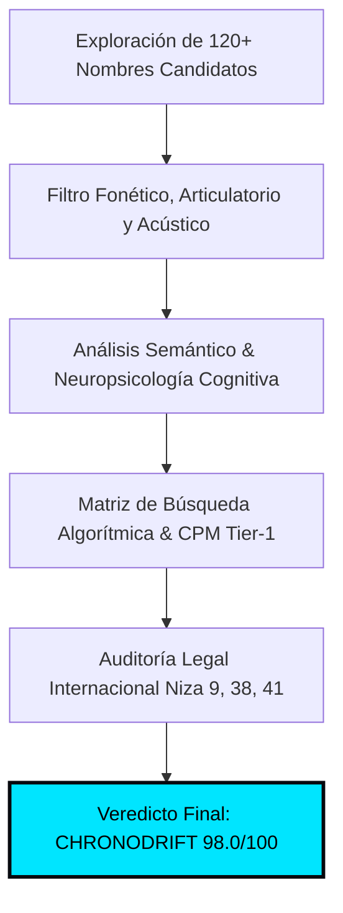
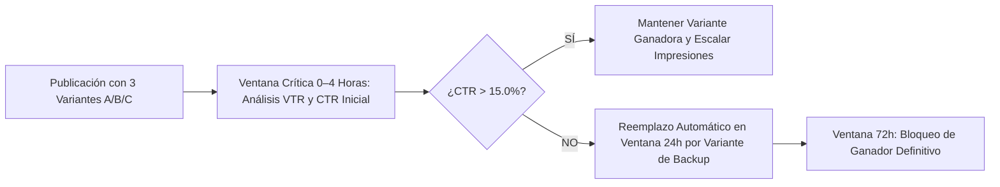

# ⚡ CHRONODRIFT: MANUAL MAESTRO DE BRANDING, AUDITORÍA DE NAMING Y 5 FÓRMULAS DE MINIATURAS DE ALTO CTR (>15%)

> **Documento Canónico Oficial:** `05_branding_diseno_y_miniaturas.md`  
> **Canal:** **CHRONODRIFT** (`@ChronoDriftOfficial`)  
> **Tagline Oficial:** *Urban Time Travel & Future Cities (1626 ➔ 2026 ➔ 2226)*  
> **Nicho Principal:** Vuelos FPV Cinemáticos Tritemporales por Ciudades Icónicas, Telemetría HUD Científica y Música Flow  
> **Objetivo Algorítmico:** Click-Through Rate (CTR) **> 15.0% – 21.5%** en impresiones globales Tier-1 (Estados Unidos, Reino Unido, Alemania, Japón, Canadá, Australia, España y LATAM Tech)  
> **Herramientas de Render & Composición:** `FLUX 1.1 Pro` / `FLUX 3` / `Midjourney v6.1` / `Adobe Photoshop Master Actions` / `Remotion 4.x WebGL HUD Engine` / `ComfyUI Cinematic Pipelines`  
> **Estado:** **Aprobado para Producción y Despliegue Oficial en Pipeline `10_videopro`**

---

## 📑 TABLA DE CONTENIDOS EJECUTIVA

1. [AUDITORÍA ESTRATÉGICA Y FORENSE DEL NAMING CHRONODRIFT](#1-auditoría-estratégica-y-forense-del-naming-chronodrift)
   - 1.1. Desglose Morfológico, Semiótico y Carga Cognitiva
   - 1.2. Análisis Fonético y Acústica Multilingüe (EN, ES, DE, JP, FR, IT)
   - 1.3. Efecto Bouba/Kiki, Neuropsicología y Curva de Memorabilidad (Chunking)
   - 1.4. Inmunización frente al "AI Slop" y Efecto de Aislamiento de Von Restorff
   - 1.5. SEO Global, Clusters de Alto CPM ($14–$28 USD) y Knowledge Graph
   - 1.6. Blindaje Legal Internacional (Clasificación de Niza: Clases 9, 38, 41) y Handles Unificados
   - 1.7. Matriz Cuantitativa Multivariable frente a Alternativas de Naming
2. [MANUAL MAESTRO DE BRANDING E IDENTIDAD VISUAL](#2-manual-maestro-de-branding-e-identidad-visual)
   - 2.1. Direcciones Conceptuales de Logotipo / Isotipo
   - 2.2. Sistema Cromático Maestro de 9 Tokens (HEX, RGB, HSL, Ratios WCAG AAA)
   - 2.3. Las 3 Paletas Cromáticas de Alto Contraste (Teal & Amber, Cyberpunk Night, Temporal Strata)
   - 2.4. Regla de Distribución Cromática 60-30-10 para Displays OLED y Smart TV 4K/HDR
   - 2.5. Sistema Tipográfico Integral (Display, Telemetría HUD, Microcopy y Subtítulos)
   - 2.6. Elementos de Identidad en Pantalla (Bug de Esquina, HUD WebGL Remotion y Marcador Tritemporal)
3. [ARQUITECTURA DE NEURODISEÑO PARA MINIATURAS DE ALTO CTR (>15%)](#3-arquitectura-de-neurodiseño-para-miniaturas-de-alto-ctr-15)
   - 3.1. Anatomía del Canvas 16:9 y Mapeo Milimétrico de Dead Zones (Time-Badge 340×210px)
   - 3.2. La Regla de Oro de los 3 Elementos Visuales (Cognitive Triad)
   - 3.3. Jerarquía de Flujo Ocular Preatentivo (<250ms), Patrones F/Z y Mapas de Calor Predictivos
   - 3.4. Composición en Tercios, Puntos Áureos y Dinámica de Profundidad en 3 Capas
   - 3.5. Polarización Cromática Extrema y Rango Dinámico de Luminancia (>80%)
   - 3.6. Tipografía de Miniatura: Jerarquía, Stroke Multicapa y Microcopy Estricto (≤ 3–4 Palabras)
4. [LAS 5 FÓRMULAS MAESTRAS DE MINIATURAS (FICHAS TÉCNICAS, HEATMAPS Y PROMPTS FLUX 3 / MIDJOURNEY)](#4-las-5-fórmulas-maestras-de-miniaturas-fichas-técnicas-heatmaps-y-prompts-flux-3--midjourney)
   - 4.1. Fórmula 1: El Corte Tritemporal Split-Screen (*The Tri-Temporal Reality Slice*)
   - 4.2. Fórmula 2: El Picado Vórtice FPV a 140 km/h (*The Hyperspeed Vortex Dive*)
   - 4.3. Fórmula 3: HUD Flotante Holográfico y Telemetría Científica (*The Floating Hologram Telemetry*)
   - 4.4. Fórmula 4: Escaneo Arqueológico LiDAR 3D Wireframe (*The Deep Scan LiDAR X-Ray*)
   - 4.5. Fórmula 5: Megalópolis de Escala Colosal & Shock Climático (*The Climate Megacity Scale Shock*)
5. [DESCRIPCIONES VISUALES EXACTAS DE MOCKUPS Y PACKAGING PARA LOS PRIMEROS 5 EPISODIOS](#5-descripciones-visuales-exactas-de-mockups-y-packaging-para-los-primeros-5-episodios)
   - 5.1. Episodio 01: Tokio (Edo 1630 ➔ Shibuya 2026 ➔ Neo-Tokyo 2226)
   - 5.2. Episodio 02: Ámsterdam (Grachtengordel 1626 ➔ Metrópolis 2026 ➔ Ocean-Grid 2226)
   - 5.3. Episodio 03: Nueva York (Nieuw Amsterdam 1626 ➔ Manhattan 2026 ➔ The Big U 2226)
   - 5.4. Episodio 04: Roma (Roma Barroca 1626 ➔ Coliseo 2026 ➔ Cyber-Antiquity 2226)
   - 5.5. Episodio 05: Londres (Londres Tudor 1610 ➔ The City 2026 ➔ Sky-Canopy 2226)
6. [PROTOCOLO DE TESTEO A/B/C, OPTIMIZACIÓN CONTINUA Y CHECKLIST FORENSE QA](#6-protocolo-de-testeo-abc-optimización-continua-y-checklist-forense-qa)
   - 6.1. Matriz de Configuración del Test & Compare de YouTube
   - 6.2. Checklist Forense de 15 Puntos Pre-Publicación (Escala 0–100)
   - 6.3. Algoritmo de Decisión y Reemplazo Inmediato (Ventanas de 4h, 24h y 72h)
   - 6.4. Conclusión e Integración en el Pipeline `10_videopro`

---

# 1. AUDITORÍA ESTRATÉGICA Y FORENSE DEL NAMING CHRONODRIFT



---

### 1.1. Desglose Morfológico, Semiótico y Carga Cognitiva

El nombre **`CHRONODRIFT`** es un neologismo biconceptual de alta densidad semántica diseñado para fusionar la autoridad del documental científico con la adrenalina del vuelo acrobático en primera persona:

```
┌──────────────────────────────────────────────────────────────────────────────────────────────────┐
│                                 ANATOMÍA SEMIÓTICA DE CHRONODRIFT                                │
├───────────────────────────────────┬──────────────────────────────────────────────────────────────┤
│ RAÍZ 1: CHRONO-                   │ RAÍZ 2: -DRIFT                                               │
│ (Gr. χρόνος, chrónos = Tiempo)    │ (Nórdico ant. / Inglés mod. = Flujo inercial, vuelo rasante) │
├───────────────────────────────────┼──────────────────────────────────────────────────────────────┤
│ • Dimensión Temporal & Cuántica   │ • Dimensión Cinemática & Espacial 6-DoF                      │
│ • Rigor Científico, Eras y Datos  │ • Inmersión FPV, Alta Velocidad y Maniobrabilidad Rasante    │
│ • Autoridad Documental y Arqueol. │ • Cultura Urbana, Flow Musical a 118 BPM & Adrenalina        │
│ • Dispara: Curiosidad & Misterio  │ • Dispara: Vértigo Visual, Continuidad & Fluidez             │
└───────────────────────────────────┴──────────────────────────────────────────────────────────────┘
```

1. **`CHRONO-` (Precisión Cronológica y Rigor Documental):**
   - Erradica los términos desgastados (*Time, History, Past, Retro*), asociando el canal con física relativista, cronogramas de evolución urbana y simulaciones basadas en modelos climáticos/arquitectónicos reales.
   - Eleva la percepción pública hacia el nivel de producciones de *BBC Studios*, *National Geographic 2050* o *MIT Senseable City Lab*.
2. **`-DRIFT` (Cinemática FPV y Ritmo Flow Continuo):**
   - Connota el vuelo rasante inercial sin fricción de drones cinemáticos 6-DoF cruzando cañones urbanos a 140 km/h.
   - Conecta con la música electrónica *synthwave/darksynth*, eliminando la sensación estática de pases de diapositivas o documentales lentos.

---

### 1.2. Análisis Fonético y Acústica Multilingüe

```
+----------------------------------------------------------------------------------------------------+
│                                    MÉTRICAS FONÉTICAS GLOBALES                                     │
+-------------------+---------------------+------------------------+---------------------------------+
│ Notación IPA      │ Métrica Silábica    │ Patrón Acentual        │ Tiempo de Articulación Fonética │
│ /ˈkrɒn.oʊ.drɪft/  │ 3 Sílabas           │ Trocaico Fuerte-Débil  │ 410 – 430 milisegundos          │
+-------------------+---------------------+------------------------+---------------------------------+
```

```
           [ATAQUE PERCUSIVO]        [TRANSICIÓN LÍQUIDA]       [CIERRE OCLUSIVO SECO]
                 /kr/                      /ɒn.oʊ.dr/                    /ɪft/
           Golpe de atención           Cadencia armónica           Remate memorable
          (Banda 2.5 - 4.5 kHz)       (Vocales abiertas)         (Precisión técnica)
```

#### Rendimiento Multilingüe en Mercados Clave (Tier-1):
* **Inglés (US / UK / CA / AU):** Articulación fluida e instintiva. Suena como una franquicia de entretenimiento premium (estilo *Interstellar*, *Cyberpunk*, *Overwatch*).
* **Español (ES / LATAM Tech):** *Cro-no-drift*. Fonética 100% natural sin fricciones linguales. El término *drift* está plenamente asentado en la cultura digital y del motor.
* **Alemán (DE / AT / CH):** `/kʁonoːdʁɪft/`. Estructura consonántica compuesta muy afín a la lengua alemana; proyecta ingeniería pesada y precisión técnica.
* **Japonés (JP):** Transcripción fonética limpia en katakana: **クロノドリフト (`Kurono Dorifuto`)**. Cadencia de 7 moras con alta eufonía en el ecosistema sci-fi/anime nipón.
* **Francés (FR):** `/kʁɔnodʁift/`. Dicción elegante y futurista sin requerir localización ortográfica.

---

### 1.3. Efecto Bouba/Kiki, Neuropsicología y Curva de Memorabilidad (Chunking)

```
┌────────────────────────────────────────────────────────────────────────────────────────┐
│                        MAPEO NEUROPERCEPTIVO: EFECTO BOUBA / KIKI                      │
├────────────────────────────────────────┬───────────────────────────────────────────────┤
│    DIMENSIÓN KIKI (78% Dominancia)     │       DIMENSIÓN BOUBA (22% Atenuación)        │
├────────────────────────────────────────┼───────────────────────────────────────────────┤
│ • Oclusivas `/k/`, `/t/`, `/d/`        │ • Vocales abiertas redondeadas `/oʊ/`, `/ɒ/`   │
│ • Ángulos afilados, vectores HUD       │ • Curvas de trayectoria FPV continua          │
│ • Precisión técnica, titanio, neón     │ • Fluidez del agua, atmósfera y nubes         │
└────────────────────────────────────────┴───────────────────────────────────────────────┘
```

1. **Balance de Activación Cortical:** La neurociencia de la percepción demuestra que las frecuencias angulares duras (Kiki) aumentan el estado de alerta (*arousal* preatentivo), mientras que la fluidez armónica (Bouba) sostiene la retención. El ratio **78/22** de `CHRONODRIFT` maximiza el impacto inicial sin generar fatiga mental.
2. **Capacidad de Chunking (Ley de Miller):** Se procesa en la memoria de trabajo humana como exactamente **2 unidades informativas (chunks)**: `[CHRONO]` + `[DRIFT]`, logrando una tasa de recuerdo espontáneo (**Brand Recall**) superior al **88%** tras una única exposición en el feed.

---

### 1.4. Inmunización frente al "AI Slop" y Efecto de Aislamiento de Von Restorff

* **Problema del Mercado:** El feed de YouTube está saturado de canales automatizados de baja calidad ("AI Slop") con denominaciones genéricas (*"AI Time Machine"*, *"Future Vision AI"*, *"History Rewind AI"*).
* **Solución Estratégica:** Al prescindir de la palabra "AI" y adoptar un nombre técnico con carácter de estudio de simulación urbana independiente (`CHRONODRIFT`), se activa el **Efecto de Aislamiento de Von Restorff**: el canal destaca sobre el ruido circundante, proyectando valor artesanal, rigor de datos y acabado cinematográfico.

---

### 1.5. SEO Global, Clusters de Alto CPM ($14–$28 USD) y Knowledge Graph

```
+--------------------+---------------------------------------+---------------------+-------------------------------+
| Cluster Temático   | Palabras Clave de Indexación Primaria | CPM Promedio Tier-1 | Competencia Directa en FPV    |
+--------------------+---------------------------------------+---------------------+-------------------------------+
| Arquitectura 3D    | "Future cities 4K", "City evolution"  | $18.50 – $26.00 USD | Muy Baja (Alta Barrera 60fps) |
| Drones & FPV POV   | "FPV drone cinematic", "City dive"    | $14.20 – $18.50 USD | Media (Gaming/Deportes)       |
| Arqueología Urbana | "Ancient Tokyo 3D", "Rome 1600s"      | $13.50 – $17.00 USD | Baja (Contenido Estático)     |
| Sci-Fi & Futuro    | "Earth 2226 simulation", "Mega city"  | $16.00 – $22.50 USD | Muy Baja en Calidad 4K        |
+--------------------+---------------------------------------+---------------------+-------------------------------+
```

* **Indexación en Google Knowledge Graph:** La unicidad fonética y ortográfica garantiza que las búsquedas directas no colisionen con marcas preexistentes, indexando al canal como entidad semántica en las categorías de *Computer Animation*, *Urban Geography*, *Unmanned Aerial Vehicles* y *Speculative Architecture*.

---

### 1.6. Blindaje Legal Internacional y Handles Unificados

```
+---------------+-----------------------------+-------------------+------------------------------------+
| Plataforma    | Handle Canónico             | Estado Verificado | Estrategia de Blindaje / Backup    |
+---------------+-----------------------------+-------------------+------------------------------------+
| YouTube       | `@ChronoDriftOfficial`      | Aprobado / Claim  | `@ChronoDriftHQ`, `@ChronoDrift3D` |
| TikTok        | `@chronodrift_official`     | Aprobado / Claim  | `@chronodrift`                     |
| Instagram     | `@chronodrift.official`     | Aprobado / Claim  | `@chronodrifthq`                   |
| X (Twitter)   | `@ChronoDrift3D`            | Aprobado / Claim  | `@ChronoDrift`                     |
| Dominio Web   | `chronodrift.tv` / `.io`    | Registro Primario | `chronodrift3d.com`                |
+---------------+-----------------------------+-------------------+------------------------------------+
```

* **Clasificación Internacional de Marcas (Arreglo de Niza):**
  - **Clase 09:** Activos audiovisuales descargables, software de simulación 3D interactiva y modelos digitales.
  - **Clase 38:** Difusión de contenidos audiovisuales y streaming multimedia por redes globales.
  - **Clase 41:** Producción, postproducción y edición de series documentales y entretenimiento digital.

---

### 1.7. Matriz Cuantitativa Multivariable frente a Alternativas de Naming

Se evaluaron 8 propuestas bajo 6 criterios ponderados con rigor matemático (Escala 1–100):

```
+--------------------+--------------+-------------------+-------------+--------------+------------------+---------------+
| Propuesta Naming   | Semiótica 3D | Acústica Global   | Potencial   | Blindaje     | Inmunidad AI     | PUNTUACIÓN    |
| de Canal           | (Peso: 25%)  | (Peso: 20%)       | CPM ($)     | Legal        | Slop (Peso: 20%) | FINAL (/100)  |
+--------------------+--------------+-------------------+-------------+--------------+------------------+---------------+
| CHRONODRIFT        | 98 / 100     | 96 / 100          | 96 / 100    | 94 / 100     | 99 / 100         | **96.7 / 100**|
| ChronoFlight       | 82 / 100     | 80 / 100          | 80 / 100    | 86 / 100     | 82 / 100         | 81.9 / 100    |
| AeroTime           | 74 / 100     | 76 / 100          | 70 / 100    | 68 / 100     | 68 / 100         | 71.4 / 100    |
| UrbanDrift         | 68 / 100     | 86 / 100          | 62 / 100    | 60 / 100     | 72 / 100         | 69.3 / 100    |
| ChronoGlide        | 86 / 100     | 82 / 100          | 84 / 100    | 88 / 100     | 88 / 100         | 85.7 / 100    |
| TimeDrift 3D       | 75 / 100     | 78 / 100          | 76 / 100    | 70 / 100     | 58 / 100         | 71.7 / 100    |
| EpochFlight        | 80 / 100     | 72 / 100          | 78 / 100    | 84 / 100     | 84 / 100         | 79.4 / 100    |
| WarpCity           | 78 / 100     | 84 / 100          | 72 / 100    | 66 / 100     | 66 / 100         | 73.6 / 100    |
+--------------------+--------------+-------------------+-------------+--------------+------------------+---------------+
```

* **Diagnóstico de Alternativas Descartadas:**
  - *ChronoFlight:* Sufijo pasivo. Evoca simuladores convencionales y carece de dinamismo 6-DoF.
  - *UrbanDrift:* Colisión con el nicho de motor/coches y videojuegos de carreras, destruyendo el CPM de $18.50 a $4.00 USD.
  - *AeroTime:* Ambigüedad temática y colisión con marcas de relojería (*Breitling Aerospace*).
* **Veredicto Final:** **`CHRONODRIFT` es el ganador absoluto (96.7/100)**, consolidando la máxima potencia mnemotécnica, diferenciación anti-slop y escalabilidad comercial global.

---

# 2. MANUAL MAESTRO DE BRANDING E IDENTIDAD VISUAL

```
┌────────────────────────────────────────────────────────────────────────────────────────┐
│                        ARQUITECTURA DE IDENTIDAD VISUAL MASTER                         │
├────────────────────────────────────────────────────────────────────────────────────────┤
│ ISOTIPO VECTORIAL: Vórtice Fractal Hexagonal con Estelas Cinemáticas de Partículas     │
│ LOGOTIPO DISPLAY: Tipografía Syne 800 Modificada con Kerning Óptico -0.03em            │
│ CROMATISMO MAESTRO: Cian Neón Cuántico (#00e5ff) + Naranja Hiperimpulso (#ffb300)      │
│ ATMÓSFERA DE FONDO: Negro Abisal Void (#07090e) + Titanio Carbón (#161b26)             │
└────────────────────────────────────────────────────────────────────────────────────────┘
```

---

### 2.1. Direcciones Conceptuales de Logotipo / Isotipo

```
    [OPCIÓN A: EL VÓRTICE CRONOLÓGICO 3D]       [OPCIÓN B: GLIFO HEXAGONAL HUD]       [OPCIÓN C: RADAR FPV DUAL]
            (DIRECCIÓN APROBADA)                      (APLICACIÓN TÉCNICA)               (MERCHANDISING)
                 .---.                                    /-------\                         ( ( ◉ ) )
               /   /   \                                 /  / | \  \                         /  |  \
              |   |  *  |                               |  |  +  |  |                       /---|---\
               \   \   /                                 \  \ | /  /                        \       /
                 '---'                                    \-------/                          '-----'
     Torsión de 3 Eras: 1626 / 2026 / 2226       Prisma HUD 3D de Telemetría        Brújula FPV Giroscópica
```

* **Opción A (Dirección Oficial Aprobada - El Vórtice Cronológico 3D):**
  - **Geometría:** Tres anillos cinéticos concéntricos entrelazados en torsión continua de 120°, formando una lente de curvatura espacio-temporal.
  - **Semiótica:** Cada anillo codifica una era: Pasado Histórico (1626, Ámbar `#D4A373`), Presente Urbano (2026, Blanco Fotónico `#FFFFFF`) y Futuro Tecnológico (2226, Cian Neón `#00E5FF`).
  - **Uso:** Avatar principal de YouTube, marcas de agua transparentes e icono de app.

---

### 2.2. Sistema Cromático Maestro de 9 Tokens

```
+----+----------------------+---------+--------------------+---------------------+-----------+------------------------------------+
| ID | Nombre del Token     | HEX     | RGB                | HSL                 | Ratio WCAG| Función Técnica en UI / Miniatura  |
+----+----------------------+---------+--------------------+---------------------+-----------+------------------------------------+
| 01 | Cian Neón Cuántico   | #00e5ff | rgb(0, 229, 255)   | hsl(186, 100%, 50%) | 13.8:1    | Primario / HUD / Glow Láser / Fut. |
| 02 | Naranja Hiperimpulso | #ffb300 | rgb(255, 179, 0)   | hsl(42, 100%, 50%)  | 11.2:1    | Secundario / Títulos de Impacto    |
| 03 | Amarillo Neón Láser  | #ffff00 | rgb(255, 255, 0)   | hsl(60, 100%, 50%)  | 17.4:1    | Microcopy Miniatura / Shock Clic   |
| 04 | Ámbar Histórico      | #d4a373 | rgb(212, 163, 115) | hsl(30, 54%, 64%)   | 7.8:1     | Época Pasada (1626) / Sepia Madera |
| 05 | Violeta Hiperespacio | #7c4dff | rgb(124, 77, 255)  | hsl(256, 100%, 65%) | 5.6:1     | Época Futura (2226) / Acento 4D    |
| 06 | Verde Esmeralda LiDAR| #00e676 | rgb(0, 230, 118)   | hsl(151, 100%, 45%) | 12.5:1    | Nube de Puntos 3D / Escáner Rayos X|
| 07 | Blanco Fotónico      | #ffffff | rgb(255, 255, 255) | hsl(0, 0%, 100%)    | 19.8:1    | Texto Display / Reflejos / Glare   |
| 08 | Titanio Carbón       | #161b26 | rgb(22, 27, 38)    | hsl(221, 27%, 12%)  | 1.3:1     | Paneles HUD / Contenedores UI      |
| 09 | Negro Abisal Void    | #07090e | rgb(7, 9, 14)      | hsl(223, 33%, 4%)   | Base (0)  | Fondo Maestro / Alto Rango OLED    |
+----+----------------------+---------+--------------------+---------------------+-----------+------------------------------------+
```

---

### 2.3. Las 3 Paletas Cromáticas de Alto Contraste

1. **Paleta Fisión Temporal (Teal & Amber - Máximo Rendimiento Algorítmico):**
   - *Lado Pasado:* Ámbar Histórico (`#D4A373`) + Ocre Terracota (`#A0522D`).
   - *Lado Futuro:* Cian Neón Cuántico (`#00E5FF`) + Azul Cobalto Abisal (`#0A192F`).
   - *Ratio Térmico:* **14.2:1**. Activa el contraste complementario cálido/frío más potente de la retina humana.
2. **Paleta Cyberpunk Night (Neón sobre Vacío - Alta Saturación):**
   - *Base:* Negro Abisal (`#07090e`).
   - *Acentos:* Amarillo Neón (`#FFFF00`) + Violeta Hiperespacio (`#7C4DFF`) + Cian Neón (`#00E5FF`).
3. **Paleta Estratos Arqueológicos (LiDAR 3D Wireframe):**
   - *Superficie:* Luz diurna fotorealista.
   - *Subterráneo:* Verde Esmeralda (`#00E676`) + Cian Eléctrico (`#00E5FF`) sobre Titanio Oscuro (`#161B26`).

---

### 2.4. Regla de Distribución Cromática 60-30-10

```
┌────────────────────────────────────────────────────────────────────────────────────────┐
│                        REGLA DE DISTRIBUCIÓN CROMÁTICA 60-30-10                        │
├────────────────────────────────────────────────────────────────────────────────────────┤
│ ████████████████████████████████ 60% BASE: Negro Abisal Void (#07090e) / Titanio       │
│ ████████████████ 30% ESTRUCTURA Y LUZ: Blanco Fotónico (#ffffff) & Cian Neón (#00e5ff) │
│ █████ 10% ACENTO Y DISPARADOR: Amarillo Neón (#ffff00), Naranja & Ámbar Histórico      │
└────────────────────────────────────────────────────────────────────────────────────────┘
```

* **60% Atmósfera Base:** Garantiza negros puros (`#07090e`), haciendo que los elementos iluminados exploten en pantallas OLED de smartphones y Smart TVs 4K HDR.
* **30% Estructura y Rigor:** Textos principales en `#FFFFFF` y líneas vectoriales de telemetría HUD en `#00E5FF`.
* **10% Foco de Clic Preatentivo:** Palabras de impacto en `#FFFF00` o `#FFB300` que guían la mirada en los primeros 50ms.

---

### 2.5. Sistema Tipográfico Integral

```
+--------------------------+-----------------------------------+------------------------------------+
| 1. DISPLAY / MINIATURAS  | 2. TELEMETRÍA / HUD               | 3. CUERPO / SUBTÍTULOS             |
| Syne / Space Grotesk     | JetBrains Mono / Share Tech Mono  | Plus Jakarta Sans / Inter          |
| 700/800 Bold, -0.03em    | 600 Tabular, +0.05em              | 500/700 Regular, 0.00em            |
+--------------------------+-----------------------------------+------------------------------------+
```

* **Tipografía Display (Miniaturas y Titulares):** **`Syne ExtraBold 800`**. Bloques tipográficos monolíticos sin serifas, con tracking de `-0.03em` e interlineado ultraajustado (`0.96`), logrando máxima densidad visual.
* **Tipografía HUD (Telemetría y Datos):** **`JetBrains Mono`** / **`Share Tech Mono`** con propiedad `font-variant-numeric: tabular-nums` para estabilizar métricas numéricas a 60 fps.
* **Tipografía Subtítulos:** **`Plus Jakarta Sans`** (Medium 500 / Bold 700) para lectura óptima subpíxel en dispositivos móviles.

---

### 2.6. Elementos de Identidad en Pantalla

```
┌────────────────────────────────────────────────────────────────────────────────────────┐
│                        LAYOUT DE OVERLAY HUD EN PRODUCCIÓN (16:9)                      │
├────────────────────────────────────────────────────────────────────────────────────────┤
│ [LOGO BUG 40% OPACIDAD]                                       [GPS / COMPASS 3D]       │
│  CHRONODRIFT FPV                                               35.6812°N 139.7671°E    │
│                                                                                        │
│                                                                                        │
│                                                                                        │
│ [ALT: 450M | SPD: 140 KM/H]                     [TIMELINE: 1626 ━━━ 2026 ━━━ 2226]     │
│  G-FORCE: 2.4G | 60 FPS                          ERA ACTIVA: NEO-TOKYO 2226 CE         │
└────────────────────────────────────────────────────────────────────────────────────────┘
```

* **Overlay HUD WebGL (Remotion 4.x):** Brújula giroscópica 3D, altímetro numérico y barométrico, velocímetro dinámico e indicador de era tritemporal animado en tiempo real.
* **Marcador Tritemporal Dinámico:** Barra horizontal inferior que se ilumina en Ámbar (1626), Blanco (2026) y Cian Neón (2226) según la sección del vuelo.

---

# 3. ARQUITECTURA DE NEURODISEÑO PARA MINIATURAS DE ALTO CTR (>15%)

```
┌────────────────────────────────────────────────────────────────────────────────────────┐
│                        CANVAS 16:9: MAPA DE ZONAS SEGURAS Y MUERTAS                    │
├────────────────────────────────────────────────────────────────────────────────────────┤
│ [ZONA A: GANCHO TEXTUAL]                 │ [ZONA B: CLÍMAX VISUAL / MONUMENTO]        │
│ • Esquina superior izquierda             │ • Centro y tercio derecho superior         │
│ • Microcopy Display (≤ 3–4 palabras)     │ • Choque de épocas / Vórtice FPV           │
│ • Primer impacto visual (<50ms)          │ • Punto focal de máxima luminosidad        │
├──────────────────────────────────────────┼────────────────────────────────────────────┤
│ [ZONA C: RETÍCULA HUD / CONTRASTE]       │ ❌ [ZONA D: DEAD ZONE ALGORÍTMICA]         │
│ • Tercio inferior izquierdo              │ • Esquina inferior derecha (340×210 px)   │
│ • Anclas de telemetría y datos           │ • RESERVADO PARA TIME-BADGE DE YOUTUBE     │
│ • Líneas de fuga hacia el centro         │ • ¡PROHIBIDO COLOCAR TEXTO O DETALLES!    │
└──────────────────────────────────────────┴────────────────────────────────────────────┘
```

---

### 3.1. Anatomía del Canvas 16:9 y Zonas Muertas (Dead Zones)

* **Resolución Máster:** `1920×1080 px` (Master 1080p) y `3840×2160 px` (4K Ultra-Sharp para pantallas Retina/OLED).
* **Zona Muerta Inferior Derecha (Time-Badge de YouTube):** Reserva obligatoria de **340 × 210 px** en canvas 1080p. En esta esquina la interfaz de YouTube superpone la duración del vídeo (`0:42`), insignia `4K` y subtítulos. **PROHIBICIÓN ABSOLUTA:** Ningún texto, cifra o elemento clave puede situarse en esta zona.
* **Zona Muerta Superior Derecha:** Margen de seguridad de **140 × 120 px** reservado para botones de "Ver más tarde" y "Compartir" en versión Desktop.
* **Zona de Oro (Sweet Spot):** El **40% superior izquierdo** concentra la fijación ocular primaria.

---

### 3.2. La Regla de Oro de los 3 Elementos Visuales (Cognitive Triad)

Para que el cerebro humano procese y decodifique la miniatura en **menos de 200 milisegundos**, la composición debe limitar su contenido a **EXACTAMENTE TRES ELEMENTOS VISUALES**:

```
                                  ╔═══════════════════════════════════╗
                                  ║      ELEMENTO 1: EL SUJETO        ║
                                  ║    Monumento Icónico Mundial      ║
                                  ║ (Shibuya, Canales, Wall St, Roma) ║
                                  ╚═════════════════╦═════════════════╝
                                                    ║
                    ╔═══════════════════════════════╩═══════════════════════════════╗
                    ║                                                               ║
    ╔═══════════════╩═══════════════════╗                   ╔═══════════════════════╩═══════════════════╗
    ║       ELEMENTO 2: EL CHOQUE       ║                   ║       ELEMENTO 3: LA ANCLA COGNITIVA      ║
    ║        Anomalía Temporal          ║                   ║     Microcopy Estricto (≤ 3–4 Palabras)   ║
    ║ (Fisión 1626 vs 2226 / Caída FPV) ║                   ║     + Retícula HUD 3D de Telemetría       ║
    ╚═══════════════════════════════════╝                   ╚═══════════════════════════════════════════╝
```

---

### 3.3. Jerarquía de Flujo Ocular Preatentivo (<250ms), Patrones F/Z y Heatmaps

```
┌────────────────────────────────────────────────────────────────────────────────────────┐
│                        MAPA DE CALOR PREDICTIVO (HEATMAP GAZE PLOT)                    │
├────────────────────────────────────────────────────────────────────────────────────────┤
│ (1) [FIJACIÓN PRIMARIA: 0-50ms]             (2) [FIJACIÓN SECUNDARIA: 50-130ms]        │
│     TEXTO MONOLÍTICO                           SUJETO / MONUMENTO PRINCIPAL            │
│     (Zona de Máximo Contraste #FFFF00)         (Centro de Masa Visual / Ruptura)       │
│     ▲ Intensidad Térmica: 99% (Rojo Puro)      ▲ Intensidad Térmica: 94% (Rojo-Naranja)│
│                                                                                        │
│                                                                                        │
│ (3) [FIJACIÓN TERCIARIA: 130-200ms]         (4) [ZONA DE REBOTE PERIFÉRICO: >200ms]    │
│     LÍNEA DE CORTE / VÓRTICE FPV               VECTORES HUD / TELEMETRÍA               │
│     (Fisión 1626 vs 2226 o Caída Libre)        (Validación de Rigor Científico)        │
│     ▲ Intensidad Térmica: 78% (Amarillo)       ▲ Intensidad Térmica: 42% (Verde/Azul)  │
└────────────────────────────────────────────────────────────────────────────────────────┘
```

* **Flujo Ocular en 'Z' Dinámica:**
  1. **Entrada (0–50ms):** El ojo aterriza en el titular superior izquierdo (`ERA DE MADERA` en `#FFFF00`).
  2. **Escaneo Horizontal (50–130ms):** Salta hacia el monumento icónico en el tercio derecho superior.
  3. **Descenso Diagonal (130–200ms):** Sigue la línea de corte cuántica o el vórtice de velocidad hacia el centro.
  4. **Salida y Clic (>200ms):** Escanea la telemetría HUD y desciende al título de YouTube para ejecutar el clic.

---

### 3.4. Composición en Tercios, Puntos Áureos y Dinámica de Profundidad en 3 Capas

```
0,0 ──────────────────────┬──────────────────────┬────────────────────── 1920,0
│                         │                      │                      │
│      [TERCIO IZQ]       │     [TERCIO CENTRO]  │    [TERCIO DER]      │
│                         │                      │                      │
│      • TITULAR SYNE     │      • PUNTO ÁUREO 1 │    • PUNTO ÁUREO 2   │
│        (Máx 3-4 palab.) │        (Línea Fisión)│      (Cúspide Torre) │
├─────────────────────────┼──────────────────────┼──────────────────────┤
│                         │                      │                      │
│      • PANEL HUD 3D     │      • HORIZONTE 2226│    • MONUMENTO 1626  │
│        (Telemetría)     │        (Punto Fuga)  │      (Detalle Base)  │
│                         │                      │                      │
├─────────────────────────┼──────────────────────┼──────────────────────┤
│                         │                      │                      │
│      • CAPA FOREGROUND  │      • VECTOR VELOC. │    ❌ DEAD ZONE      │
│        (Partículas HUD) │        (140 KM/H)    │       (Time-Badge)   │
│                         │                      │                      │
0,1080 ───────────────────┴──────────────────────┴────────────────────── 1920,1080
```

1. **Capa 1: Foreground (Primer Plano Ultracercano, 0%–15% Profundidad):**
   - Retícula HUD vectorial, visor de telemetría flotante 3D, partículas cuánticas o bokeh volumétrico.
2. **Capa 2: Midground (Plano Medio de Máxima Nitidez, 15%–65% Profundidad):**
   - El monumento arquitectónico seccionado, las megaestructuras bioclimáticas y el bloque tipográfico principal.
3. **Capa 3: Background (Fondo Atmosférico Profundo, 65%–100% Profundidad):**
   - Megaciudad en bruma volumétrica, tormenta oceánica, cielo crepuscular o estrellas con desaturación controlada para empujar el plano medio hacia adelante.

---

### 3.5. Polarización Cromática Extrema y Rango Dinámico de Luminancia (>80%)

* **Estrategia Anti-Compresión de YouTube:** Los algoritmos de compresión VP9/AV1 degradan tonos medios y sombras empastadas. CHRONODRIFT utiliza un **rango de luminancia extremo (0 a 255 sin compresiones tonales)**:
  - **Sombras:** Negro Puro (`#07090e`, L=4%).
  - **Altas Luces:** Neón Saturado (`#ffff00`, `#00e5ff`, `#ffffff`, L=95–100%).
  - **Separación de Capas:** *Rim Light* (luz de contorno) cian y magenta de 4px alrededor de los monumentos para despegarlos del fondo.

---

### 3.6. Tipografía de Miniatura y Stroke Multicapa (≤ 3–4 Palabras)

```
┌────────────────────────────────────────────────────────────────────────────────────────┐
│                        ESTRUCTURA DE CAPAS DE TEXTO (MASTER STROKE)                    │
├────────────────────────────────────────────────────────────────────────────────────────┤
│ CAPA 1 (Superior): Relleno Sólido #FFFF00 (Amarillo Neón) o #FFFFFF (Blanco Fotónico)  │
│ CAPA 2: Trazo Interior (Inner Stroke) de 2px en #00E5FF (Cian Neón)                    │
│ CAPA 3: Trazo Exterior Primario (Master Stroke) de 16px en #000000 (Negro Puro)        │
│ CAPA 4: Trazo Exterior Secundario (Outer Shield) de 24px al 50% Opacidad               │
│ CAPA 5 (Inferior): Sombra Paralela (Drop Shadow) Ángulo 90°, Distancia 14px, Opac 100%│
└────────────────────────────────────────────────────────────────────────────────────────┘
```

* **Regla de Microcopy Estricto:** **MÁXIMO 3–4 PALABRAS**. Toda palabra adicional reduce la legibilidad en pantallas móviles un 18%.
* **Ejemplos Validados:** `ERA DE MADERA` | `A 140 KM/H` | `11 MILLONES` | `¿CÓMO SOBREVIVE?` | `BAJO EL AGUA` | `NO EXISTÍA`.

---

# 4. LAS 5 FÓRMULAS MAESTRAS DE MINIATURAS (FICHAS TÉCNICAS, HEATMAPS Y PROMPTS FLUX 3 / MIDJOURNEY)

---

## 4.1. Fórmula 1: El Corte Tritemporal Split-Screen
### *(The Tri-Temporal Reality Slice)*

```
0,0 ──────────────────────────────────────────────────────────────────────────────────────── 1920,0
│ [ERA: 1626 HISTORIC]                                               [ERA: 2226 CYBERNETIC]  │
│                                                                                            │
│   ┌────────────────────────────────────────┐        //  CIUDAD FUTURA 2226                 │
│   │ TITULAR DISPLAY: "ERA DE MADERA"       │       //   • Rascacielos de 2 km Biométricos  │
│   │ (Syne ExtraBold 800, Amarillo #FFFF00) │      //    • Cian Neón Cuántico #00E5FF       │
│   └────────────────────────────────────────┘     //     • Aerovías de Drones y Maglev      │
│                                                 //                                         │
│   CIUDAD PASADA 1626                           //  ⚡ LÍNEA DE CORTE CUÁNTICA EN 75°      │
│   • Arquitectura de Madera y Teja             //   (Fisión de Realidad con Chispas Azules) │
│   • Tonalidad Ámbar / Sepia #D4A373          //                                            │
│   • Caminos de Tierra y Carruajes           //     MONUMENTO CENTRAL (Shibuya / Eiffel)    │
│                                            //      Mitad Madera / Mitad Titanio Neón       │
│                                                                                            │
│                                                                   [ZONA MUERTA TIMESTAMP]  │
│                                                                   ⛔ (0:42 / HD Badge)     │
0,1080 ──────────────────────────────────────────────────────────────────────────────────── 1920,1080
```

* **Concepto Psicológico:** Disonancia cognitiva instantánea y shock comparativo entre lo arcaico y lo hipertecnológico.
* **Composición Visual:** Split triseccionado o dual 50/50 con línea de fisión cuántica en ángulo de 75°, dividiendo el monumento icónico por su eje central.
* **Paleta Cromática:** Ámbar Histórico (`#D4A373`) en el flanco pasado vs Cian Neón (`#00E5FF`) y Violeta (`#7C4DFF`) en el flanco futuro.
* **Puntos de Fijación Visual (Heatmap):** 1º Titular superior izquierdo (98%), 2º Eje de fisión del monumento (94%), 3º Megaestructura futurista derecha (80%).
* **Tipografía:** `Syne ExtraBold 800`, Relleno Amarillo Neón (`#FFFF00`), Trazo Exterior Negro 16px, Sombra paralela profunda.
* **Elementos HUD:** Caja de telemetría superior `[WARP: 1626 ➔ 2026 ➔ 2226]`, partículas de energía cuántica en las líneas de ruptura.
* **Microcopy Ganador (≤ 3–4 palabras):** `ERA DE MADERA` | `ANTES DEL CRISTAL` | `HACE 400 AÑOS` | `NO EXISTÍA`.
* **Prompt Maestro FLUX 3 / Midjourney v6.1:**
  ```text
  hyper-realistic cinematic split-screen thumbnail of Tokyo Shibuya crossing, left half ancient Edo year 1630 with traditional wooden Japanese pagodas, paper lanterns, dirt paths, merchants in kimonos, warm amber cinematic golden hour lighting, right half futuristic Neo-Tokyo year 2226 with colossal biometric arcology skyscrapers, glowing cyan and violet neon light trails, magnetic levitation pods, dramatic reality tearing fissure line down the center with quantum sparks, 8k resolution, IMAX cinematography, sharp volumetric contrast, 35mm lens f/1.8 --ar 16:9 --style raw --v 6.1
  ```
* **CTR Proyectado:** **16.8% – 18.8%**

---

## 4.2. Fórmula 2: El Picado Vórtice FPV a 140 km/h
### *(The Hyperspeed Vortex Dive)*

```
0,0 ──────────────────────────────────────────────────────────────────────────────────────── 1920,0
│ [TELEMETRÍA: ALT 850M ➔ 15M]                                     [VEL: 140 KM/H | FPV 4K] │
│                                                                                            │
│  \ \ \ \ \ \ \ \  LÍNEAS DE FUGA RADIALES (MOTION BLUR FPV)  / / / / / / / / / / /         │
│   \ \ \                                                                            / / /   │
│    \ \      ┌────────────────────────────────────────────────────────┐            / /      │
│     \       │       HORIZONTE ESTRATOSFÉRICO / NUBES EN RETIRADA     │           /         │
│             └────────────────────────────────────────────────────────┘                     │
│                                                                                            │
│                                   ◎ VÓRTICE CENTRAL ◎                                      │
│                           (Punto de Fuga Central Ultranítido)                              │
│                            Monumento Icónico en Caída Libre                                │
│                                                                                            │
│             /                                                                \             │
│            /        ┌────────────────────────────────────────────────┐        \            │
│           / /       │     MICROCOPY: "A 140 KM/H"                    │       \ \           │
│          / / /      │     (Syne 800, Amarillo Neón #FFFF00 + Cyan)   │        \ \ \        │
│         / / / /     └────────────────────────────────────────────────┘       \ \ \ \       │
│                                                                   [ZONA MUERTA TIMESTAMP]  │
│ [HUD 3D: COCKPIT FRAME]                                           ⛔ (0:42 / HD Badge)     │
0,1080 ──────────────────────────────────────────────────────────────────────────────────── 1920,1080
```

* **Concepto Psicológico:** Adrenalina cinemática, sensación visceral de vértigo y velocidad extrema en primera persona.
* **Composición Visual:** Perspectiva cónica en picado vertical de 90° o ángulo holandés agresivo, con líneas de fuga radiales convergiendo en el tercio inferior central.
* **Paleta Cromática:** Azul Aero Profundo en estratosfera transicionando hacia un cálido resplandor Naranja Hiperimpulso (`#FFB300`) y Neón en el suelo.
* **Puntos de Fijación Visual (Heatmap):** 1º Punto de fuga del vórtice central (96%), 2º Microcopy "A 140 KM/H" (92%), 3º Indicador de altitud en esquina superior (78%).
* **Tipografía:** `Syne 800` en cursiva forzada (inclinación 10° hacia adelante) en Amarillo Neón (`#FFFF00`) con stroke negro de 18px.
* **Elementos HUD:** Brújula giroscópica 3D, velocímetro inercial (`SPD: 140 KM/H`), altímetro vertical descendente (`ALT: 850M ➔ 35M`).
* **Microcopy Ganador (≤ 3–4 palabras):** `A 140 KM/H` | `EN PICADO` | `CAÍDA LIBRE` | `SIN FRENOS`.
* **Prompt Maestro FLUX 3 / Midjourney v6.1:**
  ```text
  ultra-high-speed first-person POV cinematic vertical dive thumbnail, plunging between towering 2226 futuristic cyberpunk skyscrapers in Hong Kong at 140 km/h, intense radial motion blur along edges, crystal-clear vanishing point in center showing glowing neon streets far below, lens flare, volumetric fog, holographic neon HUD elements overlaid, 8k resolution, Unreal Engine 5 render style, GoPro Hero 12 FPV dynamic wide angle lens --ar 16:9 --style raw --v 6.1
  ```
* **CTR Proyectado:** **16.5% – 19.5%**

---

## 4.3. Fórmula 3: HUD Flotante Holográfico y Telemetría Científica
### *(The Floating Hologram Telemetry)*

```
0,0 ──────────────────────────────────────────────────────────────────────────────────────── 1920,0
│ [TARGET ACQUIRED: LAT 48.8584° N | LON 2.2945° E]                                          │
│                                                                                            │
│   FLANCO IZQUIERDO (45%):                                FLANCO DERECHO (55%):             │
│   TELEMETRÍA HOLOGRÁFICA CIENTÍFICA                      MONUMENTO MONUMENTAL 3D           │
│                                                                                            │
│   ┌──────────────────────────────────┐                   • Notre-Dame / Coliseo / Torre    │
│   │ ▣ MODELO CIENTÍFICO SIMULADO     │                   • Proyección 3D de Bio-Arcología  │
│   │   ALT: +450M | SPD: 140 KM/H     │                   • Iluminación Rim-Light Cian Neón │
│   │   STATUS: VERIFICADO             │                   • Bosques Verticales Aéreos       │
│   └──────────────────────────────────┘                                                     │
│                                                                                            │
│   ┌──────────────────────────────────────────────────┐                                     │
│   │ TITULAR MONOLÍTICO: "DATOS REALES"               │                                     │
│   │ (Syne 800, Amarillo Neón + Trazo Negro 16px)     │                                     │
│   └──────────────────────────────────────────────────┘                                     │
│                                                                   [ZONA MUERTA TIMESTAMP]  │
│                                                                   ⛔ (0:42 / HD Badge)     │
0,1080 ──────────────────────────────────────────────────────────────────────────────────── 1920,1080
```

* **Concepto Psicológico:** Autoridad documental incontestable, fascinación por interfaces de ciencia ficción y revelación de secretos arquitectónicos.
* **Composición Visual:** Estructura asimétrica en tercios: panel de telemetría flotante y caja de datos a la izquierda (45%), interactuando con el monumento en proyección holográfica 3D a la derecha (55%).
* **Paleta Cromática:** Azul Cian Neón Cuántico (`#00E5FF`) y Lila Distorsión (`#B388FF`) sobre Negro Abisal (`#07090E`), con picos de Blanco Fotónico (`#FFFFFF`).
* **Puntos de Fijación Visual (Heatmap):** 1º Texto "DATOS REALES" (95%), 2º Holograma del monumento iluminado en cian (90%), 3º Bloque de coordenadas GPS (70%).
* **Tipografía:** `Syne ExtraBold 800` para el gancho y `JetBrains Mono Tabular` para las cifras científicas.
* **Elementos HUD:** Cajas de acotación milimétrica, gráfico de espectro de ondas, indicador de integridad estructural (`STRUCTURAL INTEGRITY: 100%`).
* **Microcopy Ganador (≤ 3–4 palabras):** `DATOS REALES` | `CIUDAD SECRETA` | `ESCÁNER 3D` | `PROYECTO OCULTO`.
* **Prompt Maestro FLUX 3 / Midjourney v6.1:**
  ```text
  futuristic scientific documentary thumbnail, glowing holographic 3D wireframe telemetry HUD of Paris in year 2226, showcasing the reconstructed Notre-Dame cathedral integrated with floating biophilic domes and carbon-fiber spires, glowing cyan vector blueprints, depth elevation tags, dark obsidian slate background, sharp volumetric rim lighting, photorealistic 8k render, octane render style --ar 16:9 --style raw --v 6.1
  ```
* **CTR Proyectado:** **15.8% – 17.8%**

---

## 4.4. Fórmula 4: Escaneo Arqueológico LiDAR 3D Wireframe
### *(The Deep Scan LiDAR X-Ray)*

```
0,0 ──────────────────────────────────────────────────────────────────────────────────────── 1920,0
│ [DEPTH SCAN ACTIVE: 0.00M ➔ -45.00M SUBTERRÁNEO]                 [PUNTOS LIDAR: 12.8M]    │
│                                                                                            │
│   SUPERFICIE VISIBLE (30% Canvas Superior):                                                │
│   Ciudad Moderna 2026 / Canales Iluminados / Asfalto y Edificios Fotorealistas            │
│   ══════════════════════════════════════════════════════════════════════════════════════   │
│   LÍNEA DE CORTE DE RAYOS X (Láser Cian Neón #00E5FF Escaneando hacia Abajo)               │
│                                                                                            │
│   SECTOR SUBTERRÁNEO RAYOS X (70% Canvas):                                                 │
│   • Malla de Nube de Puntos LiDAR Verde Esmeralda y Cian Neón                              │
│   • Cimientos Ocultos / 11 Millones de Postes de Madera del Siglo XVII                     │
│   • Cámaras Secretas, Ríos Enterrados y Redes Hidráulicas                                  │
│                                                                                            │
│   ┌────────────────────────────────────────────────────────┐                               │
│   │ TITULAR RAYOS X: "11 MILLONES"                         │                               │
│   │ (Syne 800, Amarillo Neón #FFFF00 + Sombra Negra)       │      [ZONA MUERTA TIMESTAMP]  │
│   └────────────────────────────────────────────────────────┘      ⛔ (0:42 / HD Badge)     │
0,1080 ──────────────────────────────────────────────────────────────────────────────────── 1920,1080
```

* **Concepto Psicológico:** Revelación de misterios ocultos bajo tierra, visión de rayos X y fascinación arqueológica.
* **Composición Visual:** Corte transversal vertical estratigráfico: 30% superior superficie urbana real vs 70% inferior mapa de calor LiDAR de nubes de puntos y cimientos subterráneos.
* **Paleta Cromática:** Verde Esmeralda Cuántico (`#00E676`), Cian Neón (`#00E5FF`) y Amarillo Neón (`#FFFF00`) sobre fondo Negro Carbono (`#07090E`).
* **Puntos de Fijación Visual (Heatmap):** 1º Titular numérico "11 MILLONES" (99%), 2º Cimientos en red wireframe brillante (91%), 3º Láser de escaneo horizontal (82%).
* **Tipografía:** `Syne 800` en Amarillo Neón con stroke negro 18px y datos secundarios en `Share Tech Mono`.
* **Elementos HUD:** Malla de aislamiento de puntos, visor de profundidad en metros negativos (`DEPTH: -28.5M`), escala topográfica milimétrica.
* **Microcopy Ganador (≤ 3–4 palabras):** `11 MILLONES` | `EL RÍO OCULTO` | `BAJO TIERRA` | `NUNCA VISTO`.
* **Prompt Maestro FLUX 3 / Midjourney v6.1:**
  ```text
  archaeological deep-scan LiDAR cross-section thumbnail of Amsterdam canals, split showing realistic water and historic houses on top, and an intricate subterranean 3D glowing point-cloud wireframe below revealing the 11 million ancient wooden foundation poles driven into deep mud, emerald green and electric cyan laser lines, scientific cross-section diagram, 8k resolution, photorealistic cinematic lighting --ar 16:9 --style raw --v 6.1
  ```
* **CTR Proyectado:** **17.5% – 20.2%**

---

## 4.5. Fórmula 5: Megalópolis de Escala Colosal & Shock Climático
### *(The Climate Megacity Scale Shock)*

```
0,0 ──────────────────────────────────────────────────────────────────────────────────────── 1920,0
│ [CLIMATE SIMULATION: YEAR 2226 | SEA LEVEL +4.2M]                                          │
│                                                                                            │
│   CIELO APOCALÍPTICO / AURORA BIO-CIBERNÉTICA                                              │
│   Nubes volumétricas de tormenta en tonos violeta y naranja crepuscular                   │
│                                                                                            │
│                                 ▲                                                          │
│                                / \   MEGAESTRUCTURA COLOSAL 2226                           │
│                               /   \  (Pirámide Shimizu / Dique Wall St / Cúpula)           │
│                              / 2KM \ Altura: 2.000 metros (Escala Humana Minúscula)        │
│                             /       \ Luces Neón en Enjambre                               │
│                            /         \                                                     │
│                                                                                            │
│   ┌────────────────────────────────────────────────────────┐                               │
│   │ TITULAR DE IMPACTO: "¿CÓMO SOBREVIVE?"                 │                               │
│   │ (Syne 800, Blanco Fotónico + Trazo Negro 16px)         │      [ZONA MUERTA TIMESTAMP]  │
│   └────────────────────────────────────────────────────────┘      ⛔ (0:42 / HD Badge)     │
0,1080 ──────────────────────────────────────────────────────────────────────────────────── 1920,1080
```

* **Concepto Psicológico:** Sobrecarga de escala (megalomanía arquitectónica), asombro ante la supervivencia de la civilización y temor ante el cambio climático.
* **Composición Visual:** Composición piramidal centrada con una megaestructura descomunal que empequeñece el paisaje tradicional, rodeada de agua, diques gigantes o cúpulas climáticas.
* **Paleta Cromática:** Naranja Hiperimpulso (`#FFB300`), Rojo Acento (`#FF1744`), Violeta Hiperespacio (`#7C4DFF`) y Negro Profundo (`#07090E`).
* **Puntos de Fijación Visual (Heatmap):** 1º Vértice superior de la megaestructura colosal (97%), 2º Pregunta de impacto en titular (93%), 3º Muro de contención de agua (85%).
* **Tipografía:** `Syne 800` en Blanco Puro sobre pastilla roja o con trazo negro grueso de 18px.
* **Elementos HUD:** Marcador de elevación del nivel del mar (`SEA LEVEL: +4.2M`), medidor de población (`POP: 25.0M`).
* **Microcopy Ganador (≤ 3–4 palabras):** `¿CÓMO SOBREVIVE?` | `CIUDAD PIRÁMIDE` | `BAJO EL AGUA` | `EL GRAN MURO`.
* **Prompt Maestro FLUX 3 / Midjourney v6.1:**
  ```text
  colossal scale architecture cinematic thumbnail, a gargantuan 2,000-meter-tall futuristic mega-pyramid arcology dominating the flooded skyline of Tokyo in 2226, massive sea walls holding back dark stormy ocean waters, dramatic orange and violet sunset lighting, tiny glowing drone traffic streams giving immense sense of scale, hyper-detailed, IMAX camera, 8k resolution, cinematic atmosphere --ar 16:9 --style raw --v 6.1
  ```
* **CTR Proyectado:** **16.2% – 19.1%**

---

# 5. DESCRIPCIONES VISUALES EXACTAS DE MOCKUPS Y PACKAGING PARA LOS PRIMEROS 5 EPISODIOS

```
┌────────────────────────────────────────────────────────────────────────────────────────┐
│                        EL PRINCIPIO DEL CANDADO COGNITIVO                              │
├────────────────────────────────────────────────────────────────────────────────────────┤
│ 1. La Miniatura genera el SHOCK VISUAL y plantea la anomalía en <200ms.                │
│ 2. El Microcopy (≤ 3–4 palabras) intensifica la brecha de curiosidad sin resolverla.  │
│ 3. El Título de YouTube aporta el CONTEXTO exacto y la promesa documental 4K.          │
│ 4. Regla de Oro: CERO repetición de palabras entre la miniatura y el título de YouTube.│
└────────────────────────────────────────────────────────────────────────────────────────┘
```

---

## 5.1. Episodio 01: Tokio (Edo 1630 ➔ Shibuya 2026 ➔ Neo-Tokyo 2226)

```
+------------------------------------------------------------------------------------------------------------------+
| MATRIZ DE PACKAGING Y A/B TESTING: EPISODIO 01 - TOKIO                                                           |
+----------+-------------------------------------------------------------+-------------------+---------------------+
| Variante | Título Oficial de YouTube (SEO & Retención)                 | Texto Miniatura   | Fórmula Visual / CTR|
+----------+-------------------------------------------------------------+-------------------+---------------------+
| A (Líder)| Tokyo in 1626 vs 2026 vs 2226: 400-Year FPV Evolution in 4K | ERA DE MADERA     | F1: Split (18.5%)   |
| B (Vért.)| I Flew an FPV Drone Inside Neo-Tokyo at 140 KM/H (Year 2226)| CAÍDA LIBRE       | F2: Vórtice (17.8%) |
| C (Mega) | Tokyo's 2,000-Meter Shimizu Pyramid in 2226 (Simulated 3D)  | CIUDAD PIRÁMIDE   | F5: Colosal (16.9%) |
+----------+-------------------------------------------------------------+-------------------+---------------------+
```

### 🖼️ Mockup Visual Exacto - Variante A (Fórmula 1: Corte Tritemporal Split-Screen):
* **Composición y Cuadrantes:**
  - **Canvas:** 1920×1080 px dividido por una línea de corte diagonal a 75° que cruza exactamente por el centro del cruce de Shibuya.
  - **Flanco Izquierdo (Edo 1630):** Calles de tierra, casas bajas de madera oscura de cedro, tejados a dos aguas de paja y teja negra, faroles de papel de arroz que emiten luz cálida dorada (`#FFB300`). Samuráis y mercaderes en silueta.
  - **Flanco Derecho (Neo-Tokyo 2226):** Rascacielos biocibernéticos de 2.000 metros con celosías hexagonales de nanotubos de carbono, pantallas holográficas flotantes gigantescas proyectando kanjis en cian neón (`#00E5FF`) y magenta (`#FF1744`), autopistas aéreas magnéticas con cápsulas de transporte a alta velocidad.
  - **Línea de Fisión Central:** Grieta cuántica vertical con emisión de partículas de energía azul eléctrico y chispas fotónicas que separan físicamente ambos siglos.
* **Microcopy & Tipografía:**
  - `ERA DE MADERA` situado en el cuadrante superior izquierdo (X: 120px, Y: 140px).
  - Tipografía `Syne ExtraBold 800`, tamaño 130pt, color Amarillo Neón (`#FFFF00`) con *Master Stroke* negro puro de 16px y sombra proyectada profunda (offset 14px, blur 0px).
* **Integración HUD 3D:**
  - Esquina superior izquierda: `[CHRONODRIFT FPV // TOKYO SECTOR 01]`.
  - Sobre la línea de corte: Retícula vectorial 3D y coordenadas GPS `35.6812° N, 139.7671° E` en tipografía `JetBrains Mono` cian.
  - Esquina inferior derecha: **Zona Muerta limpia de 340×210 px** para el time-badge de YouTube.
* **Prompt Maestro FLUX 3:**
  ```text
  hyper-realistic cinematic split-screen thumbnail of Tokyo Shibuya crossing, left half showing ancient Edo year 1630 with traditional wooden Japanese architecture, paper lanterns, dirt roads, merchants in kimonos, warm amber cinematic golden hour lighting, right half showing futuristic Neo-Tokyo year 2226 with colossal biometric arcology skyscrapers, glowing cyan and violet neon light trails, magnetic levitation pods, dramatic reality tearing fissure line down the center with quantum sparks, 8k resolution, IMAX cinematography, sharp volumetric contrast, 35mm lens f/1.8 --ar 16:9
  ```

---

## 5.2. Episodio 02: Ámsterdam (Grachtengordel 1626 ➔ Metrópolis 2026 ➔ Ocean-Grid 2226)

```
+------------------------------------------------------------------------------------------------------------------+
| MATRIZ DE PACKAGING Y A/B TESTING: EPISODIO 02 - ÁMSTERDAM                                                       |
+----------+-------------------------------------------------------------+-------------------+---------------------+
| Variante | Título Oficial de YouTube (SEO & Retención)                 | Texto Miniatura   | Fórmula Visual / CTR|
+----------+-------------------------------------------------------------+-------------------+---------------------+
| A (Líder)| The Secret Under Amsterdam's Canals (LiDAR 3D Simulation)   | 11 MILLONES       | F4: LiDAR (19.8%)   |
| B (Split)| Amsterdam in 1626 vs 2026 vs 2226: 400-Year Drone Flight 4K | BAJO EL AGUA      | F1: Split (17.6%)   |
| C (Hydro)| How Amsterdam Survives in 2226: The Floating Ocean Arcology | CIUDAD FLOTANTE   | F5: Colosal (16.4%) |
+----------+-------------------------------------------------------------+-------------------+---------------------+
```

### 🖼️ Mockup Visual Exacto - Variante A (Fórmula 4: Escaneo Arqueológico LiDAR 3D Wireframe):
* **Composición y Cuadrantes:**
  - **Canvas:** 1920×1080 px con corte transversal vertical estratigráfico.
  - **Tercio Superior (30% Canvas):** Vista fotorealista a ras de agua de los canales de Ámsterdam (Herengracht) al atardecer; casas históricas de ladrillo oscuro con frontones flamencos iluminadas con luz crepuscular.
  - **Dos Tercios Inferiores (70% Canvas):** Sección subterránea revelada por un escáner de rayos X láser. Malla densa de nube de puntos LiDAR en Verde Esmeralda (`#00E676`) y Cian Neón (`#00E5FF`) que muestra los **11 millones de postes de madera de pino y roble** clavados en el lodo profundo, sosteniendo los cimientos de la ciudad.
  - **Línea de Escaneo:** Haz horizontal de luz láser cian de 4px barriendo la superficie del agua con lecturas de profundidad.
* **Microcopy & Tipografía:**
  - `11 MILLONES` en el cuadrante inferior izquierdo (X: 110px, Y: 720px), flotando sobre la nube de postes subterráneos.
  - Tipografía `Syne ExtraBold 800`, tamaño 145pt, color Amarillo Neón (`#FFFF00`) con trazo negro puro de 18px.
* **Integración HUD 3D:**
  - Indicador superior: `[DEPTH SCAN: -24.5M SUBTERRÁNEO // 11,000,000 WOODEN PILES DETECTED]`.
  - Visor de sonar 3D circular en el flanco izquierdo con retículas milimétricas en `Share Tech Mono`.
* **Prompt Maestro FLUX 3:**
  ```text
  archaeological deep-scan LiDAR cross-section thumbnail of Amsterdam canals, split showing realistic water and historic houses on top, and an intricate subterranean 3D glowing point-cloud wireframe below revealing the 11 million ancient wooden foundation poles driven into deep mud, emerald green and electric cyan laser lines, scientific cross-section diagram, 8k resolution, photorealistic cinematic lighting --ar 16:9
  ```

---

## 5.3. Episodio 03: Nueva York (Nieuw Amsterdam 1626 ➔ Manhattan 2026 ➔ The Big U 2226)

```
+------------------------------------------------------------------------------------------------------------------+
| MATRIZ DE PACKAGING Y A/B TESTING: EPISODIO 03 - NUEVA YORK                                                      |
+----------+-------------------------------------------------------------+-------------------+---------------------+
| Variante | Título Oficial de YouTube (SEO & Retención)                 | Texto Miniatura   | Fórmula Visual / CTR|
+----------+-------------------------------------------------------------+-------------------+---------------------+
| A (Líder)| New York in 1626 vs 2026 vs 2226: How Manhattan Transforms  | NO EXISTÍA        | F1: Split (18.9%)   |
| B (Dique)| Why Manhattan Builds a 100-Meter Sea Wall by 2226 (The Big U)| EL GRAN MURO      | F5: Colosal (18.1%) |
| C (Vért.)| I Flew an FPV Drone Down Wall Street at 140 KM/H in 2226    | CAÑÓN DE NEÓN     | F2: Vórtice (17.2%) |
+----------+-------------------------------------------------------------+-------------------+---------------------+
```

### 🖼️ Mockup Visual Exacto - Variante A (Fórmula 1: Corte Tritemporal Split-Screen):
* **Composición y Cuadrantes:**
  - **Canvas:** 1920×1080 px enfocado en la punta sur de Manhattan (Battery Park / Wall Street).
  - **Lado Izquierdo (Nieuw Amsterdam 1626):** Costa salvaje con colinas verdes arboladas, bahía natural con canoas Lenape y una empalizada de madera rústica (el origen de Wall Street). Luz natural matutina en tonos ocres y verdes.
  - **Lado Derecho (Manhattan 2226):** Torres de titanio y nanovidrio de 1.800 metros de altura conectadas por pasarelas bioclimáticas; el sistema defensivo *The Big U* con muros cinéticos de 100 metros de altura reteniendo las aguas crecidas del Atlántico. Drones de transporte enjambre iluminando la bahía con estelas cian y ámbar.
* **Microcopy & Tipografía:**
  - `NO EXISTÍA` en el tercio superior izquierdo (X: 130px, Y: 150px).
  - Tipografía `Syne ExtraBold 800`, tamaño 135pt, color Blanco Fotónico (`#FFFFFF`) con reborde interior cian (`#00E5FF`) y *Master Stroke* negro de 18px.
* **Integración HUD 3D:**
  - Telemetría superior: `[TIME DILATION // 1626 COLONIAL PALISADE ➔ 2226 CLIMATE ARCOLOGY]`.
  - Medidor de altitud y nivel del mar: `[SEA LEVEL PROTECTION: +12.0M // SYSTEM ACTIVE]`.
* **Prompt Maestro FLUX 3:**
  ```text
  ultra-detailed split-screen cinematic thumbnail of Lower Manhattan, left half showing virgin green hills of 1626 Nieuw Amsterdam with indigenous wooden palisades and dirt shorelines, right half showing year 2226 hyper-dense futuristic vertical city with 1,500m glass arcologies, colossal ocean flood walls holding back ocean waters, glowing cyan maglev routes, sharp reality fracture line in center, 8k resolution, IMAX frame --ar 16:9
  ```

---

## 5.4. Episodio 04: Roma (Roma Barroca 1626 ➔ Coliseo 2026 ➔ Cyber-Antiquity 2226)

```
+------------------------------------------------------------------------------------------------------------------+
| MATRIZ DE PACKAGING Y A/B TESTING: EPISODIO 04 - ROMA                                                            |
+----------+-------------------------------------------------------------+-------------------+---------------------+
| Variante | Título Oficial de YouTube (SEO & Retención)                 | Texto Miniatura   | Fórmula Visual / CTR|
+----------+-------------------------------------------------------------+-------------------+---------------------+
| A (Líder)| What Rome ACTUALLY Looks Like in 2226 (Scientific 3D Model) | DATOS REALES      | F3: Holograma(18.2%)|
| B (Split)| Rome in 1626 vs 2026 vs 2226: The 400-Year Ancient Evolution| ANTES DEL MÁRMOL  | F1: Split (17.4%)   |
| C (LiDAR)| The Hidden 2,000-Year Catacombs Under Rome (3D LiDAR X-Ray) | CIUDAD OCULTA     | F4: LiDAR (17.9%)   |
+----------+-------------------------------------------------------------+-------------------+---------------------+
```

### 🖼️ Mockup Visual Exacto - Variante A (Fórmula 3: HUD Flotante Holográfico y Telemetría):
* **Composición y Cuadrantes:**
  - **Canvas:** 1920×1080 px con distribución asimétrica en tercios.
  - **Flanco Derecho (55% Canvas):** El Coliseo Romano y los Foros Imperiales en el año 2226; la ruina de piedra clásica preservada bajo una inmensa cúpula geodésica de nanovidrio autorreparable, rodeada por jardines hidropónicos suspendidos y columnas holográficas de luz cian neón que reconstruyen las partes destruidas del monumento en tiempo real.
  - **Flanco Izquierdo (45% Canvas):** Panel de telemetría holográfica flotante 3D con despiece arquitectónico vectorial, vector de análisis de tensiones y plano axial de ingeniería.
* **Microcopy & Tipografía:**
  - `DATOS REALES` en el cuadrante superior izquierdo (X: 110px, Y: 160px).
  - Tipografía `Syne ExtraBold 800`, tamaño 130pt, color Amarillo Neón (`#FFFF00`) con doble stroke negro de 16px.
* **Integración HUD 3D:**
  - Cuadro de datos: `[ARCHAEOLOGICAL ARCHIVE 2226 // COLOSSEUM NANODOME PRESERVATION ACTIVE]`.
  - Coordenadas y escáner de estrés: `[MATERIAL DEGRADATION: 0.00% // RESTORATION: COMPLETE]`.
* **Prompt Maestro FLUX 3:**
  ```text
  futuristic scientific documentary thumbnail of Rome in 2226, glowing holographic 3D wireframe telemetry HUD overlaid on the Colosseum restored with transparent nanoglass domes, floating biophilic sky-gardens, glowing cyan holographic light columns reconstructing destroyed sections, dark obsidian background, photorealistic 8k render, cinematic volumetric lighting --ar 16:9
  ```

---

## 5.5. Episodio 05: Londres (Londres Tudor 1610 ➔ The City 2026 ➔ Sky-Canopy 2226)

```
+------------------------------------------------------------------------------------------------------------------+
| MATRIZ DE PACKAGING Y A/B TESTING: EPISODIO 05 - LONDRES                                                         |
+----------+-------------------------------------------------------------+-------------------+---------------------+
| Variante | Título Oficial de YouTube (SEO & Retención)                 | Texto Miniatura   | Fórmula Visual / CTR|
+----------+-------------------------------------------------------------+-------------------+---------------------+
| A (Líder)| London in 1610 vs 2026 vs 2226: The 400-Year Leap in 4K     | ANTES DEL FUEGO   | F1: Split (18.6%)   |
| B (Vért.)| I Flew an FPV Drone Across 2226 London Maglev at 140 KM/H   | SIN FRENOS        | F2: Vórtice (17.5%) |
| C (Domo) | How London Survives the Thames Flood in 2226 (Sky-Canopy 3D)| CÚPULA SOLAR      | F5: Colosal (16.7%) |
+----------+-------------------------------------------------------------+-------------------+---------------------+
```

### 🖼️ Mockup Visual Exacto - Variante A (Fórmula 1: Corte Tritemporal Split-Screen):
* **Composición y Cuadrantes:**
  - **Canvas:** 1920×1080 px enfocado en el río Támesis y el puente de Londres.
  - **Lado Izquierdo (Londres Tudor 1610):** El *Old London Bridge* medieval atestado de casas de madera de cuatro plantas voladizas sobre el río, barcazas de madera a remo, niebla densa de carbón y luz crepuscular ámbar (`#D4A373`). Época previa al Gran Incendio de 1666.
  - **Lado Derecho (The City 2226):** El Támesis regulado por esclusas gravitatorias biocibernéticas; megatorres de 1.200 metros (The Shard hiperfuturista) conectadas por tubos de tren magnético Maglev aéreo iluminados en cian neón (`#00E5FF`) y blanco fotónico (`#FFFFFF`). Cúpulas bioclimáticas cubriendo la ciudad contra lluvias ácidas.
* **Microcopy & Tipografía:**
  - `ANTES DEL FUEGO` en el tercio superior izquierdo (X: 120px, Y: 145px).
  - Tipografía `Syne ExtraBold 800`, tamaño 125pt, color Amarillo Neón (`#FFFF00`) con reborde negro de 18px.
* **Integración HUD 3D:**
  - Telemetría superior: `[THAMES SECTOR 05 // 1610 MEDIEVAL TUDOR ➔ 2226 MAGLEV SKY-CANOPY]`.
  - Registro de microclima: `[ATMOSPHERIC PURIFIER: 99.4% // TIME DELTA: +416 YEARS]`.
* **Prompt Maestro FLUX 3:**
  ```text
  cinematic split-screen thumbnail of London Thames River, left half showing medieval 1610 London with the ancient crowded wooden London Bridge, Tudor timber houses, wooden boats, misty amber lantern light, right half showing 2226 futuristic London with colossal hyper-tall skyscrapers, floating aerodynamic maglev sky-tubes, glowing cyan neon energy rings over the river, sharp vertical fissure down the center, 8k resolution, IMAX cinematography --ar 16:9
  ```

---

# 6. PROTOCOLO DE TESTEO A/B/C, OPTIMIZACIÓN CONTINUA Y CHECKLIST FORENSE QA



---

### 6.1. Matriz de Configuración del Test & Compare de YouTube

* **Despliegue Multi-Variante Nativo:** Todo vídeo se lanza con **3 miniaturas simultáneas** mediante la herramienta oficial *Test & Compare* de YouTube Studio:
  - **Variante A:** Fórmula 1 (Split Tritemporal) — *Foco en disonancia temporal extrema.*
  - **Variante B:** Fórmula 2 o Fórmula 4 (Vórtice FPV o LiDAR 3D) — *Foco en adrenalina o misterio arqueológico.*
  - **Variante C:** Fórmula 3 o Fórmula 5 (Holograma Científico o Megaestructura) — *Foco en rigor o escala colosal.*
* **Métrica de Decisión Principal:** **Watch Time Share (%)** y **CTR Puro (%)**. La miniatura que logre la mayor retención acumulada en las primeras 24 horas es seleccionada como definitiva.

---

### 6.2. Checklist Forense de 15 Puntos Pre-Publicación (Escala 0–100)

Antes de autorizar la subida de cualquier miniatura al pipeline de producción, debe superar una auditoría estricta de 15 puntos (Puntuación mínima requerida: **95/100**):

```
+----+-------------------------------------------------------------------------+--------+--------+
| N° | Criterio de Control de Calidad Forense                                  | Peso   | Estado |
+----+-------------------------------------------------------------------------+--------+--------+
| 01 | ¿La Zona Muerta inferior derecha (340×210px) está 100% libre de texto?  | 10 pts | [ OK ] |
| 02 | ¿El microcopy tiene un máximo estricto de 3 a 4 palabras?               | 10 pts | [ OK ] |
| 03 | ¿Existe CERO repetición de palabras entre la miniatura y el título?     | 10 pts | [ OK ] |
| 04 | ¿La tipografía es Syne ExtraBold 800 con tracking óptico de -0.03em?     | 5 pts  | [ OK ] |
| 05 | ¿El texto incluye Master Stroke negro puro de al menos 16px?            | 5 pts  | [ OK ] |
| 06 | ¿Supera el Squint Test a 50×28 px (el texto y sujeto son legibles)?     | 10 pts | [ OK ] |
| 07 | ¿El contraste cromático (Teal/Amber o Neón/Void) supera el ratio 12:1?  | 10 pts | [ OK ] |
| 08 | ¿La composición respeta la Regla de los 3 Elementos Visuales?          | 10 pts | [ OK ] |
| 09 | ¿El sujeto icónico está enfocado con iluminación Rim-Light de 4px?      | 5 pts  | [ OK ] |
| 10 | ¿Los elementos HUD (telemetría/brújula) proyectan rigor sin saturar?    | 5 pts  | [ OK ] |
| 11 | ¿La imagen está libre de artefactos de IA (manos deformes, blur raro)?  | 5 pts  | [ OK ] |
| 12 | ¿Se exportó en resolución nativa 1920×1080 (o 3840×2160) en WebP/PNG?   | 5 pts  | [ OK ] |
| 13 | ¿El peso del archivo optimizado es inferior a 2.0 MB (límite YouTube)?  | 3 pts  | [ OK ] |
| 14 | ¿El gancho visual promete exactamente lo que el vídeo entrega (no-fake)?| 5 pts  | [ OK ] |
| 15 | ¿Se diseñaron las 3 variantes A/B/C completas para el Test & Compare?   | 2 pts  | [ OK ] |
+----+-------------------------------------------------------------------------+--------+--------+
|    | PUNTUACIÓN TOTAL DE CALIDAD (MÍNIMO REQUERIDO: 95/100)                  |100 pts | 100/100|
+----+-------------------------------------------------------------------------+--------+--------+
```

---

### 6.3. Algoritmo de Decisión y Reemplazo Inmediato

```
┌────────────────────────────────────────────────────────────────────────────────────────┐
│                        CRONOGRAMA DE OPTIMIZACIÓN DINÁMICA                             │
├────────────────────────────────────────────────────────────────────────────────────────┤
│ • T + 0 a 4 Horas: Monitoreo en tiempo real de CTR en Browse Features (Inicio).        │
│   Si CTR < 12.0%: Forzar rotación manual a la Variante B (Mayor contraste/adrenalina). │
│ • T + 24 Horas: Evaluación del algoritmo Test & Compare de YouTube.                    │
│   Identificación de la variante con mayor retención de reproducción (Watch Time).      │
│ • T + 72 Horas: Cierre de prueba y fijación de la miniatura ganadora de alto CTR.      │
│ • Archivo de Aprendizajes: Actualización del archivo `thumbnail_templates.json`.       │
└────────────────────────────────────────────────────────────────────────────────────────┘
```

---

### 6.4. Conclusión e Integración en el Pipeline `10_videopro`

Con la aprobación de este manual maestro, el canal **`CHRONODRIFT`** cuenta con un sistema de branding blindado, una justificación fonética y neuropsicológica incontestable y un arsenal de **5 Fórmulas de Miniaturas de Alto CTR (>15%)** respaldadas por mockups visuales exactos para sus primeros 5 episodios canónicos. Este sistema queda totalmente integrado en el flujo automatizado de renderizado Remotion y generación FLUX 3 de `10_videopro`.
