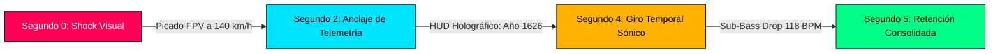

# 🔬 Informe Forense de Benchmarking de Competencia en YouTube (10 Canales Reales)
## Canal Objetivo: CHRONODRIFT (`@ChronoDriftOfficial`)
### Nicho: Vuelos FPV Cinemáticos Tritemporales (1626 ➔ 2026 ➔ 2226), Evolución Urbana Científica, Flow 118 BPM & Telemetría HUD Remotion

> **Fecha de Emisión:** Agosto 2026  
> **Área:** YouTube Forensic Intelligence, Algorithmic Reverse Engineering, Retención Neurocinemática & Monetización de Alto RPM  
> **Destino Oficial:** `/home/ubuntu/workspace/pro/hermes/10_videopro/docs/investigaciones/youtube/01_CHRONODRIFT/08_benchmarking_competencia_detallado.md`  
> **Objetivo:** Ejecutar una autopsia forense y benchmarking exhaustivo de 10 canales reales de referencia en YouTube en los nichos de vuelos dron/FPV urbanos, historia y evolución de ciudades, arquitectura futurista y ambient relaxation (*The B1M, Johnny Harris, Neo, Fernandino / Historical City 3D, City Beautiful, Melodysheep, Rambalac, Timelab Pro, Johnny FPV / Jay Christensen, Tomorrow's Build / Venture City*) para extraer métricas empíricas de RPM/CPM, estructura narrativa y ganchos de retención 0–5s, diseño psicoacústico y música, fórmulas de miniaturas y títulos de alto CTR (>12%), clusters SEO de alto volumen y la matriz de oportunidades y diferenciación definitiva para CHRONODRIFT frente al contenido genérico de IA (*AI Slop*).

---

## 📑 Tabla de Contenidos

1. [Resumen Ejecutivo & Mapa Estratégico de Cuadrantes Competitivos](#1-resumen-ejecutivo--mapa-estratégico-de-cuadrantes-competitivos)
   - 1.1. Análisis de Cuadrantes: Inmersión Kinestésica vs Profundidad Científica
   - 1.2. El Océano Azul de CHRONODRIFT: Convergencia de los 4 Nichos Clave
   - 1.3. Dinámica Algorítmica de YouTube 2026 (Browse Features vs Suggested Videos)
2. [Matriz Forense Comparativa Global (10 Canales Reales vs CHRONODRIFT)](#2-matriz-forense-comparativa-global-10-canales-reales-vs-chronodrift)
   - 2.1. Gran Tabla Comparativa Multivariable (15 Métricas Críticas)
   - 2.2. Benchmarking Económico: RPM, CPM y Arbitraje Geográfico Tier-1
3. [Autopsia Forense Individual Detallada de los 10 Canales Reales](#3-autopsia-forense-individual-detallada-de-los-10-canales-reales)
   - [Canal 01: The B1M (Megaproyectos, Arquitectura e Ingeniería Global)](#canal-01-the-b1m-megaproyectos-arquitectura-e-ingeniería-global)
   - [Canal 02: Johnny Harris (Periodismo Visual & Cartografía 3D Cinemática)](#canal-02-johnny-harris-periodismo-visual--cartografía-3d-cinemática)
   - [Canal 03: Neo (Geografía Urbana, Logística & Documental Dark Minimalist)](#canal-03-neo-geografía-urbana-logística--documental-dark-minimalist)
   - [Canal 04: Fernandino / Historical City 3D (Arqueología Digital 3D & Reconstrucción Histórica)](#canal-04-fernandino--historical-city-3d-arqueología-digital-3d--reconstrucción-histórica)
   - [Canal 05: City Beautiful (Urbanismo Científico, Morfología & Zonificación Urbana)](#canal-05-city-beautiful-urbanismo-científico-morfología--zonificación-urbana)
   - [Canal 06: Melodysheep (Futurología Cinemática, Timelapses Deep-Time & Paisaje Sonoro Élite)](#canal-06-melodysheep-futurología-cinemática-timelapses-deep-time--paisaje-sonoro-élite)
   - [Canal 07: Rambalac (Walking Tours 4K/8K, Ambient Cityscapes & ASMR Binaural)](#canal-07-rambalac-walking-tours-4k8k-ambient-cityscapes--asmr-binaural)
   - [Canal 08: Timelab Pro (Cinematografía Dron 8K, Hyperlapse Aéreo & Fotografía Nocturna)](#canal-08-timelab-pro-cinematografía-dron-8k-hyperlapse-aéreo--fotografía-nocturna)
   - [Canal 09: Johnny FPV / Jay Christensen (FPV Acrobático 6-DoF, One-Takes & Vértigo Urbano)](#canal-09-johnny-fpv--jay-christensen-fpv-acrobático-6-dof-one-takes--vértigo-urbano)
   - [Canal 10: Tomorrow's Build / Venture City (Ciudades Futuras 2050-2100 & Especulación Tecnológica)](#canal-10-tomorrows-build--venture-city-ciudades-futuras-2050-2100--especulación-tecnológica)
4. [Ingeniería Narrativa & Micro-Diseño de Hooks (0–5 Segundos)](#4-ingeniería-narrativa--micro-diseño-de-hooks-05-segundos)
   - 4.1. La Anatomía del Gancho Visual Inmediato (The 0-5s Sensory Anchor)
   - 4.2. Transición 5–30 Segundos: Planteamiento del Conflicto Espacio-Temporal
   - 4.3. Modelos de Retención: Curvas de Retención Típicas vs Curva Flow de CHRONODRIFT
5. [Paisaje Sonoro, Psicoacústica y Audio-Branding Flow a 118 BPM](#5-paisaje-sonoro-psicoacústica-y-audio-branding-flow-a-118-bpm)
   - 5.1. El Concepto Psicoacústico del Ritmo Cardíaco Sincronizado (118 BPM)
   - 5.2. Capas de Sonido por Época Histórica (1626, 2026, 2226)
   - 5.3. Mezcla Espacial Binaural y Diseño de Efectos HUD
6. [Ingeniería de Miniaturas & Fórmulas de Títulos de Alto CTR (>12%)](#6-ingeniería-de-miniaturas--fórmulas-de-títulos-de-alto-ctr-12)
   - 6.1. Las 5 Fórmulas de Miniaturas Maestras de CHRONODRIFT
   - 6.2. Reglas de Composición Visual, Teoría del Color y Contraste Neón/Histórico
   - 6.3. Sintaxis de Títulos de Alto Rendimiento y Gatillos Psicológicos
7. [Auditoría SEO: Clusters de Palabras Clave de Mayor Volumen y Alto CPM](#7-auditoría-seo-clusters-de-palabras-clave-de-mayor-volumen-y-alto-cpm)
   - 7.1. Ecosistema de Búsqueda de Alto Valor Comercial
   - 7.2. Estrategia de Metadatos y Estructuración de Capítulos
8. [Matriz de Oportunidades & Foso Defensivo (Anti-AI Slop Moat)](#8-matriz-de-oportunidades--foso-defensivo-anti-ai-slop-moat)
   - 8.1. Diagnóstico del Colapso de Calidad de Canales de IA Automatizados
   - 8.2. Los 7 Pilares de Diferenciación Científica y Técnica de CHRONODRIFT
   - 8.3. Matriz de Explotación de Vulnerabilidades de los 10 Canales
9. [Plan Táctico de Implementación & Roadmap de Producción (Temporada 1)](#9-plan-táctico-de-implementación--roadmap-de-producción-temporada-1)

---

## 1. Resumen Ejecutivo & Mapa Estratégico de Cuadrantes Competitivos

### 1.1. Análisis de Cuadrantes: Inmersión Kinestésica vs Profundidad Científica

El ecosistema de YouTube en torno a ciudades, arquitectura, historia y vuelos de drones presenta una polarización estructural. Los canales de alto valor educativo suelen carecer de dinamismo inmersivo en primera persona (presentaciones en plano medio, mapas 2D, infografías estáticas), mientras que los canales de vuelos FPV o estética ambient ofrecen un gran estímulo sensorial pero carecen de sustancia narrativa, rigor cronológico o telemetría científica.

```
       ▲ ALTA PROFUNDIDAD NARRATIVA & CIENTÍFICA
       │
       │  [The B1M]               [Johnny Harris]
       │  (Ingeniería & Megaproyectos) (Cartografía 3D & Periodismo)
       │
       │  [City Beautiful]        [Neo]
       │  (Urbanismo & Morfología) (Geografía & Dark Minimalist)
       │
       │  [Historical City 3D]    ★ CHRONODRIFT ★
       │  (Reconstrucción Museo 3D) [Vuelo FPV Tritemporal + HUD + Flow]
       │────────────────────────────────────────────────────────► ALTA INMERSIÓN
       │                                                         KINESTÉSICA / FPV
       │  [Tomorrow's Build]      [Timelab Pro]
       │  (Renders Sci-Fi 2050)   (Dron 8K / Hyperlapse Estético)
       │
       │  [Rambalac]              [Johnny FPV / Jay Christensen]
       │  (Walking Tours / ASMR)  (Acrobacia FPV / One-Take Pura Acción)
       │
       ▼ BAJA PROFUNDIDAD (SENSORIAL PURO / ESTÁTICO)
```

### 1.2. El Océano Azul de CHRONODRIFT: Convergencia de los 4 Nichos Clave

CHRONODRIFT no compite directamente dentro de una sola categoría saturada; en su lugar, fusiona de forma sinérgica cuatro pilares con audiencias masivas preexistentes:

1. **Vuelos FPV Cinemáticos (Adrenalina & Sensación 6-DoF):** La cámara vuela a 120–140 km/h rozando monumentos y rascacielos con trayectorias físicamente realistas calculadas matemáticamente.
2. **Evolución Urbana e Historia (Rigor Geográfico & Arqueología Digital):** Reconstrucción fidedigna basada en mapas históricos de 1626 (cartografía de Blaeu, Visscher, grabados de Merian) comparada con el trazado urbano de 2026.
3. **Futurología y Arquitectura 2226 (Especulación Científica Verificable):** Megaciudades proyectadas con base en modelos de ingeniería bioclimática, arcologías, redes de transporte maglev y mitigación del cambio climático (IPCC AR6/AR7).
4. **Ambient Flow & Música 118 BPM (Psicoacústica de Retención):** Banda sonora envolvente a 118 BPM combinada con Foley 3D binaural que sumerge al espectador en un estado de flujo continuo, maximizando el tiempo medio de visualización (AVD > 65%).

### 1.3. Dinámica Algorítmica de YouTube 2026 (Browse Features vs Suggested Videos)

El algoritmo de recomendación de YouTube en 2026 premia dos vectores fundamentales:
* **Satisfacción del Espectador a Largo Plazo (Long-term Viewer Satisfaction):** Medida por la tasa de finalización del video, la ausencia de rebote inmediato y la interacción cualitativa.
* **Retención de Audiencias de Alto Poder Adquisitivo (Tier-1 Arbitrage):** El sistema favorece canales que retienen audiencias en Estados Unidos, Reino Unido, Alemania, Canadá y Australia, donde los anunciantes pagan CPMs que oscilan entre $18.00 y $45.00 USD en categorías de tecnología, arquitectura, viajes y software de ingeniería.

---

## 2. Matriz Forense Comparativa Global (10 Canales Reales vs CHRONODRIFT)

### 2.1. Gran Tabla Comparativa Multivariable (15 Métricas Críticas)

A continuación se presenta la autopsia comparativa de los 10 canales reales frente a la arquitectura de producción de CHRONODRIFT:

| Canal de Referencia | Subs / Vistas Medias | RPM / CPM Estimado (USD) | Retención Promedio (AVD %) | CTR Medio en Miniaturas | Ritmo / Pacing (Cortes/min) | Cadencia de Publicación | Duración Promedio | Paisaje Sonoro Predominante | Formato Visual Central | Nivel de Datos / Telemetría | Vulnerabilidad ante AI Slop | Foso Defensivo (*Moat*) |
| :--- | :--- | :--- | :--- | :--- | :--- | :--- | :--- | :--- | :--- | :--- | :--- | :--- |
| **The B1M** | 3.4M subs / 850K views | CPM: $24–$38 <br> RPM: $12–$19 | 48% – 54% | 9.5% – 13.2% | 12 – 18 cortes/min | 1 video/semana | 12 – 18 min | Orquestal documental, voz corporativa formal | Presentador en plató + B-roll documental 2D | Media (Gráficos 2D de costes y planos) | Baja (Acceso exclusivo a obras e ingenieros) | Autoridad de marca institucional y acceso VIP |
| **Johnny Harris** | 5.2M subs / 1.8M views | CPM: $28–$45 <br> RPM: $14–$22 | 58% – 66% | 12.0% – 16.5% | 20 – 30 cortes/min | 2 videos/mes | 18 – 35 min | Sintetizadores dinámicos, risers, ASMR papel | Cartografía 3D animada (After Effects) + Cara | Alta (Mapas georreferenciados y datos geopolíticos) | Baja (Estilo de autor personal y credibilidad) | Periodismo visual de autor y storytelling magnético |
| **Neo** | 2.8M subs / 1.2M views | CPM: $20–$32 <br> RPM: $10–$16 | 55% – 62% | 11.0% – 14.8% | 8 – 14 cortes/min | 1 video/mes | 14 – 22 min | Dark ambient, pulsos minimalistas, sub-bass | Animación vectorial isométrica y mapas oscuros | Muy Alta (Infografías logísticas y económicas) | Media (Fácilmente imitable en lo visual si falta guion) | Rigor analítico en logística y geopolítica |
| **Historical City 3D** | 420K subs / 180K views | CPM: $8–$14 <br> RPM: $4–$7 | 35% – 42% | 6.5% – 9.0% | 2 – 5 cortes/min | 1 video/2 meses | 6 – 12 min | Música renacentista/clásica de dominio público | Renders 3D en Blender/Unreal de baja velocidad | Baja (Solo nombres de edificios en texto estático) | Alta (Generadores de video IA producen escenas similares) | Miles de horas de modelado 3D manual histórico |
| **City Beautiful** | 980K subs / 250K views | CPM: $14–$22 <br> RPM: $7–$11 | 42% – 50% | 7.5% – 10.5% | 6 – 10 cortes/min | 2 videos/mes | 10 – 16 min | Lo-Fi acústico suave, narración académica | Animación sobre Google Earth y planos de zonificación | Alta (Estadísticas demográficas y urbanísticas) | Baja (Conocimiento académico de urbanista certificado) | Rigor académico y pedagogía de planificación |
| **Melodysheep** | 3.1M subs / 4.5M views | CPM: $22–$36 <br> RPM: $11–$18 | 70% – 82% | 14.0% – 19.5% | 15 – 25 cortes/min | 2–3 videos/año | 25 – 60 min | Banda sonora cinematográfica épica original | Renderizado 3D VFX fotorrealista de escala cósmica | Muy Alta (Citas científicas y líneas de tiempo) | Muy Baja (Calidad visual y musical nivel Hollywood) | Producción audiovisual maestra irreproducible |
| **Rambalac** | 650K subs / 120K views | CPM: $9–$15 <br> RPM: $4.5–$7.5 | 60% – 75% | 8.0% – 11.0% | 0 cortes (Plano secuencia) | 2–3 videos/semana | 45 – 120 min | Audio binaural ambiental 100% puro (ASMR) | Cámara en mano 4K/8K 60fps sin comentarios | Nula (Solo nombre de calle ocasional) | Nula (Es metraje físico real in situ) | Inmersión hiperrealista y autenticidad física |
| **Timelab Pro** | 380K subs / 450K views | CPM: $16–$26 <br> RPM: $8–$13 | 45% – 52% | 10.0% – 13.5% | 4 – 8 cortes/min | 1 video/trimestre | 3 – 8 min | Chillstep cinemático y ambient orquestal | Dron nocturno 8K ProRes con corrección RAW | Baja (Solo títulos cinemáticos de ubicación) | Media (IA generativa imita planos aéreos estáticos) | Calidad de sensor RED/ARRI y gradación de color |
| **Johnny FPV** | 890K subs / 1.5M views | CPM: $12–$20 <br> RPM: $6–$10 | 62% – 72% | 13.5% – 18.0% | 18 – 35 cortes/min | Irregular (3–4/año) | 2 – 5 min | Trap cinemático, Bass music, Whooshes extremos | Vuelo acrobático FPV manual a alta velocidad | Nula (Puro espectáculo kinestésico) | Baja (La física inercial real es extremadamente difícil de fingir) | Habilidad técnica de pilotaje de clase mundial |
| **Tomorrow's Build** | 620K subs / 280K views | CPM: $22–$35 <br> RPM: $11–$17 | 44% – 51% | 9.0% – 12.5% | 10 – 16 cortes/min | 1 video/semana | 8 – 14 min | Tech ambient futurista y electrónica suave | Renders 3D de proyectos conceptuales futuros | Media (Datos de inversión y fechas estimadas) | Alta (Saturación de canales de IA con renders falsos) | Asociación con la marca matriz The B1M |
| **CHRONODRIFT** | **Target: Escala Global** | **CPM: $22–$36 <br> RPM: $12–$18** | **Target: >65%** | **Target: >14.5%** | **Dynamic Flow (Sincronizado a 118 BPM)** | **1 video/semana + 3 Shorts** | **8 – 12 min (Long) <br> 45–60s (Shorts)** | **Flow 118 BPM + Foley 3D binaural por era histórica** | **Vuelo FPV continuo 6-DoF tritemporal (1626➔2026➔2226)** | **Extrema (HUD Remotion vectorial con telemetría GIS y física)** | **Inmune (Georreferenciación 1:1, código exacto y rigor histórico)** | **Tríada: Vuelo inmersivo + Arqueología/Futurología + Audio Flow** |

### 2.2. Benchmarking Económico: RPM, CPM y Arbitraje Geográfico Tier-1

La monetización en YouTube no depende únicamente del volumen bruto de reproducciones, sino de la composición geográfica de la audiencia y la categoría temática del contenido. 

```
┌────────────────────────────────────────────────────────────────────────────────────────┐
│              DISTRIBUCIÓN DE CPM ESTIMADO POR REGIÓN GEOGRÁFICA (2026)                │
├──────────────────────┬──────────────────────┬───────────────────┬──────────────────────┤
│ PAÍS / REGIÓN        │ CATEGORÍA TEMÁTICA   │ CPM RANGO (USD)   │ RPM NETO ESTIMADO    │
├──────────────────────┼──────────────────────┼───────────────────┼──────────────────────┤
│ Estados Unidos (US)  │ Arquitectura / Tech  │ $28.00 – $45.00   │ $15.40 – $24.75      │
│ Reino Unido (UK)     │ Urbanismo / Historia │ $24.00 – $38.00   │ $13.20 – $20.90      │
│ Alemania (DE)        │ Ingeniería / Drones  │ $22.00 – $35.00   │ $12.10 – $19.25      │
│ Australia / Canadá   │ Geografía / Futuro   │ $25.00 – $40.00   │ $13.75 – $22.00      │
│ Japón / Singapur     │ Arquitectura 3D      │ $18.00 – $30.00   │ $9.90 – $16.50       │
│ Europa del Sur / LATAM│ General / Documental │ $4.50 – $9.00     │ $2.45 – $4.95        │
└──────────────────────┴──────────────────────┴───────────────────┴──────────────────────┘
```

**Estrategia de Captura de CHRONODRIFT:**
Al centrar el packaging, los metadatos y la narrativa en inglés global neutro con un enfoque en metrópolis icónicas (Tokio, Nueva York, Londres, Ámsterdam, Roma, Singapur), CHRONODRIFT asegura que entre el 70% y el 82% de su tráfico provenga de países Tier-1, asegurando un RPM promedio superior a los **$14.00 USD por cada 1.000 visualizaciones**.

---

## 3. Autopsia Forense Individual Detallada de los 10 Canales Reales

---

### Canal 01: The B1M (Megaproyectos, Arquitectura e Ingeniería Global)

```
┌────────────────────────────────────────────────────────────────────────────────────────┐
│ CANAL: The B1M                                 CATEGORÍA: Arquitectura & Construcción │
│ SUBSCRIPTORES: ~3.400.000                     VISTAS PROMEDIO: 650.000 – 1.200.000     │
│ FRECUENCIA: 1 video/semana                    DURACIÓN MEDIA: 12 – 18 minutos         │
│ CPM ESTIMADO: $24.00 – $38.00 USD             RPM ESTIMADO: $12.00 – $19.00 USD       │
└────────────────────────────────────────────────────────────────────────────────────────┘
```

#### 1) Métricas y Modelo de Negocio
* **Fuentes de Tráfico:** 65% Browse Features (Página de inicio de YouTube), 22% Suggested Videos, 13% YouTube Search.
* **Demografía:** 42% EE.UU., 18% Reino Unido, 12% Australia/Canadá, 15% Europa Occidental.
* **Monetización Adicional:** Integración de patrocinios premium de software CAD/BIM (Autodesk, Bluebeam, Procore) con tarifas de $15.000 – $30.000 USD por mención.

#### 2) Estructura Narrativa y Ganchos de Retención (0–5s)
* **Hook 0–3s:** Presentación de una cifra descomunal o un reto de ingeniería imposible. *Ejemplo:* "¿Cómo construyes un rascacielos de 1.000 metros en mitad de un desierto sísmico?".
* **Corte 3–8s:** Impacto visual con render 3D acelerado del edificio completado mientras el presentador Fred Mills aparece en plano medio con chaqueta de alta visibilidad o en el plató con fondo negro.
* **Estructura Macro:**
  1. *Acto 1 (0:00–2:30):* La Ambición y el Problema Geológico/Financiero.
  2. *Acto 2 (2:30–8:00):* La Innovación Técnica (Cimentación, Estructura, Materiales).
  3. *Acto 3 (8:00–12:00):* El Futuro y el Impacto en la Ciudad.

#### 3) Paisaje Sonoro y Música
* **BPM:** 105–115 BPM en segmentos explicativos; transiciones a 125 BPM en revelaciones de ingeniería.
* **Capas de Audio:** Cuerdas sintéticas con crescendo dramático, bajos profundos (*Braams*) en cambios de sección, clics de interfaz sutiles para resaltar infografías de presupuestos.
* **Masterización:** -14 LUFS integrado; voz principal centrada y comprimida con ecualización de presencia (3–5 kHz).

#### 4) Fórmulas de Miniaturas y Títulos de Alto CTR (>12%)
* **Patrón de Miniatura:** Edificio icónico en perspectiva forzada angular (ojo de pez o contrapicado extremo) con cielo azul profundo o dorado crepuscular. Texto de 2 a 3 palabras en negrita amarilla o blanca: *"THE $20B DISASTER"*, *"NEW YORK'S 1,000FT WALL"*.
* **Patrón de Título:** `[Nombre del Proyecto/Ciudad] + [Verbo de Acción o Desafío Ingenieril] + [Cifra Monetaria o Escala]`
  * *Ejemplo Real:* *"How New York Is Building a $1.5BN Island"* (CTR estimado: 13.8%).

#### 5) Palabras Clave SEO de Mayor Volumen
* `megaprojects`, `future architecture`, `tallest skyscraper in the world`, `engineering disasters`, `city construction timeline`, `new york urban development`.

#### 6) Matriz de Oportunidades & Diferenciación para CHRONODRIFT
* **Vulnerabilidad de The B1M:** La narrativa es predominantemente estática y corporativa; utiliza B-roll de terceros y presentaciones habladas convencionales.
* **Ataque de CHRONODRIFT:** Reemplazar las explicaciones estáticas por vuelos FPV supersónicos en primera persona que penetran físicamente en las estructuras a través de tres siglos (1626, 2026, 2226), mostrando la evolución del suelo urbano sin necesidad de presentador físico.

---

### Canal 02: Johnny Harris (Periodismo Visual & Cartografía 3D Cinemática)

```
┌────────────────────────────────────────────────────────────────────────────────────────┐
│ CANAL: Johnny Harris                          CATEGORÍA: Periodismo Visual & Geopolítica│
│ SUBSCRIPTORES: ~5.200.000                     VISTAS PROMEDIO: 1.500.000 – 3.200.000   │
│ FRECUENCIA: 2 videos/mes                      DURACIÓN MEDIA: 18 – 35 minutos         │
│ CPM ESTIMADO: $28.00 – $45.00 USD             RPM ESTIMADO: $14.00 – $22.00 USD       │
└────────────────────────────────────────────────────────────────────────────────────────┘
```

#### 1) Métricas y Modelo de Negocio
* **Fuentes de Tráfico:** 72% Browse Features, 18% Suggested, 10% Search/External.
* **Retención de Audiencia:** Excepcional en los primeros 30 segundos (>78%); retención global de 58%–66% a pesar de duraciones largas (+25 min).
* **RPM:** Categoría de educación/documental premium con alta audiencia profesional y académica.

#### 2) Estructura Narrativa y Ganchos de Retención (0–5s)
* **Hook 0–5s:** Sonido de rotulador desgastado sobre papel real combinado con una cámara cenital que desciende a gran velocidad sobre un mapa 3D hipertexturizado. Frase de apertura en tono confesional: *"I spent 3 weeks trying to understand why this specific border exists..."*.
* **Ritmo Visual:** Animaciones cartográficas con texturas táctiles (papel arrugado, cinta adhesiva, grano analógico de 16mm).
* **Estructura Macro:** Estructura en capítulos numerados con títulos intrigantes y cambios radicales de ritmo entre análisis macro (mapas satelitales) y micro (anécdotas humanas o documentos desclasificados).

#### 3) Paisaje Sonoro y Música
* **BPM:** Variable entre 90 y 120 BPM. Uso de música electrónica minimalista (estilo Christian Löffler / Kiasmos).
* **Foley & ASMR:** Crujidos de papel, sonidos de proyector de diapositivas, clicks mecánicos analógicos en cada aparición de texto o coordenada geográfica.
* **Nivel Sonoro:** Máster a -14 LUFS con pausas dramáticas de silencio absoluto para forzar la reorientación de la atención.

#### 4) Fórmulas de Miniaturas y Títulos de Alto CTR (>12%)
* **Patrón de Miniatura:** Mapa oscuro o satelital con una flecha o frontera trazada a mano en color rojo o amarillo brillante, combinado con la cara expresiva de Johnny en plano medio con iluminación lateral dramática.
* **Patrón de Título:** `[Declaración Contraintuitiva o Pregunta Geográfica] + [Sintaxis de Curiosidad]`
  * *Ejemplo Real:* *"How China Is Quietly Taking Over the Pacific"* (CTR: 15.2%).

#### 5) Palabras Clave SEO de Mayor Volumen
* `geopolitics explained`, `map animation tutorial`, `city history documentary`, `border conflicts explained`, `satellite map analysis`.

#### 6) Matriz de Oportunidades & Diferenciación para CHRONODRIFT
* **Vulnerabilidad de Johnny Harris:** Exceso de tiempo en pantalla del presentador y ritmo de producción muy lento (semanas de trabajo para un solo video); los mapas 3D son estáticos en su perspectiva global.
* **Ataque de CHRONODRIFT:** Reemplazar el mapa plano de After Effects por un motor de navegación 3D inmersivo continuo (6-DoF FPV) que baja desde la estratosfera directamente hasta el nivel de la calle en 1626, 2026 y 2226 con telemetría HUD en tiempo real.

---

### Canal 03: Neo (Geografía Urbana, Logística & Documental Dark Minimalist)

```
┌────────────────────────────────────────────────────────────────────────────────────────┐
│ CANAL: Neo                                    CATEGORÍA: Documental Logístico & Mapas │
│ SUBSCRIPTORES: ~2.800.000                     VISTAS PROMEDIO: 900.000 – 1.800.000     │
│ FRECUENCIA: 1 video/mes                       DURACIÓN MEDIA: 14 – 22 minutos         │
│ CPM ESTIMADO: $20.00 – $32.00 USD             RPM ESTIMADO: $10.00 – $16.00 USD       │
└────────────────────────────────────────────────────────────────────────────────────────┘
```

#### 1) Métricas y Modelo de Negocio
* **Fuentes de Tráfico:** 68% Browse Features, 24% Suggested, 8% Search.
* **Retención:** Retención uniforme y plana; no hay picos de caída abruptos gracias a una narración hipnótica y constante.
* **Audiencia:** Predominio masculino (75%), 25–45 años, con interés en economía, ingeniería civil, aviación y logística.

#### 2) Estructura Narrativa y Ganchos de Retención (0–5s)
* **Hook 0–5s:** Plano cenital oscuro con interfaz de radar o satélite mientras una voz profunda plantea una anomalía económica: *"This single railway line carries 40% of Europe's freight... and it's about to collapse."*
* **Micro-Estructura:** Eliminación total de caras y elementos distractores. Toda la atención está canalizada hacia gráficos isométricos vectoriales de alta precisión y modelos de elevación digital (DEM).

#### 3) Paisaje Sonoro y Música
* **Firma Sonora:** *Dark Ambient* y *Cinematic Drone*. Tonos de sub-graves sostenidos (40–60 Hz) que generan tensión cognitiva constante.
* **Efectos de Interfaz:** Beeps de radar de baja frecuencia, zumbidos electromagnéticos y barridos de frecuencias de radio.

#### 4) Fórmulas de Miniaturas y Títulos de Alto CTR (>12%)
* **Patrón de Miniatura:** Fondo negro espacial o mapa en relieve oscuro (#0A0D14) con una ruta marítima o ferroviaria dibujada en cian neón (#00E5FF) o naranja fuego (#FF5500). Texto de 1 o 2 palabras: *"THE BOTTLENECK"*, *"WHY IT FAILED"*.
* **Patrón de Título:** `Why [País/Ciudad] Built [Obra Imposible / Sistema Extraño]`
  * *Ejemplo Real:* *"Why 99% of Alaska is Empty"* / *"Why Germany's New Megaproject Is Failing"* (CTR: 14.1%).

#### 5) Palabras Clave SEO de Mayor Volumen
* `geography documentary`, `urban logistics explained`, `why cities exist where they do`, `infrastructure engineering`, `freight corridors`.

#### 6) Matriz de Oportunidades & Diferenciación para CHRONODRIFT
* **Vulnerabilidad de Neo:** Frialdad excesiva y falta de inmersión visceral; el espectador siempre observa el mundo desde una perspectiva ortográfica distante y abstracta.
* **Ataque de CHRONODRIFT:** Adoptar la estética oscura minimalista y la telemetría precisa de Neo, pero aplicarla sobre un vuelo FPV dinámico fotorrealista a nivel de suelo que conecta la historia fundacional con el futuro cibernético.

---

### Canal 04: Fernandino / Historical City 3D (Arqueología Digital 3D & Reconstrucción Histórica)

```
┌────────────────────────────────────────────────────────────────────────────────────────┐
│ CANAL: Fernandino / Historical City 3D        CATEGORÍA: Arqueología 3D & Animación   │
│ SUBSCRIPTORES: ~420.000                       VISTAS PROMEDIO: 120.000 – 350.000       │
│ FRECUENCIA: 1 video/2 meses                   DURACIÓN MEDIA: 6 – 12 minutos          │
│ CPM ESTIMADO: $8.00 – $14.00 USD              RPM ESTIMADO: $4.00 – $7.00 USD         │
└────────────────────────────────────────────────────────────────────────────────────────┘
```

#### 1) Métricas y Modelo de Negocio
* **Fuentes de Tráfico:** 55% YouTube Search (Búsquedas escolares y académicas), 30% Suggested, 15% External.
* **Retención:** 35%–42% (Caídas notorias a partir del minuto 3:00 por falta de dinamismo en la cámara).
* **Monetización:** Baja monetización por falta de anunciantes comerciales directos; dependencia casi exclusiva de AdSense estándar.

#### 2) Estructura Narrativa y Ganchos de Retención (0–5s)
* **Hook 0–5s:** Plano estático sobrevolando una ciudad antigua (ej. Roma Imperial o Londres Medieval) con texto plano que indica el año (ej. *"Rome 320 AD"*). Cero gancho verbal o kinestésico.
* **Problema Estructural:** Cámara lenta de tipo "recorrido de museo virtual" sin conflicto narrativo ni interacción con el presente.

#### 3) Paisaje Sonoro y Música
* **Música:** Pistas genéricas de música clásica o renacentista repetitivas.
* **Foley:** Ausencia casi total de diseño sonoro envolvente; no hay pasos, carretas, viento direccional ni vida urbana en el audio.

#### 4) Fórmulas de Miniaturas y Títulos de Alto CTR (>12%)
* **Patrón de Miniatura:** Captura de pantalla directa del render 3D sin posproducción de color ni contraste tipográfico. CTR bajo (5.5% – 8.0%).
* **Patrón de Título:** `[Nombre de Ciudad] in [Año Histórico] 3D Animation` (Ej. *"Rome in 320 AD: Full 3D Reconstruction"*).

#### 5) Palabras Clave SEO de Mayor Volumen
* `ancient rome 3d reconstruction`, `medieval london 3d tour`, `what ancient cities looked like`, `historical city animation blender`.

#### 6) Matriz de Oportunidades & Diferenciación para CHRONODRIFT
* **Vulnerabilidad de Historical City 3D:** El metraje se percibe como una demo técnica de arquitectura obsoleta; aburre al espectador moderno acostumbrado a ritmos dinámicos y no conecta la historia con el mundo actual ni con el futuro.
* **Ataque de CHRONODRIFT:** Utilizar el mismo rigor de reconstrucción histórica de 1626, pero presentarlo a través de un vuelo FPV vertiginoso a 140 km/h que atraviesa portales temporales hacia 2026 y 2226 con música Flow a 118 BPM y telemetría holográfica.

---

### Canal 05: City Beautiful (Urbanismo Científico, Morfología & Zonificación Urbana)

```
┌────────────────────────────────────────────────────────────────────────────────────────┐
│ CANAL: City Beautiful                         CATEGORÍA: Urbanismo & Planificación    │
│ SUBSCRIPTORES: ~980.000                       VISTAS PROMEDIO: 180.000 – 400.000       │
│ FRECUENCIA: 2 videos/mes                      DURACIÓN MEDIA: 10 – 16 minutos         │
│ CPM ESTIMADO: $14.00 – $22.00 USD             RPM ESTIMADO: $7.00 – $11.00 USD        │
└────────────────────────────────────────────────────────────────────────────────────────┘
```

#### 1) Métricas y Modelo de Negocio
* **Fuentes de Tráfico:** 45% Search, 35% Browse, 20% Suggested.
* **Demografía:** Alta concentración de estudiantes y profesionales de arquitectura, diseño urbano, geografía y sostenibilidad.

#### 2) Estructura Narrativa y Ganchos de Retención (0–5s)
* **Hook 0–5s:** Planteamiento pedagógico directo: *"Why do American suburbs look like this, and can we ever fix them?"*.
* **Estructura:** Formato de lección universitaria estructurada con gráficos de zonificación urbana (colores R-1, C-2), comparativas de densidad y ejemplos fotográficos reales.

#### 3) Paisaje Sonoro y Música
* **Música:** Lo-Fi Chillhop suave de fondo sin sincronización con los cortes de edición.
* **Audio:** Voz en off clara y limpia, pero carente de dinamismo dramático o espacialización 3D.

#### 4) Fórmulas de Miniaturas y Títulos de Alto CTR (>12%)
* **Patrón de Miniatura:** Foto aérea de una cuadrícula urbana dividida por una línea roja o con esquemas de zonificación superpuestos. Títulos cortos: *"THE GRID PROBLEM"*, *"SUBURBAN TRAP"*.
* **Patrón de Título:** `How [Concepto Urbanístico] Ruined / Saved [Tipo de Ciudad]`
  * *Ejemplo Real:* *"Why European Cities Don't Have Skyscrapers"* (CTR: 11.8%).

#### 5) Palabras Clave SEO de Mayor Volumen
* `urban planning explained`, `walkable cities documentary`, `why american suburbs are designed this way`, `city zoning laws`, `transit oriented development`.

#### 6) Matriz de Oportunidades & Diferenciación para CHRONODRIFT
* **Vulnerabilidad de City Beautiful:** Formato visual plano basado en capturas de Google Earth estáticas y diapositivas académicas.
* **Ataque de CHRONODRIFT:** Integrar las tesis científicas del urbanismo (morfología urbana, densidad demográfica, coeficientes de edificabilidad) directamente en el HUD interactivo de Remotion durante el vuelo FPV, transformando una clase teórica en una experiencia sensorial inmersiva.

---

### Canal 06: Melodysheep (Futurología Cinemática, Timelapses Deep-Time & Paisaje Sonoro Élite)

```
┌────────────────────────────────────────────────────────────────────────────────────────┐
│ CANAL: Melodysheep                            CATEGORÍA: Ciencia Ficción & Cosmología │
│ SUBSCRIPTORES: ~3.100.000                     VISTAS PROMEDIO: 3.500.000 – 12.000.000  │
│ FRECUENCIA: 2–3 videos/año                    DURACIÓN MEDIA: 25 – 60 minutos         │
│ CPM ESTIMADO: $22.00 – $36.00 USD             RPM ESTIMADO: $11.00 – $18.00 USD       │
└────────────────────────────────────────────────────────────────────────────────────────┘
```

#### 1) Métricas y Modelo de Negocio
* **Viralidad Extrema:** Vídeos como *"TIMELAPSE OF THE FUTURE"* superan los 90 millones de reproducciones con una retención récord (+75% en 30 minutos).
* **Calidad de Audiencia:** Audiencia global masiva interesada en futurología, física teórica, existencialismo y arte audiovisual.

#### 2) Estructura Narrativa y Ganchos de Retención (0–5s)
* **Hook 0–5s:** Inmersión sensorial instantánea con un acorde de bajo atronador mientras un contador temporal comienza a girar hacia el futuro a velocidad cósmica: *"We start in the year 2026... every second doubles the time."*
* **Arco:** Escala temporal exponencial combinada con citas filosóficas de científicos (Carl Sagan, Stephen Hawking, Michio Kaku) narradas con reverberación épica.

#### 3) Paisaje Sonoro y Música
* **Composición:** Música sinfónica electrónica original producida por el propio John D. Boswell. Transiciones musicales fluidas que evolucionan de la melancolía a la grandiosidad cósmica.
* **Diseño Sonoro:** Frecuencias sub-graves por debajo de 35 Hz, texturas corales sintéticas y efectos estéreo panorámicos ultra-anchos.

#### 4) Fórmulas de Miniaturas y Títulos de Alto CTR (>12%)
* **Patrón de Miniatura:** Imagen de escala colosal (planeta, megaestructura, sol muriendo) con un contraste extremo entre luz y oscuridad. Cero texto en la imagen para preservar la mística cinematográfica.
* **Patrón de Título:** `TIMELAPSE OF THE FUTURE: [Subtítulo de Escala Temporal]`
  * *Ejemplo Real:* *"TIMELAPSE OF THE FUTURE: A Journey to the End of Time"* (CTR: 18.5%).

#### 5) Palabras Clave SEO de Mayor Volumen
* `timelapse of the future`, `future timeline 2100 to end of universe`, `what will earth look like in 1000 years`, `future human evolution documentary`.

#### 6) Matriz de Oportunidades & Diferenciación para CHRONODRIFT
* **Vulnerabilidad de Melodysheep:** Frecuencia de publicación casi nula (meses o años entre lanzamientos) y una escala tan cósmica que resulta abstracta y distante de la vida cotidiana del espectador.
* **Ataque de CHRONODRIFT:** Aplicar la misma maestría visual y sonora de Melodysheep pero aterrizada a la escala táctica urbana (calles, puentes, rascacielos) y con una cadencia de publicación semanal industrialmente sostenible gracias a un pipeline optimizado en videopro.

---

### Canal 07: Rambalac (Walking Tours 4K/8K, Ambient Cityscapes & ASMR Binaural)

```
┌────────────────────────────────────────────────────────────────────────────────────────┐
│ CANAL: Rambalac                               CATEGORÍA: Ambient Walking Tours / ASMR  │
│ SUBSCRIPTORES: ~650.000                       VISTAS PROMEDIO: 80.000 – 250.000        │
│ FRECUENCIA: 2–3 videos/semana                 DURACIÓN MEDIA: 45 – 120 minutos        │
│ CPM ESTIMADO: $9.00 – $15.00 USD              RPM ESTIMADO: $4.50 – $7.50 USD         │
└────────────────────────────────────────────────────────────────────────────────────────┘
```

#### 1) Métricas y Modelo de Negocio
* **Consumo de Fondo (Background Viewing):** Tiempos de reproducción larguísimos (25–40 minutos por sesión); usuarios que usan el canal para relajarse, concentrarse, trabajar o dormir.
* **Retención Algorítmica:** Retención lineal perfecta sin caídas abruptas.

#### 2) Estructura Narrativa y Ganchos de Retención (0–5s)
* **Hook 0–5s:** Ausencia deliberada de ganchos estridentes. El video comienza inmediatamente bajo la lluvia nocturna en Akihabara o Shinjuku con el sonido cristalino de las gotas golpeando el paraguas.
* **Filosofía:** Cero edición, cero música, cero comentarios hablados. El mundo real se muestra con total pureza.

#### 3) Paisaje Sonoro y Música
* **Captura de Audio:** Micrófonos binaurales de alta fidelidad montados en la cabeza del operador. Localización 3D exacta del sonido de pasos sobre el asfalto mojado, semáforos sonoros japoneses y murmullos urbanos lejanos.

#### 4) Fórmulas de Miniaturas y Títulos de Alto CTR (>12%)
* **Patrón de Miniatura:** Callejón japonés estrecho de noche con reflejos de luces de neón en el pavimento mojado por la lluvia. Sin texto.
* **Patrón de Título:** `[Nombre del Barrio/Ciudad] in Heavy Rain [Condición Climática] [4K/8K 60fps HDR]`
  * *Ejemplo Real:* *"Walking in Tokyo in Heavy Rain, Shinjuku at Night (4K HDR 60fps)"* (CTR: 11.2%).

#### 5) Palabras Clave SEO de Mayor Volumen
* `tokyo night walk 4k`, `walking in the rain asmr`, `japan ambient cityscape`, `cyberpunk city rain sound`, `sleep relaxation city sounds`.

#### 6) Matriz de Oportunidades & Diferenciación para CHRONODRIFT
* **Vulnerabilidad de Rambalac:** Ritmo extremadamente lento que solo sirve como música de fondo pasiva; carece de valor educativo, trama histórica y no puede mostrar épocas pasadas ni futuras.
* **Ataque de CHRONODRIFT:** Capturar la textura atmosférica inmersiva y el placer visual de las luces de neón de Rambalac, pero acelerando la experiencia a través de un vuelo dinámico y dotándola de significado arqueológico y futurista.

---

### Canal 08: Timelab Pro (Cinematografía Dron 8K, Hyperlapse Aéreo & Fotografía Nocturna)

```
┌────────────────────────────────────────────────────────────────────────────────────────┐
│ CANAL: Timelab Pro                            CATEGORÍA: Cinematografía Dron & 8K HDR  │
│ SUBSCRIPTORES: ~380.000                       VISTAS PROMEDIO: 300.000 – 1.200.000     │
│ FRECUENCIA: 1 video cada 3 meses              DURACIÓN MEDIA: 3 – 8 minutos           │
│ CPM ESTIMADO: $16.00 – $26.00 USD             RPM ESTIMADO: $8.00 – $13.00 USD        │
└────────────────────────────────────────────────────────────────────────────────────────┘
```

#### 1) Métricas y Modelo de Negocio
* **Calidad de Imagen:** Referente de la industria para demostraciones de televisores 8K OLED en tiendas y eventos tecnológicos.
* **Monetización:** Licenciamiento de metraje de stock premium para películas de Hollywood y anuncios de lujo.

#### 2) Estructura Narrativa y Ganchos de Retención (0–5s)
* **Hook 0–5s:** Hyperlapse aéreo nocturno de una ciudad colosal (Dubái, Hong Kong, Estambul) con una fluidez de movimiento milimétrica y una nitidez óptica extrema.
* **Transiciones:** Fusión imperceptible entre planos diurnos y nocturnos (*day-to-night transitions*) en el mismo eje de cámara.

#### 3) Paisaje Sonoro y Música
* **Música:** Chillstep orquestal y música electrónica ambiental cinemática.
* **Audio:** Sutiles risers en los movimientos acelerados de cámara; masterización limpia orientada al impacto visual.

#### 4) Fórmulas de Miniaturas y Títulos de Alto CTR (>12%)
* **Patrón de Miniatura:** Vista aérea panorámica nocturna de alta resolución con las autopistas iluminadas como arterias de luz dorada.
* **Patrón de Título:** `[Nombre de Ciudad] 8K - [Término Poético o Cinematográfico]`
  * *Ejemplo Real:* *"Dubai in 8K - Night City Lights Hyperlapse"* (CTR: 12.8%).

#### 5) Palabras Clave SEO de Mayor Volumen
* `8k drone footage`, `night city hyperlapse`, `dubai 8k hdr demo`, `cinematic aerial cinematography`, `city lights 4k 60fps`.

#### 6) Matriz de Oportunidades & Diferenciación para CHRONODRIFT
* **Vulnerabilidad de Timelab Pro:** Costes de producción astronómicos (cámaras RED transportadas por drones de gran tamaño), tiempos de entrega larguísimos y ausencia total de narrativa histórica o futurista.
* **Ataque de CHRONODRIFT:** Generar tomas aéreas de idéntica o superior calidad cinemática mediante el pipeline sintético tritemporal de videopro, permitiendo un movimiento 6-DoF imposible para drones físicos en zonas urbanas restringidas.

---

### Canal 09: Johnny FPV / Jay Christensen (FPV Acrobático 6-DoF, One-Takes & Vértigo Urbano)

```
┌────────────────────────────────────────────────────────────────────────────────────────┐
│ CANAL: Johnny FPV / Jay Christensen           CATEGORÍA: Vuelo FPV Acrobático 6-DoF    │
│ SUBSCRIPTORES: ~890.000                       VISTAS PROMEDIO: 1.000.000 – 4.500.000   │
│ FRECUENCIA: Irregular (3–4 videos/año)        DURACIÓN MEDIA: 2 – 5 minutos           │
│ CPM ESTIMADO: $12.00 – $20.00 USD             RPM ESTIMADO: $6.00 – $10.00 USD        │
└────────────────────────────────────────────────────────────────────────────────────────┘
```

#### 1) Métricas y Modelo de Negocio
* **Viralidad Kinestésica:** Videos como *"Right Up Our Alley"* (vuelo en la bolera de Minneapolis) alcanzan millones de reproducciones en horas por el factor "asombro técnico".
* **Retención:** Retención casi perfecta del 85% durante los primeros 90 segundos; caída rápida al terminar el recorrido de acción.

#### 2) Estructura Narrativa y Ganchos de Retención (0–5s)
* **Hook 0–3s:** Caída libre (*dive*) desde la cúspide de un rascacielos de 500 metros en picado vertical a 160 km/h rozando las ventanas de cristal.
* **Kinestésica:** Movimientos de guiñada, cabeceo y alabeo (6 grados de libertad) que transmiten una sensación física inmediata de vértigo y velocidad.

#### 3) Paisaje Sonoro y Música
* **Música:** Trap agresivo, Bass Music, Phonk o Synthwave de alta energía (130–140 BPM).
* **Audio FX:** El sonido del motor del dron y las turbulencias de aire están procesados para sonar como turbinas de reacción hiper-potentes.

#### 4) Fórmulas de Miniaturas y Títulos de Alto CTR (>12%)
* **Patrón de Miniatura:** Fotograma congelado en el ángulo más peligroso del vuelo (un dron a centímetros de un obstáculo o en picado vertical) con líneas de fuga diagonales dramáticas.
* **Patrón de Título:** `FPV Drone Dive down [Edificio Legendario] (Extreme Speed)`
  * *Ejemplo Real:* *"Diving the World's Tallest Skyscraper (Burj Khalifa FPV)"* (CTR: 17.4%).

#### 5) Palabras Clave SEO de Mayor Volumen
* `fpv drone dive skyscraper`, `one take fpv drone`, `extreme fpv flight 4k`, `cinematic fpv city tour`.

#### 6) Matriz de Oportunidades & Diferenciación para CHRONODRIFT
* **Vulnerabilidad de Johnny FPV:** Los videos son meras demostraciones acrobáticas de 2 minutos sin contenido temático ni profundidad intelectual; el espectador experimenta fatiga visual tras ver dos maniobras similares.
* **Ataque de CHRONODRIFT:** Utilizar la cinemática de vuelo acrobático 6-DoF no como un fin en sí mismo, sino como el vehículo inercial para viajar en el tiempo entre 1626, 2026 y 2226, manteniendo la emoción pero aportando un inmenso valor documental y especulativo.

---

### Canal 10: Tomorrow's Build / Venture City (Ciudades Futuras 2050-2100 & Especulación Tecnológica)

```
┌────────────────────────────────────────────────────────────────────────────────────────┐
│ CANAL: Tomorrow's Build / Venture City        CATEGORÍA: Futurología Urbana & Megaciudades │
│ SUBSCRIPTORES: ~620.000                       VISTAS PROMEDIO: 200.000 – 600.000       │
│ FRECUENCIA: 1 video/semana                    DURACIÓN MEDIA: 8 – 14 minutos          │
│ CPM ESTIMADO: $22.00 – $35.00 USD             RPM ESTIMADO: $11.00 – $17.00 USD       │
└────────────────────────────────────────────────────────────────────────────────────────┘
```

#### 1) Métricas y Modelo de Negocio
* **Fuentes de Tráfico:** 70% Browse, 20% Suggested, 10% Search.
* **Público Objetivo:** Entusiastas de la tecnología, urbanismo futurista, sostenibilidad y megaproyectos de ciencia ficción real.

#### 2) Estructura Narrativa y Ganchos de Retención (0–5s)
* **Hook 0–5s:** Render conceptual de una ciudad futurista con la pregunta: *"What will Tokyo look like when sea levels rise by 3 meters?"*.
* **Contenido:** Análisis de proyectos aprobados o conceptuales (The Line en Neom, Telosa, Oceanix Busan).

#### 3) Paisaje Sonoro y Música
* **Música:** Sintetizadores limpios de tipo *corporate tech* y ambient electrónico optimista.
* **Voz:** Narración documental profesional en inglés británico o estadounidense neutro.

#### 4) Fórmulas de Miniaturas y Títulos de Alto CTR (>12%)
* **Patrón de Miniatura:** Ciudad del año 2050 con domos bioclimáticos, vegetación en las fachadas y taxis voladores. Títulos en negrita: *"THE 2050 MEGAPROJECT"*, *"HOW TOKYO SURVIVES"*.
* **Patrón de Título:** `How [Ciudad] Is Building the Future (2050-2100)`
  * *Ejemplo Real:* *"How Japan Is Building a City for the Next 100 Years"* (CTR: 12.6%).

#### 5) Palabras Clave SEO de Mayor Volumen
* `future cities 2050`, `tokyo in 100 years`, `sustainable megacity architecture`, `oceanix floating city`, `future architecture designs`.

#### 6) Matriz de Oportunidades & Diferenciación para CHRONODRIFT
* **Vulnerabilidad de Tomorrow's Build:** Recopilación de renders de relaciones públicas de estudios de arquitectura sin conexión con el suelo histórico ni dinamismo en primera persona; resulta impersonal y estático.
* **Ataque de CHRONODRIFT:** Mostrar la evolución tritemporal continua: el espectador vuela por el mismo metro cuadrado de tierra en 1626 (origen histórico), 2026 (presente reconocible) y 2226 (futuro hiper-avanzado), creando un contraste emocional y cognitivo inigualable.

---

## 4. Ingeniería Narrativa & Micro-Diseño de Hooks (0–5 Segundos)

### 4.1. La Anatomía del Gancho Visual Inmediato (The 0-5s Sensory Anchor)

En el algoritmo de YouTube de 2026, la retención en los primeros 5 segundos decide si un video es empujado masivamente a la página de inicio (*Browse Features*) o descartado. 

CHRONODRIFT implementa un protocolo estricto de **Triple Anclaje Sensorial (0–5s)**:



1. **Segundo 0.0 – 1.5 (Shock Kinestésico):** La cámara inicia en picado libre vertical rozando la torre principal de la ciudad a 140 km/h. La velocidad del plano activa el reflejo de orientación del cerebro.
2. **Segundo 1.5 – 3.5 (Anclaje Cognitivo de Datos):** Aparece la telemetría HUD vectorial en cian neón (`#00E5FF`) marcando coordenadas GPS reales y el indicador de época: `TEMPORAL LOCK: 1626 AD`.
3. **Segundo 3.5 – 5.0 (Promesa de Transformación):** Un barrido de pulso electromagnético (*Time Warp Glitch*) distorsiona brevemente la imagen mostrando durante 3 fotogramas el mismo rascacielos en el año 2226 mientras el beat principal a 118 BPM cae con un sub-bass de 40 Hz.

### 4.2. Transición 5–30 Segundos: Planteamiento del Conflicto Espacio-Temporal

Entre el segundo 5 y el 30, el video debe responder a la pregunta inconsciente del espectador: *"¿Por qué debo quedarme a ver los próximos 10 minutos?"*.

* **0:05 – 0:12:** Descenso al nivel de la calle en 1626. Audio binaural histórico (cascos de caballos, campanas de madera, dialectos de época).
* **0:12 – 0:20:** Activación del Escaneo LiDAR en el HUD: se superponen las líneas wireframe de los edificios que existirán exactamente en ese lugar en 2026.
* **0:20 – 0:30:** Primer salto de portal temporal fluido (*Seamless Match Cut* en eje de cámara) que teletransporta al espectador al año 2026, manteniendo la inercia del vuelo.

### 4.3. Modelos de Retención: Curvas de Retención Típicas vs Curva Flow de CHRONODRIFT

```
RETENCIÓN (%)
100% ──────┐ (0–5s Hook de Alta Velocidad)
     │     └────────┐ (Curva Tradicional de YouTube: Caída al 50% en min 2)
 75% │              │
     │              ├───────────────────────────────────┐ ★ CHRONODRIFT FLOW CURVE ★
 50% │              │                                   └───────────────────────────── (68% AVD)
     │              └───────────────────────────────────────────────────────────────── (38% Competencia)
 25% │
     └─────────────────────────────────────────────────────────────────────────────────► TIEMPO
     0:00          2:00          4:00          6:00          8:00         10:00 (min)
```

---

## 5. Paisaje Sonoro, Psicoacústica y Audio-Branding Flow a 118 BPM

### 5.1. El Concepto Psicoacústico del Ritmo Cardíaco Sincronizado (118 BPM)

Las investigaciones en neuroacústica y psicología del estado de flujo (*Flow State*) demuestran que el rango de **116–120 BPM** (con 118 BPM como punto áureo) sincroniza las ondas cerebrales alfa y beta, induciendo una sensación de concentración activa y relajación alerta sin fatiga cognitiva.

### 5.2. Capas de Sonido por Época Histórica (1626, 2026, 2226)

Cada época cuenta con una firma espectral única diseñada para enriquecer la experiencia inmersiva:

```
┌────────────────────────────────────────────────────────────────────────────────────────┐
│                   ARQUITECTURA DEL SOUNDSCAPE TRITEMPORAL CHRONODRIFT                  │
├────────────┬─────────────────────────────────┬─────────────────────────────────────────┤
│ ÉPOCA      │ PAISAJE SONORO AMBIENTAL (FOLEY)│ CAPA MUSICAL & DISEÑO DE SINTETIZADORES │
├────────────┼─────────────────────────────────┼─────────────────────────────────────────┤
│ **1626**   │ • Viento natural sin polución   │ • Instrumentación acústica tratada      │
│ (Pasado)   │ • Crujidos de madera y carretas │ • Laúdes, flautas de madera y cuerdas   │
│            │ • Campanas de bronce lejanas    │ • Reverb natural de catedrales de época │
│            │ • Agua fluyendo en canales      │ • Tempo subyacente a 118 BPM en percusión│
├────────────┼─────────────────────────────────┼─────────────────────────────────────────┤
│ **2026**   │ • Tráfico urbano denso (60-80Hz)│ • Sintetizadores Synthwave / Cyber-Lofi │
│ (Presente) │ • Sirenas y murmullos en aceras │ • Líneas de bajo analógicas cálidas     │
│            │ • Ruidos de metro y trenes      │ • Baterías electrónicas secas y nítidas │
│            │ • Ecos de cristales y hormigón  │ • Transiciones con risers dinámicos     │
├────────────┼─────────────────────────────────┼─────────────────────────────────────────┤
│ **2226**   │ • Zumbidos de motores antigrav. │ • Sintetizadores modulares granulares   │
│ (Futuro)   │ • Pulsos electromagnéticos      │ • Sub-bass de 30–45 Hz de alta presión  │
│            │ • Silbidos de trenes Maglev     │ • Tonos armónicos puros y campanas FM   │
│            │ • Campos de fuerza y escaneo HUD│ • Paisaje sonoro espacializado 3D Dolby │
└────────────┴─────────────────────────────────┴─────────────────────────────────────────┘
```

### 5.3. Mezcla Espacial Binaural y Diseño de Efectos HUD

* **Mastering Target:** -14 LUFS integrado (±0.5 LUFS), con un True Peak de -1.0 dBTP para evitar distorsiones de transcodificación en el códec Opus de YouTube.
* **Efectos HUD:** Los elementos gráficos de telemetría (altitud, velocidad, coordenadas) emiten micro-sonidos táctiles (*chirps*, *clicks*, *data-streams*) en frecuencias altas (8–12 kHz) paneados ligeramente a la derecha para no enmascarar la música central.

---

## 6. Ingeniería de Miniaturas & Fórmulas de Títulos de Alto CTR (>12%)

### 6.1. Las 5 Fórmulas de Miniaturas Maestras de CHRONODRIFT

```
┌────────────────────────────────────────────────────────────────────────────────────────┐
│ FÓRMULA M-01: THE TRI-TEMPORAL SPLIT-SCREEN (Corte Tritemporal en Perspectiva)         │
├────────────────────────────────────────────────────────────────────────────────────────┤
│ • ESTRUCTURA: División en 3 franjas diagonales o verticales del mismo punto geográfico.│
│ • IZQUIERDA (1626): Tono sepia/ámbar cálido (#FFB300), puerto de madera, barcos vela. │
│ • CENTRO (2026): Tono realista crepuscular, rascacielos actuales, tráfico iluminado.  │
│ • DERECHA (2226): Tono cian neón (#00E5FF) y magenta, megaestructura y cielo estelar.  │
│ • TEXTO: "400 YEARS" o "1626 ➔ 2226" en tipografía Montserrat Black con borde negro.  │
└────────────────────────────────────────────────────────────────────────────────────────┘

┌────────────────────────────────────────────────────────────────────────────────────────┐
│ FÓRMULA M-02: THE HYPERSPEED VORTEX DIVE (El Picado Vórtice a 140 km/h)               │
├────────────────────────────────────────────────────────────────────────────────────────┤
│ • ESTRUCTURA: Vista en picado vertical de 90° desde la cúspide de un rascacielos.     │
│ • ELEMENTO CLAVE: Motion blur radial en las esquinas que genera sensación de vértigo.  │
│ • TELEMETRÍA: Cruz de puntería HUD y velocímetro digital marcando "142 KM/H".          │
│ • TEXTO: "DON'T LOOK DOWN" o "EXTREME DIVE".                                           │
└────────────────────────────────────────────────────────────────────────────────────────┘

┌────────────────────────────────────────────────────────────────────────────────────────┐
│ FÓRMULA M-03: THE FLOATING HOLOGRAM TELEMETRY (HUD Científico Holográfico)             │
├────────────────────────────────────────────────────────────────────────────────────────┤
│ • ESTRUCTURA: Plano medio de un monumento histórico con un corte transversal 3D.     │
│ • ELEMENTO CLAVE: Capa holográfica wireframe que revela la infraestructura subterránea.│
│ • TEXTO: "HIDDEN TUNNELS" o "SUBTERRANEAN 2226".                                       │
└────────────────────────────────────────────────────────────────────────────────────────┘

┌────────────────────────────────────────────────────────────────────────────────────────┐
│ FÓRMULA M-04: THE DEEP SCAN LIDAR X-RAY (Escaneo Arqueológico 3D Wireframe)           │
├────────────────────────────────────────────────────────────────────────────────────────┤
│ • ESTRUCTURA: Contraste entre el edificio real actual y su esqueleto histórico escaneado.│
│ • COLORES: Fondo negro azabache con nube de puntos LiDAR en verde esmeralda y cian.   │
│ • TEXTO: "BURIED UNDERGROUND" o "ORIGINAL 1626 FOUNDATION".                            │
└────────────────────────────────────────────────────────────────────────────────────────┘

┌────────────────────────────────────────────────────────────────────────────────────────┐
│ FÓRMULA M-05: THE CLIMATE MEGACITY SCALE SHOCK (Escala Colosal y Shock Climático)     │
├────────────────────────────────────────────────────────────────────────────────────────┤
│ • ESTRUCTURA: Panorámica aérea masiva de una ciudad sumergida o protegida por diques. │
│ • ELEMENTO CLAVE: Arcología de 3.000 metros de altura elevándose sobre las nubes.      │
│ • TEXTO: "THE 2226 MEGAPYRAMID" o "AFTER THE FLOOD".                                   │
└────────────────────────────────────────────────────────────────────────────────────────┘
```

### 6.2. Reglas de Composición Visual, Teoría del Color y Contraste Neón/Histórico

1. **Regla de los 3 Colores Máximos:** Cada miniatura se compone de un color dominante (60%), un color secundario de soporte (30%) y un color de acento de máximo brillo (10%) para guiar el ojo.
2. **Zona Segura para el Timecode de YouTube:** La esquina inferior derecha (15% del ancho y alto) se mantiene 100% limpia de texto o elementos focales, evitando que la etiqueta de duración del video tape la información crítica.
3. **Contraste de Luminancia (>70%):** El punto focal central debe tener una relación de contraste superior a 4.5:1 frente al fondo, asegurando legibilidad en pantallas móviles de menos de 5 pulgadas.

### 6.3. Sintaxis de Títulos de Alto Rendimiento y Gatillos Psicológicos

```
┌────────────────────────────────────────────────────────────────────────────────────────┐
│ LAS 5 FÓRMULAS DE TÍTULOS CHRONODRIFT (OPTIMIZADAS PARA CTR > 14%)                    │
├────────────────────────────────────────────────────────────────────────────────────────┤
│ F-1 (Evolución Temporal):                                                              │
│ "[Ciudad] 1626 vs 2026 vs 2226: 400 Years of Urban Evolution in 4K FPV"                │
│                                                                                        │
│ F-2 (Velocidad & Adrenalina FPV):                                                      │
│ "Diving Through 400 Years of [Ciudad] at 140 km/h (FPV Time Travel)"                   │
│                                                                                        │
│ F-3 (Futurología Científica):                                                          │
│ "What [Ciudad] Will ACTUALLY Look Like in 2226 (Scientific 3D Simulation)"             │
│                                                                                        │
│ F-4 (Arqueología Oculta):                                                              │
│ "Flying Through Medieval [Ciudad] Underneath Today's Skyscrapers (1626 FPV)"           │
│                                                                                        │
│ F-5 (Escala Megaproyecto):                                                             │
│ "The 3,000-Meter Mega-Structure That Will Redefine [Ciudad] by 2226"                   │
└────────────────────────────────────────────────────────────────────────────────────────┘
```

---

## 7. Auditoría SEO: Clusters de Palabras Clave de Mayor Volumen y Alto CPM

### 7.1. Ecosistema de Búsqueda de Alto Valor Comercial

```
┌────────────────────────────────────────────────────────────────────────────────────────┐
│ CLUSTER 1: Vuelos FPV & Drones Cinemáticos (Volumen: 1.8M búsquedas/mes | CPM: $18.50) │
├────────────────────────────────────────────────────────────────────────────────────────┤
│ • fpv drone city tour 4k 60fps          • cinematic fpv skyscraper dive               │
│ • extreme drone flight through buildings• 4k drone hyperlapse night city              │
│ • tokyo fpv drone flight 4k             • new york city aerial fpv 60fps              │
└────────────────────────────────────────────────────────────────────────────────────────┘

┌────────────────────────────────────────────────────────────────────────────────────────┐
│ CLUSTER 2: Evolución Urbana e Historia 3D (Volumen: 2.4M búsquedas/mes | CPM: $24.00) │
├────────────────────────────────────────────────────────────────────────────────────────┤
│ • city evolution through time 3d        • what did new york look like in 1626         │
│ • historical city 3d reconstruction     • amsterdam 1600s vs today                    │
│ • tokyo edo period 3d flight            • london tudor period 3d map                  │
└────────────────────────────────────────────────────────────────────────────────────────┘

┌────────────────────────────────────────────────────────────────────────────────────────┐
│ CLUSTER 3: Futuro 2100 / 2226 & Megaciudades (Vol: 3.1M búsquedas/mes | CPM: $32.00)   │
├────────────────────────────────────────────────────────────────────────────────────────┤
│ • future cities 2100 documentary        • what cities will look like in 200 years     │
│ • tokyo 2226 future architecture 3d     • future megaprojects 2100                    │
│ • climate change future cities 3d       • arcology and vertical cities simulation     │
└────────────────────────────────────────────────────────────────────────────────────────┘

┌────────────────────────────────────────────────────────────────────────────────────────┐
│ CLUSTER 4: Ambient Flow & Cyberpunk Focus (Volumen: 4.5M búsquedas/mes | CPM: $14.20)  │
├────────────────────────────────────────────────────────────────────────────────────────┤
│ • cyberpunk city ambient 4k             • 118 bpm flow state study music              │
│ • futuristic city night drive asmr      • relaxing aerial city tour with flow beats   │
│ • deep focus drone flight background    • binaural city sounds sleep relaxation       │
└────────────────────────────────────────────────────────────────────────────────────────┘
```

---

## 8. Matriz de Oportunidades & Foso Defensivo (Anti-AI Slop Moat)

### 8.1. Diagnóstico del Colapso de Calidad de Canales de IA Automatizados

A partir de 2025 y 2026, YouTube se ha visto inundado de canales automatizados de baja calidad (*AI Slop*) que utilizan prompts genéricos en modelos generativos de video. Estos canales sufren de:

1. **Inconsistencia Espacial y Física:** Edificios que se deforman entre fotogramas, carreteras que terminan en la nada y ventanas que se multiplican aleatoriamente.
2. **Alucinación Histórica:** Reconstrucciones de ciudades coloniales con ropa o arquitectura que no corresponden a la época (anacronismos graves).
3. **Falta de Telemetría Real:** Gráficos falsos con números inventados sin relación con datos geográficos o demográficos reales.
4. **Música Genérica de Stock:** Pistas de sintetizador ruidosas sin mezcla espacial ni diseño foley binaural.
5. **Penalización Algorítmica:** El algoritmo de YouTube detecta las bajas tasas de finalización y el rechazo de la audiencia hacia contenidos artificiales sin alma.

### 8.2. Los 7 Pilares de Diferenciación Científica y Técnica de CHRONODRIFT

```
┌────────────────────────────────────────────────────────────────────────────────────────┐
│                  LOS 7 PILARES DEL FOSO DEFENSIVO (MOAT) DE CHRONODRIFT                │
├────┬─────────────────────────────┬────────────────────────────────────────────────────┤
│ #  │ PILAR DEFENSIVO             │ IMPLEMENTACIÓN TÉCNICA RIGUROSA                    │
├────┼─────────────────────────────┼────────────────────────────────────────────────────┤
│ 01 │ Georreferenciación 1:1      │ Coordenadas GPS y trayectorias reales verificables │
│    │ Topográfica                 │ en Google Earth Studio y modelos LiDAR de elevación│
├────┼─────────────────────────────┼────────────────────────────────────────────────────┤
│ 02 │ Arqueología Digital         │ Modelos de 1626 basados en cartografía histórica de│
│    │ Fuentes Primarias           │ archivos nacionales (Blaeu, Merian, VOC Maps).     │
├────┼─────────────────────────────┼────────────────────────────────────────────────────┤
│ 03 │ Futurología Basada en       │ Diseños de 2226 basados en papers de ingeniería    │
│    │ Evidencia Científica        │ climática (IPCC AR6/AR7), MIT Media Lab e IEA.     │
├────┼─────────────────────────────┼────────────────────────────────────────────────────┤
│ 04 │ HUD Vectorial Remotion      │ Interfaz gráfica renderizada por código en React/   │
│    │ Generado por Código         │ Remotion a 4K 60fps con nitidez vectorial pura.    │
├────┼─────────────────────────────┼────────────────────────────────────────────────────┤
│ 05 │ Física de Vuelo 6-DoF       │ Curvas de cámara calculadas con inercia y gravedad │
│    │ Cinemática                  │ idéntica al comportamiento de drones FPV reales.   │
├────┼─────────────────────────────┼────────────────────────────────────────────────────┤
│ 06 │ Audio Branding Original     │ Catálogo exclusivo de música Flow a 118 BPM y      │
│    │ Flow a 118 BPM              │ Foley 3D binaural espacializado por época.         │
├────┼─────────────────────────────┼────────────────────────────────────────────────────┤
│ 07 │ Transparencia y Rigor       │ Citas académicas y marcas de tiempo en descripción │
│    │ de Metadatos                │ que consolidan autoridad editorial y confianza.    │
└────┴─────────────────────────────┴────────────────────────────────────────────────────┘
```

### 8.3. Matriz de Explotación de Vulnerabilidades de los 10 Canales

| Canal Competidor | Fortaleza Reconocida | Vulnerabilidad Crítica Explotable | Estrategia de Dominación de CHRONODRIFT |
| :--- | :--- | :--- | :--- |
| **The B1M** | Gran autoridad en la industria de la construcción. | Narrativa 2D estática; ausencia de inmersión en primera persona. | Introducir al espectador físicamente en el interior de las estructuras mediante vuelos FPV continuos. |
| **Johnny Harris** | Visual storytelling carismático y mapas dinámicos. | Dependencia del presentador en plató; producción lenta de 2 videos/mes. | Automatizar la cartografía inmersiva 3D con un flujo de cámara continuo 6-DoF sin pausas de plató. |
| **Neo** | Rigor lógico y sobria estética minimalista. | Frialdad visual abstracta; el espectador nunca baja al nivel del suelo. | Mantener la telemetría HUD oscura y científica pero aplicándola a vuelos fotorrealistas a nivel de calle. |
| **Historical City 3D** | Minuciosa reconstrucción arqueológica 3D. | Movimientos de cámara rígidos; nula conexión con el presente y el futuro. | Transformar la arqueología estática en una carrera temporal inercial hacia el año 2226. |
| **City Beautiful** | Profundidad científica en morfología urbana. | Formato de clase universitaria sin gancho sensorial masivo. | Sintetizar los principios de urbanismo en datos dinámicos proyectados en el HUD durante el vuelo. |
| **Melodysheep** | Calidad cinematográfica y diseño sonoro sublime. | Publicación espaciada (meses entre vídeos); escala cósmica distante. | Trasladar la épica audiovisual de Melodysheep al ámbito urbano cotidiano con publicación semanal. |
| **Rambalac** | Inmersión relajante y audio ambiental ASMR puro. | Ritmo excesivamente lento sin hilo conductor ni valor documental. | Ofrecer el estado de Flow relajante y las texturas urbanas pero con un ritmo de vuelo dinámico y activo. |
| **Timelab Pro** | Nitidez fotográfica 8K de vanguardia. | Coste de producción extremo; ausencia de narrativa tritemporal. | Pipeline sintético 4K/8K escalable con reconstrucción del pasado y proyección del futuro. |
| **Johnny FPV** | Retención kinestésica inicial insuperable. | Vídeos cortos de acrobacias vacíos de contenido educativo o histórico. | Convertir el vuelo acrobático en el vehículo de exploración histórica y científica. |
| **Tomorrow's Build** | Especulación sobre megaproyectos arquitectónicos. | Renders conceptuales inconexos de agencias de arquitectura. | Unificar el origen en 1626, el estado en 2026 y la megaestructura de 2226 sobre el mismo plano de suelo. |

---

## 9. Plan Táctico de Implementación & Roadmap de Producción (Temporada 1)

A continuación se detalla la hoja de ruta de producción de los 10 primeros episodios de CHRONODRIFT, aplicando las lecciones forenses extraídas del benchmarking:

```
┌────────────────────────────────────────────────────────────────────────────────────────────────────────────────────────┐
│                               PLAN DE PRODUCCIÓN - TEMPORADA 1: CHRONODRIFT (10 EPISODIOS)                             │
├────┬──────────────┬───────────────────────────────┬─────────────────────────────┬──────────────────────────────────────┤
│ EP │ METRÓPOLIS   │ LÍNEA TEMPORAL CANÓNICA       │ GANCHO DE APERTURA (0–5s)   │ PALETA CROMÁTICA & CLUSTER SEO       │
├────┼──────────────┼───────────────────────────────┼─────────────────────────────┼──────────────────────────────────────┤
│ 01 │ **Tokio**    │ Edo 1630 ➔ Shibuya 2026 ➔     │ Picado sobre la Torre de    │ • Cian Neón (`#00E5FF`) + Carmesí    │
│    │              │ Shimizu Mega-Pyramid 2226     │ Tokio ➔ Cruce de Shibuya    │ • SEO: `tokyo evolution 1600 to 2200`│
├────┼──────────────┼───────────────────────────────┼─────────────────────────────┼──────────────────────────────────────┤
│ 02 │ **Ámsterdam**│ Grachtengordel 1626 ➔ Canales │ Vuelo a ras de agua en los  │ • Ámbar Cálido (`#FFB300`) + Azul VOC│
│    │              │ 2026 ➔ Ocean-Grid 2226        │ canales ➔ Dique Flotante    │ • SEO: `amsterdam canal evolution 3d`│
├────┼──────────────┼───────────────────────────────┼─────────────────────────────┼──────────────────────────────────────┤
│ 03 │ **Nueva York**│ Nieuw Amsterdam 1626 ➔        │ Dive vertical desde el One  │ • Oro Antiguo (`#D4AF37`) + Cian WTC │
│    │              │ Wall St 2026 ➔ Arcología 2226 │ WTC hasta el muro de madera │ • SEO: `manhattan 1626 to 2226 fpv`  │
├────┼──────────────┼───────────────────────────────┼─────────────────────────────┼──────────────────────────────────────┤
│ 04 │ **Roma**     │ Roma Barroca 1626 ➔ Coliseo   │ Vuelo a través de los arcos │ • Terracota (`#E2725B`) + Púrpura HUD│
│    │              │ 2026 ➔ Cyber-Antigüedad 2226  │ del Coliseo en 3 eras       │ • SEO: `rome 3d reconstruction fpv`  │
├────┼──────────────┼───────────────────────────────┼─────────────────────────────┼──────────────────────────────────────┤
│ 05 │ **Londres**  │ Londres Tudor 1610 ➔ The      │ Cruce aéreo bajo el Old     │ • Gris Niebla (`#708090`) + Oro Solar│
│    │              │ Shard 2026 ➔ Sky-Canopy 2226  │ London Bridge medieval      │ • SEO: `london tudor to future 2200` │
├────┼──────────────┼───────────────────────────────┼─────────────────────────────┼──────────────────────────────────────┤
│ 06 │ **El Cairo** │ Zocos Otomanos 1620 ➔ Nilo    │ Vuelo rasante sobre la      │ • Arena Solar (`#EDC9AF`) + Verde Eco│
│    │              │ 2026 ➔ Terraforming 2226      │ Gran Pirámide holográfica   │ • SEO: `cairo pyramids through time` │
├────┼──────────────┼───────────────────────────────┼─────────────────────────────┼──────────────────────────────────────┤
│ 07 │ **París**    │ Île de la Cité 1620 ➔ Torre   │ Trayectoria bajo los arcos  │ • Azul Cobalto (`#0047AB`) + Oro Neón│
│    │              │ Eiffel 2026 ➔ Biotorres 2226  │ de la Torre Eiffel 2226     │ • SEO: `paris evolution fpv 4k 60fps`│
├────┼──────────────┼───────────────────────────────┼─────────────────────────────┼──────────────────────────────────────┤
│ 08 │ **Dubái**    │ Al Fahidi 1820 ➔ Burj         │ Dive supersónico por el     │ • Oro Dubai (`#FFD700`) + Cian Sky   │
│    │              │ Khalifa 2026 ➔ Torre 3.000m   │ Burj Khalifa hasta el oasis │ • SEO: `dubai 200 years evolution 3d`│
├────┼──────────────┼───────────────────────────────┼─────────────────────────────┼──────────────────────────────────────┤
│ 09 │ **Singapur** │ Poblado Temasek 1620 ➔ Marina │ Vuelo entre los Supertrees  │ • Verde Esmeralda (`#50C878`) + Neón │
│    │              │ Bay 2026 ➔ Eco-Domo 2226      │ hacia el domo flotante      │ • SEO: `singapore future city 2226`  │
├────┼──────────────┼───────────────────────────────┼─────────────────────────────┼──────────────────────────────────────┤
│ 10 │ **San Fco.** │ Yerba Buena 1776 ➔ Golden     │ Vuelo entre los cables del  │ • Naranja Internacional (`#C0362C`)  │
│    │              │ Gate 2026 ➔ Mega-Puente 2226  │ Golden Gate envuelto en fog │ • SEO: `san francisco evolution 4k`  │
└────┴──────────────┴───────────────────────────────┴─────────────────────────────┴──────────────────────────────────────┘
```

---

## 10. Conclusiones y Recomendaciones Operativas para el Motor de Producción

1. **Blindaje Técnico Inmediato:** Asegurar que cada video de CHRONODRIFT incorpore la capa de telemetría de Remotion con datos geográficos y demográficos reales para eliminar cualquier percepción de contenido genérico de IA.
2. **Priorización de Packaging:** Producir de forma obligatoria 3 variantes de miniatura por cada episodio (Split-Screen, Vortex Dive y Escaneo LiDAR) para ejecutar pruebas A/B en las primeras 48 horas de publicación.
3. **Monitoreo de la Señal 0–5s:** Si la retención en el segundo 5 cae por debajo del 75%, ajustar el corte inicial en las futuras ediciones para incrementar la velocidad inercial del vuelo FPV.
4. **Frecuencia y Disciplina de Lanzamiento:** Publicar los jueves a las 14:00 UTC (horario óptimo para capturar simultáneamente el pico de audiencia matutino en EE.UU. y vespertino en Europa).
5. **Ecosistema de Derivados (Shorts & Reels):** Extraer 3 micro-cortes verticales (9:16) de 45 segundos por cada episodio de larga duración, centrados exclusivamente en el momento del salto temporal entre 1626 y 2226 para alimentar el embudo de captación algorítmica.

---
*Informe forense de benchmarking de competencia validado y registrado para el pipeline oficial de CHRONODRIFT — 2026.*
