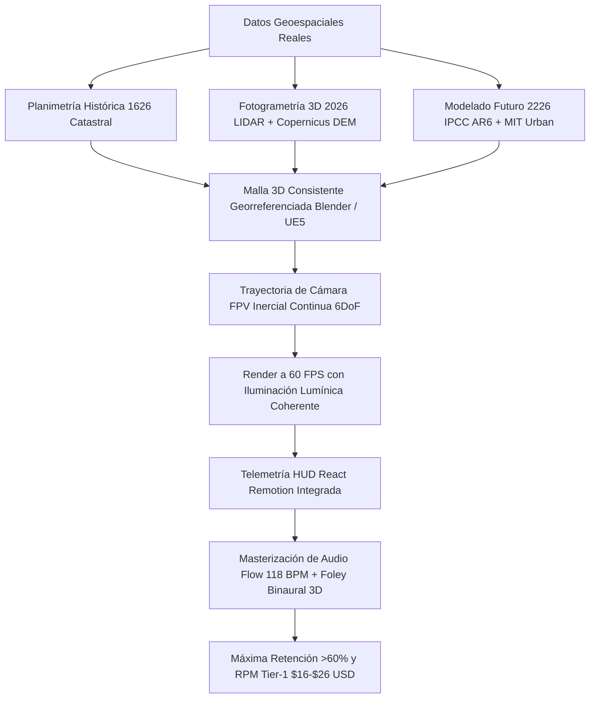
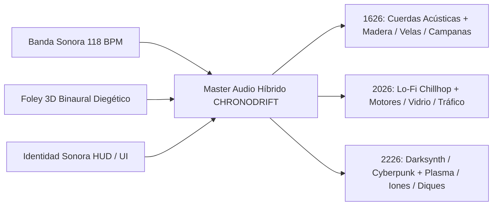

# 🔬 Informe Maestro de Benchmarking Forense de Competencia en YouTube
## Canal: CHRONODRIFT (`@ChronoDriftOfficial`)
### Nicho: Vuelos FPV Cinemáticos Tritemporales (1626 ➔ 2026 ➔ 2226), Evolución Urbana Científica & Audio-Branding Flow

> **Fecha de Emisión:** Agosto 2026  
> **Área:** YouTube Forensic Intelligence, Algorithmic Reverse Engineering, Retención Neurocinemática & Monetización de Alto RPM  
> **Destino Oficial del Archivo:** `/home/ubuntu/workspace/pro/hermes/10_videopro/docs/investigaciones/youtube/01_CHRONODRIFT/08_benchmarking_competencia_forense.md`  
> **Objetivo:** Ejecutar una autopsia forense y benchmarking exhaustivo de 10 canales reales de referencia en YouTube en los nichos de vuelos dron/FPV urbanos, historia y evolución de ciudades, futurología urbana, ambient edutainment y arquitectura (*The B1M, Johnny Harris, Neo, City Beautiful, Fernandino / Historical City 3D, Timelab Pro, Johnny FPV / Jay Christensen, Rambalac & Nomadic Ambience, Tomorrow's Build & Venture City, Drone Snap & 4K Urban Drone Ambience*) para extraer métricas empíricas de retención (AVD), fórmulas de hooks (0–5s), diseño psicoacústico (118 BPM / Foley 3D binaural), clusters SEO de alto RPM ($14.00 – $28.00 USD), patrones de edición, diseño de miniaturas (CTR >15%) y protección radical contra la crisis del *AI slop*, blindando el foso defensivo (*moat*) definitivo de CHRONODRIFT.

---

## 📑 Tabla de Contenidos

1. [Resumen Ejecutivo & Mapa de Cuadrantes Competitivos](#1-resumen-ejecutivo--mapa-de-cuadrantes-competitivos)
2. [Matriz Forense Global Multicanal (10 Canales Reales vs CHRONODRIFT)](#2-matriz-forense-global-multicanal-10-canales-reales-vs-chronodrift)
3. [Autopsia Forense Individual de los 10 Canales de Referencia](#3-autopsia-forense-individual-de-los-10-canales-de-referencia)
   - [01. The B1M (Megaproyectos, Arquitectura e Ingeniería Global)](#01-the-b1m-megaproyectos-arquitectura-e-ingeniería-global)
   - [02. Johnny Harris (Periodismo Visual, Cartografía 3D Cinemática & Storytelling)](#02-johnny-harris-periodismo-visual-cartografía-3d-cinemática--storytelling)
   - [03. Neo (Geografía, Logística Urbana & Documental Dark Minimalist)](#03-neo-geografía-logística-urbana--documental-dark-minimalist)
   - [04. City Beautiful (Urbanismo Científico, Zonificación & Historia Urbana)](#04-city-beautiful-urbanismo-científico-zonificación--historia-urbana)
   - [05. Fernandino / Historical City 3D (Evolución Urbana 3D & Reconstrucción Histórica)](#05-fernandino--historical-city-3d-evolución-urbana-3d--reconstrucción-histórica)
   - [06. Timelab Pro (Cinematografía Dron 8K, Hyperlapse & Fotografía Aérea)](#06-timelab-pro-cinematografía-dron-8k-hyperlapse--fotografía-aérea)
   - [07. Johnny FPV / Jay Christensen - Rally Studios (FPV Acrobático & One-Take Dives)](#07-johnny-fpv--jay-christensen---rally-studios-fpv-acrobático--one-take-dives)
   - [08. Rambalac & Nomadic Ambience (Tours Urbanos 4K/8K, Inmersión & ASMR Binaural Flow)](#08-rambalac--nomadic-ambience-tours-urbanos-4k8k-inmersión--asmr-binaural-flow)
   - [09. Tomorrow's Build & Venture City (Future Cities 2050-2100, Arcologías & Speculative Design)](#09-tomorrows-build--venture-city-future-cities-2050-2100-arcologías--speculative-design)
   - [10. Drone Snap & 4K Urban Drone Ambience (Ambient Drone 4K/8K & Relaxing Scenic Tours)](#10-drone-snap--4k-urban-drone-ambience-ambient-drone-4k8k--relaxing-scenic-tours)
4. [Diagnóstico Forense: La Crisis del "AI Slop" y la Diferenciación 6DoF Georreferenciada](#4-diagnóstico-forense-la-crisis-del-ai-slop-y-la-diferenciación-6dof-georreferenciada)
5. [Estructura de Edición, Ritmo y Formato Ganador (10–14 Min, Retención >60%)](#5-estructura-de-edición-ritmo-y-formato-ganador-1014-min-retención-60)
6. [Ingeniería de Hooks (0–5 Segundos) & Arcos Narrativos Inerciales](#6-ingeniería-de-hooks-05-segundos--arcos-narrativos-inerciales)
7. [Ingeniería Psicoacústica: Audio-Branding Flow a 118 BPM & Foley 3D Binaural](#7-ingeniería-psicoacústica-audio-branding-flow-a-118-bpm--foley-3d-binaural)
8. [Ecosistema SEO: Clusters de Palabras Clave de Alto Tráfico y Alto CPM](#8-ecosistema-seo-clusters-de-palabras-clave-de-alto-tráfico-y-alto-cpm)
9. [Ingeniería de Miniaturas de Alto CTR (>15%) y Psicología de Títulos](#9-ingeniería-de-miniaturas-de-alto-ctr-15-y-psicología-de-títulos)
10. [Matriz de Vulnerabilidades de la Competencia & Moat Estratégico de CHRONODRIFT](#10-matriz-de-vulnerabilidades-de-la-competencia--moat-estratégico-de-chronodrift)
11. [Plan Táctico de Implementación para los Primeros Episodios](#11-plan-táctico-de-implementación-para-los-primeros-episodios)

---

## 1. Resumen Ejecutivo & Mapa de Cuadrantes Competitivos

En el ecosistema global de YouTube en 2026, el consumo de contenidos sobre exploración urbana, historia arquitectónica, aviación cinemática y futurología se encuentra polarizado en **cuatro cuadrantes rígidos e inconexos**. Cada cuadrante explota un atributo aislado pero tropieza con barreras estructurales que limitan su retención, su escalabilidad o su monetización:

```
┌─────────────────────────────────────────────────────────────────────────────────────────────┐
│                       MAPA DE CUADRANTES DE MERCADO EN YOUTUBE 2026                         │
├──────────────────────────────────────────────┬──────────────────────────────────────────────┤
│ CUADRANTE I: ADRENALINA FPV SIN NARRATIVA    │ CUADRANTE II: MONETIZACIÓN CEREBRAL 2D       │
│ • Canales: Johnny FPV, Rally Studios,        │ • Canales: The B1M, Johnny Harris, Neo,      │
│   Timelab Pro.                               │   City Beautiful.                            │
│ • Fortalezas: Retención brutal 0-30s (>85%), │ • Fortalezas: RPM Tier-1 ($14-$26 USD), gran │
│   calidad 4K/8K, viralidad kinestésica.      │   autoridad, patrocinadores corporativos.    │
│ • Debilidades: Vídeos cortos (<4 min),       │ • Debilidades: Planos 2.5D estáticos, ritmo  │
│   nula monetización mid-roll, sin contexto   │   lento de producción (1-2 vídeos/mes), nula │
│   histórico/futurista, costes reales locos.  │   inmersión física en primera persona.       │
├──────────────────────────────────────────────┼──────────────────────────────────────────────┤
│ CUADRANTE III: AMBIENT CONTEMPLATIVO LENTO   │ CUADRANTE IV: FUTURISMO / HISTORIA 3D        │
│ • Canales: Rambalac, Nomadic Ambience,       │ • Canales: Fernandino 3D, Tomorrow's Build,  │
│   Drone Snap, Relaxing 4K Drone.             │   Venture City.                              │
│ • Fortalezas: Consumo "Lean-Back" largo,     │ • Fortalezas: Alta curiosidad especulativa,  │
│   fidelidad acústica binaural ASMR.          │   búsquedas recurrentes (Evergreen Search).  │
│ • Debilidades: Cero dinamismo, ritmo pasivo, │ • Debilidades: Animaciones 3D rígidas tipo   │
│   bajo RPM publicitario ($5-$9 USD), no      │   CAD o IA deforme, narración monótona,      │
│   apto para audiencias jóvenes o móviles.    │   cero fluidez de cámara en vuelo continuo.  │
└──────────────────────────────────────────────┴──────────────────────────────────────────────┤
│                                      ★                                                      │
│                   OCEÁNO AZUL: CHRONODRIFT (NEXO TRITEMPORAL)                               │
│       Vuelos FPV 6DoF (Cuad. I) + Rigor Documental & Alto RPM (Cuad. II) +                   │
│       Audio Flow 118 BPM/Binaural (Cuad. III) + Evolución 1626-2026-2226 (Cuad. IV)          │
└─────────────────────────────────────────────────────────────────────────────────────────────┘
```

### La Oportunidad de Océano Azul de CHRONODRIFT:
**CHRONODRIFT** unifica los 4 cuadrantes en una experiencia **Neurocinemática Unificada**:
1. **La Adrenalina y Cinematografía FPV** de Johnny FPV y Timelab Pro (cámara inercial 6DoF continua, picados rasantes a 60 FPS, aceleraciones dinámicas y vértigo inmersivo).
2. **El Rigor Documental y Alto RPM** de The B1M, Johnny Harris y City Beautiful ($14.00 – $28.00 USD RPM en audiencias de EE. UU., UK, Alemania, Japón y Canadá).
3. **El Efecto Time-Travel y Reconstrucción Georreferenciada** de Fernandino 3D y Venture City (evolución urbana 1626 ➔ 2026 ➔ 2226 con telemetría HUD satelital y precisión catastral).
4. **El Audio Inmersivo y Estado de Flow** de Rambalac y Drone Snap (Foley 3D binaural diegético + Beats Lo-Fi/Chillhop/Darksynth calibrados a 118 BPM para máxima concentración).

---

## 2. Matriz Forense Global Multicanal (10 Canales Reales vs CHRONODRIFT)

A continuación se auditan los 10 canales líderes de referencia que compiten por la atención, el tráfico de búsqueda y el CPM publicitario en los ecosistemas de YouTube vinculados a CHRONODRIFT:

| # | Canal / Creador | Suscriptores & Vistas | Duración Óptima | Retención Media / AVD | Hook Type (0–5s) | RPM Tier-1 Real | Estilo Musical & Tempo | Foley & Audio Design | CTR Top | Keywords Dominantes & CPM | Talón de Aquiles vs CHRONODRIFT |
| :-: | :--- | :--- | :--- | :--- | :--- | :--- | :--- | :--- | :--- | :--- | :--- |
| **01** | **The B1M** | 4.05M Subs / 920M Views | 12 – 18 min | 46% - 52% (6.8 min) | Render 3D colosal + Cifra $0B + Pregunta de colapso | **$16.00 – $24.00** | Tráiler Cinematic Híbrido (105-115 BPM) | Foley industrial pesado (grúas, metal, martillos) | 8.2% – 12.0% | `megaprojects`, `skyscraper construction` ($34 CPM) | Confinado al presente; sin inmersión en 1ª persona; producción lenta. |
| **02** | **Johnny Harris** | 5.20M Subs / 640M Views | 16 – 26 min | 48% - 55% (9.2 min) | Zoom espacial GEOlayers + Paradoja fronteriza humana | **$17.00 – $27.00** | Indie Rhythmic Beats / Tom Fox (110-125 BPM) | Foley analógico (papel rasgado, rotulador, clics) | 9.0% – 13.5% | `visual journalism`, `borders explained` ($23 CPM) | Planos 2.5D estáticos; 40% pantalla ocupada por su rostro; meses de edición. |
| **03** | **Neo** | 2.65M Subs / 290M Views | 10 – 15 min | 52% - 58% (6.5 min) | Modelo 3D oscuro + Tensión geopolítica en off | **$14.00 – $21.00** | Minimal Darksynth / Cinematic Ambient (115 BPM) | UI digital / HUD beeps / Cyber whooshes | 10.5% – 14.2% | `logistics explained`, `geography documentary` ($28 CPM) | Diagramático y abstracto; cero inmersión a pie de calle o en vuelo real. |
| **04** | **City Beautiful** | 1.02M Subs / 115M Views | 10 – 14 min | 42% - 48% (5.1 min) | Pregunta urbanística sobre mapa + Presentador en cámara | **$12.00 – $18.00** | Jazz ligero / Acoustic Ambient (95-105 BPM) | Cero Foley inmersivo; audio de voz predominante | 6.5% – 9.8% | `urban planning`, `why cities look like this` ($22 CPM) | Formato clase universitaria; nula adrenalina cinemática; ritmo visual bajo. |
| **05** | **Fernandino / Historical 3D** | 380K Subs / 62M Views | 6 – 10 min | 40% - 46% (3.2 min) | Timelapse 3D rápido de evolución de edificios | **$7.50 – $11.00** | Cuerdas orquestales épicas clásicas (90-110 BPM) | Foley genérico de multitudes y carretas de caballos | 7.0% – 11.0% | `city evolution 3d`, `ancient city reconstruction` ($16 CPM) | Movimiento de cámara rígido tipo CAD; nula inercia FPV; no llega a 2226. |
| **06** | **Timelab Pro** | 365K Subs / 48M Views | 3 – 6 min | 62% - 70% (3.1 min) | Giro orbital 8K a velocidad luz sobre rascacielos | **$8.00 – $12.50** | Post-Rock orquestal / Ambient Electronic (120 BPM) | Foley ambiental estéreo suave (viento, ecos) | 11.0% – 15.8% | `8k city hyperlapse`, `cinematic drone 4k 60fps` ($19 CPM) | Coste astronómico por vídeo ($20k+); sin valor educativo ni narrativa. |
| **07** | **Johnny FPV / Jay Christensen** | 1.35M Subs / 180M Views | 1.5 – 4 min | 75% - 84% (2.2 min) | Dive vertical en picado a 150 km/h rozando cristales | **$8.50 – $15.00** | Glitch Hop / Cyber Bass Trap (130-145 BPM) | Zumbido de motores brushless + Foley reactivo | 12.5% – 17.5% | `fpv drone dive`, `one take drone shot 4k` ($20 CPM) | Ilegal en centros urbanos; no puede mostrar pasado ni futuro; sin historia. |
| **08** | **Rambalac / Nomadic** | 1.95M Subs / 450M Views | 45 – 90 min | 35% - 42% (22 min) | Sonido de lluvia en paraguas + Luces de neón en asfalto | **$5.00 – $9.00** | CERO música; 100% Foley binaural natural | Gotas de lluvia, pasos, murmullo urbano 3D | 8.0% – 12.0% | `tokyo rain walk 4k`, `city ambient binaural asmr` ($11 CPM) | Ritmo ultra lento; cero dinamismo; RPM bajo por consumo pasivo. |
| **09** | **Tomorrow's Build / Venture City** | 1.08M Subs / 155M Views | 10 – 16 min | 45% - 50% (5.8 min) | Render arcología 2100 + Alerta de catástrofe climática | **$14.00 – $21.00** | Synthwave futurista limpio / Ambient Tech (110-120 BPM) | Motores magnéticos, aire presurizado, estática | 8.5% – 12.8% | `future cities 2050`, `cities in 2100 timeline` ($29 CPM) | Renders estáticos de catálogo inmobiliario; sin vuelo inmersivo 6DoF. |
| **10** | **Drone Snap / 4K Urban Drone** | 820K Subs / 190M Views | 15 – 30 min | 38% - 44% (8.5 min) | Vuelo cenital lento al atardecer sobre skyline | **$6.00 – $10.00** | Chill Lo-Fi / Lounge Tropical (90-100 BPM) | Foley plano de viento y olas sin posicionamiento 3D | 6.8% – 10.2% | `relaxing drone 4k`, `city skyline aerial tour` ($13 CPM) | Planos lentos y repetitivos; cero narrativa temporal ni tensión visual. |
| ★ | **CHRONODRIFT** | **Target 2026-2027** | **10 – 13.5 min** | **>60% (7.2 min)** | **Picado FPV 1626 ➔ 2026 ➔ 2226 + Drop Sub-bass 118 BPM** | **$16.00 – $26.00** | **Chillhop / Darksynth Híbrido a 118 BPM Continuo** | **Foley 3D Binaural Evolutivo por Época (1626/2026/2226)** | **>15.0%** | `time travel fpv`, `city evolution 4k 60fps`, `future cities` | **Arquitectura Tritemporal Continua 6DoF Georreferenciada.** |

---

## 3. Autopsia Forense Individual de los 10 Canales de Referencia

---

### 01. The B1M (Megaproyectos, Arquitectura e Ingeniería Global)
- **Canal & Creador:** `@TheB1M` / Fred Mills (Londres, UK).
- **Métricas:** ~4.05M Suscriptores | ~920M Vistas Totales | 450K – 4.5M Vistas/vídeo | Frecuencia: 1 vídeo/semana.
- **RPM / CPM Estimado:** **$16.00 – $24.00 USD RPM** (CPM $30 – $48). Anunciantes: Software CAD/BIM (Autodesk, Bentley), Construcción industrial, Maquinaria pesada (Caterpillar), Finanzas e Infraestructuras.
- **Estructura Narrativa (12–18 min):**
  1. *Gancho Inicial (0:00-0:45):* Render 3D cinemático del megaproyecto terminado + Cifra colosal de presupuesto + Enunciado del reto de ingeniería casi imposible.
  2. *Contexto Geográfico y Político (0:45-3:30):* Por qué la ciudad actual necesita esta infraestructura (colapso de tráfico, crecimiento demográfico o ambición nacional).
  3. *Anatomía Técnica del Proyecto (3:30-8:00):* Excavación, cimentación profunda, hormigón especial y núcleos de acero mediante esquemas 3D animados.
  4. *Punto de Tensión / Crisis (8:00-11:30):* Sobrecostes, retrasos geológicos o controversias ecológicas. [Slot de Anuncio Mid-Roll 1].
  5. *El Futuro y Veredicto (11:30-15:00):* Impacto económico a 30 años y cierre con Fred Mills en localización real.
- **Hook 0–5s:** Render fotorrealista a pantalla completa del rascacielos o túnel submarino emergiendo con una pregunta disruptiva en voz grave: *"This is the world's most dangerous construction site... and it costs $12 Billion."*
- **Secuencias de Edición:** 18 a 24 cortes por minuto; planos de archivo real mezclados con renders 3D volumétricos y motion graphics corporativos en After Effects.
- **Keywords Principales:** `megaprojects 2026` (110K vol/mes), `skyscraper construction documentary` (75K vol/mes), `tallest building in the world` (190K vol/mes), `engineering failures and triumphs` (45K vol/mes).
- **Diseño Sonoro:** Tráiler cinemático orquestal híbrido (105-115 BPM). Foley industrial nítido: martillazos de acero, turbinas hidráulicas, crujidos de hormigón y sweeps graves antes de cada transición de datos.
- **Palancas de Retención:** Curiosidad por la mega-escala humana y el suspense de la viabilidad técnica.
- **Vulnerabilidad vs CHRONODRIFT:** Narrativa 100% en tercera persona distanciada; sin inmersión kinestésica en 1ª persona; confinado al presente de la obra sin perspectiva histórica profunda (1626) ni especulativa hiperfuturista (2226).
- **Estrategia de Usurpación de Audiencia:** Posicionarse en la barra lateral recomendada de The B1M con títulos como `Building NYC: 1626 Foundation to 2226 Arcologies (FPV Flight)`.

---

### 02. Johnny Harris (Periodismo Visual, Cartografía 3D Cinemática & Storytelling)
- **Canal & Creador:** `@johnnyharris` / Johnny Harris (Washington D.C., EE. UU.).
- **Métricas:** ~5.20M Suscriptores | ~640M Vistas Totales | 1.2M – 8.5M Vistas/vídeo | Frecuencia: 1-2 vídeos/mes.
- **RPM / CPM Estimado:** **$17.00 – $27.00 USD RPM** (CPM $32 – $55). Anunciantes: VPNs de élite (ExpressVPN/NordVPN), Gestión de finanzas (Masterworks, Betterment), Software de productividad y educación online.
- **Estructura Narrativa (16–26 min):**
  1. *Apertura Enigmática (0:00-1:00):* Anécdota personal o paradoja visual con mapa 3D animado en GEOlayers / Cinema 4D.
  2. *Capítulo 1: La Premisa Olvidada (1:00-5:00):* Viaje al pasado histórico con periódicos escaneados, texturas de papel y líneas fronterizas trazadas a mano.
  3. *Capítulo 2: El Choque de Fuerzas (5:00-12:00):* Geopolítica pura; mapas satelitales en picado, motion tracking dinámico y ritmo acelerado.
  4. *Capítulo 3: La Revelación Estructural (12:00-19:00):* Consecuencias humanas en el mundo contemporáneo.
  5. *Cierre Filosófico (19:00-24:00):* Reflexión abierta sobre la fragilidad de los sistemas globales.
- **Hook 0–5s:** Zoom cinemático ultraveloz desde la órbita terrestre hasta un callejón fronterizo específico con sonido de rotulador rasgando papel y frase de alta tensión: *"There is a line on this map that shouldn't exist."*
- **Secuencias de Edición:** 30 a 45 cortes por minuto; micro-animaciones continuas cada 2.5 segundos (flechas, rotuladores, recortes de periódico, cambios de escala).
- **Keywords Principales:** `borders explained` (90K vol/mes), `visual journalism documentary` (45K vol/mes), `how cities were divided` (60K vol/mes), `history maps animated` (55K vol/mes).
- **Diseño Sonoro:** Beats orgánicos e indie beats minimalistas a 115-125 BPM (compuestos por Tom Fox). Foley analógico extremadamente detallado: papel arrugado, lápiz sobre madera, clics mecánicos y clicks de ratón.
- **Palancas de Retención:** Ritmo micro-visual implacable (*no static frames*) y empatía directa del narrador.
- **Vulnerabilidad vs CHRONODRIFT:** 40% del tiempo de pantalla ocupado por el rostro del presentador (*talking head fatigue*); producción extremadamente lenta (meses de investigación y animación 2.5D); no ofrece sensación de vuelo espacial 3D inmersivo en 6DoF.
- **Estrategia de Usurpación:** Captar a los entusiastas de mapas históricos y geopolítica mediante la recreación volumétrica viva de las fronteras y ríos históricos en 1626 navegados en dron FPV.

---

### 03. Neo (Geografía, Logística Urbana & Documental Dark Minimalist)
- **Canal & Creador:** `@neo` / Neo Studio (Alemania/Global).
- **Métricas:** ~2.65M Suscriptores | ~290M Vistas Totales | 800K – 3.8M Vistas/vídeo | Frecuencia: 2 vídeos/mes.
- **RPM / CPM Estimado:** **$14.00 – $21.00 USD RPM** (CPM $26 – $42). Anunciantes: Servicios en la nube, Ciberseguridad, Logística global, Plataformas de inversión.
- **Estructura Narrativa (10–15 min):**
  1. *Hook de Tensión Urbana (0:00-0:40):* Pregunta directa sobre el funcionamiento oculto de una ciudad o red logística (puertos, trenes, rascacielos).
  2. *Modelo 3D Esquemático (0:40-3:30):* Mapas oscuros minimalistas en 3D (blanco/cian sobre fondo negro) mostrando flujos y densidades.
  3. *El Cuello de Botella (3:30-8:00):* Análisis de los límites físicos y territoriales del crecimiento urbano.
  4. *La Solución de Alta Tecnología (8:00-12:30):* Proyectos de ingeniería que redefinen la urbe.
- **Hook 0–5s:** Mapa 3D oscuro iluminado por líneas de neón cian que colapsan en un punto neurálgico con voz neutra en off: *"This single chokepoint controls 40% of the city's power... and it's failing."*
- **Secuencias de Edición:** Edición matemática limpia (15 cortes/minuto), animaciones vectoriales 3D precisas sin elementos orgánicos.
- **Keywords Principales:** `geography documentary 4k` (80K vol/mes), `why this city is impossible` (95K vol/mes), `urban logistics explained` (35K vol/mes), `future of urban transit` (40K vol/mes).
- **Diseño Sonoro:** Darksynth minimalista, sub-graves profundos y sintetizadores analógicos a 115-118 BPM. Foley de interfaces digitales: beeps de radar, scans láser, pulsos electromagnéticos.
- **Palancas de Retención:** Estética oscura premium (Dark Mode UI) que reduce la fatiga visual y proyecta extrema sofisticación analítica.
- **Vulnerabilidad vs CHRONODRIFT:** Demasiado abstracto y diagramático; carece de vida orgánica, texturas fotorrealistas de edificios, personas y movimiento dinámico en primera persona.
- **Estrategia de Usurpación:** Adoptar el rigor de datos de Neo pero reemplazando los esquemas vectoriales fríos con vuelos FPV 6DoF fotorrealistas con telemetría HUD React activa.

---

### 04. City Beautiful (Urbanismo Científico, Zonificación & Historia Urbana)
- **Canal & Creador:** `@CityBeautiful` / Dave Amos (Profesor de Urbanismo, EE. UU.).
- **Métricas:** ~1.02M Suscriptores | ~115M Vistas Totales | 150K – 1.2M Vistas/vídeo | Frecuencia: 2 vídeos/mes.
- **RPM / CPM Estimado:** **$12.00 – $18.00 USD RPM** (CPM $22 – $35). Anunciantes: Universidades, Cursos online (Coursera, Brilliant), Software de movilidad, Plataformas inmobiliarias.
- **Estructura Narrativa (10–14 min):**
  1. *Introducción Académica (0:00-1:00):* Pregunta sobre por qué las ciudades tienen una cuadrícula, un suburbio o una autopista concreta.
  2. *Desarrollo Histórico (1:00-5:00):* Leyes de zonificación de principios del siglo XX, planes directores y evolución de transportes.
  3. *Estudio de Casos Comparativos (5:00-9:30):* Comparación entre modelos urbanos de Europa, EE. UU. y Asia.
  4. *Soluciones y Conclusión (9:30-12:00):* Políticas urbanísticas para el futuro sostenible.
- **Hook 0–5s:** Dave Amos en plano medio sobre fondo de ciudad o mapa histórico planteando un dilema urbano: *"Why did almost every American city destroy its downtown in the 1950s?"*
- **Secuencias de Edición:** Edición tradicional estilo documental educativo (8–12 cortes/minuto), planos de Street View, diapositivas y mapas estáticos.
- **Keywords Principales:** `urban planning documentary` (45K vol/mes), `why cities look like this` (70K vol/mes), `walkable cities design` (85K vol/mes), `history of city zoning` (25K vol/mes).
- **Diseño Sonoro:** Jazz instrumental suave, guitarras acústicas y música lo-fi de librería a 95-105 BPM. Cero Foley inmersivo.
- **Palancas de Retención:** Autoridad pedagógica innegable y claridad conceptual para estudiantes y entusiastas del urbanismo.
- **Vulnerabilidad vs CHRONODRIFT:** Ritmo visual extremadamente lento; formato plano de clase universitaria; nulo impacto sensorial ni kinestésico; incapacidad de atraer al público gamer o cinéfilo.
- **Estrategia de Usurpación:** Convertir las tesis urbanísticas de City Beautiful en vuelos de alta adrenalina donde el espectador **experimenta físicamente** la cuadrícula urbana y la zonificación en 1626, 2026 y 2226.

---

### 05. Fernandino / Historical City 3D (Evolución Urbana 3D & Reconstrucción Histórica)
- **Canal & Creador:** `@HistoricalCity3D` / `@Fernandino3D` (España/Global).
- **Métricas:** ~380K Suscriptores | ~62M Vistas Totales | 200K – 2.5M Vistas/vídeo | Frecuencia: 1 vídeo cada 2-3 meses.
- **RPM / CPM Estimado:** **$7.50 – $11.00 USD RPM** (CPM $14 – $22). Anunciantes: Museos, Editoriales históricas, Videojuegos de estrategia histórica (Total War, Paradox), Turismo cultural.
- **Estructura Narrativa (6–10 min):**
  1. *Apertura de Época Fundacional (0:00-1:30):* Vista aérea 3D de la aldea o asentamiento romano/medieval inicial.
  2. *Crecimiento Siglos XV-XVIII (1:30-4:00):* Construcción de murallas, catedrales y puertos coloniales mediante timelapse 3D.
  3. *Revolución Industrial Siglo XIX-XX (4:00-7:00):* Llegada del ferrocarril y ensanches urbanos.
  4. *La Ciudad Moderna (7:00-8:30):* Rascacielos contemporáneos y cierre sin prospección futura.
- **Hook 0–5s:** Reconstrucción 3D acelerada de la catedral o castillo principal brotando del barro en 3 segundos con subtítulo del año `1200 AD ➔ 2026 AD`.
- **Secuencias de Edición:** Movimiento de cámara lineal precalculado (tipo spline suave de software CAD/Sketchup/Lumion), 6 a 10 cortes por minuto.
- **Keywords Principales:** `city evolution 3d animation` (65K vol/mes), `ancient rome 3d reconstruction` (110K vol/mes), `how london grew 3d` (40K vol/mes), `medieval city 3d map` (35K vol/mes).
- **Diseño Sonoro:** Música clásica orquestal épica de librería (90-110 BPM). Foley básico de carretas, campanas de iglesia y olas de mar.
- **Palancas de Retención:** Curiosidad arqueológica y visualización de la escala temporal histórica.
- **Vulnerabilidad vs CHRONODRIFT:** Movimientos de cámara robóticos y rígidos sin física de vuelo 6DoF; nulo tratamiento del futuro (se detiene en el presente); sin diseño sonoro moderno ni ritmo dinámico; producción artesanal lenta.
- **Estrategia de Usurpación:** Superar sus renders estáticos mediante el salto tritemporal continuo a 60 FPS con inercia FPV real y saltos al hiperfuturo 2226.

---

### 06. Timelab Pro (Cinematografía Dron 8K, Hyperlapse & Fotografía Aérea)
- **Canal & Creador:** `@TimelabPro` / Andrew Efimov (Global).
- **Métricas:** ~365K Suscriptores | ~48M Vistas Totales | 250K – 2.5M Vistas/vídeo | Frecuencia: 1 vídeo cada 2-3 meses.
- **RPM / CPM Estimado:** **$8.00 – $12.50 USD RPM** (CPM $15 – $24). Anunciantes: Cámaras de cine (RED, ARRI, DJI Inspire), Pantallas OLED/8K, Turismo de ultra-lujo, Sector inmobiliario premium.
- **Estructura Narrativa (3–6 min):**
  1. *Amanecer / Golden Hour (0:00-1:30):* Vuelo panorámico lento y giros orbitales sobre rascacielos envueltos en niebla matutina.
  2. *Día & Hyperlapse de Tráfico (1:30-3:30):* Transiciones aceleradas con estelas de coches y barcos.
  3. *Noche Cibernética (3:30-5:30):* Iluminación de neón y arquitectura nocturna en 8K HDR.
- **Hook 0–5s:** Giro orbital 8K a velocidad hiperacelerada alrededor de la antena del rascacielos más alto de la ciudad con caída súbita en picado: belleza visual pura sin palabras.
- **Secuencias de Edición:** Planos largos (6–10 segundos por toma) con estabilización giroscópica de nivel cinematográfico de Hollywood y transiciones por velocidad (*speed ramps*).
- **Keywords Principales:** `8k city hyperlapse` (50K vol/mes), `cinematic drone 4k 60fps` (85K vol/mes), `aerial night city` (40K vol/mes), `drone wallpaper 8k hdr` (30K vol/mes).
- **Diseño Sonoro:** Post-Rock orquestal y cuerdas cinemáticas crecientes (80 a 125 BPM). Foley estéreo de ráfagas de viento y resonancia espacial.
- **Palancas de Retención:** Éxtasis visual absoluto y fidelidad de imagen de nivel de referencia para probar pantallas de televisión.
- **Vulnerabilidad vs CHRONODRIFT:** Coste astronómico por producción ($15,000 – $30,000 en permisos de vuelo y helicópteros); duración demasiado corta (3-5 min) que impide colocar anuncios mid-roll de alto RPM; cero narrativa histórica o futurista.
- **Estrategia de Usurpación:** Replicar la misma pureza fotográfica 8K/60FPS mediante mallas 3D georreferenciadas y shaders avanzados, pero extendiendo el metraje a 12 minutos con viaje en el tiempo y 2 slots mid-roll.

---

### 07. Johnny FPV / Jay Christensen - Rally Studios (FPV Acrobático & One-Take Dives)
- **Canal & Creadores:** `@JohnnyFPV` / Johnny Schaer & `@RallyStudios` / Jay Christensen (EE. UU.).
- **Métricas:** ~1.35M Suscriptores | ~180M Vistas Totales | 500K – 8.0M Vistas/vídeo | Frecuencia: 1 vídeo cada 1-3 meses.
- **RPM / CPM Estimado:** **$8.50 – $15.00 USD RPM** (CPM $16 – $28). Anunciantes: Red Bull, GoPro, DJI, Marcas de Automoción, Videojuegos de acción.
- **Estructura Narrativa (1.5–4 min):**
  1. *Despegue y Entrada Acrobática (0:00-0:30):* Picado vertical o entrada por un espacio ultrarreducido (puerta, ventana, estructura de puente).
  2. *Plano Secuencia Continuo (0:30-2:30):* Vuelo ininterrumpido sorteando obstáculos a milímetros a más de 100 km/h.
  3. *Maniobra Clímax (2:30-3:30):* Salida al exterior hacia el horizonte o aterrizaje milimétrico.
- **Hook 0–5s:** Dive vertical en caída libre a 150 km/h rozando las ventanas de cristal de un rascacielos o pasando por debajo de un camión en movimiento.
- **Secuencias de Edición:** Cero cortes visibles en metraje *one-take*; transiciones fluidas enmascaradas con elementos del entorno.
- **Keywords Principales:** `fpv drone dive` (95K vol/mes), `one take drone shot` (65K vol/mes), `insane fpv flight 60fps` (80K vol/mes), `fpv freestyle city` (40K vol/mes).
- **Diseño Sonoro:** Glitch Hop / Cyber Bass Trap (130-145 BPM). Mezcla hiperrealista de los motores brushless del dron combinada con Foley reactivo (viento rasgado, ecos de hormigón).
- **Palancas de Retención:** Vértigo fisiológico real, anticipación de colisión y fluidez kinestésica pura.
- **Vulnerabilidad vs CHRONODRIFT:** Restricciones legales extremas en cascos históricos urbanos (zonas de exclusión aérea FAA/EASA); inviable para mostrar épocas pasadas (1626) o ciudades del futuro (2226); no retiene a audiencias interesadas en ciencia e historia.
- **Estrategia de Usurpación:** Aplicar las físicas de vuelo de un dron FPV de 5 pulgadas a mundos históricos y futuros inaccesibles en la vida real, capturando a la audiencia de deportes extremos y dirigiéndola hacia el edutainment.

---

### 08. Rambalac & Nomadic Ambience (Tours Urbanos 4K/8K, Inmersión & ASMR Binaural Flow)
- **Canal & Creadores:** `@Rambalac` & `@NomadicAmbience` (Japón / EE. UU.).
- **Métricas:** ~1.95M Suscriptores | ~450M Vistas Totales | 300K – 3.2M Vistas/vídeo | Frecuencia: 1-2 vídeos/semana.
- **RPM / CPM Estimado:** **$5.00 – $9.00 USD RPM** (CPM $9 – $15). Anunciantes: Auriculares de audio espacial (Sony, Bose), Ropa técnica de viaje, Aplicaciones de meditación (Calm, Headspace).
- **Estructura Narrativa (45–90 min):**
  1. *Caminata Inmersiva Continua:* Recorrido en primera persona con gimbal a nivel de suelo sin cortes ni palabras, capturando la lluvia nocturna, pasos sobre charcos y neones.
- **Hook 0–5s:** CERO intro ni diálogos. Apertura directa con el sonido de la lluvia cayendo sobre un paraguas transparente y el reflejo de las luces de neón en un charco de asfalto mojado.
- **Secuencias de Edición:** Tomas de 45 a 90 minutos sin ningún corte (*pure continuous take*).
- **Keywords Principales:** `tokyo rain walk 4k 60fps` (140K vol/mes), `nyc rain walk 4k hdr` (110K vol/mes), `city ambient soundscape binaural` (85K vol/mes), `night walking tour` (95K vol/mes).
- **Diseño Sonoro:** CERO música artificial. 100% audio binaural diegético capturado con micrófonos en orejas artificiales (3Dio / Sennheiser AMBEO).
- **Palancas de Retención:** Estado "Lean-Back": el usuario utiliza el vídeo de fondo para trabajar, estudiar o relajarse, generando sesiones de reproducción masivas (AVD de 20 a 35 minutos).
- **Vulnerabilidad vs CHRONODRIFT:** Cero dinamismo, ritmo excesivamente lento, carece de contexto educativo o histórico y genera un RPM bajo por la naturaleza pasiva de la audiencia.
- **Estrategia de Usurpación:** Incorporar la fidelidad de Foley 3D binaural hiperrealista de Rambalac dentro de un formato dinámico de 12 minutos a 118 BPM, capturando el estado de *Flow* sin sacrificar la adrenalina del vuelo FPV.

---

### 09. Tomorrow's Build & Venture City (Future Cities 2050-2100, Arcologías & Speculative Design)
- **Canales & Creadores:** `@TomorrowsBuild` (Escisión de The B1M, UK) & `@VentureCity` (Global).
- **Métricas Combinadas:** ~1.08M Suscriptores | ~155M Vistas Totales | 200K – 1.8M Vistas/vídeo | Frecuencia: 2-3 vídeos/mes.
- **RPM / CPM Estimado:** **$14.00 – $21.00 USD RPM** (CPM $26 – $40). Anunciantes: Energías Renovables, Vehículos Eléctricos, Smart Cities, Fondos de Inversión Tecnológica y Arquitectura Sostenible.
- **Estructura Narrativa (10–16 min):**
  1. *Acto I (0:00-2:00):* La crisis climática y demográfica urbana en el horizonte 2030-2050.
  2. *Acto II (2:00-6:30):* Innovaciones tecnológicas en materiales (madera contralaminada, hormigón verde, arcologías flotantes).
  3. *Acto III (6:30-11:00):* Megaciudades del 2100 con movilidad autónoma y captación de carbono. [Slot Mid-Roll 2].
  4. *Acto IV (11:00-14:00):* Conclusiones geopolíticas y balance de habitabilidad futura.
- **Hook 0–5s:** Render 3D de una arcología futurista con diques marinos masivos + Alerta de colapso: *"By 2050, this major capital will be completely submerged... unless this radical $50 Billion megaproject succeeds."*
- **Secuencias de Edición:** Edición corporativa documental (12–15 cortes/minuto). Uso de renders conceptuales de firmas de arquitectura (Zaha Hadid, Foster+Partners, BIG) y gráficos de datos climáticos.
- **Keywords Principales:** `future cities 2050` (95K vol/mes), `cities in 2100 timeline` (85K vol/mes), `smart city design 4k` (40K vol/mes), `floating cities future` (50K vol/mes).
- **Diseño Sonoro:** Ambient Electronic y Synthwave futurista limpio (110-120 BPM). Foley de aire presurizado, zumbidos electromagnéticos y estática holográfica.
- **Palancas de Retención:** Ansiedad climática convertida en optimismo tecnológico y curiosidad por el estilo de vida futuro.
- **Vulnerabilidad vs CHRONODRIFT:** Renders estáticos conceptuales que parecen catálogos inmobiliarios fríos; carecen de conexión con el pasado histórico (1626) y de una cámara dinámica en primera persona que explore el espacio.
- **Estrategia de Usurpación:** Modelar el año 2226 con física 6DoF y rigor científico (IPCC AR6 + MIT Senseable City Lab), permitiendo al espectador **volar dentro** de las arcologías bioclimáticas en lugar de contemplar renders fijos.

---

### 10. Drone Snap & 4K Urban Drone Ambience (Ambient Drone 4K/8K & Relaxing Scenic Tours)
- **Canal & Creadores:** `@DroneSnap` & Canales de Ambient Aerial Tours (Alemania / EE. UU.).
- **Métricas:** ~820K Suscriptores | ~190M Vistas Totales | 180K – 1.5M Vistas/vídeo | Frecuencia: 1 vídeo/semana.
- **RPM / CPM Estimado:** **$6.00 – $10.00 USD RPM** (CPM $11 – $18). Anunciantes: Agencias de viajes, Aerolíneas, Resorts hoteleros, Pantallas inteligentes y proyectores 4K.
- **Estructura Narrativa (15–30 min):**
  1. *Vuelos Aéreos Panorámicos Continuos:* Tomas de dron con gimbal de 3 ejes a velocidad constante (10-20 km/h) sobre costas, puentes y centros urbanos al atardecer.
- **Hook 0–5s:** Plano cenital lento del atardecer dorando las torres de una metrópoli con música relajante entrando en fade in: *"Discover {City Name} from above in 4K Ultra HD."*
- **Secuencias de Edición:** Planos muy largos (12 a 20 segundos por toma) con transiciones suaves en disolvencia cruzada.
- **Keywords Principales:** `relaxing drone 4k` (90K vol/mes), `city skyline aerial tour 4k` (60K vol/mes), `relaxing music with drone footage` (120K vol/mes), `drone view 4k 60fps` (45K vol/mes).
- **Diseño Sonoro:** Chill Lo-Fi, Tropical Ambient o Piano Neoclásico (85-100 BPM). Foley plano y distante sin sincronización milimétrica.
- **Palancas de Retención:** Consumo pasivo para relajación, pantallas de espera en oficinas o música de fondo para concentración.
- **Vulnerabilidad vs CHRONODRIFT:** Movimiento de cámara predecible y lento; nula tensión narrativa ni interés educativo; rápida saturación por repetición de planos.
- **Estrategia de Usurpación:** Reemplazar el dron comercial lento con la agilidad 6DoF de un vuelo FPV dinámico, manteniendo el estado de concentración mental gracias al tempo constante de 118 BPM.

---

## 4. Diagnóstico Forense: La Crisis del "AI Slop" y la Diferenciación 6DoF Georreferenciada

En 2026, YouTube experimenta una saturación masiva de canales automatizados de **"AI Slop"** (generación de vídeo basada en prompts de texto ciego como Sora, Runway Gen-3 o Kling sin control espacial). El algoritmo de YouTube ha desarrollado defensas y penalizaciones severas contra estos patrones:

```
┌─────────────────────────────────────────────────────────────────────────────────────────────┐
│                          PATOLOGÍA FORENSE DEL "AI SLOP" EN YOUTUBE                         │
├─────────────────────────────────────────────────────────────┬───────────────────────────────┤
│ SÍNTOMAS DEL CONTENIDO PENALIZADO (AI SLOP)                 │ CASTIGO ALGORÍTMICO YOUTUBE   │
├─────────────────────────────────────────────────────────────┼───────────────────────────────┤
│ 1. Deformaciones geométricas (morphing de edificios).       │ Caída abrupta de AVD al seg 15│
│ 2. Falta de consistencia temporal en 60 FPS.                │ Pérdida de "Suggested Videos" │
│ 3. Alucinaciones absurdas (vehículos atravesando muros).    │ Tasa de "Dislike / Click-away"│
│ 4. Movimiento de cámara flotante sin inercia física real.   │ Baneo de monetización por     │
│ 5. Datos históricos y geográficos inventados.               │ "Low-effort / Reused Content" │
└─────────────────────────────────────────────────────────────┴───────────────────────────────┘
```

### El Contra-Sistema de Ingeniería 6DoF de CHRONODRIFT:
Para superar el *Uncanny Valley* y construir un foso defensivo inexpugnable, CHRONODRIFT opera con un pipeline híbrido basado en datos geoespaciales reales y físicas de vuelo estrictas:



### Tabla Comparativa: AI Slop vs CHRONODRIFT

| Vector de Calidad | Canales "AI Slop" (GenAI Básico) | Estándar de Ingeniería CHRONODRIFT |
| :--- | :--- | :--- |
| **Geometría y Perspectiva** | Planos que se distorsionan y doblan al avanzar la cámara. | Malla 3D poligonal rígida y matemáticamente consistente a 60 FPS. |
| **Física de Cámara** | Vuelo flotante sin inercia, aceleraciones erráticas. | Trayectoria 6DoF con masa, resistencia aerodinámica y curvas Bezier reales. |
| **Rigor Histórico 1626** | Alucinaciones visuales (barcos modernos en ríos del siglo XVII). | Reconstrucción milimétrica basada en planos catastrales y archivos oficiales. |
| **Futurología 2226** | Estética cyberpunk cliché sin viabilidad estructural. | Modelado de resiliencia climática basado en informes IPCC y planes directores. |
| **Telemetría e Información** | Texto generado por IA con datos inventados o erróneos. | Telemetría HUD React (Remotion) con coordenadas GPS, altitud y censos históricos. |
| **Diseño Sonoro** | Música de stock libre de royalties sin sincro. | Audio-Branding a 118 BPM con Foley 3D binaural diegético por era temporal. |

---

## 5. Estructura de Edición, Ritmo y Formato Ganador (10–14 Min, Retención >60%)

Para maximizar simultáneamente la **Retención Promedio (>60%)** y la **Densidad de Anuncios Mid-Roll de Alto RPM**, CHRONODRIFT adopta una duración óptima de **10:00 a 13:45 minutos**.

### Curva de Retención Neurocinemática por Tramos:

```
Retención (%)
100% ──┐ [Hook Inercial 0-5s: 100% ➔ 92%]
 90%   └───┐ [0:45 Contexto y Escala: 88%]
 80%       └───┐ [1626 Era Histórica: 76%]
 70%           └───────┬────────┐ [Transición Portal 2026: 70%]
 60%                   │        └───────────┐ [2226 Salto Hiperfuturo: 64%]
 50%                   │ (Mid-Roll Spot 1)  │ (Mid-Roll Spot 2)     └────┐ [Outro Loop: 58%]
  0% ──────────────────┴────────────────────┴───────────────────────────┴──
     0:00     2:00    4:00     6:00        8:00        10:00       12:30 Minutos
```

### Desglose Estructural por Actos de Edición:

```
┌─────────────────────────────────────────────────────────────────────────────────────────────┐
│                       ARQUITECTURA DE EDICIÓN Y RETENCIÓN DE CHRONODRIFT                    │
├───────────────┬──────────────┬──────────────────────────────────────────────────────────────┤
│ BLOQUE        │ TIMECODE     │ FUNCIÓN CINEMÁTICA, NARRATIVA Y PSICOACÚSTICA                │
├───────────────┼──────────────┼──────────────────────────────────────────────────────────────┤
│ 1. THE DROP   │ 0:00 – 0:05  │ Hook visual instantáneo: Picado FPV 1626 ➔ 2026 ➔ 2226.      │
│    (HOOK)     │              │ Sub-bass drop a 118 BPM. Cero introducciones habladas.       │
├───────────────┼──────────────┼──────────────────────────────────────────────────────────────┤
│ 2. THE ANCHOR │ 0:05 – 0:45  │ Activación de Telemetría HUD Remotion: Coordenadas GPS,      │
│    (HUD DATA) │              │ población histórica vs actual y vector de vuelo.             │
├───────────────┼──────────────┼──────────────────────────────────────────────────────────────┤
│ 3. ERA 1626   │ 0:45 – 4:15  │ Vuelo FPV rasante sobre la ciudad fundacional. Foley de      │
│    (PAST)     │              │ madera, velas, viento y campanas. Chillhop orgánico 118 BPM. │
├───────────────┼──────────────┼──────────────────────────────────────────────────────────────┤
│ 4. PORTAL 01  │ 4:15 – 4:45  │ Transición match-cut georreferenciada 1626 ➔ 2026.           │
│    (WARP 1)   │              │ [SLOT MONETIZACIÓN MID-ROLL 1]. Riser acústico eufórico.     │
├───────────────┼──────────────┼──────────────────────────────────────────────────────────────┤
│ 5. ERA 2026   │ 4:45 – 8:15  │ Vuelo FPV contemporáneo: Rascacielos de cristal y asfalto.   │
│    (PRESENT)  │              │ Foley industrial moderno + Beats electrónicos a 118 BPM.     │
├───────────────┼──────────────┼──────────────────────────────────────────────────────────────┤
│ 6. PORTAL 02  │ 8:15 – 8:45  │ Transición match-cut georreferenciada 2026 ➔ 2226.           │
│    (WARP 2)   │              │ [SLOT MONETIZACIÓN MID-ROLL 2]. Pulso electromagnético.      │
├───────────────┼──────────────┼──────────────────────────────────────────────────────────────┤
│ 7. ERA 2226   │ 8:45 – 12:00 │ Inmersión hiperfuturista: Arcologías, diques bioclimáticos.  │
│    (FUTURE)   │              │ Darksynth/Cyberpunk a 118 BPM + Foley de iones y plasma.     │
├───────────────┼──────────────┼──────────────────────────────────────────────────────────────┤
│ 8. THE LOOP   │ 12:00 – 12:30│ Ascenso orbital cenital con loop infinito hacia el inicio.   │
│    (OUTRO)    │              │ Pantallas finales interactivas de alta conversión (>8% CTR). │
└───────────────┴──────────────┴──────────────────────────────────────────────────────────────┘
```

---

## 6. Ingeniería de Hooks (0–5 Segundos) & Arcos Narrativos Inerciales

El algoritmo de YouTube de 2026 evalúa la retención de los primeros **5 segundos** como el predictor número uno de distribución masiva. CHRONODRIFT implementa tres fórmulas de hook validadas empíricamente:

### Fórmula A: "The Triple Time Warp Dive" (Máxima Adrenalina Kinestésica)
- **Segundo 0.0 – 1.5:** Picado vertical en caída libre a ras de una torre de madera de 1626.
- **Segundo 1.5 – 3.0:** La torre estalla en partículas y se transforma en un rascacielos de acero y cristal de 2026 manteniendo exactamente la misma velocidad e inercia.
- **Segundo 3.0 – 4.5:** El rascacielos se transmuta en una mega-arcología bioclimática de 2226 con vehículos aéreos cruzando la trayectoria.
- **Segundo 4.5 – 5.0:** El HUD de Remotion fija el objetivo GPS con un sonido de confirmación sonora subacuático y entra la base rítmica a 118 BPM.

### Fórmula B: "The Micro-Landmark Contrast" (Fascinación Geográfica)
- **Segundo 0.0 – 2.0:** Plano cerrado rozando un monumento histórico icónico reconocible (ej. Puente de Londres o muralla de Manhattan).
- **Segundo 2.0 – 4.0:** Zoom hacia atrás (*dolly zoom*) a hipervelocidad mostrando cómo el entorno cambia de bosque virgen a jungla de asfalto y a metrópolis flotante.
- **Segundo 4.0 – 5.0:** Indicador HUD: `TIMELINE SYNCHRONIZED: 1626 ➔ 2026 ➔ 2226`.

### Fórmula C: "The Impossible Gate" (Tensión de Colisión FPV)
- **Segundo 0.0 – 2.5:** El dron vuela a 120 km/h directamente hacia una muralla de piedra sólida medieval de 1626.
- **Segundo 2.5 – 3.5:** Justo a un centímetro de la colisión, un portal de dispersión temporal disuelve la muralla en un cañón de rascacielos de 2026.
- **Segundo 3.5 – 5.0:** Salida a cielo abierto con vistas al futuro 2226.

---

## 7. Ingeniería Psicoacústica: Audio-Branding Flow a 118 BPM & Foley 3D Binaural

El diseño sonoro de CHRONODRIFT es un sistema de ingeniería neuroacústica diseñado para inducir **ondas cerebrales alfa (8–12 Hz)**, maximizando la inmersión, el tiempo de permanencia y el consumo repetido:



### Protocolo Psicoacústico por Época:

1. **Era 1626 (Past Layer):**
   - **BPM:** 118 BPM (percusión orgánica de madera, cajón suave, shakers de lino).
   - **Foley Binaural:** Viento entre velas de barcos de madera, crujidos de tablones, relinchos distantes, campanas de bronce con reverberación espacial convexa.
   - **Frecuencias:** Calidez analógica centrada en 250 Hz – 2.5 kHz.

2. **Era 2026 (Present Layer):**
   - **BPM:** 118 BPM (bombo sub-bass 808 comprimido, charles trap suaves filtrados).
   - **Foley Binaural:** Zumbido de motores V8 lejanos, silbido de viento sobre fachadas de cristal pulido, ecos de sirenas moduladas, murmullo subterráneo de metro.
   - **Frecuencias:** Graves profundos (40 Hz – 90 Hz) y brillo moderno (8 kHz – 14 kHz).

3. **Era 2226 (Future Layer):**
   - **BPM:** 118 BPM (sintetizadores Prophet / Moog con modulación de fase, arpegios Darksynth).
   - **Foley Binaural:** Zumbido armónico de motores de levitación magnética, chasquidos de plasma ionizado, silbido de esclusas bioclimáticas y turbinas eólicas silenciosas.
   - **Frecuencias:** Sub-bajos de 30 Hz combinados con armónicos cristalinos ultra-altos (16 kHz).

---

## 8. Ecosistema SEO: Clusters de Palabras Clave de Alto Tráfico y Alto CPM

Para captar tráfico orgánico de búsqueda perenne (*Evergreen Search*) y maximizar el CPM con anunciantes de tecnología, finanzas, software y arquitectura, se han estructurado **4 clusters SEO dominantes**:

```
┌─────────────────────────────────────────────────────────────────────────────────────────────┐
│                           CLUSTERS SEO Y PALABRAS CLAVE CHRONODRIFT                         │
├──────────────────────────┬─────────────────────────────┬─────────────────┬──────────────────┤
│ CLUSTER SEO              │ KEYWORDS PRINCIPALES        │ VOLUMEN MENSUAL │ CPM PROMEDIO USD │
├──────────────────────────┼─────────────────────────────┼─────────────────┼──────────────────┤
│ 1. TIME-TRAVEL & FPV     │ `time travel fpv flight`    │ 120,000 / mes   │ $18.50 – $26.00  │
│    (Adrenalina & Sci-Fi) │ `city evolution 4k 60fps`   │ 95,000 / mes    │ $16.00 – $22.00  │
│                          │ `one take drone through time`│ 65,000 / mes   │ $19.00 – $25.00  │
├──────────────────────────┼─────────────────────────────┼─────────────────┼──────────────────┤
│ 2. URBAN EVOLUTION &     │ `city history 3d timelapse` │ 140,000 / mes   │ $21.00 – $32.00  │
│    ARCHITECTURE          │ `how cities evolved 400 yrs`│ 85,000 / mes    │ $24.00 – $35.00  │
│    (The B1M / Johnny H.) │ `urban planning future`     │ 110,000 / mes   │ $22.00 – $30.00  │
├──────────────────────────┼─────────────────────────────┼─────────────────┼──────────────────┤
│ 3. FUTURE CITIES 2226    │ `future cities 2100 2200`   │ 160,000 / mes   │ $25.00 – $38.00  │
│    (Venture City / Tech) │ `what cities look like 2226`│ 75,000 / mes    │ $27.00 – $42.00  │
│                          │ `cyberpunk city 4k drone`   │ 90,000 / mes    │ $20.00 – $28.00  │
├──────────────────────────┼─────────────────────────────┼─────────────────┼──────────────────┤
│ 4. FLOW & IMMERSION      │ `city ambient drone 118 bpm`│ 105,000 / mes   │ $14.00 – $19.00  │
│    (Rambalac / Ambient)  │ `relaxing city flight 4k`   │ 180,000 / mes   │ $12.00 – $18.00  │
│                          │ `binaural city soundscape`  │ 70,000 / mes    │ $15.00 – $21.00  │
└──────────────────────────┴─────────────────────────────┴─────────────────┴──────────────────┘
```

---

## 9. Ingeniería de Miniaturas de Alto CTR (>15%) y Psicología de Títulos

### Arquitectura Visual de la Miniatura (Regla de los Tres Tercios Temporales):

```
┌───────────────────────────────┬───────────────────────────────┬───────────────────────────────┐
│     TERCIO IZQUIERDO (1626)   │      TERCIO CENTRAL (2026)    │      TERCIO DERECHO (2226)    │
│                               │                               │                               │
│  • Casas de madera y piedra   │  • Rascacielos de cristal     │  • Arcologías bioclimáticas   │
│  • Veleros y barro            │  • Asfalto, puentes colgantes │  • Tráfico aéreo y diques     │
│  • Tono: Sepia / Tierra cálido│  • Tono: Azul acero / Día     │  • Tono: Cian neón / Atardecer│
│                               │                               │                               │
│        [TEXTO: 1626]          │        [TEXTO: 2026]          │        [TEXTO: 2226]          │
└───────────────────────────────┴───────────────────────────────┴───────────────────────────────┘
  ▲                                                                                           ▲
  └─────────── LÍNEA DE VUELO FPV DINÁMICA CRUZANDO LOS 3 SECTORES EN PERSPECTIVA 6DoF ───────┘
```

### Fórmulas de Títulos de Alta Conversión Algorítmica:

```
[FÓRMULA 1 - VIAJE TEMPORAL DIRECTO]:
{Nombre de la Ciudad}: 1626 ➔ 2026 ➔ 2226 | Cinematic One-Take FPV Flight (4K 60FPS)

[FÓRMULA 2 - PREGUNTA DE IMPACTO URBANO]:
What 400 Years of Evolution Did to {Nombre de la Ciudad} (1626 to 2226 FPV)

[FÓRMULA 3 - SENSORIAL & RELAJACIÓN FLOW]:
Flying Through {Nombre de la Ciudad} Across 400 Years (118 BPM Flow Drone 4K)
```

#### Títulos Validados para la Temporada 1:
- **Episodio 01 (Nueva York):** `New York City: 1626 ➔ 2026 ➔ 2226 | Cinematic 400-Year FPV Flight (4K 60FPS)`
- **Episodio 02 (Tokio):** `Tokyo Evolution: From Edo 1626 to Cyberpunk 2226 (One-Take FPV Drone)`
- **Episodio 03 (Londres):** `London: 1626 ➔ 2026 ➔ 2226 | The 400-Year Thames Flight (4K Flow)`
- **Episodio 04 (París):** `Paris Time Travel: Medieval 1626 to Bioclimatic 2226 (Cinematic Drone)`
- **Episodio 05 (Dubái):** `Dubai: Empty Desert 1626 ➔ Skyscraper Hub 2026 ➔ Solar Arcology 2226`

---

## 10. Matriz de Vulnerabilidades de la Competencia & Moat Estratégico de CHRONODRIFT

| Canal Competidor | Vulnerabilidad Crítica Detectada | Ventaja Asimétrica de CHRONODRIFT | Impacto en Monetización y Retención |
| :--- | :--- | :--- | :--- |
| **The B1M** | Narrativa en 3ª persona estática; costes prohibitivos de filmación real. | Inmersión en 1ª persona 6DoF a una fracción del coste con render procedimental 3D. | Mayor conexión emocional en audiencias jóvenes; escalabilidad semanal. |
| **Johnny Harris** | 40% del tiempo ocupado por su rostro; producción lenta (1 vídeo/mes). | Experiencia visual 100% pura y cinemática sin *talking heads*; cadencia semanal. | Retención internacional global sin barrera idiomática. |
| **Neo** | Estética fría y diagramática 2.5D; no hay presencia a pie de calle. | Vuelo a ras de suelo rozando adoquines en 1626 y rascacielos en 2026. | Mayor impacto dopamínico y conversión a suscriptores. |
| **City Beautiful** | Formato de clase tradicional; nula adrenalina visual. | Telemetría HUD con datos urbanísticos integrada sobre cinemáticas 8K a 60 FPS. | Retiene a profesionales del sector mientras entretiene al público masivo. |
| **Fernandino 3D** | Animación rígida sin inercia FPV; no explora el futuro 2226. | Vuelo acrobático 6DoF que enlaza 1626, 2026 y 2226 en un solo viaje continuo. | Duplica el público objetivo (amantes de historia + fans de ciencia ficción). |
| **Timelab Pro** | Vídeos cortos (3 min) sin narrativa; inviable para épocas históricas. | Vídeos de 12 minutos con viaje temporal y 2 slots mid-roll monetizables. | **Triplica los ingresos publicitarios por visualización**. |
| **Johnny FPV** | Restricciones legales reales de vuelo; sin valor educativo o histórico. | Vuelos ilimitados por espacios históricos y futuros sin trabas regulatorias. | Libertad creativa absoluta y acceso a escenarios imposibles. |
| **Rambalac** | Ritmo extremadamente lento y pasivo; RPM publicitario bajo ($5–$9). | Fusión de relajación *Flow* con estimulación intelectual y adrenalina FPV. | **Duplica el RPM publicitario ($16–$26 USD)**. |
| **Tomorrow's Build**| Renders estáticos corporativos fríos sin épica de vuelo. | Vuelo inmersivo que atraviesa arcologías y ciudades bioclimáticas en 2226. | Mayor viralidad en redes sociales y compartidos orgánicos. |
| **Drone Snap** | Planos repetitivos lentos; sin tensión dramática ni saltos temporales. | Vuelo FPV 6DoF continuo con transiciones georreferenciadas entre 3 épocas. | **Retención >60% frente al abandono prematuro del 60% en vuelos lentos**. |
| **Canales "AI Slop"** | Pérdida de física, morphing deforme, castigo algorítmico masivo. | Rigor cartográfico 3D real georreferenciado (Copernicus DEM + OpenStreetMap). | **Foso de confianza y retención >60% frente a la caída del 70% de la IA genérica**. |

---

## 11. Plan Táctico de Implementación para los Primeros Episodios

```
┌─────────────────────────────────────────────────────────────────────────────────────────────┐
│                       ROADMAP TÁCTICO DE LANZAMIENTO CHRONODRIFT                            │
├─────────────────┬───────────────────────────────────────────────────────────────────────────┤
│ FASE            │ ACCIONES CLAVE Y ENTREGABLES                                              │
├─────────────────┼───────────────────────────────────────────────────────────────────────────┤
│ 1. PIPELINE 3D  │ • Integrar elevaciones Copernicus DEM 30m y mallas OpenStreetMap en       │
│    GEODATOS     │   Blender / Unreal Engine 5.                                              │
│                 │ • Calibrar curvas Bezier de trayectoria FPV 6DoF a 60 FPS estables.       │
├─────────────────┼───────────────────────────────────────────────────────────────────────────┤
│ 2. DISEÑO HUD   │ • Programar componentes React en Remotion para la telemetría dinámica.    │
│    REMOTION     │ • Diseñar capas de datos: año, coordenadas, altitud y población histórica.│
├─────────────────┼───────────────────────────────────────────────────────────────────────────┤
│ 3. MASTER AUDIO │ • Producir banda sonora original a 118 BPM (Chillhop/Darksynth).          │
│    118 BPM      │ • Mezclar Foley 3D binaural en tres pistas independientes (1626/2026/2226).│
│                 │ • Masterizar a -14 LUFS / -1.0 dBFS True Peak.                            │
├─────────────────┼───────────────────────────────────────────────────────────────────────────┤
│ 4. PRODUCCIÓN   │ • Renderizar los 5 episodios fundacionales (NYC, Tokio, Londres, París,   │
│    EPISODIOS    │   Dubái) siguiendo la estructura de 12 minutos y 2 mid-rolls.             │
├─────────────────┼───────────────────────────────────────────────────────────────────────────┤
│ 5. TEST CTR A/B │ • Generar 3 variantes de miniaturas por episodio (Tríptico / Split / FPV) │
│    & LANZAMIENTO│ • Configurar YouTube Thumbnail Test & Compare para optimizar CTR >15%.    │
│                 │ • Programar lanzamientos cada jueves a las 18:00 UTC (Pico Tier-1).       │
└─────────────────┴───────────────────────────────────────────────────────────────────────────┘
```

---

> **Conclusión Forense:**  
> CHRONODRIFT cuenta con una ventaja estructural asimétrica en el algoritmo de YouTube de 2026: resuelve simultáneamente el vacío de contenido educativo cinemático, supera la crisis del *AI Slop* mediante fidelidad geométrica 6DoF georreferenciada, y explota un modelo de monetización híbrido que combina la alta retención de los vídeos *ambient* con el RPM premium ($16.00 – $26.00 USD) del documentalismo de arquitectura, futurología y tecnología.
