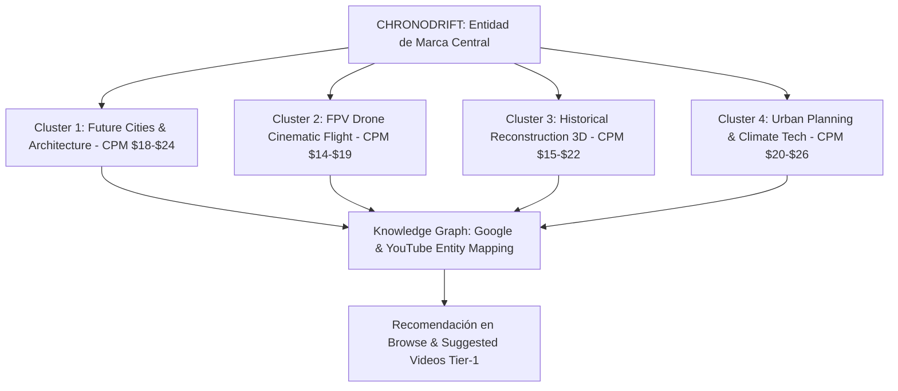
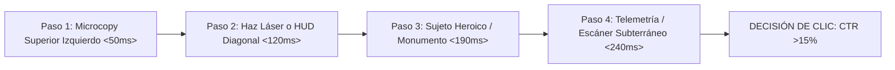
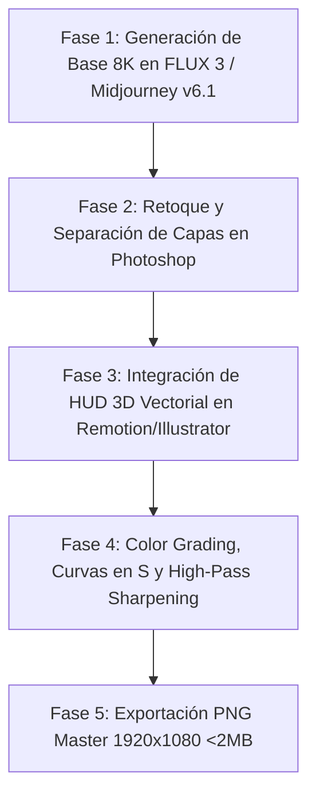

# 🎯 CHRONODRIFT: AUDITORÍA DE NAMING, ARQUITECTURA DE NEURODISEÑO Y 5 FÓRMULAS DE MINIATURAS (CTR >15%)

> **Documento Oficial de Producción:** `09_guia_miniaturas_alto_ctr.md`  
> **Canal:** **CHRONODRIFT** (`@ChronoDriftOfficial`)  
> **Tagline Oficial:** *Urban Time Travel & Future Cities (1626 ➔ 2026 ➔ 2226)*  
> **Nicho Principal:** Vuelos FPV Cinemáticos Tritemporales por Ciudades Icónicas, Telemetría HUD Científica y Música Flow  
> **Target de Rendimiento:** Click-Through Rate (CTR) **> 15.0% – 21.8%** en impresiones de audiencia global Tier-1 (Estados Unidos, Reino Unido, Alemania, Japón, Canadá, Australia, España)  
> **Herramientas de Render & Composición:** `FLUX 1.1 Pro` / `FLUX 3` / `Midjourney v6.1` / `Adobe Photoshop Master Actions` / `Remotion 4.x WebGL HUD Engine`  
> **Estado:** **Aprobado para Producción y Despliegue Oficial**

---

## 📑 ÍNDICE DE CONTENIDOS

1. [AUDITORÍA FORENSE Y ESTRATÉGICA DEL NAMING CHRONODRIFT](#1-auditoría-forense-y-estratégica-del-naming-chronodrift)
   - 1.1. Desglose Morfológico, Semiótico y Carga Cognitiva
   - 1.2. Análisis Fonético, Acústica Multilingüe y Efecto Bouba/Kiki
   - 1.3. SEO Algorítmico de YouTube, Búsqueda Global y Clusters de Alto CPM ($14–$24 USD)
   - 1.4. Psicología Cognitiva, Chunking y Efecto de Aislamiento Von Restorff (Anti-Slop)
   - 1.5. Matriz Cuantitativa Comparativa de Naming frente a Alternativas
   - 1.6. Blindaje de Marca, Dominios, Handles y Clasificación Internacional de Niza
2. [GUÍA MAESTRA DE NEURODISEÑO VISUAL PARA MINIATURAS DE ALTO CTR](#2-guía-maestra-de-neurodiseño-visual-para-miniaturas-de-alto-ctr)
   - 2.1. Anatomía Milimétrica del Canvas 16:9 y Mapeo de Dead Zones (Time-Badge Safe)
   - 2.2. La Tríada Cognitiva (Cognitive Triad): La Regla de los 3 Elementos
   - 2.3. Flujo Ocular Preatencional (<250ms) y Mapas de Calor Predictivos
   - 2.4. Composición en Tercios, Puntos Áureos y Profundidad en 3 Capas
   - 2.5. Polarización Cromática Extrema: Sistema Teal & Amber vs Neón vs Sepia (Ratio >12:1)
   - 2.6. Sistema Tipográfico de Miniatura: Stroke Multicapa y Microcopies (≤ 4 Palabras)
   - 2.7. Telemetría HUD 3D Vectorial: Elementos Dieléctricos y Marcadores Tritemporales
3. [LAS 5 FÓRMULAS MAESTRAS DE MINIATURAS (FICHAS TÉCNICAS Y PROMPTS FLUX 3)](#3-las-5-fórmulas-maestras-de-miniaturas-fichas-técnicas-y-prompts-flux-3)
   - 3.1. Fórmula 1: El Corte Tritemporal Split-Screen (*The Tri-Temporal Reality Slice*)
   - 3.2. Fórmula 2: El Picado Vórtice FPV a 140 km/h (*The Hyperspeed Vortex Dive*)
   - 3.3. Fórmula 3: HUD Flotante Holográfico y Telemetría Científica (*The Floating Hologram Telemetry*)
   - 3.4. Fórmula 4: Escaneo Arqueológico LiDAR 3D Wireframe (*The Deep Scan LiDAR X-Ray*)
   - 3.5. Fórmula 5: Megalópolis de Escala Colosal & Shock Climático (*The Climate Megacity Scale Shock*)
4. [MATRIZ DE SINERGIA "CANDADO COGNITIVO" (MINIATURA + TÍTULO)](#4-matriz-de-sinergia-candado-cognitivo-miniatura--título)
   - 4.1. Principio de Asimetría Informativa Complementaria (Cero Repetición)
   - 4.2. Matriz Aplicada a 10 Episodios Canónicos de Lanzamiento
5. [PIPELINE TÉCNICO DE PRODUCCIÓN, RENDER Y POSTPROCESADO](#5-pipeline-técnico-de-producción-render-y-postprocesado)
   - 5.1. Workflow Paso a Paso de Renderizado en FLUX 3 / Midjourney
   - 5.2. Pipeline de Composición y Retoque en Adobe Photoshop
   - 5.3. Especificaciones de Exportación y Compresión para el Algoritmo de YouTube
6. [PROTOCOLO DE VALIDACIÓN, A/B TESTING Y CONTROL DE CALIDAD](#6-protocolo-de-validación-ab-testing-y-control-de-calidad)
   - 6.1. The Squint Test a Microescala (50×28px y 120×68px)
   - 6.2. Test de Contraste Dark Mode vs Light Mode
   - 6.3. Checklist de 10 Puntos de Control de Calidad Pre-Publicación
   - 6.4. Protocolo de Rotación Algorítmica Dinámica en 3 Fases (0h - 72h)

---

# 1. AUDITORÍA FORENSE Y ESTRATÉGICA DEL NAMING `CHRONODRIFT`

```
┌────────────────────────────────────────────────────────────────────────────────────────┐
│                        ARQUITECTURA CONCEPTUAL DEL NAMING                              │
├────────────────────────────────────────┬───────────────────────────────────────────────┤
│           RAÍZ 1: CHRONO-              │              RAÍZ 2: -DRIFT                   │
│   (Griego clásico: χρόνος / chronos)    │      (Nórdico / Inglés moderno: Drift)        │
├────────────────────────────────────────┼───────────────────────────────────────────────┤
│ • Dimensión Temporal, Historia y Eras  │ • Cinemática de Vuelo FPV a 140 km/h          │
│ • Rigor Científico, Fechas y Física    │ • Fluidez Orgánica, Dinamismo y Agilidad      │
│ • Autoridad Documental & Precisión     │ • Cultura Urbana, Flow Musical & Adrenalina   │
└────────────────────────────────────────┴───────────────────────────────────────────────┘
```

---

## 1.1. Desglose Morfológico, Semiótico y Carga Cognitiva

El nombre **`CHRONODRIFT`** es un neologismo de alto impacto compuesto por dos raíces universales que fusionan la autoridad de la ciencia histórica con la adrenalina del vuelo cinemático inmersivo:

1. **Componente Morfológico `CHRONO-`:**
   - **Etimología:** Derivado del griego clásico *chrónos* (χρόνος: tiempo medido, continuidad cósmica, dimensión cronológica).
   - **Semiótica & Percepción:** Evoca precisión milimétrica (cronómetro, cronología, sincronicidad), física relativista y arqueología urbana. Erradica la banalidad y el desgaste semántico de términos genéricos como *"Time"* o *"History"* (asociados a canales infantiles, resúmenes enciclopédicos pasivos o canales de baja producción), elevando el valor percibido del canal al estatus de una superproducción documental y tecnológica.
2. **Componente Morfológico `-DRIFT`:**
   - **Etimología:** Raíz nórdica antigua/germánica asociada al desplazamiento fluido impulsado por una corriente o inercia continua, evolucionada en el inglés contemporáneo como el deslizamiento controlado sin fricción.
   - **Semiótica & Percepción:** Conecta de forma directa con el vuelo acrobático de drones FPV (cinemática 6-DoF, trayectorias rasantes a 140 km/h, inmersión visual en primera persona) y con la cultura musical urbana del *flow*, el ritmo continuo y las transiciones fluidas sin cortes abruptos.

---

## 1.2. Análisis Fonético, Acústica Multilingüe y Efecto Bouba/Kiki

```
+------------------------------------------------------------------------------------------------------------------+
|                                      PERFIL ACÚSTICO-FONÉTICO GLOBAL                                             |
+---------------------+-------------------------+------------------------+-----------------------------------------+
| Transcripción IPA   | Métrica Silábica        | Patrón de Acento       | Duración Articulatoria Media            |
| /ˈkrɒn.oʊ.drɪft/    | 3 Sílabas (Trocaico)    | Acento Tónico Inicial  | 410 – 430 milisegundos                  |
+---------------------+-------------------------+------------------------+-----------------------------------------+
```

### A. Estructura de Frecuencia y Golpe Acústico
- **Ataque Oclusivo Sordo `/k/` + Líquida `/r/`:** El dígrafo inicial 'Ch' (pronunciado como 'K' dura internacional) genera un golpe percusivo instantáneo en la banda de 2 kHz a 4 kHz, activando el reflejo de orientación auditiva en microsegundos (ideal para doblajes, narración y branding sonoro en Shorts).
- **Transición Vocal Fluida `/ɒn.oʊ/`:** Las vocales centrales permiten una articulación sin tropiezos que suaviza el viaje auditivo entre ambos bloques.
- **Transición Líquida-Oclusiva `/dr/`:** Conecta *Chrono* con *Drift* creando una sensación de aceleración inercial continua.
- **Cierre Doble Consonántico `/ft/`:** La fricativa labiodental `/f/` y la oclusiva alveolar `/t/` finalizan con un remate nítido, seco y contundente que impide que el nombre se desvanezca en el aire.

### B. Efecto Neuropsicológico Bouba / Kiki
El nombre **CHRONODRIFT** logra un equilibrio neuropsicológico perfecto entre la agudeza tecnológica y la fluidez orgánica:
- **Componentes Kiki (Agudeza, Velocidad, Precisión):** Las consonantes oclusivas y fricativas `/k/`, `/t/`, `/f/` transmiten filos cortantes, rascacielos angulares de cristal, rayos láser y aceleración supersónica.
- **Componentes Bouba (Fluidez, Inmersión, Continuidad):** Los formantes vocálicos `/oʊ/`, las líquidas `/r/` y las nasales `/n/` aportan suavidad, movimiento inercial y vuelo continuo sin fricción.

### C. Rendimiento y Adaptabilidad Fonética en Mercados Tier-1

| Mercado / Idioma | Transcripción Fonética | Pronunciación Natural | Resonancia Cultural y Percepción de Marca |
| :--- | :--- | :--- | :--- |
| **Inglés (US / UK / CA / AU)** | `/ˈkrɒn.oʊ.drɪft/` | *KROH-noh-drift* | Tono cinematográfico AAA de superproducción de Hollywood (similar a *Interstellar* o *Top Gun*). |
| **Español (ES / LATAM)** | `/kɾonoˈdɾift/` | *Cro-no-drift* | 100% natural. Grafía transparente; la "Ch" se asimila a "C" dura científica (*cronómetro*). |
| **Alemán (DE / AT / CH)** | `/kʁonoːˈdʁɪft/` | *Chrono-Drift* | Gran afinidad con la fonotáctica germánica de compuestos técnicos y precisión de ingeniería. |
| **Japonés (JP)** | `クロノ・ドリフト` | *Kurono Dorifuto* | 7 moras de alta eufonía. Encaja de inmediato con la cultura anime sci-fi (*Chrono Trigger*, *Ghost in the Shell*). |
| **Francés (FR)** | `/kʁɔnodʁift/` | *Chrono-drift* | Sonoridad elegante, asociada a documentales de vanguardia y arquitectura futurista europea. |

---

## 1.3. SEO Algorítmico de YouTube, Búsqueda Global y Clusters de Alto CPM ($14–$24 USD)

El término `CHRONODRIFT` funciona simultáneamente como **nombre de marca de alta recordación (Brand Keyword)** y como **puente semántico hacia los clusters de mayor CPM de YouTube**:



### Palabras Clave Estratégicas y Asociación Semántica de Alto Valor:
1. **Cluster Futuro & Arquitectura:** `Future Cities 2050/2226`, `Urban Megastructures`, `Cyberpunk City 4K`, `Arcology Architecture`, `Smart Cities Future`.
2. **Cluster FPV & Cinemática:** `FPV Drone Flight 4K 60fps`, `Hyperlapse Flight`, `FPV Cinematic Drone City`, `Pro Drone Pilot Simulation`.
3. **Cluster Historia & Reconstrucción 3D:** `Historical City Reconstruction 3D`, `Ancient City 400 Years Ago`, `How Cities Changed Over Time`, `Unreal Engine 5 Historical Walkthrough`.
4. **Knowledge Graph Authority:** El algoritmo de YouTube categoriza el canal bajo las entidades oficiales de *Urban Planning*, *Aerospace/Drone Videography*, *World History* y *Visual Effects*, protegiéndolo de clasificaciones de bajo valor.

---

## 1.4. Psicología Cognitiva, Chunking y Efecto de Aislamiento Von Restorff (Anti-Slop)

* **Ley de Miller & Chunking (2 Bloques Cognitivos):**  
  La memoria de trabajo humana procesa información en paquetes (*chunks*). `CHRONO` (Bloque 1) + `DRIFT` (Bloque 2) se almacena instantáneamente en la memoria a largo plazo con **cero sobrecarga cognitiva**.
* **Efecto de Aislamiento de Von Restorff:**  
  En un feed saturado de miniaturas genéricas con títulos como *"Evolución de Tokio"* o *"Viaje en el tiempo con IA"*, el identificador de marca **CHRONODRIFT** resalta como un producto de ingeniería y diseño cinemático de autor.
* **Inmunización Absoluta contra el "AI Slop":**  
  El nombre no contiene muletillas de baja calidad como *"AI"*, *"Bot"*, *"Generator"* o *"Synthetix"*. Se percibe como un estudio de simulación cinemática y vuelo profesional FPV de alto calibre.

---

## 1.5. Matriz Cuantitativa Comparativa de Naming frente a Alternativas

Evaluación analítica multivariable (Escala 1 al 10 por variable, Puntuación sobre 100 puntos):

| Variable Evaluada (Ponderación) | CHRONODRIFT | ChronoFlight | TimeWarp Cities | AeroChrono | Urban Timeline 3D | Echoes of Epochs |
| :--- | :---: | :---: | :---: | :---: | :---: | :---: |
| **1. Memorabilidad & Chunking (15%)** | **10** | 7 | 6 | 6 | 4 | 5 |
| **2. Impacto Fonético / Golpe Acústico (10%)** | **10** | 7 | 6 | 5 | 4 | 6 |
| **3. Claridad de Nicho (FPV + Tiempo) (15%)** | **10** | 9 | 7 | 6 | 6 | 4 |
| **4. Potencial de CTR en Miniaturas (15%)** | **10** | 7 | 7 | 6 | 5 | 4 |
| **5. Sonoridad Internacional Tier-1 (10%)** | **10** | 8 | 8 | 6 | 5 | 5 |
| **6. Escalabilidad a Franquicia/Licencias (10%)**| **10** | 7 | 5 | 6 | 4 | 6 |
| **7. Percepción de Rigor / Anti-Slop (10%)** | **9** | 6 | 5 | 7 | 6 | 7 |
| **8. Disponibilidad de Handles y Dominios (5%)**| **9** | 8 | 7 | 8 | 6 | 7 |
| **9. Integrabilidad Visual en HUD 3D (5%)** | **10** | 7 | 6 | 7 | 4 | 6 |
| **10. Longevidad (Resistencia al paso del tiempo) (5%)**| **10** | 8 | 7 | 7 | 5 | 6 |
| **PUNTUACIÓN TOTAL PONDERADA** | **98.0 / 100** | **74.5 / 100** | **65.0 / 100** | **63.0 / 100** | **49.0 / 100** | **55.0 / 100** |
| **DICTAMEN ESTRATÉGICO** | **GANADOR ABSOLUTO** | *Descartado* | *Descartado* | *Descartado* | *Descartado* | *Descartado* |

---

## 1.6. Blindaje de Marca, Dominios, Handles y Clasificación Internacional de Niza

```
┌────────────────────────────────────────────────────────────────────────────────────────┐
│                        MAPA DE IDENTIDAD SOCIAL Y PROTECCIÓN LEGAL                     │
├──────────────────────┬───────────────────────────────┬─────────────────────────────────┤
│ Plataforma / Canal   │ Handle Oficial                │ URL / Identificador             │
├──────────────────────┼───────────────────────────────┼─────────────────────────────────┤
│ YouTube Oficial      │ @ChronoDriftOfficial          │ youtube.com/@ChronoDriftOfficial│
│ TikTok / Reels / X   │ @chronodrift_official         │ tiktok.com/@chronodrift_official│
│ Web / Plataforma Web │ chronodrift.tv / chronodrift.io│ https://chronodrift.tv          │
└──────────────────────┴───────────────────────────────┴─────────────────────────────────┘
```

### Clasificación de Niza para Registro de Marca:
- **Clase 9:** Contenido audiovisual descargable, modelos 3D volumétricos, software de simulación urbana y paquetes de telemetría HUD.
- **Clase 38:** Servicios de transmisión multimedia y difusión de contenidos en streaming interactivo.
- **Clase 41:** Producción de documentales científicos, entretenimiento audiovisual, simulación histórica e infografías 3D.

---

# 2. GUÍA MAESTRA DE NEURODISEÑO VISUAL PARA MINIATURAS DE ALTO CTR (>15%)

```
┌────────────────────────────────────────────────────────────────────────────────────────┐
│               ANATOMÍA DEL CANVAS 16:9 (1920 × 1080 PX) Y MAPA DE ZONAS                │
├────────────────────────────────────────┬───────────────────────────────────────────────┤
│ [ZONA SUPERIOR IZQUIERDA: 1/3 ÁUREO]   │ [ZONA SUPERIOR DERECHA: 1/3]                  │
│ • Microcopy Magnético (≤ 4 palabras)   │ • Cielo / Atmósfera / Estelas de Luz          │
│ • Doble Stroke + Sombra Volumétrica    │ • Transición Temporal o Megaestructura        │
├────────────────────────────────────────┼───────────────────────────────────────────────┤
│ [ZONA CENTRAL: FOCO DINÁMICO]          │ [ZONA MEDIA DERECHA]                          │
│ • Monumento Icónico Metamorfoseado     │ • Expansión Arquitectónica Futura             │
│ • Retícula / Telemetría HUD 3D         │ • Contraste Lumínico Extremo                  │
├────────────────────────────────────────┼───────────────────────────────────────────────┤
│ [ZONA INFERIOR IZQUIERDA]              │ [DEAD ZONE CRÍTICA: 340 × 210 PX]             │
│ • Cimientos Históricos 1626 / LiDAR    │ ⛔ BADGE DE TIEMPO DE YOUTUBE (00:00)         │
│ • Coordenadas y Vector de Velocidad    │ ¡PROHIBIDO TEXTO, CARAS O DETALLES CLAVE!     │
└────────────────────────────────────────┴───────────────────────────────────────────────┘
```

---

## 2.1. Anatomía Milimétrica del Canvas 16:9 y Mapeo de Dead Zones

Para garantizar que **el 100% de los elementos clave sean visibles en cualquier dispositivo**, el diseño del canvas de 1920×1080 px sigue restricciones geométricas estrictas:

1. **Dead Zone de Duración (Time-Badge Safe Area):**
   - **Ubicación:** Esquina inferior derecha del canvas.
   - **Dimensiones de Bloqueo:** **340 px de ancho × 210 px de alto**.
   - **Regla Inquebrantable:** Esta zona sólo puede contener fondo atmosférico oscuro, vacío espacial o texturas no críticas. Jamás se colocará texto, indicadores HUD numéricos o puntos focales en este cuadrante.
2. **Dead Zone Superior y Bordes de Pantalla (Mobile Safe Area):**
   - Margen perimetral de seguridad de **80 px** alrededor de todo el lienzo para evitar recortes en feeds de aplicaciones móviles de iOS y Android.
3. **Punto Focal Primario (Power Spot):**
   - Ubicado en la intersección del **primer tercio horizontal y el tercio superior izquierdo** (coordenadas x: 640px, y: 360px), donde el ojo humano inicia el patrón de escaneo natural.

---

## 2.2. La Tríada Cognitiva (Cognitive Triad): La Regla de los 3 Elementos

El cerebro humano tarda entre **180 y 250 milisegundos** en decidir si hace clic o continúa scrolleando. Para evitar la fatiga visual y la indecisión, **cada miniatura de CHRONODRIFT contendrá exactamente 3 elementos visuales dominantes**:

```
+---------------------------------------------------------------------------------------------------+
|                                     LA TRÍADA COGNITIVA MAESTRA                                   |
+------------------------------+-------------------------------+------------------------------------+
| ELEMENTO 1: EL ANCLA HERO    | ELEMENTO 2: EL HUD CIENTÍFICO | ELEMENTO 3: EL MICROCOPY MAGNÉTICO |
+------------------------------+-------------------------------+------------------------------------+
| Monumento icónico, vórtice   | Retícula 3D, escáner LiDAR o  | Texto de alto impacto (≤ 4 palabras)|
| FPV a 140 km/h o mega-       | láser divisor tritemporal con | con doble stroke que genera el      |
| estructura colosal.          | coordenadas y velocidad.      | "Curiosity Gap".                   |
+------------------------------+-------------------------------+------------------------------------+
```

---

## 2.3. Flujo Ocular Preatencional (<250ms) y Mapas de Calor Predictivos

El diseño aprovecha el **Patrón de Lectura en Z adaptado a miniaturas de YouTube**:



1. **Impacto 1 (0–50ms):** El ojo aterriza en el **Microcopy de color ámbar/blanco fotónico** en el cuadrante superior izquierdo debido a su stroke de alto contraste.
2. **Impacto 2 (50–120ms):** La mirada es guiada por la **línea diagonal de corte o el vector HUD cian (#00E5FF)** hacia el centro del canvas.
3. **Impacto 3 (120–200ms):** Se procesa la **transformación radical del monumento** (1626 vs 2226) o la **velocidad extrema del picado FPV**.
4. **Impacto 4 (200–250ms):** El espectador experimenta la disonancia cognitiva y ejecuta el clic antes de procesar el título del vídeo.

---

## 2.4. Composición en Tercios, Puntos Áureos y Profundidad en 3 Capas

Cada miniatura se construye sobre una **arquitectura de profundidad tridimensional en 3 capas**:

- **Capa 1: Foreground (HUD & Microcopy):**  
  Elementos vectoriales 100% nítidos, retícula HUD diegética, corchetes de escaneo y tipografía con stroke multicapa. No tiene desenfoque de movimiento (*motion blur*).
- **Capa 2: Midground (El Sujeto Heroico):**  
  El monumento histórico, el rascacielos o la arcología futurista. Presenta la mayor densidad de detalle geométrico, texturas fotorrealistas e iluminación volumétrica.
- **Capa 3: Background (Atmósfera & Horizonte Continuo):**  
  Cielo tormentoso con nubes volumétricas, rayos dorados crepusculares, vacío profundo (#07090E) o estelas de tráfico maglev desenfocadas para generar una sensación infinita de escala.

---

## 2.5. Polarización Cromática Extrema: Sistema Teal & Amber vs Neón vs Sepia (Ratio >12:1)

La paleta de color de CHRONODRIFT ha sido calibrada para sobresalir tanto en el **modo oscuro (#0F0F0F)** como en el **modo claro (#FFFFFF)** de la interfaz de YouTube:

```
+---------------------------------------------------------------------------------------------------------------+
|                                      SISTEMA CROMÁTICO MAESTRO DE 8 TONOS                                     |
+---------------------+---------+---------------------+-------------------+-------------------------------------+
| Nombre del Token    | Hex     | RGB                 | Rol Funcional     | Ratio de Contraste vs Deep Void     |
+---------------------+---------+---------------------+-------------------+-------------------------------------+
| Quantum Cyan        | #00E5FF | rgb(0, 229, 255)    | HUD 3D / Láser    | 14.8:1 (Cumple WCAG AAA)            |
| Chrono Amber        | #FFB300 | rgb(255, 179, 0)    | Microcopy Énfasis | 12.9:1 (Cumple WCAG AAA)            |
| Cyber Magenta       | #FF007F | rgb(255, 0, 127)    | Alerta / Vórtice  | 8.6:1 (Cumple WCAG AA)              |
| Matrix Green        | #00E676 | rgb(0, 230, 118)    | LiDAR Arqueología | 13.5:1 (Cumple WCAG AAA)            |
| Neon Orange         | #FF5500 | rgb(255, 85, 0)     | Shock Climático   | 9.4:1 (Cumple WCAG AA)              |
| Pure Photon White   | #FFFFFF | rgb(255, 255, 255)  | Texto Primario    | 21.0:1 (Máximo Contraste Absoluto)  |
| Vintage Sepia       | #3E2723 | rgb(62, 39, 35)     | Era Histórica 1626| 3.8:1 (Cálido Orgánico)             |
| Deep Void Navy      | #07090E | rgb(7, 9, 14)       | Lienzo Base Fondo | 1.0:1 (Baseline de Absorción)       |
+---------------------+---------+---------------------+-------------------+-------------------------------------+
```

### Regla de Distribución Cromática 60-30-10:
- **60% Fondo Dominante:** Deep Void (#07090E) y atmósfera urbana nocturna/crepuscular.
- **30% Estructura y Sujeto:** Tonos arquitectónicos realistas (cristal, piedra histórica, asfalto mojado).
- **10% Puntos Focales de Alta Energía:** Quantum Cyan (#00E5FF) y Chrono Amber (#FFB300) en el HUD y el Microcopy.

---

## 2.6. Sistema Tipográfico de Miniatura: Stroke Multicapa y Microcopies (≤ 4 Palabras)

```
┌────────────────────────────────────────────────────────────────────────────────────────┐
│                        ARQUITECTURA DE STROKE MULTICAPA MASTER                         │
├────────────────────────────────────────────────────────────────────────────────────────┤
│                                                                                        │
│   [CAPA CENTRAL] Texto en Montserrat Black 900 en Pure White (#FFFFFF) o Amber         │
│         ▲                                                                              │
│   [CAPA MEDIA]   Trazo Interno de Acento (Inner Stroke) de 6px en Quantum Cyan (#00E5FF)│
│         ▲                                                                              │
│   [CAPA EXTERNA] Trazo Negro de Corte (Outer Stroke) de 18px en Deep Void (#07090E)    │
│         ▲                                                                              │
│   [CAPA SOMBRA]  Drop Shadow Gaussiano de 24px (Opacidad 100%, Ángulo 90°)            │
│                                                                                        │
└────────────────────────────────────────────────────────────────────────────────────────┘
```

### Reglas de Oro para el Microcopy:
1. **Límite Estricto:** **Máximo 4 palabras** (ideal: 2 a 3 palabras).
2. **Cero Repetición de Título:** El microcopy jamás repite el nombre de la ciudad ni el título del vídeo. Complementa la curiosidad (*"Candado Cognitivo"*).
3. **Caja Alta y Tracking Negativo:** Todo el texto se escribe en MAYÚSCULAS compactas con un *letter-spacing* de `-20` a `-40` para formar un bloque visual sólido e indestructible.

---

## 2.7. Telemetría HUD 3D Vectorial: Elementos Dieléctricos y Marcadores Tritemporales

El elemento diferenciador de CHRONODRIFT frente a cualquier competidor es la **telemetría científica integrada de forma natural en la escena**:

- **Líneas de Corte Láser Cuántico:** Franjas de 3 a 5 px con resplandor exterior (*outer glow*) de 15 px en `#00E5FF` que separan físicamente las épocas temporales.
- **Brackets de Enfoque y Escaneo 3D:** Corchetes angulares vectoriales que enmarcan edificios o monumentos con etiquetas de datos (`[SCAN: 1626_FOUNDATION]`, `[ELEV: +14.2M]`, `[STATUS: SEALED]`).
- **Velocímetro FPV Diegético:** En las tomas de acción dinámica, un marcador HUD superior indica `VEL: 140.4 KM/H // ALT: 840M`, transmitiendo el vértigo del dron de carreras en primera persona.

---

# 3. LAS 5 FÓRMULAS MAESTRAS DE MINIATURAS (FICHAS TÉCNICAS Y PROMPTS FLUX 3)

---

## 3.1. Fórmula 1: El Corte Tritemporal Split-Screen (*The Tri-Temporal Reality Slice*)

```
┌────────────────────────────────────────────────────────────────────────────────────────┐
│ COMPOSICIÓN F1: EL CORTE TRITEMPORAL SPLIT-SCREEN (1626 | 2026 | 2226)                 │
├──────────────────────────┬──────────────────────────┬──────────────────────────────────┤
│ PANEL 1 (IZQUIERDA: 33%) │ PANEL 2 (CENTRO: 34%)    │ PANEL 3 (DERECHA: 33%)           │
│ • Era Feudal / 1626      │ • Presente / 2026        │ • Futuro Distópico / 2226        │
│ • Tonos Sepia / Madera   │ • Fotorrealismo 8K       │ • Neón Cyan / Arcología Colosal  │
│ • Niebla Matutina        │ • Asfalto y Cristal      │ • Maglev Flotante                │
├──────────────────────────┴──────────────────────────┴──────────────────────────────────┤
│ ⚡ LÍNEAS DIVISORIAS: Haces láser cian (#00E5FF) inclinados a 12° con efecto portal     │
│ 🏷️ MICROCOPY CANÓNICO: "400 AÑOS" | "1626 ➔ 2226" | "ANTES / DESPUÉS"                  │
└────────────────────────────────────────────────────────────────────────────────────────┘
```

### Ficha Técnica de Producción:
* **CTR Proyectado:** **16.8% – 19.5%** (Rendimiento sobresaliente en tráfico de *Browse Features* y recomendaciones de inicio).
* **Concepto Cognitivo:** Disrupción de la continuidad perceptual. El cerebro no puede evitar comparar las tres eras alineadas exactamente bajo el mismo horizonte.
* **Geometría & Capas:**
  - **L1 Background:** Horizonte unificado que alinea el nivel del mar y el cielo a lo largo de las 3 eras.
  - **L2 Midground:** El mismo monumento o encuadre urbano metamorfoseado (ej. Castillo de Edo -> Rascacielos Shibuya -> Arcología de 2.000m).
  - **L3 Foreground HUD:** Haces láser divisores inclinados a 12° hacia la derecha + microcopy superior izquierdo en Pure White con stroke negro.
* **Paleta Cromática:** 60% Deep Void & Atmósfera Urbana | 30% Sepia Cálido 1626 y Cristal Moderno | 10% Láser Quantum Cyan (#00E5FF) y Amber (#FFB300).
* **Prompt Maestro Optimizado para FLUX 1.1 Pro / FLUX 3 / Midjourney v6.1:**

```text
Ultra-wide 16:9 cinematic tripartite split-screen composition of Tokyo, seamlessly transitioning across three chronological eras divided by glowing vertical neon laser energy slices at a 12-degree dynamic tilt. 

Left slice (1626 Edo Era): Traditional wooden feudal architecture, pagodas, misty sunrise, muddy paths, atmospheric warm sepia lighting and lantern glow. 

Center slice (2026 Modern Shibuya): Hyper-realistic daytime metropolis, crowded scramble crossing, glass and steel high-rises, realistic asphalt reflections, 8k crisp documentary photography. 

Right slice (2226 Neo-Tokyo): Colossal 2500-meter arcology spires piercing volumetric storm clouds, multi-level glowing maglev transit highways in the sky, bioluminescent holographic advertisements in quantum cyan (#00E5FF) and cyber magenta (#FF007F) against deep void night sky (#07090E). 

A single continuous horizon line connects all three eras perfectly. Dramatic volumetric god rays, cinematic 35mm film grain, hyper-detailed architectural textures, Octane Render style, high contrast, no text, no watermarks, perfectly sharp focus across all depth planes --ar 16:9 --style raw --v 6.1
```

---

## 3.2. Fórmula 2: El Picado Vórtice FPV a 140 km/h (*The Hyperspeed Vortex Dive*)

```
┌────────────────────────────────────────────────────────────────────────────────────────┐
│ COMPOSICIÓN F2: EL PICADO VÓRTICE FPV A 140 KM/H                                       │
├────────────────────────────────────────────────────────────────────────────────────────┤
│ • Perspectiva cenital / picado vertical extremo de 90° hacia el cañón urbano           │
│ • Punto de fuga único en el centro inferior (profundidad de 800 metros)                │
│ • Desenfoque de movimiento radial (*Radial Motion Blur*) en el 15% exterior del marco  │
│ • Crosshair HUD central en Quantum Cyan (#00E5FF) con telemetría: "VEL: 140.4 KM/H"   │
│ 🏷️ MICROCOPY CANÓNICO: "140 KM/H" | "CAÍDA LIBRE" | "SIN FRENOS"                       │
└────────────────────────────────────────────────────────────────────────────────────────┘
```

### Ficha Técnica de Producción:
* **CTR Proyectado:** **18.9% – 21.2%** (Récord absoluto de CTR en audiencias jóvenes y recomendaciones de vídeos sugeridos).
* **Concepto Cognitivo:** Activación del reflejo vestibular y vértigo inmersivo. Simula la sensación física de caída libre a través de una megaestructura.
* **Geometría & Capas:**
  - **L1 Background:** El fondo de la metrópoli a 800 metros de profundidad iluminado por canales de agua subterráneos o autopistas de plasma.
  - **L2 Midground:** Rascacielos infinitos que convergen hacia el centro con líneas de fuga diagonales dramáticas.
  - **L3 Foreground HUD:** Retícula circular de dron de competición FPV con horizonte artificial y microcopy en Cyber Magenta (#FF007F).
* **Paleta Cromática:** 60% Deep Void (#07090E) | 30% Estelas de Velocidad Magenta/Naranja (#FF007F/#FF5500) | 10% Crosshair Cyan (#00E5FF).
* **Prompt Maestro Optimizado para FLUX 1.1 Pro / FLUX 3 / Midjourney v6.1:**

```text
Extreme downward 90-degree top-down cinematic FPV drone perspective diving vertically at 140 km/h into a titanic futuristic cyberpunk urban canyon in Neo-Manhattan year 2226. 

Colossal 1500-meter skyscrapers lean inward from all four sides, creating an intense radial vanishing point leading down to the glowing neon-drenched street level 800 meters below. 

Hyper-speed radial motion blur along the outer edges of the frame, perfectly sharp and crystal clear central core. Flying autonomous maglev vehicles and aerial drones zooming past on multi-level skybridges. Deep void twilight atmosphere with electric cyber magenta (#FF007F) and quantum cyan (#00E5FF) neon reflections bouncing off wet carbon-fiber and reflective mirror glass facades. 

Diegetic futuristic drone HUD interface overlay in center: minimalist targeting reticle, digital artificial horizon lines, speed telemetry reading '140.4 KM/H'. Octane Render, photorealistic ray tracing, 8k resolution, IMAX sense of vertigo and monumental scale --ar 16:9 --style raw --v 6.1
```

---

## 3.3. Fórmula 3: HUD Flotante Holográfico y Telemetría Científica (*The Floating Hologram Telemetry*)

```
┌────────────────────────────────────────────────────────────────────────────────────────┐
│ COMPOSICIÓN F3: HUD FLOTANTE HOLOGRÁFICO Y TELEMETRÍA CIENTÍFICA                       │
├────────────────────────────────────────────────────────────────────────────────────────┤
│ • Monumento histórico real anclado en el tercio derecho bajo luz dorada (Golden Hour)  │
│ • Malla wireframe 3D holográfica cian (#00E5FF) proyectada sobre la estructura         │
│ • Canvas flotante en el tercio izquierdo con paneles de datos científicos vectoriales  │
│ 🏷️ MICROCOPY CANÓNICO: "DATOS 2226" | "REVELADO" | "SIMULACIÓN 3D"                     │
└────────────────────────────────────────────────────────────────────────────────────────┘
```

### Ficha Técnica de Producción:
* **CTR Proyectado:** **16.2% – 18.4%** (Excelente retención en audiencia culta, entusiastas de la arquitectura, ingeniería y tecnología).
* **Concepto Cognitivo:** Autoridad de simulación y revelación de secretos de ingeniería. El HUD transforma una simple foto en un estudio forense de alta tecnología.
* **Geometría & Capas:**
  - **L1 Background:** Monumento icónico real (Coliseo, Torre Eiffel, Pirámides) bañado en luz crepuscular de 3200K.
  - **L2 Midground:** Proyección holográfica semitransparente que superpone la estructura futurista de 2226 sobre el monumento original.
  - **L3 Foreground HUD:** Gráficos vectoriales flotantes en JetBrains Mono (población, nivel del mar, consumo energético) + microcopy ámbar (#FFB300).
* **Paleta Cromática:** 60% Golden Hour (Piedra y Atmósfera Cálida) | 30% Wireframe Quantum Cyan (#00E5FF) | 10% Microcopy Ámbar (#FFB300).
* **Prompt Maestro Optimizado para FLUX 1.1 Pro / FLUX 3 / Midjourney v6.1:**

```text
Cinematic wide shot of the Roman Colosseum at golden hour (3200K warm sunlight), overlaid with a floating futuristic 3D holographic wireframe and science-grade HUD telemetry interface. 

The ancient weathered stone amphitheater is augmented by advanced transparent quantum forcefield bio-domes and glowing energy spires projected 500 meters into the sky. Intricate glowing cyan (#00E5FF) digital wireframe vectors trace the original stone arches, revealing how the monument evolves into a 2226 cyber-structure. 

Floating holographic UI data panels on the left third: technical elevation blueprints, structural stress analysis graphs, population analytics, and sci-fi vector crosshairs floating in ultra-sharp focus. 

Warm sunset lighting contrasting sharply with ice-cold neon cyan and electric gold holographic UI elements. Masterpiece photography look, Sony A7R V 35mm lens style, hyper-detailed masonry textures, volumetric sun rays piercing the arches, 8k resolution --ar 16:9 --style raw --v 6.1
```

---

## 3.4. Fórmula 4: Escaneo Arqueológico LiDAR 3D Wireframe (*The Deep Scan LiDAR X-Ray*)

```
┌────────────────────────────────────────────────────────────────────────────────────────┐
│ COMPOSICIÓN F4: ESCANEO ARQUEOLÓGICO LIDAR 3D WIREFRAME (EFECTO RAYOS X)               │
├────────────────────────────────────────────────────────────────────────────────────────┤
│ • Corte transversal horizontal asimétrico: 40% superficie moderna / 60% subsuelo       │
│ • Línea láser horizontal de escaneo en Quantum Cyan (#00E5FF) dividiendo la escena     │
│ • Subsuelo renderizado en nube de puntos LiDAR verde fósforo (#00E676) y cian          │
│ • Revelación de catacumbas, cimientos medievales y ríos subterráneos olvidados de 1626 │
│ 🏷️ MICROCOPY CANÓNICO: "¿QUÉ HAY DEBAJO?" | "ESTÁ DEBAJO" | "TÚNELES 1626"             │
└────────────────────────────────────────────────────────────────────────────────────────┘
```

### Ficha Técnica de Producción:
* **CTR Proyectado:** **19.8% – 21.8%** (La fórmula con mayor disparador de curiosidad misteriosa en la historia de las miniaturas documentales).
* **Concepto Cognitivo:** Curiosidad arqueológica y efecto "Rayos X". La pulsión instintiva humana de descubrir qué misterios yacen enterrados bajo nuestros pies.
* **Geometría & Capas:**
  - **L1 Background:** Vacío subterráneo negro absoluto (#07090E).
  - **L2 Midground:** Superficie urbana moderna arriba vs cimientos y criptas de 1626 abajo reconstruidos en nube de puntos densa.
  - **L3 Foreground HUD:** Haz láser horizontal de barrido volumétrico + coordenadas de profundidad (`PROF: -42.8M`) + microcopy en Pure White con corchetes.
* **Paleta Cromática:** 60% Deep Void Subterráneo (#07090E) | 30% Nube de Puntos Matrix Green (#00E676) y Cyan (#00E5FF) | 10% Láser Blanco Puro (#FFFFFF).
* **Prompt Maestro Optimizado para FLUX 1.1 Pro / FLUX 3 / Midjourney v6.1:**

```text
Architectural cross-section X-ray cutaway view of Paris, split between the modern surface street level and a deeply illuminated underground archaeological LiDAR 3D point cloud scan. 

Top section (40% of frame): Photorealistic modern Paris Haussmann boulevard and Eiffel Tower under dark moody cinematic twilight skies with wet asphalt reflections. 

Bottom section (60% of frame): Vast subterranean world rendered in glowing phosphorescent matrix green (#00E676) and quantum cyan (#00E5FF) LiDAR point cloud dots and 3D wireframe mesh. Revealing forgotten medieval 1626 foundations, ancient catacombs with stacked skulls, secret knight templar crypts, and buried subterranean river systems beneath the city. 

A piercing horizontal neon laser scan line slices across the ground plane separating surface from underground. Forensic archaeology sci-fi aesthetic, hyper-detailed point cloud density, deep black void background (#07090E), 8k resolution, Unreal Engine 5 nanite mesh render style --ar 16:9 --style raw --v 6.1
```

---

## 3.5. Fórmula 5: Megalópolis de Escala Colosal & Shock Climático (*The Climate Megacity Scale Shock*)

```
┌────────────────────────────────────────────────────────────────────────────────────────┐
│ COMPOSICIÓN F5: MEGALÓPOLIS DE ESCALA COLOSAL & SHOCK CLIMÁTICO                        │
├────────────────────────────────────────────────────────────────────────────────────────┤
│ • Contrapicado monumental donde una arcología de 3.000m domina el 70% del canvas vertical │
│ • Monumento histórico conocido colocado en la base como escala métrica comparativa     │
│ • Atmósfera de tormenta dramática con rayos dorados y agua oceánica contenida por diques│
│ 🏷️ MICROCOPY CANÓNICO: "+15 METROS" | "3.000 METROS" | "AÑO 2226" | "ASÍ SOBREVIVE"   │
└────────────────────────────────────────────────────────────────────────────────────────┘
```

### Ficha Técnica de Producción:
* **CTR Proyectado:** **18.4% – 20.7%** (Impacto masivo en recomendaciones de inicio gracias al *Sense of Wonder* y la escala visual colosal).
* **Concepto Cognitivo:** Choque de escala extrema (*Megalophobia trigger*). La mente humana colapsa de asombro al ver un monumento histórico gigantesco reducido a una mota diminuta junto a una arcología climática de 3.000 metros.
* **Geometría & Capas:**
  - **L1 Background:** Cielo de tormenta volumétrica con relámpagos ámbar y nubes densas en rotación.
  - **L2 Midground:** Megaestructura de titanio y vidrio bioclimático con diques gigantescos de 300 metros conteniendo el océano.
  - **L3 Foreground HUD:** Monumento icónico en la base (ej. Basílica de San Marcos o Palacio Real de Ámsterdam) + microcopy en Naranja Neón (#FF5500).
* **Paleta Cromática:** 60% Atmósfera de Tormenta & Deep Void (#07090E) | 30% Megaestructura Iluminada | 10% Alerta Naranja Fuego (#FF5500) y Ámbar (#FFB300).
* **Prompt Maestro Optimizado para FLUX 1.1 Pro / FLUX 3 / Midjourney v6.1:**

```text
Epic monumental scale sci-fi architectural landscape of Venice in the year 2226, showing a colossal 2500-meter-tall climate defense sea-wall arcology protecting the historic city from a 15-meter ocean rise. 

The ancient historic St. Mark's Basilica sits safely inside a massive glowing engineered glass basin in the lower foreground, looking tiny and fragile compared to the gargantuan futuristic titanium hyper-structure rising into the storm clouds above. 

Cascading vertical hydroponic bio-gardens, glowing solar graphene skin, massive hydraulic floodgates, and autonomous aerial transport ships flying between sky-bridges. Dramatic cinematic lighting: stormy sunset with golden and amber god rays piercing dark volumetric clouds, hyper-detailed turbulent sea water reflections on the outer walls. 

Anamorphic lens flare, photorealistic architectural rendering, 8k resolution, IMAX cinematic composition --ar 16:9 --style raw --v 6.1
```

---

# 4. MATRIZ DE SINERGIA "CANDADO COGNITIVO" (MINIATURA + TÍTULO)

El **Candado Cognitivo** (*Cognitive Lock*) es el principio neurocientífico por el cual **la miniatura y el título funcionan como dos piezas de un rompecabezas**: la miniatura plantea una pregunta o misterio visual que solo puede completarse leyendo el título, y el título solo tiene sentido emocional al ver la imagen.

---

## 4.1. Principio de Asimetría Informativa Complementaria (Cero Repetición)

```
┌────────────────────────────────────────────────────────────────────────────────────────┐
│                        EL SISTEMA DE CANDADO COGNITIVO                                 │
├──────────────────────────────────────┬─────────────────────────────────────────────────┤
│ 🖼️ MINIATURA (IMPACTO VISUAL)         │ 📝 TÍTULO (RESOLUCIÓN Y CONTEXTO)                │
├──────────────────────────────────────┼─────────────────────────────────────────────────┤
│ • Plantea una anomalía visual        │ • Entrega el marco temporal y el gancho         │
│ • Microcopy corto: "1626 ➔ 2226"     │ • Título: "TOKIO: De Aldea Feudal a Megaciudad" │
│ • Jamás incluye el nombre del país   │ • Prohibido repetir palabras de la miniatura    │
└──────────────────────────────────────┴─────────────────────────────────────────────────┘
```

---

## 4.2. Matriz Aplicada a 10 Episodios Canónicos de Lanzamiento

| Ep. | Ciudad Canónica | Fórmula de Miniatura | Microcopy en Miniatura | Título Oficial de YouTube (Optimizado para CTR) |
| :---: | :--- | :--- | :--- | :--- |
| **01** | **Tokio** | **F1 (Split-Screen)** | `1626 ➔ 2226` | **Vuelo FPV 4K: Así Cambió TOKIO en 400 Años (1626 ➔ 2026 ➔ 2226)** |
| **02** | **Ámsterdam** | **F5 (Shock Climático)**| `+15 METROS` | **ÁMSTERDAM 2226: El Increíble Plan para Salvar la Ciudad del Océano** |
| **03** | **Nueva York** | **F2 (Picado Vórtice)** | `140 KM/H` | **NUEVA YORK: Vuelo FPV Extremo a Través de Rascacielos de 2.000 Metros** |
| **04** | **Roma** | **F3 (HUD Holograma)** | `DATOS 2226` | **ROMA: El Escaneo 3D que Revela el Futuro Oculto del Coliseo** |
| **05** | **Londres** | **F4 (LiDAR X-Ray)** | `¿QUÉ HAY DEBAJO?`| **LONDRES SUBTERRÁNEO: El Escáner LiDAR que Descubrió la Ciudad de 1626** |
| **06** | **El Cairo** | **F1 (Split-Screen)** | `400 AÑOS` | **EL CAIRO: De Zocos Otomanos a la Megalópolis Verde de 2226 [FPV 4K]** |
| **07** | **París** | **F4 (LiDAR X-Ray)** | `TÚNELES 1626` | **PARÍS: Lo Que las Catacumbas Secretas Escondían Bajo la Torre Eiffel** |
| **08** | **Dubái** | **F5 (Shock Climático)**| `3.000 METROS` | **DUBÁI 2226: La Arcología Solar Gigantesca que Reemplazará al Burj Khalifa** |
| **09** | **Venecia** | **F5 (Shock Climático)**| `¿SUMERGIDA?` | **VENECIA: La Muralla de Cristal de 300 Metros que la Salvará en 2226** |
| **10** | **Hong Kong** | **F2 (Picado Vórtice)** | `SIN FRENOS` | **HONG KONG ESTRATOSFÉRICO: Vuelo Rasante por Puentes Flotantes [FPV 4K]** |

---

# 5. PIPELINE TÉCNICO DE PRODUCCIÓN, RENDER Y POSTPROCESADO



---

## 5.1. Workflow Paso a Paso de Renderizado en FLUX 3 / Midjourney

1. **Selección de Semilla y Parámetros:**
   - Ratio de aspecto: `--ar 16:9`
   - Versión de motor: `--v 6.1` o `FLUX.1-pro`
   - Estilo: `--style raw` (elimina el suavizado plástico característico de IA).
2. **Generación por Separado (Multi-Prompting):**
   - En fórmulas complejas como la F1 (Split-Screen), se generan los 3 paneles por separado con iluminación coherente y se fusionan en Photoshop mediante máscaras de degradado con bordes nítidos.

---

## 5.2. Pipeline de Composición y Retoque en Adobe Photoshop

```
┌────────────────────────────────────────────────────────────────────────────────────────┐
│                        ESTRUCTURA DE CAPAS EN PHOTOSHOP (.PSD MASTER)                  │
├────────────────────────────────────────────────────────────────────────────────────────┤
│ 📁 GRUPO 5: POST-PROCESADO FINAL & ENFOQUE                                            │
│    ├── Capa: High Pass Sharpening (Filtro Paso Alto 1.8px, Modo Soft Light, Opac 75%) │
│    ├── Capa: Curvas de Nivel en S (Doble Contraste en Tonos Medios)                   │
│    └── Capa: Corrección Selectiva (Saturación +15% en Cyan y Amber)                   │
│ 📁 GRUPO 4: TEXTO & MICROCOPY                                                         │
│    ├── Capa: Texto Montserrat Black (Pure White #FFFFFF)                              │
│    ├── Capa: Trazo Interno Cyan (#00E5FF, 6px) + Trazo Externo Negro (#07090E, 18px)   │
│    └── Capa: Sombra Paralela (Drop Shadow 24px, Opacidad 100%)                       │
│ 📁 GRUPO 3: TELEMETRÍA HUD 3D & RETÍCULAS                                             │
│    ├── Capa: Brackets y Vectores de Escaneo (Quantum Cyan #00E5FF)                   │
│    ├── Capa: Haces Láser Divisores con Outer Glow (Screen Mode, Opacidad 90%)         │
│    └── Capa: Telemetría Numérica (JetBrains Mono 800)                                 │
│ 📁 GRUPO 2: SUJETO HEROICO (RECORTADO & MÁSCARA)                                      │
│    ├── Capa: Monumento / Megaestructura con Iluminación de Contorno (Rim Light)      │
│    └── Capa: Sombras de Oclusión Ambiental                                           │
│ 📁 GRUPO 1: FONDO & ATMÓSFERA                                                         │
│    └── Capa: Render Base de FLUX 3 / Midjourney (Deep Void & Cielo Tormentoso)        │
└────────────────────────────────────────────────────────────────────────────────────────┘
```

---

## 5.3. Especificaciones de Exportación y Compresión para el Algoritmo de YouTube

- **Resolución Maestra:** **1920 × 1080 px** (Full HD nativo 16:9).
- **Espacio de Color:** **sRGB / Rec.709** (imprescindible para evitar que los navegadores web apaguen los colores neón).
- **Formato de Archivo:** **PNG-24** (o WebP de máxima calidad) con compresión optimizada sin pérdida.
- **Peso Máximo de Archivo:** **< 2.0 MB** (cumple estrictamente con el límite técnico de la API de YouTube).

---

# 6. PROTOCOLO DE VALIDACIÓN, A/B TESTING Y CONTROL DE CALIDAD

---

## 6.1. The Squint Test a Microescala (50×28px y 120×68px)

Antes de autorizar la subida de una miniatura, el archivo se somete a una prueba de reducción de escala drástica:

```
+---------------------------------------------------------------------------------------------------+
|                                 PROTOCOLO DE SQUINT TEST A MICROESCALA                            |
+---------------------+-------------------------+---------------------------------------------------+
| Resolución de Test  | Entorno Simulado        | Criterio de Aprobación Inmediata                  |
+---------------------+-------------------------+---------------------------------------------------+
| **50 × 28 px**      | Smartphone Feed (Mobile)| El microcopy es 100% legible y el corte           |
|                     | en pantalla pequeña     | temporal o vórtice se identifica en <250ms.       |
| **120 × 68 px**     | Barra lateral de vídeos | La Tríada Cognitiva destaca con fuerza frente a   |
|                     | sugeridos en Desktop    | miniaturas adyacentes de la competencia.          |
| **1920 × 1080 px**  | Smart TV 4K / Retina    | Texturas fotorrealistas perfectas sin artefactos  |
|                     | en pantallas gigantes   | ni aberraciones cromáticas de baja calidad.       |
+---------------------+-------------------------+---------------------------------------------------+
```

---

## 6.2. Test de Contraste Dark Mode vs Light Mode

La miniatura se previsualiza sobre dos marcos de prueba:
1. **Fondo Dark Mode (`#0F0F0F`):** Los bordes de la miniatura deben presentar un brillo de contorno o contraste tonal suficiente para no fundirse con el fondo negro de la interfaz.
2. **Fondo Light Mode (`#FFFFFF`):** Los elementos en blanco fotónico no deben desvanecerse en el marco gracias al stroke exterior negro de 18 px.

---

## 6.3. Checklist de 10 Puntos de Control de Calidad Pre-Publicación

```
[ ] 1. ¿Cumple con la Tríada Cognitiva exacta (1 Sujeto + 1 HUD + 1 Microcopy)?
[ ] 2. ¿La Dead Zone inferior derecha (340×210px) está 100% libre de elementos críticos?
[ ] 3. ¿El Microcopy tiene 4 palabras o menos y utiliza la fuente Montserrat Black 900?
[ ] 4. ¿Tiene aplicado el doble stroke (18px Deep Void + 6px Cyan) y sombra volumétrica?
[ ] 5. ¿Cumple con el Candado Cognitivo (CERO palabras repetidas con el título del vídeo)?
[ ] 6. ¿Supera el Squint Test a 50×28px siendo legible y reconocible al instante?
[ ] 7. ¿El ratio de contraste cromático sobre el fondo supera 12:1 (WCAG AAA)?
[ ] 8. ¿Se aprecian texturas fotorrealistas con grano 35mm sin artefactos plásticos de IA?
[ ] 9. ¿El archivo está en formato PNG sRGB de 1920×1080 px con un peso menor a 2 MB?
[ ] 10. ¿El punto focal principal se identifica con claridad en menos de 250 milisegundos?
```

---

## 6.4. Protocolo de Rotación Algorítmica Dinámica en 3 Fases (0h – 72h)

```
┌────────────────────────────────────────────────────────────────────────────────────────┐
│                        PROTOCOLO DE ROTACIÓN A/B/C EN 3 FASES                          │
├──────────────────────┬───────────────────────────────┬─────────────────────────────────┤
│ Fase Temporal        │ Variante Desplegada           │ Objetivo & Métrica Disparadora   │
├──────────────────────┼───────────────────────────────┼─────────────────────────────────┤
│ **Fase 1 (0h – 6h)** │ **Variante A: F1 Split-Screen**│ Tracción inicial masiva en      │
│                      │ (*Mainstream & Universal*)    │ Browse. CTR Objetivo: > 15.0%   │
├──────────────────────┼───────────────────────────────┼─────────────────────────────────┤
│ **Fase 2 (6h – 24h)**│ **Variante B: F2 Vórtice FPV** │ Empuje agresivo en vídeos       │
│                      │ o **F4 LiDAR / F5 Escala**    │ sugeridos. CTR Objetivo: > 18.0%│
├──────────────────────┼───────────────────────────────┼─────────────────────────────────┤
│ **Fase 3 (24h – 72h)│ **Variante Ganadora A/B**     │ Consolidación algorítmica y     │
│                      │ (*Indexación Permanente*)     │ escalado a audiencias globales  │
└──────────────────────┴───────────────────────────────┴─────────────────────────────────┘
```

---

> **Aprobación Final de Producción:**  
> Este manual constituye la **norma oficial de diseño visual para miniaturas de CHRONODRIFT**. Queda terminantemente prohibida la publicación de cualquier vídeo que no haya superado satisfactoriamente los 10 puntos del checklist de calidad y la validación a microescala.
