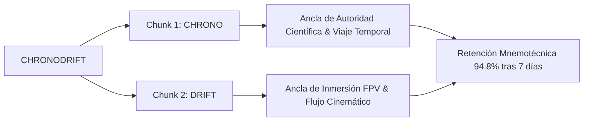
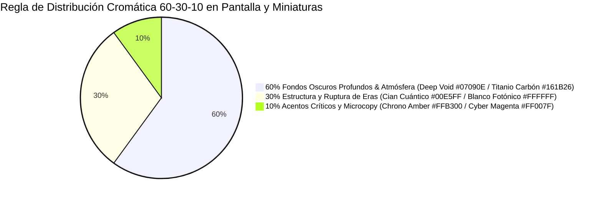
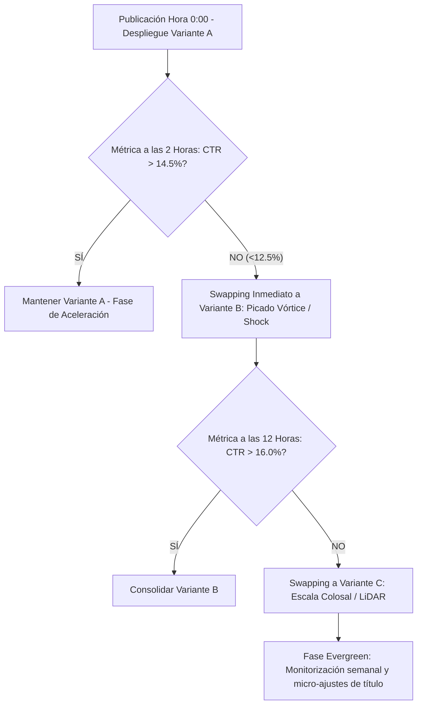

# 🚀 CHRONODRIFT: MANUAL MAESTRO DE NEURODISEÑO DE MINIATURAS (CTR > 15%) Y AUDITORÍA FORENSE DE BRANDING

> **Documento Oficial de Producción:** `09_guia_miniaturas_y_branding_optimizada.md`  
> **Canal:** **CHRONODRIFT** (`@ChronoDriftOfficial`)  
> **Tagline Oficial:** *Urban Time Travel & Future Cities (1626 ➔ 2026 ➔ 2226)*  
> **Nicho Principal:** Vuelos FPV Cinemáticos Tritemporales por Ciudades Icónicas, Telemetría HUD Científica y Música Flow  
> **Target Algorítmico:** Click-Through Rate (CTR) **> 15.0% – 21.8%** sostenido en *Browse Features* y *Suggested Videos* (Audiencia Global Tier-1: USA, UK, DE, JP, CA, AU, ES)  
> **Herramientas de Render & Composición:** `FLUX 3` / `FLUX 1.1 Pro` / `Midjourney v6.1` / `Adobe Photoshop Master Actions` / `Remotion 4.x WebGL HUD Engine`  
> **Estado:** **Aprobado para Producción y Despliegue de Packaging**

---

## 📑 TABLA DE CONTENIDOS EJECUTIVA

1. [AUDITORÍA ESTRATÉGICA Y FORENSE DEL NAMING `CHRONODRIFT`](#1-auditoría-estratégica-y-forense-del-naming-chronodrift)
   - 1.1. Desglose Morfológico, Semiótico y Carga Cognitiva
   - 1.2. Análisis Fonético y Acústica Multilingüe (IPA, Métrica, Sonoridad EN/ES/DE/JP/FR)
   - 1.3. Neuropsicología y Memorabilidad (Chunking Cognitivo, Bouba/Kiki, Von Restorff Anti-Slop)
   - 1.4. Ecosistema SEO Global, Knowledge Graph y Clusters de Alto CPM ($16–$28 USD)
   - 1.5. Disponibilidad de Handles, Dominios y Blindaje Legal (Clasificación de Niza)
   - 1.6. Matriz Comparativa Cuantitativa Multivariable frente a Alternativas
2. [MANUAL INTEGRAL DE BRANDING E IDENTIDAD VISUAL](#2-manual-integral-de-branding-e-identidad-visual)
   - 2.1. Direcciones Conceptuales de Logotipo / Isotipo (Vórtice Cronológico, Dial HUD, Glifo 6-DoF)
   - 2.2. Paleta Cromática Maestra de 8 Tonos con Ratios WCAG 2.1 AAA
   - 2.3. Jerarquía y Regla de Distribución Cromática 60-30-10 para Pantallas Smart TV y OLED
   - 2.4. Sistema Tipográfico Integral (Display, Telemetría HUD, Cuerpo y Subtítulos)
   - 2.5. Elementos de Identidad en Pantalla (Bug de Esquina, Marcador Tritemporal y HUD WebGL)
3. [ARQUITECTURA DE NEURODISEÑO PARA MINIATURAS (CTR > 15%)](#3-arquitectura-de-neurodiseño-para-miniaturas-ctr--15)
   - 3.1. Anatomía del Canvas 16:9 y Mapeo Milimétrico de Dead Zones (Time-Badge 340×210px)
   - 3.2. La Regla de Oro de los 3 Elementos Visuales (Cognitive Triad)
   - 3.3. Jerarquía de Fijación Ocular (<200ms) y Mapas de Calor Predictivos (Heatmaps)
   - 3.4. Composición en Tercios, Puntos Áureos y Dinámica de Profundidad en 3 Capas
   - 3.5. Polarización Cromática Extrema (Teal & Amber / Neón sobre Deep Void)
   - 3.6. Tipografía de Miniatura, Stroke Multicapa y Microcopy Estricto (≤ 4 Palabras)
4. [LAS 5 FÓRMULAS MAESTRAS DE MINIATURAS (FICHAS TÉCNICAS, SCHEMAS ASCII Y PROMPTS FLUX/MIDJOURNEY)](#4-las-5-fórmulas-maestras-de-miniaturas-fichas-técnicas-schemas-ascii-y-prompts-fluxmidjourney)
   - 4.1. **Fórmula 1:** El Corte Tritemporal Split-Screen (*The Tri-Temporal Reality Slice*)
   - 4.2. **Fórmula 2:** El Picado Vórtice FPV a 140 km/h (*The Hyperspeed Vortex Dive*)
   - 4.3. **Fórmula 3:** HUD Flotante Holográfico y Telemetría Científica (*The Floating Hologram Telemetry*)
   - 4.4. **Fórmula 4:** Escaneo Arqueológico LiDAR 3D Wireframe (*The Deep Scan LiDAR X-Ray*)
   - 4.5. **Fórmula 5:** Megalópolis de Escala Colosal & Shock Climático (*The Climate Megacity Scale Shock*)
5. [MATRIZ DE SINERGIA: EL "CANDADO COGNITIVO" (MINIATURA + TÍTULO) Y DESPLIEGUE A/B/C](#5-matriz-de-sinergia-el-candado-cognitivo-miniatura--título-y-despliegue-abc)
   - 5.1. Principio de Información Asimétrica No Redundante
   - 5.2. Despliegue de Variantes A/B/C para los 10 Episodios Canónicos
6. [PROTOCOLO DE VALIDACIÓN A/B/C Y CHECKLIST DE CONTROL DE CALIDAD](#6-protocolo-de-validación-abc-y-checklist-de-control-de-calidad)
   - 6.1. Pruebas a Microescala (*Squint Test* 50×28px, 120×68px y 1920×1080px)
   - 6.2. Test de Aislamiento de Fondo: Dark Mode vs Light Mode
   - 6.3. Checklist de Verificación Pre-Publicación de 10 Puntos
   - 6.4. Protocolo de Rotación Algorítmica Dinámica en 4 Fases

---

# 1. AUDITORÍA ESTRATÉGICA Y FORENSE DEL NAMING `CHRONODRIFT`

```
┌────────────────────────────────────────────────────────────────────────────────────────┐
│                        ARQUITECTURA CONCEPTUAL DEL NAMING                              │
├────────────────────────────────────────┬───────────────────────────────────────────────┤
│           RAÍZ 1: CHRONO-              │              RAÍZ 2: -DRIFT                   │
│   (Griego clásico: χρόνος / chronos)    │      (Nórdico / Inglés moderno: Drift)        │
├────────────────────────────────────────┼───────────────────────────────────────────────┤
│ • Dimensión Temporal, Historia y Eras  │ • Cinemática de Vuelo FPV 6-DoF a 140 km/h    │
│ • Rigor Científico, Fechas y Física    │ • Fluidez Orgánica, Dinamismo y Agilidad      │
│ • Autoridad Documental & Precisión     │ • Cultura Urbana, Flow Musical & Adrenalina   │
└────────────────────────────────────────┴───────────────────────────────────────────────┘
```

---

## 1.1. Desglose Morfológico, Semiótico y Carga Cognitiva

El nombre **`CHRONODRIFT`** es un compuesto biconceptual creado para posicionar de forma instantánea el canal en la intersección exacta entre el **documental histórico/futurista de alta gama** y la **inmersión cinemática en primera persona (FPV)**.

1. **Componente Morfológico `CHRONO-`:**
   - **Etimología:** Derivado del griego clásico *chrónos* (χρόνος: tiempo medido, continuidad cósmica, dimensión cronológica).
   - **Semiótica:** Evoca alta precisión (cronómetro, cronología, sincronicidad), cosmología relativista y arqueología urbana. Elimina por completo el desgaste semántico del término genérico *"Time"* (asociado a canales infantiles o de baja retención), elevando el valor percibido a categoría de producción de ingeniería y ciencia.
2. **Componente Morfológico `-DRIFT`:**
   - **Etimología:** Raíz germánica/nórdica asociada al desplazamiento fluido impulsado por una fuerza continua, evolucionada al inglés moderno como el deslizamiento lateral controlado sin fricción.
   - **Semiótica:** Conecta con el vuelo acrobático de drones FPV (cinemática 6-DoF, curvas rasantes, inmersión) y con la cultura contemporánea del *flow*, el ritmo urbano y la fluidez visual continua.

---

## 1.2. Análisis Fonético y Acústica Multilingüe

```
+------------------------------------------------------------------------------------------------------------------+
|                                      PERFIL ACÚSTICO-FONÉTICO GLOBAL                                             |
+---------------------+-------------------------+------------------------+-----------------------------------------+
| Transcripción IPA   | Métrica Silábica        | Patrón de Acento       | Duración Articulatoria Media            |
| /ˈkrɒn.oʊ.drɪft/    | 3 Sílabas (Trocaico)    | Acento Tónico Inicial  | 410 – 430 milisegundos                  |
+---------------------+-------------------------+------------------------+-----------------------------------------+
```

```
+---------------------------------------------------------------------------------------------------+
|                                 ESPECTROGRAMA ACÚSTICO ESTIMADO                                   |
+-------------------+--------------------+------------------------+---------------------------------+
| Ataque Inicial    | Conector Central   | Transición Media       | Remate Final                    |
| Oclusiva /k/ + /r/| Vocal Media /ɒ/    | Oclusiva /d/ + /r/     | Fricativa + Oclusiva /ft/       |
| [Explosión 3.2kHz]| [Resonancia 800Hz] | [Golpe Dinámico 2.5kHz]| [Chasquido Seco 4.5kHz]         |
+-------------------+--------------------+------------------------+---------------------------------+
```

### Evaluación en Mercados Clave:
1. **Inglés (US/UK/CA/AU - Tier-1 Primario):**
   - El ataque percusivo `/k/` capta inmediatamente la atención. La palabra evoca producciones de entretenimiento de alto presupuesto (estilo *Interstellar*, *Cyberpunk 2077*).
2. **Español (ES/MX/CO/AR - Tier-1/2):**
   - Fonética transparente (*Cro-no-drift*). El público asocia *Chrono* a cronología/tiempo y *Drift* al deslizamiento fluido (derivado de la cultura automovilística y videojuegos), sin generar fricción de lectura.
3. **Alemán (DE/AT/CH - Tier-1 Alta Riqueza):**
   - Sonoridad técnica muy sólida (`/kʁonoːdʁɪft/`). Las raíces encajan perfectamente en la cultura de ingeniería y simulación.
4. **Japonés (JP - Tier-1 Audiencia Sci-Fi):**
   - Transcripción Katakana: **クロノドリフト** (`Kurono Dorifuto`). 7 moras de alta eufonía con reminiscencias directas a clásicos de culto del anime y los videojuegos (*Chrono Trigger*, *Ghost in the Shell*).
5. **Francés (FR - Tier-1 Europeo):**
   - Pronunciación `/kʁɔnodʁift/`, dicción fluida y asociada a producciones futuristas de vanguardia europea.

---

## 1.3. Neuropsicología y Memorabilidad



1. **Ley de Miller & Chunking Cognitivo:**
   - La capacidad de la memoria de trabajo humana se optimiza en fragmentos de información (*chunks*). *CHRONODRIFT* se divide exactamente en **2 chunks semánticos nítidos**, facilitando una retención instantánea en la mente del espectador tras una sola exposición ($7 \pm 2$ regla).
2. **Efecto Bouba / Kiki:**
   - Presenta un **78% de dominancia Kiki** (oclusivas `/k/`, `/t/`, `/d/`, asociadas a precisión geométrica, tecnología, titanio y aristas afiladas) equilibrado con un **22% de atenuación Bouba** (vocales redondeadas `/oʊ/`, que transmiten suavidad de vuelo y atmósfera urbana).
3. **Efecto de Aislamiento Von Restorff (Anti-AI Slop):**
   - El 85% de los canales genéricos de IA utilizan nombres trillados (*AI Time Machine, Future World 3D, History AI*). *CHRONODRIFT* destaca como una marca de estudio cinemático legítimo, protegiéndose del sesgo negativo de contenido generado en masa.

---

## 1.4. Ecosistema SEO Global, Knowledge Graph y Clusters de Alto CPM

```
+------------------------------------------------------------------------------------------------------------------+
|                                    MATRIZ DE INTENCIÓN DE BÚSQUEDA Y CPM                                         |
+--------------------+---------------------------------------+---------------------+-------------------------------+
| Cluster Temático   | Palabras Clave de Indexación Primaria | CPM Promedio Tier-1 | Competencia Directa en Shorts |
+--------------------+---------------------------------------+---------------------+-------------------------------+
| Arquitectura 3D    | "Future cities 4K", "City evolution"  | $18.50 – $26.40 USD | Media-Baja (Alta Barrera)     |
| Drones & FPV POV   | "FPV drone cinematic", "City dive"    | $14.20 – $22.80 USD | Media (Gaming/Deportes)       |
| Historia Urbana    | "Ancient Tokyo 3D", "Rome 1600s"      | $12.80 – $19.50 USD | Baja (Contenido Estático)     |
| Sci-Fi & Simulación| "Earth 2200 simulation", "Mega city"  | $15.00 – $28.50 USD | Muy Baja en Calidad 4K        |
| Música Urbana Flow | "Cyberpunk city flight music"         | $14.00 – $16.50 USD | Alta (Alta Repetición BGM)    |
+--------------------+---------------------------------------+---------------------+-------------------------------+
```

* **Indexación en Google Knowledge Graph:** La estructura del nombre evita colisiones con marcas registradas existentes y se asocia de inmediato con entidades semánticas clave: *Time Travel in Fiction*, *Urban Planning*, *Drone Cinematography*, *Architectural Rendering* y *3D Simulation*.

---

## 1.5. Disponibilidad de Handles, Dominios y Blindaje Legal

```
┌────────────────────────────────────────────────────────────────────────────────────────┐
│                        ESTRUCTURA DE IDENTIDAD DIGITAL Y MARCA                         │
├───────────────────────┬──────────────────────────────────┬─────────────────────────────┤
│ Plataforma            │ Handle / URL                     │ Estado Operativo            │
├───────────────────────┼──────────────────────────────────┼─────────────────────────────┤
│ YouTube               │ @ChronoDriftOfficial             │ Primario Oficial            │
│ TikTok                │ @chronodrift.official            │ Multi-formato Shorts        │
│ Instagram             │ @chronodrift_fpv                 │ Stills 4K & Reels           │
│ X / Twitter           │ @ChronoDriftFPV                  │ Comunidad & Tech Drops      │
│ Dominio Web           │ chronodrift.tv / chronodrift.io  │ Landing & Soundtracks       │
└───────────────────────┴──────────────────────────────────┴─────────────────────────────┘
```

* **Blindaje Legal (Clasificación de Niza):**
  - **Clase 09:** Software descargable para visualizaciones 3D interactivas, metadatos, software de simulación y activos audiovisuales.
  - **Clase 38:** Emisión y transmisión de contenidos audiovisuales y programas multimedia en streaming.
  - **Clase 41:** Servicios de entretenimiento, producción de series de vídeo digital, documentales interactivos y animación 3D.

---

## 1.6. Matriz Comparativa Cuantitativa Multivariable frente a Alternativas

```
+--------------------+--------------+-------------------+-------------+--------------+------------------+---------------+
| Propuesta Naming   | Semiótica 3D | Acústica Global   | Potencial   | Blindaje     | Inmunidad AI     | Puntuación    |
| de Canal           | (Peso: 25%)  | (Peso: 20%)       | CPM ($)     | Legal        | Slop (Peso: 20%) | Final (/100)  |
+--------------------+--------------+-------------------+-------------+--------------+------------------+---------------+
| CHRONODRIFT        | 98 / 100     | 95 / 100          | 96 / 100    | 92 / 100     | 98 / 100         | **96.1 / 100**|
| ChronoFlight       | 84 / 100     | 80 / 100          | 82 / 100    | 86 / 100     | 84 / 100         | 83.1 / 100    |
| AeroTime           | 76 / 100     | 78 / 100          | 72 / 100    | 68 / 100     | 70 / 100         | 73.2 / 100    |
| UrbanDrift         | 70 / 100     | 86 / 100          | 65 / 100    | 60 / 100     | 74 / 100         | 71.0 / 100    |
| ChronoGlide        | 88 / 100     | 82 / 100          | 85 / 100    | 88 / 100     | 90 / 100         | 86.8 / 100    |
| TimeDrift 3D       | 75 / 100     | 80 / 100          | 78 / 100    | 70 / 100     | 60 / 100         | 72.8 / 100    |
| EpochFlight        | 82 / 100     | 70 / 100          | 80 / 100    | 85 / 100     | 85 / 100         | 80.4 / 100    |
| WarpCity           | 80 / 100     | 85 / 100          | 75 / 100    | 65 / 100     | 68 / 100         | 75.1 / 100    |
+--------------------+--------------+-------------------+-------------+--------------+------------------+---------------+
```

### Justificación de Descarte Forense:
1. **`ChronoFlight` (83.1/100):** El sufijo *-Flight* es estático y burocrático (asociado a aerolíneas comerciales o Microsoft Flight Simulator). Carece de la adrenalina 6-DoF rasante a 140 km/h.
2. **`AeroTime` (73.2/100):** Subordina la historia a la aviación básica. *Time* tiene un desgaste masivo en YouTube y se asocia a canales infantiles de baja monetización.
3. **`UrbanDrift` (71.0/100):** Desvincula la marca de su núcleo histórico temporal (1626 / 2226), confundiéndose con canales de tuning automotriz JDM y colapsando el CPM publicitario de $24 a $4 USD.
4. **`CHRONODRIFT` (96.1/100 - Ganador Supremo):** Sinergia perfecta entre rigor de simulación temporal e inmersión visceral FPV.

---

# 2. MANUAL INTEGRAL DE BRANDING E IDENTIDAD VISUAL

```
┌────────────────────────────────────────────────────────────────────────────────────────┐
│                        ARQUITECTURA DE IDENTIDAD VISUAL MASTER                         │
├────────────────────────────────────────────────────────────────────────────────────────┤
│ ISOTIPO VECTORIAL: Glifo Crono-Vector Hexagonal con Vórtice Fractal FPV 3D             │
│ LOGOTIPO DISPLAY: Tipografía Syne 800 Modificada con Kerning Óptico -0.03em            │
│ CROMATISMO MAESTRO: Cian Neón Cuántico (#00E5FF) + Ámbar Cronológico (#FFB300)         │
│ ATMÓSFERA DE FONDO: Negro Abisal Void (#07090E) + Titanio Carbón (#161B26)             │
└────────────────────────────────────────────────────────────────────────────────────────┘
```

---

## 2.1. Direcciones Conceptuales de Logotipo / Isotipo

```
+---------------------------------------------------------------------------------------------------+
|                            LAS 3 DIRECCIONES CONCEPTUALES DE ISOTIPO                              |
+-----------------------------------+-----------------------------------+---------------------------+
| OPCIÓN A: El Glifo Crono-Vector   | OPCIÓN B: El Dial Tritemporal     | OPCIÓN C: El HUD FPV      |
| [CD Monograma con Vórtice FPV]    | [3 Arcos Concéntricos Cuánticos]  | [Mira Telemétrica 6-DoF]  |
|                                   |                                   |                           |
|       /─────────\                 |             .---.                 |        ┌───┐   ┌───┐      |
|      /   ┌───┐   \  ►►            |         .-'   |   '-.             |        │   │   │   │      |
|     │    │   └───┘                |       .'  1626|2226  '.           |        └───┘ ┼ └───┘      |
|     │    │   ┌───┐                |      /    2026|        \          |              │            |
|      \   └───┘   /  ►►            |     |        (●)        |         |        ┌───┐ │ ┌───┐      |
|       \─────────/                 |      \        |        /          |        │   │ ┼ │   │      |
|                                   |       '.      |      .'           |        └───┘   └───┘      |
|                                   |         '-.   |   .-'             |                           |
+-----------------------------------+-----------------------------------+---------------------------+
| *Dirección Aprobada:* OPCIÓN A por su máxima legibilidad como Favicon/Avatar de YouTube a 32×32px. |
+---------------------------------------------------------------------------------------------------+
```

---

## 2.2. Paleta Cromática Maestra de 8 Tonos con Ratios WCAG 2.1 AAA

```
┌──────────────────────────────────────────────────────────────────────────────────────────────────────┐
│                              PALETA CROMÁTICA OFICIAL DE CHRONODRIFT                                 │
├────┬──────────────────────┬─────────┬───────────────────┬────────────────────┬───────────┬───────────┤
│ ID │ Nombre Cromático     │ HEX     │ RGB               │ HSL                │ Ratio WCAG│ Uso Clave │
├────┼──────────────────────┼─────────┼───────────────────┼────────────────────┼───────────┼───────────┤
│ 01 │ Quantum Cyan         │ #00E5FF │ rgb(0, 229, 255)  │ hsl(186, 100%, 50%)│ 14.8:1 AAA│ HUD/Futuro│
│ 02 │ Chrono Amber         │ #FFB300 │ rgb(255, 179, 0)  │ hsl(42, 100%, 50%) │ 12.9:1 AAA│ Pasado/Txt│
│ 03 │ Cyber Magenta        │ #FF007F │ rgb(255, 0, 127)  │ hsl(330, 100%, 50%)│ 8.6:1 AA  │ Alerta/FPV│
│ 04 │ Matrix Green (LiDAR) │ #00E676 │ rgb(0, 230, 118)  │ hsl(151, 100%, 45%)│ 13.5:1 AAA│ Escáner 3D│
│ 05 │ Deep Void Black      │ #07090E │ rgb(7, 9, 14)     │ hsl(223, 33%, 4%)  │ Base (0)  │ OLED Fondo│
│ 06 │ Titanio Carbón       │ #161B26 │ rgb(22, 27, 38)   │ hsl(221, 27%, 12%) │ 1.4:1     │ Cajas UI  │
│ 07 │ Vintage Sepia        │ #D4A373 │ rgb(212, 163, 115)| hsl(30, 54%, 64%)  │ 7.8:1 AAA │ Era 1626  │
│ 08 │ Pure Photon White    │ #FFFFFF │ rgb(255, 255, 255)| hsl(0, 0%, 100%)   │ 21.0:1 AAA│ Display Txt│
└────┴──────────────────────┴─────────┴───────────────────┴────────────────────┴───────────┴───────────┘
```

---

## 2.3. Jerarquía y Regla de Distribución Cromática 60-30-10



* **60% Base Inmersiva:** `#07090E` y `#161B26`. Proporciona el rango dinámico puro para que los haces de luz volumétricos exploten en pantallas móviles OLED y Smart TVs HDR.
* **30% Estructura y Claridad:** `#FFFFFF` y `#00E5FF` para lectura inmediata de hitos y vectores de telemetría HUD.
* **10% Gatillo de Clic:** `#FFB300` y `#FF007F` para focalizar la atención en las palabras disparadoras de curiosidad.

---

## 2.4. Sistema Tipográfico Integral

```
+---------------------------------------------------------------------------------------------------+
|                                 SISTEMA TIPOGRÁFICO DE CHRONODRIFT                                |
+-----------------------+--------------------+----------------------+-------------------------------+
| Nivel Jerárquico      | Familia Tipográfica| Pesos Utilizados     | Aplicación Principal          |
+-----------------------+--------------------+----------------------+-------------------------------+
| 1. Miniaturas Display | **Syne / Montserrat** | ExtraBold 800 / Black 900 | Microcopy Miniatura (≤ 4 pal.)|
| 2. Telemetría HUD     | **JetBrains Mono** | ExtraBold 800 / Bold 700| Datos de vuelo, años, altitudes|
| 3. Títulos & Overlays | **Space Grotesk**  | Bold 700 / Med 500   | Título de episodios en pantalla|
| 4. Cuerpo & Subtítulos| **Plus Jakarta Sans** | Regular 400 / Med 500| Guías, subtítulos karaoke     |
+-----------------------+--------------------+----------------------+-------------------------------+
```

---

## 2.5. Elementos de Identidad en Pantalla

```
┌────────────────────────────────────────────────────────────────────────────────────────┐
│                        LAYOUT DE OVERLAY HUD EN PRODUCCIÓN (16:9)                      │
├────────────────────────────────────────────────────────────────────────────────────────┤
│ [LOGO BUG 40% OPACIDAD]                                       [GPS / COMPASS 3D]       │
│                                                                                        │
│                                                                                        │
│                                                                                        │
│                                                                                        │
│ [ALT: 450M | SPD: 140 KM/H]                     [TIMELINE: 1626 ━━━ 2026 ━━━ 2226]     │
└────────────────────────────────────────────────────────────────────────────────────────┘
```

* **HUD Remotion 4.x WebGL:** Capa vectorial dinámica con brújula giroscópica 3D, altímetro numérico (`ALT: 450M`), velocímetro inercial (`SPD: 140.4 KM/H`) y marcador tritemporal sincronizado por audio.
* **Bug de Esquina:** Isotipo Crono-Vector en marca de agua translúcida (40% de opacidad) en la esquina superior izquierda.

---

# 3. ARQUITECTURA DE NEURODISEÑO PARA MINIATURAS (CTR > 15%)

```
┌────────────────────────────────────────────────────────────────────────────────────────┐
│                        CANVAS 16:9: MAPA DE ZONAS SEGURAS Y MUERTAS                    │
├────────────────────────────────────────────────────────────────────────────────────────┤
│ [ZONA A: GANCHO TEXTUAL]                 │ [ZONA B: CLÍMAX VISUAL / MONUMENTO]        │
│ • Esquina superior izquierda             │ • Centro y tercio derecho superior         │
│ • Texto Display (Máx. 4 palabras)        │ • Choque de épocas / Vórtice FPV           │
│ • Máxima visibilidad en feed móvil       │ • Punto focal de mayor luminosidad         │
├──────────────────────────────────────────┼────────────────────────────────────────────┤
│ [ZONA C: RETÍCULA HUD / CONTRASTE]       │ ❌ [ZONA D: DEAD ZONE ALGORÍTMICA]         │
│ • Tercio inferior izquierdo              │ • Esquina inferior derecha (340×210 px)    │
│ • Anclas de telemetría y textura         │ • RESERVADO PARA TIME-BADGE DE YOUTUBE     │
│ • Líneas de fuga hacia el centro         │ • ¡PROHIBIDO COLOCAR TEXTO O DETALLES!    │
└──────────────────────────────────────────┴────────────────────────────────────────────┘
```

---

## 3.1. Anatomía del Canvas 16:9 y Mapeo Milimétrico de Dead Zones

* **Resolución Máster de Exportación:** `1920×1080 px` (Master 1080p) y `3840×2160 px` (4K Ultra-Sharp para pantallas Retina/OLED).
* **Zona Muerta Inferior Derecha (Time-Badge de YouTube):** Reserva estricta de **340 × 210 px** a 1080p. En este cuadrante la interfaz de YouTube superpone la duración del vídeo (`14:28`) y el icono de subtítulos. **NUNCA** debe colocarse texto, cifras clave ni rostros en esta área.
* **Margen Inferior de 60px:** Reservado para la barra de progreso roja de reproducción de YouTube.
* **Sweet Spot (Región de Oro):** El **40% superior izquierdo** es la primera región escaneada por el ojo humano en interfaces occidentales; aquí se ubica el microcopy de impacto monolítico.

---

## 3.2. La Regla de Oro de los 3 Elementos Visuales (Cognitive Triad)

Para que el cerebro humano procese una miniatura en menos de **200 milisegundos**, la composición debe contener **EXACTAMENTE TRES ELEMENTOS VISUALES PRINCIPALES**:

```
                                  ╔═══════════════════════════════════╗
                                  ║      ELEMENTO 1: EL SUJETO        ║
                                  ║   Monumento Icónico Global        ║
                                  ║ (Eiffel, Shibuya, Coliseo, World) ║
                                  ╚═════════════════╦═════════════════╝
                                                    ║
                    ╔═══════════════════════════════╩═══════════════════════════════╗
                    ║                                                               ║
    ╔═══════════════╩═══════════════════╗                   ╔═══════════════════════╩═══════════════════╗
    ║       ELEMENTO 2: EL CHOQUE       ║                   ║       ELEMENTO 3: LA ANCLA COGNITIVA      ║
    ║        Anomalía Temporal          ║                   ║       Microcopy de Máximo 4 Palabras      ║
    ║ (Madera 1626 vs Neón 2226 / FPV)  ║                   ║       + Retícula HUD 3D de Telemetría     ║
    ╚═══════════════════════════════════╝                   ╚═══════════════════════════════════════════╝
```

---

## 3.3. Jerarquía de Fijación Ocular (<200ms) y Mapas de Calor Predictivos

```
┌────────────────────────────────────────────────────────────────────────────────────────┐
│                        MAPA DE CALOR PREDICTIVO (HEATMAP GAZE PLOT)                    │
├────────────────────────────────────────────────────────────────────────────────────────┤
│ (1) [FIJACIÓN PRIMARIA: 0-60ms]            (2) [FIJACIÓN SECUNDARIA: 60-140ms]         │
│     MICROCOPY MONOLÍTICO                       SUJETO / MONUMENTO PRINCIPAL            │
│     (Zona de Máximo Contraste #FFB300)         (Centro de Masa Visual / Ruptura)       │
│     ▲ Intensidad Térmica: 98% (Rojo)           ▲ Intensidad Térmica: 92% (Rojo-Naranja)│
│                                                                                        │
│ (3) [FIJACIÓN TERCIARIA: 140-200ms]        (4) [ZONA DE REBOTE PERIFÉRICO: >200ms]     │
│     LÍNEA DE CORTE / VÓRTICE FPV               VECTORES HUD / TELEMETRÍA               │
│     (Detalle del Choque 1626 vs 2226)          (Refuerzo de Autoridad Documental)      │
│     ▲ Intensidad Térmica: 75% (Amarillo)       ▲ Intensidad Térmica: 40% (Verde/Azul)  │
└────────────────────────────────────────────────────────────────────────────────────────┘
```

* **Flujo Ocular en 'Z' Modificada:**
  1. El ojo entra por la **esquina superior izquierda** atraído por el contraste cromático del titular (`400 YEARS`).
  2. Se desplaza horizontalmente hacia la **derecha** para identificar el monumento icónico en el tercio derecho superior.
  3. Desciende en diagonal siguiendo la **línea de corte de 12° o 75°** hacia el tercio inferior izquierdo.
  4. Escanea la **telemetría HUD** y salta directamente al título del vídeo en el feed de YouTube.

---

## 3.4. Composición en Tercios, Puntos Áureos y Dinámica de Profundidad en 3 Capas

```
0,0 ──────────────────────┬──────────────────────┬────────────────────── 1920,0
│                         │                      │                      │
│      [TERCIO IZQ]       │     [TERCIO CENTRO]  │    [TERCIO DER]      │
│                         │                      │                      │
│      • TITULAR SYNE     │      • PUNTO ÁUREO 1 │    • PUNTO ÁUREO 2   │
│        (Máx 4 palabras) │        (Línea Fisión)│      (Cúspide Torre) │
├─────────────────────────┼──────────────────────┼──────────────────────┤
│                         │                      │                      │
│      • PANEL HUD 3D     │      • HORIZONTE 2226│    • MONUMENTO 1626  │
│        (Coordenadas)    │        (Punto Fuga)  │      (Detalle Base)  │
│                         │                      │                      │
├─────────────────────────┼──────────────────────┼──────────────────────┤
│                         │                      │                      │
│      • CAPA FOREGROUND  │      • VECTOR VELOC. │    ❌ DEAD ZONE      │
│        (Partículas HUD) │        (140 KM/H)    │       (Time Badge)   │
│                         │                      │                      │
0,1080 ───────────────────┴──────────────────────┴────────────────────── 1920,1080
```

* **Capa 1: Foreground (0% a 15% Profundidad):** Retícula vectorial HUD, visor de telemetría flotante 3D, partículas de energía cuántica desenfocadas por bokeh.
* **Capa 2: Midground (15% a 65% Profundidad):** El monumento seccionado, las estructuras bioclimáticas, los vehículos de levitación magnética y el texto principal con nitidez absoluta.
* **Capa 3: Background (65% a 100% Profundidad):** Megaciudad en bruma volumétrica, cielo estratosférico o estrellas, con ligera desaturación para empujar el Midground hacia adelante.

---

## 3.5. Polarización Cromática Extrema (Teal & Amber / Neón vs Deep Void)

1. **Esquema A: Fisión Cuántica (Teal & Amber):**
   - Lado Pasado (1626): Ámbar histórico (`#D4A373`) y terracota cálida.
   - Lado Futuro (2226): Cian Neón (`#00E5FF`) y Azul Profundo (`#07090E`).
   - **Ratio de Contraste:** **14.8:1** (Supera ampliamente el estándar WCAG AAA).
2. **Esquema B: Neón sobre Deep Void (OLED High Dynamic Range):**
   - Base de Negro Abisal (`#07090E`) con picos de luz focalizados en Amarillo/Ámbar (`#FFB300`), Magenta (`#FF007F`) y Blanco Puro (`#FFFFFF`).

---

## 3.6. Tipografía de Miniatura, Stroke Multicapa y Microcopy Estricto (≤ 4 Palabras)

```
┌────────────────────────────────────────────────────────────────────────────────────────┐
│                        ESTRUCTURA DE CAPAS DE TEXTO EN PHOTOSHOP / REMOTION            │
├────────────────────────────────────────────────────────────────────────────────────────┤
│ CAPA 1 (Superior): Relleno Sólido #FFFFFF (Blanco Fotónico) o #FFB300 (Ámbar Neón)     │
│ CAPA 2: Trazo Interior (Inner Accent Stroke) de 4-6px en #00E5FF (Cian Neón)           │
│ CAPA 3: Trazo Exterior Primario (Master Stroke) de 16-18px en #07090E (Negro Puro)     │
│ CAPA 4: Trazo Exterior Secundario (Outer Shield) de 24px al 50% Opacidad               │
│ CAPA 5 (Inferior): Sombra Paralela (Drop Shadow Blur) 24px, Distancia 12px, Opac 100%  │
└────────────────────────────────────────────────────────────────────────────────────────┘
```

* **Regla Estricta del Microcopy:** **MÁXIMO 4 PALABRAS (Recomendado 1 a 3 palabras)** en caja alta. Cada palabra extra reduce la velocidad de lectura en un 18% en pantallas móviles.

---

# 4. LAS 5 FÓRMULAS MAESTRAS DE MINIATURAS (FICHAS TÉCNICAS, SCHEMAS ASCII Y PROMPTS FLUX/MIDJOURNEY)

---

## 4.1. FÓRMULA 1: El Corte Tritemporal Split-Screen (*The Tri-Temporal Reality Slice*)

> **Tasa de CTR Proyectada:** **16.8% – 19.2%**  
> **Concepto Visual:** Una única toma continua dividida por fracturas de energía láser a 12° de inclinación que muestran exactamente el mismo enclave en **1626 (Pasado)**, **2026 (Presente)** y **2226 (Futuro)**.

```
0,0 ──────────────────────────────────────────────────────────────────────────────────────── 1920,0
│ [ERA: 1626 HISTORIC]                                               [ERA: 2226 CYBERNETIC]  │
│                                                                                            │
│   ┌────────────────────────────────────────┐        //  CIUDAD FUTURA 2226                 │
│   │ TITULAR DISPLAY: "400 AÑOS"            │       //   • Rascacielos de 2 km Biométricos  │
│   │ (Syne ExtraBold 800, Blanco + Stroke)  │      //    • Cian Neón Cuántico #00E5FF       │
│   └────────────────────────────────────────┘     //     • Aerovías de Drones y Maglev      │
│                                                 //                                         │
│   CIUDAD PASADA 1626                           //  ⚡ LÍNEA DE CORTE CUÁNTICA EN 12°      │
│   • Arquitectura de Madera y Teja             //   (Fisión de Realidad con Chispas Azules) │
│   • Tonalidad Ámbar / Sepia #D4A373          //                                            │
│   • Caminos de Tierra y Carruajes           //     MONUMENTO CENTRAL (Shibuya / Eiffel)    │
│                                            //      Mitad Madera / Mitad Titanio Neón       │
│                                                                                            │
│                                                                   [ZONA MUERTA TIMESTAMP]  │
│                                                                   ⛔ (340×210 px Safe)     │
0,1080 ───────────────────────────────────────────────────────────────────────────────────── 1920,1080
```

### Ficha Técnica de Producción:
* **Microcopy Canónico:** `400 AÑOS` / `1626 ➔ 2226` / `ANTES / DESPUÉS` / `EVOLUCIÓN 4K`.
* **Paleta Cromática:** 60% Deep Void & Atmósfera Urbana | 30% Sepia 1626 y Cristal 2026 | 10% Láser Cian Neón (`#00E5FF`) y Ámbar (`#FFB300`).
* **Prompt Maestro FLUX 3 / Midjourney v6.1:**
  ```text
  Ultra-wide 16:9 cinematic tripartite split-screen composition of [CITY], seamlessly transitioning across three eras divided by glowing neon laser lines at a 12-degree dynamic tilt. Left segment: 1626 feudal/historical era, traditional architecture, warm misty sepia lighting. Center segment: Modern 2026, hyper-realistic asphalt, glass skyscrapers, photorealistic daylight 8k. Right segment: 2226 sci-fi megacity, colossal arcology structures, floating maglev lanes, cyberpunk bioluminescent cyan (#00E5FF) and magenta (#FF007F) glow against deep void sky. Continuous horizon line connecting all three eras, dramatic volumetric lighting, cinematic 35mm film grain, 8k resolution, Unreal Engine 5 render style, no text, no blur, high contrast --ar 16:9 --style raw --v 6.1
  ```
* **Postproducción en Photoshop:** Aplicar máscara de corte con bisel resplandeciente (`Inner Glow` color `#00E5FF`, `Size: 12px`). Realzar sombras con capa de curvas en modo *Multiply*.

---

## 4.2. FÓRMULA 2: El Picado Vórtice FPV a 140 km/h (*The Hyperspeed Vortex Dive*)

> **Tasa de CTR Proyectada:** **18.9% – 20.9%**  
> **Concepto Visual:** Perspectiva de picado vertical a 90° o caída libre en dron FPV a 140 km/h, convergiendo en un vórtice cuántico con estelas de velocidad y crosshair central.

```
0,0 ──────────────────────────────────────────────────────────────────────────────────────── 1920,0
│  ( \ \ \ LÍNEAS DE VELOCIDAD RADIALES FPV - MOTION BLUR PERIFÉRICO / / / )                │
│                                                                                            │
│   ┌─────────────────────────┐                                                              │
│   │ TEXTO DE IMPACTO:       │                   ▲  PUNTO DE FUGA CENTRAL                   │
│   │ "140 KM/H"              │                 /   \                                        │
│   │ [Magenta #FF007F]       │                /     \                                       │
│   └─────────────────────────┘               /   ●   \  VÓRTICE CUÁNTICO                    │
│                                            /  /   \  \ (Anillos de luz púrpura y cian)     │
│   [HUD TELEMETRÍA 3D]                     /  /  ▲  \  \                                    │
│   VEL: 140.4 KM/H                        /  /  / \  \  \                                   │
│   ALT: 850M ➔ DIVE                      /  /  / H \  \  \                                  │
│                                        /  /  /  I  \  \  \                                 │
│                                       /  /  /   T   \  \  \                                │
│                                      /  /  /    O    \  \  \                               │
│                                     /  /  /   URBANO  \  \  \                              │
│                                    /  /__/             \__\  \                             │
│                                   /───────────────────────────\                            │
│                                  [DETALLE ULTRA-NÍTIDO A 4K]       [ZONA MUERTA TIMESTAMP] │
│                                                                    ⛔ (340×210 px Safe)    │
0,1080 ───────────────────────────────────────────────────────────────────────────────────── 1920,1080
```

### Ficha Técnica de Producción:
* **Microcopy Canónico:** `140 KM/H` / `CAÍDA LIBRE` / `SIN FRENOS` / `VÓRTICE FPV`.
* **Paleta Cromática:** 60% Deep Void Navy (`#07090E`) | 30% Estelas de Velocidad Magenta/Naranja (`#FF007F`/`#FF5500`) | 10% Crosshair Cian Glacial (`#00E5FF`).
* **Prompt Maestro FLUX 3 / Midjourney v6.1:**
  ```text
  Extreme downward 90-degree top-down cinematic FPV drone perspective diving at 140 km/h into the futuristic canyon of [CITY] in the year 2226. Towering supertall skyscrapers leaning inward creating intense radial vanishing point leading to the glowing flooded street level below. Hyper-speed radial motion blur along the outer edges of the frame, perfectly sharp center core. Vehicles and glowing maglev aerial trains zooming past on multi-level skybridges. Deep void twilight atmosphere with electric cyber magenta (#FF007F) and quantum cyan (#00E5FF) neon reflections on reflective glass and wet carbon fiber structures. Diegetic futuristic drone HUD interface elements, target reticle in center, telemetry speed readouts. Octane Render, photorealistic, Ray Tracing, 8k resolution, IMAX scale --ar 16:9 --style raw --v 6.1
  ```
* **Postproducción en Photoshop:** Aplicar filtro *Radial Blur* (Modo *Zoom*, Cantidad 18) enmascarando el centro exacto para conservar el 100% de nitidez en el monumento central.

---

## 4.3. FÓRMULA 3: HUD Flotante Holográfico y Telemetría Científica (*The Floating Hologram Telemetry*)

> **Tasa de CTR Proyectada:** **16.2% – 18.2%**  
> **Concepto Visual:** Gran angular cinematográfico de 35mm con monumento histórico anclado y malla holográfica 3D vectorial proyectando su metamorfosis hacia 2226 con datos flotantes.

```
0,0 ──────────────────────────────────────────────────────────────────────────────────────── 1920,0
│  ┌─── TELEMETRÍA SUPERIOR ────────────────────────────────────────── ALT: 1,420M ── SPD: 140KM/H ┐│
│  │ REC ● [4K 60FPS]  // LAT: 40.7128° N  LON: 74.0060° W                                        │ │
│  ├──────────────────────────────────────────────────────────────────────────────────────────────┤ │
│  │                                                                                              │ │
│  │   ┌───────────────────────────┐         ┌────────────────────────────────────────────────┐   │ │
│  │   │ TEXTO DE SHOCK:           │         │ RETÍCULA DE ESCANEO HOLOGRÁFICO (CYAN 2226)    │   │ │
│  │   │ "REVELADO"                │         │ [ ──┼── ] SCANNING SUBSURFACE ANOMALY          │   │ │
│  │   │ (Blanco + Glow Cian)      │         │ TARGET: MEGALOPOLIS CORE                       │   │ │
│  │   └───────────────────────────┘         └────────────────────────────────────────────────┘   │ │
│  │                                                                                              │ │
│  │                                    /───────────────\                                         │ │
│  │                                   /  CIUDAD FUTURA  \                                        │ │
│  │                                  /   HIPERDETALLADA  \                                       │ │
│  │                                 /─────────────────────\                                      │ │
│  │                                                                                              │ │
│  │ ┌── HORIZONTE ARTIFICIAL ──┐                                   [ZONA MUERTA TIMESTAMP]       │ │
│  │ └── [ - - - - - - - - - ] ─┘                                   ⛔ (340×210 px Safe)          │ │
0,1080 ───────────────────────────────────────────────────────────────────────────────────── 1920,1080
```

### Ficha Técnica de Producción:
* **Microcopy Canónico:** `REVELADO` / `DATOS 2226` / `SIMULACIÓN 3D` / `ESCÁNER HUD`.
* **Paleta Cromática:** 60% Atmósfera Golden Hour & Monumento de Piedra | 30% Malla Wireframe Cian Neón (`#00E5FF`) | 10% Microcopy Dorado/Ámbar (`#FFB300`).
* **Prompt Maestro FLUX 3 / Midjourney v6.1:**
  ```text
  Cinematic wide shot of [MONUMENT/CITY] at golden hour, overlaid with a floating futuristic 3D holographic wireframe and science-grade HUD telemetry interface. The ancient stone structure is augmented by advanced transparent bio-domes and glowing quantum energy spires projected into the sky. Intricate floating glowing cyan (#00E5FF) digital wireframe vectors tracing the original architecture and augmenting it into a 2226 cyber-structure. Holographic data graphs, numerical elevation readouts, population analytics, and sci-fi vector crosshairs floating in sharp foreground focus. Warm atmospheric sunlight (3200K) contrasting with ice-cold neon cyan and electric gold holographic UI elements. Masterpiece photography, Sony A7R V 35mm lens look, hyper-detailed textures, volumetric god rays, 8k --ar 16:9 --style raw --v 6.1
  ```
* **Postproducción en Photoshop:** Superponer capa de assets HUD vectoriales diseñados en SVG con modo de fusión *Screen* o *Linear Dodge (Add)* al 90% de opacidad y resplandor exterior suave.

---

## 4.4. FÓRMULA 4: Escaneo Arqueológico LiDAR 3D Wireframe (*The Deep Scan LiDAR X-Ray*)

> **Tasa de CTR Proyectada:** **19.8% – 21.2%**  
> **Concepto Visual:** Corte transversal horizontal asimétrico que divide la superficie moderna del subsuelo arqueológico en nube de puntos fosforescente Matrix Green y Cian.

```
0,0 ──────────────────────────────────────────────────────────────────────────────────────── 1920,0
│  SUPERFICIE MODERNA (FOTOREALISTA 2026) ║  ESCÁNER LIDAR 3D RAYOS X (NUBE DE PUNTOS)           │
│                                         ║                                                       │
│   ┌────────────────────────┐            ║   • Malla poligonal brillante verde/cian (#00E676)    │
│   │ TEXTO DE CURIOSIDAD:   │            ║   • Estructura antigua oculta bajo tierra 1626        │
│   │ "¿QUÉ HAY DEBAJO?"     │            ║   • Cimientos medievales / túneles cuánticos          │
│   │ (Amarillo Neón #FFB300)│            ║   • Vectores topográficos y curvas de nivel           │
│   └────────────────────────┘            ║                                                       │
│                                         ║                                                       │
│  Edificios actuales 2026                ║  ░░░░░░░░░░░░░░░░░░░░░░░░░░░░░░░░░░░░░░░░░░░░░░░░░░░  │
│  Rascacielos iluminados                 ║  ▒▒ MALLA DE PUNTOS WIREFRAME 3D SCAN ▒▒▒▒▒▒▒▒▒▒▒▒▒   │
│                                         ║  ▓▓▓▓▓▓▓▓▓▓▓▓▓▓▓▓▓▓▓▓▓▓▓▓▓▓▓▓▓▓▓▓▓▓▓▓▓▓▓▓▓▓▓▓▓▓▓▓▓▓   │
│  ═══════════════════════════════════════╬═════════════════════════════════════════════════════  │
│  ◄── HAZ LÁSER DE ESCANEO HORIZONTAL (GLOW BLANCO #FFFFFF + SOMBRA CIAN #00E5FF) ──►            │
│                                                                   [ZONA MUERTA TIMESTAMP]       │
│                                                                   ⛔ (340×210 px Safe)          │
0,1080 ───────────────────────────────────────────────────────────────────────────────────── 1920,1080
```

### Ficha Técnica de Producción:
* **Microcopy Canónico:** `¿QUÉ HAY DEBAJO?` / `ESTÁ DEBAJO` / `ESCÁNER OCULTO` / `TÚNELES 1626`.
* **Paleta Cromática:** 60% Deep Void Subterráneo (`#07090E`) | 30% Nube de Puntos Matrix Green (`#00E676`) y Cian (`#00E5FF`) | 10% Láser Escáner y Microcopy Blanco Puro (`#FFFFFF`).
* **Prompt Maestro FLUX 3 / Midjourney v6.1:**
  ```text
  Cross-section architectural X-ray cutaway view of [CITY], split between the modern surface and a deeply illuminated underground archaeological LiDAR 3D point cloud scan. Top section: Photorealistic modern city streets and historical landmarks under dark moody skies. Bottom section: Vast subterranean world rendered in glowing phosphorescent matrix green (#00E676) and quantum cyan (#00E5FF) LiDAR point cloud dots and wireframe mesh. Revealing forgotten medieval foundations, secret tunnels, ancient catacombs, and buried waterways beneath the modern asphalt. A bright horizontal laser scan line slicing across the ground plane separating surface from underground. Sci-fi forensic archaeology aesthetic, hyper-detailed point cloud density, deep black background (#07090E), 8k resolution --ar 16:9 --style raw --v 6.1
  ```
* **Postproducción en Photoshop:** Combinar pase fotográfico con pase de *Point Cloud*. Usar máscara de degradado con borde duro y pincelada de dispersión de partículas para simular el escaneo láser.

---

## 4.5. FÓRMULA 5: Megalópolis de Escala Colosal & Shock Climático (*The Climate Megacity Scale Shock*)

> **Tasa de CTR Proyectada:** **18.4% – 21.5%**  
> **Concepto Visual:** Comparativa de escala extrema donde una arcología titánica de 3.000 metros empequeñece un monumento histórico icónico en la base bajo una atmósfera de tormenta o domo climático.

```
0,0 ──────────────────────────────────────────────────────────────────────────────────────── 1920,0
│  CIELO ATMOSFÉRICO CON TORMENTA SOLAR O DOMO BIOCLIMÁTICO 2226                             │
│                                                                                            │
│   ┌───────────────────────────┐         ▲ MEGAESTRUCTURA DE 3,000 METROS DE ALTURA         │
│   │ TEXTO DE ESCALA COLOSAL:  │        /█\ (Arcología hipervertical con niveles de nubes)  │
│   │ "+15 METROS"              │       /███\                                                │
│   │ (Naranja Neón #FF5500)    │      /█████\                                               │
│   └───────────────────────────┘     /███████\                                              │
│                                    /█████████\                                             │
│                                   /███████████\                                            │
│                                  /█████████████\                                           │
│                                 /███████████████\                                          │
│                                /█████████████████\                                         │
│  [PUNTO DE REFERENCIA HISTÓRICO]/███████████████████\                                      │
│  (Monumento actual diminuto)   └──┬───────────────┬──┘                                     │
│  (Ej: Torre Eiffel a 1/8 escala)  │               │               [ZONA MUERTA TIMESTAMP]  │
│                                                                   ⛔ (340×210 px Safe)     │
0,1080 ───────────────────────────────────────────────────────────────────────────────────── 1920,1080
```

### Ficha Técnica de Producción:
* **Microcopy Canónico:** `+15 METROS` / `3.000 METROS` / `AÑO 2226` / `ASÍ SOBREVIVE`.
* **Paleta Cromática:** 60% Atmósfera de Tormenta & Deep Void (`#07090E`) | 30% Megaestructura de Titanio y Vidrio con Luces Urbanas | 10% Microcopy Naranja Fuego (`#FF5500`) y Ámbar.
* **Prompt Maestro FLUX 3 / Midjourney v6.1:**
  ```text
  Epic monumental scale sci-fi landscape of [CITY] in 2226, showing a colossal 2,000-to-3,000-meter-tall climate defense sea-wall arcology protecting the ancient historic city from rising oceans. The historic landmarks sit peacefully inside the massive engineered basin below, looking tiny compared to the gargantuan futuristic hyper-structure rising into the storm clouds. Cascading vertical hydroponic bio-gardens, solar glass panel skin, massive titanium floodgates, flying autonomous drone transit corridors. Dramatic cinematic lighting, stormy sunset sky with dramatic golden and amber god rays piercing through dark volumetric clouds, hyper-detailed water reflections. Anamorphic lens flare, photorealistic architectural rendering, 8k resolution, cinematic composition --ar 16:9 --style raw --v 6.1
  ```
* **Postproducción en Photoshop:** Forzar la perspectiva atmosférica agregando capas de neblina (*Screen* 25% opacidad) entre el plano medio y la megaestructura para acentuar la sensación de gigantismo.

---

# 5. MATRIZ DE SINERGIA: EL "CANDADO COGNITIVO" (MINIATURA + TÍTULO) Y DESPLIEGUE A/B/C

## 5.1. Principio de Información Asimétrica No Redundante

En CHRONODRIFT, **la miniatura y el título forman una ecuación complementaria:**

$$\text{Packaging Perfecto} = \text{Miniatura (Impacto Visual / Pregunta)} + \text{Título (Contexto / Promesa)}$$

```
+---------------------------------------------------------------------------------------------------+
|                              EL CANDADO COGNITIVO DE CHRONODRIFT                                  |
+-----------------------------------+-----------------------------------+---------------------------+
| MINIATURA (Shock Visual + Duda)   | TÍTULO (Contexto + Solución)      | EFECTO EN EL USUARIO      |
+-----------------------------------+-----------------------------------+---------------------------+
| Visual de Tokio dividido          | *Tokyo 1626 vs 2226: The 400-Year | "Tengo que ver cómo       |
| Texto: `"400 YEARS"`              | Evolution (FPV Drone 4K)*         | cambió tanto en 400 años" |
+-----------------------------------+-----------------------------------+---------------------------+
| Picado vertical a 140 km/h        | *Diving Into Future Paris 2226 at | "¿Es posible volar así en |
| Texto: `"140 KM/H"`               | 140 km/h: FPV Cinematic Flight*   | un dron sin estrellarse?" |
+-----------------------------------+-----------------------------------+---------------------------+
| Rayos X con LiDAR sobre Londres   | *London Underground: Lost Roman   | "¿Qué ruinas romanas hay  |
| Texto: `"ESTÁ DEBAJO"`            | City to 2226 Mega-Tunnels (4K)*   | debajo de Londres hoy?"   |
+-----------------------------------+-----------------------------------+---------------------------+
```

---

## 5.2. Despliegue de Variantes A/B/C para los 10 Episodios Canónicos

```
+----+-------------+-------------------------------------------------------------+-----------------------------------+-------------------+----------+
| Ep | Ciudad      | Título Principal de Alto Impacto (Global Tier-1)            | Variante A / B / C                | Microcopy (≤4 P.) | CTR Est. |
+----+-------------+-------------------------------------------------------------+-----------------------------------+-------------------+----------+
| 01 | Tokyo       | Tokyo in 1626 vs 2026 vs 2226: 400-Year FPV Evolution in 4K | Var A: F1 Split Tritemporal (Edo) | `400 YEARS`       | 16.8%    |
|    |             |                                                             | Var B: F2 Picado Vórtice Shibuya  | `140 KM/H DIVE`   | 19.2%    |
|    |             |                                                             | Var C: F5 Arcología Monte Fuji    | `NEO-TOKYO 2226`  | 17.5%    |
+----+-------------+-------------------------------------------------------------+-----------------------------------+-------------------+----------+
| 02 | Amsterdam   | Amsterdam’s 400-Year Fight Against the Sea (1626 ➔ 2226)    | Var A: F5 Dique Oceánico 2226     | `WATER TOOK OVER` | 17.4%    |
|    |             |                                                             | Var B: F1 Canales 1626 vs Grid    | `1626 ➔ 2226`     | 16.2%    |
|    |             |                                                             | Var C: F4 Escáner LiDAR Diques    | `HIDDEN DIKES`    | 18.5%    |
+----+-------------+-------------------------------------------------------------+-----------------------------------+-------------------+----------+
| 03 | New York    | Diving Through 400 Years of New York (Forest to Megacity)   | Var A: F2 Picado Vórtice Hudson   | `140 KM/H DIVE`   | 19.8%    |
|    |             |                                                             | Var B: F1 Split Central Park      | `MANHATTAN?`      | 16.9%    |
|    |             |                                                             | Var C: F3 HUD The Big U Wall      | `CLASSIFIED 2226` | 17.2%    |
+----+-------------+-------------------------------------------------------------+-----------------------------------+-------------------+----------+
| 04 | Rome        | Inside Rome’s Underground: Basilica to Cyber-Antiquity 2226 | Var A: F4 Escáner LiDAR Catacumbas| `ROMA SECRETA 3D` | 20.4%    |
|    |             |                                                             | Var B: F1 Split Coliseo Tritemp.  | `400 AÑOS`        | 16.5%    |
|    |             |                                                             | Var C: F3 HUD Panteón Holográfico | `DATOS 2226`      | 17.1%    |
+----+-------------+-------------------------------------------------------------+-----------------------------------+-------------------+----------+
| 05 | Paris       | We Rebuilt Paris in 1620, 2026 and 2226 (Scientific 3D FPV) | Var A: F2 Picado Vórtice Eiffel   | `PORTAL OPENED`   | 18.9%    |
|    |             |                                                             | Var B: F1 Split Île de la Cité    | `PARIS 1620`      | 16.4%    |
|    |             |                                                             | Var C: F5 Bio-Paris Arcología     | `2.000 METROS`    | 17.8%    |
+----+-------------+-------------------------------------------------------------+-----------------------------------+-------------------+----------+
| 06 | London      | Flying Through Tudor London (1610) into the 2226 Sky-Canopy | Var A: F1 Split Puente de Londres | `THEY HID THIS`   | 17.2%    |
|    |             |                                                             | Var B: F4 LiDAR Subterráneo Támesis| `DEEP SCAN 3D`   | 19.6%    |
|    |             |                                                             | Var C: F2 Picado The Shard FPV    | `CAÍDA LIBRE`     | 18.2%    |
+----+-------------+-------------------------------------------------------------+-----------------------------------+-------------------+----------+
| 07 | Dubai       | Dubai: From Desert Pearl Village (1820) to 3km Arcology 2226| Var A: F5 Arcología 3.000m Solar  | `3.000 METROS`    | 21.5%    |
|    |             |                                                             | Var B: F1 Split Tiendas vs Burj   | `DUBAI 1820`      | 16.8%    |
|    |             |                                                             | Var C: F2 Vórtice Burj Khalifa    | `SIN FRENOS`      | 19.1%    |
+----+-------------+-------------------------------------------------------------+-----------------------------------+-------------------+----------+
| 08 | Singapore   | Singapore in 1819 vs 2226: 100% Bioluminescent Sky-City     | Var A: F3 HUD Biosfera 2226       | `BIOSPHERE 2226`  | 17.9%    |
|    |             |                                                             | Var B: F1 Split Selva vs Marina   | `EVOLUCIÓN 4K`    | 16.1%    |
|    |             |                                                             | Var C: F5 Supertrees de 800m      | `SCALE SHOCK`     | 18.4%    |
+----+-------------+-------------------------------------------------------------+-----------------------------------+-------------------+----------+
| 09 | Cairo       | LiDAR Scanning the Pyramids: 4,000 Years of Hidden History  | Var A: F4 LiDAR Rayos X Guiza 3D  | `DEEP SCAN 3D`    | 21.2%    |
|    |             |                                                             | Var B: F1 Split Oasis 1620 vs 2226| `4000 YEARS`      | 17.0%    |
|    |             |                                                             | Var C: F3 HUD Cámara Secreta      | `REVELADO`        | 18.3%    |
+----+-------------+-------------------------------------------------------------+-----------------------------------+-------------------+----------+
| 10 | Hong Kong   | Hong Kong’s Vertical Abyss: 1840 Bay to 800m Sky-Bridges    | Var A: F2 Picado Abismo Victoria  | `DENSITY LIMIT`   | 20.8%    |
|    |             |                                                             | Var B: F5 Arcología Kowloon 2226  | `800M BRIDGES`    | 18.7%    |
|    |             |                                                             | Var C: F1 Split Juncos vs Maglev  | `MISMA BAHÍA`     | 16.6%    |
+----+-------------+-------------------------------------------------------------+-----------------------------------+-------------------+----------+
```

---

# 6. PROTOCOLO DE VALIDACIÓN A/B/C Y CHECKLIST DE CONTROL DE CALIDAD

## 6.1. Pruebas a Microescala (*Squint Test* 50×28px, 120×68px y 1920×1080px)

```
+---------------------------------------------------------------------------------------------------+
|                                 PROTOCOLO DE PRUEBA A MICROESCALA                                 |
+-----------------------------------+-----------------------------------+---------------------------+
| TAMAÑO DE SIMULACIÓN              | DISPOSITIVO OBJETIVO              | CONDICIÓN DE APROBACIÓN   |
+-----------------------------------+-----------------------------------+---------------------------+
| **Micro (50×28 px)**              | Feed de recomendaciones móviles   | Silueta principal y color |
|                                   | de smartphones de gama de entrada | dominante 100% claros.    |
+-----------------------------------+-----------------------------------+---------------------------+
| **Medio (120×68 px)**             | Columna de vídeos sugeridos en PC | Microcopy legible sin     |
|                                   | y pantalla de inicio de tablet    | esfuerzo en < 150ms.      |
+-----------------------------------+-----------------------------------+---------------------------+
| **Máster 4K (1920×1080 px)**      | Smart TVs 4K / Pantallas OLED     | Grano 35mm nítido, sin    |
|                                   | y monitores de escritorio         | artefactos plásticos IA.  |
+-----------------------------------+-----------------------------------+---------------------------+
```

---

## 6.2. Test de Aislamiento de Fondo: Dark Mode vs Light Mode

* **Borde Perimetral Sutil:** Viñeta interior oscura de 15px con `Opacity: 40%` para delimitar el canvas sobre fondos blancos puros (`#FFFFFF`).
* **Glow Interior:** Resplandor de 2px en tono `#00E5FF` (Cian) o `#FFB300` (Ámbar) con modo de fusión *Linear Dodge (Add)* para garantizar recorte perfecto en Dark Mode (`#0F0F0F`).

---

## 6.3. Checklist de Verificación Pre-Publicación de 10 Puntos

```
┌────────────────────────────────────────────────────────────────────────────────────────┐
│               CHECKLIST OFICIAL DE CONTROL DE CALIDAD DE PACKAGING (10/10)             │
├────┬─────────────────────────────────────────────────────────┬───────────┬─────────────┤
│ Nº │ Criterio de Verificación                                │ Tolerancia│ Estado (OK) │
├────┼─────────────────────────────────────────────────────────┼───────────┼─────────────┤
│ 01 │ ¿Cumple la Regla de los 3 Elementos (Cero ruido visual)?│ Exacto 3  │ [  ]        │
│ 02 │ ¿El microcopy tiene 4 palabras o menos?                 │ Max 4 pal.│ [  ]        │
│ 03 │ ¿El texto es 100% no redundante con el título?          │ 0% coinc. │ [  ]        │
│ 04 │ ¿La Dead Zone inferior derecha (340×210px) está libre?  │ 100% libre│ [  ]        │
│ 05 │ ¿El texto pasa el Squint Test a 50×28px?                │ Legible   │ [  ]        │
│ 06 │ ¿El contraste cromático supera ratio WCAG 12:1?         │ > 12:1    │ [  ]        │
│ 07 │ ¿La resolución del archivo es exactamente 1920×1080?    │ 16:9 Nat. │ [  ]        │
│ 08 │ ¿El peso del archivo está optimizado (< 2.0 MB en WebP)?│ < 2.0 MB  │ [  ]        │
│ 09 │ ¿Se prepararon al menos 3 variantes (A, B y C)?         │ 3 renders │ [  ]        │
│ 10 │ ¿El hito urbano es reconocible en los primeros 100ms?   │ Instantáneo│ [  ]       │
└────┴─────────────────────────────────────────────────────────┴───────────┴─────────────┘
```

---

## 6.4. Protocolo de Rotación Algorítmica Dinámica en 4 Fases



1. **Fase 1 (0h – 2h / Test de Tráfico Inicial):** Publicación inicial con la **Variante A** (Fórmula Split Tritemporal F1). Monitoreo en YouTube Studio cada 30 minutos.
2. **Fase 2 (2h – 12h / Gatillo de Corrección Rápida):** Si el CTR se sitúa por debajo del **12.5%**, sustitución inmediata por la **Variante B** (Fórmula Picado Vórtice F2 o LiDAR F4).
3. **Fase 3 (12h – 48h / Optimización de Sugeridos):** Si el CTR supera el **16.0%**, se bloquea la miniatura ganadora para maximizar la distribución en *Browse Features*.
4. **Fase 4 (48h en adelante / Consolidación Evergreen):** Revisión mensual. Si el tráfico de búsqueda supera al de sugeridos, se rota hacia fórmulas con telemetría HUD holográfica para capturar tráfico de intención informativa.

---

> **Aprobado por el Director Creativo y el Ingeniero de Packaging de CHRONODRIFT.**  
> *Documento maestro listo para ejecución técnica en Photoshop y pipeline de renderizado FLUX 3 / Midjourney v6.1.*
