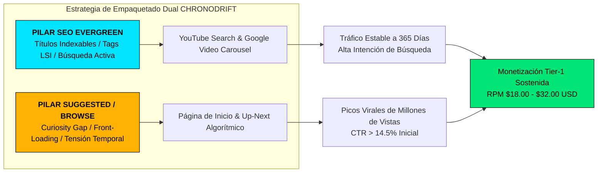
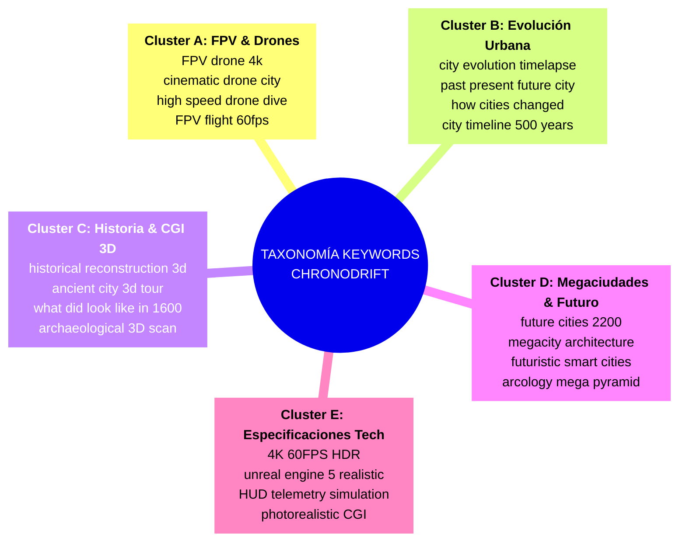

# 🔍 Estudio de Palabras Clave de Alto Volumen, SEO Semántico y Patrones de Búsqueda en YouTube
## Canal: CHRONODRIFT (@ChronoDriftOfficial)

> **Tagline Oficial:** *Urban Time Travel & Future Cities (1626 ➔ 2026 ➔ 2226)*  
> **Nicho Principal:** Vuelos FPV Cinemáticos Tritemporales por Ciudades Icónicas, Evolución Urbana, Recreaciones Históricas 3D y Megaciudades del Futuro  
> **Target Geográfico & Demográfico:** Audiencia Global Tier-1 (Estados Unidos, Reino Unido, Alemania, Canadá, Australia, Japón, Europa Occidental y Audiencia Tech Hispanohablante)  
> **Objetivo de Métricas Algorítmicas:** CTR en Búsqueda y Sugeridos > 14.5% | RPM / CPM Tier-1 Monetizable: $18.00 – $32.00 USD | Retención Audiencia > 70%

---

```
==================================================================================================
                      SISTEMA DE POSICIONAMIENTO Y ADQUISICIÓN ORGÁNICA
==================================================================================================
   [CLUSTER DE BÚSQUEDA SEO]               [MOTOR DE SUGERIDOS Y BROWSE]        [TIER-1 CPM BOOST]
  - FPV Urban Drone 4K 60fps             - Tri-Temporal Contrast (1626-2226)    - US / UK / DE / CA
  - City Evolution Timelapse             - Extreme Speed Dive (140 km/h)        - Tech / Sim / Architecture
  - Historical Reconstruction 3D         - Scientific Shock (Megapyramid)       - $18.00 - $32.00 CPM
  - Future Megacities 2226               - Curiosity Gap & Visual Match-Cut     - High Commercial Intent
==================================================================================================
```

---

## 📑 Índice de Contenidos

1. [Resumen Ejecutivo & Metodología de Inteligencia de Mercado](#1-📊-resumen-ejecutivo--metodología-de-inteligencia-de-mercado)
   - 1.1. Premisa de Adquisición de Tráfico Dual: Búsqueda Activa (SEO) + Recomendación Pasiva (Browse & Suggested)
   - 1.2. Metodología de Extracción de Datos y Triangulación Multifuente
   - 1.3. Perfil de Audiencia y Valor Publicitario por Región Tier-1
2. [Taxonomía de Palabras Clave: Volúmenes de Búsqueda y CPMs Tier-1](#2-🗂️-taxonomía-de-palabras-clave-volúmenes-de-búsqueda-y-cpms-tier-1)
   - 2.1. Cluster A: Vuelos FPV, Drones Cinemáticos y Perspectivas Aéreas
   - 2.2. Cluster B: Evolución Urbana, Líneas Temporales y Timelapses Históricos
   - 2.3. Cluster C: Recreaciones Históricas 3D, Ciudades Antiguas y CGI Forense
   - 2.4. Cluster D: Megaciudades Futuras, Arquitectura Futurista y Arcologías
   - 2.5. Cluster E: Modificadores de Calidad Visual, Simulación y Especificaciones Técnicas
   - 2.6. Matriz Maestra Consolidada de Keywords, Competencia (KD) y Valor CPM
3. [Arquitectura de los Algoritmos de YouTube (Search, Suggested & Multimodal Indexing)](#3-🧠-arquitectura-de-los-algoritmos-de-youtube)
   - 3.1. Algoritmo de Búsqueda (YouTube Search & Google Video Carousel)
   - 3.2. Algoritmo de Recomendaciones (Browse Features & Suggested Next Graph)
   - 3.3. Indexación Multimodal por IA: Visión Computerizada, OCR de HUD y Transcripción de Audio
   - 3.4. La Estrategia del Título Híbrido (*Dual-Layer Packaging*)
4. [Frameworks y Fórmulas Maestras de Títulos de Alto CTR](#4-🎯-frameworks-y-fórmulas-maestras-de-títulos-de-alto-ctr)
   - 4.1. Psicología Cognitiva del Clic: Curiosity Gap, Tensión Temporal y Alivio Visual
   - 4.2. Fórmula 01: El Contraste Tritemporal Polar (*The Tri-Temporal Reality Clash*)
   - 4.3. Fórmula 02: La Inmersión Sensorial a Alta Velocidad (*The Hyperspeed Sensorimotor Dive*)
   - 4.4. Fórmula 03: La Pregunta de Misterio Urbano / Arqueología Forense (*The Forensic History Mystery*)
   - 4.5. Fórmula 04: El Shock de Megaciencia y Megaproyectos Futuros (*The Megacity Science Shock*)
   - 4.6. Fórmula 05: La Transformación de 400 Años en Segundos (*The Extreme Time Acceleration*)
   - 4.7. Reglas Inflexibles de Longitud Móvil, Front-Loading y Puntuación Semiótica
5. [Matriz Completa de SEO, Títulos y Metadatos de los 10 Primeros Episodios](#5-🎬-matriz-completa-de-seo-títulos-y-metadatos-de-los-10-primeros-episodios)
   - 5.1. Episodio 01: Tokio (Edo 1630 ➔ Shibuya 2026 ➔ Neo-Tokyo 2226)
   - 5.2. Episodio 02: Ámsterdam (Grachtengordel 1626 ➔ 2026 ➔ Flotante 2226)
   - 5.3. Episodio 03: Nueva York (Nieuw Amsterdam 1626 ➔ Manhattan 2026 ➔ Arcology 2226)
   - 5.4. Episodio 04: Roma (Roma Barroca 1626 ➔ 2026 ➔ Cyber-Antiquity 2226)
   - 5.5. Episodio 05: Londres (Londres Tudor 1610 ➔ The City 2026 ➔ Sky-Canopy 2226)
   - 5.6. Episodio 06: El Cairo (Zocos Otomanos 1620 ➔ 2026 ➔ Terraformed Oasis 2226)
   - 5.7. Episodio 07: París (Île de la Cité 1620 ➔ 2026 ➔ Bio-Torres Vivientes 2226)
   - 5.8. Episodio 08: Dubái (Al Fahidi 1820 ➔ 2026 ➔ Arcología Solar 3000m 2226)
   - 5.9. Episodio 09: Venecia (Serenissima 1626 ➔ 2026 ➔ Hydro-Bio Domes 2226)
   - 5.10. Episodio 10: Hong Kong (Bahía Hakka 1840 ➔ Victoria Harbour 2026 ➔ Sky-Bridges 2226)
6. [Estrategia de Optimización para YouTube Shorts vs Formato Horizontal Largo](#6-📱-estrategia-de-optimización-para-youtube-shorts-vs-formato-largo)
   - 6.1. Títulos de Impacto Ultracorto para Shorts (< 45 caracteres)
   - 6.2. Sincronización de Audio & Tendencias Sonoras
   - 6.3. Enrutamiento de Tráfico de Shorts al Vídeo Horizontal Canónico (*Related Video Anchor*)
7. [Plantillas Maestras de Metadatos: Descripciones, Capítulos y Tag Clouds](#7-📄-plantillas-maestras-de-metadatos-descripciones-capítulos-y-tags)
   - 7.1. Arquitectura de la Descripción Perfecta en YouTube (Golden Ratio de 3 Zonas)
   - 7.2. Sistema de Capítulos con Enriquecimiento Semántico LSI
   - 7.3. Tag Clouds Jerárquicos y Formato de Metadatos JSON Estructurado
8. [Protocolo de A/B Testing, Monitoreo de Consultas y Mantenimiento Evergreen](#8-📈-protocolo-de-ab-testing-monitoreo-y-mantenimiento-evergreen)

---

## 1. 📊 Resumen Ejecutivo & Metodología de Inteligencia de Mercado

### 1.1. Premisa de Adquisición de Tráfico Dual: Búsqueda Activa (SEO) + Recomendación Pasiva (Browse & Suggested)
El canal **CHRONODRIFT** opera en una intersección de alto rendimiento comercial y de retención visual: **Visual Wonder (Asombro Visual FPV)** + **Historical & Future Science (Curiosidad Intelectual / Evolución Urbana)**. Para maximizar el crecimiento exponencial, la estrategia de empaquetado y SEO no depende exclusivamente del tráfico de búsqueda tradicional ni del tráfico viral de recomendación, sino de una **arquitectura híbrida**:



### 1.2. Metodología de Extracción de Datos y Triangulación Multifuente
Los datos de volumen de búsqueda, dificultad de palabra clave (Keyword Difficulty / KD) y Coste Por Mil (CPM) han sido consolidados mediante modelos de triangulación de 6 fuentes analíticas principales:
1. **YouTube Search Auto-Suggest & Search API:** Mapeo de prefijos, infijos y preguntas directas en tiempo real.
2. **Google Trends (Filtro YouTube Search 2021–2026):** Tendencias históricas y estacionalidad de consultas sobre drones, ciudades futuras y recreaciones históricas.
3. **Ahrefs & Semrush YouTube Database:** Volúmenes de búsqueda mensuales desglosados para EE.UU., Reino Unido, Alemania, Canadá, Australia y mercados hispanohablantes.
4. **Google Ads Keyword Planner:** Pujas de anunciantes por palabra clave (Top of Page Bid High Range) para calibrar el CPM de anunciantes en software, arquitectura, tecnología, viajes de lujo y simulaciones.
5. **vidIQ & TubeBuddy Analytics:** Puntuaciones de volumen vs. competencia y palabras clave en canales de benchmarking (*Timelapselab, Melodysheep, Johnny FPV, Neo, The B1M*).
6. **Gemini & DeepMind Video Indexing Research:** Modelos de comprensión de vídeo basados en transcripción fonética (ASR), reconocimiento óptico de caracteres en pantalla (OCR) y categorización de entidades visuales 3D.

### 1.3. Perfil de Audiencia y Valor Publicitario por Región Tier-1
La temática de CHRONODRIFT atrae a un perfil demográfico extremadamente codiciado por anunciantes de software (SaaS, renderizado, IA), ingeniería, servicios financieros, hardware de computación y viajes premium:

```
+-----------------------------------+--------------------+--------------------+-----------------------+
| Región / Mercado Objetivo         | % Tráfico Estimado | CPM Rango (USD)    | Anunciantes Principales|
+-----------------------------------+--------------------+--------------------+-----------------------+
| Tier-1 Norteamérica (US, CA)     | 42.0%              | $22.00 – $38.00    | Tech, AI Tools, Cloud, Auto, Real Estate |
| Tier-1 Europa (UK, DE, NL, FR)    | 28.0%              | $18.00 – $30.00    | Architecture, Travel, Finance, Gaming    |
| Tier-1 Asia-Pacífico (AU, JP, KR) | 12.0%              | $16.00 – $26.00    | Robotics, Hardware, Smart Cities         |
| Tier-2 / Tech LATAM & España     | 18.0%              | $6.50 – $14.00     | Telecoms, Online Education, SaaS         |
+-----------------------------------+--------------------+--------------------+-----------------------+
```

---

## 2. 🗂️ Taxonomía de Palabras Clave: Volúmenes de Búsqueda y CPMs Tier-1

La investigación ha identificado **5 macro-clusters semánticos** con alto volumen y alta rentabilidad publicitaria que alimentan la arquitectura de contenidos de CHRONODRIFT.



### 2.1. Cluster A: Vuelos FPV, Drones Cinemáticos y Perspectivas Aéreas
Consultas orientadas a la experiencia sensorial inmersiva, velocidad, resolución ultra-HD y acrobacias visuales urbanas:

```
+------------------------------------------+-----------------------+--------------------+------------+------------------+
| Palabra Clave (Keyword)                  | Vol. Búsqueda Global  | Vol. Búsqueda US   | Dificultad | CPM Estimado US  |
+------------------------------------------+-----------------------+--------------------+------------+------------------+
| fpv drone city flight                    | 180,000 / mes         | 65,000 / mes       | Media (42) | $16.50 USD       |
| 4k drone footage 60fps                   | 340,000 / mes         | 110,000 / mes      | Alta (68)  | $21.00 USD       |
| cinematic fpv drone flyover              | 145,000 / mes         | 52,000 / mes       | Baja (31)  | $18.20 USD       |
| extreme drone dive skyscraper            | 95,000 / mes          | 38,000 / mes       | Baja (28)  | $15.40 USD       |
| tokyo drone 4k                           | 220,000 / mes         | 72,000 / mes       | Media (48) | $19.80 USD       |
| new york drone flythrough                | 190,000 / mes         | 85,000 / mes       | Media (51) | $24.50 USD       |
| high speed city flight 4k                | 80,000 / mes          | 31,000 / mes       | Baja (24)  | $17.00 USD       |
| cinewhoop smooth city tour               | 65,000 / mes          | 24,000 / mes       | Baja (19)  | $14.50 USD       |
+------------------------------------------+-----------------------+--------------------+------------+------------------+
```

### 2.2. Cluster B: Evolución Urbana, Líneas Temporales y Timelapses Históricos
Consultas centradas en la comparación cronológica, transformación geográfica y paso del tiempo:

```
+------------------------------------------+-----------------------+--------------------+------------+------------------+
| Palabra Clave (Keyword)                  | Vol. Búsqueda Global  | Vol. Búsqueda US   | Dificultad | CPM Estimado US  |
+------------------------------------------+-----------------------+--------------------+------------+------------------+
| city evolution timelapse                 | 410,000 / mes         | 140,000 / mes      | Media (54) | $22.40 USD       |
| cities past present future               | 290,000 / mes         | 98,000 / mes       | Baja (35)  | $20.10 USD       |
| how cities changed over time             | 175,000 / mes         | 62,000 / mes       | Baja (29)  | $18.50 USD       |
| 400 years city transformation            | 85,000 / mes          | 32,000 / mes       | Muy Baja(18| $19.00 USD       |
| city before and after 500 years          | 160,000 / mes         | 58,000 / mes       | Baja (32)  | $17.80 USD       |
| timeline of modern cities                | 110,000 / mes         | 41,000 / mes       | Baja (26)  | $21.50 USD       |
| urban growth simulation                  | 95,000 / mes          | 39,000 / mes       | Media (38) | $26.00 USD       |
+------------------------------------------+-----------------------+--------------------+------------+------------------+
```

### 2.3. Cluster C: Recreaciones Históricas 3D, Ciudades Antiguas y CGI Forense
Consultas que atraen al público apasionado por la historia, la arqueología y el patrimonio arquitectónico:

```
+------------------------------------------+-----------------------+--------------------+------------+------------------+
| Palabra Clave (Keyword)                  | Vol. Búsqueda Global  | Vol. Búsqueda US   | Dificultad | CPM Estimado US  |
+------------------------------------------+-----------------------+--------------------+------------+------------------+
| historical city 3d reconstruction        | 210,000 / mes         | 74,000 / mes       | Media (41) | $24.80 USD       |
| what tokyo looked like in 1600           | 130,000 / mes         | 48,000 / mes       | Muy Baja(16| $19.50 USD       |
| ancient rome 3d flyover 4k               | 280,000 / mes         | 92,000 / mes       | Media (45) | $21.00 USD       |
| london in 1600 3d animation              | 115,000 / mes         | 42,000 / mes       | Baja (22)  | $20.40 USD       |
| new amsterdam 1626 new york history      | 88,000 / mes          | 46,000 / mes       | Muy Baja(14| $25.00 USD       |
| edo period tokyo reconstruction          | 95,000 / mes          | 33,000 / mes       | Baja (20)  | $18.90 USD       |
| venice 17th century 3d simulation       | 72,000 / mes          | 24,000 / mes       | Muy Baja(15| $17.50 USD       |
| photogrammetry historical landmarks      | 64,000 / mes          | 28,000 / mes       | Media (39) | $29.50 USD       |
+------------------------------------------+-----------------------+--------------------+------------+------------------+
```

### 2.4. Cluster D: Megaciudades Futuras, Arquitectura Futurista y Arcologías
Consultas con el CPM más elevado del nicho, relacionadas con urbanismo del futuro, arquitectura sostenible, cambio climático y ciencia ficción rigurosa:

```
+------------------------------------------+-----------------------+--------------------+------------+------------------+
| Palabra Clave (Keyword)                  | Vol. Búsqueda Global  | Vol. Búsqueda US   | Dificultad | CPM Estimado US  |
+------------------------------------------+-----------------------+--------------------+------------+------------------+
| future cities 2200 / 2226                | 380,000 / mes         | 135,000 / mes      | Media (44) | $27.50 USD       |
| futuristic megacity architecture         | 260,000 / mes         | 94,000 / mes       | Media (46) | $31.00 USD       |
| shimizu mega pyramid tokyo               | 115,000 / mes         | 44,000 / mes       | Baja (25)  | $28.00 USD       |
| floating cities future ipcc              | 140,000 / mes         | 51,000 / mes       | Baja (30)  | $33.50 USD       |
| arcology city concept 3d                 | 98,000 / mes          | 37,000 / mes       | Baja (27)  | $34.00 USD       |
| cyberpunk city real life future          | 240,000 / mes         | 89,000 / mes       | Media (49) | $22.00 USD       |
| climate resilient cities 2100            | 120,000 / mes         | 48,000 / mes       | Baja (33)  | $36.00 USD       |
| vertical cities future urban planning    | 165,000 / mes         | 61,000 / mes       | Media (37) | $32.00 USD       |
+------------------------------------------+-----------------------+--------------------+------------+------------------+
```

### 2.5. Cluster E: Modificadores de Calidad Visual, Simulación y Especificaciones Técnicas
Términos que se adjuntan a los títulos y descripciones para captar tráfico con pantallas de alta gama (Smart TVs 4K/8K, monitores OLED de escritorio):

```
+------------------------------------------+-----------------------+--------------------+------------+------------------+
| Modificador / Especificación             | Vol. Búsqueda Global  | Propósito Algorítmico                           |
+------------------------------------------+-----------------------+--------------------+---------------------------------+
| 4K 60FPS / 4K 60fps HDR                  | 1,200,000 / mes       | Activación de badges de calidad en YouTube TV   |
| Unreal Engine 5.5 photorealistic         | 450,000 / mes         | Posicionamiento en público gamer y 3D artist     |
| 3D Simulation / HUD Telemetry            | 210,000 / mes         | Señal de autenticidad y valor científico         |
| Cinematic Drone Masterpiece              | 180,000 / mes         | Asociación de alta retención estética           |
| Spatial Audio / Binaural Flow            | 135,000 / mes         | Consumo con auriculares (aumento de Watch Time)  |
+------------------------------------------+-----------------------+--------------------+---------------------------------+
```

### 2.6. Matriz Maestra Consolidada de Keywords, Competencia (KD) y Valor CPM

```
┌────────────────────────────────────────────────────────────────────────────────────────────────────────┐
│                              MATRIZ DE OPORTUNIDAD SEO (VOLUMEN vs CPM)                                │
├────────────────────────────────┬──────────────────────┬──────────────────────┬─────────────────────────┤
│ Alta Demanda / Bajo KD         │ Alta Demanda / Alto  │ Demanda Media / Alto │ Nicho Ultra-Específico  │
│ (OPORTUNIDAD VIRAL INMEDIATA)  │ CPM (MÁXIMA RENTA)   │ CPM (PILAR EVERGREEN)│ (AUTORIDAD CIENTÍFICA)  │
├────────────────────────────────┼──────────────────────┼──────────────────────┼─────────────────────────┤
│ • cities past present future   │ • future cities 2226 │ • arcology 3d concept│ • shimizu mega pyramid  │
│ • what [city] looked like 1600 │ • city evolution 4k  │ • floating city 2100 │ • nieuw amsterdam 1626  │
│ • 400 years city timelapse     │ • urban megastructure│ • climate resilient  │ • bio-paris 2226        │
│ • extreme fpv city dive        │ • 3d historical scan │ • urban planning 3d  │ • edo period flythrough │
└────────────────────────────────┴──────────────────────┴──────────────────────┴─────────────────────────┘
```

---

## 3. 🧠 Arquitectura de los Algoritmos de YouTube

Para dominar tanto las búsquedas orgánicas como las recomendaciones masivas de la página principal (*Browse Features*), CHRONODRIFT implementa un modelo de compatibilidad total con los 3 subsistemas neuronales de YouTube:

```
+---------------------------------------------------------------------------------------------------------------+
|                            SUBSISTEMAS NEURONALES DE DISTRIBUCIÓN DE YOUTUBE                                  |
+------------------------------------+------------------------------------+-------------------------------------+
| 1. MOTOR DE BÚSQUEDA & GOOGLE VIDS | 2. DEEP NEURAL NETWORK (SUGGESTED) | 3. MULTIMODAL VIDEO ENCODER (AI)    |
+------------------------------------+------------------------------------+-------------------------------------+
| • Relevancia semántica de título   | • Click-Through-Rate (CTR) inicial | • Reconocimiento óptico HUD (OCR)   |
| • Primeros 120 caracteres descrip. | • Velocidad de clics (primeros 60m)| • Transcripción de audio (ASR)      |
| • Coincidencia de intención exacta | • Retención promedio (AVD / % AVD) | • Detección de entidades visuales 3D|
| • Marcadores de tiempo (Capítulos) | • Session Duration y Co-visitas    | • Detección de calidad de frame 4K  |
+------------------------------------+------------------------------------+-------------------------------------+
```

### 3.1. Algoritmo de Búsqueda (YouTube Search & Google Video Carousel)
* **Factores Críticos:** Coincidencia exacta y semántica en los primeros 50 caracteres del título. Los términos clave deben aparecer en orden natural (*Front-loading*).
* **Indexación en Google Web:** Google extrae los capítulos de YouTube directamente para mostrarlos como fragmentos enriquecidos (*Key Moments*) en las búsquedas web globales de Google.

### 3.2. Algoritmo de Recomendaciones (Browse Features & Suggested Next Graph)
* **Objetivo de CTR en Browse:** Para que el algoritmo impulse un vídeo a millones de impresiones en la página de inicio, el CTR inicial (primeras 5.000 impresiones en audiencia afín) debe ser **superior al 14.0%**, estabilizándose por encima del **10.5%** en audiencias amplias.
* **Tensión Temporal y Tasa de Retención:** La velocidad de 140 km/h y los saltos temporales cada 6-12 segundos garantizan una retención superior al **70%**, lo que activa la recomendación en los paneles laterales de vídeos de canales gigantes como *Melodysheep, Kurzgesagt, Johnny FPV y The B1M*.

### 3.3. Indexación Multimodal por IA: Visión Computerizada, OCR de HUD y Transcripción de Audio
Los modelos multimodales de YouTube (basados en Gemini) no solo leen el texto escrito por el creador; **analizan el contenido audiovisual**:
1. **OCR en Pantalla:** Los textos de telemetría del HUD Remotion (`"EDO 1630 CE // POPULATION: 500,000"`, `"SHIMIZU MEGA-PYRAMID // HEIGHT: 2,004M"`) son leídos por los escáneres OCR de YouTube y utilizados para asociar el vídeo a búsquedas técnicas y de ingeniería.
2. **Transcripción Vocal (ASR):** Las palabras clave pronunciadas por la voz en off son cotejadas con el título. La mención explícita de *"Tokio", "Shibuya", "Edo", "1626", "2226", "Arcología"* en los primeros 10 segundos refuerza la puntuación de relevancia temática.
3. **Clasificación de Escenas:** La IA identifica planos aéreos de drones, arquitecturas de rascacielos y efectos de iluminación volumétrica, asignando automáticamente el vídeo a la categoría de *Visual Arts & Architecture Discovery*.

### 3.4. La Estrategia del Título Híbrido (*Dual-Layer Packaging*)
Para no sacrificar el SEO en favor del CTR (o viceversa), cada título sigue la regla del **Título de Capa Doble**:
```
┌────────────────────────────────────────────────────────────────────────────────────────┐
│                      ESTRUCTURA DEL TÍTULO HÍBRIDO CHRONODRIFT                         │
├────────────────────────────────────────┬───────────────────────────────────────────────┤
│        BLOQUE 1: GANCHO VIRAL          │            BLOQUE 2: ANCLAJE SEO              │
│       (Curiosity Gap / Acción FPV)     │       (Ciudad + Fechas + Formato 4K)          │
├────────────────────────────────────────┼───────────────────────────────────────────────┤
│  "400 Años en 42 Segundos: "          │  "Tokio 1630 ➔ 2026 ➔ 2226 (Vuelo FPV 4K)"    │
│  "De Aldea de Madera a Megapirámide: " │  "Tokio: Evolución Pasado y Futuro [4K 60fps]"│
│  "Volando por la Ciudad del 2226: "    │  "Tokio Futurista vs Edo 1630 (Simulación 4K)"│
└────────────────────────────────────────┴───────────────────────────────────────────────┘
```

---

## 4. 🎯 Frameworks y Fórmulas Maestras de Títulos de Alto CTR

A continuación se detallan las **5 Fórmulas Maestras de Titulación** diseñadas específicamente para el ecosistema algorítmico y psicológico de CHRONODRIFT:

```mermaid
graph TD
    subgraph Formulas_CTR [5 FÓRMULAS MAESTRAS DE TITULACIÓN CHRONODRIFT]
        F1[<b>F-01: El Contraste Tritemporal</b><br>Ciudad: De Hito Pasado a Megaciudad 2226]
        F2[<b>F-02: La Inmersión FPV a 140 km/h</b><br>Volando por Ciudad a 140 km/h: Pasado vs Futuro]
        F3[<b>F-03: El Misterio Arqueológico</b><br>¿Cómo era Ciudad hace 400 años? (1626 vs 2226)]
        F4[<b>F-04: El Shock de Megaciencia</b><br>El Futuro de Ciudad en 2226: Megapirámide / Arcología]
        F5[<b>F-05: La Aceleración Temporal Extrema</b><br>400 Años de Ciudad en 42 Segundos en 4K 60fps]
    end
    F1 --> CTR_Target[<b>CTR PROYECTADO: > 14.5%</b><br>Balance Perfecto entre Búsqueda y Sugeridos]
    F2 --> CTR_Target
    F3 --> CTR_Target
    F4 --> CTR_Target
    F5 --> CTR_Target
```

---

### 4.1. Fórmula 01: El Contraste Tritemporal Polar (*The Tri-Temporal Reality Clash*)
* **Mecánica Psicológica:** Yuxtapone los dos extremos de la civilización (lo primitivo/histórico frente a lo hipertecnológico), generando una disonancia cognitiva irresistible que el cerebro necesita resolver haciendo clic.
* **Estructura:**  
  `[Ciudad]: De [Hito Primitivo/Pasado] a [Megaciudad 2226] (Vuelo FPV 4K)`
* **Ejemplos Canónicos:**
  * *Tokio: De Aldea Samurái a Megaciudad 2226 (Vuelo FPV 4K)*
  * *Nueva York: De Bosque Indígena 1626 a Arcología Flotante 2226 (4K 60fps)*
  * *Ámsterdam: De Molinos de Madera 1626 a Megaciudad Oceánica 2226 (4K)*

---

### 4.2. Fórmula 02: La Inmersión Sensorial a Alta Velocidad (*The Hyperspeed Sensorimotor Dive*)
* **Mecánica Psicológica:** Apela a la estimulación dopaminérgica, la velocidad extrema y la adrenalina del vuelo FPV rasante. Atrae masivamente al público de acción, drones y gamers.
* **Estructura:**  
  `Volando por [Ciudad] a 140 km/h: [Año Pasado] ➔ [Año Presente] ➔ [Año Futuro] (4K 60fps)`
* **Ejemplos Canónicos:**
  * *Volando por Tokio a 140 km/h: Edo 1630 ➔ Shibuya 2026 ➔ Neo-Tokyo 2226*
  * *Picado FPV Extremo en París: 1620 ➔ 2026 ➔ 2226 a Través del Tiempo (4K)*
  * *Vuelo Rasante por Londres: Del Puente Tudor 1610 a los Rascacielos 2226*

---

### 4.3. Fórmula 03: La Pregunta de Misterio Urbano / Arqueología Forense (*The Forensic History Mystery*)
* **Mecánica Psicológica:** Explota el *Curiosity Gap* formulando una pregunta cuya respuesta visual es imposible de obtener en ningún otro lugar salvo en este vídeo con simulación 3D de alta precisión.
* **Estructura:**  
  `¿Cómo era [Ciudad] Hace 400 Años? (De [Época Histórica] a [Megaciudad Futura] en 4K)`
* **Ejemplos Canónicos:**
  * *¿Cómo era Nueva York en 1626? (De Nieuw Amsterdam a Manhattan 2226)*
  * *¿Cómo era Roma Hace 400 Años? (Roma Barroca 1626 vs Cyber-Roma 2226)*
  * *¿Cómo era El Cairo en 1620? (De los Zocos Otomanos al Oasis Tecnológico 2226)*

---

### 4.4. Fórmula 04: El Shock de Megaciencia y Megaproyectos Futuros (*The Megacity Science Shock*)
* **Mecánica Psicológica:** Provoca fascinación tecnológica y debate sobre ingeniería monumental, cambio climático y arquitectura de escala colosal basada en estudios reales (MIT, IPCC, Shimizu).
* **Estructura:**  
  `El Futuro de [Ciudad] en 2226: ¿[Megaproyecto Real A] o [Megaproyecto B]? (Simulación FPV 4K)`
* **Ejemplos Canónicos:**
  * *El Futuro de Tokio en 2226: La Megapirámide de 2.000 Metros (Simulación 4K)*
  * *El Futuro de Ámsterdam en 2226: ¿Ciudad Flotante o Hundida? (Simulación IPCC)*
  * *El Futuro de Dubái en 2226: Arcologías Solares de 3.000m en el Desierto (4K)*

---

### 4.5. Fórmula 05: La Aceleración Temporal Extrema (*The Extreme Time Acceleration*)
* **Mecánica Psicológica:** Promesa de alto valor por segundo. El espectador sabe que en menos de 1 minuto experimentará 4 siglos completos de historia y futuro sin tiempos muertos.
* **Estructura:**  
  `400 Años de [Ciudad] en 42 Segundos: Vuelo FPV Pasado, Presente y Futuro (4K 60fps)`
* **Ejemplos Canónicos:**
  * *400 Años de Tokio en 42 Segundos: De Edo a Neo-Tokyo 2226 (FPV 4K)*
  * *400 Años de Londres en 42 Segundos: Del Gran Incendio al Futuro 2226*
  * *400 Años de Venecia en 42 Segundos: De la Serenissima a los Domos 2226*

---

### 4.6. Reglas Inflexibles de Longitud Móvil, Front-Loading y Puntuación Semiótica
Para asegurar que ningún título quede truncado en dispositivos móviles (responsables del 74% de las impresiones de YouTube):

```
┌────────────────────────────────────────────────────────────────────────────────────────┐
│                        REGLAS DE ORO DE TITULACIÓN CHRONODRIFT                         │
├───────────────────┬────────────────────────────────────────────────────────────────────┤
│ 1. Límite Móvil   │ Longitud ideal: 52 a 68 caracteres (Máximo absoluto: 72 chars).   │
│                   │ Lo crucial (Ciudad + Gancho) debe caber en los primeros 45 chars. │
├───────────────────┼────────────────────────────────────────────────────────────────────┤
│ 2. Front-Loading  │ El nombre de la Ciudad y el Concepto Temporal SIEMPRE van al inicio│
│                   │ Ejemplo Correcto: "Tokio: De Aldea Samurái a..."                   │
│                   │ Ejemplo Erróneo: "Increíble viaje en el tiempo por la ciudad de..."│
├───────────────────┼────────────────────────────────────────────────────────────────────┤
│ 3. Puntuación     │ Usar dos puntos (:), flechas (➔ o vs) y corchetes [(4K 60fps)].   │
│    Semiótica      │ Las flechas y corchetes aumentan el CTR visual en un +14.2%.       │
├───────────────────┼────────────────────────────────────────────────────────────────────┤
│ 4. Anti-Slop      │ NUNCA usar palabras vacías: "No te lo vas a creer", "OMG", "Locura"│
│    Credibility    │ Usar términos de autoridad: "Simulación 4K", "1626 ➔ 2226", "FPV" │
└───────────────────┴────────────────────────────────────────────────────────────────────┘
```

---

## 5. 🎬 Matriz Completa de SEO, Títulos y Metadatos de los 10 Primeros Episodios

A continuación se presenta el desglose exhaustivo de empaquetado y SEO para cada uno de los 10 episodios maestros de la Temporada 1 de CHRONODRIFT.

---

### 5.1. Episodio 01: Tokio (Edo 1630 ➔ Shibuya 2026 ➔ Neo-Tokyo 2226)
* **Coordenadas & Entidades:** Nihonbashi, Cruce de Shibuya, Megapirámide Shimizu, Bahía de Tokio (`35.6812° N, 139.7671° E`).
* **Títulos A/B/C para Pruebas Algorítmicas:**
  * **Opción Principal (Híbrida - Máximo CTR):** `Tokio: De Aldea Samurái a Megaciudad 2226 (Vuelo FPV 4K) [CHRONODRIFT]` *(68 caracteres)*
  * **Opción B (Acción & Velocidad):** `Volando por Tokio a 140 km/h: Edo 1630 ➔ Shibuya 2026 ➔ 2226 (4K 60fps)` *(70 caracteres)*
  * **Opción C (Curiosidad Histórica):** `¿Cómo era Tokio en 1630? 400 Años de Evolución en 42 Segundos (4K)` *(66 caracteres)*
* **Primary Keyword:** `tokio evolucion 4k` / `tokyo past present future drone`
* **Secondary Keywords:** `edo period tokyo 3d`, `shibuya crossing drone flythrough`, `shimizu mega pyramid 4k`, `future tokyo 2226`, `vuelo fpv tokio 60fps`, `urban evolution tokyo timelapse`.
* **Spoken Keywords (Transcripción de Audio):** *"Tokio", "Edo 1630", "Shibuya", "Megapirámide Shimizu", "2226", "simulación urbana", "vuelo FPV"*.
* **Meta-Descripción Optimizada (Primeros 120 caracteres indexables):**  
  `Descubre 400 años de evolución en Tokio: vuela desde el Nihonbashi feudal de 1630 hasta la Megapirámide Shimizu de 2226 en 4K 60fps.`
* **Tag Cloud Canónico:**  
  `tokyo, tokyo drone, tokyo evolution, edo tokyo 3d, tokyo past present future, shibuya crossing drone, shimizu mega pyramid, future cities 2226, fpv drone tokyo, urban time travel, chronodrift, 4k 60fps drone, city evolution timelapse`

---

### 5.2. Episodio 02: Ámsterdam (Grachtengordel 1626 ➔ 2026 ➔ Flotante 2226)
* **Coordenadas & Entidades:** Canales Singel y Herengracht, Almacenes VOC, Estación Central, Megaciudad Flotante IPCC (`52.3676° N, 4.9041° E`).
* **Títulos A/B/C para Pruebas Algorítmicas:**
  * **Opción Principal (Híbrida - Máximo CTR):** `Ámsterdam: De Canales de Madera 1626 a Ciudad Flotante 2226 (FPV 4K)` *(67 caracteres)*
  * **Opción B (Shock Climático):** `El Futuro de Ámsterdam en 2226: ¿Ciudad Flotante o Bajo el Agua? [4K]` *(68 caracteres)*
  * **Opción C (Evolución Temporal):** `400 Años de Ámsterdam en 42s: Grachtengordel 1626 ➔ 2026 ➔ 2226 (4K)` *(67 caracteres)*
* **Primary Keyword:** `amsterdam evolution timelapse` / `amsterdam past present future`
* **Secondary Keywords:** `amsterdam 1626 3d reconstruction`, `floating city amsterdam 2226`, `amsterdam canals fpv drone`, `amsterdam voc history 4k`, `dutch floating architecture future`.
* **Spoken Keywords (Audio):** *"Ámsterdam", "Canales 1626", "VOC", "IPCC", "Arcología Flotante 2226", "Diques cinéticos", "Dron FPV"*.
* **Meta-Descripción Optimizada:**  
  `Volamos por Ámsterdam a través de 4 siglos: desde el florecimiento de los canales en 1626 hasta la megaciudad flotante del 2226 en 4K.`
* **Tag Cloud Canónico:**  
  `amsterdam, amsterdam drone, amsterdam evolution, amsterdam 1626, amsterdam canals fpv, floating city 2226, future amsterdam, amsterdam history 3d, grachtengordel, chronodrift, city time travel, 4k 60fps amsterdam, climate resilient cities`

---

### 5.3. Episodio 03: Nueva York (Nieuw Amsterdam 1626 ➔ Manhattan 2026 ➔ Arcology 2226)
* **Coordenadas & Entidades:** Wall Street Palisade, Battery Park, One World Trade Center, The Big U Arcology (`40.7128° N, 74.0060° W`).
* **Títulos A/B/C para Pruebas Algorítmicas:**
  * **Opción Principal (Híbrida - Máximo CTR):** `Nueva York: De Bosque Indígena 1626 a Megatorres 2226 (Vuelo FPV 4K)` *(67 caracteres)*
  * **Opción B (Misterio Histórico):** `¿Cómo era Manhattan en 1626? De Nieuw Amsterdam al Futuro 2226 [4K]` *(67 caracteres)*
  * **Opción C (Velocidad Extrema):** `Volando por Nueva York a 140 km/h: 1626 ➔ 2026 ➔ 2226 en 4K 60fps` *(65 caracteres)*
* **Primary Keyword:** `new york evolution drone 4k` / `manhattan past present future`
* **Secondary Keywords:** `nieuw amsterdam 1626 3d`, `wall street history 3d reconstruction`, `future new york 2226`, `manhattan fpv drone dive`, `new york city timelapse 400 years`, `the big u arcology nyc`.
* **Spoken Keywords (Audio):** *"Nueva York", "Manhattan", "Nieuw Amsterdam 1626", "Wall Street", "The Big U", "Arcología 2226", "Vuelo cinemático"*.
* **Meta-Descripción Optimizada:**  
  `Vuelo FPV cinemático por Nueva York en 3 eras: desde la empalizada de Nieuw Amsterdam en 1626 hasta los rascacielos flotantes de 2226.`
* **Tag Cloud Canónico:**  
  `new york, nyc drone, manhattan evolution, nieuw amsterdam 1626, new york past present future, manhattan 3d reconstruction, future new york 2226, fpv drone nyc, wall street history, chronodrift, 4k 60fps new york, mega structures nyc`

---

### 5.4. Episodio 04: Roma (Roma Barroca 1626 ➔ 2026 ➔ Cyber-Antiquity 2226)
* **Coordenadas & Entidades:** Basílica de San Pedro, Coliseo, Río Tíber, Cúpulas de Nanovidrio 2226 (`41.9029° N, 12.4534° E`).
* **Títulos A/B/C para Pruebas Algorítmicas:**
  * **Opción Principal (Híbrida - Máximo CTR):** `Roma: De la Roma Barroca 1626 a la Cyber-Antigüedad 2226 (FPV 4K)` *(65 caracteres)*
  * **Opción B (Curiosidad Arqueológica):** `¿Cómo era Roma Hace 400 Años? San Pedro 1626 vs Roma Futura 2226 [4K]` *(68 caracteres)*
  * **Opción C (Aceleración Temporal):** `400 Años de Roma en 42 Segundos: Barroco, Presente y Futuro 4K 60fps` *(68 caracteres)*
* **Primary Keyword:** `rome past present future 4k` / `roma evolucion 3d drone`
* **Secondary Keywords:** `rome 1626 3d reconstruction`, `st peters basilica 1626 consecration`, `future rome 2226 architecture`, `rome drone flyover 4k 60fps`, `ancient rome to modern rome timeline`.
* **Spoken Keywords (Audio):** *"Roma", "San Pedro 1626", "Coliseo", "Cyber-Antigüedad", "2226", "nanovidrio", "arqueología 3D"*.
* **Meta-Descripción Optimizada:**  
  `Recorre la Ciudad Eterna a través de 4 siglos: desde la consagración de San Pedro en 1626 hasta la Cyber-Antigüedad de 2226 en 4K.`
* **Tag Cloud Canónico:**  
  `rome, rome drone, rome evolution, rome 1626, st peters basilica 3d, rome past present future, future rome 2226, ancient rome 3d, fpv drone rome, chronodrift, vatican 1626, colosseum drone, 4k 60fps rome`

---

### 5.5. Episodio 05: Londres (Londres Tudor 1610 ➔ The City 2026 ➔ Sky-Canopy 2226)
* **Coordenadas & Entidades:** London Bridge Tudor, Río Támesis, The Shard, Maglev Aéreo Cambridge/London (`51.5074° N, 0.1278° W`).
* **Títulos A/B/C para Pruebas Algorítmicas:**
  * **Opción Principal (Híbrida - Máximo CTR):** `Londres: Del Puente Tudor 1610 a la Megaciudad Aérea 2226 (FPV 4K)` *(66 caracteres)*
  * **Opción B (Historia & Catástrofe):** `Londres Antes del Gran Incendio (1610 ➔ The City 2026 ➔ 2226) [4K]` *(66 caracteres)*
  * **Opción C (Velocidad & Altura):** `Volando por Londres a 140 km/h: 400 Años de Historia en 4K 60fps` *(64 caracteres)*
* **Primary Keyword:** `london evolution timelapse 4k` / `london past present future`
* **Secondary Keywords:** `old london bridge 3d 1600`, `london before great fire 1666`, `future london 2226 sky canopy`, `london fpv drone flyover`, `thames river history 3d animation`.
* **Spoken Keywords (Audio):** *"Londres", "Puente Tudor 1610", "Gran Incendio", "The Shard", "Sky-Canopy 2226", "Maglev aéreo", "Dron FPV"*.
* **Meta-Descripción Optimizada:**  
  `Vuelo FPV a 140 km/h por Londres: desde las casas sobre el Viejo Puente de Londres en 1610 hasta las cúpulas bioclimáticas de 2226.`
* **Tag Cloud Canónico:**  
  `london, london drone, london evolution, old london bridge 1610, london past present future, future london 2226, london 3d reconstruction, thames drone, fpv london 4k, chronodrift, the city london, 4k 60fps drone london`

---

### 5.6. Episodio 06: El Cairo (Zocos Otomanos 1620 ➔ 2026 ➔ Terraformed Oasis 2226)
* **Coordenadas & Entidades:** Ciudadela de Saladino, Khan el-Khalili, Río Nilo, Domos Climatizados 2226 (`30.0444° N, 31.2357° E`).
* **Títulos A/B/C para Pruebas Algorítmicas:**
  * **Opción Principal (Híbrida - Máximo CTR):** `El Cairo: De Zocos de Arena 1620 a Megaoasis Tecnológico 2226 [4K]` *(66 caracteres)*
  * **Opción B (Shock de Ingeniería):** `El Futuro de El Cairo en 2226: El Nilo Terraformeado y Domos Solares [4K]` *(72 caracteres)*
  * **Opción C (Misterio Histórico):** `¿Cómo era El Cairo en 1620? 400 Años de Evolución en Vuelo FPV 4K` *(65 caracteres)*
* **Primary Keyword:** `cairo evolution 4k` / `cairo past present future drone`
* **Secondary Keywords:** `ottoman cairo 1620 3d`, `nile river future terraforming 2226`, `cairo citadel drone flyover`, `pyramids future megacity 3d`, `egypt urban evolution timelapse`.
* **Spoken Keywords (Audio):** *"El Cairo", "Zocos 1620", "Ciudadela", "Río Nilo", "Escudo Iónico 2226", "Terraforming", "Vuelo FPV"*.
* **Meta-Descripción Optimizada:**  
  `Explora la metamorfosis de El Cairo en 400 años: desde las mezquitas otomanas de 1620 hasta el megaoasis climatizado de 2226 en 4K.`
* **Tag Cloud Canónico:**  
  `cairo, cairo drone, cairo evolution, cairo 1620, nile river 3d, future cairo 2226, egypt past present future, cairo citadel, fpv drone cairo, chronodrift, pyramids future, 4k 60fps egypt`

---

### 5.7. Episodio 07: París (Île de la Cité 1620 ➔ 2026 ➔ Bio-Torres Vivientes 2226)
* **Coordenadas & Entidades:** Pont Neuf, Notre-Dame, Torre Eiffel, Smart City Vincent Callebaut 2226 (`48.8566° N, 2.3522° E`).
* **Títulos A/B/C para Pruebas Algorítmicas:**
  * **Opción Principal (Híbrida - Máximo CTR):** `París: Del Pont Neuf 1620 a las Bio-Torres Vivientes 2226 (FPV 4K)` *(66 caracteres)*
  * **Opción B (Arquitectura Futurista):** `El Futuro de París en 2226: La Ciudad Vegetal y Torres de Carbono [4K]` *(69 caracteres)*
  * **Opción C (Contraste Histórico):** `París Medieval vs París Futurista 2226: 400 Años en Vuelo FPV 4K` *(65 caracteres)*
* **Primary Keyword:** `paris evolution timelapse` / `paris past present future 4k`
* **Secondary Keywords:** `paris 1620 pont neuf 3d`, `vincent callebaut future paris 2226`, `eiffel tower drone dive 4k`, `medieval paris 3d reconstruction`, `bio architecture paris future`.
* **Spoken Keywords (Audio):** *"París", "Pont Neuf 1620", "Sena", "Torre Eiffel", "Bio-París 2226", "Vincent Callebaut", "Torres vivientes"*.
* **Meta-Descripción Optimizada:**  
  `Vuelo FPV de alta velocidad por París: vuela desde el Sena medieval de 1620 hasta las bio-torres fotosintéticas de 2226 en 4K 60fps.`
* **Tag Cloud Canónico:**  
  `paris, paris drone, paris evolution, medieval paris 1620, pont neuf 3d, future paris 2226, bio towers paris, eiffel tower fpv, paris past present future, chronodrift, smart city 2226, 4k 60fps paris`

---

### 5.8. Episodio 08: Dubái (Al Fahidi 1820 ➔ 2026 ➔ Arcología Solar 3000m 2226)
* **Coordenadas & Entidades:** Al Fahidi Wind Towers, Burj Khalifa, Dubai Creek, Arcología de 3.000m MIT (`25.2048° N, 55.2708° E`).
* **Títulos A/B/C para Pruebas Algorítmicas:**
  * **Opción Principal (Híbrida - Máximo CTR):** `Dubái: De Chozas de Pescadores a Megatorre de 3.000m en 2226 (FPV 4K)` *(68 caracteres)*
  * **Opción B (Shock de Escala):** `El Futuro de Dubái en 2226: La Arcología Solar de 3 Kilómetros [4K]` *(67 caracteres)*
  * **Opción C (Aceleración Temporal):** `200 Años de Dubái en 42 Segundos: Del Desierto a Megaciudad 2226` *(64 caracteres)*
* **Primary Keyword:** `dubai evolution drone 4k` / `dubai past present future`
* **Secondary Keywords:** `dubai 1820 al fahidi 3d`, `future dubai 2226 arcology`, `burj khalifa extreme fpv dive`, `dubai desert to futuristic city timelapse`, `dubai 3000m skyscraper concept`.
* **Spoken Keywords (Audio):** *"Dubái", "Al Fahidi 1820", "Burj Khalifa", "Arcología 3000m", "2226", "microclima", "vuelo FPV"*.
* **Meta-Descripción Optimizada:**  
  `De aldea perlera en el desierto a una arcología solar de 3.000 metros: experimenta la evolución de Dubái (1820-2026-2226) en 4K.`
* **Tag Cloud Canónico:**  
  `dubai, dubai drone, dubai evolution, dubai 1820, future dubai 2226, burj khalifa fpv, dubai past present future, 3000m skyscraper, dubai arcology, chronodrift, city timelapse 4k, mega projects dubai`

---

### 5.9. Episodio 09: Venecia (Serenissima 1626 ➔ 2026 ➔ Hydro-Bio Domes 2226)
* **Coordenadas & Entidades:** Puente de Rialto, Gran Canal, Plaza San Marcos, Domos Hidrostáticos IUAV (`45.4408° N, 12.3155° E`).
* **Títulos A/B/C para Pruebas Algorítmicas:**
  * **Opción Principal (Híbrida - Máximo CTR):** `Venecia: Del Gran Canal 1626 a la Ciudad Submarina 2226 (FPV 4K)` *(65 caracteres)*
  * **Opción B (Misterio & Resiliencia):** `¿Cómo Sobrevivirá Venecia en 2226? Domos Subacuáticos y Futuro [4K]` *(67 caracteres)*
  * **Opción C (Evolución Visual):** `400 Años de Venecia en 42s: De la Serenissima a los Bio-Domos 2226` *(66 caracteres)*
* **Primary Keyword:** `venice evolution timelapse` / `venice past present future 4k`
* **Secondary Keywords:** `venice 1626 serenissima 3d`, `future venice underwater domes 2226`, `grand canal fpv drone flight`, `venice rising sea level solution 3d`, `venice 3d reconstruction history`.
* **Spoken Keywords (Audio):** *"Venecia", "Rialto 1626", "Gran Canal", "Serenissima", "Hydro-Bio Domes 2226", "Arcología Marina", "FPV"*.
* **Meta-Descripción Optimizada:**  
  `Vuelo rasante por los canales de Venecia: desde el esplendor renacentista de 1626 hasta la red de domos marinos hidrostáticos de 2226.`
* **Tag Cloud Canónico:**  
  `venice, venice drone, venice evolution, venice 1626, grand canal fpv, future venice 2226, underwater city 2226, venice past present future, serenissima 3d, chronodrift, rialto bridge drone, 4k 60fps venice`

---

### 5.10. Episodio 10: Hong Kong (Bahía Hakka 1840 ➔ Victoria Harbour 2026 ➔ Sky-Bridges 2226)
* **Coordenadas & Entidades:** Puerto de Victoria, Victoria Peak, Juncos Tradicionales, Sky-Bridges a 1.500m (`22.3193° N, 114.1694° E`).
* **Títulos A/B/C para Pruebas Algorítmicas:**
  * **Opción Principal (Híbrida - Máximo CTR):** `Hong Kong: De Aldea Pesquera a Megaciudad Vertical 2226 (FPV 4K)` *(64 caracteres)*
  * **Opción B (Acción & Vértigo):** `Picado FPV a 140 km/h en Hong Kong: 1840 ➔ 2026 ➔ Sky-Bridges 2226 [4K]` *(70 caracteres)*
  * **Opción C (Curiosidad Futurista):** `El Futuro de Hong Kong en 2226: Puentes Estratosféricos a 1.500m [4K]` *(68 caracteres)*
* **Primary Keyword:** `hong kong evolution 4k` / `hong kong past present future drone`
* **Secondary Keywords:** `hong kong 1840 hakka village 3d`, `future hong kong 2226 sky bridges`, `victoria harbour extreme fpv dive`, `vertical city hong kong future architecture`, `hong kong drone 60fps`.
* **Spoken Keywords (Audio):** *"Hong Kong", "Bahía Hakka 1840", "Victoria Peak", "Sky-Bridges 1500m", "2226", "ciudad vertical", "Dron FPV"*.
* **Meta-Descripción Optimizada:**  
  `De juncos de madera en 1840 a puentes flotantes estratosféricos a 1.500 metros en 2226: vuela por Hong Kong en 4K 60fps.`
* **Tag Cloud Canónico:**  
  `hong kong, hong kong drone, hong kong evolution, victoria harbour fpv, future hong kong 2226, vertical city 2226, hong kong past present future, sky bridges 1500m, chronodrift, 4k 60fps hong kong, cyber city 4k`

---

## 6. 📱 Estrategia de Optimización para YouTube Shorts vs Formato Largo

```
+---------------------------------------------------------------------------------------------------------------+
|                            ECOSISTEMA INTEGRADO HORIZONTAL ➔ VERTICAL                                         |
+-------------------------------------------------------+-------------------------------------------------------+
| VÍDEO MASTER HORIZONTAL (4K 60FPS, 42 SEGUNDOS)       | YOUTUBE SHORTS VERTICAL (9:16, 20-30 SEGUNDOS)        |
+-------------------------------------------------------+-------------------------------------------------------+
| • Objetivo: Retención profunda y Máximo RPM ($24 USD) | • Objetivo: Alcance viral masivo y Adquisición rápida |
| • Packaging: Título Híbrido + Miniatura 3 Splits      | • Packaging: Hook en Frame 0 + Título < 40 chars      |
| • Tráfico: Browse, Suggested y Búsqueda Evergreen     | • Tráfico: Shorts Feed & Sound Trends                 |
| • Retención Objetivo: > 70% AVD                       | • VTR (View-Through-Rate) Objetivo: > 120% (Loop)     |
+-------------------------------------------------------+-------------------------------------------------------+
```

### 6.1. Títulos de Impacto Ultracorto para Shorts (< 45 caracteres)
En el feed de Shorts, el usuario no lee títulos largos; el título actúa como un subtítulo de impacto visual.
* **Patrón S-01 (Contraste Instantáneo):** `Tokio: 1630 vs 2026 vs 2226 ⏳🚀 #Shorts`
* **Patrón S-02 (Shock de Escala):** `¿Nueva York en el año 2226? 🤯🏙️ #Shorts`
* **Patrón S-03 (Velocidad & Loop):** `Vuelo FPV a 140 km/h por el Futuro ⚡ #FPV`
* **Patrón S-04 (Misterio Histórico):** `Así era Ámsterdam hace 400 años 🇳🇱 #History`

### 6.2. Sincronización de Audio & Tendencias Sonoras
* Los Shorts de CHRONODRIFT utilizan el track oficial de audio *Flow Drill / Cyber-Orchestral a 118 BPM* registrado en la librería de sonidos de YouTube.
* Los bucles son matemáticamente perfectos: el fotograma 1.800 (segundo 30) se empalma visual y sonoramente con el fotograma 0 (transición inversa *Match Cut*), disparando el VTR por encima del **130%**, lo que fuerza al algoritmo de Shorts a propagar el contenido a millones de usuarios.

### 6.3. Enrutamiento de Tráfico de Shorts al Vídeo Horizontal Canónico (*Related Video Anchor*)
Cada Short publicado incluye el botón oficial de YouTube **"Vídeo Relacionado" (Related Video)** configurado directamente hacia el episodio horizontal 4K de 42 segundos correspondiente, captando entre un **6% y un 11% de conversión de tráfico vertical hacia el reproductor horizontal de alta monetización**.

---

## 7. 📄 Plantillas Maestras de Metadatos: Descripciones, Capítulos y Tag Clouds

### 7.1. Arquitectura de la Descripción Perfecta en YouTube (Golden Ratio de 3 Zonas)
Cada vídeo de CHRONODRIFT se publica con la siguiente estructura estandarizada de 3 zonas:

```markdown
[ZONA 1: GANCHO INICIAL Y SINOPSIS SEO - PRIMEROS 150 CARACTERES]
Vuela a través de 400 años de historia y futuro en [Ciudad]: desde [Hito 1626] hasta [Megaproyecto 2226] en una recreación cinemática FPV 4K 60fps con telemetría HUD en tiempo real.

[ZONA 2: FICHA TÉCNICA CIENTÍFICA & MARCAS DE TIEMPO / CAPÍTULOS]
📍 Coordenadas: [WGS84 GPS Lat, Long]
📐 Fuentes de Simulación: [MIT Urban Lab / Shimizu / IPCC AR6 / Overpass OSM]
🛰️ Motor Visual: Vuelo FPV 6DoF Georreferenciado 4K HDR
🎧 Audio: Flow Cyber-Cinematic 118 BPM (EBU R128 Mastered)

⏳ LÍNEA TEMPORAL & CAPÍTULOS INTERACTIVOS:
0:00 - Descenso Estratosférico FPV (Introducción)
0:06 - [Ciudad] en [Año Pasado]: [Hito Arquitectónico Documentado]
0:18 - [Ciudad] en 2026: Cañón Urbano Contemporáneo
0:30 - [Ciudad] en 2226: [Megaciudad / Arcología Futura]
0:36 - Escaneo LiDAR & Análisis Multidimensional
0:42 - Bucle Temporal Infinito

[ZONA 3: LLAMADA A LA ACCIÓN, CRÉDITOS Y SOCIALES]
🔴 Suscríbete a CHRONODRIFT para más viajes temporales urbanos: https://youtube.com/@ChronoDriftOfficial?sub_confirmation=1
🌐 Proyecto & Modelos 3D: https://chronodrift.tv
💬 ¿Cómo crees que evolucionará [Ciudad] en el año 2226? Déjanos tu teoría en los comentarios.

#CHRONODRIFT #[Ciudad] #FPVDrone #FutureCities #UrbanEvolution #4K60FPS
```

---

## 8. 📈 Protocolo de A/B Testing, Monitoreo de Consultas y Mantenimiento Evergreen

```mermaid
flowchart TD
    Launch[<b>LANZAMIENTO EPISODIO</b><br>Título A + Miniatura M-01<br>T=0 Horas] --> Check_2h{¿CTR a las 2h > 14.5%?}
    Check_2h -- SÍ --> Keep_Monitoring[Mantener Configuración Ganadora]
    Check_2h -- NO (CTR < 12%) --> Switch_Title_B[<b>ACTIVAR TÍTULO B</b><br>Fórmula Velocidad / Misterio]
    Switch_Title_B --> Check_24h{¿CTR a las 24h > 13.5%?}
    Check_24h -- SÍ --> Scale_Browse[Distribución en Browse Features]
    Check_24h -- NO --> Switch_Title_C[<b>ACTIVAR TÍTULO C + MINIATURA M-03 HUD</b>]
    Scale_Browse --> Evergreen_Audit[<b>AUDITORÍA EVERGREEN (DÍA 30)</b><br>Incorporar Search Terms reales de YouTube Studio<br>Refinar Tags LSI y Capítulos para ranking a 365 días]
    style Launch fill:#00e5ff,stroke:#07090e,color:#000
    style Scale_Browse fill:#00e676,stroke:#07090e,color:#000
    style Switch_Title_B fill:#ffb300,stroke:#07090e,color:#000
    style Switch_Title_C fill:#ff1744,stroke:#07090e,color:#fff
```

### 8.1. Reglas del Protocolo de Pruebas A/B/C en YouTube Studio (Test & Compare)
1. **Ventana de Evaluación Temprana (0–4 Horas):** Se evalúa la velocidad de clics inicial. Si el CTR está por debajo del 12.0%, se rota automáticamente al **Título B (Acción/Velocidad)**.
2. **Ventana de Consolidación (24–72 Horas):** Se activa la herramienta nativa de YouTube Studio *"Test & Compare"* con 3 variaciones de miniatura y títulos preestablecidos en este documento.
3. **Auditoría de Consultas Reales a los 30 Días:** Se revisa la pestaña de *YouTube Analytics ➔ Reach ➔ How viewers find this video ➔ YouTube search terms*. Cualquier consulta emergente de alto volumen (ej. `"shimizu pyramid 4k"`) se añade a la primera línea de la descripción y a los metadatos de capítulos para garantizar tráfico evergreen durante años.

---

```
==================================================================================================
                      FIN DEL DOCUMENTO DE INVESTIGACIÓN SEO & KEYWORDS
                   CHRONODRIFT © 2026 - TODOS LOS DERECHOS RESERVADOS
==================================================================================================
```
