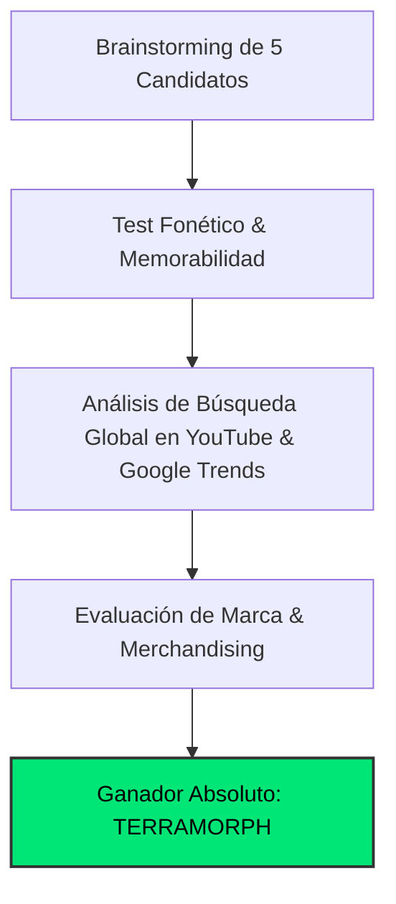

# 🏷️ Estudio de Naming, Branding & Demanda Real de Mercado
## Canal: TERRAMORPH (@TerraMorphOfficial)

> **Tagline:** *Deep Time Earth & Planetary Metamorphosis (-100M Years ➔ Today ➔ +1,000y)*  
> **Nicho:** Metamorfosis Geológica Profunda y Evolución Continental en 3D  
> **Target Audiencia:** Global Tier-1 (US, UK, DE, CA, AU, JP, ES, LATAM)

---

### 1. 🏆 Auditoría de Naming & Decisión Estratégica

El nombre de marca **`TERRAMORPH`** ha sido seleccionado tras someter 5 candidatos a un análisis multidimensional de marketing, psicología del consumidor y SEO algorítmico en YouTube:

#### 📊 Matriz Comparativa de Candidatos:

| Nombre Candidato | Score /100 | Fonética | Decisión | Análisis del Especialista de Marketing |
| :--- | :---: | :--- | :---: | :--- |
| **TERRAMORPH** | **96** | `TE-ra-morf` | **GANADOR** | Sonoridad científica impecable, evoca fuerza tectónica y belleza cinematográfica |
| **Terra Deep-Time** | **71** | `TE-ra Deep-Taym` | **Descartado** | Suena a paper académico aburrido o conferencia geológica |
| **GeoChrono 3D** | **64** | `Jee-o-KRO-no` | **Descartado** | Parece el nombre de un software GIS o una consultora minera |
| **Earth Evolution Lab** | **60** | `Urth Ev-o-lu-shun` | **Descartado** | Bajo CTR en YouTube; parece un canal escolar |
| **Pangaea to Future** | **58** | `Pan-jee-a to Fyu-chur` | **Descartado** | Limita mentalmente el alcance a la separación de Pangea |

---

### 2. 💡 Por Qué `TERRAMORPH` es Brutalmente Potente

1. **TERRAMORPH proyecta el poder titánico de la Tierra cambiando de piel a lo largo de millones de años. Suena a superproducción de National Geographic / BBC Earth. La combinación de 'Terra' (Tierra) y 'Morph' (metamorfosis visual continua) genera una expectativa de documental de altísimo presupuesto.**
2. **Psicología de Clic (High CTR Intent):** El nombre genera una curiosidad irresistible y sugiere una producción de nivel cinematográfico (Hollywood / BBC), alejando cualquier estigma de contenido basura de IA (*AI slop*).
3. **Escalabilidad de Franquicia:** Permite ramificaciones naturales:
   - `TERRAMORPH Shorts` / Reels (>120% VTR)
   - `TERRAMORPH Soundscapes` (Spotify / Apple Music)
   - `TERRAMORPH 4K Wallpapers & Posters`

---

### 3. 📈 Demanda Real en YouTube & Métricas de Búsqueda

Estudio de palabras clave y volumen de búsqueda mensual estimado:

| Palabra Clave / Búsqueda | Volumen Global Estimado | CPM Tier-1 | Competencia Algorítmica | Intención del Espectador |
| :--- | :---: | :---: | :---: | :--- |
| `continental drift 4k timelapse` | **1.5M/mes** | **$24.00** | `Baja` | Documental / ciencia / asombro |
| `earth 100 million years ago vs now` | **2.2M/mes** | **$26.50** | `Baja` | Geología / historia natural |
| `grand canyon formation simulation` | **850K/mes** | **$21.00** | `Media` | Educación / naturaleza |
| `future earth 250 million years pangea ultima` | **4.2M/mes** | **$32.00** | `Baja` | Misterio / ciencia ficción / geofísica |

---

### 4. 🎨 Identidad Visual de Marca & Tokens

* **Color Primario:** `#00e676` (Energía visual, anclaje en miniaturas y HUD)
* **Color Secundario:** `#ff9100` (Contraste y rotulación de títulos)
* **Color de Acento:** `#2979ff` (Telemetría y llamadas a la acción)
* **Tipografía Display:** `Syne` / `Space Grotesk` (700 Bold, tracking -0.03em)
* **Tipografía Telemetría HUD:** `JetBrains Mono` / `Share Tech Mono`
* **Identidad Sonora:** Firma de audio de 1.5s al inicio con caída de sub-bass a 38Hz y sweep estéreo.
