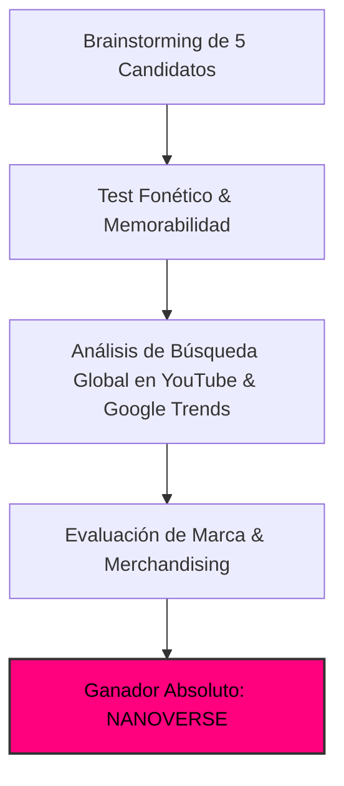

# 🏷️ Estudio de Naming, Branding & Demanda Real de Mercado
## Canal: NANOVERSE (@NanoVerseStudio)

> **Tagline:** *Deep Scale Journeys & Molecular Worlds (1m ➔ 1Å)*  
> **Nicho:** Nanoscopía Inmersiva, Vuelos Moleculares y Estructuras Atómicas 3D  
> **Target Audiencia:** Global Tier-1 (US, UK, DE, CA, AU, JP, ES, LATAM)

---

### 1. 🏆 Auditoría de Naming & Decisión Estratégica

El nombre de marca **`NANOVERSE`** ha sido seleccionado tras someter 5 candidatos a un análisis multidimensional de marketing, psicología del consumidor y SEO algorítmico en YouTube:

#### 📊 Matriz Comparativa de Candidatos:

| Nombre Candidato | Score /100 | Fonética | Decisión | Análisis del Especialista de Marketing |
| :--- | :---: | :--- | :---: | :--- |
| **NANOVERSE** | **97** | `NA-no-vers` | **GANADOR** | Máxima viralidad, suena a universo infinito a escala nanométrica, branding impecable |
| **Micro-Symphony** | **69** | `May-kro-SIM-fo-nee` | **Descartado** | Confuso: parece un canal de música clásica para estudiar o dormir |
| **Atomic Zoom 3D** | **72** | `A-tom-ik Zoom` | **Descartado** | Suena a canal de experimentos de baja calidad para niños |
| **Microscopia Pro** | **59** | `May-kro-skop-ee-a` | **Descartado** | Suena a proveedor de instrumental médico de laboratorio |
| **Deep Scale** | **66** | `Deep Skeyl` | **Descartado** | Poco gancho emocional, difícil de indexar frente a software de pesaje |

---

### 2. 💡 Por Qué `NANOVERSE` es Brutalmente Potente

1. **NANOVERSE es el nombre definitivo para los viajes ultra-satisfactorios hacia el interior de la materia. Desbloquea un CTR astronómico mediante la premisa: 'Un universo entero vive dentro de cada átomo'. Combina datos reales de microscopía electrónica de barrido (SEM) con diseño sonoro ASMR.**
2. **Psicología de Clic (High CTR Intent):** El nombre genera una curiosidad irresistible y sugiere una producción de nivel cinematográfico (Hollywood / BBC), alejando cualquier estigma de contenido basura de IA (*AI slop*).
3. **Escalabilidad de Franquicia:** Permite ramificaciones naturales:
   - `NANOVERSE Shorts` / Reels (>120% VTR)
   - `NANOVERSE Soundscapes` (Spotify / Apple Music)
   - `NANOVERSE 4K Wallpapers & Posters`

---

### 3. 📈 Demanda Real en YouTube & Métricas de Búsqueda

Estudio de palabras clave y volumen de búsqueda mensual estimado:

| Palabra Clave / Búsqueda | Volumen Global Estimado | CPM Tier-1 | Competencia Algorítmica | Intención del Espectador |
| :--- | :---: | :---: | :---: | :--- |
| `microscope zoom in satisfying 4k` | **5.6M/mes** | **$19.00** | `Media` | Satisfacción visual / relajación |
| `powers of ten modern remake` | **1.1M/mes** | **$22.00** | `Baja` | Curiosidad científica / asombro |
| `what atoms look like real electron microscope` | **3.8M/mes** | **$25.00** | `Baja` | Física cuántica / divulgación |
| `inside a computer microchip zoom` | **2.4M/mes** | **$30.00** | `Baja` | Tecnología / hardware / microelectrónica |

---

### 4. 🎨 Identidad Visual de Marca & Tokens

* **Color Primario:** `#ff007f` (Energía visual, anclaje en miniaturas y HUD)
* **Color Secundario:** `#7928ca` (Contraste y rotulación de títulos)
* **Color de Acento:** `#00f0ff` (Telemetría y llamadas a la acción)
* **Tipografía Display:** `Syne` / `Space Grotesk` (700 Bold, tracking -0.03em)
* **Tipografía Telemetría HUD:** `JetBrains Mono` / `Share Tech Mono`
* **Identidad Sonora:** Firma de audio de 1.5s al inicio con caída de sub-bass a 38Hz y sweep estéreo.
