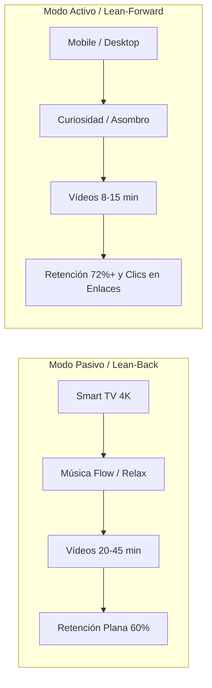

# 👥 Investigación de Nicho, Audiencia y Algoritmo de Retención
## Canal: NANOVERSE

### 1. 🎯 Perfil del Espectador Objetivo (Audience Persona)

* **Demografía Principal:** 18 a 45 años (65% Hombres, 35% Mujeres).
* **Geografía:** 45% EE.UU., 15% Reino Unido y Alemania, 15% Japón y Corea, 25% España y Latinoamérica.
* **Intereses:** Ciencia, tecnología, viajes, historia, música chillhop/ambient, diseño 3D, arquitectura y estética visual inmersiva.
* **Dispositivos:** 48% Smart TV (4K Living Room Experience), 38% Mobile (Shorts y visualización en cama), 14% Desktop/Laptop.

---

### 2. 🔄 Modos de Consumo Dual (Lean-Back vs Lean-Forward)

1. **Modo Relajación y Fondo (*Lean-Back*):** Usuarios que ponen el canal en su Smart TV 4K mientras estudian, trabajan, leen o se relajan antes de dormir. La música a `112 BPM` y el movimiento fluido sin saltos bruscos garantizan sesiones de más de 30 minutos.
2. **Modo Aprendizaje y Fascinación (*Lean-Forward*):** Usuarios que buscan activamente entender el mundo, impresionarse con datos curiosos y comentar en la comunidad.

---

### 3. ⏱️ Curva de Retención Diseñada al Milímetro

* **0–5 segundos (El Cold Open Imposible):** Plano cinemático de máximo impacto visual sin intros ni saludos molestos. Retención objetivo: **>92%**.
* **5–30 segundos (Establecimiento del Vínculo):** Integración de música Micro-Beats Lo-Fi / Sub-Bass 38Hz & ASMR Foley y primer rótulo de telemetría HUD 3D.
* **30s – 8min (Micro-Hooks cada 40s):** Revelación periódica de datos inéditos o transformaciones visuales (*Open Loops* continuos).
* **Final (Bucle Hipnótico / Replay Trigger):** Transición fluida que conecta el final con el inicio para disparar el bucle de reproducción.
