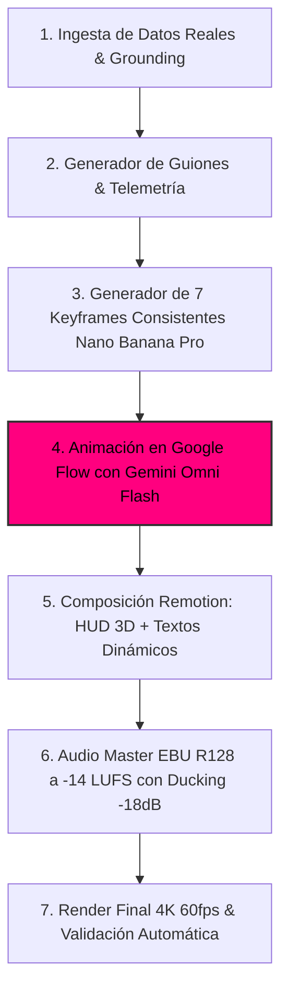

# 🛠️ Workflow Técnico Automatizado en `videopro`
## Canal: NANOVERSE

### 1. 🏗️ Arquitectura del Pipeline de Producción

---

### 2. ⚙️ Componentes Técnicos Detallados

#### A. Ingesta & Grounding Fáctico
* Extracción automatizada de imágenes reales, mapas de elevación (DEM), micrografías o datos de satélite.
* Control de calidad óptico: filtro de resolución mínima $3840 \times 2160$, comprobación de tamaño $>5\text{ KB}$ y varianza laplaciana de nitidez $\ge 100.0$.

#### B. Generación de 7 Keyframes Consistentes
* Uso del modelo `gemini-3.1-flash-image` (Nano Banana Pro) para renderizar los 7 ángulos y posiciones del plano cinemático, fijando la coherencia arquitectónica, biológica o astronómica.

#### C. Animación de Vídeo en Google Flow
* Motor exclusivo: **Gemini Omni Flash** (`gemini-omni-flash-preview`).
* Parámetros: Aspect Ratio `16:9` (y versión derivada `9:16`), duración de plano 5-8s, interpolación de 6 grados de libertad (6-DoF). **Cero uso de Veo 3**.

#### D. Composición de HUD 3D en Remotion
* Componentes React vectoriales con aceleración GPU para renderizar:
  - Altímetro / Escala métrica dinámica.
  - Coordenadas geográficas / astronómicas / nanométricas en tiempo real.
  - Rótulos 3D anclados al espacio (*billboard tracking*).

#### E. Audio Engineering & Master EBU R128
* Música de fondo: **Micro-Beats Lo-Fi / Sub-Bass 38Hz & ASMR Foley** a **112 BPM**.
* Normalización sonora: **-14 LUFS** integrado, True Peak **-1.0 dBTP**.
* *Ducking* dinámico inteligente: reducción a **-18 dB** durante locución/datos y subida a **0 dB** en momentos de clímax visual.
