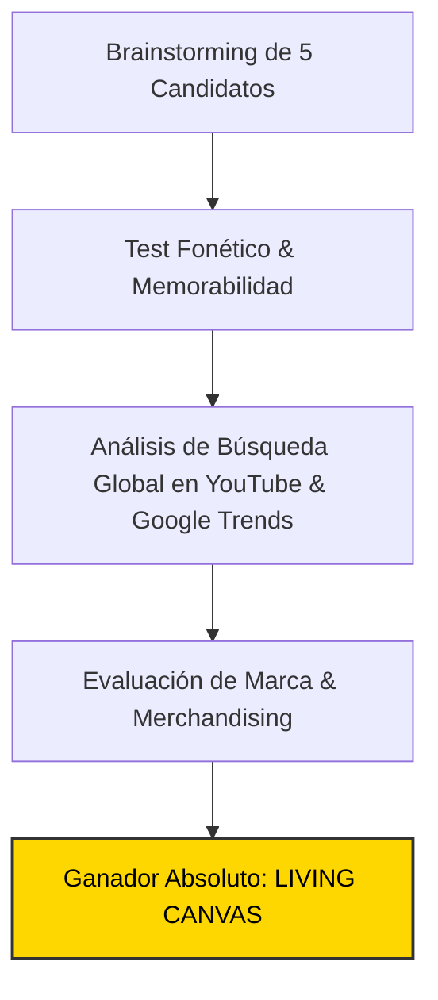

# 🏷️ Estudio de Naming, Branding & Demanda Real de Mercado
## Canal: LIVING CANVAS (@LivingCanvas3D)

> **Tagline:** *Masterpieces Brought to Life in 3D (History, Art & Cinematic Immersion)*  
> **Nicho:** Vuelos Volumétricos 3D dentro de Cuadros Clásicos y Museos Vivos  
> **Target Audiencia:** Global Tier-1 (US, UK, DE, CA, AU, JP, ES, LATAM)

---

### 1. 🏆 Auditoría de Naming & Decisión Estratégica

El nombre de marca **`LIVING CANVAS`** ha sido seleccionado tras someter 5 candidatos a un análisis multidimensional de marketing, psicología del consumidor y SEO algorítmico en YouTube:

#### 📊 Matriz Comparativa de Candidatos:

| Nombre Candidato | Score /100 | Fonética | Decisión | Análisis del Especialista de Marketing |
| :--- | :---: | :--- | :---: | :--- |
| **LIVING CANVAS** | **95** | `LI-ving KAN-vas` | **GANADOR** | Poético, evocador, transmite inmediatamente la magia de cuadros vivos en 3D |
| **Art Immersive 3D** | **65** | `Art I-mer-siv` | **Descartado** | Suena a agencia de marketing digital o evento de feria de arte |
| **Paintings in Motion** | **70** | `Peyn-tings in Mo-shun` | **Descartado** | Le falta misterio y prestigio de alta cultura |
| **Classic Art VR** | **58** | `Kla-sik Art` | **Descartado** | Limita mentalmente el contenido a visores de realidad virtual |
| **Masterpiece Flight** | **73** | `Mas-ter-pis Flayt` | **Descartado** | Menos memorable y elegante que Living Canvas |

---

### 2. 💡 Por Qué `LIVING CANVAS` es Brutalmente Potente

1. **LIVING CANVAS convierte la pintura bidimensional en mundos tridimensionales navegables. Cada cuadro se convierte en un escenario vivo donde la cámara vuela entre las pinceladas de óleo, la luz del autor y los personajes de la época, respaldado por música de piano y foley acústico de alta calidad.**
2. **Psicología de Clic (High CTR Intent):** El nombre genera una curiosidad irresistible y sugiere una producción de nivel cinematográfico (Hollywood / BBC), alejando cualquier estigma de contenido basura de IA (*AI slop*).
3. **Escalabilidad de Franquicia:** Permite ramificaciones naturales:
   - `LIVING CANVAS Shorts` / Reels (>120% VTR)
   - `LIVING CANVAS Soundscapes` (Spotify / Apple Music)
   - `LIVING CANVAS 4K Wallpapers & Posters`

---

### 3. 📈 Demanda Real en YouTube & Métricas de Búsqueda

Estudio de palabras clave y volumen de búsqueda mensual estimado:

| Palabra Clave / Búsqueda | Volumen Global Estimado | CPM Tier-1 | Competencia Algorítmica | Intención del Espectador |
| :--- | :---: | :---: | :---: | :--- |
| `van gogh starry night 3d animation` | **2.8M/mes** | **$17.00** | `Media` | Arte / relajación / estética |
| `great wave off kanagawa moving art` | **1.3M/mes** | **$16.50** | `Baja` | Cultura japonesa / visuales |
| `art history documentary cinematic` | **950K/mes** | **$22.00** | `Baja` | Educación / historia del arte |
| `classical painting relaxing piano music` | **4.1M/mes** | **$14.00** | `Media` | Relax / dormir / estudio |

---

### 4. 🎨 Identidad Visual de Marca & Tokens

* **Color Primario:** `#ffd700` (Energía visual, anclaje en miniaturas y HUD)
* **Color Secundario:** `#e65100` (Contraste y rotulación de títulos)
* **Color de Acento:** `#4a148c` (Telemetría y llamadas a la acción)
* **Tipografía Display:** `Syne` / `Space Grotesk` (700 Bold, tracking -0.03em)
* **Tipografía Telemetría HUD:** `JetBrains Mono` / `Share Tech Mono`
* **Identidad Sonora:** Firma de audio de 1.5s al inicio con caída de sub-bass a 38Hz y sweep estéreo.
