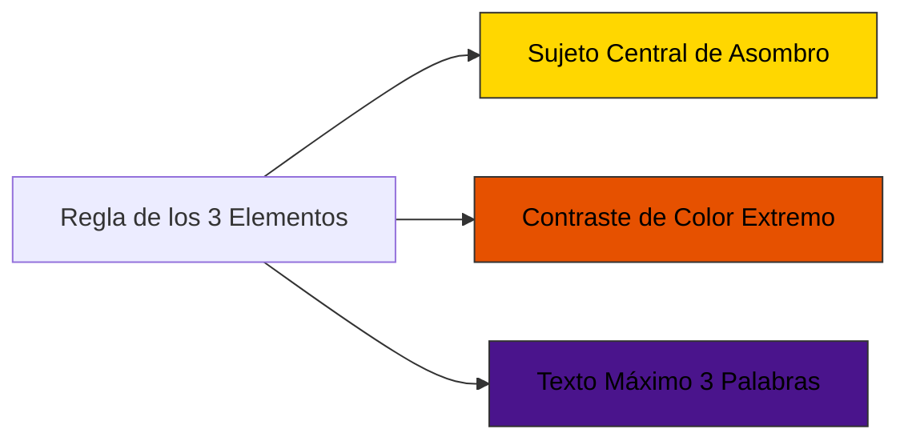

# 🎨 Branding, Diseño de Canal y Miniaturas de Alto CTR (>12%)
## Canal: LIVING CANVAS

### 1. 🖼️ Fórmula de Ingeniería de Miniaturas (Click-Through Rate > 12%)

1. **La Regla de los 3 Elementos:** Nunca sobrecargar la miniatura. 1 elemento principal (ej. edificio futurista vs histórico), 1 flecha/línea de telemetría sutil y máximo 2-3 palabras en tipografía gruesa.
2. **Contraste Cromático:** Uso de la paleta `#ffd700` sobre fondos oscuros o complementarios `#e65100`.
3. **Mapas de Calor Visual:** El 70% del peso visual debe concentrarse en el tercio central e izquierdo, evitando la esquina inferior derecha (donde YouTube coloca la duración del vídeo).

---

### 2. 🔤 Sistema de Títulos de Alta Conversión

* **Fórmula 1 (Contraste Temporal / Escala):** `[Lugar/Objeto] hace 400 Años vs HOY vs Año 2226`
* **Fórmula 2 (Inmersión Imposible):** `Volando DENTRO de [Lugar/Objeto] en 4K (No Creerás lo que Hay)`
* **Fórmula 3 (Simulación Científica):** `Así Será [Lugar] en 200 Años según la Ciencia (Simulación 3D)`
