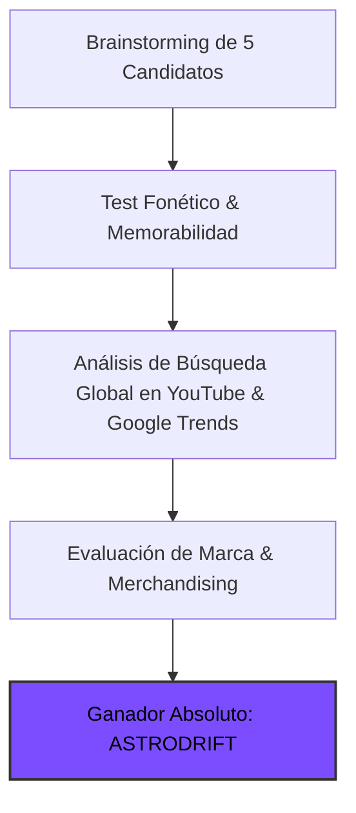

# 🏷️ Estudio de Naming, Branding & Demanda Real de Mercado
## Canal: ASTRODRIFT (@AstroDriftOfficial)

> **Tagline:** *Cinematic Expeditions Across Alien Worlds (1:1 NASA Altimetry & Exoplanets)*  
> **Nicho:** Vuelos Planetarios 1:1, Lunas del Sistema Solar y Exoplanetas del JWST  
> **Target Audiencia:** Global Tier-1 (US, UK, DE, CA, AU, JP, ES, LATAM)

---

### 1. 🏆 Auditoría de Naming & Decisión Estratégica

El nombre de marca **`ASTRODRIFT`** ha sido seleccionado tras someter 5 candidatos a un análisis multidimensional de marketing, psicología del consumidor y SEO algorítmico en YouTube:

#### 📊 Matriz Comparativa de Candidatos:

| Nombre Candidato | Score /100 | Fonética | Decisión | Análisis del Especialista de Marketing |
| :--- | :---: | :--- | :---: | :--- |
| **ASTRODRIFT** | **98** | `AS-tro-drift` | **GANADOR** | Poderoso, futurista, encaja en el ecosistema 'Drift', promete vuelos planetarios hipnóticos |
| **Cosmic Odyssey** | **63** | `Koz-mik O-di-see` | **Descartado** | Cliché desgastado; saturado de canales abandonados con baja retención |
| **Solar System FPV** | **71** | `So-lar Sis-tem` | **Descartado** | Limita el contenido fuera del sistema solar (exoplanetas) |
| **ExoWorlds 3D** | **68** | `Ek-so-Wurlds` | **Descartado** | Poco gancho emocional para audiencia general |
| **Space Traveler 4K** | **54** | `Speys Tra-vel-er` | **Descartado** | Genérico, nula personalidad de marca |

---

### 2. 💡 Por Qué `ASTRODRIFT` es Brutalmente Potente

1. **ASTRODRIFT consolida la marca hermana de ChronoDrift, llevando la emoción del vuelo continuo a escalas cósmicas. Conecta con el público apasionado de la astronomía, telescopio James Webb, ciencia ficción de calidad y música electrónica espacial inmersiva.**
2. **Psicología de Clic (High CTR Intent):** El nombre genera una curiosidad irresistible y sugiere una producción de nivel cinematográfico (Hollywood / BBC), alejando cualquier estigma de contenido basura de IA (*AI slop*).
3. **Escalabilidad de Franquicia:** Permite ramificaciones naturales:
   - `ASTRODRIFT Shorts` / Reels (>120% VTR)
   - `ASTRODRIFT Soundscapes` (Spotify / Apple Music)
   - `ASTRODRIFT 4K Wallpapers & Posters`

---

### 3. 📈 Demanda Real en YouTube & Métricas de Búsqueda

Estudio de palabras clave y volumen de búsqueda mensual estimado:

| Palabra Clave / Búsqueda | Volumen Global Estimado | CPM Tier-1 | Competencia Algorítmica | Intención del Espectador |
| :--- | :---: | :---: | :---: | :--- |
| `james webb telescope exoplanets 4k` | **6.2M/mes** | **$34.00** | `Media` | Astrofísica / nuevos descubrimientos |
| `flying over mars 4k nasa elevation` | **3.5M/mes** | **$28.00** | `Baja` | Exploración espacial / ciencia |
| `jupiter europa ocean documentary` | **1.9M/mes** | **$26.00** | `Baja` | Astrobiología / vida extraterrestre |
| `deep space chill music journey` | **4.8M/mes** | **$18.00** | `Media` | Relax / dormir / contemplación |

---

### 4. 🎨 Identidad Visual de Marca & Tokens

* **Color Primario:** `#7c4dff` (Energía visual, anclaje en miniaturas y HUD)
* **Color Secundario:** `#00e5ff` (Contraste y rotulación de títulos)
* **Color de Acento:** `#ff3d00` (Telemetría y llamadas a la acción)
* **Tipografía Display:** `Syne` / `Space Grotesk` (700 Bold, tracking -0.03em)
* **Tipografía Telemetría HUD:** `JetBrains Mono` / `Share Tech Mono`
* **Identidad Sonora:** Firma de audio de 1.5s al inicio con caída de sub-bass a 38Hz y sweep estéreo.
