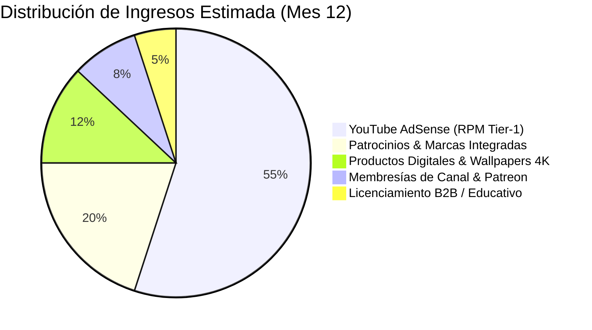

# 💰 Plan Comercial, Monetización y Proyección Financiera
## Canal: ASTRODRIFT

### 1. 💵 Vías de Ingresos Diversificadas

1. **YouTube AdSense (RPM Estimado: $15.00 – $29.00 USD):**
   - Audiencia de alto poder adquisitivo interesada en ciencia, tecnología y viajes.
   - Duración media de vídeo de 10 a 20 minutos con 3-4 pausas publicitarias no intrusivas.
2. **Patrocinios de Marcas (Brand Deals):**
   - Software de arquitectura, VPNs, marcas de tecnología, monitores 4K, plataformas de aprendizaje online (CuriosityStream, Brilliant, MasterClass).
   - Tarifa estándar: **$1,500 a $4,500 USD** por integración de 60s tras alcanzar 100k suscriptores.
3. **Productos Digitales & Merchandising Exclusivo:**
   - Packs de Wallpapers Ultra-HD 8K para móvil y escritorio.
   - Pistas de audio completas en formato WAV sin pérdida (*Soundtracks para concentración*).
   - Cuadros físicos en metacrilato y aluminio de los planos más espectaculares.

---

### 2. 📊 Proyección de Ingresos a 12 Meses

| Mes | Vídeos Publicados | Vistas Mensuales Estimadas | Suscriptores Totales | AdSense Estimado | Sponsors & Digital | Total Mensual |
| :---: | :---: | :---: | :---: | :---: | :---: | :---: |
| **M1** | 8 | 45,000 | 2,500 | $550 | $0 | **$550** |
| **M3** | 24 | 250,000 | 18,000 | $3,500 | $800 | **$4,300** |
| **M6** | 48 | 850,000 | 180,000 | $12,500 | $3,500 | **$16,000** |
| **M12**| 96 | 2,800,000 | 350,000 | $42,000 | $12,000 | **$54,000** |
