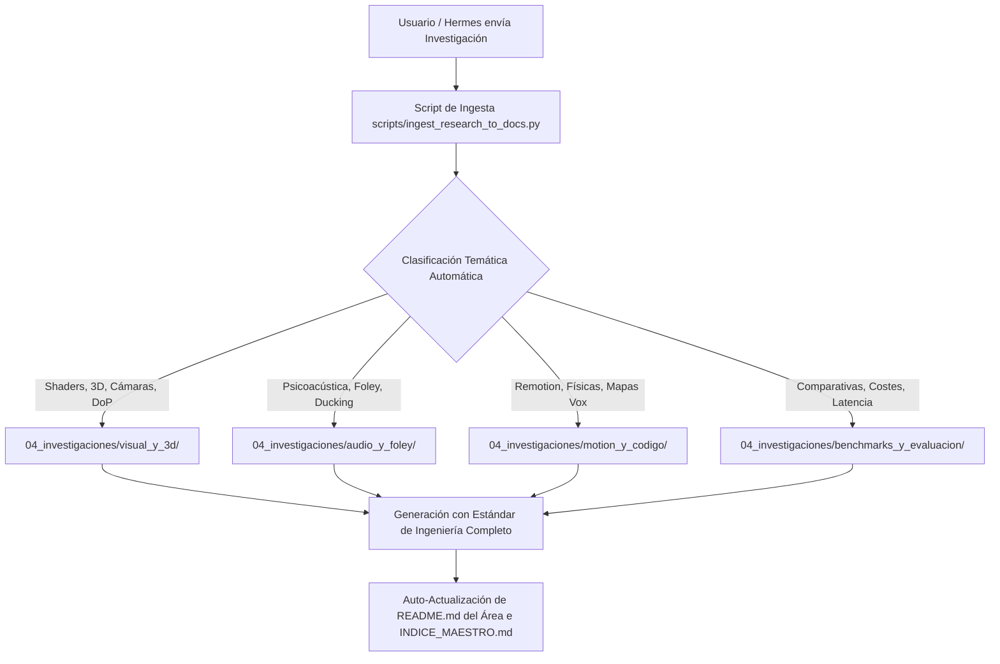

# ⚡ SOP: Procedimiento Operativo Estándar para Ingesta y Documentación de Investigaciones

> **Objetivo:** Permitir que el usuario o cualquier agente envíe investigaciones, notas o descubrimientos sobre nuevas tecnologías y que queden estructurados, redactados y archivados automáticamente en la jerarquía de `docs/04_investigaciones/`.

---

## 🔄 1. Flujo del Workflow de Ingesta



---

## 🛠️ 2. Cómo Usar el Workflow

### Opción A: Desde la Terminal (Línea de Comandos)
```bash
python3 scripts/ingest_research_to_docs.py \
  --title "Integración de Shaders de Ruido Perlin en React Three Fiber" \
  --area visual_y_3d \
  --file /tmp/mi_investigacion.md
```

### Opción B: Mediante Petición en Lenguaje Natural al Agente
Simplemente pídele al asistente:
> *"He investigado sobre cómo hacer mapas 3D con Mapbox y Three.js en Remotion. Aquí tienes mis notas: [...]. Documenta esto con el workflow en docs."*

El asistente invocará `scripts/ingest_research_to_docs.py` y redactará el tratado técnico completo.

---

## 📐 3. Requisitos del Estándar de Ingeniería en Cada Documento

Cada investigación procesada por este workflow debe incluir obligatoriamente:
1. **Fundamentos Teóricos & Matemáticos:** Ecuaciones de movimiento, osciladores, curvas de decibelios o transformaciones espaciales.
2. **Contratos de Entrada/Salida Tipados:** Interfaces TypeScript o esquemas JSON de configuración.
3. **Código 100% Real y Funcional:** Snippets completos de React, TypeScript, GLSL, FFmpeg CLI o Python sin pseudocódigo ni placeholders.
4. **Casos de Uso Cinemáticos:** Parámetros recomendados para producción real.
5. **Mitigación de Edge Cases:** Prevención de pantallas negras, memory leaks o clics de fase de audio.
