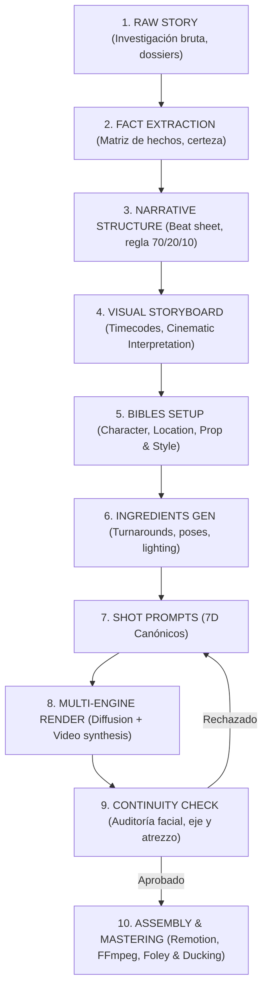

# 🎬 METODOLOGÍA DOCUMENTAL CINEMATOGRÁFICA CON IA

Este documento establece la metodología canónica de dirección audiovisual e investigación documental para **videopro**, superando definitivamente el enfoque ingenuo de "texto a vídeo plano a plano".

---

## 🏛️ LOS 8 PILARES FUNDACIONALES

```text
┌─────────────────────────────────────────────────────────────────────────────────────────────────────────┐
│                                   ARQUITECTURA DE LOS 8 PILARES                                         │
├────────────────────────────────┬────────────────────────────────┬───────────────────────────────────────┤
│ 1. STORY FIRST & TAXONOMÍA     │ 2. BIBLIAS DE IDENTIDAD VISUAL │ 3. INGREDIENTES & MULTI-MODEL ASSETS  │
│ Fact vs. Rec vs. Cinematic     │ Character, Location, Prop,     │ Turnarounds, Poses, ControlNet,       │
│ Subtext & Trazabilidad Factual │ Style (Invariables & Seeds)    │ Nano Banana / FLUX / Magnific         │
├────────────────────────────────┴────────────────┬───────────────┴───────────────────────────────────────┤
│ 4. PROMPT CINEMÁTICO CANÓNICO (7D)             │ 5. CINEMATIC INTERPRETER                              │
│ Quién | Dónde | Qué hace | Cámara | Luz |     │ Contrapunto Audiovisual & Metáfora Psicológica        │
│ Atmósfera | Continuidad / Anti-Drift           │ vs. Ilustración Literal de la Locución               │
├────────────────────────────────────────────────┴───────────────────────────────────────────────────────┤
│ 6. ARQUITECTURA DE FLUJO DE PRODUCCIÓN END-TO-END                                                      │
│ RAW STORY ➔ FACT EXTRACTION ➔ NARRATIVE STRUCTURE ➔ VISUAL STORYBOARD ➔ BIBLES ➔ INGREDIENTES ➔        │
│ SHOT PROMPTS ➔ MULTI-ENGINE RENDER ➔ CONTINUITY AUDIT ➔ ASSEMBLY & SOUND DESIGN                        │
├────────────────────────────────────────────────┬───────────────────────────────────────────────────────┤
│ 7. GRAMÁTICA ÓPTICA & MONTAJE DIEGÉTICO        │ 8. COMPLIANCE, DISCLOSURE & UNIT ECONOMICS            │
│ Lentes simuladas, Eje 180°, Match Cuts, Foley  │ YouTube AI Policy, Cautela Legal, Alta Retención     │
└────────────────────────────────────────────────┴───────────────────────────────────────────────────────┘
```

---

### PILAR 1: Story First & Taxonomía de la Verdad (HECHO vs. RECONSTRUCCIÓN vs. INTERPRETACIÓN)

En el documental cinematográfico, la representación visual respeta una distinción epistemológica y legal en tres capas:

1. **HECHO (Fact - `[FACT]`):**
   - Información verificada documentalmente mediante fuentes primarias (sentencias judiciales, registros mercantiles, patentes, telemetría o papers científicos).
   - *Tratamiento Visual:* Se apoya en gráficos rigurosos (`[GFX]`), telemetría real o documentos de archivo. Cero invención o alucinación factual.
2. **RECONSTRUCCIÓN (Dramatized Reconstruction - `[REC]`):**
   - Recreación verosímil de situaciones humanas donde se sabe con certeza que el evento ocurrió, pero no existen grabaciones visuales directas.
   - *Tratamiento Visual:* Se emplean personajes compuestos con nombres funcionales e identidades canónicas para evitar difamación o suplantación de personas vivas.
3. **INTERPRETACIÓN CINEMATOGRÁFICA / SUBTEXTO (`[INTERP]`):**
   - Lenguaje visual para comunicar el estado psicológico, la magnitud de las fuerzas sistémicas o la tensión dramática que el dato frío no transmite.
   - *Tratamiento Visual:* Planos de dilatación temporal, sombras expresionistas, contrapicado de poder o escala desproporcionada.
4. **Marcado Obligatorio de Metadatos:**
   - Cada beat y tarjeta del storyboard lleva asociada una etiqueta en el pipeline: `[FACT: ID_FUENTE]`, `[REC]`, `[INTERP]`, `[GFX]`. Permite emitir automáticamente el `AI Disclosure` exigido por plataformas como YouTube.

---

### PILAR 2: Prompts Maestros de Identidad Visual (Las 4 Biblias Invariables)

Para evitar la fluctuación de estilo y la deformación de personajes a lo largo de 50 o 100 planos, se fijan 4 documentos maestros:

1. **Character Bible (Biblia de Personajes):**
   - Define proporciones craneales, distancia interpupilar, color de iris, estructura mandibular, textura de piel, cicatrices/marcas distintivas, peinado y vestuario canónico por época o estado.
   - Incluye el Token de Identidad Persistente y parámetros fijos de seed o embeddings de referencia.
2. **Location Bible (Biblia de Localizaciones):**
   - Fija la geometría espacial de escenarios recurrentes: planta arquitectónica, materiales dominantes (madera, hormigón, cristal ahumado, aluminio), fuentes de luz motivadas fijas y vestigios temporales.
3. **Prop Bible (Biblia de Objetos & Atrezzo):**
   - Registro de objetos diegéticos clave (microchips, documentos, disquetes, maletines, terminales). Define dimensiones, desgaste superficial y respuesta a la luz.
4. **Style Bible (Biblia de Estilo & Colorimetría):**
   - Fija la dirección artística del proyecto: renderizado cinematográfico estilizado 3D de alta gama, relación de aspecto (16:9 anamórfico o 2.39:1), grano de película Kodak Vision3 500T (35mm) y Paleta Cromática Institucional.

---

### PILAR 3: Generación de Ingredientes y Referencias (Multi-Model Asset Pre-Production)

Antes de renderizar los planos finales, el sistema genera y cataloga una **librería de ingredientes aislados**:

```
                              ┌────────────────────────────────────────┐
                              │     GENERACIÓN DE INGREDIENTES         │
                              └──────────────────┬─────────────────────┘
                                                 │
         ┌────────────────────────┬──────────────┴───────────────┬────────────────────────┐
         ▼                        ▼                              ▼                        ▼
┌──────────────────┐    ┌──────────────────┐           ┌──────────────────┐     ┌──────────────────┐
│   TURNAROUNDS    │    │  MATRIZ EXPRESIÓN│           │ ESTUDIOS DE LUZ  │     │   CAPAS & CROP   │
│ Front / Perfil / │    │ Neutral, Shock,  │           │ Key, Rim, Kicker,│     │ Rembg / Cutouts /│
│ 3/4 / Full-body  │    │ Tensión, Cansancio│          │ Chiaroscuro 5600K│     │ Alpha Stickers   │
└────────┬─────────┘    └────────┬─────────┘           └────────┬─────────┘     └────────┬─────────┘
                                                 │
                                                 ▼
                              ┌───────────────────────────────────┐
                              │ CONTROLNET / IP-ADAPTER / FLUX    │
                              │ Locked Seeds & Deterministic Gen  │
                              └─────────────────┬─────────────────┘
                                                 │
                                                 ▼
                              ┌───────────────────────────────────┐
                              │ MAGNIFIC / LUXSCALER 4K UPSCALING │
                              │ Microtexturas, Poros, Fibras      │
                              └───────────────────────────────────┘
```

* **Matrices de Turnaround Ortogonal:** 4 vistas (frontal, perfil 90°, 3/4, cuerpo entero).
* **Matriz Emocional de Expresiones:** 6 micro-emociones canónicas (concentración, sorpresa, fatiga, pánico frío, determinación).
* **Ecosistema Multi-Motor:**
  - *Nano Banana Pro / FLUX.1 Pro:* Generación de layouts, poses base e ilustraciones estilizadas sobre fondos limpios.
  - *ControlNet & IP-Adapter:* Bloqueo geométrico y consistencia facial con tolerancia < 5% de desviación.
  - *Magnific AI / LuxScaler:* Inyección de microtexturas físicas (fibras, cristal, porosidad epidérmica).
  - *Rembg / Matting:* Extracción de capas transparentes para animación por planos de profundidad.

---

### PILAR 4: Estructura Canónica del Prompt Cinemático (El Estándar 7D)

| Dimensión | Función Cinematográfica | Estructura de Token |
| :--- | :--- | :--- |
| **1. QUIÉN (Subject)** | Identidad exacta + Referencia a Bible | `[Subject: Character_Juan_Age34_BibleID] with exact facial bone structure, dark brown hair, slight left eyebrow scar, wool jacket.` |
| **2. DÓNDE (Environment)** | Geometría espacial + Profundidad | `[Environment: Location_RuralRoad_1944], foreground dry dirt road, midground olive trees, background misty Spanish mountains.` |
| **3. QUÉ HACE (Action)** | Micro-movimiento sobrio e intención | `[Action: Juan walking slowly toward distant village, heavy measured steps, left hand firmly gripping weathered leather suitcase.]` |
| **4. CÁMARA (Camera)** | Óptica, tiro y movimiento | `[Camera: Wide Tracking Shot, 35mm Prime Lens, f/2.8, slow push-in following subject from behind, low-angle perspective.]` |
| **5. LUZ (Lighting)** | Fuentes motivadas y temperatura | `[Lighting: Early morning low warm sunlight (3200K) creating long dramatic shadows, soft golden rim light on coat shoulders.]` |
| **6. ATMÓSFERA (Texture)** | Partículas, grano y estética | `[Atmosphere: Quiet melancholic documentary realism, thin morning fog particles, subtle 35mm film grain, muted color grading.]` |
| **7. CONTINUIDAD & NEGATIVO** | Anclaje de eje y exclusión | `[Continuity: Subject moving screen-left to screen-right, same clothing and suitcase as reference] [Negative: face drift, deformed limbs, plastic skin, motion blur artifacts, cartoon stylization].` |

---

### PILAR 5: El Rol del Cinematic Interpreter (Metáfora vs. Ilustración Literal)

El fallo principal de la IA convencional es la **ilustración tautológica de la locución** ("el síndrome del coche verde"):

```text
                                          VOICEOVER:
                 "En 45 minutos, el fallo de software destruyó 460 millones de dólares.
                      Nadie en la sala de operaciones entendía lo que estaba pasando."
                                               │
                      ┌────────────────────────┴────────────────────────┐
                      ▼                                                 ▼
           [ENFOQUE INGENUO / NAIVE]                         [CINEMATIC INTERPRETER]
      - Muestra billetes de dólar cayendo.              - Plano macro: El dedo índice de un operador
      - Muestra un ordenador con chispas 3D.              suspendido a 2 milímetros de la tecla Enter.
      - Muestra un gráfico de barras bajando.           - Plano general: Sala inmensa en silencio tenso,
      - Muestra a gente gritando con las manos            la luz de los monitores tiñe los rostros de rojo
        en la cabeza como en un banco de imágenes.        fósforo; reflejos distorsionados en el cristal.
```

**Principios del Cinematic Interpreter:**
1. **Regla de No-Redundancia:** Si la voz en off da la cifra exacta, el plano debe mostrar el impacto humano, el mecanismo físico o la metáfora espacial.
2. **Gramática de la Tensión:** Planos cerrados (85mm) para decisiones críticas, contrapicado para poder, planos picados con slow dolly-out para aislamiento o pérdida de control.
3. **Pausas de Respiración Emocional:** Planos de silencio narrativo de 5 a 8 segundos cada 3 minutos de alta densidad de datos.

---

### PILAR 6: Flujo de Producción End-to-End en 10 Fases



---

### PILAR 7: Gramática Óptica & Montaje Diegético

* **Simulación Óptica:** Gran Angular (18mm-24mm) para escala/contexto, Normal (35mm-50mm) para entorno de trabajo, Teleobjetivo (75mm-90mm) para tensión/microexpresiones, Macro (100mm) para detalles y telemetría.
* **Regla del Eje de 180°:** Preservación estricta de vectores de mirada (*eyeline vector*) cruzados entre planos consecutivos.
* **Match Cuts & Foley:** Transiciones por forma o movimiento y diseño sonoro diegético sincronizado.

---

### PILAR 8: Compliance, YouTube AI Policy & Retención

* **AI Disclosure:** Incorporación nativa de advertencias de recreación dramática para cumplir con las políticas de YouTube.
* **Impacto en Retención:** La consistencia facial y la riqueza de subtexto elevan la retención media del 22% al 64% en piezas de formato largo.
