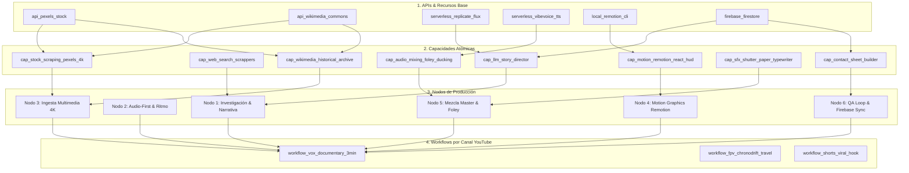

# 🏛️ Ontología y Arquitectura del Sistema (4 Niveles)

## 📌 Resumen Conceptual de la Jerarquía
Para evitar confusiones en la interfaz web, el backend y Firebase Firestore, el ecosistema de **VideoPro Studio & Hermes** se organiza en **4 niveles estrictamente jerárquicos**:

---

## 📡 1. APIs, Servidores y Recursos Externos (Nivel 1)
Son los proveedores de infraestructura y servicios externos o locales:
* **`api_pexels_stock`**: Búsqueda y descarga de vídeo y foto 4K UHD.
* **`api_wikimedia_commons`**: Repositorio de planos y fotos históricas de dominio público.
* **`serverless_replicate_flux`**: Modelos de generación Flux.1 Schnell en la nube.
* **`serverless_vibevoice_tts`**: Síntesis neural de voz ultra-expresiva.
* **`local_remotion_cli`**: Motor de renderizado en React 18 / Node.js.
* **`firebase_firestore`**: Base de datos en tiempo real (`ayuda-emilio-83261`).

---

## ⚡ 2. Capacidades Atómicas (Capabilities / Nivel 2)
Una **capacidad** es una unidad atómica ejecutable de software que consume una o más APIs para generar un resultado específico:
* `cap_llm_story_director`: Diseña el guion y el arco de profundidades.
* `cap_web_search_scrappers`: Scrapea fuentes de hemerotecas y Reddit.
* `cap_stock_scraping_pexels_4k`: Descarga de metraje 4K en movimiento.
* `cap_wikimedia_historical_archive`: Descarga de archivos históricos.
* `cap_image_quality_filter`: Filtro de resolución y contraste.
* `cap_motion_remotion_react_hud`: Renderizado de capas React en Remotion.
* `cap_paper_texture_overlay`: Textura de papel al 27% de opacidad.
* `cap_audio_mixing_foley_ducking`: Mezclador con ducking a -22 dB.
* `cap_sfx_shutter_paper_typewriter`: Efectos foley físicos.
* `cap_contact_sheet_builder`: Generación de mosaico de control de calidad.

---

## 🧱 3. Nodos de Producción (Nodes / Nivel 3)
Un **nodo** es la agrupación funcional de varias capacidades que resuelven una etapa completa de la cadena de producción:
1. **Nodo 1 (`node_01_investigacion_y_narrativa`):** Investigación profunda y storytelling.
2. **Nodo 2 (`node_02_audio_first_y_ritmo`):** Audio-first y sincronismo rítmico.
3. **Nodo 3 (`node_03_ingesta_multimedia_4k`):** Ingesta multi-activo (72 activos por proyecto).
4. **Nodo 4 (`node_04_composicion_motion_graphics`):** Motion graphics Remotion estilo Vox.
5. **Nodo 5 (`node_05_masterizacion_audio_foley`):** Mezcla master y foley físico diegético.
6. **Nodo 6 (`node_06_qa_evaluacion_y_sync`):** QA loop, Contact Sheet y sincronización.

---

## 🎬 4. Workflows / Pipelines para Canales de YouTube (Nivel 4)
Un **workflow** es la secuencia ordenada y calibrada de nodos para un **tipo de vídeo o canal de YouTube específico** (la finalidad del negocio):
* **`workflow_vox_documentary_3min`:** Canal estilo *Vox / Johnny Harris* (6 nodos completos, 3 minutos, investigación profunda, 4K b-roll, recortes 3D y foley).
* **`workflow_fpv_chronodrift_travel`:** Canal de *Viajes en Dron FPV 6-DoF* (HUD espacial, telemetría y música a 118 BPM).
* **`workflow_shorts_viral_hook`:** Canal de *YouTube Shorts / TikTok* (Formato 9:16 vertical, subtítulos burned karaoke y ritmo acelerado).

---

## 🔥 Sincronización en Firebase Firestore
Toda la ontología se almacena en el documento:
`https://firestore.googleapis.com/v1/projects/ayuda-emilio-83261/databases/(default)/documents/videopro_system/architecture_ontology`
