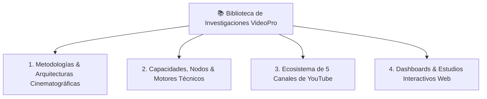

# 📚 BIBLIOTECA MAESTRA DE INVESTIGACIONES: VIDEOPRO v5.0 ULTRA

> **Ubicación:** `/home/ubuntu/workspace/pro/hermes/10_videopro/docs/investigaciones/`  
> **Ecosistema:** VideoPro Studio v5.0 Ultra / Inferencia, Producción & Automatización  

Esta biblioteca alberga el compendio inmutable de metodologías cinematográficas, benchmarks de motores de vídeo, contratos de datos, arquitecturas de integración web, sistemas de audio binaural/ASMR y estrategias de monetización para canales de YouTube automatizados.

---

## 🗂️ Mapa General de la Biblioteca

---

## 1. 🎬 Metodologías, Storytelling & Arquitecturas Cinematográficas

Documentación formal sobre la estructura narrativa, fórmulas de retención, planos FPV y contratos de datos del pipeline:

| Documento | Descripción | Archivo |
| :--- | :--- | :--- |
| **01. Metodología Documental Cinematográfica** | Los 8 pilares para erradicar el enfoque ingenuo: Story First, Fact vs Rec vs Interp, Biblias de Identidad, Ingredientes, Prompt Canónico 7D y Cinematic Interpreter. | [01_metodologia_documental_cinematografica.md](01_metodologia_documental_cinematografica.md) |
| **03. Arquitectura Documentary Director** | Submódulo orquestador, roles agénticos especializados, algoritmo de montaje elástico VO-First y protocolos de QA. | [03_arquitectura_documentary_director.md](03_arquitectura_documentary_director.md) |
| **04. Contratos y Prompts Maestros** | Definición de los 4 prompts maestros operativos y los 4 contratos de datos JSON Schemas para el pipeline. | [04_contratos_y_prompts_maestros.md](04_contratos_y_prompts_maestros.md) |
| **05. Integración Google Flow & Consistencia** | Protocolo CDP/Playwright para Google Flow Web, inyección de fotograma de referencia y auditoría de artefactos. | [05_integracion_google_flow_web_y_consistencia.md](05_integracion_google_flow_web_y_consistencia.md) |
| **06. Arquitectura FPV Tours & Storytelling** | Diseño formal del pipeline de tours FPV 6-DoF, plan de vuelo 3D, shotlist canónico de 7 planos y motor Gemini Omni Flash. | [06_arquitectura_fpv_tours_storytelling_urbano.md](06_arquitectura_fpv_tours_storytelling_urbano.md) |
| **10. Demanda, Retención y Nichos Virales** | Investigación de mercado en YouTube: nichos de alta tracción, psicología del espectador, rechazo al AI slop y fórmula de retención en 4 capas. | [10_demanda_retencion_y_nichos_virales_ciudades.md](10_demanda_retencion_y_nichos_virales_ciudades.md) |
| **10. Canales Automatizados de Alto Impacto** | Dossier de conceptos para canales 100% automatizables (Micro-Cosmos X, Chrono-Spatial 3D, Geo-Forensic X). | [10_canales_automatizados_alto_impacto.md](10_canales_automatizados_alto_impacto.md) |
| **11. ChronoFlight & 5 Canales Automatizados** | Especificación maestra de Vuelos Tritemporales (1626 ➔ 2026 ➔ 2226), scraping multi-ángulo de Street View y 5 conceptos de canales edutainment/ambient. | [11_ciudades_tritemporales_y_5_canales_automatizados.md](11_ciudades_tritemporales_y_5_canales_automatizados.md) |
| **12. SEO, Títulos Alto CTR & Escaleta 10 Episodios** | Estrategia SEO completa de keywords (high-volume & long-tail), 5 fórmulas neurocognitivas de títulos (>14% CTR), matriz A/B/C y escaleta detallada de los 10 primeros episodios maestros de CHRONODRIFT. | [12_chronodrift_seo_titulos_escaleta_10_episodios.md](12_chronodrift_seo_titulos_escaleta_10_episodios.md) |

---

## 2. 🎛️ Capacidades, Nodos & Motores Técnicos (`nodos_capacidades/`)

Directorio exhaustivo con el catálogo técnico de todos los motores de inferencia, herramientas Hermes y procesamiento DSP:

> 👉 **Índice Completo de Capacidades:** [`nodos_capacidades/00_INDICE_CAPACIDADES.md`](nodos_capacidades/00_INDICE_CAPACIDADES.md)

### Módulos Técnicos Disponibles:
1. **FLUX 3 Video Diffusion (Black Forest Labs)**:
   - [Guía Maestra Operativa FLUX 3](nodos_capacidades/flux3/01_guia_maestra_operativa_flux3.md)
   - [Índice Especializado FLUX 3](nodos_capacidades/flux3/00_INDICE_FLUX3.md)
   - [Guía de Escalado CPU 1080p/4K](nodos_capacidades/flux3/08_guia_maestra_flux3_upscale_cpu.md)
   - [Metodología Anti-CGI y Consistencia Facial](nodos_capacidades/flux3/09_metodologia_anti_cgi_y_consistencia_facial.md)
   - [Diagnóstico de Inferencia y Audio Sync](nodos_capacidades/flux3/investigacion_flux3_audio_sync.md)
2. **Google Flow Web & Gemini Omni Flash**:
   - [Guía Maestra Google Flow Web & CDP](nodos_capacidades/google-flow-web/01_guia_maestra_google_flow_web_y_cdp.md)
3. **Flow Music (Google MusicFX / Lyria 3) & Audio 3D / ASMR**:
   - [Plan Maestro Flow Music](nodos_capacidades/flowmusic-via-playwright/00_plan_maestro_flow_music.md)
   - [Automatización Playwright CDP](nodos_capacidades/flowmusic-via-playwright/03_automatizacion_autonoma_playwright_cdp.md)
   - [Estrategia de Quema de Créditos Masivos](nodos_capacidades/flowmusic-via-playwright/04_estrategia_quema_creditos_y_lotes_flowmusic.md)
   - [Arquitectura Oneshot 15 Minutos en 5 Fases](nodos_capacidades/flowmusic-via-playwright/bso_larga_duracion/02_arquitectura_oneshot_15min_y_extension_por_fases.md)
   - [Guía Psicoacústica 432Hz/528Hz & Micro-ASMR](nodos_capacidades/flowmusic-via-playwright/efectos_neurales_mhz_3d_asmr/01_frecuencias_binaural_3d_asmr.md)
   - [Procesamiento Dual Lujo vs Consumo](nodos_capacidades/flowmusic-via-playwright/efectos_neurales_mhz_3d_asmr/02_procesamiento_audio_audiophilo_y_cascos.md)
   - [Mastering Audiófilo para Cascos de Lujo (8 Pilares)](nodos_capacidades/flowmusic-via-playwright/mastering_cascos_lujo/01_guia_mastering_audiofilo_cascos_lujo.md)
   - [Biblioteca de Prompts Maestros](nodos_capacidades/flowmusic-via-playwright/prompts/biblioteca_prompts_maestros.md)
   - [Suites Orquestales 15 Minutos](nodos_capacidades/flowmusic-via-playwright/prompts/02_planes_fases_15min_orquestal_y_cinematico.md)
4. **LTX-2.5 MMDiT 22B Multimodal**:
   - [Guía Maestra LTX-2.5 & Audio Nativo 48kHz](nodos_capacidades/ltx-video-2-5/01_guia_maestra_ltx_video_2_5.md)
5. **Kokoro HD TTS & Foley Director**:
   - [Guía Maestra Kokoro HD & Ducking -22dB](nodos_capacidades/kokoro-tts-foley/01_guia_maestra_kokoro_y_foley_director.md)

---

## 3. 🌐 Ecosistema de 5 Canales de YouTube (`workflows-nodos/workflows-canalesyoutube/`)

Estructura completa para la producción y monetización de 5 canales automatizados de alta retención:

| Canal | Nicho / Temática | Arquitectura & Documentación |
| :--- | :--- | :--- |
| **01. CHRONODRIFT** | Tours FPV Tritemporales (Pasado ➔ Presente ➔ Futuro) | [workflows-nodos/workflows-canalesyoutube/01_CHRONODRIFT/](workflows-nodos/workflows-canalesyoutube/01_CHRONODRIFT/) |
| **02. TERRAMORPH** | Geología Extrema, Cataclismos y Transformación Planetaria | [workflows-nodos/workflows-canalesyoutube/02_TERRAMORPH/](workflows-nodos/workflows-canalesyoutube/02_TERRAMORPH/) |
| **03. NANOVERSE** | Exploración Microscópica y Biología Hiperrealista | [workflows-nodos/workflows-canalesyoutube/03_NANOVERSE/](workflows-nodos/workflows-canalesyoutube/03_NANOVERSE/) |
| **04. LIVING CANVAS** | Historia del Arte Animada, Pinturas Vivas y Estética | [workflows-nodos/workflows-canalesyoutube/04_LIVING_CANVAS/](workflows-nodos/workflows-canalesyoutube/04_LIVING_CANVAS/) |
| **05. ASTRODRIFT** | Astronomía Cinemática, Astrofísica y Viajes Espaciales | [workflows-nodos/workflows-canalesyoutube/05_ASTRODRIFT/](workflows-nodos/workflows-canalesyoutube/05_ASTRODRIFT/) |

*Cada carpeta de canal incluye: `01_naming_branding_y_estudio_demanda_marketing.md`, `02_investigacion_nicho_y_audiencia.md`, `03_benchmarking_y_analisis_competencia.md`, `04_workflow_tecnico_videopro.md`, `05_plan_comercial_y_monetizacion.md`, `06_plan_marketing_y_crecimiento.md`, `07_branding_diseno_y_miniaturas.md`, `08_escaleta_10_primeros_episodios.md` y `channel_config.json`.*

---

## 4. 📊 Dashboards & Estudios Interactivos Web (HTML)

Paneles visuales interactivos accesibles desde el navegador o la interfaz de VideoPro:

1. **[dashboard_ciudades_tritemporales.html](dashboard_ciudades_tritemporales.html)**: Visualizador interactivo con time-slider tritemporal (1626-2026-2226), HUD y waveform de audio.
2. **[dashboard_canales_youtube.html](dashboard_canales_youtube.html)**: Panel de métricas, benchmarks y comparativas de los 5 canales de YouTube.
3. **[nodos_capacidades/proveedores_excel.html](nodos_capacidades/proveedores_excel.html)**: Hoja de cálculo interactiva de proveedores, costes y estado de puertos.
4. **[nodos_capacidades/workflow_designer_studio.html](nodos_capacidades/workflow_designer_studio.html)**: Diseñador visual de grafos y nodos de renderizado.
5. **[nodos_capacidades/comfy_pipeline_studio.html](nodos_capacidades/comfy_pipeline_studio.html)**: Simulador interactivo de pipelines de nodos tipo ComfyUI.
6. **[10_dashboard_demanda_retencion_ciudades.html](10_dashboard_demanda_retencion_ciudades.html)**: Matriz de retención y análisis de audiencia por ciudades.
7. **[canales_alto_impacto.html](canales_alto_impacto.html)**: Comparador de formatos virales de alta retención.
