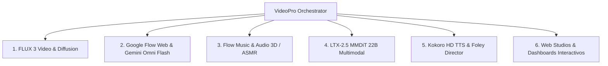

# 🎛️ Biblioteca Maestra de Capacidades, Nodos y Motores de VideoPro

> **Ubicación:** `docs/investigaciones/nodos_capacidades/00_INDICE_CAPACIDADES.md`  
> **Ecosistema:** VideoPro Studio v5.0 Ultra / Infraestructura y Motores de Inferencia  

---

## 📚 Módulos de Motores y Capacidades Especializadas

---

## 🗂️ Catálogo Detallado de Documentación por Capacidad

### 1. FLUX 3 Video Diffusion (Black Forest Labs)
- **Guía Maestra Operativa**: [01_guia_maestra_operativa_flux3.md](file:///home/ubuntu/workspace/pro/hermes/10_videopro/docs/investigaciones/nodos_capacidades/flux3/01_guia_maestra_operativa_flux3.md)
- **Índice Completo FLUX 3**: [00_INDICE_FLUX3.md](file:///home/ubuntu/workspace/pro/hermes/10_videopro/docs/investigaciones/nodos_capacidades/flux3/00_INDICE_FLUX3.md)
- **Diagnóstico Audio Sync & Errores BFL**: [investigacion_flux3_audio_sync.md](file:///home/ubuntu/workspace/pro/hermes/10_videopro/docs/investigaciones/nodos_capacidades/flux3/investigacion_flux3_audio_sync.md)
- **Guía de Escalado CPU 720p ➔ 1080p/4K**: [08_guia_maestra_flux3_upscale_cpu.md](file:///home/ubuntu/workspace/pro/hermes/10_videopro/docs/investigaciones/nodos_capacidades/flux3/08_guia_maestra_flux3_upscale_cpu.md)
- **Metodología Anti-CGI & Consistencia Facial**: [09_metodologia_anti_cgi_y_consistencia_facial.md](file:///home/ubuntu/workspace/pro/hermes/10_videopro/docs/investigaciones/nodos_capacidades/flux3/09_metodologia_anti_cgi_y_consistencia_facial.md)
- **Caso Práctico Shibuya 2326**: [shibuya_2326_investigacion.md](file:///home/ubuntu/workspace/pro/hermes/10_videopro/docs/investigaciones/nodos_capacidades/flux3/shibuya_2326_investigacion.md)

---

### 2. Google Flow Web & Gemini Omni Flash (Google)
- **Guía Maestra Web & CDP**: [01_guia_maestra_google_flow_web_y_cdp.md](file:///home/ubuntu/workspace/pro/hermes/10_videopro/docs/investigaciones/nodos_capacidades/google-flow-web/01_guia_maestra_google_flow_web_y_cdp.md)
- **Integración Web & Consistencia de Fotogramas**: [05_integracion_google_flow_web_y_consistencia.md](file:///home/ubuntu/workspace/pro/hermes/10_videopro/docs/investigaciones/05_integracion_google_flow_web_y_consistencia.md)
- **Benchmark Google Flow vs FLUX 3**: [02_benchmark_google_flow_vs_flux3.md](file:///home/ubuntu/workspace/pro/hermes/10_videopro/docs/investigaciones/nodos_capacidades/flux3/02_benchmark_google_flow_vs_flux3.md)

---

### 3. Flow Music & Audio Espacial 3D / ASMR (Google MusicFX / Lyria 3)
- **Plan Maestro Flow Music**: [00_plan_maestro_flow_music.md](file:///home/ubuntu/workspace/pro/hermes/10_videopro/docs/investigaciones/nodos_capacidades/flowmusic-via-playwright/00_plan_maestro_flow_music.md)
- **Automatización Playwright CDP**: [03_automatizacion_autonoma_playwright_cdp.md](file:///home/ubuntu/workspace/pro/hermes/10_videopro/docs/investigaciones/nodos_capacidades/flowmusic-via-playwright/03_automatizacion_autonoma_playwright_cdp.md)
- **Estrategia de Quema de Créditos Masivos**: [04_estrategia_quema_creditos_y_lotes_flowmusic.md](file:///home/ubuntu/workspace/pro/hermes/10_videopro/docs/investigaciones/nodos_capacidades/flowmusic-via-playwright/04_estrategia_quema_creditos_y_lotes_flowmusic.md)
- **BSO Continua & Loops**: [01_guia_bso_ambient_continua.md](file:///home/ubuntu/workspace/pro/hermes/10_videopro/docs/investigaciones/nodos_capacidades/flowmusic-via-playwright/bso_larga_duracion/01_guia_bso_ambient_continua.md)
- **Arquitectura Oneshot 15 Minutos en 5 Fases**: [02_arquitectura_oneshot_15min_y_extension_por_fases.md](file:///home/ubuntu/workspace/pro/hermes/10_videopro/docs/investigaciones/nodos_capacidades/flowmusic-via-playwright/bso_larga_duracion/02_arquitectura_oneshot_15min_y_extension_por_fases.md)
- **Frecuencias 432Hz/528Hz & Micro-ASMR**: [01_frecuencias_binaural_3d_asmr.md](file:///home/ubuntu/workspace/pro/hermes/10_videopro/docs/investigaciones/nodos_capacidades/flowmusic-via-playwright/efectos_neurales_mhz_3d_asmr/01_frecuencias_binaural_3d_asmr.md)
- **Procesamiento Dual (Lujo vs Consumo)**: [02_procesamiento_audio_audiophilo_y_cascos.md](file:///home/ubuntu/workspace/pro/hermes/10_videopro/docs/investigaciones/nodos_capacidades/flowmusic-via-playwright/efectos_neurales_mhz_3d_asmr/02_procesamiento_audio_audiophilo_y_cascos.md)
- **Mastering Cascos de Lujo (8 Pilares)**: [01_guia_mastering_audiofilo_cascos_lujo.md](file:///home/ubuntu/workspace/pro/hermes/10_videopro/docs/investigaciones/nodos_capacidades/flowmusic-via-playwright/mastering_cascos_lujo/01_guia_mastering_audiofilo_cascos_lujo.md)
- **Pipeline de Montaje 15 Minutos**: [03_pipeline_montaje_y_mastering_15min.md](file:///home/ubuntu/workspace/pro/hermes/10_videopro/docs/investigaciones/nodos_capacidades/flowmusic-via-playwright/mastering_cascos_lujo/03_pipeline_montaje_y_mastering_15min.md)
- **Biblioteca de Prompts Maestros**: [biblioteca_prompts_maestros.md](file:///home/ubuntu/workspace/pro/hermes/10_videopro/docs/investigaciones/nodos_capacidades/flowmusic-via-playwright/prompts/biblioteca_prompts_maestros.md)
- **Suites Orquestales 15 Minutos (Wide Horizon)**: [02_planes_fases_15min_orquestal_y_cinematico.md](file:///home/ubuntu/workspace/pro/hermes/10_videopro/docs/investigaciones/nodos_capacidades/flowmusic-via-playwright/prompts/02_planes_fases_15min_orquestal_y_cinematico.md)

---

### 4. LTX-2.5 MMDiT 22B Multimodal (Lightricks)
- **Guía Maestra LTX-2.5 & Audio Nativo 48kHz**: [01_guia_maestra_ltx_video_2_5.md](file:///home/ubuntu/workspace/pro/hermes/10_videopro/docs/investigaciones/nodos_capacidades/ltx-video-2-5/01_guia_maestra_ltx_video_2_5.md)

---

### 5. Kokoro HD TTS & Foley Director (Voz Local $0 & SFX)
- **Guía Maestra Kokoro HD & Ducking -22dB**: [01_guia_maestra_kokoro_y_foley_director.md](file:///home/ubuntu/workspace/pro/hermes/10_videopro/docs/investigaciones/nodos_capacidades/kokoro-tts-foley/01_guia_maestra_kokoro_y_foley_director.md)

---

### 6. Dashboards Interactivos & Web Studios
- **Matriz Interactiva de Proveedores tipo Excel**: [proveedores_excel.html](file:///home/ubuntu/workspace/pro/hermes/10_videopro/docs/investigaciones/nodos_capacidades/proveedores_excel.html)
- **Workflow Designer Studio (Nodos Interactivos)**: [workflow_designer_studio.html](file:///home/ubuntu/workspace/pro/hermes/10_videopro/docs/investigaciones/nodos_capacidades/workflow_designer_studio.html)
- **Comfy Pipeline Studio**: [comfy_pipeline_studio.html](file:///home/ubuntu/workspace/pro/hermes/10_videopro/docs/investigaciones/nodos_capacidades/comfy_pipeline_studio.html)
- **Catálogo Técnico de Capacidades Maestras**: [capacidades_maestras.md](file:///home/ubuntu/workspace/pro/hermes/10_videopro/docs/investigaciones/nodos_capacidades/capacidades_maestras.md)
