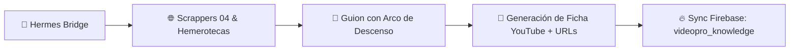

# 🔬 Nodo 01: Investigación Profunda, Narrativa Unificada y Hermes Bridge

## 🎯 Misión del Nodo
Garantizar que el vídeo no sea una lista inconexa de curiosidades aleatorias, sino un **documental narrativo de alto impacto** con un arco conceptual unificado (ej. *Descenso Vertical Subterráneo de 0m a -40m*), respaldado por fuentes verificadas y sincronizado en la nube.

---

## 🛠️ Protocolo Operativo Autónomo de Hermes

### 1. Reglas de Storytelling Obligatorias:
* **Hilo Conductor Unificado:** Prohibido saltar de temas sin conexión. Cada parada debe responder a una progresión lógica (geográfica, cronológica o de profundidad).
* **Estructura en 6 Cotas:** 
  1. `0m`: Superficie visible (El Madrid que todos transitan).
  2. `-5m`: Viajes de Agua Musulmanes del 854 (Qanats de Mayrit).
  3. `-10m`: Pasadizo Secreto Real de 1611 (Felipe III).
  4. `-15m`: Metro Chamberí 1919 y Cripta de Tirso de Molina.
  5. `-20m`: Búnker Militar de la Posición Jaca (Guerra Civil 1937).
  6. `-35m`: Cámara Acorazada del Oro (Foso inundable de Cibeles).
* **Separación de Destinos:**
  * **En Pantalla:** Rótulos minimalistas y telemetría de cota (máximo 1-2 datos clave por escena).
  * **En YouTube (`descripcion_youtube_y_fuentes.md`):** Explicación documental completa, marcas de tiempo exactas y enlaces a archivos oficiales y hemerotecas.

---

## ☁️ Integración Firebase Firestore
Hermes persiste el dossier en:
* Documento: `videopro_knowledge/storytelling_rules`
* Colección de Proyecto: `projects/{project_id}/dossier`
