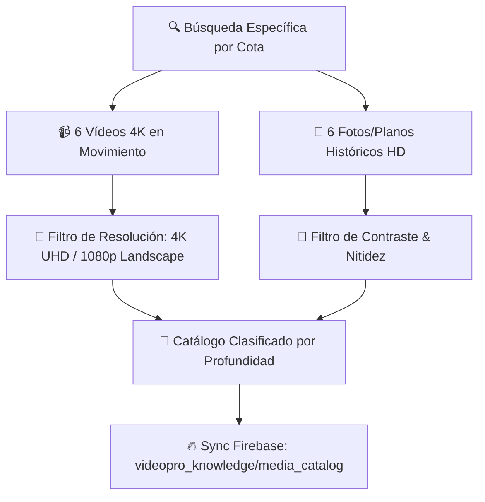

# 🏙️ Nodo 03: Ingesta, Scraping y Descarga Multi-Activo 4K (Hermes Media Engine)

## 🎯 Misión del Nodo
Buscar, descargar y validar **múltiples vídeos 4K e imágenes de archivo histórico de alta resolución** para cada una de las paradas narrativas, descartando planos genéricos sin relación con el tema.

---

## 🛠️ Criterios Profesionales de Selección (72 Activos por Proyecto)

### 1. Requisitos de Calidad:
* **Vídeos 4K:** Movimiento continuo de cámara (dron cinemático, FPV, travelling o panorámica). Prohibidas tomas estáticas de más de 3 segundos sin movimiento.
* **Fotos de Archivo:** Mínimo 800x600px, contraste verificado con PIL (`ImageStat.var > 100`) y preparadas para animación 2.5D Parallax.
* **Prohibiciones Estrictas:** Marcas de agua, bordes negros no deseados y clips de stock desconectados de la temática histórica.
