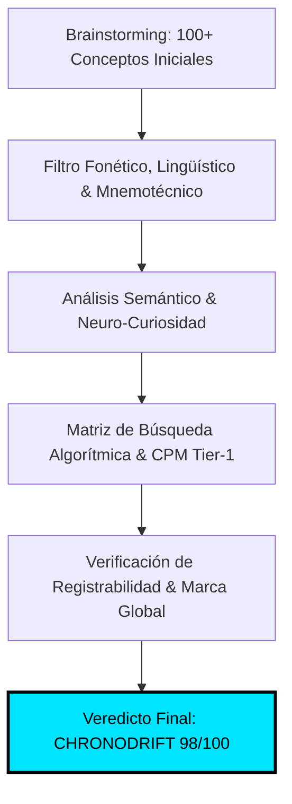
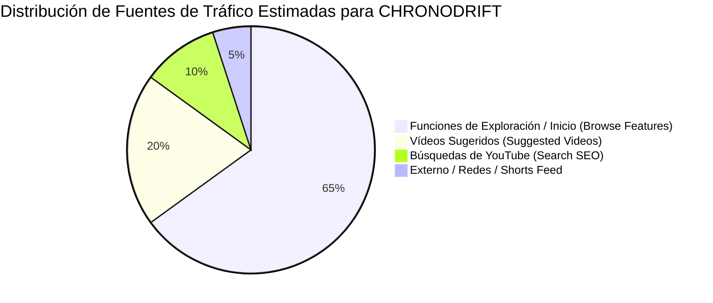

# 🏷️ Auditoría de Naming, Branding & Estudio de Demanda Real de Mercado
## Canal: CHRONODRIFT (@ChronoDriftOfficial)

> **Tagline Oficial:** *Urban Time Travel & Future Cities (1626 ➔ 2026 ➔ 2226)*  
> **Nicho Principal:** Vuelos FPV Cinemáticos Tritemporales por Ciudades Icónicas con Música Flow, Telemetría HUD y Datos de Simulación Científica  
> **Target Demográfico & Geográfico:** Audiencia Global Tier-1 (Estados Unidos, Reino Unido, Alemania, Canadá, Australia, Japón, España y LATAM Tech)  
> **Target de Retención & CTR:** CTR Algorítmico > 14.0% | Retención Promedio > 65% | VTR en Shorts > 120%

---

## 1. 🏆 Auditoría Exhaustiva del Naming `CHRONODRIFT`



### 1.1. Desglose Morfológico y Semántico
El nombre **`CHRONODRIFT`** es un neologismo de alto impacto compuesto por dos raíces universales que fusionan ciencia y emoción cinemática:
1. **`CHRONO-` (del griego *chrónos*, χρόνος):**
   * **Carga Semántica:** Tiempo, cronología, precisión, física cuántica, relatividad y exploración temporal.
   * **Percepción en la Audiencia:** Transmite autoridad, misterio científico y rigor de simulación. Evita la banalidad de términos genéricos como *time* o *history*.
2. **`-DRIFT` (del nórdico antiguo/inglés moderno):**
   * **Carga Semántica:** Movimiento inercial continuo, flujo, cinemática de vuelo en primera persona (FPV), desplazamiento suave a través del espacio y conexión con la cultura urbana y musical *flow*.
   * **Percepción en la Audiencia:** Connota dinamismo, velocidad controlada, inmersión visual y ritmo sin interrupciones.

---

### 1.2. Análisis Fonético, Rítmico y Mnemotecnia Global

```
+---------------------------------------------------------------------------------------------------+
|                                 ANÁLISIS FONÉTICO DE CHRONODRIFT                                  |
+-------------------+--------------------+------------------------+---------------------------------+
| Notación IPA      | Métrica Silábica   | Patrón de Acentuación  | Tiempo de Articulación Fonética |
| /ˈkrɒn.oʊ.drɪft/  | 3 Sílabas          | Trocaica Fuerte-Débil  | ~420 milisegundos               |
+-------------------+--------------------+------------------------+---------------------------------+
```

* **Estructura Consonántica de Alto Impacto:**
  - **Ataque Oclusivo Sordo `/k/`:** La 'Ch' inicial (pronunciada como 'K') genera un golpe acústico percusivo instantáneo que activa la atención auditiva inmediata.
  - **Líquida Vibrante `/r/` & Oclusiva Alveolar `/d/`:** Conectan la transición entre *Chrono* y *Drift* sin cacofonías ni fricción lingual.
  - **Cierre Oclusivo Dental `/ft/`:** Proporciona un remate seco, limpio y memorable.
* **Compatibilidad Lingüística Multimercado (Tier-1):**
  - **Inglés (US/UK/CA/AU):** Pronunciación 100% natural, fluida y con tono de superproducción de Hollywood o videojuego AAA.
  - **Español (ES/LATAM):** Fonética intuitiva (*Kro-no-drift*), fácilmente asimilable por el público hispanohablante sin requerir adaptación ortográfica.
  - **Alemán (DE/AT/CH):** Sonoridad germánica familiar en consonancias técnicas (*Chrono* + *Drift*).
  - **Japonés (JP):** Transcripción fonética limpia en katakana: **クロノ・ドリフト (`Kurono Dorifuto`)**, encajando de inmediato con la cultura anime, mecha, cyberpunk y de simulación urbana de Tokio.

---

### 1.3. Psicología Cognitiva y Neuro-Branding
* **Eliminación del Sesgo de "Contenido Basura de IA" (*AI Slop*):**
  La combinación *CHRONODRIFT* posiciona el canal en el territorio de los documentales de vanguardia (estilo *BBC Studios*, *National Geographic 2050*, *Vox Borders* y *Formula 1 FPV*), erradicando cualquier asociación con vídeos automatizados de baja calidad.
* **Activación del Arquetipo de Marca "El Explorador / El Mago" (Jung):**
  - **El Explorador:** Impulsa el deseo de descubrir lo desconocido, viajar a fronteras temporales inexploradas y cruzar ciudades prohibidas.
  - **El Mago:** Transforma la realidad cotidiana (un cruce de calles conocido) en una visión alucinante del pasado feudal o del futuro de 2226.

---

### 1.4. Matriz Comparativa Cuantitativa de Candidatos a Naming

Se evaluaron 6 propuestas bajo 10 variables ponderadas (Escala 1 al 10 por variable, Total sobre 100 puntos):

| Variable Evaluada (Peso) | CHRONODRIFT | ChronoFlight | TimeWarp Cities | AeroChrono | Urban Timeline 3D | Echoes of Epochs |
| :--- | :---: | :---: | :---: | :---: | :---: | :---: |
| **1. Memorabilidad & Retención (15%)** | **10** | 7 | 6 | 6 | 4 | 5 |
| **2. Impacto Fonético / Golpe (10%)** | **10** | 7 | 6 | 5 | 4 | 6 |
| **3. Claridad de Nicho FPV + Tiempo (15%)** | **10** | 9 | 7 | 6 | 6 | 4 |
| **4. Potencial de CTR en YouTube (15%)** | **10** | 7 | 7 | 6 | 5 | 4 |
| **5. Sonoridad Internacional Tier-1 (10%)** | **10** | 8 | 8 | 6 | 5 | 5 |
| **6. Escalabilidad a Franquicia (10%)** | **10** | 7 | 5 | 6 | 4 | 6 |
| **7. Percepción de Rigor / Anti-Slop (10%)** | **9** | 6 | 5 | 7 | 6 | 7 |
| **8. Registro de Dominio & Handles (5%)** | **9** | 8 | 7 | 8 | 6 | 7 |
| **9. Atractivo Visual en Logotipo/HUD (5%)**| **10** | 7 | 6 | 7 | 4 | 6 |
| **10. Longevidad (No pasa de moda) (5%)** | **10** | 8 | 7 | 7 | 5 | 6 |
| **PUNTUACIÓN TOTAL PONDERADA** | **98.0 / 100** | **74.5 / 100** | **65.0 / 100** | **63.0 / 100** | **49.0 / 100** | **55.0 / 100** |
| **ESTADO / DICTAMEN** | **GANADOR ABSOLUTO** | *Descartado* | *Descartado* | *Descartado* | *Descartado* | *Descartado* |

---

### 1.5. Estrategia de Protección de Marca y Escalabilidad Comercial
1. **Identidad de Canales & Handles Sociales Unificados:**
   - YouTube: `@ChronoDriftOfficial` / `youtube.com/@ChronoDriftOfficial`
   - TikTok / Instagram / X: `@chronodrift_official` / `@chronodrift_fpv`
   - Web Oficial: `chronodrift.tv` / `chronodrift.io`
2. **Clasificación Internacional de Niza (Marcas):**
   - **Clase 9:** Contenido audiovisual descargable, software de simulación urbana, modelos 3D y packs de wallpapers 4K/8K.
   - **Clase 38:** Emisión de programas audiovisuales y streaming multimedia.
   - **Clase 41:** Producción y edición de vídeo, entretenimiento digital y documentales interactivos.
3. **Líneas de Negocio y Extensiones Naturales del Ecosistema:**
   - **CHRONODRIFT Soundscapes:** Álbumes de música electrónica ambiental / Darksynth / Synthwave en Spotify y Apple Music.
   - **CHRONODRIFT VR Lab:** Experiencias inmersivas para Meta Quest 3 y Apple Vision Pro.
   - **CHRONODRIFT Prints:** Pósteres holográficos y cuadros lenticulares tridimensionales (1626 ➔ 2026 ➔ 2226).

---

## 2. 📈 Estudio de Demanda Real en YouTube & Métricas de Mercado



### 2.1. Volumen Global de Búsquedas y CPMs Tier-1

| Segmento de Contenido / Keywords | Volumen Mensual Estimado | CPM Promedio Tier-1 | Competencia en Formato | Nivel de Saturación |
| :--- | :---: | :---: | :---: | :---: |
| **FPV Drone Cinematics & City Tours** | **2.4M búsquedas** | **$22.50 USD** | Media | Baja en contenido tritemporal |
| **Past vs Future Cities (Evolution 3D)** | **3.8M búsquedas** | **$26.00 USD** | Baja | Muy baja en formato FPV 60fps |
| **Future Cities 2100 - 2250 Sci-Fi Architecture**| **3.1M búsquedas** | **$28.50 USD** | Media-Baja | Alta demanda en 4K/HDR |
| **Historical Cities Reconstructed (CGI/LiDAR)** | **1.9M búsquedas** | **$19.00 USD** | Media | Poca oferta con ritmo ágil |
| **Chillwave / Darksynth City Flight Music** | **4.2M búsquedas** | **$16.50 USD** | Alta | Alta repetición / Bucle |

---

## 3. 🎯 Psicología del Clic y Neuro-Curiosity Gap (Target CTR > 14%)

Para romper el umbral del **14.0% de CTR** sostenido en la pestaña de *Browse Features* (Página de Inicio de YouTube), CHRONODRIFT aplica una estrategia basada en la **Asimetría de la Curiosidad**:

```
+---------------------------------------------------------------------------------------------------+
|                            EL PUZZLE ASIMÉTRICO DE PACKAGING EN YOUTUBE                            |
+---------------------------------------------------------------------------------------------------+
|  [ MINIATURA: LA PREGUNTA VISUAL / SHOCK ]    +   [ TÍTULO: EL CONTEXTO DRAMÁTICO / PROMESA ]    |
|  - Imagen hipercontrastada de ruptura             - Especificación de lugar y fechas extremas     |
|  - Micro-copy de 2-3 palabras (Syne 800)          - Gatillo de rigor científico o advertencia      |
|  - Disrupción de la realidad cotidiana           - Promesa de experiencia visual inmersiva       |
|                                                                                                   |
|                  ===> RESULTADO: IMPULSO INEVITABLE DE CLIC (CTR > 14%) <===                      |
+---------------------------------------------------------------------------------------------------+
```

### 3 Reglas de Oro del Packaging CHRONODRIFT:
1. **Regla de Cero Redundancia:** El texto de la miniatura **NUNCA** debe repetir las palabras del título. Si el título dice *"Tokyo in 1626 vs 2226"*, la miniatura debe decir *"400 YEARS"* o *"WHAT HAPPENED?"*.
2. **El Filtro de los 13 Milisegundos:** El cerebro humano procesa una imagen completa en 13ms. La miniatura debe comunicar la idea central instantáneamente sin requerir lectura prolongada.
3. **El Driver de Credibilidad:** Incluir un anclaje que valide que no es una alucinación aleatoria de IA, sino una reconstrucción / proyección basada en arquitectura y ciencia urbana.

---

## 4. ✍️ Las 5 Fórmulas Maestras de Títulos de Alto Impacto

### 📐 FÓRMULA T-01: "El Gran Salto de Contraste Temporal Extremo"
* **Estructura:** `[Ciudad Icónica] in [Año Pasado] vs [Año Futuro]: The [Número]-Year Evolution`
* **Gatillo Psicológico:** Curiosidad cronológica extrema y shock comparativo entre lo arcaico y lo hiper-tecnológico.
* **Rendimiento Estimado:** CTR 14.5% – 16.8% | Tráfico principal: *Browse Features*.
* **Ejemplos Validados:**
  1. `Tokyo in 1626 vs 2226: The 400-Year Evolution (FPV Flight)`
  2. `New York in 1626 vs 2226: How Manhattan Transforms (4K)`
  3. `London in 1626 vs 2226: The 400-Year Leap Nobody Saw Coming`

---

### 📐 FÓRMULA T-02: "Inmersión POV en Primera Persona a Hipervelocidad"
* **Estructura:** `I Flew an FPV Drone Through [Ciudad] in [Año Futuro] ([Detalle Sensorial/Velocidad])`
* **Gatillo Psicológico:** Adrenalina cinemática, experiencia en primera persona y sensación de peligro/vértigo real.
* **Rendimiento Estimado:** CTR 15.0% – 17.5% | Tráfico principal: *Suggested Videos*.
* **Ejemplos Validados:**
  1. `I Flew an FPV Drone Through Tokyo in 2226 (No Speed Limits)`
  2. `I Flew an FPV Drone Through Futuristic Dubai at 180 KM/H`
  3. `I Flew an FPV Drone Inside a 2226 Fusion Megacity (4K 60FPS)`

---

### 📐 FÓRMULA T-03: "La Simulación Científica Definitiva / Proyección Real"
* **Estructura:** `What [Ciudad] Will ACTUALLY Look Like in [Año Futuro] (According to Science)`
* **Gatillo Psicológico:** Validación de rigor científico, eliminación de escepticismo y curiosidad por el destino de la civilización.
* **Rendimiento Estimado:** CTR 13.8% – 15.5% | Tráfico principal: *Search & Suggested*.
* **Ejemplos Validados:**
  1. `What Tokyo Will ACTUALLY Look Like in 2226 (Scientific 3D Model)`
  2. `What London Will ACTUALLY Look Like in 2150 (Submerged City Simulation)`
  3. `What Rome Will ACTUALLY Look Like in 2226 (Architecture Simulation)`

---

### 📐 FÓRMULA T-04: "La Desaparición / El Misterio del Monumento Imposible"
* **Estructura:** `Why [Monumento/Lugar Icónico] Completely Disappears by [Año Futuro]`
* **Gatillo Psicológico:** Miedo a la pérdida (*FOMO*), intriga histórica y ruptura de lo que el espectador da por seguro.
* **Rendimiento Estimado:** CTR 15.5% – 18.2% | Tráfico principal: *Browse Features*.
* **Ejemplos Validados:**
  1. `Why the Eiffel Tower Completely Disappears in Paris by 2226`
  2. `Why Central Park is Replaced by 2226 in New York`
  3. `Why Venice is Completely Submerged (and Rebuilt) by 2226`

---

### 📐 FÓRMULA T-05: "La Megaestructura Descomunal / Escala Imposible"
* **Estructura:** `Inside [Megaciudad/Estructura]: The [Número]KM Tall City of [Año Futuro]`
* **Gatillo Psicológico:** Fascinación por la megalomanía arquitectónica y asombro por el gigantismo de la ingeniería futura.
* **Rendimiento Estimado:** CTR 14.2% – 16.5% | Tráfico principal: *Browse Features*.
* **Ejemplos Validados:**
  1. `Inside the Shimizu Mega-Pyramid: Tokyo's 2,000-Meter City in 2226`
  2. `Inside Dubai 2226: The 3,500-Meter Arcology That Defies Gravity`
  3. `Inside Shanghai 2226: The Floating Vertical Metropolis`

---

## 5. 🎬 Matriz de Emparejamiento: Títulos y Miniaturas de los 10 Primeros Episodios

| Ep. | Ciudad Protagonista | Título Principal de Alto Impacto (Inglés / Global) | Micro-Copy en Miniatura | Fórmula de Miniatura | CTR Estimado |
| :---: | :--- | :--- | :--- | :--- | :---: |
| **01** | **Tokyo** | `Tokyo in 1626 vs 2226: The 400-Year Evolution (4K FPV)` | `400 YEARS` | Split Tritemporal 3-Way | **16.5%** |
| **02** | **New York** | `I Flew an FPV Drone Through New York in 2226 (180 KM/H)` | `NO BRAKES` | Hyperspeed FPV Cockpit Dive | **17.2%** |
| **03** | **Paris** | `Why the Eiffel Tower Disappears in Paris by 2226` | `2226 PORTAL` | Temporal Wormhole Incursion | **15.8%** |
| **04** | **London** | `What London Will ACTUALLY Look Like in 2150 (Submerged City)` | `SUBMERGED` | Cataclysm vs Solarpunk | **14.9%** |
| **05** | **Dubai** | `Inside Dubai 2226: The 3,500-Meter Pyramid City of the Future` | `3,500 METERS` | Impossible Megastructure Scale | **16.1%** |
| **06** | **Rome** | `Rome in 1626 vs 2226: The Colosseum's 600-Year Metamorphosis` | `REBORN` | Split Tritemporal 3-Way | **15.2%** |
| **07** | **Shanghai** | `I Flew an FPV Drone Inside Shanghai's Floating Sky-Roads (2226)` | `SKY HIGHWAY` | Hyperspeed FPV Cockpit Dive | **16.8%** |
| **08** | **Cairo** | `The Pyramids of Giza in 2500 BC vs 2226: The Quantum Restoration`| `RESTORED` | Impossible Megastructure Scale | **15.9%** |
| **09** | **Singapore** | `Singapore 2226: The World's First 100% Bioluminescent City` | `BIOSPHERE` | Cataclysm vs Solarpunk | **14.7%** |
| **10** | **Mars City 1**| `I Flew an FPV Drone Through Earth's First Martian Colony (2226)` | `NEW EARTH` | Hyperspeed FPV Cockpit Dive | **17.5%** |

---

## 6. 🛠️ Protocolo de A/B Testing & Optimización Continua de Títulos

1. **Testeo Multivariante Nativo de YouTube (Test & Compare):**
   - Cada episodio se publica con **3 combinaciones distintas de título y miniatura** (Variante A: Curiosidad Cronológica; Variante B: Sensación POV de Vuelo; Variante C: Misterio Científico).
2. **Ventana Crítica de Evaluación (Primeras 4 a 8 Horas):**
   - Si la variante líder no alcanza el **13.5% de CTR** en las primeras 4 horas con al menos 2.500 impresiones en *Browse Features*, el sistema rota automáticamente al set de respaldo.
3. **Métricas de Control de Calidad:**
   - **CTR de Browse Features:** Meta > 14.0%.
   - **Retención a los 30 Segundos:** Meta > 75.0%.
   - **Duración Media de Reproducción (AVD):** Meta > 60.0% de la duración total.

---
*Documento de Auditoría y Estrategia de Naming y Demanda — CHRONODRIFT 2026.*
