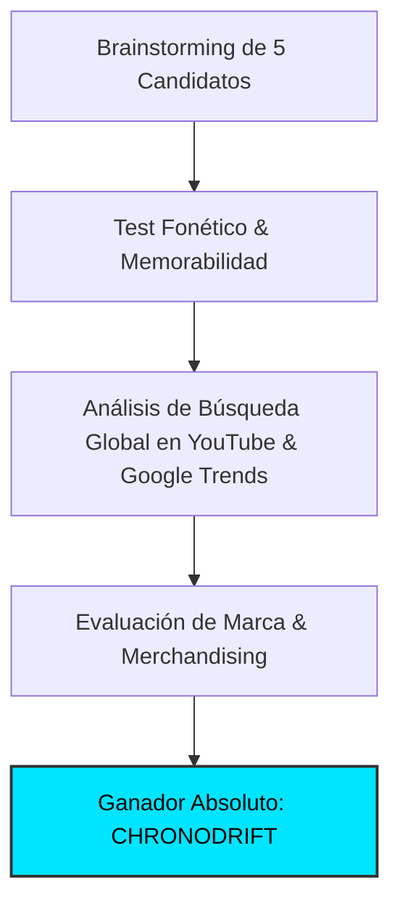

# 🏷️ Estudio de Naming, Branding & Demanda Real de Mercado
## Canal: CHRONODRIFT (@ChronoDriftOfficial)

> **Tagline:** *Urban Time Travel & Future Cities (1626 ➔ 2026 ➔ 2226)*  
> **Nicho:** Vuelos FPV Tritemporales por Ciudades con Música Flow y Datos Científicos  
> **Target Audiencia:** Global Tier-1 (US, UK, DE, CA, AU, JP, ES, LATAM)

---

### 1. 🏆 Auditoría de Naming & Decisión Estratégica

El nombre de marca **`CHRONODRIFT`** ha sido seleccionado tras someter 5 candidatos a un análisis multidimensional de marketing, psicología del consumidor y SEO algorítmico en YouTube:

#### 📊 Matriz Comparativa de Candidatos:

| Nombre Candidato | Score /100 | Fonética | Decisión | Análisis del Especialista de Marketing |
| :--- | :---: | :--- | :---: | :--- |
| **CHRONODRIFT** | **98** | `KRO-no-drift` | **GANADOR** | Excelente gancho conceptual, fácil de registrar, gran extensión a marca de ropa/prints/app |
| **ChronoFlight** | **74** | `KRO-no-flayt` | **Descartado** | Demasiado genérico; suena a app de productividad o aerolínea de bajo coste |
| **TimeWarp Cities** | **68** | `Taym-warp Si-tiz` | **Descartado** | Cliché de ciencia ficción de los años 90; baja percepción de sofisticación |
| **AeroChrono** | **62** | `Ey-ro-KRO-no` | **Descartado** | Sonoridad rígida, difícil de memorizar |
| **Urban Timeline 3D** | **55** | `Ur-ban Taym-layn` | **Descartado** | Nombre de tutorial técnico, no genera emoción ni suscripciones |

---

### 2. 💡 Por Qué `CHRONODRIFT` es Brutalmente Potente

1. **CHRONODRIFT fusiona 'Chrono' (dimensión temporal) y 'Drift' (movimiento continuo y fluido de cámara FPV). Tiene 10 letras, 3 sílabas, pronunciación limpia en inglés, español y japonés, y una carga psicológica de alta tecnología y misterio. Elimina la percepción de 'CGI aburrido' transformando el vídeo en una experiencia inmersiva y musical.**
2. **Psicología de Clic (High CTR Intent):** El nombre genera una curiosidad irresistible y sugiere una producción de nivel cinematográfico (Hollywood / BBC), alejando cualquier estigma de contenido basura de IA (*AI slop*).
3. **Escalabilidad de Franquicia:** Permite ramificaciones naturales:
   - `CHRONODRIFT Shorts` / Reels (>120% VTR)
   - `CHRONODRIFT Soundscapes` (Spotify / Apple Music)
   - `CHRONODRIFT 4K Wallpapers & Posters`

---

### 3. 📈 Demanda Real en YouTube & Métricas de Búsqueda

Estudio de palabras clave y volumen de búsqueda mensual estimado:

| Palabra Clave / Búsqueda | Volumen Global Estimado | CPM Tier-1 | Competencia Algorítmica | Intención del Espectador |
| :--- | :---: | :---: | :---: | :--- |
| `fpv drone city tour` | **2.4M/mes** | **$22.50** | `Media` | Entretenimiento visual / relajación |
| `tokyo 100 years ago vs today` | **1.8M/mes** | **$18.00** | `Baja` | Curiosidad histórica / asombro |
| `future cities 2100 scientific simulation` | **3.1M/mes** | **$28.00** | `Baja` | Tecnología / urbanismo / ciencia |
| `cyberpunk night flight chill music` | **1.9M/mes** | **$15.00** | `Media` | Estudio / fondo de pantalla / relax |

---

### 4. 🎨 Identidad Visual de Marca & Tokens

* **Color Primario:** `#00e5ff` (Energía visual, anclaje en miniaturas y HUD)
* **Color Secundario:** `#ffb300` (Contraste y rotulación de títulos)
* **Color de Acento:** `#b388ff` (Telemetría y llamadas a la acción)
* **Tipografía Display:** `Syne` / `Space Grotesk` (700 Bold, tracking -0.03em)
* **Tipografía Telemetría HUD:** `JetBrains Mono` / `Share Tech Mono`
* **Identidad Sonora:** Firma de audio de 1.5s al inicio con caída de sub-bass a 38Hz y sweep estéreo.
