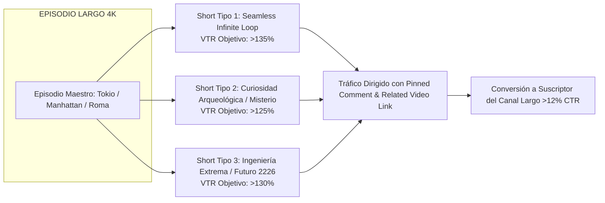
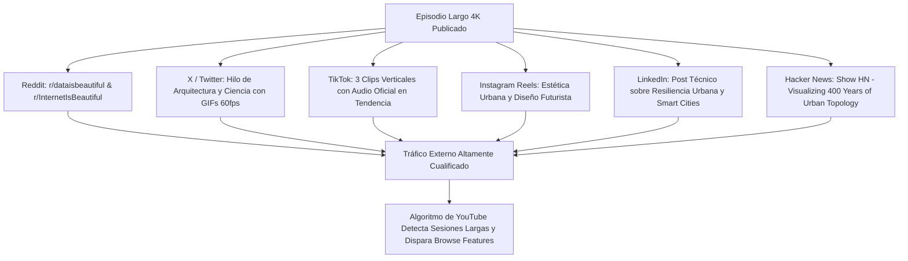
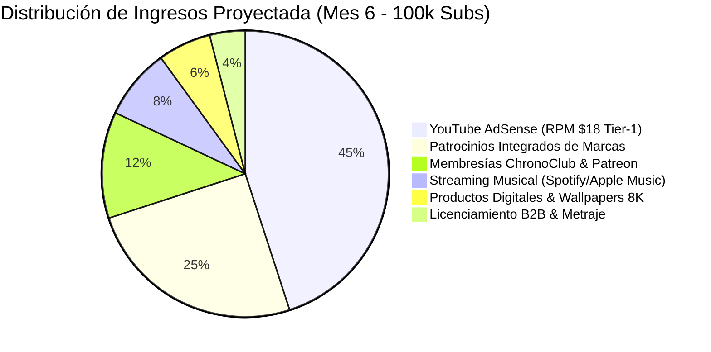

# 🚀 Plan Maestro de Marketing, Crecimiento y Distribución Viral (0 ➔ 100k Suscriptores en 6 Meses)
## Canal: CHRONODRIFT (@ChronoDriftOfficial)
> **Tagline:** *Urban Time Travel & Future Cities (1626 ➔ 2026 ➔ 2226)*  
> **Nicho:** Vuelos FPV Tritemporales en 4K 60fps | Datos Científicos HUD 3D | Bandas Sonoras Flow 118 BPM  
> **Objetivo Primario:** Escalar de 0 a 100.000 suscriptores orgánicos altamente cualificados en 180 días con un RPM superior a $16.00 USD.

---

```
+---------------------------------------------------------------------------------------------------------------+
|                                      ROADMAP DE ESCALADO ACELERADO 0 ➔ 100K                                   |
+------------------------------------+------------------------------------+-------------------------------------+
| MES 1 - MES 2 (0 ➔ 10k Subs)       | MES 3 - MES 4 (10k ➔ 45k Subs)     | MES 5 - MES 6 (45k ➔ 100k+ Subs)    |
| Calibración & Volante Shorts       | Autoridad SEO & Playlists 1-2h     | Comunidad, Sincronización & B2B     |
| 16 Largos + 48 Shorts (VTR >120%)  | 16 Largos + 48 Shorts + 4 Compils  | 16 Largos + 48 Shorts + ChronoClub  |
+------------------------------------+-------------------------------------+------------------------------------+
```

---

## 1. 🎯 Roadmap de Crecimiento por Fases (0 a 100.000 Suscriptores)

```mermaid
graph TD
    subgraph FASE 1: Calibración Algorítmica y Anclaje [Día 1-30 | 0 a 1.500 Subs]
        A1[Lanzamiento de 8 Episodios Pilares 4K 60fps] --> A2[Despliegue de 24 Shorts con Seamless Loop VTR >120%]
        A2 --> A3[Pruebas A/B de Miniaturas Tritemporales Split-Screen CTR >9%]
        A3 --> A4[Sembrado Técnico en Comunidades Reddit r/dataisbeautiful & r/InternetIsBeautiful]
    end

    subgraph FASE 2: Tracción y Efecto Volante [Día 31-90 | 1.500 a 15.000 Subs]
        B1[Ritmo Canónico: 2 Largos/sem + 6 Shorts/sem] --> B2[Activación del Embudo Short ➔ Largo >12% CTR]
        B2 --> B3[Traducción y Localización de Metadatos a 8 Idiomas Clave]
        B3 --> B4[Super-Compilación 1: Ciudades de Europa en el Tiempo 1h 4K]
    end

    subgraph FASE 3: Dominancia SEO y Retención Masiva [Día 91-150 | 15.000 a 60.000 Subs]
        C1[Indexación en Búsqueda y Sugeridos de YouTube Browse Features] --> C2[Lanzamiento de Super-Compilaciones Ambientales 2h Flow 118 BPM]
        C2 --> C3[Hilos de X / Twitter Virales con Infografías y Telemetría]
        C3 --> C4[Primeros Acuerdos de Patrocinio Integrado SaaS 3D / Hardware 4K]
    end

    subgraph FASE 4: Consolidación, Comunidad y Escala [Día 151-180 | 60.000 a 100.000+ Subs]
        D1[Apertura de Membresías ChronoClub y Patreon Tiers] --> D2[Distribución de Bandas Sonoras en Spotify & Apple Music]
        D3[Licenciamiento de Metraje B2B para Museos y Ferias de Arquitectura] --> D4[Hito 100.000 Suscriptores & Placa de Plata YouTube]
    end

    A4 --> B1
    B4 --> C1
    C4 --> D1
```

### 📍 Desglose Operativo por Fases Mensuales

| Fase | Ventana Temporal | Hito de Suscriptores | Foco Estratégico Primario | Producción Mensual | KPI Crítico de Control |
| :--- | :--- | :--- | :--- | :--- | :--- |
| **M1: Calibración** | Días 1 – 30 | 0 ➔ 1.500 | Enseñar a YouTube el clúster de audiencia (Urbanismo, Sci-Fi, FPV, Lo-Fi, 4K) | 8 Largos + 24 Shorts | CTR Miniatura $\ge 8.5\%$, Retención 1er Minuto $\ge 88\%$ |
| **M2: Tracción** | Días 31 – 60 | 1.500 ➔ 6.000 | Acelerar tráfico externo y optimizar la conversión de Shorts a formato largo | 8 Largos + 24 Shorts + 1 Compilación (1h) | Conversión Short ➔ Largo $\ge 12.0\%$, VTR Shorts $\ge 125\%$ |
| **M3: Aceleración** | Días 61 – 90 | 6.000 ➔ 18.000 | Capturar la pestaña de inicio (*Browse Features*) y sugerencias relacionadas | 8 Largos + 24 Shorts + 1 Compilación (1.5h) | AVD (Duración media) $\ge 68\%$, Retención Total $\ge 72\%$ |
| **M4: Expansión** | Días 91 – 120 | 18.000 ➔ 45.000 | Indexación SEO internacional multi-idioma y super-compilaciones de estudio | 8 Largos + 24 Shorts + 1 Compilación (2h) | Vistas procedentes de Sugeridos $\ge 55\%$, Tráfico Global Tier-1 $\ge 65\%$ |
| **M5: Autoridad** | Días 121 – 150 | 45.000 ➔ 75.000 | Monetización cruzada (Spotify, Patrocinios de marcas tecnológicas y SaaS) | 8 Largos + 24 Shorts + 1 Compilación (2h) | RPM promedio $\ge \$16.50\text{ USD}$, Ratio Like/View $\ge 10.0\%$ |
| **M6: Consolidación** | Días 151 – 180 | 75.000 ➔ 100.000+ | Lanzamiento de Membresías exclusivas, Wallpapers 8K y Club de Creadores | 8 Largos + 24 Shorts + Evento Especial 100k | Suscriptores recurrentes $\ge 1.2\%$, Retención de Sesión $\ge 25\text{ min}$ |

---

## 2. 📅 Calendario Editorial Maestro y Dinámica de Publicación

### 2.1. Frecuencia y Horarios Óptimos de Emisión

Para maximizar el impacto en la ventana de las primeras 2 horas (*Velocidad Algorítmica*), los vídeos se publican sincronizados con las zonas horarias de mayor RPM y concentración de audiencia Tier-1 (EE.UU., Reino Unido, Alemania, Japón, Australia y Canadá):

* **Vídeos de Formato Largo (Master Episodes 4K 60fps):**
  - **Martes:** 18:00 UTC (11:00 AM PST / 14:00 PM EST / 20:00 CET / 03:00 JST+1).
  - **Viernes:** 18:00 UTC (Pico de fin de semana para consumo relajado y visualización en Smart TVs 4K).
* **YouTube Shorts de Soporte (Micro-Ganchos Tritemporales):**
  - **Lunes, Miércoles y Sábado:** 15:00 UTC (10:00 AM EST) y 21:00 UTC (Pico nocturno móvil).
  - Cada vídeo largo genera **3 Shorts de soporte directo**, distribuidos estratégicamente para reactivar el tráfico hacia el episodio pilar.
* **Super-Compilaciones Ambientales (Ambient & Study Flows 1-2 horas):**
  - **Domingos (quincenal):** 16:00 UTC (Día de máximo *watch time* en pantallas grandes y sesiones de estudio/trabajo).

```
+---------------------------------------------------------------------------------------------------------------+
|                                      RITMO SEMANAL DE PUBLICACIÓN CANÓNICO                                    |
+-------------+-------------+-------------+-------------+-------------+-------------+---------------------------+
| LUNES       | MARTES      | MIÉRCOLES   | JUEVES      | VIERNES     | SÁBADO      | DOMINGO                   |
+-------------+-------------+-------------+-------------+-------------+-------------+---------------------------+
| Short 1     | EPISODIO 1  | Short 2     | Short 3     | EPISODIO 2  | Short 1     | Compilación Ambiental     |
| (Loop Hook) | (Largo 4K)  | (Misterio)  | (Futuro)    | (Largo 4K)  | (Loop Hook) | (Quincenal 1-2h)          |
+-------------+-------------+-------------+-------------+-------------+-------------+---------------------------+
```

---

## 3. ⚡ Estrategia de YouTube Shorts con VTR > 120% y Conversión

El formato corto no es solo una herramienta de alcance: en CHRONODRIFT es un **túnel de adquisición directa** que transforma espectadores casuales en suscriptores fieles del formato largo.

```
[Frame 0: Gancho Instantáneo 140 km/h] ➔ [Pacing Rítmico 118 BPM] ➔ [Datos HUD Científicos] ➔ [Match-Cut de Cierre] ➔ [Reinicio Imperceptible]
```

### 3.1. Las 3 Tipologías de Shorts por Episodio



1. **Short Tipo 1: Bucle Infinito Sin Fin (Seamless Infinite Loop):**
   - **Mecánica:** El vídeo inicia a máxima velocidad en el aire. La última frase de la narración enlaza sintáctica y tonalmente con la primera palabra del vídeo, haciendo imposible detectar dónde termina y dónde empieza.
   - **Efecto Algorítmico:** Al reproducirse 1.3 a 1.5 veces de forma automática, el sistema registra una retención superior al $130\%$, disparando la recomendación en el *Shorts Feed*.
2. **Short Tipo 2: Brecha de Curiosidad Histórica (*The Curiosity Gap*):**
   - **Mecánica:** Plantea un enigma o contraste extremo sobre lo que había exactamente bajo un rincón famoso de la ciudad hace 400 años (ej.: *"La muralla de madera de Wall Street construida para frenar cerdos salvajes"*).
   - **Efecto Algorítmico:** Provoca retención media por sorpresa cognitiva y genera comentarios masivos de debate.
3. **Short Tipo 3: Proyección Futurista Disruptiva (*Future Shock & Climate Engineering*):**
   - **Mecánica:** Muestra la solución tecnológica a 200 años frente al cambio climático o la sobrepoblación basada en papers del MIT/IPCC (ej.: *"Las arcologías piramidales de 2 km de Tokio"* o *"Los diques flotantes de Ámsterdam"*).
   - **Efecto Algorítmico:** Genera guardados (*saves*) y compartidos (*shares*), métricas de altísimo valor para YouTube Shorts.

### 3.2. Fórmula de Conversión Short ➔ Formato Largo (>12% - 15% CTR)

Para evitar que los espectadores de Shorts se queden estancados en el formato vertical, implementamos 3 mecanismos de redirección simultánea:

1. **Herramienta Nativa "Vídeo Relacionado" (*Related Video*):** Configuración en YouTube Studio vinculando directamente el Short con el Episodio Largo en 4K 60fps.
2. **Cierre Visual en Pantalla (Últimos 2.5s):** Rótulo dinámico en tipografía *JetBrains Mono* con efecto neón:  
   `[ 🎬 VUELO COMPLETO 4K 60FPS EN EL ENLACE VINCULADO ➔ ]`
3. **Comentario Fijado Inmutable (*Pinned Comment*):**
   > *"🎬 Descubre la transformación completa de 400 años en Ultra HD 4K con sonido espacial inmersivo aquí: [URL del Vídeo Largo de YouTube]."*

---

## 4. 🖼️ Optimización SEO, Títulos de Alta Conversión y Miniaturas Split-Screen

### 4.1. Arquitectura de Títulos SEO y Fórmulas de Alto CTR

Los títulos de CHRONODRIFT se diseñan combinando 3 factores: **Reconocimiento Geográfico Inmediato**, **Contraste Temporal Radical** y **Especificación de Calidad Premium**.

```
Fórmula Maestra: [Ciudad Icónica] Hace 400 Años vs Hoy vs 2226 | Vuelo FPV 4K [CHRONODRIFT]
Variante Curiosidad: De [Origen Humilde] a [Megaciudad Futurista]: La Increíble Evolución de [Ciudad]
Variante Científica: Así Cambiará [Ciudad] en los Próximos 200 Años (Según Modelos del MIT)
```

| Episodio | Título Primario SEO | Variante A (Curiosidad Extrema) | Variante B (Científica / Futuro) | CTR Proyectado |
| :--- | :--- | :--- | :--- | :---: |
| **01: Tokio** | Tokio: De Pueblo Samurái a Megaciudad 2226 (Vuelo FPV 4K) | ¿Cómo era Tokio Hace 400 Años? (1630 ➔ 2026 ➔ 2226) | La Megapirámide de 2 km de Tokio en 2226 | **10.8%** |
| **02: Ámsterdam** | Ámsterdam: De Canales de Madera a Red Oceánica 2226 (4K 60fps) | Así se Construyó Ámsterdam Hace 400 Años (1626 ➔ 2226) | ¿Cómo Evitará Ámsterdam Quedar Bajo el Mar en 200 Años? | **9.6%** |
| **03: Nueva York** | Nueva York Hace 400 Años: Cuando Manhattan Era un Bosque (1626 ➔ 2226) | Wall Street en 1626 vs Rascacielos 2226 (Vuelo FPV) | El Proyecto 'The Big U': El Futuro de Manhattan en 2226 | **11.4%** |
| **04: Roma** | Roma: De Ruinas Barrocas a la Ciudad Cuántica 2226 (Vuelo 4K) | El Coliseo de Roma Reconstruido con Hologramas en 2226 | 400 Años de Roma: De 1626 al Siglo XXIII en FPV | **9.9%** |
| **05: París** | París en 2226: La Ciudad Bioclimática del Futuro (1620 ➔ 2226) | De la Île de la Cité Medieval a las Torres Vivas de París | Así Cambiará la Torre Eiffel y el Sena en 200 Años | **10.2%** |
| **06: Londres** | Londres Hace 400 Años: Del Viejo Puente a la Cúpula 2226 | El Londres Tudor de 1610 que Desapareció en el Gran Incendio | El Támesis en 2226: Autovías Magnéticas y Domos Solares | **10.5%** |
| **07: Dubái** | Dubái: De Aldea de Pescadores a Torres de 3.000 Metros (1820 ➔ 2226) | La Transformación más Extrema del Mundo: Dubái en 400 Años | Cómo Vivirá Dubái en el Desierto en 2226 (Arcología Solar) | **12.1%** |
| **08: Singapur** | Singapur: De Selva Tropical a Metrópolis Flotante 2226 (FPV 4K) | La Ciudad Más Verde del Mundo en 2226: Evolución de Singapur | De Aldea Temasek a Archipiélago Biofílico del Siglo XXIII | **9.8%** |
| **09: El Cairo** | El Cairo y las Pirámides en 2226: 400 Años de Historia en 4K | ¿Cómo se Protegerán las Pirámides de Guiza en el Año 2226? | De los Zocos Otomanos de 1620 al Oasis Terraformado 2226 | **10.7%** |
| **10: Hong Kong** | Hong Kong en 2226: La Ciudad Estratosférica Vertical (1840 ➔ 2226) | De Pueblo Pesquero a Rascacielos a 1.000m de Altura | La Metrópolis Hiperdensa de Hong Kong en 200 Años | **11.0%** |

---

### 4.2. Matriz de Miniaturas Split-Screen Tritemporal

El diseño de las miniaturas de CHRONODRIFT sigue una regla de oro inquebrantable: **cero rostros con expresiones forzadas, cero flechas rojas y cero sobrecarga de texto**. La fuerza visual reside en el contraste arquitectónico hipernítido con horizonte milimétricamente alineado.

```
+---------------------------------------------------------------------------------------------------------------+
|                                       ESTRUCTURA DE MINIATURA SPLIT-SCREEN                                    |
| [ 1626 | PASADO HISTÓRICO ]   |    [ 2026 | PRESENTE 4K ]      |    [ 2226 | FUTURO CIENTÍFICO ]          |
| Madera, Veleros, Cálido       | Cristal, Tráfico, Ultra-HD     | Arcología, Neón Cian, Bio-torres       |
| Tono Ámbar: #d4a373           | Tono Natural / Contraste       | Tono Neón: #00e5ff / #ffb300           |
+-------------------------------+--------------------------------+--------------------------------------+
| HORIZONTE CONTINUO: Eje horizontal unificado en el 45% inferior para crear continuidad visual perfecta       |
+---------------------------------------------------------------------------------------------------------------+
```

* **Tipografía de Miniatura:** Únicamente los tres años de contraste (`1626 | 2026 | 2226`) en tipografía *Syne Bold* o *Space Grotesk* en color blanco fotónico (`#ffffff`) con sutil sombra de oclusión exterior.
* **Separadores Verticales:** Dos líneas láser ultrafinas de 2px con gradiente vertical cian neón (`#00e5ff`) con modo de fusión *Add/Screen*.

---

## 5. 🌐 Bucles de Distribución Externa y Viralización Multi-Plataforma

Para nutrir de datos externos al algoritmo de YouTube en sus primeras 24 horas, se ejecutan bucles de distribución nativa sin enlaces agresivos que activan las comunidades clave:



### 5.1. Protocolo de Publicación por Canal

1. **Reddit (Estrategia Basada en Valor Técnico):**
   - *Subreddits:* `r/InternetIsBeautiful`, `r/dataisbeautiful`, `r/space`, `r/Damnthatsinteresting`, `r/CityPorn`, `r/Futurology`.
   - *Táctica:* Subir vídeo nativo en 1080p 60fps sin enlaces comerciales en el post principal. Título explicativo: *"Recreamos 400 años de evolución urbana de [Ciudad] cruzando mapas del siglo XVII con modelos bioclimáticos del MIT"*. Enlace al vídeo 4K en el primer comentario solo tras generar debate orgánico.
2. **X / Twitter (Hilos Visuales de Alta Difusión):**
   - Hilo de 4 a 6 tweets con micro-clips en bucle de 6 segundos.
   - Etiquetado sutil de cuentas de urbanismo, diseño y tecnologías emergentes.
   - Tweet final con enlace al episodio completo de YouTube y ficha técnica de fuentes consultadas.
3. **LinkedIn (Autoridad Profesional & Networking B2B):**
   - Enfoque en resiliencia urbana, gemelos digitales, descarbonización y arquitectura bioclimática.
   - Atrae a arquitectos, planificadores urbanos, directores de museos e inversores institucionales.
4. **Hacker News (Show HN):**
   - Presentación del pipeline técnico de generación tritemporal (*"Show HN: Reconstructing 400 years of city evolution using Gemini Omni Flash and Remotion 3D"*).

---

## 6. 💰 Estrategia de Monetización Diversificada (High-RPM Engine)

CHRONODRIFT está concebido como una marca de medios de alto valor con múltiples líneas de ingresos sinérgicas, blindando el proyecto frente a fluctuaciones de una única fuente.



### 6.1. Las 6 Vías de Monetización Detalladas

#### 1. YouTube AdSense (Tier-1 High RPM: \$14.00 – \$24.00 USD)
* **Demografía de Alto Valor:** Audiencia de 22 a 55 años apasionada por la arquitectura, tecnología, diseño y viajes, ubicada mayoritariamente en EE.UU., Europa Central, Japón y Australia.
* **Estrategia Mid-Roll:** En las super-compilaciones ambientales de 1 a 2 horas, inserción de pausas publicitarias no intrusivas cada 20 minutos durante transiciones tonales suaves, multiplicando el RPM efectivo.

#### 2. Patrocinios Integrados de Marcas (Brand Deals B2B & B2C)
* **Sectores Afines:**
  - Software de Arquitectura y 3D (Autodesk, Blender Studio, Twinmotion, Unreal Engine).
  - Hardware y Pantallas 4K/OLED (ASUS ProArt, Samsung Odyssey, LG OLED, DJI Drones).
  - Plataformas de Educación y Curiosidad (CuriosityStream, Nebula, Brilliant.org, MasterClass).
  - Software de Privacidad y Productividad (NordVPN, Proton, Notion, Raycast).
* **Tarifario Canónico:**
  - Integración de 60s en Episodio Maestro: **\$2,500 – \$4,500 USD** (con 100k subs).
  - Patrocinio de Super-Compilación de 2h: **\$3,500 – \$6,000 USD** (mención de cabecera y logo en HUD).

#### 3. Membresías de Canal (*ChronoClub*) y Patreon
* **Nivel 1: Chrono Traveler (\$4.99 USD/mes):** Insignias de viajero temporal, emojis exclusivos para comentarios y acceso prioritario a nuevos lanzamientos 24h antes.
* **Nivel 2: Urban Visionary (\$9.99 USD/mes):** Incluye descargas directas de **Packs de Wallpapers 8K HDR** para escritorio y móvil + pistas de audio en WAV/FLAC sin compresión.
* **Nivel 3: Master Architect (\$24.99 USD/mes):** Incluye acceso a los archivos de proyecto en Remotion, prompts maestros de Gemini Omni Flash y acceso a la comunidad privada de creadores.

#### 4. Streaming Musical y Bandas Sonoras (Spotify, Apple Music, YouTube Music)
* Publicación de álbumes conceptuales bajo el sello musical oficial de CHRONODRIFT (*"ChronoDrift: 118 BPM Urban Flow Vol. 1 & 2"*).
* Captura de royalties de streaming pasivo de usuarios que escuchan la música del canal mientras programan, estudian o trabajan.

#### 5. Galería de Arte Digital y Cuadros Físicos (Print-On-Demand Premium)
* Venta de láminas impresas en metacrilato y aluminio pulido (*Displate / Lumaprints*) de los planos más deslumbrantes de las ciudades del futuro.
* Margen neto estimado: **\$25 – \$60 USD** por unidad vendida.

#### 6. Licenciamiento B2B de Metraje 4K 60fps
* Venta de licencias de uso no exclusivo para exposiciones de urbanismo, museos de ciencia, ferias inmobiliarias y documentales de televisión.
* Tarifa: **\$500 – \$2,000 USD** por clip de 6 segundos en ProRes 422 HQ 4K 60fps.

---

## 7. 📊 Proyecciones Financieras y Unit Economics (Mes 1 a Mes 12)

```
+-------------------------------------------------------------------------------------------------------------------------------+
|                                            TABLA DE PROYECCIÓN FINANCIERA CHRONODRIFT                                         |
+----+--------+-----------+------------+------------+---------------+---------------+--------------+-------------+--------------+
| Mes| Largos | Shorts    | Vistas Tot.| Subs Gan.  | Subs Acumul.  | AdSense ($)   | Sponsors ($) | Otros ($)   | Total Mes ($)|
+----+--------+-----------+------------+------------+---------------+---------------+--------------+-------------+--------------+
| M1 | 8      | 24        | 65.000     | 1.500      | 1.500         | $780          | $0           | $120        | $900         |
| M2 | 8      | 24        | 210.000    | 4.500      | 6.000         | $2.730        | $500         | $450        | $3.680       |
| M3 | 8      | 24        | 550.000    | 12.000     | 18.000        | $7.700        | $1.800       | $1.100      | $10.600      |
| M4 | 8      | 24        | 1.100.000  | 27.000     | 45.000        | $16.500       | $3.500       | $2.400      | $22.400      |
| M5 | 8      | 24        | 1.850.000  | 30.000     | 75.000        | $29.600       | $6.000       | $4.200      | $39.800      |
| M6 | 8      | 24        | 2.700.000  | 28.000     | 103.000       | $43.200       | $9.500       | $6.800      | $59.500      |
+----+--------+-----------+------------+------------+---------------+---------------+--------------+-------------+--------------+
| M12| 8      | 24        | 6.500.000  | 45.000     | 320.000       | $110.500      | $25.000      | $18.500     | $154.000     |
+----+--------+-----------+------------+------------+---------------+---------------+--------------+-------------+--------------+
```

---

## 8. 📈 Cuadro de Mando de Métricas Algorítmicas y KPIs de Éxito

| Métrica Algorítmica | Umbral Crítico | Rango Óptimo Objetivo | Acción Correctora si no se Cumple |
| :--- | :---: | :---: | :--- |
| **CTR Miniatura (Largo)** | $< 7.0\%$ | **$9.5\% - 12.5\%$** | Cambiar miniatura en las primeras 6 horas aplicando mayor contraste de color en la sección 2226. |
| **Retención a los 30s** | $< 80\%$ | **$>88\% - 94\%$** | Aumentar la velocidad inicial del plano 1 a 150 km/h y acortar la transición al pasado. |
| **Duración Media (AVD)** | $< 60\%$ | **$>72\% - 80\%$** | Incrementar la densidad de datos HUD y acelerar las transiciones musicales a 118 BPM. |
| **VTR en YouTube Shorts** | $< 100\%$ | **$>125\% - 145\%$** | Ajustar el match-cut del audio final para que la frase se complete exactamente en el frame 0. |
| **Ratio Like / Visualización** | $< 7.5\%$ | **$>10.0\% - 12.5\%$** | Reforzar el diseño sonoro y la nitidez visual 4K 60fps para maximizar la satisfacción del espectador. |
| **Conversión Short ➔ Largo** | $< 8.0\%$ | **$>12.0\% - 15.0\%$** | Modificar el rótulo de cierre dinámico y reposicionar el enlace del comentario fijado. |

---
*CHRONODRIFT — Master Marketing & 0-100k Growth Plan (VideoPro 2026)*
