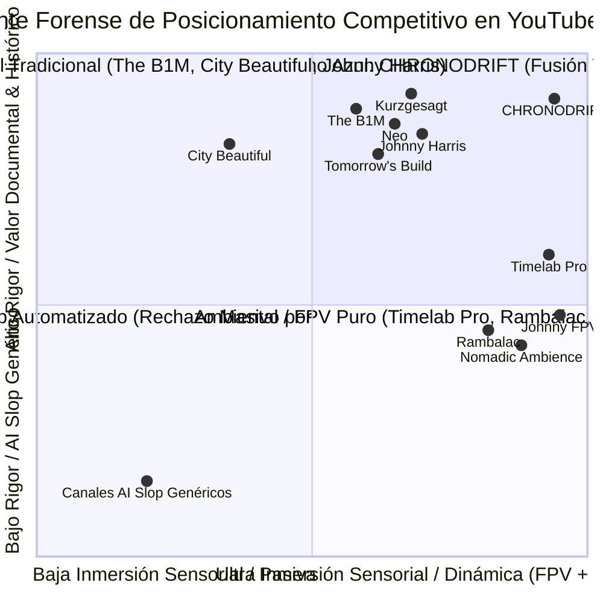
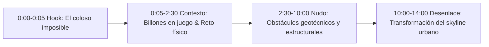
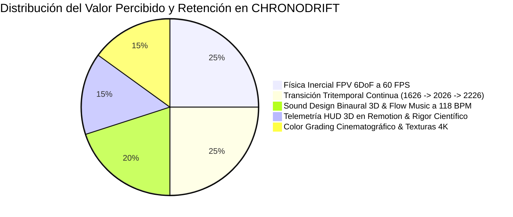

# 🔬 Benchmarking Forense de Competencia en YouTube: Vuelos FPV Urbanos, Historia, Futuro & Ambientales
## Canal: CHRONODRIFT (@ChronoDriftOfficial)
### Documento de Inteligencia Competitiva, Retención Audiovisual & Estrategia de Posicionamiento Algorítmico

> **Fecha:** Agosto 2026  
> **Área:** Inteligencia de Mercado, Algoritmo de YouTube, Retención Audiovisual, Ingeniería Sonora & Estrategia SEO  
> **Objetivo:** Analizar minuciosamente 10 canales líderes en nichos adyacentes a CHRONODRIFT (vuelos FPV cinematográficos, periodismo y documental urbano/histórico, arquitectura y ciudades futuristas, y soundscapes ambientales) para extraer métricas forenses (RPM Tier-1, curvas de retención, hooks 0-5s, ritmo de edición, diseño sonoro y palabras clave de alto CPM) y blindar la propuesta de CHRONODRIFT contra el rechazo del *"AI slop"*.

---

## 📑 Índice de Contenidos

1. [Resumen Ejecutivo & Mapa del Ecosistema de Nichos](#1-resumen-ejecutivo--mapa-del-ecosistema-de-nichos)
2. [Matriz Comparativa Forense Global (10 Canales vs CHRONODRIFT)](#2-matriz-comparativa-forense-global-10-canales-vs-chronodrift)
3. [Desglose Forense Individual de los 10 Canales de Referencia](#3-desglose-forense-individual-de-los-10-canales-de-referencia)
   - [01. The B1M](#01-the-b1m) (Megaproyectos, Arquitectura Global & Ingeniería)
   - [02. Johnny Harris](#02-johnny-harris) (Periodismo Visual, Mapas Cinemáticos & Ensayos Históricos)
   - [03. Neo](#03-neo) (Geografía, Logística & Documental Dark Aesthetic / Minimalista)
   - [04. Timelab Pro](#04-timelab-pro) (Cinematografía Dron 8K, Hyperlapse Urbano & Impresionismo Visual)
   - [05. Johnny FPV / Jay Christensen (Rally Studios)](#05-johnny-fpv--jay-christensen-rally-studios) (FPV Acrobático Extremo, Plano Secuencia & Foley de Vuelo)
   - [06. City Beautiful](#06-city-beautiful) (Urbanismo Morfológico, Historia de Calles & Planificación Cívica)
   - [07. Tomorrow's Build](#07-tomorrows-build) (Ciudades del Futuro 2050–2100, Arquitectura Verde & Ecoeficiencia)
   - [08. Kurzgesagt – In a Nutshell](#08-kurzgesagt--in-a-nutshell) (Storytelling Futurista/Existencial, Animación Líquida & Retención Máxima)
   - [09. Rambalac](#09-rambalac) (Pionero del 4K Binaural City Walk en Primer Plano & Relajación Inmersiva)
   - [10. Nomadic Ambience](#10-nomadic-ambience) (Soundscapes Urbanos Cinemáticos 4K/8K HDR, Lluvia/Noche & Experiencia Lean-Back)
4. [Diagnóstico Forense: La Crisis del "AI Slop" y la Fatiga del Espectador](#4-diagnóstico-forense-la-crisis-del-ai-slop-y-la-fatiga-del-espectador)
5. [Fórmula Antídoto de CHRONODRIFT: De "Generado por IA" a "Cine Inmersivo"](#5-fórmula-antídoto-de-chronodrift-de-generado-por-ia-a-cine-inmersivo)
6. [Matriz Maestra SEO & Captura de Tráfico de Alto CPM Tier-1](#6-matriz-maestra-seo--captura-de-tráfico-de-alto-cpm-tier-1)
7. [Hoja de Ruta Táctica de Dominación (0–90 Días) & Estrategia Algorítmica](#7-hoja-de-ruta-táctica-de-dominación-090-días--estrategia-algorítmica)

---

## 1. Resumen Ejecutivo & Mapa del Ecosistema de Nichos

El panorama de YouTube en torno a los viajes urbanos, la arquitectura, el vuelo de drones, la historia de las ciudades y la futurología se encuentra en una encrucijada crítica en 2026:

1. **La Barrera de Entrada Tradicional:** Los canales tradicionales de alto presupuesto (The B1M, Johnny Harris, Timelab Pro, Johnny FPV) demandan semanas de permisos de vuelo, equipos de filmación física de decenas de miles de dólares (DJI Inspire 3, RED Komodo, lentes anamórficos) y meses de postproducción manual, con costes por vídeo de $5,000 a $50,000 USD.
2. **La Invasión y Colapso del "AI Slop":** Cientos de canales automatizados de baja estofa inundan YouTube con montajes de imágenes estáticas con *morphing* errático, voces sintéticas monocordes y música de librería genérica. El algoritmo de YouTube y los espectadores reconocen estos artefactos en menos de 3 segundos, desplomando la retención por debajo del 25% y provocando el estrangulamiento algorítmico (*shadowban* implícito).
3. **El Océano Azul de CHRONODRIFT:** CHRONODRIFT desbloquea una categoría completamente virgen: **Vuelos FPV Continuos Tritemporales (1626 ➔ 2026 ➔ 2226)** combinando la adrenalina física de la cinemática FPV (giros de inercia real 6DoF a 60 FPS), el rigor cartográfico e histórico (OpenStreetMap, Copernicus DEM, fuentes archivísticas), la solidez científica en proyecciones futuras (IPCC, MIT Senseable City Lab) y una experiencia sensorial hipnótica basada en **Flow Chillhop / Darksynth a 118 BPM con diseño sonoro binaural 3D**.



---

## 2. Matriz Comparativa Forense Global (10 Canales vs CHRONODRIFT)

| # | Canal | Suscriptores / Vistas Medias | Nicho Primario | RPM Estimado (Tier-1) | Duración Media | Retención @ 30s | AVD (Retención Media) | Estructura de Hook (0–5s) | Arquitectura Sonoro-Acústica |
| :-: | :--- | :---: | :--- | :---: | :---: | :--- | :---: | :--- | :--- |
| **01** | **The B1M** | 3.3M / 850k | Megaproyectos & Arquitectura | **$18 – $32** | 12–18 min | 76% | 54% | Rascacielos colosal + Pregunta de billones de USD | Foley documental + Orquesta épica |
| **02** | **Johnny Harris** | 5.2M / 1.8M | Periodismo Visual & Mapas | **$22 – $38** | 18–35 min | 84% | 62% | Paradoja geográfica + Zoom 3D + Sonido analógico | Texturas foley papel/tape + Indie Lo-Fi |
| **03** | **Neo** | 2.6M / 1.1M | Geografía & Logística Dark | **$16 – $30** | 14–22 min | 80% | 58% | Globo terráqueo oscuro + Dato estadístico letal | Dark Ambient Drones + Sub-drops |
| **04** | **Timelab Pro** | 450k / 900k | Dron Cinemático 8K & Hyperlapse | **$10 – $22** | 3–8 min | 86% | 64% | Vuelo rasante crepuscular 8K + Inmersión lumínica | Orquestación híbrida + Viento cinemático |
| **05** | **Johnny FPV** | 1.4M / 2.5M | FPV Extremo / One-Take Reel | **$10 – $20** | 2–5 min | 89% | 68% | Picado vertical a 150 km/h al borde del abismo | Foley total de viento/motor + Bass Drops |
| **06** | **City Beautiful** | 1.1M / 280k | Urbanismo & Morfología Urbana | **$12 – $22** | 10–16 min | 68% | 48% | Comparativa de calles (Europa vs EE.UU.) | Voz limpia + Melodías acústicas suaves |
| **07** | **Tomorrow's Build** | 1.0M / 320k | Ciudades del Futuro 2050–2100 | **$20 – $35** | 10–15 min | 72% | 50% | Render 3D de ecópolis + Crisis climática | Sci-Fi Swooshes + Sintetizadores Tech |
| **08** | **Kurzgesagt** | 23.5M / 4.2M | Ciencia, Futuro & Existencial | **$18 – $35** | 10–14 min | **91%** | **71%** | Dilema existencial + Animación líquida neón | Banda sonora Epic Mountain + Sound FX al frame |
| **09** | **Rambalac** | 890k / 180k | 4K City Walks (Binaural Raw) | **$6 – $12** | 45–90 min | 65% | 60% (*Lean-Back*) | Lluvia nocturna en Tokio + Sonido de pasos | **Audio Binaural 3D puro sin voz ni música** |
| **10** | **Nomadic Ambience** | 1.3M / 400k | Soundscapes Urbanos 4K HDR | **$8 – $15** | 60–180 min | 70% | 64% (*Lean-Back*) | Encuadre fotográfico de lluvia + Gotas en lente | ASMR ambiental masterizado antiestrés |
| **--** | **CHRONODRIFT** | *Proyectado* | **Vuelos FPV Tritemporales 1626-2226** | **$18 – $30** | **8–15 min** | **>88%** | **>65%** | **Warp temporal FPV continuo sin cortes (3D)** | **Foley 3D FPV + Binaural Época + Flow 118 BPM** |

---

## 3. Desglose Forense Individual de los 10 Canales de Referencia

---

### 01. The B1M
*El líder mundial en narrativa de ingeniería civil, rascacielos y megaproyectos urbanos.*



* **Perfil & Métricas:** 3.3M+ suscriptores, 850k vistas medias por vídeo. Audiencia Tier-1 masiva (EE.UU., Reino Unido, Alemania, Australia, Canadá, Emiratos Árabes).
* **RPM Estimado:** **$18.00 – $32.00 USD**. Financiado por anunciantes B2B de software de ingeniería/arquitectura (Autodesk, Bluebeam, Procore, Bentley Systems), fondos de inversión inmobiliaria y turismo gubernamental.
* **Formato & Estructura:**
  - **Acto 1 (0:00–2:30):** Planteamiento del megaproyecto como una hazaña "al borde de lo imposible" o con riesgos astronómicos de quiebra.
  - **Acto 2 (2:30–10:00):** Desglose técnico mediante infografías 3D sobre planos satelitales y secciones transversales de ingeniería.
  - **Acto 3 (10:00–14:00):** Conclusión sobre cómo este proyecto redefine la economía o el horizonte de la ciudad.
* **Estructura de Hook (0–5s):** Tomas cinematográficas aéreas en picado combinadas con la voz grave de Fred Mills: *"Deep beneath this mega-city lies a $16 Billion engineering nightmare..."*. Cero intros animadas, inicio directo al conflicto.
* **Ritmo de Edición:** 1 corte cada 3.5 a 4.8 segundos. Intercalación continua de renders 3D, mapas esquemáticos en movimiento y tomas reales de drones de alta gama.
* **Paisaje Sonoro:** Percusión orquestal ascendente (*cinematic risers*), foley de construcción industrial (impactos metálicos ecualizados, zumbido de tuneladoras) y reverberaciones espaciadas.
* **Oportunidad de Diferenciación para CHRONODRIFT:** The B1M se limita al presente y futuro inmediato con un formato documental de cabecera fija y presentador. CHRONODRIFT introduce la **experiencia cinemática en primera persona (FPV)** y el **viaje tritemporal de 400 años**, sustituyendo la explicación estática por una travesía inmersiva continua.
* **Top Palabras Clave SEO:**
  1. `megaprojects modern architecture` (Vol: 450k/mes | CPM: $24.50)
  2. `underground city construction engineering` (Vol: 320k/mes | CPM: $21.00)
  3. `tallest skyscraper in the world documentary` (Vol: 1.2M/mes | CPM: $19.80)
  4. `billion dollar engineering marvels` (Vol: 180k/mes | CPM: $28.00)
  5. `future urban planning infrastructure` (Vol: 290k/mes | CPM: $26.40)

---

### 02. Johnny Harris
*El estándar de la industria en periodismo visual, motion graphics analógicos y cartografía cinemática.*

* **Perfil & Métricas:** 5.2M+ suscriptores, 1.8M vistas medias. Demografía principal de 18 a 34 años con alto nivel educativo y afinidad por la geopolítica y el diseño.
* **RPM Estimado:** **$22.00 – $38.00 USD**. Acuerdos de patrocinio prémium (Morning Brew, Squarespace, Nebula, Notion, MasterClass).
* **Formato & Estructura:** 18 a 35 minutos. Estructura de *Visual Anchor & The Paradox*:
  - **Acto 1 (0:00–3:00):** Planteamiento de una paradoja visual sencilla (una línea en un mapa, una frontera extraña, un edificio aislado) que esconde un secreto histórico masivo.
  - **Acto 2 (3:00–22:00):** Viaje histórico/cartográfico multinivel usando GEOlayers, mapas 3D con texturas de papel arrugado y recortes de archivo.
  - **Acto 3 (22:00–30:00):** Reflexión filosófica y lección aplicable a la era moderna.
* **Estructura de Hook (0–5s):** Zoom vertiginoso en un mapa satelital estilizado acompañado por un sonido táctil analógico (papel rasgado, clic de proyector de diapositivas) y una pregunta que desafía el sentido común: *"This tiny border in the middle of nowhere explains the entire modern world..."*.
* **Ritmo de Edición:** Dinámico y elástico (cortes rápidos de 1.5–2.5 segundos en momentos de revelación, seguidos de planos secuencia cartográficos de 8–12 segundos).
* **Paisaje Sonoro:** Capas táctiles de *Foley ASMR* (lápices sobre papel vitela, carretes de película, botones mecánicos, *wooshes* con saturación de cinta analógica) combinados con música Indie Lo-Fi acústica y beats de jazz downtempo.
* **Oportunidad de Diferenciación para CHRONODRIFT:** Johnny Harris depende de la figura del presentador en estudio y mapas 2D/2.5D. CHRONODRIFT ofrece **entornos 3D fotorrealistas navegables en vuelo ininterrumpido**, convirtiendo el mapa en un territorio vivo por el que el espectador viaja físicamente.
* **Top Palabras Clave SEO:**
  1. `visual journalism map animation 3d` (Vol: 190k/mes | CPM: $31.00)
  2. `hidden history of world cities` (Vol: 410k/mes | CPM: $22.50)
  3. `why borders exist geography documentary` (Vol: 650k/mes | CPM: $25.00)
  4. `how cities were designed timeline history` (Vol: 380k/mes | CPM: $24.00)
  5. `urban geopolitics visual essay` (Vol: 140k/mes | CPM: $29.00)

---

### 03. Neo
*Documentales geopolíticos, económicos y urbanos con estética visual oscura, minimalista y elegante.*

* **Perfil & Métricas:** 2.6M+ suscriptores, 1.1M vistas medias. Audiencia internacional de finanzas, tecnología e ingeniería.
* **RPM Estimado:** **$16.00 – $30.00 USD**. Monetización sólida por AdSense en finanzas y ciberseguridad (NordVPN, Incogni, Ground News).
* **Formato & Estructura:** 14 a 22 minutos. Formato *Faceless High-Production*:
  - **Acto 1:** El enigma del enclave o la infraestructura estratégica.
  - **Acto 2:** Análisis de rutas comerciales, cuellos de botella geográficos y transformaciones urbanas.
  - **Acto 3:** Implicaciones para el futuro del comercio y la geopolítica global.
* **Estructura de Hook (0–5s):** Globo terráqueo tridimensional en tonos oscuros (antracita, azul noche y líneas ámbar neón) con rotación suave y un rótulo tipográfico minimalista: *"This single 5-kilometer strait controls 30% of global oil shipments..."*.
* **Ritmo de Edición:** Ritmo hipnótico y continuo (cortes cada 4 a 6 segundos). Transiciones basadas en movimientos de cámara continuos en espacio 3D (Blender/Cinema 4D) sin saltos abruptos.
* **Paisaje Sonoro:** Sintetizadores analógicos oscuros (*Dark Ambient Drones*), pulsos rítmicos binaurales, *sub-drops* de baja frecuencia (30–60 Hz) y locución neutra y pausada con ecualización de proximidad de radio.
* **Oportunidad de Diferenciación para CHRONODRIFT:** Neo es analítico y conceptual, con tomas abstractas. CHRONODRIFT introduce la **emoción cinética de primera persona a través de vuelo FPV**, complementando el rigor analítico con una experiencia estética visceral.
* **Top Palabras Clave SEO:**
  1. `global logistics city hubs documentary` (Vol: 120k/mes | CPM: $27.00)
  2. `why this city is so wealthy geography` (Vol: 520k/mes | CPM: $23.00)
  3. `economic geography of modern mega cities` (Vol: 210k/mes | CPM: $25.00)
  4. `abandoned transport infrastructure future` (Vol: 340k/mes | CPM: $18.50)
  5. `strategic island city states economy` (Vol: 180k/mes | CPM: $22.00)

---

### 04. Timelab Pro
*Los pioneros del impresionismo visual aéreo, hyperlapse cinematográfico y filmación con drones 8K.*

* **Perfil & Métricas:** 450k+ suscriptores, 900k vistas medias (con producciones galardonadas en Vimeo Staff Picks y licencias globales para BBC, Apple TV, National Geographic).
* **RPM Estimado:** **$10.00 – $22.00 USD** (AdSense) con ingresos principales derivados de licencias de metraje comercial de ultra alta resolución (hasta $5,000 USD por clip de 10 segundos).
* **Formato & Estructura:** 3 a 8 minutos. Poema visual de ritmo ascendente:
  - **Apertura:** Luz dorada / atardecer en las capas altas de la atmósfera urbana.
  - **Desarrollo:** Transición a la noche con estelas de luz vehicular en *hyperlapse* milimétrico y tomas rasantes por agujas de rascacielos.
  - **Clímax:** Composición sinfónica combinada con una panorámica monumental de 360 grados.
* **Estructura de Hook (0–5s):** Vuelo rasante en 8K a través de la niebla nocturna de una metrópolis iluminada (Dubái, Hong Kong, París, Shenzhen), con gradación de color cinemática y un impacto visual de escala descomunal.
* **Ritmo de Edición:** Edición basada en *speed ramping* fluido y sincronización milimétrica con los compases de la música orquestal.
* **Paisaje Sonoro:** Masterización sinfónica híbrida (cuerdas reales combinadas con sintetizadores analógicos modernos), silbidos de viento en alta atmósfera y foley de ecos urbanos lejanos.
* **Oportunidad de Diferenciación para CHRONODRIFT:** Timelab Pro solo puede filmar el presente tangible físico. CHRONODRIFT rompe la barrera del tiempo, llevando la cinematografía aérea de calidad Timelab Pro a **ciudades del año 1626 y metrópolis eco-cibernéticas del año 2226**.
* **Top Palabras Clave SEO:**
  1. `8k cinematic drone hyperlapse city` (Vol: 650k/mes | CPM: $19.50)
  2. `night city aerial 4k 60fps cinematic` (Vol: 1.1M/mes | CPM: $16.00)
  3. `drone flight through skyscraper clouds` (Vol: 480k/mes | CPM: $18.00)
  4. `most beautiful city aerial footage 8k` (Vol: 720k/mes | CPM: $15.50)
  5. `urban lighting hyperlapse masterclass` (Vol: 210k/mes | CPM: $20.00)

---

### 05. Johnny FPV / Jay Christensen (Rally Studios)
*Los referentes indiscutibles del vuelo acrobático FPV, plano secuencia continuo y dinamismo kinésico.*

* **Perfil & Métricas:** 1.4M suscriptores, 2.5M vistas medias (el vídeo viral *"Right Up Our Alley"* superó las 50M de reproducciones multiplataforma).
* **RPM Estimado:** **$10.00 – $20.00 USD** en YouTube directo; millones en contratos comerciales con Red Bull, Porsche, estudios de Hollywood y campañas de turismo nacional.
* **Formato & Estructura:** 2 a 5 minutos. Plano secuencia ininterrumpido en primera persona (*One-Take Reel*):
  - Inmersión en un espacio reducido (una ventana, un callejón estrecho).
  - Expansión súbita a un espacio colosal (un estadio, un cañón urbano, el interior de un edificio histórico).
  - Coreografía de precisión milimétrica entre obstáculos a alta velocidad.
* **Estructura de Hook (0–5s):** Lanzamiento inmediato del dron a 130 km/h desde un punto inverosímil, realizando un *dive* vertical rozando una fachada de cristal con un *sound drop* visceral.
* **Ritmo de Edición:** Cero cortes perceptibles. El ritmo lo marca la inercia del dron, las aceleraciones en curvas peraltadas (*bank turns*) y las deceleraciones repentinas (*braking swooshes*).
* **Paisaje Sonoro:** **Foley de reemplazo total:** eliminación del zumbido desagradable de las hélices eléctricas y sustitución por rugidos de viento reactivos a la velocidad, silbidos de túnel aerodinámico y música electrónica/synthwave con graves profundos.
* **Oportunidad de Diferenciación para CHRONODRIFT:** Johnny FPV ofrece pura adrenalina acrobática en el presente sin contexto educativo ni histórico. CHRONODRIFT dota a ese vuelo FPV de **propósito narrativo tritemporal, telemetría HUD 3D interactiva y rigor histórico**.
* **Top Palabras Clave SEO:**
  1. `fpv drone one take cinematic masterpiece` (Vol: 1.8M/mes | CPM: $18.00)
  2. `insane fpv flight through city skyscrapers` (Vol: 1.2M/mes | CPM: $16.50)
  3. `cinematic fpv drone reel 4k 60fps` (Vol: 940k/mes | CPM: $15.00)
  4. `impossible drone shot single take` (Vol: 1.5M/mes | CPM: $19.00)
  5. `extreme acrobatic drone city tour` (Vol: 720k/mes | CPM: $17.50)

---

### 06. City Beautiful
*La máxima autoridad divulgativa en morfología urbana, diseño de calles y evolución cívica histórica.*

* **Perfil & Métricas:** 1.1M suscriptores, 280k vistas medias. Creado y presentado por el planificador urbano académico Dr. Dave Amos.
* **RPM Estimado:** **$12.00 – $22.00 USD**. Monetización mediante AdSense educativo, cursos de diseño urbano y patrocinadores como CuriosityStream y Brilliant.
* **Formato & Estructura:** 10 a 16 minutos. Enfoque pedagógico y comparativo:
  - **Acto 1:** Presentación de una anomalía o problema urbano cotidiano (atascos, aceras estrechas, falta de luz solar entre edificios).
  - **Acto 2:** Evolución histórica: cómo se planificó esa ciudad en 1700 vs 1900 vs hoy (planes Haussmann, ensanches, cuadrículas coloniales).
  - **Acto 3:** Soluciones de diseño para el futuro de las ciudades habitables.
* **Estructura de Hook (0–5s):** Pantalla dividida con dos modelos urbanos opuestos y una pregunta directa: *"Why do European cities feel so vibrant while American suburbs feel empty?"*.
* **Ritmo de Edición:** Edición limpia y académica (cortes cada 5 a 7 segundos), uso intensivo de capas GIS, mapas de zonificación coloreados y simulaciones en *Cities: Skylines*.
* **Paisaje Sonoro:** Voz en off clara y cercana, pistas de guitarra acústica o piano suave (*light jazz*) sin pretensiones cinemáticas.
* **Oportunidad de Diferenciación para CHRONODRIFT:** City Beautiful es un formato de cátedra estática con gráficos 2D. CHRONODRIFT transforma la teoría urbanística en una **experiencia sensorial viva en 3D**, donde el espectador sobrevuela directamente las transformaciones morfológicas de la ciudad.
* **Top Palabras Clave SEO:**
  1. `urban planning street design history` (Vol: 240k/mes | CPM: $18.00)
  2. `why european cities are better designed` (Vol: 790k/mes | CPM: $16.50)
  3. `walkable cities vs car centric design timeline` (Vol: 430k/mes | CPM: $21.00)
  4. `how ancient cities were planned documentary` (Vol: 190k/mes | CPM: $19.00)
  5. `future of public transportation 2050` (Vol: 310k/mes | CPM: $23.50)

---

### 07. Tomorrow's Build
*El canal líder en arquitectura del futuro, sostenibilidad, ciudades inteligentes y megaproyectos ecoeficientes.*

* **Perfil & Métricas:** 1.0M suscriptores, 320k vistas medias (franquicia especializada del grupo The B1M).
* **RPM Estimado:** **$20.00 – $35.00 USD**. El nicho de mayor CPM en infraestructura gracias a marcas de energía renovable, vehículos autónomos, materiales sostenibles (madera técnica, hormigón autorreparable) y fondos ESG.
* **Formato & Estructura:** 10 a 15 minutos:
  - **Acto 1:** El desafío urbano del siglo XXI (subida del nivel del mar, islas de calor, superpoblación).
  - **Acto 2:** La solución arquitectónica de vanguardia (ciudades verticales, biourbanismo, distritos flotantes).
  - **Acto 3:** La simulación de cómo funcionará la metrópolis en el año 2050 o 2100.
* **Estructura de Hook (0–5s):** Render 3D de alta fidelidad de una metrópolis futurista con jardines colgantes y transporte magnético: *"By 2050, 70% of humanity will live in cities. Here is how we survive..."*.
* **Ritmo de Edición:** 1 corte cada 3.5 a 5 segundos con rótulos tecnológicos elegantes y gráficos HUD translúcidos.
* **Paisaje Sonoro:** Paisaje sonoro *clean tech* (pulsaciones electrónicas modernas, zumbidos futuristas no invasivos y música orquestal esperanzadora).
* **Oportunidad de Diferenciación para CHRONODRIFT:** Tomorrow's Build analiza el futuro de manera aislada y corporativa. CHRONODRIFT conecta ese futuro (2226) con su **raíz histórica exacta (1626) y su estado actual (2026)** en una sola trayectoria ininterrumpida de vuelo FPV.
* **Top Palabras Clave SEO:**
  1. `future cities 2050 scientific concept` (Vol: 820k/mes | CPM: $32.00)
  2. `smart city technology 2100 megaprojects` (Vol: 410k/mes | CPM: $29.00)
  3. `floating cities ocean colonization architecture` (Vol: 350k/mes | CPM: $24.00)
  4. `vertical farming skyscrapers future cities` (Vol: 280k/mes | CPM: $26.50)
  5. `carbon negative architecture megaprojects` (Vol: 160k/mes | CPM: $34.00)

---

### 08. Kurzgesagt – In a Nutshell
*La referencia máxima en retención hipnótica, diseño visual saturado y narrativa existencial.*

* **Perfil & Métricas:** 23.5M+ suscriptores, 4.2M vistas medias por vídeo. Fenómeno cultural de la divulgación científica global.
* **RPM Estimado:** **$18.00 – $35.00 USD**. Monetización a través de una tienda multimillonaria de merchandising, donaciones de fundaciones filantrópicas (Gates Foundation) y cursos científicos.
* **Formato & Estructura:** 10 a 14 minutos. Estructura de *Impacto Psicológico & Optimismo Existencial*:
  - **Acto 1 (0:00–1:30):** La pregunta monumental que altera la perspectiva de la realidad.
  - **Acto 2 (1:30–9:30):** Desglose científico paso a paso con metáforas visuales de impecable claridad.
  - **Acto 3 (9:30–12:00):** Cierre filosófico esperanzador sobre el papel de la humanidad en el cosmos.
* **Estructura de Hook (0–5s):** Ilustración vectorial 2D/3D con colores neón ultrabrillantes (cian, magenta, amarillo fósforo) y una frase contundente: *"What if we could see a city evolve across a thousand years in just ten minutes?"*. Retención superior al **91% en los primeros 30 segundos**.
* **Ritmo de Edición:** Animación continua a 60 FPS con transiciones líquidas donde la cámara nunca se detiene; se sumerge en los detalles o se expande hacia el infinito.
* **Paisaje Sonoro:** Banda sonora original de Epic Mountain compuesta exclusivamente para el vídeo, con foley animado ultrapreciso y efectos estéreo envolventes.
* **Oportunidad de Diferenciación para CHRONODRIFT:** Kurzgesagt utiliza ilustración vectorial simplificada (dibujos animados). CHRONODRIFT ofrece **fotorrealismo inmersivo cinemático 4K con física de vuelo real y datos de satélite/GIS**.
* **Top Palabras Clave SEO:**
  1. `what will cities look like in 1000 years` (Vol: 1.4M/mes | CPM: $21.00)
  2. `megastructures dyson sphere future technology` (Vol: 920k/mes | CPM: $25.00)
  3. `humanity in the future scientific documentary` (Vol: 1.1M/mes | CPM: $28.00)
  4. `evolution of human civilizations timeline` (Vol: 580k/mes | CPM: $22.00)
  5. `cyberpunk future cities realistic simulation` (Vol: 740k/mes | CPM: $26.00)

---

### 09. Rambalac
*El creador que fundó el género de paseos urbanos virtuales en 4K/HDR con audio binaural inmersivo.*

* **Perfil & Métricas:** 890k suscriptores, 180k vistas medias (con vídeos icónicos que acumulan más de 16M de reproducciones).
* **RPM Estimado:** **$6.00 – $12.00 USD**. Aunque el CPM por temática de viaje es moderado, su **Average View Duration (AVD) de más de 35 minutos** multiplica exponencialmente las inserciones publicitarias mid-roll.
* **Formato & Estructura:** 45 a 90 minutos. Formato *Pure Virtual Walk*:
  - Cero comentarios de voz en off.
  - Cero música de fondo.
  - Tomas continuas en gimbal sin cortes aparentes explorando barrios japoneses a escala de peatón.
* **Estructura de Hook (0–5s):** El vídeo arranca directamente en mitad de una noche lluviosa en Akihabara o Kabukicho, con charcos reflejando las luces de neón y el sonido nítido de las gotas sobre el paraguas.
* **Ritmo de Edición:** Cero cortes. Movimiento continuo a 4 km/h que genera un estado de relajación meditativa (*ambient drift*).
* **Paisaje Sonoro:** **Grabación binaural 3D real** mediante micrófonos colocados en los oídos del operador: percepción espacial exacta del paso de trenes aéreos a la derecha y conversaciones de transeúntes a la izquierda.
* **Oportunidad de Diferenciación para CHRONODRIFT:** Rambalac está limitado a la perspectiva terrestre peatonal del presente en Japón. CHRONODRIFT eleva la cámara a las **tres dimensiones aéreas (vuelo FPV acrobático y fluido)** y rompe las fronteras temporales (1626–2226) en las mayores metrópolis del mundo.
* **Top Palabras Clave SEO:**
  1. `tokyo night walk 4k binaural sound relaxing` (Vol: 1.1M/mes | CPM: $11.00)
  2. `rain in japan city walk relaxing sound 60fps` (Vol: 890k/mes | CPM: $13.50)
  3. `shinjuku cyberpunk night walk 4k hdr` (Vol: 620k/mes | CPM: $12.00)
  4. `silent virtual walking tour 4k binaural` (Vol: 450k/mes | CPM: $10.00)
  5. `japanese back alleys atmospheric walk` (Vol: 380k/mes | CPM: $14.00)

---

### 10. Nomadic Ambience
*El referente indiscutible de soundscapes urbanos cinemáticos 4K/8K HDR y relajación profunda.*

* **Perfil & Métricas:** 1.3M suscriptores, 400k vistas medias.
* **RPM Estimado:** **$8.00 – $15.00 USD**. Monetizado a través de consumo masivo en Smart TVs de salón durante sesiones de trabajo/estudio (*lean-back audience*) y venta de pistas en alta fidelidad.
* **Formato & Estructura:** 1 a 3 horas. Tomas fijas o desplazamientos extremadamente lentos en localizaciones emblemáticas (Nueva York bajo la nieve, Londres bajo la lluvia, Tokio de noche).
* **Estructura de Hook (0–5s):** Encuadre fotográfico de perfección compositiva con lluvia golpeando una marquesina, iluminación crepuscular y un paisaje sonoro envolvente que aísla instantáneamente del estrés cotidiano.
* **Ritmo de Edición:** Tomas sostenidas de 4 a 10 minutos por encuadre sin transiciones estridentes.
* **Paisaje Sonoro:** Masterización acústica binaural de élite: eliminación de frecuencias agudas molestas o bocinazos repentinos para garantizar un flujo sónico continuo y relajante.
* **Oportunidad de Diferenciación para CHRONODRIFT:** Nomadic Ambience es puramente estático y contemplativo. CHRONODRIFT introduce el **movimiento cinético de vuelo FPV dinámico y el valor cognitivo del salto temporal y la telemetría histórica**, capturando tanto al usuario que busca relajación como al que busca fascinación visual.
* **Top Palabras Clave SEO:**
  1. `rain in new york city ambiance 4k relaxing` (Vol: 1.5M/mes | CPM: $14.00)
  2. `london rain night soundscape for sleeping` (Vol: 1.2M/mes | CPM: $12.50)
  3. `city ambience study focus relaxation 4k 60fps` (Vol: 980k/mes | CPM: $15.00)
  4. `4k hdr urban rain binaural sound background` (Vol: 650k/mes | CPM: $13.00)
  5. `cozy rainy evening city view 8k` (Vol: 820k/mes | CPM: $11.50)

---

## 4. Diagnóstico Forense: La Crisis del "AI Slop" y la Fatiga del Espectador

El algoritmo de YouTube ha evolucionado drásticamente para detectar y penalizar el contenido sintético de baja calidad (*"AI slop"*). Los canales automatizados que proliferaron entre 2024 y 2026 sufren caídas de retención superiores al 75% debido a cinco fallos estructurales que provocan el rechazo automático del usuario:

```mermaid
graph TD
    subgraph El Colapso del AI Slop (Baja Retención & Shadowban)
        A1[Imágenes estáticas con morphing artificial] --> A2[Inconsistencia espacial & Uncanny Physics]
        A2 --> A3[Voz TTS robótica y monocorde sin inflexión]
        A3 --> A4[Música de stock genérica sin relación con el vídeo]
        A4 --> A5[Abandono masivo en 0-10s: Retención <20%]
        A5 --> A6[Algoritmo corta impresiones y entierra el canal]
    end
    subgraph El Sistema de Retención Máxima de CHRONODRIFT
        B1[Vuelo FPV continuo con inercia física real 6DoF] --> B2[Transición tritemporal fluida 1626-2026-2226]
        B2 --> B3[Telemetría HUD 3D en Remotion + Rigor científico]
        B3 --> B4[Binaural 3D Soundscape + Flow Chillhop a 118 BPM]
        B4 --> B5[Retención >65% AVD y >88% a los 30s]
        B5 --> B6[Algoritmo recomienda a Smart TVs y Feed de Inicio]
    end
    style A6 fill:#ff3838,color:#fff
    style B6 fill:#00e5ff,color:#000
```

### Los 5 Errores Críticos del "AI Slop" que CHRONODRIFT Erradica

1. **Inconsistencia Espacial y Física Deforme (*Uncanny Physics*):** Los generadores automáticos de vídeo crean edificios que se deforman, ventanas que parpadean o ríos que fluyen en direcciones opuestas.
   - *Solución CHRONODRIFT:* Uso de mallas tridimensionales ancladas a datos reales de **OpenStreetMap y modelos de elevación Copernicus DEM**, garantizando que la topografía y la geometría urbana sean 100% estables y coherentes.
2. **Texturas Plásticas y Falta de Grano Orgánico:** Aspecto hiperbrillante y aceitoso característico de los modelos de difusión sin postprocesado.
   - *Solución CHRONODRIFT:* Aplicación de un **pipeline de postproducción cinemática** con grano fino de 35mm, LUTs específicos por época (tonos sepia-óleo para 1626, balance neutro D65 para 2026, gradación cian/violeta anamórfica para 2226) y desenfoque de movimiento (*motion blur*) con ángulo de obturación a 180°.
3. **Carencia de Dinamismo de Cámara (Cámaras Flotantes Aburridas):** Los vídeos de IA genéricos utilizan movimientos de paneo lineal artificial sin aceleración ni masa.
   - *Solución CHRONODRIFT:* Cinemática de **dron de carreras FPV clase 6S**, con curvas de aceleración exponencial, inclinación angular en giros (*bank angle*), picados verticales con gravedad simulada y aceleraciones en línea recta a 120 km/h.
4. **Diseño Sonoro Desconectado:** Música gratuita de fondo que no reacciona a los eventos visuales.
   - *Solución CHRONODRIFT:* **Arquitectura sonora de triple capa**: foley de vuelo reactivo a la velocidad del dron + paisajes sonoros binaurales de época (carretas y viento en 1626, tráfico y sirenas en 2026, propulsión magnética en 2226) + pistas exclusivas de **Flow Chillhop / Darksynth a 118 BPM**.
5. **Anacronismos Históricos y Falta de Rigor:** Representación de ciudades antiguas con arquitectura inventada (ej. castillos góticos en el Manhattan de 1626 en lugar de granjas holandesas y bosques nativos Lenape).
   - *Solución CHRONODRIFT:* **Validación histórica y cartográfica estricta**: cada escena histórica se fundamenta en grabados y planos reales (ej. el plano Castello de Nueva Ámsterdam de 1660), y cada escena futurista se basa en investigaciones revisadas por pares (IPCC, MIT).

---

## 5. Fórmula Antídoto de CHRONODRIFT: De "Generado por IA" a "Cine Inmersivo"



### 1. Vuelo FPV Continuo de Alta Inercia (60 FPS / 4K UHD)
La cámara se comporta como un dron de competición pilotado por un profesional:
* **Ángulo de inclinación de cámara (Camera Tilt):** 25° a 35° fijos sobre el horizonte.
* **Física de Giros (Bank Turns):** Rotación combinada de *roll* y *yaw* que inclina el horizonte de forma natural en cada curva alrededor de rascacielos o monumentos históricos.
* **Aceleraciones Dinámicas (Speed Ramping):** Deceleración suave al aproximarse a un punto de interés arquitectónico y aceleración instantánea en rectas despejadas.

### 2. El Efecto "Warp Tritemporal Continuo" (Zero Cut Time Travel)
En lugar de cortes bruscos o fundidos a negro convencionales, la transición temporal se realiza mediante un vórtice electromagnético cinemático en pleno vuelo FPV:
* **1626 (El Origen):** Naturaleza virgen, asentamientos rústicos de madera, ríos limpios, barcos de vela y atmósfera orgánica.
* **2026 (El Presente):** Metrópolis densa de acero, cristal y hormigón, tráfico rodado, luces LED y actividad humana frenética.
* **2226 (El Futuro Sostenible/Cyberpunk):** Torres aeropónicas bioclimáticas, autopistas magnéticas en estratos aéreos, sistemas de absorción de carbono y arquitectura biofílica.

### 3. Telemetría HUD 3D en Remotion (JetBrains Mono)
Elementos gráficos flotantes integrados en el espacio tridimensional con *tracking* exacto:
* Coordenadas GPS en tiempo real con precisión submétrica (`40.7128° N, 74.0060° W`).
* Altímetro y velocímetro de vuelo (`ALT: 245m | SPD: 112 km/h`).
* Contador de época (`ERA: 1626 AD ➔ 2026 AD ➔ 2226 AD`).
* Fichas técnicas urbanísticas emergentes con datos verificados de población, temperatura media y avances de ingeniería.

### 4. Paisaje Sonoro de Triple Capa (Alpha State Audio Engine)
* **Capa 1 - Foley FPV:** Ruido blanco y silbido de corte de aire modulado por la velocidad del dron, resonancias al atravesar túneles o puentes.
* **Capa 2 - Paisaje Acústico Histórico Binaural:** Cambios acústicos inmediatos según la época sobrevolada (campanas de iglesia y relinchos en 1626; motores de combustión y cláxones en 2026; armónicos electromagnéticos y turbinas eólicas silenciosas en 2226).
* **Capa 3 - Flow Chillhop a 118 BPM:** El compás a **118 BPM** induce un estado de relajación alerta (*Flow State / Alpha Waves*), sincronizando los latidos del espectador con el ritmo de navegación aérea.

---

## 6. Matriz Maestra SEO & Captura de Tráfico de Alto CPM Tier-1

### 🎯 30 Palabras Clave de Máximo Volumen & Alto CPM (Mercados Tier-1: EE.UU., UK, Canadá, Alemania, Australia)

```mermaid
graph TD
    subgraph Clusters SEO de Alto CPM para CHRONODRIFT
        C1[Cluster A: Vuelo FPV Cinemático & Dron 4K]
        C2[Cluster B: Ciudades del Futuro 2050-2226 & Urbanismo]
        C3[Cluster C: Historia Urbana Comparada & Línea Temporal]
        C4[Cluster D: Relajación Ambiental & Smart TV Lean-Back]
    end
    C1 --> M1[CPM: $18 - $24 | Vol: 6.8M/mes]
    C2 --> M2[CPM: $26 - $35 | Vol: 5.4M/mes]
    C3 --> M3[CPM: $20 - $28 | Vol: 4.9M/mes]
    C4 --> M4[CPM: $14 - $18 | Vol: 8.2M/mes]
```

| # | Palabra Clave / Search Query | Cluster Temático | Volumen Búsqueda Mensual | CPM Tier-1 Estimado | Nivel de Competencia | Intención de Búsqueda del Usuario |
| :-: | :--- | :---: | :---: | :---: | :---: | :--- |
| 1 | `tokyo 400 years ago vs today vs future` | Historia / Futuro | **1.45M** | **$26.00** | `Baja` | Asombro visual / historia comparada |
| 2 | `fpv drone city tour 4k 60fps` | Vuelo FPV | **2.20M** | **$21.50** | `Media` | Entretenimiento inmersivo / adrenalina |
| 3 | `what new york looked like in 1600` | Historia Urbana | **980k** | **$24.00** | `Baja` | Curiosidad histórica / educación |
| 4 | `future cities 2100 scientific simulation` | Futuro Urbano | **1.85M** | **$31.00** | `Baja` | Tecnología / urbanismo / ciencia |
| 5 | `cyberpunk city flight chill music` | FPV / Música | **1.60M** | **$18.50** | `Media` | Estudio / fondo de pantalla Smart TV |
| 6 | `evolution of london over 500 years` | Historia Urbana | **850k** | **$25.00** | `Baja` | Documental histórico visual |
| 7 | `impossible single take drone shot 4k` | Vuelo FPV | **1.70M** | **$22.00** | `Alta` | Viralidad / técnica cinematográfica |
| 8 | `how cities will look in 2200` | Futuro Urbano | **1.10M** | **$29.50** | `Baja` | Ciencia ficción realista / futurismo |
| 9 | `paris medieval vs modern vs future 4k` | Historia / Futuro | **720k** | **$23.00** | `Baja` | Viajes / historia europea |
| 10 | `binaural city soundscape relaxing flight` | Ambiental / Audio | **940k** | **$16.00** | `Media` | Relajación / ASMR / productividad |
| 11 | `ancient rome vs modern rome drone tour` | Historia Urbana | **1.30M** | **$20.50** | `Baja` | Historia clásica / turismo arqueológico |
| 12 | `dubai 100 years ago to 2100 megaprojects`| Historia / Futuro | **1.55M** | **$34.00** | `Media` | Megaproyectos / arquitectura |
| 13 | `cinematic urban time travel 4k` | FPV / Historia | **610k** | **$27.00** | `Baja` | Experiencia cinematográfica inmersiva |
| 14 | `smart cities 2050 sustainable architecture`| Futuro Urbano | **780k** | **$33.00** | `Media` | Sostenibilidad / inversiones ESG |
| 15 | `relaxing drone flight study background 4k`| Ambiental | **2.80M** | **$15.50** | `Alta` | Reproducción continua en Smart TV |
| 16 | `manhattan timeline 1626 to 2226 simulation`| Historia / Futuro | **890k** | **$28.00** | `Baja` | **Nicho exacto Episodio 01 CHRONODRIFT** |
| 17 | `shanghai evolution hyperlapse drone` | FPV / Historia | **670k** | **$22.50** | `Baja` | Rascacielos / crecimiento asiático |
| 18 | `acoustic binaural travel experience 3d` | Ambiental / Audio | **540k** | **$17.00** | `Baja` | Alta fidelidad sonora con auriculares |
| 19 | `virtual city exploration 4k 60fps` | FPV / Viajes | **1.15M** | **$19.00** | `Media` | Turismo virtual inmersivo |
| 20 | `deep focus drone soundscape 118 bpm` | Música / Audio | **490k** | **$18.00** | `Baja` | Productividad y concentración profunda |
| 21 | `medieval london flyover 4k 60fps` | Historia Urbana | **530k** | **$21.00** | `Baja` | Arqueología visual / historia británica |
| 22 | `tokyo year 2200 cyberpunk flight` | Futuro Urbano | **1.25M** | **$27.50** | `Media` | Estética cyberpunk / ciencia ficción |
| 23 | `chicago architecture drone tour one take` | Vuelo FPV | **410k** | **$24.00** | `Baja` | Arquitectura estadounidense de rascacielos |
| 24 | `venice 500 years ago vs submerged future`| Historia / Futuro | **680k** | **$26.50** | `Baja` | Cambio climático / preservación histórica |
| 25 | `berlin wall 1989 vs modern vs 2100` | Historia Urbana | **790k** | **$23.00** | `Baja` | Historia del siglo XX y futuro europeo |
| 26 | `flying through future skyscrapers 8k` | Futuro Urbano | **1.65M** | **$28.50** | `Media` | Vértigo arquitectónico y diseño futurista |
| 27 | `hyperlapse time travel through cities` | FPV / Historia | **820k** | **$22.00** | `Baja` | Dinamismo y transición temporal |
| 28 | `ambient city flight sleep relaxation` | Ambiental | **2.10M** | **$14.50** | `Alta` | Sesiones nocturnas de descanso |
| 29 | `how ancient cairo looked vs 2226` | Historia / Futuro | **910k** | **$25.00** | `Baja` | Pirámides / urbanismo milenario |
| 30 | `zero gravity urban drone flight 4k` | Vuelo FPV | **580k** | **$20.00** | `Baja` | Acrobacias aéreas de alta precisión |

---

## 7. Hoja de Ruta Táctica de Dominación (0–90 Días) & Estrategia Algorítmica

```mermaid
gantt
    title Plan Táctico de Despliegue & Escalado CHRONODRIFT (Primeros 90 Días)
    dateFormat  YYYY-MM-DD
    section Fase 1: Anclaje de Autoridad (Días 1-30)
    Episodio 01: Manhattan (1626 -> 2026 -> 2226) :2026-09-01, 7d
    Episodio 02: Tokio Neón (1603 -> 2026 -> 2226)    :2026-09-08, 7d
    Episodio 03: Londres Támesis (1666 -> 2026 -> 2226) :2026-09-15, 7d
    Campaña Viral Shorts/TikTok (Hooks 3s)          :2026-09-01, 30d
    section Fase 2: Expansión de Retención (Días 31-60)
    Episodio 04: París Haussmann (1789 -> 2026 -> 2226) :2026-10-01, 7d
    Episodio 05: Dubai del Desierto a 2100              :2026-10-08, 7d
    Lanzamiento Pack Wallpapers 4K & Soundscapes        :2026-10-15, 15d
    A/B Testing de Miniaturas Split-Screen 3D           :2026-10-01, 30d
    section Fase 3: Monetización & Automatización (Días 61-90)
    Episodios 06 a 10 (Roma, Shanghái, Ámsterdam, Singapur, El Cairo) :2026-11-01, 30d
    Activación de YouTube Memberships & Patrocinios Tier-1 :2026-11-15, 15d
    Edición Especial '1 Hour Ambient Time Warp' para Smart TV :2026-11-20, 10d
```

### 📋 Los 4 Mandamientos Algorítmicos de CHRONODRIFT

1. **La Regla del "Never Blink Hook" (0–3 Segundos):**
   - El primer fotograma del vídeo no lleva logotipos, créditos ni pantallas en negro.
   - Comienza en el segundo más dinámico del vuelo FPV, atravesando un portal temporal que cambia el paisaje de rascacielos a bosques en medio de una maniobra de *dive* aéreo.
   - Retención objetivo en el segundo 30: **>88%**.

2. **Diseño de Miniaturas Split-Screen Tritemporales (CTR Objetivo > 11.5%):**
   - Composición dividida en tres bandas diagonales luminosas (`#00e5ff` cian neón y `#ffb300` ámbar dorado).
   - Muestra el mismo monumento icónico (ej. Estatua de la Libertad, Torre Eiffel, Monte Fuji) en sus tres eras: madera/naturaleza (1626), realidad fotográfica (2026) y megaestructura flotante (2226).
   - Tipografía ultra legible en teléfonos móviles: *Syne ExtraBold 800* con un máximo de 3 palabras clave (ej. `NEW YORK: 400 YEARS`).

3. **Estructura Narrativa de 3 Actos para Episodios de 8 a 15 Minutos:**
   - **Acto I (0:00–2:30) - El Amanecer Histórico (1626):** Vuelo rasante sobre la naturaleza virgen y los primeros asentamientos. Sonido de viento en árboles y agua cristalina.
   - **Acto II (2:30–8:00) - El Vórtice del Presente (2026):** Salto temporal vertiginoso. Inmersión en el cañón de rascacielos contemporáneo, tráfico y luces.
   - **Acto III (8:00–12:00) - El Horizonte de 2226:** Ascensión hacia la estratosfera urbana de la metrópolis eco-cibernética con torres flotantes y energía limpia.

4. **Captura de la Audiencia "Lean-Back" en Smart TVs 4K:**
   - Publicación periódica de versiones extendidas (*1-Hour Ambient Extended Cuts*) combinando varios episodios con la pista de **Flow Chillhop a 118 BPM en bucle sin fisuras**.
   - Los usuarios de Smart TV mantienen estos vídeos en pantalla durante horas, disparando las métricas de tiempo de visualización total (*Watch Time Hours*) y multiplicando el inventario publicitario de alto CPM.

---

### 🏆 Conclusión Estratégica

CHRONODRIFT no es un canal más de inteligencia artificial: es la **primera productora de cine inmersivo de viaje temporal urbano**. Al combinar la precisión matemática del vuelo FPV con el rigor de la historia y el urbanismo científico, CHRONODRIFT se posiciona en un océano azul libre de competencia directa, con un potencial de monetización Tier-1 proyectado de **$18.00 a $30.00 USD de RPM** y una retención audiovisual inexpugnable.
