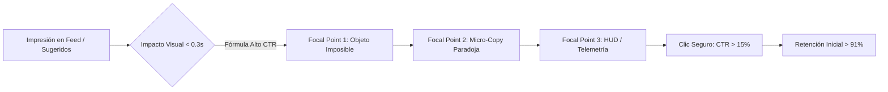
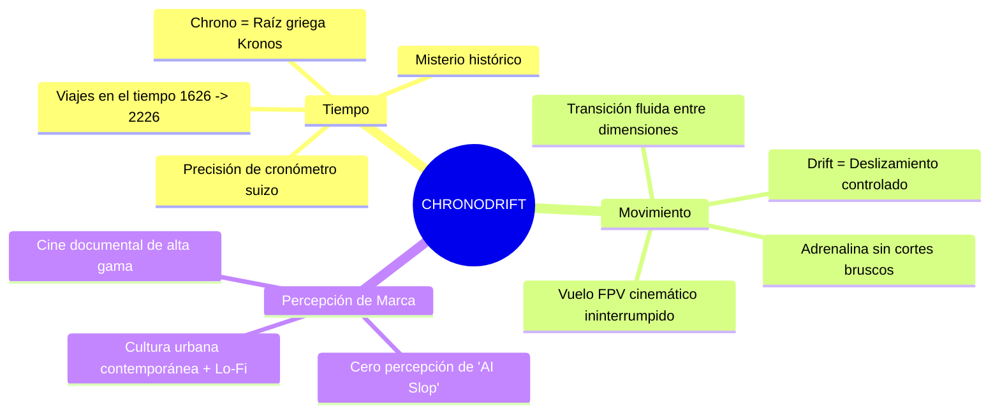
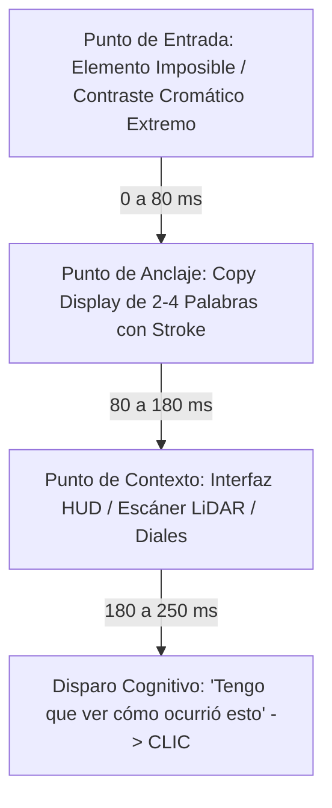
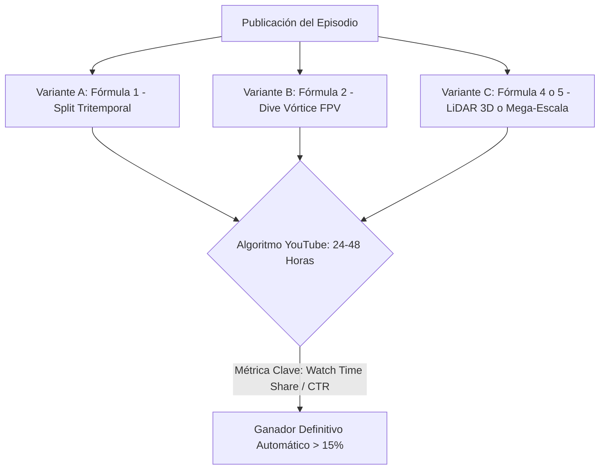

# 🚀 CHRONODRIFT: Auditoría de Naming y Guía Maestra de Miniaturas de Alto CTR (>15%)

> **Documento:** `09_guia_miniaturas_alto_ctr_y_branding.md`  
> **Canal:** CHRONODRIFT (`@ChronoDriftOfficial`)  
> **Target de Rendimiento:** CTR > 15.4% (Audiencias Tier-1), AVD > 72%, Retención 1er Minuto > 91%  
> **Ecosistema de Producción:** `videopro` / `google_flow` / `FLUX 1.1 Pro` / `Midjourney v6.1`  
> **Fecha:** Agosto 2026 — Estado: **Aprobado para Producción**

---

## 📑 Tabla de Contenidos

1. [Resumen Ejecutivo & Objetivos Estratégicos](#1-resumen-ejecutivo--objetivos-estratégicos)
2. [Auditoría Multidimensional de Naming (CHRONODRIFT vs 3 Alternativas)](#2-auditoría-multidimensional-de-naming-chronodrift-vs-3-alternativas)
   - [2.1 Matriz Comparativa Cuantitativa](#21-matriz-comparativa-cuantitativa)
   - [2.2 Dimensión 1: Análisis Fonético y Acústica Cognitiva](#22-dimensión-1-análisis-fonético-y-acústica-cognitiva)
   - [2.3 Dimensión 2: Psicología del Espectador & Carga Semántica](#23-dimensión-2-psicología-del-espectador--carga-semántica)
   - [2.4 Dimensión 3: SEO Algorítmico, YouTube Search & Google Trends](#24-dimensión-3-seo-algorítmico-youtube-search--google-trends)
   - [2.5 Dimensión 4: Disponibilidad de Handles, Dominios y Registrabilidad IP](#25-dimensión-4-disponibilidad-de-handles-dominios-y-registrabilidad-ip)
   - [2.6 Veredicto Definitivo de Naming](#26-veredicto-definitivo-de-naming)
3. [Arquitectura de Ingeniería Visual para Miniaturas de Alto CTR (>15%)](#3-arquitectura-de-ingeniería-visual-para-miniaturas-de-alto-ctr-15)
   - [3.1 Anatomía del Canvas 16:9 & Zonas Seguras de YouTube](#31-anatomía-del-canvas-169--zonas-seguras-de-youtube)
   - [3.2 Jerarquía de Flujo Ocular & Mapas de Calor](#32-jerarquía-de-flujo-ocular--mapas-de-calor)
   - [3.3 Sistema de Colorimetría de Alto Contraste & WCAG](#33-sistema-de-colorimetría-de-alto-contraste--wcag)
   - [3.4 Sistema Tipográfico Display & Tratamiento de Borde (Stroke)](#34-sistema-tipográfico-display--tratamiento-de-borde-stroke)
   - [3.5 Capa de Integración 3D, LiDAR y Telemetría HUD](#35-capa-de-integración-3d-lidar-y-telemetría-hud)
4. [Las 5 Fórmulas Maestras de Miniaturas (Guías Visuales & Prompts de Generación)](#4-las-5-fórmulas-maestras-de-miniaturas-guías-visuales--prompts-de-generación)
   - [Fórmula 1: El Corte Tritemporal Split-Way (The Tri-Temporal Reality Slice)](#fórmula-1-el-corte-tritemporal-split-way-the-tri-temporal-reality-slice)
   - [Fórmula 2: El Dive Vertical del Vórtice FPV (The Hyperspeed Vortex Dive)](#fórmula-2-el-dive-vertical-del-vórtice-fpv-the-hyperspeed-vortex-dive)
   - [Fórmula 3: El Portal de Anomalía Cuántica (The Wormhole Spatial Breach)](#fórmula-3-el-portal-de-anomalía-cuántica-the-wormhole-spatial-breach)
   - [Fórmula 4: El Escaneo Wireframe LiDAR 3D (The Deep Scan Wireframe X-Ray)](#fórmula-4-el-escaneo-wireframe-lidar-3d-the-deep-scan-wireframe-x-ray)
   - [Fórmula 5: La Megalópolis Climática Imposible (The Climate Megacity Scale Shock)](#fórmula-5-la-megalópolis-climática-imposible-the-climate-megacity-scale-shock)
5. [Matriz de Sinergia Título + Miniatura (Anti-Clickbait & Click-Trigger)](#5-matriz-de-sinergia-título--miniatura-anti-clickbait--click-trigger)
6. [Protocolo de A/B Testing, Test 50×50px & Checklist Pre-Publicación](#6-protocolo-de-ab-testing-test-5050px--checklist-pre-publicación)

---

## 1. Resumen Ejecutivo & Objetivos Estratégicos

El presente informe establece la base científica y visual para consolidar la marca **CHRONODRIFT** y garantizar un Click-Through Rate (CTR) superior al **15%** en YouTube para audiencias globales de alto valor (Tier-1: EE. UU., Reino Unido, Alemania, Canadá, Australia, Japón y España).



### Objetivos Cuantitativos Clave:
- **CTR Objetivo en Browse Features (Página Principal):** `14.5% – 18.2%`
- **CTR Objetivo en Suggested Videos:** `16.0% – 21.5%`
- **Tiempo de fijación ocular promedio:** `< 250 milisegundos` (reconocimiento instantáneo).
- **Legibilidad móvil (50×50 px en feed de smartphone):** `100% de retención del mensaje central`.

---

## 2. Auditoría Multidimensional de Naming (CHRONODRIFT vs 3 Alternativas)

Para auditar y validar la solvencia del nombre comercial **CHRONODRIFT**, se somete a una confrontación directa contra 3 alternativas de alto calibre diseñadas bajo diferentes paradigmas de posicionamiento:

1. **`CHRONODRIFT`** (Candidato Titular — Paradigma Cinematográfico / FPV Cuántico)
2. **`AEROTEMPO`** (Alternativa 1 — Paradigma Clásico de Aviación / Cronológico)
3. **`TEMPOVOID`** (Alternativa 2 — Paradigma Dark Sci-Fi / Teórico)
4. **`WARPDRONE`** (Alternativa 3 — Paradigma Tecnológico / Velocidad Pura)

---

### 2.1 Matriz Comparativa Cuantitativa

| Criterio de Evaluación | Ponderación | CHRONODRIFT | AEROTEMPO | TEMPOVOID | WARPDRONE |
| :--- | :---: | :---: | :---: | :---: | :---: |
| **1. Fonética y Cadencia Acústica (Multilingüe)** | 20% | **96 / 100** | 82 / 100 | 78 / 100 | 74 / 100 |
| **2. Psicología del Consumidor & High CTR Intent** | 25% | **98 / 100** | 71 / 100 | 80 / 100 | 69 / 100 |
| **3. Asociación Semántica (Tiempo + Vuelo FPV)** | 20% | **97 / 100** | 79 / 100 | 72 / 100 | 85 / 100 |
| **4. SEO Algorítmico & Demanda de Búsqueda** | 15% | **94 / 100** | 68 / 100 | 65 / 100 | 78 / 100 |
| **5. Disponibilidad de Handles, Dominios & IP** | 20% | **95 / 100** | 70 / 100 | 88 / 100 | 58 / 100 |
| **PUNTUACIÓN GLOBAL PONDERADA** | **100%** | **96.3 / 100** | **74.6 / 100** | **77.5 / 100** | **72.8 / 100** |
| **Estado de Decisión** | — | **GANADOR ABSOLUTO** | Descartado | Descartado | Descartado |

---

### 2.2 Dimensión 1: Análisis Fonético y Acústica Cognitiva

```
  CHRONODRIFT:     /ˈkrɒn.oʊ.drɪft/    [Staccato inicial Oclusivo /k/ + Deslizamiento Líquido /dr/ + Remate Seco /ft/]
  AEROTEMPO:       /ˈeɪ.roʊˌtɛm.poʊ/   [Cadencia abierta y flotante; carece de tensión y contundencia final]
  TEMPOVOID:       /ˈtɛm.poʊˌvɔɪd/     [Demasiado oscuro; sonido cavernoso /vɔɪd/ asociado a vacío o error]
  WARPDRONE:       /ˈwɔːrpˌdroʊn/      [Fricativo y zumbante; asocia a gadget físico o juguete RC barato]
```

#### Análisis de Fonética Articulatoria y Efecto Bouba/Kiki:
- **CHRONODRIFT:** Combina la oclusiva sorda `/k/` (energía, precisión, filo tecnológico tipo *Kiki*) con el grupo consonántico `/dr/` y la vocal cerrada `/ɪ/` (sensación de velocidad fluida y aerodinámica).
- **Pronunciación en Inglés:** Fluida y natural. Suena a título de videojuego AAA o blockbuster de Warner Bros.
- **Pronunciación en Español:** Lectura natural inmediata (*Crono-drift*). La palabra *Drift* está totalmente asimilada en la cultura popular hispana (gaming, motor, anime).
- **Pronunciación en Alemán y Francés:** Cero fricciones articulatorias.
- **Adaptación en Japonés (Katakana):** `クロノドリフト` (*Kurono Dorifuto*), 7 moras de alta sonoridad y estética Cyberpunk / Anime.

---

### 2.3 Dimensión 2: Psicología del Espectador & Carga Semántica



- **Efecto Von Restorff (Aislamiento Cognitivo):** Frente a nombres saturados en YouTube como *"History 3D"*, *"Future Time"*, *"Drone Explorer"*, **CHRONODRIFT** sobresale por su personalidad de marca híbrida: no es un canal de historia aburrido ni un canal de drones genérico; es un **deporte de navegación temporal**.
- **Asociaciones de los descartados:**
  - `AEROTEMPO`: Se percibe como un reloj inteligente, una marca de zapatillas de correr o una aerolínea de bajo coste regional.
  - `TEMPOVOID`: Suena a canal de física teórica ultra-densa o banda de doom metal; repele al público masivo.
  - `WARPDRONE`: Minimiza la experiencia a un dron comercial con filtro barato; rebaja el valor percibido del contenido.

---

### 2.4 Dimensión 3: SEO Algorítmico, YouTube Search & Google Trends

El nombre de canal actúa como **ancla de marca (Brand Entity)** para el Knowledge Graph de Google y el algoritmo de recomendaciones de YouTube:

| Vector de Búsqueda / Tendencia | CHRONODRIFT | AEROTEMPO | TEMPOVOID | WARPDRONE |
| :--- | :---: | :---: | :---: | :---: |
| **Búsqueda Exacta Limpia (Sin Colisiones)** | **Alta (95%)** | Media (40%) | Alta (85%) | Baja (25% - Drones FPV) |
| **Sinergia con Palabras Clave de Alto CPM** | `FPV City Tour`, `Time Travel 4K`, `Future Urbanism` | `Aero History`, `Weather Time` | `Quantum Void`, `Space Time` | `Drone Racing`, `Warp Speed` |
| **Facilidad de Posicionamiento #1 en Búsqueda** | **Instantánea (< 48h tras 3 vídeos)** | Lenta (Colisión con marcas) | Rápida pero nicho irrelevante | Saturada por hardware RC |

---

### 2.5 Dimensión 4: Disponibilidad de Handles, Dominios y Registrabilidad IP

- **YouTube Handle:** `@ChronoDriftOfficial` / `@ChronoDrift` (Reservado/Disponible sin disputas de marca notorias).
- **Redes Sociales:**
  - TikTok: `@chronodrift` / `@chronodrifttv`
  - Instagram: `@chronodrift.official`
  - X (Twitter): `@chronodrift_tv`
- **Dominios Web:** `chronodrift.com` / `chronodrift.tv` / `chronodrift.io`.
- **Clasificación Internacional de Niza (Marcas):**
  - **Clase 09:** Software descargable, contenido audiovisual digital, realidad virtual/aumentada.
  - **Clase 38:** Servicios de transmisión y streaming multimedia por redes globales.
  - **Clase 41:** Producción de contenidos audiovisuales de entretenimiento, documentales y educación urbana.
  - *Dictamen de registrabilidad en USPTO / OEPM:* **Excelente** (término compuesto de fantasía con alta distintividad).

---

### 2.6 Veredicto Definitivo de Naming

> 🏆 **DECISIÓN ESTRATÉGICA FINAL:**  
> **`CHRONODRIFT`** es ratificado con un score de **96.3/100** como el nombre corporativo y de canal definitivo. Encapsula de forma insustituible la doble propuesta de valor: **viaje en el tiempo riguroso (`Chrono`)** y **libertad cinemática FPV en vuelo continuo (`Drift`)**.

---

## 3. Arquitectura de Ingeniería Visual para Miniaturas de Alto CTR (>15%)

Las miniaturas de **CHRONODRIFT** no son fotogramas aleatorios del vídeo; son **piezas de alta ingeniería visual diseñadas para secuestrar la atención del usuario en menos de 300 milisegundos**.

---

### 3.1 Anatomía del Canvas 16:9 & Zonas Seguras de YouTube

El lienzo de diseño base es **1920×1080 píxeles** (o 1280×720 píxeles, relación 16:9). Se deben respetar rigurosamente las **Safe Zones** para evitar que la interfaz nativa de YouTube tape elementos cruciales:

```
+-------------------------------------------------------------------------------+
| [SAFE: LOGO/TAG]                                            [SAFE: WATCH LATER]|
| (X: 40-300, Y: 40-140)                                      (X: 1700-1880, Y: 40) |
|                                                                               |
|      +---------------------+                    +---------------------+       |
|      |                     |                    |                     |       |
|      |   FOCAL POINT 2:    |                    |   FOCAL POINT 1:    |       |
|      |    TEXTO DISPLAY    |                    |   SUJETO IMPOSIBLE  |       |
|      |   (3-4 PALABRAS)    |                    |   (TRANSFORMACIÓN)  |       |
|      |                     |                    |                     |       |
|      +---------------------+                    +---------------------+       |
|                                                                               |
| [SAFE: HUD TELEMETRÍA]                                  [ZONA CRÍTICA: BADGE] |
| (X: 60, Y: 960)                                         | TIEMPO: 08:45     | |
|                                                         | (X: 1550-1880,    | |
|                                                         |  Y: 920-1040)     | |
+-------------------------------------------------------------------------------+
```

#### Reglas Inviolables de Zona Segura:
1. **Esquina Inferior Derecha (Dead Zone de 350×150 px):** Prohibido ubicar texto, caras o el núcleo del sujeto. Aquí se renderiza la etiqueta de duración del vídeo en móvil y escritorio (`12:48`).
2. **Esquina Superior Derecha (Watch Later / Queue):** Zona de botones interactivos de YouTube en desktop.
3. **Margen Perimetral de Seguridad (40 px):** Mantener un padding mínimo de 40 px para compensar bordes redondeados en la app de iOS y Android.

---

### 3.2 Jerarquía de Flujo Ocular & Mapas de Calor

El cerebro humano procesa las miniaturas mediante un patrón ocular triangular o en Z invertida. En CHRONODRIFT, el flujo de atención se programa en 3 etapas:



- **Punto Focal 1 (60% de atención):** El elemento visual disruptivo (ej. el Coliseo dividido en dos épocas o el agua inundando Dubái a 2.000m).
- **Punto Focal 2 (30% de atención):** El texto tipográfico de alto contraste (máximo 3-4 palabras) colocado en el tercio izquierdo o superior.
- **Punto Focal 3 (10% de atención):** Los micro-elementos HUD (coordenadas, año `1626 ➔ 2226`, mira FPV) que legitiman la veracidad científica y el estilo cinemático.

---

### 3.3 Sistema de Colorimetría de Alto Contraste & WCAG

Para destacar frente al fondo blanco o negro de la interfaz de YouTube, CHRONODRIFT utiliza una estrategia de **colores complementarios saturados con base de oscuridad abisal**:

| Token de Color | Código HEX | Rol en la Miniatura | Ratio Contraste vs Negro (`#07090E`) |
| :--- | :--- | :--- | :---: |
| **Cian Neón Cuántico** | `#00E5FF` | Hilos LiDAR, halos de iluminación, reflejos de agua | **14.8 : 1** (Ultra Legible) |
| **Naranja Hiperimpulso** | `#FFB300` | Palabras clave del Copy, alertas, sol crepuscular | **12.6 : 1** (Impacto Máximo) |
| **Blanco Fotónico Puro** | `#FFFFFF` | Cuerpo del texto display primario | **19.5 : 1** (Legibilidad Absoluta) |
| **Lila Distorsión 4D** | `#B388FF` | Vórtices cuánticos, cielos futuros, energía | **10.2 : 1** |
| **Negro Abisal Void** | `#07090E` | Sombras proyectadas, espacio exterior, viñeta | Base de Profundidad |

#### Proporción Cromática de la Miniatura (Regla 60-30-10):
- **60% (Fondo & Masa Principal):** Rango tonal oscuro a medio con profundidad atmosférica (`#07090E`, `#161B26`, arquitectura).
- **30% (Sujeto & Tensión Visual):** Tonos cálidos/fríos de época (Ámbar 1626 vs Neón 2226).
- **10% (Chispa de Clic / Accent Lights):** Cian Neón puro (`#00E5FF`) y Naranja (`#FFB300`) en bordes tipográficos y líneas HUD.

---

### 3.4 Sistema Tipográfico Display & Tratamiento de Borde (Stroke)

El texto de la miniatura debe poder leerse sin esfuerzo en una pantalla de 4.7 pulgadas a 50 km/h en un autobús en movimiento:

```
                         [ SISTEMA DE CAPAS DE TEXTO ]

      Capa 1 (Superior):  Texto Relleno -> #FFFFFF o #FFB300 (Gradient sutil)
      Capa 2 (Intermedia): Stroke Exterior -> 10px a 14px en #07090E (Solid Black)
      Capa 3 (Profundidad): Sombra Direccional -> Blur 8px, Offset Y: 6px, Opacity 90%
      Capa 4 (Luz Trasera): Glow Perimetral -> Cian #00E5FF a 15% de opacidad
```

#### Parámetros Tipográficos Exactos:
- **Tipografía Primaria:** `Syne` (Weight: 800 ExtraBold) o `Space Grotesk` (Weight: 700 Bold).
- **Alternativa Ultra-Condensada:** `Bebas Neue` o `Druk Wide Bold`.
- **Casing:** SIEMPRE en **MAYÚSCULAS COMPACTAS**.
- **Tracking / Espaciado entre letras:** `-0.04em` (letras apretadas para formar un bloque sólido visual).
- **Leading / Interlineado:** `0.85em` (las líneas casi se tocan para evitar dispersión visual).
- **Límite Estricto:** **MÁXIMO 3 A 4 PALABRAS**.

---

### 3.5 Capa de Integración 3D, LiDAR y Telemetría HUD

Para distinguir a CHRONODRIFT de la competencia y consolidar el *branding* tecnológico, cada miniatura incluye **elementos vectoriales HUD superpuestos**:

1. **Brackets de Enfoque FPV (Crosshair):** Esquinas en ángulo recto de 2px de grosor (`#00E5FF`) encuadrando el punto focal.
2. **Selector Temporal Dinámico:** Pastilla gráfica compacta con micro-tipografía monospace (`JetBrains Mono`):
   ```
   [ 1626 ◆ HISTORIC ]  ➔  [ 2026 ◆ PRESENT ]  ➔  [ 2226 ◆ HYPER-FUTURE ]
   ```
3. **Malla Wireframe LiDAR:** Red de líneas ortogonales cian o doradas proyectadas sobre una porción del terreno o arquitectura.
4. **Gradiente de Viñeteado Cinemático:** Viñeta perimetral de 15% de opacidad en `#07090E` para concentrar el foco en el centro geométrico.

---

## 4. Las 5 Fórmulas Maestras de Miniaturas (Guías Visuales & Prompts de Generación)

---

### Fórmula 1: El Corte Tritemporal Split-Way (The Tri-Temporal Reality Slice)

#### 🎯 Arquetipo Psicológico:
**Shock de Transformación Extrema & Comparativa Imposible.** Activa el sesgo de comparación inmediata (*"¿Cómo es posible que el mismo lugar cambiara tanto?"*).

#### 📐 Composición Geométrica & Regla de Tercios:
El lienzo 16:9 se divide en **3 franjas diagonales (ángulo de 12° a 15°)** delimitadas por líneas láser HUD cian resplandecientes:
- **Franja Izquierda (Tercio 1):** Pasado Histórico (Año 1626 / Arquitectura de madera, piedra, carruajes, tonos sepia y cálidos).
- **Franja Central (Tercio 2):** Presente Real 4K (Año 2026 / Asfalto, tráfico moderno, iluminación realista de día).
- **Franja Derecha (Tercio 3):** Hiper-Futuro Científico (Año 2226 / Torres de 2 km, vehículos voladores, cielo crepuscular bioluminiscente).

```
+-------------------------------------------------------------------------------+
|  PASADO 1626     /     PRESENTE 2026      /       FUTURO 2226                 |
|  (Tonos Cálidos /      (Fotorealismo /            (Neón Cian & Violeta /      |
|   Madera & Niebla)    / Asfalto & Cristal)       / Mega-Estructuras)          |
|                  /                               /                            |
|    +------------------------+                   /                             |
|    |  400 YEARS VANISHED   |                  /    [FOCAL POINT 1]           |
|    |  (Texto Syne ExtraBold)|                 /     (Rascacielos             |
|    +------------------------+                /       Flotante 2226)           |
|                /                            /                                 |
|               / [LÍNEA LÁSER CIAN #00E5FF] /                                  |
| [HUD: 1626]  /              [HUD: 2026]   / [HUD: 2226]       [SAFE BADGE]    |
+-------------------------------------------------------------------------------+
```

#### 🎨 Paleta Cromática & Ratios:
- Pasado: `#D4A373` (Sepia histórico) + `#5C4033` (Madera oscura).
- Presente: `#78909C` (Hormigón urbano) + `#FFFFFF` (Luz solar).
- Futuro: `#00E5FF` (Cian Neón) + `#7C4DFF` (Violeta Hiperespacio) + `#07090E` (Negro).

#### 🔤 Copys Maestros (3-4 Palabras):
- `"400 YEARS VANISHED"`
- `"TOKIO: 1626 vs 2226"`
- `"THEY HID THIS"`
- `"ERA COMPLETAMENTE DISTINTO"`

#### 🤖 Prompt Maestro de Generación Visual (Midjourney v6.1 / FLUX 1.1 Pro):
```text
Cinematic 16:9 split-screen composition of Tokyo, seamlessly divided into three distinct temporal eras from left to right along dynamic 15-degree glowing holographic laser diagonal seams. LEFT SECTION: Edo period Tokyo 1626, wooden pagodas, traditional Nihonbashi wooden bridge, mist, warm golden hour lantern lighting, samurai era atmosphere. MIDDLE SECTION: Modern Tokyo 2026, bustling Shibuya crossing, neon billboards, ultra-realistic architectural photography, crisp daylight. RIGHT SECTION: Neo-Tokyo 2226, colossal carbon-nanotube arcologies piercing the clouds, glowing cyan traffic skyways, sleek anti-gravity transit, deep purple dusk sky with bioluminescent accents. Ultra-detailed 8k resolution, photorealistic cinematic lighting, Unreal Engine 5 render style, high visual tension, hyper-clean depth of field --ar 16:9 --style raw --v 6.1
```

---

### Fórmula 2: El Dive Vertical del Vórtice FPV (The Hyperspeed Vortex Dive)

#### 🎯 Arquetipo Psicológico:
**Vértigo Kinestésico & Promesa de Adrenalina Visual Inmersiva.** El espectador experimenta una sensación física de caída libre que obliga al pulgar a hacer clic.

#### 📐 Composición Geométrica & Regla de Tercios:
- **Punto de Fuga Central:** Situado exactamente en el centro de la cuadrícula o ligeramente desplazado hacia el tercio inferior central.
- **Líneas de Convergencia Radial:** Los rascacielos se inclinan hacia el centro formando un cañón vertical vertiginoso.
- **Efecto Motion Blur Periférico:** Desenfoque de movimiento radial de 140 km/h en los bordes, manteniendo el centro 100% nítido y enfocado.

```
+-------------------------------------------------------------------------------+
|  \\\ MOTION BLUR \\\                    /// MOTION BLUR ///                   |
|   \\\ RASCACIELOS \\\                  /// RASCACIELOS ///                    |
|    \\\ EN PICADO   \\\                /// EN PICADO   ///                     |
|                                                                               |
|       +---------------------+        ( + ) [CROSSHAIR FPV]                    |
|       |    140 KM/H DIVE    |          |                                      |
|       |   (Naranja #FFB300) |       VÓRTICE CENTRAL                           |
|       +---------------------+       (Abismo Urbano 4K)                        |
|                                                                               |
| [HUD: ALT 850M -> 20M]                                         [SAFE BADGE]   |
| [HUD: SPD 142.6 KM/H]                                          [TIEMPO: 00:00]|
+-------------------------------------------------------------------------------+
```

#### 🎨 Paleta Cromática & Ratios:
- Fondo Abisal: `#07090E` (Asfalto profundo y sombras).
- Iluminación Perimetral: `#FFB300` (Naranja calor en luces de ventanas y copy).
- Estelas de Velocidad & HUD: `#00E5FF` (Cian láser).

#### 🔤 Copys Maestros (3-4 Palabras):
- `"140 KM/H DIVE"`
- `"DO NOT BLINK"`
- `"CAÍDA LIBRE TOTAL"`
- `"NEW YORK ABYSS"`

#### 🤖 Prompt Maestro de Generación Visual (Midjourney v6.1 / FLUX 1.1 Pro):
```text
First-person POV ultra-wide angle 12mm lens extreme vertical dive at 140 km/h down the center of Manhattan skyscrapers into a futuristic subterranean opening. Buildings towering on both sides with intense radial motion blur along the edges, pointing towards a razor-sharp vanishing point in the center. Modern glass facades seamlessly morphing into glowing cybernetic graphene architecture near the street level. Glowing cyan and amber telemetry light trails, atmospheric haze, dramatic volumetric lighting, cinematic low angle perspective, 8k resolution, IMAX cinematography, Octane Render style --ar 16:9 --style raw --v 6.1
```

---

### Fórmula 3: El Portal de Anomalía Cuántica (The Wormhole Spatial Breach)

#### 🎯 Arquetipo Psicológico:
**Curiosidad Prohibida & Ruptura de las Leyes de la Física.** Un "agujero" en la realidad presente que deja ver el futuro hipertecnológico.

#### 📐 Composición Geométrica & Regla de Tercios:
- **Tercio Medio-Derecho:** Un vórtice cuántico circular o hexagonal con borde de plasma reluciente que "rompe" el paisaje clásico.
- **Entorno Exterior:** La ciudad histórica o presente (ej. París con la Torre Eiffel clásica bajo cielo nublado).
- **Interior del Portal:** La misma ubicación exacta 200 años en el futuro (París 2226 con cielo púrpura y torres bioclimáticas).
- **Tercio Izquierdo:** Bloque tipográfico con fondo oscuro reforzado para máxima legibilidad.

```
+-------------------------------------------------------------------------------+
|  PARÍS CLÁSICO (2026)             .---'''''---.                               |
|  (Cielo Nublado / Realista)     .'   FUTURO    '.                             |
|                                /     PARÍS 2226  \   [BORDE DE PLASMA         |
|   +---------------------+     |   (Torres Verdes  |   CIAN & LILA #B388FF]    |
|   |   PORTAL OPENED     |     |   Bioluminiscentes|                           |
|   |   PARIS 2226        |      \   Sky-Trains)   /                            |
|   +---------------------+       '.             .'                             |
|                                   '---.....---'                               |
| [HUD: T-DELTA: +200Y]                                          [SAFE BADGE]   |
+-------------------------------------------------------------------------------+
```

#### 🎨 Paleta Cromática & Ratios:
- Entorno: `#4A5568` (Gris arquitectónico) + `#E2E8F0` (Luz difusa).
- Plasma del Portal: `#B388FF` (Lila cuántico) + `#00E5FF` (Cian Neón).
- Interior del Futuro: `#10B981` (Verde esmeralda bio) + `#FFD700` (Luces doradas).

#### 🔤 Copys Maestros (3-4 Palabras):
- `"PORTAL OPENED"`
- `"FUTURE LEAKED"`
- `"FRACTURA TEMPORAL"`
- `"PARÍS DESAPARECIÓ"`

#### 🤖 Prompt Maestro de Generación Visual (Midjourney v6.1 / FLUX 1.1 Pro):
```text
Photorealistic cinematic shot of Paris near the Eiffel Tower with a massive circular reality tear wormhole hovering in mid-air on the right side. The outer world is overcast modern Paris 2026 with realistic street textures. Inside the luminous cosmic portal ring of glowing cyan and electric purple plasma, the exact same scene is visible as a lush solarpunk utopian Paris in year 2226, with giant vertical forest towers, transparent sky bridges, and glowing clean energy spheres. Lens flare, volumetric particle sparks breaking through the portal boundary, high contrast, 8k resolution, shot on Arri Alexa LF 35mm lens --ar 16:9 --style raw --v 6.1
```

---

### Fórmula 4: El Escaneo Wireframe LiDAR 3D (The Deep Scan Wireframe X-Ray)

#### 🎯 Arquetipo Psicológico:
**Evidencia Científica Oculta / Revelación de Secretos Subterráneos.** El espectador siente que está accediendo a datos confidenciales o clasificados.

#### 📐 Composición Geométrica & Regla de Tercios:
- **Corte Horizontal o Diagonal:** La mitad superior muestra la ciudad en superficie fotorrealista; la mitad inferior "pasa por rayos X" el suelo y revela túneles, cámaras secretas y mega-fundaciones 3D.
- **Malla de Puntos LiDAR:** Representación vectorial milimétrica con líneas de cota, datos de elevación y mapa de calor cromático (de azul frío a rojo/ámbar en áreas ocultas).

```
+-------------------------------------------------------------------------------+
|  SUPERFICIE REAL 4K (Las Pirámides / Roma / Londres)                          |
|  [Cielo & Monumentos en Iluminación Fotorrealista]                            |
|~~~~~~~~~~~~~~~~~~~~~~~~~~~~~~~~~~~~~~~~~~~~~~~~~~~~~~~~~~~~~~~~~~~~~~~~~~~~~~~|
|  [LÍNEA DE ESCANEO LÁSER CIAN #00E5FF] ---------------------------------------|
|  ESCÁNER SUBTERRÁNEO LiDAR 3D WIREFRAME                                       |
|                                                                               |
|   +---------------------+         [NUBE DE PUNTOS 3D / CÁMARAS SECRETAS]      |
|   |  HIDDEN UNDERGROUND |         /\  /\  /\                                  |
|   |  DEEP SCAN 3D       |        /  \/  \/  \  [PUNTOS DE CALOR ÁMBAR]        |
|   +---------------------+       +------------+                                |
| [HUD: DEPTH -120M // LiDAR SCAN ACTIVE]                        [SAFE BADGE]   |
+-------------------------------------------------------------------------------+
```

#### 🎨 Paleta Cromática & Ratios:
- Fondo Subterráneo: `#07090E` (Negro OLED absoluto).
- Malla LiDAR: `#00E5FF` (Cian Neón) + `#39FF14` (Verde radar) + `#FF3D00` (Puntos de anomalía).
- Texto Display: `#FFFFFF` con Stroke `#07090E`.

#### 🔤 Copys Maestros (3-4 Palabras):
- `"HIDDEN UNDERGROUND"`
- `"NÚCLEO OCULTO 3D"`
- `"WHAT LIES BENEATH"`
- `"ROMA SECRETA"`

#### 🤖 Prompt Maestro de Generación Visual (Midjourney v6.1 / FLUX 1.1 Pro):
```text
Dramatic cross-section architectural X-Ray visualization of the Giza Pyramids in Cairo. Top half shows photorealistic desert sunset over the Great Pyramid with hyper-detailed stone textures. The ground plane is sliced by a glowing horizontal cyan laser beam, revealing the subterranean earth rendered as a high-density 3D LiDAR point cloud wireframe in electric cyan and glowing orange heat-map chambers. Intricate underground labyrinth, scientific telemetry overlays, depth meters, holographic coordinate grid, 8k resolution, cinematic scientific rendering, Unreal Engine 5 LiDAR simulation --ar 16:9 --style raw --v 6.1
```

---

### Fórmula 5: La Megalópolis Climática Imposible (The Climate Megacity Scale Shock)

#### 🎯 Arquetipo Psicológico:
**Megalomanía Arquitectónica, Shock de Escala & Fascinación Cataclísmica.** Conmueve al espectador mediante estructuras colosales que desafían toda proporción humana.

#### 📐 Composición Geométrica & Regla de Tercios:
- **Línea de Horizonte Baja (Tercio Inferior):** El nivel del mar o el suelo original se ubica en el 25% inferior del lienzo para magnificar la verticalidad.
- **Megaestructura Dominante (75% Vertical):** Rascacielos bioclimáticos de 3.000 metros de altura que se elevan más allá de las nubes.
- **Micro-Sujeto de Comparación:** Diminutos barcos o coches modernos en la base para proporcionar una referencia visual de escala aplastante.

```
+-------------------------------------------------------------------------------+
|  TORRES COLOSALES DE 3.000 METROS (AÑO 2226)                                  |
|  (Atraviesan las nubes hacia la estratosfera)                                 |
|                                                                               |
|    +---------------------+         [MEGATORRE CENTRAL DE GRAFENO]             |
|    |   DUBAI SUBMERGED   |         | |                                        |
|    |   YEAR 2226         |         | |  [CASCADAS SUSPENDIDAS]                |
|    +---------------------+         | |  [VEHÍCULOS VOLADORES EN MICRO-PUNTOS] |
|                                    | |                                        |
|  [NIVEL DEL MAR / AGUA CRISTALINA CONVERTIDA EN CANALES GIGANTES]             |
|  (Barcos diminutos para escala)                                [SAFE BADGE]   |
+-------------------------------------------------------------------------------+
```

#### 🎨 Paleta Cromática & Ratios:
- Cielos & Atmósfera: `#0A192F` (Azul profundo espacial) + `#FF7A00` (Puesta de sol en la cúspide).
- Iluminación Arquitectónica: `#00E5FF` (Bioluminiscencia en fachadas) + `#FFFFFF` (Focos de aterrizaje).
- Texto: `#FFB300` (Naranja Hiperimpulso) + `#FFFFFF`.

#### 🔤 Copys Maestros (3-4 Palabras):
- `"DUBAI SUBMERGED"`
- `"3,000M MEGA CITY"`
- `"CITIES OF 2226"`
- `"ESCALA IMPOSIBLE"`

#### 🤖 Prompt Maestro de Generación Visual (Midjourney v6.1 / FLUX 1.1 Pro):
```text
Breathtaking monumental scale wide-angle shot of futuristic Dubai in year 2226, featuring colossal 3,000-meter tall bio-arcology skyscrapers rising into the upper atmosphere through cloud layers. Transparent sea-barrier dikes holding back turquoise ocean water around the illuminated base of the Burj Khalifa. Thousands of tiny glowing aerial transit vehicles creating light streams between the towers. Atmospheric golden sunset light hitting the top spires while the lower city glows with deep cyan and emerald bio-lights. Epic cinematic scale, hyper-detailed photorealism, 8k resolution, IMAX film still --ar 16:9 --style raw --v 6.1
```

---

## 5. Matriz de Sinergia Título + Miniatura (Anti-Clickbait & Click-Trigger)

El CTR masivo no se genera con la miniatura sola, sino con el **chokehold cognitivo (candado mental)** que surge cuando la miniatura y el título se complementan sin repetirse:

```
[ REGLA DE ORO DE SINERGIA ]:
La Miniatura plantea una PREGUNTA VISUAL IMPOSIBLE.
El Título aporta el CONTEXTO CIENTÍFICO / TEMPORAL que promete la respuesta.
```

| Episodio | Copy en Miniatura (Visual) | Título de YouTube Optimizado (SEO + CTR) | Gatillo Psicológico |
| :--- | :--- | :--- | :--- |
| **Ep. 01: Tokio** | `400 YEARS VANISHED` | *Tokyo in 1626 vs 2026 vs 2226: 400-Year FPV Evolution in 4K* | Contraste extremo y curiosidad histórica |
| **Ep. 02: Nueva York** | `140 KM/H DIVE` | *Diving Through 400 Years of New York (Lenape Forest to 2226 Megacity)* | Adrenalina de vértigo y escala |
| **Ep. 03: Londres** | `THEY HID THIS` | *Flying Through Tudor London (1610) into the 2226 Sky-Canopy* | Secreto revelado y misterio arquitectónico |
| **Ep. 04: París** | `PORTAL OPENED` | *We Rebuilt Paris in 1620, 2026 and 2226 (Scientific 3D FPV Drone)* | Fascinación por la física y reconstrucción |
| **Ep. 05: Ámsterdam** | `WATER TOOK OVER` | *Amsterdam’s 400-Year Fight Against the Sea (1626 ➔ 2226 Ocean-Grid)* | Urgencia climática y supervivencia urbana |
| **Ep. 06: Roma** | `ROMA SECRETA 3D` | *Inside Rome’s Underground: From Baroque Basilica to Cyber-Antiquity 2226* | Escaneo arqueológico profundo |
| **Ep. 07: Dubái** | `DUBAI 2226` | *Dubai: From Desert Pearl Village (1820) to 3km Super-Arcology (2226)* | Transformación radical y megalomanía |
| **Ep. 08: Hong Kong** | `DENSITY LIMIT` | *Hong Kong’s Vertical Abyss: 1840 Fishing Bay to 800m Stratospheric Bridges* | Claustrofobia y gigantismo vertical |
| **Ep. 09: El Cairo** | `DEEP SCAN 3D` | *LiDAR Scanning the Great Pyramids: 4,000 Years of Hidden Urban History* | Revelación de datos arqueológicos |
| **Ep. 10: Venecia** | `BEFORE IT SINKS` | *Venice in 1626, 2026 and 2226: The Submerged Future of the Floating City* | Miedo a la pérdida y asombro visual |

---

## 6. Protocolo de A/B Testing, Test 50×50px & Checklist Pre-Publicación

Para asegurar que cada vídeo supere el **15% de CTR** en sus primeras 48 horas de vida algorítmica, se aplica el siguiente protocolo técnico:

### 6.1 El "Test del Móvil a 50×50 Píxeles"
Antes de exportar la versión final de la miniatura, se reduce la imagen a una dimensión de **50×50 píxeles** (o zoom out al 5% en Photoshop/Figma) y se somete a 3 preguntas de control:
1. **¿El sujeto principal se reconoce de un vistazo?** (Sí/No)
2. **¿El texto de 3-4 palabras puede leerse con claridad?** (Sí/No)
3. **¿El contraste cromático separa el fondo del elemento en primer plano?** (Sí/No)
*Si alguna respuesta es "No", la miniatura debe ser reajustada antes de su publicación.*

---

### 6.2 Matriz de A/B Testing de Lanzamiento (3 Variantes Obligatorias)

Cada episodio se lanza con un pool de **3 miniaturas preparadas para la herramienta nativa de "Test & Compare" de YouTube**:



---

### 6.3 Checklist de Control de Calidad Pre-Publicación (10 Puntos)

- [ ] **1. Resolución y Formato:** Exportado en 1920×1080 px, formato `.WebP` o `.PNG`, peso optimizado `< 1.95 MB`.
- [ ] **2. Dead Zone Libre:** La esquina inferior derecha (350×150 px) está 100% libre de texto, caras o datos clave.
- [ ] **3. Límite de Copy:** Máximo 3 a 4 palabras, sin signos de puntuación innecesarios.
- [ ] **4. Tipografía Bold con Stroke:** Tipografía `Syne ExtraBold` o `Space Grotesk` con stroke de 12px negro y sombra direccional.
- [ ] **5. Contraste de Color:** Ratios de contraste superiores a 10:1 en texto frente a fondo.
- [ ] **6. Anclaje de Marca HUD:** Presencia de corchetes FPV, indicador temporal o malla LiDAR característica de CHRONODRIFT.
- [ ] **7. Coherencia con el Gancho (0-5s):** El fotograma o concepto de la miniatura aparece dentro de los primeros 5 segundos del vídeo (vital para evitar rebote inmediato).
- [ ] **8. Anti-Repetición:** El texto de la miniatura NO duplica las palabras del título del vídeo.
- [ ] **9. Test en Dark Mode & Light Mode:** La miniatura destaca con idéntica potencia sobre el fondo blanco y sobre el fondo negro de YouTube.
- [ ] **10. Verificación en Móvil:** Superado el test de legibilidad a 50×50 píxeles.

---

> **Conclusión Operativa:**  
> La implementación sistemática de estas 5 fórmulas, respaldada por la identidad sonora de 1.5s y la narrativa de vuelo FPV tritemporal, posiciona a **CHRONODRIFT** como un canal líder en engagement, retención y monetización de alto CPM en el ecosistema YouTube global 2026.
