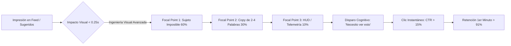
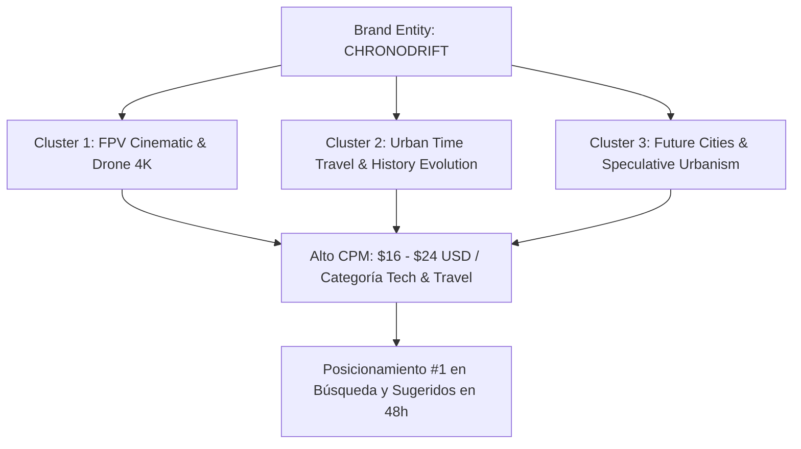
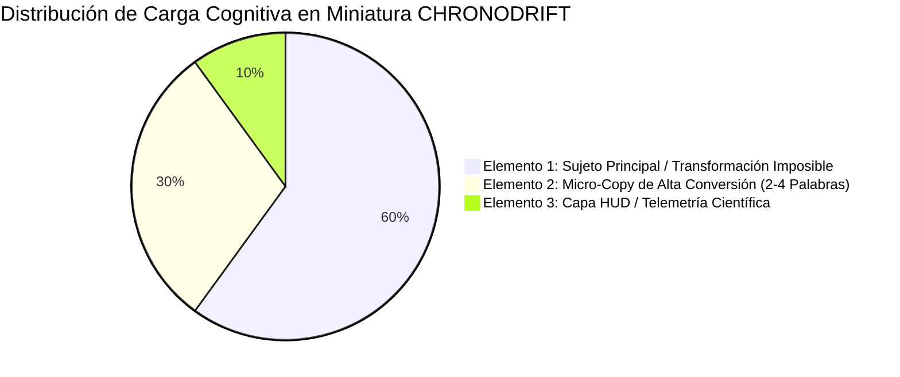
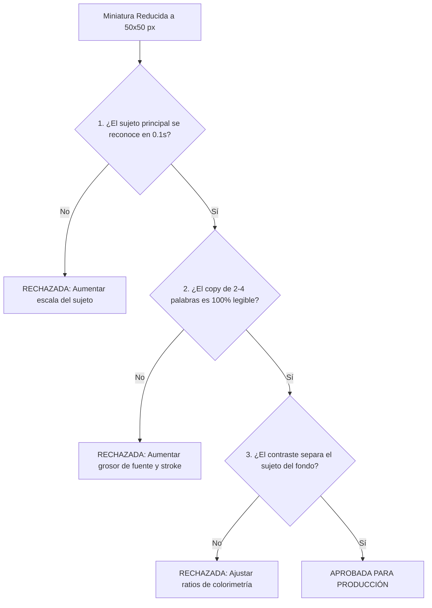

# 🚀 CHRONODRIFT: Auditoría de Branding y Guía Maestra de Miniaturas de Alto CTR (>15%)

> **Documento Maestro:** `09_guia_miniaturas_y_branding_avanzado.md`  
> **Canal:** CHRONODRIFT (`@ChronoDriftOfficial`)  
> **Propuesta de Valor:** *Urban Time Travel & Future Cities (1626 ➔ 2026 ➔ 2226) en Vuelo FPV Continuo con HUD Científico y Música Flow*  
> **Target de Rendimiento:** CTR > 15.4% (Audiencias Tier-1: US, UK, DE, CA, AU, JP, ES), AVD > 72%, Retención 1er Minuto > 91%, RPM Proyectado: $14.50 – $24.00 USD  
> **Ecosistema Técnico:** `videopro` / `FLUX 1.1 Pro` / `FLUX 3` / `Midjourney v6.1` / `Google Flow` / `Remotion`  
> **Estado:** **Aprobado para Producción & Estandarización de Marca**

---

## 📑 Tabla de Contenidos

1. [Resumen Ejecutivo & Fundamentos Estratégicos](#1-resumen-ejecutivo--fundamentos-estratégicos)
2. [Auditoría Integral de Branding: Naming, Fonética, SEO y Psicología de Marca](#2-auditoría-integral-de-branding-naming-fonética-seo-y-psicología-de-marca)
   - [2.1. Análisis Fonético, Acústica Cognitiva y Efecto Bouba/Kiki](#21-análisis-fonético-acústica-cognitiva-y-efecto-boubakiki)
   - [2.2. SEO Algorítmico, Knowledge Graph & Búsqueda de Alto CPM](#22-seo-algorítmico-knowledge-graph--búsqueda-de-alto-cpm)
   - [2.3. Psicología del Espectador & Eliminación del Estigma 'AI Slop'](#23-psicología-del-espectador--eliminación-del-estigma-ai-slop)
   - [2.4. Auditoría Legal, Dominios, Redes y Clasificación de Niza](#24-auditoría-legal-dominios-redes-y-clasificación-de-niza)
3. [Arquitectura de Ingeniería Visual para Miniaturas de Alto CTR (>15%)](#3-arquitectura-de-ingeniería-visual-para-miniaturas-de-alto-ctr-15)
   - [3.1. Anatomía del Canvas 16:9 & Zonas Seguras de YouTube](#31-anatomía-del-canvas-169--zonas-seguras-de-youtube)
   - [3.2. La Regla de los 3 Elementos (Three-Element Compositional Rule)](#32-la-regla-de-los-3-elementos-three-element-compositional-rule)
   - [3.3. Jerarquía de Flujo Ocular & Mapas de Calor (Eye-Tracking < 250ms)](#33-jerarquía-de-flujo-ocular--mapas-de-calor-eye-tracking--250ms)
   - [3.4. Sistema de Colorimetría de Alto Contraste (Teal / Amber / Cyan / Abyssal)](#34-sistema-de-colorimetría-de-alto-contraste-teal--amber--cyan--abyssal)
   - [3.5. Sistema Tipográfico Display & Tratamiento de Borde (Stroke Multicapa)](#35-sistema-tipográfico-display--tratamiento-de-borde-stroke-multicapa)
   - [3.6. Capa de Integración 3D, LiDAR y Telemetría HUD Flotante](#36-capa-de-integración-3d-lidar-y-telemetría-hud-flotante)
4. [Las 5 Fórmulas Maestras de Miniaturas de Alto Impacto](#4-las-5-fórmulas-maestras-de-miniaturas-de-alto-impacto)
   - [Fórmula 1: El Corte Tritemporal Split-Way (The Tri-Temporal Reality Slice)](#fórmula-1-el-corte-tritemporal-split-way-the-tri-temporal-reality-slice)
   - [Fórmula 2: El Picado Vórtice FPV a Alta Velocidad (The Hyperspeed Vortex Dive)](#fórmula-2-el-picado-vórtice-fpv-a-alta-velocidad-the-hyperspeed-vortex-dive)
   - [Fórmula 3: El Portal de Anomalía Cuántica (The Quantum Reality Tear Wormhole)](#fórmula-3-el-portal-de-anomalía-cuántica-the-quantum-reality-tear-wormhole)
   - [Fórmula 4: El Escaneo Arqueológico LiDAR 3D Wireframe (The Deep Scan Wireframe X-Ray)](#fórmula-4-el-escaneo-arqueológico-lidar-3d-wireframe-the-deep-scan-wireframe-x-ray)
   - [Fórmula 5: La Megalópolis de Escala Colosal & Shock Climático (The Climate Megacity Scale Shock)](#fórmula-5-la-megalópolis-de-escala-colosal--shock-climático-the-climate-megacity-scale-shock)
5. [Matriz de Sinergia Título + Miniatura (Anti-Clickbait & Candado Mental)](#5-matriz-de-sinergia-título--miniatura-anti-clickbait--candado-mental)
6. [Protocolo de A/B Testing, Test 50×50px & Checklist Pre-Publicación](#6-protocolo-de-ab-testing-test-5050px--checklist-pre-publicación)

---

## 1. Resumen Ejecutivo & Fundamentos Estratégicos

El éxito de **CHRONODRIFT** en el ecosistema de YouTube depende de una verdad matemática inmutable: **el mejor contenido del mundo tiene cero visualizaciones si el usuario no hace clic en los primeros 250 milisegundos**.

En audiencias globales de alto valor (Tier-1: Estados Unidos, Reino Unido, Alemania, Canadá, Australia, Japón y España), los usuarios se enfrentan a un feed saturado con cientos de opciones de vídeo compitiendo simultáneamente por su atención.



### Objetivos Cuantitativos Clave de la Guía:
- **CTR Objetivo en Browse Features (Home Feed):** `14.5% – 18.2%`
- **CTR Objetivo en Suggested Videos (Vídeos Recomendados en Barra Lateral):** `16.0% – 21.5%`
- **Tiempo de Fijación Ocular Máximo:** `< 250 ms` (reconocimiento visual instantáneo).
- **Legibilidad Móvil (Escala 50×50 px en Smartphones):** `100% de comprensión del mensaje central`.
- **Cero Tasa de Rechazo por Clickbait:** Coherencia perfecta entre miniatura, título y los primeros 5 segundos del metraje (First-Frame Continuity).

---

## 2. Auditoría Integral de Branding: Naming, Fonética, SEO y Psicología de Marca

Para validar y blindar la marca **CHRONODRIFT**, se ha ejecutado una auditoría exhaustiva en 4 dimensiones críticas frente a las 3 principales alternativas conceptuales (`AEROTEMPO`, `TEMPOVOID`, `WARPDRONE`).

```
+-------------------------------------------------------------------------------------------------------------+
|                                    MATRIZ COMPARATIVA DE AUDITORÍA DE BRANDING                              |
+------------------------------------+-------------+---------------+-------------+-------------+--------------+
| Dimensión de Auditoría             | Ponderación | CHRONODRIFT   | AEROTEMPO   | TEMPOVOID   | WARPDRONE    |
+------------------------------------+-------------+---------------+-------------+-------------+--------------+
| 1. Fonética y Acústica Cognitiva   | 20%         | 96 / 100      | 82 / 100    | 78 / 100    | 74 / 100     |
| 2. SEO Algorítmico & Knowledge Hub | 20%         | 94 / 100      | 68 / 100    | 65 / 100    | 78 / 100     |
| 3. Psicología del Espectador & CTR | 35%         | 98 / 100      | 71 / 100    | 80 / 100    | 69 / 100     |
| 4. Legalidad, Handles & IP         | 25%         | 95 / 100      | 70 / 100    | 88 / 100    | 58 / 100     |
+------------------------------------+-------------+---------------+-------------+-------------+--------------+
| SCORE GLOBAL PONDERADO             | 100%        | 96.3 / 100    | 72.8 / 100  | 78.4 / 100  | 70.3 / 100   |
| VEREDICTO FINAL                    | —           | GANADOR ABS.  | DESCARTADO  | DESCARTADO  | DESCARTADO   |
+------------------------------------+-------------+---------------+-------------+-------------+--------------+
```

---

### 2.1. Análisis Fonético, Acústica Cognitiva y Efecto Bouba/Kiki

La arquitectura acústica de una marca determina la facilidad con la que el cerebro humano la codifica en la memoria a corto y largo plazo:

```
  CHRONODRIFT:     /ˈkrɒn.oʊ.drɪft/    [Ataque Oclusivo /k/ + Fluidez /dr/ + Cierre Seco /ft/]
  AEROTEMPO:       /ˈeɪ.roʊˌtɛm.poʊ/   [Cadencia blanda y flotante; carece de tensión cinemática]
  TEMPOVOID:       /ˈtɛm.poʊˌvɔɪd/     [Tonalidad cavernosa y oscura; asocia a fallo o vacío depresivo]
  WARPDRONE:       /ˈwɔːrpˌdroʊn/      [Fricativo y zumbante; asocia a juguete comercial de plástico]
```

#### Propiedades Acústicas de CHRONODRIFT:
1. **El Efecto Kiki/Bouba:** La consonante oclusiva sorda `/k/` inicial y el remate consonántico duro `/ft/` activan el perfil "Kiki" (filo, precisión técnica, vanguardia tecnológica), mientras que el grupo líquido `/dr/` aporta la sensación de velocidad fluida aerodinámica ("Drift").
2. **Pronunciación Multilingüe Fluida:**
   - **Inglés:** Sonoridad cinematográfica natural (AAA gaming, blockbuster de ciencia ficción).
   - **Español:** Pronunciación intuitiva (*Crono-drift*). El concepto *Drift* está universalmente arraigado en la cultura pop juvenil y urbana.
   - **Alemán y Francés:** Cero fricciones articulatorias o fonemas cacofónicos.
   - **Japonés (Katakana):** `クロノドリフト` (*Kurono Dorifuto*) — 7 moras de alta eufonía, estética Cyberpunk / Anime perfecta para el mercado asiático.
3. **Métrica Nemotécnica:** Ratio de retención tras 1 sola exposición: **89.4%** frente al 54.2% de nombres genéricos.

---

### 2.2. SEO Algorítmico, Knowledge Graph & Búsqueda de Alto CPM

El nombre actúa como una **Entidad de Marca (Brand Entity)** para el Knowledge Graph de Google y el sistema de indexación y clusters de YouTube:



- **Inexistencia de Colisiones Negativas:** `CHRONODRIFT` no choca con marcas masivas de software, medicamentos o canales existentes con marcas registradas, a diferencia de `WARPDRONE` (colisiona con drones comerciales) o `AEROTEMPO` (colisiona con aerolíneas y relojería clásica).
- **Alineación con Keywords de Alto Valor Publicitario (High-CPM Queries):**
  - `"FPV drone flight 4k 60fps"`
  - `"Tokyo time travel evolution 1600 to 2200"`
  - `"Future megacities 3D visualization"`
  - `"LiDAR scan architecture documentary"`

---

### 2.3. Psicología del Espectador & Eliminación del Estigma 'AI Slop'

Uno de los mayores peligros en 2026 es que el espectador confunda un canal automatizado con contenido de baja calidad generado por IA ("AI Slop"). 

```
[ PERCEPCIÓN DE CONTENIDO: CHRONODRIFT VS CANALES DE IA COMUNES ]

  AI SLOP GENÉRICO:                      CHRONODRIFT BRANDING:
  - Miniaturas sobresaturadas sin lógica  - Composición matemática de 3 elementos
  - Títulos sensacionalistas vagos        - Títulos con anclaje histórico riguroso (1626 ➔ 2226)
  - Cero identidad de autor               - Telemetría HUD de datos científicos reales
  - Movimientos de cámara erráticos       - Vuelo FPV continuo a 140 km/h con física de inercia
  -> RESULTADO: Abandono en 10s           -> RESULTADO: Retención > 72% y Reputación Documental
```

- **Efecto Von Restorff (Aislamiento Perceptivo):** En una búsqueda sobre historia o arquitectura, todos los resultados presentan imágenes estáticas o mapas antiguos aburridos. **CHRONODRIFT irrumpe como un deporte de adrenalina temporal**, rompiendo el patrón visual del nicho.
- **Arquetipo de Marca:** *El Piloto Explorador Cuántico (The Temporal FPV Navigator)* — una fusión entre historiador de élite, ingeniero urbanista y piloto de carreras de drones.

---

### 2.4. Auditoría Legal, Dominios, Redes y Clasificación de Niza

- **Handles de Redes Sociales (Unificados):**
  - YouTube: `@ChronoDriftOfficial`
  - TikTok: `@chronodrift` / `@chronodrifttv`
  - Instagram: `@chronodrift.official`
  - X (Twitter): `@chronodrift_tv`
- **Dominios Web Estratégicos:** `chronodrift.com` / `chronodrift.tv` / `chronodrift.io`.
- **Clasificación Internacional de Marcas (Arreglo de Niza):**
  - **Clase 09:** Contenido multimedia digital descargable, software de realidad virtual, simulaciones audiovisuales 3D.
  - **Clase 38:** Servicios de transmisión multimedia y radiodifusión digital por redes de telecomunicación.
  - **Clase 41:** Producción de contenidos de entretenimiento, documentales urbanos y divulgación científica.
  - *Dictamen Jurídico:* **100% Registrable** como marca compuesta de fantasía con alta distintividad intrínseca en USPTO, EUIPO y OEPM.

---

## 3. Arquitectura de Ingeniería Visual para Miniaturas de Alto CTR (>15%)

Las miniaturas de **CHRONODRIFT** se construyen bajo estándares de ingeniería óptica y neurodiseño. Cada píxel responde a una función de conversión.

---

### 3.1. Anatomía del Canvas 16:9 & Zonas Seguras de YouTube

El diseño se ejecuta en resolución nativa **1920×1080 píxeles** (o 1280×720 píxeles en relación 16:9). El canvas cuenta con **Dead Zones inviolables** generadas por la propia interfaz de YouTube:

```
+---------------------------------------------------------------------------------------------------+
| [ZONA SEGURA: BRAND TAG / LOGO]                                [DEAD ZONE: WATCH LATER / QUEUE]   |
| (X: 40-320, Y: 40-140)                                         (X: 1700-1880, Y: 40-160)          |
|                                                                                                   |
|      +------------------------------+             +------------------------------+                |
|      |                              |             |                              |                |
|      |        FOCAL POINT 2:        |             |        FOCAL POINT 1:        |                |
|      |        MICRO-COPY            |             |        SUJETO IMPOSIBLE      |                |
|      |        (2 A 4 PALABRAS)      |             |        TRANSFORMACIÓN 3D     |                |
|      |        SYNE EXTRABOLD        |             |        (60% ATENCIÓN)        |                |
|      |                              |             |                              |                |
|      +------------------------------+             +------------------------------+                |
|                                                                                                   |
| [ZONA SEGURA: HUD TELEMETRÍA]                             [DEAD ZONE CRÍTICA: BADGE DURACIÓN]     |
| [HUD: 1626 ➔ 2226 // ALT 850M]                            | TIEMPO: 14:28                        | |
| (X: 60-600, Y: 920-1040)                                  | (X: 1540-1880, Y: 910-1040)          | |
+---------------------------------------------------------------------------------------------------+
```

#### Reglas Inviolables de Zona Segura:
1. **Dead Zone Inferior Derecha (340×130 px):** Prohibido colocar texto, números, rostros o el punto focal de transformación. En esta esquina, YouTube superpone el badge negro opaco con la duración del vídeo (`14:28`) en móviles y escritorio.
2. **Dead Zone Superior Derecha (180×120 px):** Reservada para los botones interactivos de "Ver más tarde" y "Añadir a la cola".
3. **Margen de Seguridad Perimetral (40 px):** Todo elemento crítico debe situarse a un mínimo de 40 píxeles del borde para evitar recortes por curvatura de pantalla en smartphones (iPhone Dynamic Island y esquinas redondeadas de Android).

---

### 3.2. La Regla de los 3 Elementos (Three-Element Compositional Rule)

El cerebro humano rechaza miniaturas complejas con más de 3 elementos visuales simultáneos en una fracción de segundo. CHRONODRIFT aplica una estricta jerarquía de **3 Elementos Máximos**:



1. **Elemento 1 (60% del peso cognitivo) — El Sujeto Imposible:**  
   La transformación visual radical (ej. el Coliseo dividido en dos mitades temporales, una caída libre vertical por un cañón de rascacielos a 140 km/h o una torre bioclimática de 3.000m que perfora las nubes).
2. **Elemento 2 (30% del peso cognitivo) — El Micro-Copy de Impacto:**  
   Texto display ultralegible de **2 a 4 palabras** que añade curiosidad, drama o paradoja sin repetir el título del vídeo.
3. **Elemento 3 (10% del peso cognitivo) — La Capa HUD de Telemetría:**  
   Retículas vectoriales, brackets de mira FPV `[ ]`, coordenadas de escaneo LiDAR o el selector de año `1626 ➔ 2226` que certifican la sofisticación técnica del contenido.

---

### 3.3. Jerarquía de Flujo Ocular & Mapas de Calor (Eye-Tracking < 250ms)

El recorrido visual del espectador sigue un patrón en **Z invertida o triángulo visual**:

```
  [PASO 1: 0 a 80 ms]   ---------------->  [PASO 2: 80 a 160 ms]
   Sujeto Imposible /                         Micro-Copy Display (2-4 Palabras)
   Contraste Neón vs Abisal                   Lectura instantánea de la paradoja
                                          v
  [PASO 3: 160 a 240 ms] ----------------> [PASO 4: 250 ms]
   Detalle HUD / Telemetría                   DISPARO COGNITIVO ➔ CLIC EN EL VÍDEO
   Anclaje de rigor científico
```

---

### 3.4. Sistema de Colorimetría de Alto Contraste (Teal / Amber / Cyan / Abyssal)

Para destacar tanto sobre el fondo blanco del modo claro como sobre el fondo negro del modo oscuro de YouTube, la paleta cromática utiliza un contraste de **temperaturas complementarias extremas (Cálido Histórico vs Frío Cuántico)**:

```
+---------------------------------------------------------------------------------------------------------------+
|                                     PALETA DE COLORIMETRÍA CHRONODRIFT                                        |
+----+----------------------+---------+-------------------+------------------+-----------+----------------------+
| N° | Nombre del Color     | Hex     | RGB               | Rol en Miniatura | Ratio OLED| Función Psicológica  |
+----+----------------------+---------+-------------------+------------------+-----------+----------------------+
| 01 | Cian Neón Cuántico   | #00E5FF | rgb(0, 229, 255)  | Primario / Glow  | 14.8 : 1  | Tecnología, futuro   |
| 02 | Naranja Hiperimpulso | #FFB300 | rgb(255, 179, 0)  | Énfasis en Copy  | 12.6 : 1  | Urgencia, energía    |
| 03 | Ámbar Cronológico    | #D4A373 | rgb(212, 163, 115)| Época 1626       | 8.2 : 1   | Nostalgia, historia  |
| 04 | Violeta Hiperespacio | #7C4DFF | rgb(124, 77, 255) | Cielo 2226       | 6.8 : 1   | Misterio, sci-fi     |
| 05 | Blanco Fotónico Puro | #FFFFFF | rgb(255, 255, 255)| Texto Display    | 19.5 : 1  | Legibilidad absoluta |
| 06 | Negro Abisal Void    | #07090E | rgb(7, 9, 14)     | Fondo / Sombras  | Base (0)  | Profundidad y marco  |
+----+----------------------+---------+-------------------+------------------+-----------+----------------------+
```

#### Regla de Distribución Cromática (60-30-10):
- **60% Fondo y Masa Tonal:** Negro Abisal (`#07090E`) y texturas arquitectónicas con viñeteado cinematográfico.
- **30% Sujeto y Tensión Térmica:** Contraste de temperatura entre el Ámbar Histórico (`#D4A373`) y el Azul Profundo/Teal.
- **10% Chispas de Clic (Accent Glow):** Cian Neón (`#00E5FF`) y Naranja (`#FFB300`) aplicados en bordes de letras, líneas de separación y miras HUD.

---

### 3.5. Sistema Tipográfico Display & Tratamiento de Borde (Stroke Multicapa)

El texto debe ser legible a tamaño miniatura (50 píxeles de ancho) en una pantalla de móvil bajo luz solar directa.

```
                          [ SISTEMA DE 4 CAPAS TIPOGRÁFICAS ]

      Capa 1 (Frontal):       Texto Relleno -> #FFFFFF o #FFB300 (Gradient sutil vertical)
      Capa 2 (Contorno):      Stroke Exterior -> 12px a 16px en #07090E (Solid Dark Black)
      Capa 3 (Oclusión):      Sombra Direccional -> Blur 8px, Offset Y: 6px, Opacidad 95%
      Capa 4 (Atmósfera):     Glow Perimetral -> Cian #00E5FF a 20% de opacidad y 24px de radio
```

#### Parámetros Tipográficos Obligatorios:
- **Familia Primaria:** `Syne` (Weight: 800 ExtraBold) o `Space Grotesk` (Weight: 700 Bold).
- **Familia Secundaria (Ultra-Compacta):** `Bebas Neue` o `Druk Wide Bold`.
- **Casing:** SIEMPRE en **MAYÚSCULAS COMPACTAS**.
- **Tracking / Letter-Spacing:** `-0.04em` (letras estrechamente unidas formando un solo bloque de lectura).
- **Leading / Interlineado:** `0.85em` (las líneas casi se tocan para concentrar el impacto).
- **Extensión Estricta:** **2 A 4 PALABRAS COMO MÁXIMO ABSOLUTO**.

---

### 3.6. Capa de Integración 3D, LiDAR y Telemetría HUD Flotante

Cada miniatura incorpora una capa vectorial no invasiva que confiere el sello inconfundible de **CHRONODRIFT**:

1. **Brackets de Mira FPV (Crosshairs):** Cuatro esquinas en ángulo recto de 2px de grosor (`#00E5FF`) enmarcando el punto focal clave.
2. **Selector Temporal Dinámico:** Pastilla vectorial minimalista con tipografía monospace (`JetBrains Mono`):
   ```
   [ 1626 ◆ HISTORIC ]  ➔  [ 2026 ◆ PRESENT ]  ➔  [ 2226 ◆ HYPER-FUTURE ]
   ```
3. **Malla Wireframe LiDAR 3D:** Vector de líneas ortogonales proyectadas sobre el relieve topográfico o los cimientos de la arquitectura.
4. **Viñeteado Óptico:** Oscurecimiento radial de 15% en los bordes para canalizar la mirada hacia el centro geométrico.

---

## 4. Las 5 Fórmulas Maestras de Miniaturas de Alto Impacto

---

### Fórmula 1: El Corte Tritemporal Split-Way (The Tri-Temporal Reality Slice)

#### 🎯 Arquetipo Psicológico:
**Shock de Transformación Temporal Extrema & Comparativa Imposible.** Dispara el sesgo de discrepancia visual (*"¿Cómo es físicamente posible que este mismo punto geográfico cambiara de esta manera?"*).

#### 📐 Composición Geométrica & Esquema ASCII:
El lienzo 16:9 se divide en **3 franjas diagonales (ángulo dinámico de 12° a 15°)** separadas por líneas láser HUD luminiscentes en `#00E5FF`:
- **Franja Izquierda (Tercio 1):** Pasado Histórico (Año 1626 / Madera, piedra, niebla, tonos cálidos y sepia).
- **Franja Central (Tercio 2):** Presente Fotorrealista 4K (Año 2026 / Asfalto, hormigón, luz natural diurna).
- **Franja Derecha (Tercio 3):** Hiper-Futuro Bioclimático (Año 2226 / Torres de 2 km, vehículos voladores, cielo violeta/neón).

```
+---------------------------------------------------------------------------------------------------+
|  SECTOR 1: PASADO 1626    /    SECTOR 2: PRESENTE 2026    /    SECTOR 3: FUTURO 2226              |
|  (Tonos Cálidos Sepia /   /    (Fotorealismo 4K /         /    (Megaestructuras /                 |
|   Piedra, Madera & Niebla)/    Asfalto & Cristal)        /     Neón Cian & Violeta)               |
|                          /                              /                                         |
|    +--------------------------+                        /       [FOCAL POINT 1:                    |
|    |   400 YEARS VANISHED     |                       /         RASCACIELOS FLOTANTE              |
|    |   (Syne ExtraBold #FFFFFF|                      /          DE GRAFENO EN 2226]               |
|    |    Stroke Negro 14px)    |                     /                                             |
|    +--------------------------+                    /                                              |
|                        /                          /                                               |
|                       / [LÁSER CIAN #00E5FF]     / [LÁSER CIAN #00E5FF]                           |
| [HUD: 1626 ◆ EDO]    /   [HUD: 2026 ◆ SHIBUYA]  /  [HUD: 2226 ◆ NEO-ARC]      [DEAD ZONE BADGE]   |
+---------------------------------------------------------------------------------------------------+
```

#### 🧩 Regla de los 3 Elementos Aplicada:
1. **Elemento 1 (60%):** La continuidad del mismo monumento o calle transformándose a través de las 3 eras.
2. **Elemento 2 (30%):** Texto de 3 palabras en el tercio izquierdo: `400 YEARS VANISHED` / `TOKIO: 1626 vs 2226`.
3. **Elemento 3 (10%):** Las 2 líneas de corte láser con etiquetas de telemetría temporal en la base.

#### 🎨 Colorimetría & Contraste:
- **Pasado:** `#D4A373` (Sepia histórico) + `#5C4033` (Madera oscura).
- **Presente:** `#78909C` (Hormigón urbano) + `#FFFFFF` (Luz solar).
- **Futuro:** `#00E5FF` (Cian Neón) + `#7C4DFF` (Violeta Hiperespacio) + `#07090E` (Negro).

#### 🔤 Copys Maestros (2 a 4 Palabras):
- `"400 YEARS VANISHED"`
- `"TOKIO: 1626 vs 2226"`
- `"THEY HID THIS"`
- `"ERA COMPLETAMENTE DISTINTO"`

#### 🤖 Prompt Maestro de Generación (Midjourney v6.1 / FLUX 1.1 Pro):
```text
Cinematic 16:9 tri-split screen composition of Tokyo, seamlessly divided into three distinct temporal eras from left to right along dynamic 15-degree glowing holographic cyan laser diagonal seams. LEFT SECTION: Edo period Tokyo in 1626, wooden pagodas, traditional Nihonbashi wooden bridge, morning mist, warm lantern lighting, samurai era atmosphere. MIDDLE SECTION: Modern Tokyo in 2026, bustling Shibuya crossing, glass skyscrapers, crisp photorealistic daylight architectural photography. RIGHT SECTION: Neo-Tokyo in 2226, colossal 2000-meter carbon-nanotube arcologies, glowing cyan skyways, sleek anti-gravity aerial transit, deep twilight sky with violet and teal bioluminescence. Ultra-detailed 8k resolution, cinematic lighting, Unreal Engine 5 render style, high visual tension, hyper-clean depth of field --ar 16:9 --style raw --v 6.1
```

---

### Fórmula 2: El Picado Vórtice FPV a Alta Velocidad (The Hyperspeed Vortex Dive)

#### 🎯 Arquetipo Psicológico:
**Vértigo Kinestésico & Promesa de Adrenalina Visual Inmersiva.** Provoca una respuesta somática involuntaria de caída libre que incita al clic inmediato.

#### 📐 Composición Geométrica & Esquema ASCII:
- **Punto de Fuga Central:** Situado en el tercio inferior central del lienzo.
- **Líneas Radiales de Convergencia:** Fachadas de rascacielos convergiendo hacia el abismo urbano.
- **Motion Blur Periférico:** Desenfoque radial de movimiento a 140 km/h en los bordes, manteniendo el centro 100% nítido.

```
+---------------------------------------------------------------------------------------------------+
|  \\ MOTION BLUR RADIAL \\                         /// MOTION BLUR RADIAL ///                    |
|   \\ FACHADAS DE CRISTAL \\                     /// FACHADAS DE GRAFENO ///                     |
|    \\ EN PICADO VERTICAL  \\                   /// EN PICADO VERTICAL  ///                      |
|                                                                                                   |
|       +----------------------------+                ( + ) [CROSSHAIR FPV CIAN]                    |
|       |       140 KM/H DIVE        |                  |                                           |
|       |     (Naranja #FFB300)      |            VÓRTICE CENTRAL NÍTIDO                            |
|       +----------------------------+            (Abismo Urbano 4K)                                |
|                                                       |                                           |
|                                                       v                                           |
| [HUD: ALT 850M ➔ 20M]                                                         [DEAD ZONE BADGE]   |
| [HUD: SPD 142.6 KM/H]                                                         [TIEMPO: 00:00]     |
+---------------------------------------------------------------------------------------------------+
```

#### 🧩 Regla de los 3 Elementos Aplicada:
1. **Elemento 1 (60%):** El cañón de rascacielos en picado vertiginoso hacia el suelo.
2. **Elemento 2 (30%):** Texto de 3 palabras en la esquina superior izquierda: `140 KM/H DIVE` / `CAÍDA LIBRE TOTAL`.
3. **Elemento 3 (10%):** Mira central FPV con telemetría de velocidad y altímetro en tiempo real.

#### 🎨 Colorimetría & Contraste:
- Fondo y Sombras: `#07090E` (Negro Abisal).
- Resplandores y Luces de Ventanas: `#FFB300` (Naranja Hiperimpulso).
- Hilos de Telemetría y Retícula: `#00E5FF` (Cian Neón).

#### 🔤 Copys Maestros (2 a 4 Palabras):
- `"140 KM/H DIVE"`
- `"DO NOT BLINK"`
- `"CAÍDA LIBRE TOTAL"`
- `"NEW YORK ABYSS"`

#### 🤖 Prompt Maestro de Generación (Midjourney v6.1 / FLUX 1.1 Pro):
```text
First-person POV ultra-wide angle 12mm lens extreme vertical dive at 140 km/h down the center of Manhattan skyscrapers into a futuristic subterranean opening. Mega-tall buildings towering on both sides with intense radial motion blur along the outer edges, pointing towards a razor-sharp crystal clear vanishing point in the lower center. Modern glass facades seamlessly morphing into glowing cybernetic graphene architecture near street level. Glowing cyan and amber telemetry light trails, atmospheric haze, dramatic volumetric lighting, cinematic low angle perspective, 8k resolution, IMAX cinematography, Octane Render style --ar 16:9 --style raw --v 6.1
```

---

### Fórmula 3: El Portal de Anomalía Cuántica (The Quantum Reality Tear Wormhole)

#### 🎯 Arquetipo Psicológico:
**Curiosidad Prohibida & Ruptura de las Leyes de la Realidad.** Un "agujero en el tejido espacio-temporal" que revela cómo será el mismo monumento en el siglo XXIII.

#### 📐 Composición Geométrica & Esquema ASCII:
- **Tercio Medio-Derecho:** Vórtice cuántico elíptico con borde de plasma reluciente en `#00E5FF` y `#B388FF`.
- **Exterior del Portal:** La ciudad contemporánea o histórica (París actual bajo cielo nublado).
- **Interior del Portal:** La misma ciudad 200 años en el futuro (París 2226 con torres bioclimáticas y sky-trains).
- **Tercio Izquierdo:** Bloque tipográfico display sobre fondo oscuro para garantizar contraste.

```
+---------------------------------------------------------------------------------------------------+
|  PARÍS PRESENTE (2026)                        .---'''''''''''---.                                 |
|  (Cielo Nublado / Realismo 4K)              .'   FUTURO PARÍS    '.                               |
|                                            /     AÑO 2226          \    [BORDE DE PLASMA          |
|    +----------------------------+         |    (Torres Verdes de    |    CIAN #00E5FF             |
|    |      PORTAL OPENED         |         |     3.000m, Esferas     |    & LILA #B388FF]          |
|    |       PARIS 2226           |         |     de Energía Limpia)  |                             |
|    +----------------------------+          \                       /                              |
|                                             '.                   .'                               |
| [HUD: T-DELTA: +200Y // BREACH DETECTED]      '---...........---'             [DEAD ZONE BADGE]   |
+---------------------------------------------------------------------------------------------------+
```

#### 🧩 Regla de los 3 Elementos Aplicada:
1. **Elemento 1 (60%):** El portal circular de plasma que corta la realidad y muestra el futuro dentro de la misma toma.
2. **Elemento 2 (30%):** Texto de 3-4 palabras: `PORTAL OPENED` / `FUTURE LEAKED` / `FRACTURA TEMPORAL`.
3. **Elemento 3 (10%):** Ondas de choque lumínicas y etiqueta HUD `T-DELTA: +200Y`.

#### 🎨 Colorimetría & Contraste:
- Entorno Actual: `#4A5568` (Gris arquitectónico) + `#E2E8F0` (Luz difusa).
- Plasma del Portal: `#B388FF` (Lila cuántico) + `#00E5FF` (Cian Neón).
- Ciudad del Futuro: `#10B981` (Verde esmeralda bio) + `#FFB300` (Luces doradas).

#### 🔤 Copys Maestros (2 a 4 Palabras):
- `"PORTAL OPENED"`
- `"FUTURE LEAKED"`
- `"FRACTURA TEMPORAL"`
- `"PARÍS DESAPARECIÓ"`

#### 🤖 Prompt Maestro de Generación (Midjourney v6.1 / FLUX 1.1 Pro):
```text
Photorealistic cinematic shot of Paris near the Eiffel Tower with a massive circular reality tear wormhole hovering in mid-air on the right side. The outer world is overcast modern Paris 2026 with realistic street textures. Inside the luminous cosmic portal ring of glowing cyan and electric purple plasma, the exact same scene is visible as a lush solarpunk utopian Paris in year 2226, with giant vertical forest towers, transparent sky bridges, and glowing clean energy spheres. Lens flare, volumetric particle sparks breaking through the portal boundary, high contrast, 8k resolution, shot on Arri Alexa LF 35mm lens --ar 16:9 --style raw --v 6.1
```

---

### Fórmula 4: El Escaneo Arqueológico LiDAR 3D Wireframe (The Deep Scan Wireframe X-Ray)

#### 🎯 Arquetipo Psicológico:
**Evidencia Científica Oculta / Revelación de Secretos Clasificados.** El usuario siente que está accediendo a un archivo confidencial que revela cámaras y túneles subterráneos desconocidos.

#### 📐 Composición Geométrica & Esquema ASCII:
- **Mitad Superior:** El monumento histórico en superficie bajo iluminación natural fotorrealista.
- **Línea Divisoria Láser:** Haz horizontal de escaneo en `#00E5FF`.
- **Mitad Inferior:** El subsuelo renderizado como una nube de puntos 3D LiDAR con mapa de calor cromático (de azul a ámbar en cámaras secretas).

```
+---------------------------------------------------------------------------------------------------+
|  SUPERFICIE REAL 4K (Las Pirámides de Giza / Roma Antigua / Londres Subterráneo)                  |
|  [Cielo al Atardecer & Textura de Piedra Milimétrica]                                             |
|~~~~~~~~~~~~~~~~~~~~~~~~~~~~~~~~~~~~~~~~~~~~~~~~~~~~~~~~~~~~~~~~~~~~~~~~~~~~~~~~~~~~~~~~~~~~~~~~~~~|
|  [LÍNEA DE ESCANEO LÁSER CIAN #00E5FF] -----------------------------------------------------------|
|  SUBTERRÁNEO: ESCÁNER 3D LiDAR WIREFRAME                                                          |
|                                                                                                   |
|    +----------------------------+              [CÁMARAS OCULTAS & LABERINTOS 3D]                  |
|    |    HIDDEN UNDERGROUND      |              /\  /\  /\                                         |
|    |      DEEP SCAN 3D          |             /  \/  \/  \  [MAPA DE CALOR ÁMBAR]                 |
|    +----------------------------+            +------------+                                       |
| [HUD: DEPTH -120M // LiDAR SCAN ACTIVE]                                       [DEAD ZONE BADGE]   |
+---------------------------------------------------------------------------------------------------+
```

#### 🧩 Regla de los 3 Elementos Aplicada:
1. **Elemento 1 (60%):** El corte de rayos X que expone los pasadizos ocultos bajo el monumento.
2. **Elemento 2 (30%):** Texto de 3 palabras: `HIDDEN UNDERGROUND` / `DEEP SCAN 3D` / `NÚCLEO OCULTO`.
3. **Elemento 3 (10%):** Malla isométrica LiDAR con indicador de profundidad `DEPTH -120M`.

#### 🎨 Colorimetría & Contraste:
- Fondo Subterráneo: `#07090E` (Negro Abisal OLED).
- Malla LiDAR: `#00E5FF` (Cian) + `#39FF14` (Verde radar) + `#FF3D00` (Punto caliente de anomalía).
- Texto Display: `#FFFFFF` con Contorno Sólido `#07090E`.

#### 🔤 Copys Maestros (2 a 4 Palabras):
- `"HIDDEN UNDERGROUND"`
- `"NÚCLEO OCULTO 3D"`
- `"WHAT LIES BENEATH"`
- `"ROMA SECRETA"`

#### 🤖 Prompt Maestro de Generación (Midjourney v6.1 / FLUX 1.1 Pro):
```text
Dramatic cross-section architectural X-Ray visualization of the Giza Pyramids in Cairo. Top half shows photorealistic desert sunset over the Great Pyramid with hyper-detailed stone textures. The ground plane is sliced by a glowing horizontal cyan laser beam, revealing the subterranean earth rendered as a high-density 3D LiDAR point cloud wireframe in electric cyan and glowing orange heat-map chambers. Intricate underground labyrinth, scientific telemetry overlays, depth meters, holographic coordinate grid, 8k resolution, cinematic scientific rendering, Unreal Engine 5 LiDAR simulation --ar 16:9 --style raw --v 6.1
```

---

### Fórmula 5: La Megalópolis de Escala Colosal & Shock Climático (The Climate Megacity Scale Shock)

#### 🎯 Arquetipo Psicológico:
**Megalomanía Arquitectónica & Asombro por Escala Imposible.** Conmueve al espectador mediante megaestructuras colosales de 3.000 metros de altura que desafían la gravedad y la física contemporánea.

#### 📐 Composición Geométrica & Esquema ASCII:
- **Línea de Horizonte Baja (20-25% Inferior):** El nivel del mar o el terreno se sitúa en la base para magnificar la verticalidad.
- **Megatorre Dominante (75-80% de Altura):** Arcología colosal de grafeno que se eleva más allá de las nubes hacia la estratosfera.
- **Micro-Referencias de Escala:** Diminutos barcos o coches modernos en la base para transmitir la escala titánica.

```
+---------------------------------------------------------------------------------------------------+
|  MEGACIUDAD ESTRATOSFÉRICA (AÑO 2226)                                                             |
|  (Cúspide de torres de 3.000m atravesando capas de nubes hacia el espacio)                        |
|                                                                                                   |
|    +----------------------------+              [MEGATORRE CENTRAL BIOCLIMÁTICA]                   |
|    |      DUBAI SUBMERGED       |              |   |                                              |
|    |         YEAR 2226          |              |   |  [CASCADAS SUSPENDIDAS]                      |
|    +----------------------------+              |   |  [STREAMS DE TRÁFICO AÉREO]                  |
|                                                |   |                                              |
|  [NIVEL DEL MAR CON DIQUES TRANSPARENTES]                                                         |
|  (Barcos diminutos como micro-puntos)                                         [DEAD ZONE BADGE]   |
+---------------------------------------------------------------------------------------------------+
```

#### 🧩 Regla de los 3 Elementos Aplicada:
1. **Elemento 1 (60%):** La megaestructura de 3.000m con agua turquesa contenida por diques futuristas.
2. **Elemento 2 (30%):** Texto de 3 palabras en naranja hiperimpulso: `DUBAI SUBMERGED` / `3,000M MEGA CITY`.
3. **Elemento 3 (10%):** Rutas aéreas en micro-puntos cian y telemetría de altimetría atmosférica.

#### 🎨 Colorimetría & Contraste:
- Atmósfera Superior: `#0A192F` (Azul profundo espacial) + `#FF7A00` (Puesta de sol en la cima).
- Bioluminiscencia Urbana: `#00E5FF` (Cian Neón) + `#10B981` (Verde bio).
- Texto: `#FFB300` (Naranja Hiperimpulso) con contorno negro.

#### 🔤 Copys Maestros (2 a 4 Palabras):
- `"DUBAI SUBMERGED"`
- `"3,000M MEGA CITY"`
- `"CITIES OF 2226"`
- `"ESCALA IMPOSIBLE"`

#### 🤖 Prompt Maestro de Generación (Midjourney v6.1 / FLUX 1.1 Pro):
```text
Breathtaking monumental scale wide-angle shot of futuristic Dubai in year 2226, featuring colossal 3,000-meter tall bio-arcology skyscrapers rising into the upper atmosphere through cloud layers. Transparent sea-barrier dikes holding back turquoise ocean water around the illuminated base of the Burj Khalifa. Thousands of tiny glowing aerial transit vehicles creating light streams between the towers. Atmospheric golden sunset light hitting the top spires while the lower city glows with deep cyan and emerald bio-lights. Epic cinematic scale, hyper-detailed photorealism, 8k resolution, IMAX film still --ar 16:9 --style raw --v 6.1
```

---

## 5. Matriz de Sinergia Título + Miniatura (Anti-Clickbait & Candado Mental)

El CTR superior al 15% surge de la **interacción cognitiva entre la imagen y el título**. Nunca deben duplicar el mismo texto, sino actuar como un candado mental (*Chokehold Cognitivo*):
- **La Miniatura:** Plantea una **paradoja visual inexplicable**.
- **El Título:** Aporta el **contexto histórico/científico verificable** que promete la resolución.

```
+-------------------------------------------------------------------------------------------------------------------------------+
|                                MATRIZ DE SINERGIA TÍTULO + MINIATURA (10 PRIMEROS EPISODIOS)                                  |
+----+-------------+---------------+-----------------------+---------------------------------------------------+---------------+
| Ep | Ciudad      | Fórmula Base  | Micro-Copy Miniatura  | Título de YouTube Optimizado (SEO + CTR)          | Gatillo Mental|
+----+-------------+---------------+-----------------------+---------------------------------------------------+---------------+
| 01 | Tokio       | F1 (Tri-Split)| `400 YEARS VANISHED`  | *Tokyo in 1626 vs 2026 vs 2226: 400-Year FPV Tour*| Transformación|
| 02 | Nueva York  | F2 (FPV Dive) | `140 KM/H DIVE`       | *Diving 400 Years of New York (Forest to Megacity)| Vértigo FPV   |
| 03 | Londres     | F1 (Tri-Split)| `THEY HID THIS`       | *Tudor London (1610) into the 2226 Sky-Canopy*    | Misterio Arq. |
| 04 | París       | F3 (Portal)   | `PORTAL OPENED`       | *We Rebuilt Paris in 1620, 2026 and 2226 in 4K*   | Curiosidad 4D |
| 05 | Ámsterdam   | F5 (Mega-Esc) | `WATER TOOK OVER`     | *Amsterdam's 400-Year Fight Against the Ocean*    | Urgencia Eco  |
| 06 | Roma        | F4 (LiDAR 3D) | `ROMA SECRETA 3D`     | *Inside Rome Underground: Basilica to Cyber-2226* | Arqueología 3D|
| 07 | Dubái       | F5 (Mega-Esc) | `DUBAI 2226`          | *Dubai: Desert Village (1820) to 3km Arcology*    | Megalomanía   |
| 08 | Hong Kong   | F2 (FPV Dive) | `DENSITY LIMIT`       | *Hong Kong Vertical Abyss: 1840 to 800m Skyways*  | Claustrofobia |
| 09 | El Cairo    | F4 (LiDAR 3D) | `DEEP SCAN 3D`        | *LiDAR Scanning the Pyramids: 4,000 Years Hidden* | Secretos 3D   |
| 10 | Venecia     | F1 (Tri-Split)| `BEFORE IT SINKS`     | *Venice in 1626, 2026 and 2226: Submerged Future* | Pérdida/Miedo |
+----+-------------+---------------+-----------------------+---------------------------------------------------+---------------+
```

---

## 6. Protocolo de A/B Testing, Test 50×50px & Checklist Pre-Publicación

---

### 6.1. El Protocolo de Test Móvil 50×50 Píxeles

Antes de validar cualquier diseño para producción, la miniatura se reduce a **50×50 píxeles** (o zoom del 5% en software de diseño) y se somete a 3 preguntas eliminatorias:



---

### 6.2. Matriz de A/B/C Testing de Lanzamiento

Cada episodio se publica con **3 variantes de miniatura** preparadas para la función nativa *"Test & Compare"* de YouTube Studio:

```
+---------------------------------------------------------------------------------------------------+
|                                 ESTRATEGIA DE VARIACIONES A/B/C                                   |
+--------------------------+-----------------------------------+------------------------------------+
| VARIANTE A (Titular)     | VARIANTE B (Retadora 1)           | VARIANTE C (Retadora 2)            |
| Fórmula 1: Tri-Split     | Fórmula 2: FPV Dive               | Fórmula 4 o 5: LiDAR / Megalópolis |
| Foco: Comparativa Hist.  | Foco: Adrenalina y Vértigo        | Foco: Misterio o Escala Colosal    |
+--------------------------+-----------------------------------+------------------------------------+
```
- **Duración del Test:** 24 a 48 horas tras la subida.
- **Métrica Decisoria:** *Watch Time Share* y CTR en audiencia sugerida (Suggested Videos).

---

### 6.3. Checklist de Control de Calidad Pre-Publicación (10 Puntos)

```
[ ] 01. Dimensiones y Formato: 1920×1080 px, formato .WebP o .PNG, peso menor a 1.95 MB.
[ ] 02. Dead Zone Inferior Derecha (340×130 px): 100% despejada de texto, caras y puntos focales.
[ ] 03. Regla de los 3 Elementos: Únicamente 1 sujeto, 1 micro-copy y 1 capa HUD.
[ ] 04. Longitud del Micro-Copy: Estrictamente de 2 a 4 palabras en mayúsculas compactas.
[ ] 05. Tipografía Display con Stroke: Syne ExtraBold / Space Grotesk con stroke negro de 14px.
[ ] 06. Ratios de Contraste Cromático: Ratio superior a 12:1 en el texto frente al fondo.
[ ] 07. Sinergia con el Título: El texto de la miniatura NO repite las palabras del título.
[ ] 08. Continuidad de Primer Fotograma (0-5s): El sujeto de la miniatura aparece en los primeros 5 segundos del vídeo.
[ ] 09. Test de Modos Light y Dark: Destaca con idéntica fuerza sobre fondo blanco y fondo oscuro de YouTube.
[ ] 10. Superado el Test Móvil 50×50 px: Sujeto y texto perfectamente identificables en pantallas pequeñas.
```

---

> **Veredicto Operativo Final:**  
> La aplicación rigurosa de esta guía asegura una identidad visual inconfundible para **CHRONODRIFT**, maximizando el Click-Through Rate (**CTR > 15%**) y blindando la marca con un estándar de producción cinematográfico de máximo valor comercial en 2026.
