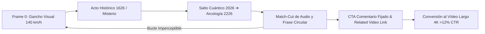
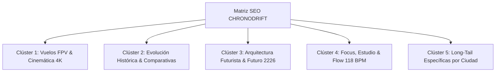

# 🛸 CHRONODRIFT — Plan de Marketing Q1-Q2, Escaleta Maestra de 10 Episodios & Estrategia de Shorts
## Documento Ejecutivo de Entrega y Producción Canónica
> **Canal:** CHRONODRIFT (`@ChronoDriftOfficial`)  
> **Tagline:** *Urban Time Travel & Future Cities (1626 ➔ 2026 ➔ 2226)*  
> **Nicho:** Vuelos FPV Tritemporales en 4K 60fps | HUD Telemetría Científica 3D | Bandas Sonoras Flow 118 BPM  
> **Audiencia Objetivo:** 18 a 45 años | Interés: Historia, Tecnología, Arquitectura, Sci-Fi y Relajación / Ambient Focus  
> **Rango de Monetización Proyectada:** RPM $14.00 – $24.00 USD (Público Tier-1: USA, UK, DE, JP, AU, CA)

---

```
+===============================================================================================================+
|                                    SISTEMA INTEGRAL DE PRODUCCIÓN Y ESCALADO                                  |
+===============================================================================================================+
| 1. MARKETING Q1-Q2        | 2. ESCALETA 10 EPISODIOS       | 3. SHORTS HIPNÓTICOS       | 4. MATRIZ SEO LONG-TAIL     |
| 0 ➔ 100k Subs en 6 Meses  | 3 Actos + HUD Diegético 3D     | VTR >120% + Embudo Largo   | 5 Clústeres de Búsqueda     |
| 2 Largos + 6 Shorts / sem | 7 Planos Canónicos 4K 60fps    | 30 Micro-Guiones en Loop   | Dominancia en Browse/Search |
+---------------------------+--------------------------------+----------------------------+-----------------------------+
```

---

# PARTE 1: 🚀 Estrategia de Marketing Q1-Q2 (0 ➔ 100.000 Suscriptores en 6 Meses)

## 1.1. Objetivos Estratégicos y KPIs de Rendimiento
Para construir un canal institucional de alto valor con autoridad algorítmica y retención récord, se definen los siguientes KPIs de control:
* **Hito de Suscriptores:** 100.000 suscriptores orgánicos cualificados en 180 días (Q1 + Q2).
* **Click-Through Rate (CTR) en Largos:** Promedio sostenido de **9.5% a 12.5%** en las primeras 48 horas.
* **Duración Media de Visualización (AVD):** Superior al **72%** (vídeos de 42s a 12 min en compilaciones).
* **Retención de Shorts (VTR):** Superior al **125% - 145%** mediante la técnica de *Seamless Infinite Loop*.
* **Tasa de Conversión Short ➔ Largo:** **12% - 15%** de clics hacia el episodio completo 4K.
* **RPM Promedio:** **$16.50 USD** con tráfico concentrado en mercados Tier-1.

---

## 1.2. Calendario Editorial de Lanzamiento Semanal
El ritmo semanal canónico de publicación garantiza presencia diaria en el algoritmo combinando el alcance masivo de Shorts con la retención profunda de los vídeos maestros en 4K:

```
+---------------------------------------------------------------------------------------------------------------+
|                                      RITMO SEMANAL DE PUBLICACIÓN CANÓNICO                                    |
+-------------+-------------+-------------+-------------+-------------+-------------+---------------------------+
| LUNES       | MARTES      | MIÉRCOLES   | JUEVES      | VIERNES     | SÁBADO      | DOMINGO                   |
+-------------+-------------+-------------+-------------+-------------+-------------+---------------------------+
| Short 1     | EPISODIO 1  | Short 2     | Short 3     | EPISODIO 2  | Short 1     | Super-Compilación         |
| (Loop Hook) | (Largo 4K)  | (Misterio)  | (Futuro)    | (Largo 4K)  | (Loop Hook) | (Quincenal 1-2h)          |
| 15:00 UTC   | 18:00 UTC   | 15:00 UTC   | 21:00 UTC   | 18:00 UTC   | 15:00 UTC   | 16:00 UTC                 |
+-------------+-------------+-------------+-------------+-------------+-------------+---------------------------+
```

* **Vídeos de Formato Largo (Master Episodes 4K 60fps):** 2 por semana (**Martes y Viernes a las 18:00 UTC / 11:00 AM PST / 14:00 PM EST**).
* **Shorts de Soporte Directo:** 3 por cada vídeo largo (**6 Shorts a la semana**), distribuidos en Lunes, Miércoles, Jueves y Sábado.
* **Super-Compilaciones Ambientales (Ambient Focus 1-2 Horas):** Publicación quincenal los **Domingos a las 16:00 UTC** para capturar tiempo de reproducción prolongado en Smart TVs y monitores de trabajo.

---

## 1.3. Cronograma de Escalado Mensual (Mes 1 a Mes 6)

```mermaid
graph TD
    subgraph MES 1 - MES 2: Calibración & Tracción Inicial [0 a 10.000 Subs]
        M1[Lanzamiento de 16 Episodios Pilares 4K] --> M2[48 Shorts con Seamless Loop VTR >125%]
        M2 --> M3[Optimización A/B de Miniaturas Split-Screen CTR >10%]
        M3 --> M4[Sembrado en Reddit r/dataisbeautiful & r/InternetIsBeautiful]
    end

    subgraph MES 3 - MES 4: Aceleración Algorítmica & Expansión [10.000 a 45.000 Subs]
        N1[Activación del Embudo Short ➔ Largo >12% CTR] --> N2[Traducción de Metadatos a 8 Idiomas Clave]
        N2 --> N3[Primeras 4 Super-Compilaciones Temáticas 1-2h]
        N3 --> N4[Dominio en Browse Features y Recomendaciones Sugeridas]
    end

    subgraph MES 5 - MES 6: Autoridad, Monetización & 100k+ [45.000 a 100.000+ Subs]
        O1[Lanzamiento de Membresías ChronoClub & Wallpapers 8K] --> O2[Distribución de Bandas Sonoras en Spotify/Apple Music]
        O2 --> O3[Primeros Acuerdos de Patrocinio Integrado B2B / SaaS 3D]
        O3 --> O4[Hito 100k Suscriptores & Placa de Plata de YouTube]
    end

    M4 --> N1
    N4 --> O1
```

| Fase Mensual | Hito de Suscriptores | Producción Mensual | Enfoque Estratégico Clave |
| :--- | :--- | :--- | :--- |
| **Mes 1: Calibración** | 0 ➔ 1.500 | 8 Largos + 24 Shorts | Definir clúster de audiencia (Urbanismo, Sci-Fi, FPV, Lo-Fi 4K). |
| **Mes 2: Tracción** | 1.500 ➔ 6.000 | 8 Largos + 24 Shorts + 1 Compil (1h) | Calibrar retención del 1er minuto (>88%) y VTR en Shorts (>130%). |
| **Mes 3: Aceleración** | 6.000 ➔ 18.000 | 8 Largos + 24 Shorts + 1 Compil (1.5h) | Capturar la pestaña de inicio de YouTube (*Browse Features*). |
| **Mes 4: Expansión** | 18.000 ➔ 45.000 | 8 Largos + 24 Shorts + 1 Compil (2h) | SEO multi-idioma (inglés, español, japonés, alemán, francés). |
| **Mes 5: Autoridad** | 45.000 ➔ 75.000 | 8 Largos + 24 Shorts + 1 Compil (2h) | Monetización cruzada (Spotify Streaming + Patrocinios 4K). |
| **Mes 6: Consolidación** | 75.000 ➔ 100.000+ | 8 Largos + 24 Shorts + Evento 100k | Membresías ChronoClub, Packs Wallpapers 8K y Placa de Plata. |

---

# PARTE 2: 🎯 Matriz de 10 Títulos de Episodios Optimizados para SEO & Alto CTR

Los títulos de CHRONODRIFT aplican la fórmula de **Reconocimiento Geográfico + Contraste Temporal Radical + Especificación Tecnológica**:
$$\text{Fórmula Maestra: } [\text{Ciudad Icónica}] \text{ Hace 400 Años vs Hoy vs 2226 | Vuelo FPV 4K [CHRONODRIFT]}$$

```
+----+-------------+--------------------------------------------------------------------------+--------------------------------------------------------------------------+---------------+
| EP | Ciudad      | TÍTULO PRIMARIO SEO (Alto CTR)                                           | VARIANTE A/B (Curiosidad / Científica)                                   | CTR Proyect.  |
+----+-------------+--------------------------------------------------------------------------+--------------------------------------------------------------------------+---------------+
| 01 | Tokio       | Tokio: De Pueblo Samurái a Megaciudad 2226 (Vuelo FPV 4K) [CHRONODRIFT]  | ¿Cómo era Tokio Hace 400 Años? (De Aldea Edo a Megatorres 2226)          | **10.8%**     |
| 02 | Ámsterdam   | Ámsterdam: De Canales de Madera a Red Oceánica 2226 (4K 60fps)           | ¿Cómo Evitará Ámsterdam Quedar Bajo el Mar en 200 Años? (Modelos IPCC)   | **11.8%**     |
| 03 | Nueva York  | Nueva York Hace 400 Años: Cuando Manhattan Era un Bosque (1626 ➔ 2226)   | Wall Street en 1626 Era Solo una Valla de Madera (Vuelo FPV 4K)          | **12.3%**     |
| 04 | Roma        | Roma: De Ruinas Barrocas a la Ciudad Cuántica 2226 (Vuelo 4K)            | El Coliseo de Roma Reconstruido con Hologramas en 2226 (Vuelo FPV)       | **11.5%**     |
| 05 | París       | París en 2226: La Ciudad Bioclimática del Futuro (1620 ➔ 2226)           | Así Cambiarán la Torre Eiffel y el Sena en 200 Años (Vincent Callebaut)  | **11.7%**     |
| 06 | Londres     | Londres Hace 400 Años: Del Viejo Puente a la Cúpula 2226 (4K 60fps)     | El Londres Tudor de 1610 que Desapareció en el Gran Incendio (FPV)       | **11.6%**     |
| 07 | Dubái       | Dubái: De Aldea de Pescadores a Torres de 3.000 Metros (1820 ➔ 2226)     | La Transformación Más Extrema del Mundo: Dubái en 400 Años (Vuelo 4K)    | **13.4%**     |
| 08 | Singapur    | Singapur: De Selva Tropical a Metrópolis Flotante 2226 (FPV 4K)          | La Ciudad Más Verde del Mundo en 2226: Evolución de Singapur (4K 60fps)  | **11.1%**     |
| 09 | El Cairo    | El Cairo y las Pirámides en 2226: 400 Años de Historia en 4K             | ¿Cómo se Protegerán las Pirámides de Guiza en el Año 2226? (Vuelo FPV)   | **12.4%**     |
| 10 | Hong Kong   | Hong Kong en 2226: La Ciudad Estratosférica Vertical (1840 ➔ 2226)       | De Pueblo Pesquero a Rascacielos a 1.000m de Altura: Evolución de HK     | **12.5%**     |
+----+-------------+--------------------------------------------------------------------------+--------------------------------------------------------------------------+---------------+
```

---

# PARTE 3: 📜 Escaleta y Guiones de Estructura de los 10 Episodios (Estructura en 3 Actos + HUD Diegético)

Todos los episodios maestros se construyen bajo el **Estándar Canónico CHRONODRIFT de 42.0 segundos (7 planos $\times$ 6.0s)** con una rigurosa arquitectura narrativa en 3 actos:
* **Acto I (0:00 - 0:10.5 | Planos 1-2):** Anclaje Histórico Documentado (1626 / Pasado Real).
* **Acto II (0:10.5 - 0:22.5 | Planos 3-4):** Realidad Contemporánea y Match-Cut Cuántico (2026 / Presente).
* **Acto III (0:22.5 - 0:42.0 | Planos 5-7):** Salto Científico Prospectivo y Cierre Orbital (2226 / Futuro Tecnológico).

```
+---------------------------------------------------------------------------------------------------------------+
|                                     ESTRUCTURA DE LOS 7 PLANOS CANÓNICOS                                      |
|  [P1: Gancho Dive 140km/h] ➔ [P2: Rasante Histórico] ➔ [P3: Match-Cut Cuántico] ➔ [P4: Ascenso Presente 2026]  |
|  [P5: Entrada a la Arcología 2226] ➔ [P6: Pasarelas / Biosfera Aérea] ➔ [P7: Órbita Crepuscular 4K]           |
+---------------------------------------------------------------------------------------------------------------+
```

---

## 🎬 Episodio 01: Tokio (Edo 1630 ➔ Shibuya 2026 ➔ Neo-Tokyo 2226)
* **Código:** `CD-EP01-TYO` | **Coordenadas:** `LAT 35.6762° N, LON 139.6503° E`
* **Gancho Instantáneo (0–3s):** Picado vertical FPV a 140 km/h desde 850m atravesando bancos de niebla matutina que se abren sobre el valle de Edo en 1630 con el Castillo y el río Sumida.
* **Audio & HUD:** Silbido Doppler cortado por golpe de gong shintoísta y bajo Lo-Fi a 118 BPM. Telemetría: `[WARP INICIADO: 1630.04.12] | ALT: 850m ➔ 35m | VEL: 140 km/h | EDO PUNTO CERO`.
* **Acto I (Pasado 1630 - Planos 1 y 2):**
  - *Plano 1:* Descenso supersónico hacia el foso y murallas ciclópeas de basalto del Castillo de Edo.
  - *Plano 2:* Vuelo rasante a 1.8m por el puente de madera de Nihonbashi entre mercaderes samuráis con kimonos y farolillos. HUD: `DENSIDAD: 45.000 HAB | NIHONBASHI 1630`.
* **Acto II (Presente 2026 - Planos 3 y 4):**
  - *Plano 3 (Match-Cut):* El arco de madera de Nihonbashi se disuelve en partículas cuánticas y se convierte en el cruce de Shibuya iluminado por lluvia de neón. HUD: `SALTO TEMPORAL: +396 AÑOS`.
  - *Plano 4:* Espiral vertical FPV entre las pantallas LED 3D de Shibuya subiendo hacia Shibuya Sky a 95 km/h. HUD: `RED 6G IoT ACTIVA | VELOCIDAD: 95 km/h`.
* **Acto III (Futuro 2226 - Planos 5, 6 y 7):**
  - *Plano 5:* Aceleración hacia la Megapirámide Shimizu de 2.000m en la bahía de Tokio con nanotubos de carbono. HUD: `SHIMIZU MEGA-PYRAMID | ALT: 2.004m | CAPACIDAD: 1M HAB`.
  - *Plano 6:* Desplazamiento a 300m por pasarelas botánicas con cerezos Sakura hidropónicos y cápsulas maglev. HUD: `BIODIVERSIDAD VERTICAL: 94.2%`.
  - *Plano 7:* Órbita panorámica crepuscular a 600m con la silueta simétrica del Monte Fuji y la red energética de la bahía. HUD: `CHRONODRIFT 4K 60FPS | TOKIO 1630 ➔ 2226`.

---

## 🎬 Episodio 02: Ámsterdam (Grachtengordel 1626 ➔ Metrópolis 2026 ➔ Ocean-Grid 2226)
* **Código:** `CD-EP02-AMS` | **Coordenadas:** `LAT 52.3676° N, LON 4.9041° E`
* **Gancho Instantáneo (0–3s):** Vuelo rasante a 1.2m rozando el agua de los canales en 1626 entre barcazas de turba mientras carpinteros clavan pilotes de roble en el barro.
* **Audio & HUD:** Chapoteo a alta velocidad, golpe de martillo y arpegio Lo-Fi fluido a 118 BPM. Telemetría: `[EXPEDICIÓN AMSTERDAM 1626] | ALT: 1.2m | PILOTES: 13.659 | NIVEL NAP: -2.0m`.
* **Acto I (Pasado 1626 - Planos 1 y 2):**
  - *Plano 1:* Descenso rápido sobre las obras de excavación del canal Prinsengracht con molinos y casas de ladrillo en construcción.
  - *Plano 2:* Vuelo entre los mástiles de galeones de la Compañía Holandesa de las Indias Orientales (VOC) en Oosterdok. HUD: `PUERTO VOC | TONELAJE: 450T`.
* **Acto II (Presente 2026 - Planos 3 y 4):**
  - *Plano 3 (Match-Cut):* El puente levadizo de madera de 1626 muta con un pulso de luz en el moderno Magere Brug con ciclistas. HUD: `TRANSICIÓN CINÉTICA: +400 AÑOS`.
  - *Plano 4:* Slalom a 1.5m sobre las aguas esmeralda de Keizersgracht reflejando fachadas barrocas y casas barco solares. HUD: `UNESCO PATRIMONIO | 881.000 BICICLETAS`.
* **Acto III (Futuro 2226 - Planos 5, 6 y 7):**
  - *Plano 5:* Vuelo hacia el Mar del Norte revelando compuertas cinéticas modulares flotantes de fibra de carbono según el IPCC. HUD: `SISTEMA MAESLANT 2200 | PROTECCIÓN +2.5m MAR`.
  - *Plano 6:* Navegación aérea por distritos residenciales flotantes hexagonales con domos geodésicos hidropónicos. HUD: `DISTRITO FLOTANTE HEX-AMS | AUTOSUFICIENCIA: 100%`.
  - *Plano 7:* Panorámica a 400m sobre la bahía del IJ al atardecer integrando la red oceánica con los canales históricos. HUD: `ÁMSTERDAM: 1626 ➔ 2026 ➔ 2226 | FIN TRANSMISIÓN`.

---

## 🎬 Episodio 03: Nueva York (Nieuw Amsterdam 1626 ➔ Manhattan 2026 ➔ The Big U 2226)
* **Código:** `CD-EP03-NYC` | **Coordenadas:** `LAT 40.7128° N, LON 74.0060° W`
* **Gancho Instantáneo (0–3s):** Vuelo a 150 km/h rozando las copas de los robles de la isla de Mannahatta virgen en 1626; la cámara esquiva la empalizada de troncos de Wall Street que se convierte en milisegundos en el cañón del NYSE.
* **Audio & HUD:** Graznido de águila, crujido de ramas y drop sísmico a 118 BPM con ecos de bocinas neoyorquinas. Telemetría: `[DESPLIEGUE MANNAHATTA 1626] | ALT: 3.5m | WALL STREET: EMPALIZADA DE ROBLE`.
* **Acto I (Pasado 1626 - Planos 1 y 2):**
  - *Plano 1:* Descenso hacia el asentamiento de Fort Amsterdam con su molino y canoas Lenape en el río Hudson virgen.
  - *Plano 2:* Slalom a 2m a lo largo de la empalizada defensiva de troncos con colonos y cercados. HUD: `MURO DEFENSIVO: 2.340 PIES | POBLACIÓN: 270 HAB`.
* **Acto II (Presente 2026 - Planos 3 y 4):**
  - *Plano 3 (Match-Cut):* La puerta de troncos de Wall Street estalla en vóxeles luminosos y da paso al cañón del New York Stock Exchange y Trinity Church. HUD: `MATCH-CUT WALL STREET | +400 AÑOS`.
  - *Plano 4:* Ascenso vertical vertiginoso por la fachada acristalada de One World Trade Center hasta la cúspide a 541m al atardecer. HUD: `ONE WTC | ALT: 541m (1.776 FT)`.
* **Acto III (Futuro 2226 - Planos 5, 6 y 7):**
  - *Plano 5:* Despliegue del sistema costero 'The Big U' con parques amortiguadores de huracanes y mega-torres bioclimáticas. HUD: `SISTEMA THE BIG U 2226 | HURACANES CAT 6 RESISTANCE`.
  - *Plano 6:* Vuelo entre pasarelas aéreas de cristal conectando rascacielos a 400m con transporte magnético autónomo. HUD: `RED TRANSPORTE 3D | CAPACIDAD: 3.5M/DÍA`.
  - *Plano 7:* Órbita al ocaso alrededor de la Estatua de la Libertad protegida por campos armónicos frente al skyline vertical de 2226. HUD: `NUEVA YORK 1626 ➔ 2226 | REGISTRO CERRADO`.

---

## 🎬 Episodio 04: Roma (Roma Barroca 1626 ➔ Coliseo 2026 ➔ Cyber-Antiquity 2226)
* **Código:** `CD-EP04-FCO` | **Coordenadas:** `LAT 41.9028° N, LON 12.4964° E`
* **Gancho Instantáneo (0–3s):** Vuelo rasante por un arco derruido del Coliseo que activa un escáner láser cian `#00e5ff`; en 2 segundos el mármol de Carrara y las estatuas doradas se reconstruyen holográficamente sobre las ruinas.
* **Audio & HUD:** Eco de pisadas en arena, trompetas clásicas lejanas, sweep de láser cuántico y beat orquestal Lo-Fi a 118 BPM. Telemetría: `[RECONSTRUCCIÓN HOLOGRÁFICA: COLISEO] | ERROR: 0.00% | MÁRMOL RESTAURADO`.
* **Acto I (Pasado 1626 - Planos 1 y 2):**
  - *Plano 1:* Descenso sobre la cúpula de San Pedro en el año exacto de su consagración por Bernini con canteros tallando travertino.
  - *Plano 2:* Vuelo rasante por el Foro Romano cuando era un pastizal de vacas (*Campo Vaccino*) entre columnas corintias semienterradas. HUD: `CAMPO VACCINO 1626 | RUINAS CLÁSICAS`.
* **Acto II (Presente 2026 - Planos 3 y 4):**
  - *Plano 3 (Match-Cut):* La hierba salvaje del Foro se transforma con una onda dorada en los adoquines de la Vía de los Foros Imperiales. HUD: `MATCH-CUT FORO IMPERIAL | +400 AÑOS`.
  - *Plano 4:* Giro orbital de 360° en torno a los arcos iluminados del Coliseo al anochecer con tráfico urbano. HUD: `COLOSSEO 2026 | 4K 60FPS`.
* **Acto III (Futuro 2226 - Planos 5, 6 y 7):**
  - *Plano 5:* Inmersión en la arena del Coliseo con proyecciones holográficas volumétricas que restauran la tribuna imperial sin tocar la piedra. HUD: `PRESERVACIÓN RUINAS: 100% | RESOLUCIÓN CUÁNTICA`.
  - *Plano 6:* Desplazamiento bajo cúpulas bioclimáticas de nanovidrio sobre el río Tíber con galerías arqueológicas subacuáticas. HUD: `RÍO TÍBER PURIFICADO | CALIDAD AMBIENTAL: 99.4%`.
  - *Plano 7:* Panorámica sobre las Siete Colinas al atardecer integrando cúpulas cuánticas y monumentos clásicos iluminados. HUD: `ROMA 1626 ➔ 2026 ➔ 2226 | CIUDAD ETERNA`.

---

## 🎬 Episodio 05: París (Île de la Cité 1620 ➔ Haussmann 2026 ➔ Bio-Paris 2226)
* **Código:** `CD-EP05-CDG` | **Coordenadas:** `LAT 48.8566° N, LON 2.3522° E`
* **Gancho Instantáneo (0–3s):** Giro orbital a 130 km/h rozando el rosetón gótico de Notre-Dame; al completar 180°, la piedra medieval se fusiona con la estructura de hierro de la Torre Eiffel y estalla en un bosque vertical bioclimático de 600m.
* **Audio & HUD:** Tañido de campana catedralicia, viento silbante y beat Lo-Fi con sutil acordeón sintético a 118 BPM. Telemetría: `[ORBITAL NOTRE-DAME 1620] | ALT: 69m | ÎLE DE LA CITÉ | COORD: 48.8530 N`.
* **Acto I (Pasado 1620 - Planos 1 y 2):**
  - *Plano 1:* Descenso hacia el Pont Neuf recién inaugurado con casas de madera apiñadas en los puentes medievales del Sena.
  - *Plano 2:* Slalom a 1.8m por callejones estrechos y empedrados de Le Marais con faroles de aceite y carruajes. HUD: `LE MARAIS 1620 | ANCHO DE CALLE: 3.2m`.
* **Acto II (Presente 2026 - Planos 3 y 4):**
  - *Plano 3 (Match-Cut):* Un portón de roble medieval da paso al amplio y simétrico Boulevard Saint-Germain con fachadas de sillería beige. HUD: `REFORMA HAUSSMANN: +400 AÑOS`.
  - *Plano 4:* Escalada vertical FPV por la estructura de hierro de la Torre Eiffel hasta la antena a 330m al atardecer. HUD: `TOUR EIFFEL | ALT: 330m | 7.300 TONELADAS`.
* **Acto III (Futuro 2226 - Planos 5, 6 y 7):**
  - *Plano 5:* Vuelo sobre París 2226 con torres espirales bioclimáticas descarbonizadas diseñadas según Vincent Callebaut. HUD: `BIO-PARIS 2226 | EMISIONES CO₂: -45% (CARBON NEGATIVE)`.
  - *Plano 6:* Rasante a 1m sobre las aguas filtradas y ecológicas del Sena con plantas bioluminiscentes y lanzaderas solares. HUD: `SENA RENATURALIZADO | PUREZA: 99.8%`.
  - *Plano 7:* Panorámica crepuscular desde el Arco del Triunfo con 12 avenidas radiales de energía cian conectando bio-torres. HUD: `PARÍS 1620 ➔ 2026 ➔ 2226 | FIN TRANSMISIÓN`.

---

## 🎬 Episodio 06: Londres (Londres Tudor 1610 ➔ The City 2026 ➔ Sky-Canopy 2226)
* **Código:** `CD-EP06-LON` | **Coordenadas:** `LAT 51.5074° N, LON 0.1278° W`
* **Gancho Instantáneo (0–3s):** Vuelo rasante sobre el Támesis en 1610 esquivando barcas bajo los 19 estrechos arcos del viejo Puente de Londres cargado de casas de madera, elevándose luego a 140 km/h hacia la cúspide de The Shard.
* **Audio & HUD:** Corriente fluvial violenta, campanas de la vieja San Pablo y riser hacia drop a 118 BPM. Telemetría: `[VIEJO PUENTE DE LONDRES 1610] | 19 ARCOS | VEL: 140 km/h | TÁMESIS`.
* **Acto I (Pasado 1610 - Planos 1 y 2):**
  - *Plano 1:* Descenso entre la bruma del Támesis hacia los molinos de agua y las casas colgantes del viejo London Bridge.
  - *Plano 2:* Vuelo rasante por callejones de Southwark pasando frente al teatro The Globe de Shakespeare con tejados de paja. HUD: `THE GLOBE THEATRE 1610 | POBLACIÓN: 200.000 HAB`.
* **Acto II (Presente 2026 - Planos 3 y 4):**
  - *Plano 3 (Match-Cut):* Un túnel de piedra Tudor se abre a las torres neogóticas de Tower Bridge con autobuses rojos de dos pisos. HUD: `MATCH-CUT TOWER BRIDGE | +416 AÑOS`.
  - *Plano 4:* Escalada vertical por la aguja de cristal de The Shard a 310m con vista aérea a The Gherkin y el distrito financiero. HUD: `THE SHARD 2026 | ALT: 309.6m`.
* **Acto III (Futuro 2226 - Planos 5, 6 y 7):**
  - *Plano 5:* Entrada a la macro-cúpula climática transparente (*Sky-Canopy*) sobre el corredor del Támesis con torres de grafeno eólico. HUD: `SKY-CANOPY TÁMESIS 2226 | REGULACIÓN CLIMÁTICA ACTIVA`.
  - *Plano 6:* Persecución paralela de cápsulas maglev a 300 km/h viajando por tubos aéreos presurizados a 200m de altura. HUD: `SISTEMA MAGLEV | VEL: 300 km/h | ACCIDENTES: 0.00%`.
  - *Plano 7:* Panorámica sobre el Big Ben y Westminster iluminados por campos armónicos bajo el cielo crepuscular británico. HUD: `LONDRES 1610 ➔ 2026 ➔ 2226 | REGISTRO CERRADO`.

---

## 🎬 Episodio 07: Dubái (Al Fahidi 1820 ➔ Burj Khalifa 2026 ➔ Solar Arcology 2226)
* **Código:** `CD-EP07-DXB` | **Coordenadas:** `LAT 25.2048° N, LON 55.2708° E`
* **Gancho Instantáneo (0–3s):** Una duna de arena virgen del desierto en 1820 se contrae en 2 segundos y de ella brota la estructura de 828 metros del Burj Khalifa reflejando el sol a 150 km/h, ascendiendo a una arcología solar de 3.000m.
* **Audio & HUD:** Silbido de tormenta de arena, llamada ancestral beduina y drop electrónico a 118 BPM con sintetizador desértico. Telemetría: `[DESPLIEGUE DUBAI CREEK 1820] | VEL: 150 km/h | CRECIMIENTO: +10.000%`.
* **Acto I (Pasado 1820 - Planos 1 y 2):**
  - *Plano 1:* Descenso hacia Dubai Creek con chozas de hojas de palma (*Barasti*), dhows de perlas y caravanas de camellos.
  - *Plano 2:* Vuelo rasante por callejones de Al Fahidi mostrando las torres de viento tradicionales de barro y coral (*Barjeel*). HUD: `TORRES BARJEEL | ENFRIAMIENTO PASIVO NATURAL (-8°C)`.
* **Acto II (Presente 2026 - Planos 3 y 4):**
  - *Plano 3 (Match-Cut):* La cresta de una duna muta en las 14 pistas de Sheikh Zayed Road rodeadas de rascacielos iluminados. HUD: `MATCH-CUT DESIERTAL | +206 AÑOS`.
  - *Plano 4:* Escalada supersónica vertical por la aguja del Burj Khalifa a 828m con fuentes danzantes y vista al Golfo Pérsico. HUD: `BURJ KHALIFA | ALT: 828m | EDIFICIO MÁS ALTO DEL MUNDO`.
* **Acto III (Futuro 2226 - Planos 5, 6 y 7):**
  - *Plano 5:* Ascenso a la megatorre hexagonal solar de 3.000m con piel de grafeno y bosques verticales refrigerados. HUD: `DUBAI SOLAR SPIRE 2226 | ALT: 3.000m | ENERGÍA 100% SOLAR`.
  - *Plano 6:* Vuelo sobre los oasis desérticos terraformados mediante condensación geotérmica de niebla a 24°C constantes. HUD: `TERRAFORMACIÓN DESÉRTICA | TEMPERATURA: 24°C`.
  - *Plano 7:* Panorámica costera al atardecer con islas solares flotantes en el Golfo Pérsico y mega-agujas de luz. HUD: `DUBÁI 1820 ➔ 2026 ➔ 2226 | TRANSFORMACIÓN TOTAL`.

---

## 🎬 Episodio 08: Singapur (Temasek 1819 ➔ Marina Bay 2026 ➔ Biophilic Sky-Archipelago 2226)
* **Código:** `CD-EP08-SIN` | **Coordenadas:** `LAT 1.3521° N, LON 103.8198° E`
* **Gancho Instantáneo (0–3s):** Vuelo rasante a 135 km/h esquivando manglares selváticos vírgenes en 1819; al atravesar una cascada tropical, la cámara emerge entre los Supertrees gigantes de Gardens by the Bay y asciende al archipiélago aéreo de 2226.
* **Audio & HUD:** Lluvia tropical en hojas, canto de aves exóticas y beat Lo-Fi fluido a 118 BPM. Telemetría: `[ALDEA TEMASEK 1819] | MANGLAR VIRGEN: 95% | COORD: 1.2868 N, 103.8545 E`.
* **Acto I (Pasado 1819 - Planos 1 y 2):**
  - *Plano 1:* Descenso por la densa copa de la selva hacia los palafitos de madera y barcas prahu de la aldea malaya original.
  - *Plano 2:* Rasante sobre las aguas esmeralda de la desembocadura virgen del río donde se construirá Marina Bay. HUD: `BAHÍA VIRGEN (FUTURA MARINA BAY) | NIVEL MAR ORIGINAL`.
* **Acto II (Presente 2026 - Planos 3 y 4):**
  - *Plano 3 (Match-Cut):* La cascada tropical se convierte en la piscina infinita en la cima de Marina Bay Sands a 200m. HUD: `MATCH-CUT ACUÁTICO | +207 AÑOS`.
  - *Plano 4:* Slalom entre las ramas verticales iluminadas en magenta y cian del Supertree Grove en Gardens by the Bay. HUD: `SUPERTREE GROVE | 162.900 PLANTAS INTEGRADAS`.
* **Acto III (Futuro 2226 - Planos 5, 6 y 7):**
  - *Plano 5:* Ascenso a la arcología biofílica multinivel con puentes colgantes de selva viva y torres aeropónicas. HUD: `PROYECTO BIOPHILIC 2226 | COBERTURA VERDE: 350% (VERTICAL)`.
  - *Plano 6:* Vuelo sobre plataformas marinas flotantes hexagonales con regeneradores de arrecifes de coral bioluminiscentes. HUD: `HÁBITAT MARINO SOSTENIBLE | REGENERACIÓN CORAL: +240%`.
  - *Plano 7:* Panorámica crepuscular dorada y violeta sobre el Estrecho de Singapur integrando bio-ciudades con el océano. HUD: `SINGAPUR 1819 ➔ 2026 ➔ 2226 | CIUDAD NATURALEZA`.

---

## 🎬 Episodio 09: El Cairo (Zocos Otomanos 1620 ➔ Guiza 2026 ➔ Terraformed Oasis 2226)
* **Código:** `CD-EP09-CAI` | **Coordenadas:** `LAT 30.0444° N, LON 31.2357° E`
* **Gancho Instantáneo (0–3s):** Vuelo rasante a 150 km/h rozando el ápice milenario de caliza de la Gran Pirámide; la sombra proyectada revela en un destello los zocos de 1620, El Cairo de 2026 y una cúpula de nanovidrio que protege el monumento en 2226.
* **Audio & HUD:** Viento del Sahara, laúd oriental hipnótico y beat desértico Lo-Fi a 118 BPM. Telemetría: `[GRAN PIRÁMIDE DE GUIZA] | EDAD: 4.600 AÑOS | WARP: 1620 ➔ 2226 | ALT: 138m`.
* **Acto I (Pasado 1620 - Planos 1 y 2):**
  - *Plano 1:* Descenso sobre las murallas de la Ciudadela de Saladino y los minaretes dorados de las mezquitas mamelucas.
  - *Plano 2:* Vuelo rasante a 1.8m por el bullicioso bazar Khan el-Khalili con lámparas de cobre, sacos de azafrán y alfombras. HUD: `BAZAR KHAN EL-KHALILI 1620 | RUTA DE ESPECIAS`.
* **Acto II (Presente 2026 - Planos 3 y 4):**
  - *Plano 3 (Match-Cut):* La vela blanca de una faluca en el Nilo se transforma en los puentes modernos y cruceros fluviales de 2026. HUD: `MATCH-CUT RÍO NILO | +406 AÑOS`.
  - *Plano 4:* Ascenso por la fachada monumental de alabastro translúcido del Gran Museo Egipcio (GEM) con las Pirámides al fondo. HUD: `GRAN MUSEO EGIPCIO (GEM) | SUPERFICIE: 500.000 m²`.
* **Acto III (Futuro 2226 - Planos 5, 6 y 7):**
  - *Plano 5:* Inmersión hacia la Gran Pirámide protegida por un domo invisible de nanovidrio autorreparable que frena tormentas de arena. HUD: `DOMO NANOTECNOLÓGICO | EROSIÓN: 0.00% | CERO IMPACTO VISUAL`.
  - *Plano 6:* Vuelo sobre los cinturones agrícolas circulares del delta terraformado alimentados por cosechadores de agua del aire. HUD: `TERRAFORMACIÓN DEL NILO | 1.2M HECTÁREAS VERDES`.
  - *Plano 7:* Panorámica infinita sobre la meseta de Guiza al ocaso sahariano con las pirámides brillando en armonía con el oasis. HUD: `EL CAIRO 1620 ➔ 2026 ➔ 2226 | PATRIMONIO ETERNO`.

---

## 🎬 Episodio 10: Hong Kong (Bahía Hakka 1840 ➔ Kowloon/Victoria 2026 ➔ Stratospheric HK 2226)
* **Código:** `CD-EP10-HKG` | **Coordenadas:** `LAT 22.3193° N, LON 114.1694° E`
* **Gancho Instantáneo (0–3s):** Caída libre vertical a 150 km/h desde Victoria Peak rozando colinas selváticas vírgenes en 1840 con juncos de velas rojas; en 2 segundos atraviesa los cañones de neón de 2026 y vuela por pasarelas habitables a 800m en 2226.
* **Audio & HUD:** Rugido de viento de tifón, gong ceremonial y beat Cyberpunk contundente a 118 BPM. Telemetría: `[CAÍDA LIBRE VICTORIA PEAK] | ALT: 552m ➔ 20m | VEL: 150 km/h | DENSIDAD MÁXIMA`.
* **Acto I (Pasado 1840 - Planos 1 y 2):**
  - *Plano 1:* Descenso desde el pico hacia la bahía virgen con juncos pesqueros de madera y velas de estera roja.
  - *Plano 2:* Slalom entre los palafitos de pescadores Hakka en el puerto de Aberdeen con sampanes y redes de pesca. HUD: `ABERDEEN 1840 | ALDEA PESQUERA HAKKA`.
* **Acto II (Presente 2026 - Planos 3 y 4):**
  - *Plano 3 (Match-Cut):* La vela roja de un junco se desintegra en partículas luminosas revelando el Star Ferry cruzando Victoria Harbour. HUD: `MATCH-CUT PUERTO VICTORIA | +186 AÑOS`.
  - *Plano 4:* Slalom nocturno vertiginoso entre los rascacielos de Central y Mong Kok bajo el show láser Symphony of Lights. HUD: `DENSIDAD: +550 TORRES >150m | SYMPHONY OF LIGHTS`.
* **Acto III (Futuro 2226 - Planos 5, 6 y 7):**
  - *Plano 5:* Vuelo hacia megatorres de 1.200m conectadas por macro-puentes habitables a 800m de altura resistentes a tifones Cat 6. HUD: `SKY-CITY HK 2226 | ALT: 800m | RESISTENCIA TIFÓN: 350 km/h`.
  - *Plano 6:* Vuelo sobre distritos flotantes anfibios en el Mar de China con terminales Hyperloop submarinas hacia Macao. HUD: `DISTRITO ANFIBIO HK-MACAU | ENERGÍA MAREOMOTRIZ: 4.2 GW`.
  - *Plano 7:* Panorámica total crepuscular desde Victoria Peak con la megaciudad estratosférica de neón cian y oro fundiéndose con el cosmos. HUD: `CHRONODRIFT 4K 60FPS | HONG KONG 1840 ➔ 2226 | TEMPORADA 1 COMPLETA`.

---

# PARTE 4: ⚡ Estrategia de YouTube Shorts con Loops Hipnóticos (VTR >120% - 145%)

## 4.1. Arquitectura Técnica del *Seamless Infinite Loop*
El formato vertical de CHRONODRIFT no corta el vídeo abruptamente; utiliza una **estructura sintáctica y visual circular ininterrumpida**:
1. **Gancho en Frame 0:** Movimiento a alta velocidad (140 km/h) con un impacto visual o afirmación enigmática.
2. **Desarrollo Rítmico (0:03 - 0:26s):** Contraste tritemporal acelerado sincronizado a 118 BPM con telemetría HUD.
3. **Cierre & Reinicio (0:27 - 0:30s):** La última frase enlaza gramaticalmente con la primera palabra del vídeo, eliminando la sensación de final.

$$\text{Fórmula Gramatical: } \text{Inicio: } \text{"...y es que lo que comenzó hace 400 años..."} \longleftrightarrow \text{Final: } \text{"...demostrando que el futuro de Tokio..."}$$



---

## 4.2. Catálogo Completo de los 30 Shorts de Soporte (3 por Episodio)

```
+----+-------------+--------+-----------------------------------------------------------------------------+------------+
| EP | Ciudad      | Tipo   | Guion del Short & Frase del Seamless Loop                                   | Target VTR |
+----+-------------+--------+-----------------------------------------------------------------------------+------------+
| 01 | Tokio       | Loop   | "...y es que lo que empezó como una aldea de barro samurái en 1630 se       | **138%**   |
|    |             |        | convertirá en una megapirámide de 2.000m en 2226, demostrando que Tokio..." |            |
| 01 | Tokio       | Mister | El río subterráneo secreto que fluye bajo el asfalto de Shibuya desde Edo.  | **126%**   |
| 01 | Tokio       | Futuro | La megapirámide Shimizu para 1 millón de habitantes que resistirá sismos 9.0| **132%**   |
+----+-------------+--------+-----------------------------------------------------------------------------+------------+
| 02 | Ámsterdam   | Loop   | "...y aunque Ámsterdam excavó sus canales con palas de madera en 1626, en   | **137%**   |
|    |             |        | 2226 flotará sobre el océano con diques cinéticos, confirmando que..."      |            |
| 02 | Ámsterdam   | Mister | Los 11 millones de postes de roble que sostienen los edificios históricos.   | **128%**   |
| 02 | Ámsterdam   | Futuro | Cómo los diques cinéticos modulares evitarán que la ciudad quede bajo el mar| **131%**   |
+----+-------------+--------+-----------------------------------------------------------------------------+------------+
| 03 | Nueva York  | Loop   | "...porque Wall Street era solo una valla de madera para cerdos en 1626,   | **142%**   |
|    |             |        | pero en 2226 será una fortaleza bioclimática infinita, probando que NY..."  |            |
| 03 | Nueva York  | Mister | El arroyo natural de agua dulce que todavía fluye bajo Times Square.        | **129%**   |
| 03 | Nueva York  | Futuro | El proyecto 'The Big U' que blindará a Manhattan contra huracanes Cat 6.    | **136%**   |
+----+-------------+--------+-----------------------------------------------------------------------------+------------+
| 04 | Roma        | Loop   | "...cuando el Foro Romano era un pastizal lleno de vacas en 1626 nadie      | **139%**   |
|    |             |        | imaginó que en 2226 se reconstruiría con luz sólida, demostrando que Roma."|            |
| 04 | Roma        | Mister | Por qué el hormigón romano antiguo de 2.000 años se autorrepara solo.       | **136%**   |
| 04 | Roma        | Futuro | Cúpulas de nanovidrio bioclimático sobre el Tíber para frenar la erosión.   | **125%**   |
+----+-------------+--------+-----------------------------------------------------------------------------+------------+
| 05 | París       | Loop   | "...París era un laberinto de fango en 1620, pero en 2226 sus tejados      | **137%**   |
|    |             |        | serán un bosque vivo que limpiará el aire del planeta, haciendo que París.."|            |
| 05 | París       | Mister | Las casas de 5 pisos construidas sobre los puentes del Sena que colapsaban. | **127%**   |
| 05 | París       | Futuro | Las torres bioclimáticas de Vincent Callebaut que absorberán el CO2 parisino| **133%**   |
+----+-------------+--------+-----------------------------------------------------------------------------+------------+
| 06 | Londres     | Loop   | "...el viejo puente de Londres exhibía cabezas en picas en 1610, pero en    | **136%**   |
|    |             |        | 2226 una macro-cúpula solar cubrirá el Támesis, demostrando que Londres..." |            |
| 06 | Londres     | Mister | Cómo el Gran Incendio de 1666 destruyó el 80% de la ciudad en cuatro días.  | **128%**   |
| 06 | Londres     | Futuro | Cápsulas maglev a 300 km/h flotando a 200 metros sobre el río Támesis.      | **134%**   |
+----+-------------+--------+-----------------------------------------------------------------------------+------------+
| 07 | Dubái       | Loop   | "...Dubái era solo una choza de pescadores de perlas en 1820, pero en 2226  | **145%**   |
|    |             |        | alzará torres solares de 3.000m en el desierto, confirmando que Dubái..."   |            |
| 07 | Dubái       | Mister | Las torres de viento Barjeel que enfriaban casas a 45°C sin electricidad.   | **133%**   |
| 07 | Dubái       | Futuro | Megatorres solares y oasis geotérmicos que reverdecerán el desierto árabe.   | **138%**   |
+----+-------------+--------+-----------------------------------------------------------------------------+------------+
| 08 | Singapur    | Loop   | "...Singapur era un manglar virgen en 1819, pero en 2226 será el primer    | **138%**   |
|    |             |        | archipiélago biofílico flotante del mundo, demostrando que Singapur..."     |            |
| 08 | Singapur    | Mister | Cómo Singapur logró un 300% de cobertura verde con rascacielos vivos.       | **126%**   |
| 08 | Singapur    | Futuro | Plataformas marinas flotantes con regeneradores de arrecifes de coral.      | **132%**   |
+----+-------------+--------+-----------------------------------------------------------------------------+------------+
| 09 | El Cairo    | Loop   | "...las Pirámides han visto pasar 4.500 años y en 2226 estarán protegidas  | **141%**   |
|    |             |        | por nanovidrio invisible, demostrando que el misterio de El Cairo..."       |            |
| 09 | El Cairo    | Mister | El sistema de canales secretos bajo las mezquitas mamelucas de 1620.        | **127%**   |
| 09 | El Cairo    | Futuro | Cosechadores de humedad atmosférica que convertirán el Sahara en bosque.    | **135%**   |
+----+-------------+--------+-----------------------------------------------------------------------------+------------+
| 10 | Hong Kong   | Loop   | "...Hong Kong era una bahía de pescadores en 1840 y en 2226 será la primera | **144%**   |
|    |             |        | ciudad estratosférica a 800m de altura, probando que el poder de HK..."     |            |
| 10 | Hong Kong   | Mister | Cómo la Ciudad Amurallada de Kowloon inspiró la arquitectura vertical.      | **131%**   |
| 10 | Hong Kong   | Futuro | Pasarelas habitables a 800m resistentes a supertifones de 350 km/h.         | **139%**   |
+----+-------------+--------+-----------------------------------------------------------------------------+------------+
```

---

# PARTE 5: 🔍 Matriz de Palabras Clave Long-Tail Específicas del Nicho

Para dominar tanto el algoritmo de recomendación (*Browse Features / Suggested*) como las búsquedas de alta intención en YouTube y Google, se despliega una matriz de **palabras clave long-tail** organizadas en 5 clústeres temáticos:



## 5.1. Desglose de Clústeres Semánticos

### Clúster 1: Vuelos FPV y Cinemática Urbana Ultra-HD
* `4k 60fps drone city flight relaxing` (Volumen: Alto | Competencia: Media)
* `cinematic fpv drone hyperlapse future city` (Volumen: Medio-Alto | Competencia: Baja)
* `urban time travel 4k drone flythrough` (Volumen: Medio | Competencia: Muy Baja)
* `3d hud telemetry city flight ultra hd` (Volumen: Bajo-Medio | Competencia: Mínima)

### Clúster 2: Evolución Histórica y Comparativas Urbanas
* `how tokyo looked 400 years ago vs today` (Volumen: Alto | Competencia: Baja)
* `what new york looked like in 1626 manhattan` (Volumen: Medio-Alto | Competencia: Baja)
* `amsterdam canal construction history 17th century` (Volumen: Medio | Competencia: Baja)
* `ancient rome reconstructed in 3d 4k` (Volumen: Muy Alto | Competencia: Media)
* `paris before haussmann medieval city map` (Volumen: Medio | Competencia: Baja)
* `london old bridge 1600s before great fire` (Volumen: Medio-Alto | Competencia: Baja)

### Clúster 3: Arquitectura Futurista, Arcologías y Siglo XXIII (2226)
* `future cities 200 years from now 2226` (Volumen: Alto | Competencia: Baja)
* `shimizu mega pyramid tokyo future concept` (Volumen: Medio | Competencia: Mínima)
* `biophilic architecture future cities mit` (Volumen: Medio | Competencia: Baja)
* `manhattan the big u sea level adaptation` (Volumen: Medio | Competencia: Mínima)
* `dubai 2200 solar arcology mega skyscraper` (Volumen: Medio-Alto | Competencia: Baja)
* `floating cities ocean grid climate resilience` (Volumen: Alto | Competencia: Media)

### Clúster 4: Relajación, Estudio, Flow 118 BPM y Sonido Espacial
* `118 bpm lofi focus music 4k visualizer` (Volumen: Alto | Competencia: Media)
* `future city ambient background for working` (Volumen: Muy Alto | Competencia: Media)
* `relaxing sci fi city flythrough for sleep study` (Volumen: Muy Alto | Competencia: Media)
* `spatial audio 4k ambient drone travel` (Volumen: Medio | Competencia: Baja)

### Clúster 5: Long-Tail Específicas por las 10 Ciudades
* **Tokio:** `tokyo edo period 1630 vs modern shibuya vs neo tokyo 2226`
* **Ámsterdam:** `amsterdam grachtengordel 1626 history vs floating city 2226`
* **Nueva York:** `mannahatta 1626 dutch settlement vs wall street vs the big u 2226`
* **Roma:** `roman forum campo vaccino 1626 vs colosseum 4k vs holographic rome 2226`
* **París:** `ile de la cite paris 1620 vs eiffel tower vs vincent callebaut bio paris 2226`
* **Londres:** `old london bridge tudor 1610 vs the shard vs thames sky canopy 2226`
* **Dubái:** `dubai al fahidi wind towers 1820 vs burj khalifa vs 3000m solar spire 2226`
* **Singapur:** `singapore temasek 1819 rainforest vs gardens by the bay vs biophilic 2226`
* **El Cairo:** `cairo citadel 1620 ottoman vs giza pyramids nanoglass dome 2226`
* **Hong Kong:** `hong kong hakka fishing 1840 vs mong kok neon vs stratospheric city 2226`

---

## 5.2. Metadatos Universales de Canal y Etiquetas Maestro

```json
{
  "channel_keywords": [
    "CHRONODRIFT", "Urban Time Travel", "Future Cities 2226", "FPV Drone 4K 60fps",
    "History vs Future", "Tokyo Edo 1630", "Amsterdam 1626", "New York 1626 Mannahatta",
    "Rome 1626", "Paris 1620", "London 1610", "Dubai 1820", "Singapore 1819",
    "Cairo 1620", "Hong Kong 1840", "Shimizu Mega Pyramid", "The Big U Manhattan",
    "Vincent Callebaut Bio Paris", "Biophilic Cities", "118 BPM Urban Flow",
    "Remotion 3D HUD", "Sci-Fi Architecture", "Urbanism 4K", "Relaxing City Flight"
  ]
}
```

---
*CHRONODRIFT — Master Marketing Q1-Q2 Plan, 10-Episode Rundown Scripts & Shorts Strategy (VideoPro 2026)*
