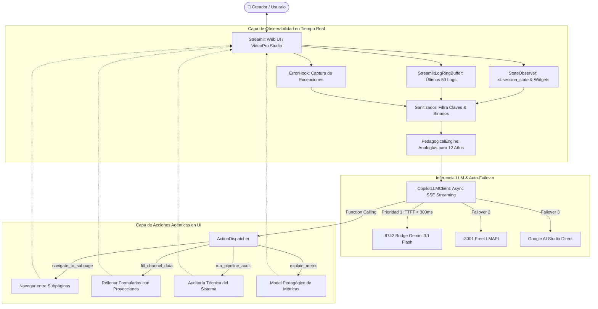

# 🏛️ Ontología del Sistema VideoPro (4 Niveles), Arquetipos de Workflow, Copilot Agéntico y Monetización

> **Pilar:** Arquitectura Integral de Software, Orquestación Multi-Cloud, WebUI & Economía de Canales  
> **Estado:** 🟢 ESPECIFICACIÓN TÉCNICA CANÓNICA (100% PRODUCCIÓN)  
> **Sincronización:** Firebase Firestore (`ayuda-emilio-83261` ➔ `videopro_system/architecture_ontology`)

---

## 1. La Ontología Jerárquica del Sistema (4 Niveles)

Para garantizar desacoplamiento total entre infraestructura física, código ejecutable, etapas de postproducción y modelos de negocio, el ecosistema **VideoPro Studio & Hermes** se organiza en **4 niveles estrictamente jerárquicos**:

```mermaid
graph TD
    subgraph Nivel_1 [1. APIs & Recursos Base - Infraestructura Física]
        A1[api_pexels_stock / api_wikimedia_commons]
        A2[local_antigravity_bridge_8742 / serverless_zerogpu_flux]
        A3[serverless_vibevoice_tts / local_vibevoice_onnx]
        A4[local_remotion_cli / cloud_remotion_lambda]
        A5[local_ffmpeg_engine / qgis_cartography_engine]
        A6[firebase_firestore / api_cloudflare_r2]
    end

    subgraph Nivel_2 [2. Capacidades Atómicas - Unidades Ejecutables]
        C1[cap_llm_story_director / cap_deepseek_reasoning_cot]
        C2[cap_qgis_vector_dash78 / cap_newspaper_roughen_parallax]
        C3[cap_blueprint_dem_elevation / cap_macro_horology_patent]
        C4[cap_stock_scraping_pexels_4k / cap_wikimedia_historical_archive]
        C5[cap_vox_paper_parallax_3d / cap_motion_remotion_react_hud]
        C6[cap_audio_mixing_foley_ducking / cap_foley_diegetic_soundscape]
        C7[cap_stagger_psicoacustico_motion / cap_kinetic_word_subtitles]
        C8[cap_contact_sheet_builder / cap_firebase_sync_engine]
    end

    subgraph Nivel_3 [3. Nodos de Producción - Cadena de Montaje]
        N1[Nodo 1: Investigación & Storyboard Studio]
        N2[Nodo 2: Audio-First, Locución & Foley Diegético]
        N3[Nodo 3: Generación de Activos Auténticos VOX 4K]
        N4[Nodo 4: Composición 3D Parallax & Video-as-Code]
        N5[Nodo 5: Subtítulos Cinematográficos & HUD]
        N6[Nodo 6: Masterización Acústica EBU R128]
        N7[Nodo 7: QA Contact Sheet & Cloud Sync]
    end

    subgraph Nivel_4 [4. Workflows & Canales de YouTube - Negocio]
        W1[workflow_vox_investigative_doc]
        W2[workflow_geopolitical_historical_maps]
        W3[workflow_madrid_curiosities_3min]
        W4[workflow_chronodrift_tritemporal]
        W5[workflow_pixar_3d_animation]
        W6[workflow_historical_scraping]
        W7[workflow_deep_explainer_essay]
        W8[workflow_viral_shorts_hook]
        W9[workflow_city_routes_beats]
        W10[workflow_fpv_urban_real_flow]
    end

    A1 & A2 & A3 & A4 & A5 & A6 --> C1 & C2 & C3 & C4 & C5 & C6 & C7 & C8
    C1 & C4 --> N1
    C6 --> N2
    C2 & C3 & C4 --> N3
    C5 & C7 --> N4
    C7 --> N5
    C6 --> N6
    C8 --> N7
    N1 & N2 & N3 & N4 & N5 & N6 & N7 --> W1 & W2 & W3 & W4 & W5 & W6 & W7 & W8 & W9 & W10
```



---

## 2. Detalle Exhaustivo de los 4 Niveles

### 📡 Nivel 1: Catálogo de APIs y Proveedores (`SYSTEM_APIS`)
Proveedores de cómputo, inferencia y almacenamiento multi-cloud:
* **Visual & Vídeo:**
  - `local_antigravity_bridge_8742`: NanoBanana Pro 2 vía proxy local puerto 8742 ($0).
  - `api_google_ai_imagen`: Inferencia directa en Imagen 3 vía Google AI Studio.
  - `browser_playwright_flow`: Automatización headless de Google Flow 3D Canvas.
  - `serverless_zerogpu_flux`: FLUX.3 en HuggingFace ZeroGPU ($0 pool distribuido).
  - `serverless_replicate_flux`: Inferencia comercial FLUX.3 Pro / Schnell en Replicate.
  - `comfyui_local_flux` / `comfyui_runpod_flux`: Grafo ComfyUI dedicado (Local VPS :8188 / RunPod GPU).
  - `api_ltx25_mmdit`: LTX-Video 2.5 MMDiT 22B (vídeo + lip-sync integrado).
  - `api_wan21_alibaba` / `api_minimax_h3` / `api_seedance`: Modelos de generación dinámica y cinemática.
  - `api_pexels_stock` / `api_pixabay_media` / `api_wikimedia_commons`: Adquisición de metraje 4K y archivos históricos.
* **Voz & Audio:**
  - `serverless_vibevoice_tts` / `local_vibevoice_onnx`: Síntesis neural VibeVoice 1.5B (Serverless Free / ONNX Local VPS $0).
  - `api_edge_tts_free`: Microsoft Edge Neural TTS ($0).
  - `api_elevenlabs_cloud` / `api_fish_audio` / `api_minimax_speech`: Clonación y voces expresivas de estudio.
* **Música:** `browser_playwright_flowmusic` (Google Flow Music Studio), `api_suno_ai` (v3/v4).
* **Directores LLM:** `local_antigravity_agent_orchestrator`, `api_google_gemini_llm` (Gemini 2.5/3.0 Pro), `api_openai_gpt` (GPT-4o/5.5), `api_deepseek` (R1 CoT), `api_cloudflare_workers_ai`.
* **Motores de Código & Render:** `local_remotion_cli`, `cloud_remotion_lambda` (AWS Lambda 60fps), `local_ffmpeg_engine` (DSP acelerado), `qgis_cartography_engine` (Mapas vectoriales 4K), `local_whisper_stt` (Word Timestamps), `local_hyperframes_engine` (WebGL/GLSL).
* **Cloud & BD:** `firebase_firestore` (`ayuda-emilio-83261`), `api_cloudflare_r2` (S3 API sin egress).

---

### ⚡ Nivel 2: Capacidades Atómicas (`SYSTEM_CAPABILITIES`)
Unidades ejecutables independientes que encapsulan lógica de negocio y llamadas a APIs:
* `cap_nanobanana_antigravity_bridge`: Generación 4K sin coste vía puerto 8742.
* `cap_flux3_serverless_free`: Generación distribuida en ZeroGPU.
* `cap_qgis_vector_dash78`: Mapas 4K transparentes con trazado de pluma `Dash=78` y `Trim Paths` síncrono.
* `cap_newspaper_roughen_parallax`: Periódicos de época 3D con `Roughen Edges` (Borde 3.3px, Nitidez 4.58, Complejidad 10), filtro Tint y rotulador flúor animado.
* `cap_blueprint_dem_elevation`: Planos de ingeniería con corte transversal, relieve DEM -14M y offset Z `+0.001` anti Z-fighting.
* `cap_macro_horology_patent`: Patentes históricas con engranajes cinemáticos y telemetría técnica.
* `cap_stagger_psicoacustico_motion`: Desfase de entrada de 3-5 frames (documento ➔ titular ➔ marcador) para retención >70%.
* `cap_vox_paper_parallax_3d`: Montaje en perspectiva 3D con textura de papel analógico (27% opacidad) y físicas spring.
* `cap_kinetic_word_subtitles`: Subtítulos cinematográficos dinámicos palabra por palabra sin cajas opacas invasivas.
* `cap_audio_mixing_foley_ducking`: Mezcla procedural con sidechain ducking (-18 dB / -22 dB) y master EBU R128 (-14 LUFS).
* `cap_contact_sheet_builder`: Generación de mosaico de contactos 4K para control de calidad antes del render.
* `cap_firebase_sync_engine`: Persistencia y sincronización automática en Firestore y Cloudflare R2.

---

### 🧱 Nivel 3: Los 7 Nodos Canónicos de Producción (`SYSTEM_NODES`)
1. **Nodo 1 (`node_01_investigacion_y_storyboard`):** Investigación factual (formato BBC), guion en 3 actos y desglose de 7 planos cinemáticos por escena clasificados por tipo de plano documental.
2. **Nodo 2 (`node_02_audio_first_y_foley`):** Montaje conducido por el audio master WAV, locución neural y foley físico sincronizado.
3. **Nodo 3 (`node_03_generacion_activos_vox`):** Ingesta y render de mapas QGIS Dash=78, prensa 3D Roughen, blueprints DEM y metraje 4K verificado (>5KB).
4. **Nodo 4 (`node_04_composicion_3d_parallax`):** Composición espacial 3D en Remotion/HyperFrames con físicas spring, offset Z `+0.001` y stagger de 3-5 frames.
5. **Nodo 5 (`node_05_subtitulos_y_hud`):** Subtítulos cinemáticos en píldora translúcida con resaltado activo y telemetría HUD.
6. **Nodo 6 (`node_06_masterizacion_ebu_r128`):** Compresión y masterización DSP multicapa con ducking a -18dB y normalización EBU R128 a -14 LUFS.
7. **Nodo 7 (`node_07_qa_contact_sheet_sync`):** QA Loop, Contact Sheet fotograma a fotograma y sincronización en Firestore y R2.

---

### 🎬 Nivel 4: Catálogo de 10 Workflows / Arquetipos de Producción (`SYSTEM_WORKFLOWS`)

```
+------------------------------------+-------------------------------------------+---------------+------------------------------------------+
| ID del Workflow / Arquetipo        | Canal / Nicho Objetivo                    | Formato / Res | Estilo Visual & Motores Clave            |
+------------------------------------+-------------------------------------------+---------------+------------------------------------------+
| 01. VOX_INVESTIGATIVE_DOC          | Periodismo de Investigación & Ensayos     | 16:9 4K 60fps | Vox Parallax 3D, QGIS Dash=78, Roughen   |
| 02. GEOPOLITICAL_HISTORICAL_MAPS   | Geopolítica, Conflictos y Fronteras       | 16:9 4K 60fps | DEM 3D QGIS, Rutas Satelitales, Glow     |
| 03. MADRID_CURIOSITIES_REAL_FLOW   | Documentales Urbanos & Secretos Reales    | 16:9 4K 60fps | Audio-First 177s, Glassmorphism, QGIS    |
| 04. CHRONODRIFT_TRITEMPORAL        | Viajes Urbanos Temporales (1626➔2026➔2226)| 16:9 4K 60fps | Grabados ➔ Dron 4K ➔ Cyberpunk Neón      |
| 05. PIXAR_3D_ANIMATION             | Cuentos Emotivos & Animación 3D           | 16:9 4K 24fps | Pixar 3D LoRAs, Golden Hour, Orquesta    |
| 06. HISTORICAL_SCRAPING            | Documental de Archivo & Desclasificados   | 16:9 4K 60fps | Papel Envejecido, Sellos, Hemerotecas    |
| 07. DEEP_EXPLAINER_ESSAY           | Videoensayos Filosóficos y Dialécticos    | 16:9 4K 60fps | Minimalismo Suizo, CoT DeepSeek R1       |
| 08. VIRAL_SHORTS_HOOK              | YouTube Shorts, TikTok & Reels (60s)      | 9:16 Vertical | Hook <3s, Zoom 1.0-1.15x, Subtítulos ASS |
| 09. CITY_ROUTES_BEATS              | Paisajes Sonoros Urbanos & Música Beats   | 16:9 4K 60fps | Cine Nocturno Neón, Synthwave 118-128 BPM|
| 10. FPV_URBAN_REAL_FLOW            | Recorridos FPV Inmersivos 6-DoF           | 16:9 4K 60fps | Google Flow 3D, Velocímetro & Altímetro  |
+------------------------------------+-------------------------------------------+---------------+------------------------------------------+
```

---

## 3. Arquitectura del Copilot Agéntico Universal y Observabilidad en Tiempo Real

El **Copilot Agéntico Universal** (`app/core/copilot/`) proporciona autoasistencia en tiempo real en la interfaz de usuario:



### Tabla de Traducción de Errores Crípticos a Lenguaje Pedagógico:
* **`CUDA out of memory (OOM)`** ➔ *"La mesa de dibujo de la tarjeta gráfica se llenó porque intentamos pintar un lienzo gigante."* (Solución: Reducir de 1080p a 720p o bajar duración a 4s).
* **`HTTP 429 Rate Limit`** ➔ *"El camarero de la cocina de IA está atendiendo a mucha gente y nos pide esperar 1 minuto."* (Solución: Esperar 30s o usar VibeVoice local).
* **`FFmpeg Non-Zero Exit Code`** ➔ *"Una de las fotos del álbum tenía pegamento arrugado y el ensamblador no pudo cerrarlo."* (Solución: Verificar pista BGM y duración de locución).
* **`Voice ID not found`** ➔ *"El actor de doblaje seleccionado no vino hoy al estudio."* (Solución: Seleccionar voz estándar `es_alvaro`).

---

## 4. Economía de Monetización y Arbitraje de Tráfico en YouTube

### 4.1 La Matemática del YPP (4.000 Horas con 10 Episodios)
* Requisito: 4.000 horas ($240.000$ minutos) de reproducción pública.
* Con vídeos de 10:00 minutos y retención optimizada del 50% ($5:00$ min promedio por espectador):
  $$\text{Vistas Totales Necesarias} = \frac{240.000 \text{ minutos}}{5.0 \text{ min/vista}} = 48.000 \text{ visualizaciones}$$
* **Con solo 10 episodios promediando 4.800 visualizaciones, el canal califica para monetización.**

### 4.2 Arbitraje de Ingresos Tier 1 ($18.50 - $35.00+ RPM)
$$\text{RPM} = \left( \frac{\text{Ingresos Totales AdSense}}{\text{Vistas Totales}} \right) \times 1000$$

| Geografía del Tráfico | RPM Promedio | Ingresos por 100k Vistas | Ingresos por 1M Vistas |
| :--- | :--- | :--- | :--- |
| **Tier 1 (USA, UK, Australia, Alemania)** | **$18.50 - $35.00+** | **$2.500 USD** | **$25.000 USD** |
| **Tier 2 (España, Francia, México, LATAM)** | **$3.00 - $8.00** | **$450 USD** | **$4.500 USD** |
| **Tier 3 (India, Sudeste Asiático, África)** | **$0.30 - $1.80** | **$90 USD** | **$900 USD** |

### 4.3 El Pentágono Editorial Anti-AI Slop
Para blindar el canal contra desmonetizaciones por "contenido repetitivo o sin valor añadido":
1. **Guion Semántico con Tesis:** Arco narrativo en 3 actos con datos verificados de fuentes oficiales.
2. **Cámaras 6-DoF y Freeze 3D:** Desplazamientos tridimensionales y lentes anamórficas en vez de zoom 2D plano.
3. **Consistencia de 4 Anclas:** Personajes y escenarios consistentes mediante pasaportes faciales.
4. **Rotulación Remotion / Vox:** Mínimo 3 overlays de datos numéricos y telemetría por vídeo.
5. **Foley Acústico 48kHz & EBU R128:** Mezcla profesional normalizada a -14 LUFS con ducking a -18dB.

### 4.4 Diagnóstico de los 5 Canales Canónicos de VideoPro:
1. `01_CHRONODRIFT`: Viajes temporales y reconstrucción urbana 4K ($22.50 RPM, 58% retención).
2. `02_TERRAMORPH`: Geología extrema y megaestructuras ($18.00 RPM, 52% retención).
3. `03_NANOVERSE`: Biología celular y zoom infinito ($15.50 RPM, 66% retención).
4. `04_LIVING_CANVAS`: Historia del arte y museos 3D ($19.00 RPM, 55% retención).
5. `05_ASTRODRIFT`: Astrofísica teórica y agujeros negros ($28.50 - $35.00 RPM, 68% retención).

---

## 5. Motor de Aprendizaje Continuo (`LearningMemoryEngine`)

Persiste la memoria de experiencia y calidad en `storage/learning_memory/` y Firebase Firestore:
* **Reglas Áureas Auditadas:**
  - *Cortes dinámicos cada 3-5s* (Pacing cinematográfico para evitar pérdidas de retención).
  - *Tipografía Broadcast sin recuadros toscos* (Uso de Inter/Outfit con sombras suaves).
  - *Correspondencia semántica exacta* (Cada frase ilustrada con su activo visual específico).
  - *Headers Wikimedia anti-403* (Cabecera `User-Agent` institucional obligatoria).
  - *Ducking musical suave a -18dB* (La voz siempre manda en inteligibilidad).
  - *Ruteo multi-proveedor FLUX.3* (ZeroGPU Free ➔ Replicate API ➔ RunPod GPU).
  - *Stagger psicoacústico de 3-5 frames* (Desfase de entrada para retención >70%).
  - *Rutas vectoriales Dash=78* (Trazo de pluma continuo con aceleración Bezier).

---

## 6. Orquestación Multiplataforma Desatendida con Hermes

```
           [HERMES CHIEF ORCHESTRATOR]
                         │
          Invoca: delegate_task(...)
                         │
     ┌───────────────────┼───────────────────┐
     ▼                   ▼                   ▼
[YouTube Subagent]  [TikTok Subagent]  [Instagram Subagent]
  (Data API v3)      (Content API v2)    (Graph API v21.0)
```
* **Jitter Anti-Detección:** Desplazamiento aleatorio de $+\mathcal{U}(120, 480)$ segundos para evitar patrones de subida robótica.
* **Backoff Exponencial:** Reintentos automáticos ante errores 429 ($t = \min(300, 2^{\text{intento}} \times 5)$ s).
* **Validación Pre-Vuelo:** Verificación automática de H.264 High Profile, AAC 48kHz y dimensiones exactas antes de la publicación.
