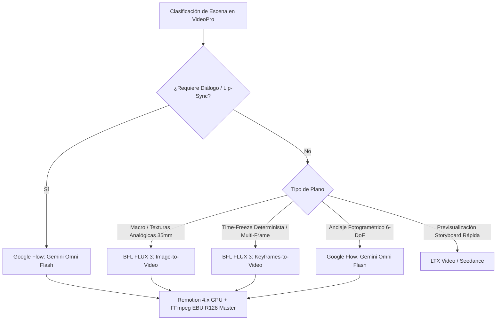

# 🚀 Fórmulas de Alto CTR, Miniaturas Psicológicas y Esquemas de Canales Automatizados de YouTube

> **Pilar:** Estrategia de Crecimiento & Retención YouTube  
> **Estado:** 🟢 ESPECIFICACIÓN TÉCNICA CANÓNICA  

---

## 1. Esquemas JSON Canónicos de Canales

El ecosistema VideoPro utiliza esquemas formales JSON para modelar la configuración integral de cada canal y sus producciones:

### A. `channel_config.schema.json`
Define el ADN del canal:
- **`channel_id` / `handle`**: Identificadores de marca (`@ChronoDriftOfficial`, `@LivingCanvas3D`, etc.).
- **`brand_voice` / `tone`**: Registro lingüístico (ej. `epic_documentary`, `philosophical_slow_living`, `investigative_vox`).
- **`target_retention_hook`**: Gancho inicial en los primeros 5-8 segundos (tasa de retención objetivo $\ge 72\%$, 85%+ en min 1:00).
- **`audio_dna`**: Tempo BPM, firma espectral y voz TTS de referencia (`es-ES-AlvaroNeural`, `en-US-ChristopherNeural`).

### B. `grounding_6dof.schema.json`
Modela el anclaje espacial de vuelos FPV 6-DoF tritemporales:
- **`wgs84_coordinates`**: Coordenadas geográficas `[lat, lon, elevation_agl]`.
- **`6_canonical_angles`**: Puntos de vista `CAM_N`, `CAM_E`, `CAM_S`, `CAM_W`, `CAM_PITCH_DOWN`, `CAM_PITCH_UP`.
- **`temporal_epochs`**: Épocas históricas comparadas (ej. `1626_colonial`, `2026_modern`, `2226_cyberpunk`).

### C. `thumbnail_formulas.schema.json`
Estructura paramétrica de miniaturas de alto CTR ($\ge 15.0\%$):
- **Resolución Máster:** $1920 \times 1080$ (16:9) PNG sin compresión.
- **Zona Muerta Protegida:** Esquina inferior derecha ($340\text{px} \times 210\text{px}$) reservada para el badge de duración de YouTube.
- **Margen de Seguridad:** $60\text{px}$ perimetral interior.
- **Regla de la Tríada Cognitiva (<250ms de procesamiento ocular):**
  1. *Sujeto Hero (60% foco)*: Hito arquitectónico/monumento en transformación dramática.
  2. *Capa HUD/Láser (25% foco)*: Wireframe o telemetría LiDAR que aporta autoridad técnica.
  3. *Microcopy (15% foco)*: Máximo **3-4 palabras de alto impacto**, sin duplicar palabras del título (Principio de *Curiosity Gap* asimétrico).

---

## 2. Las 5 Fórmulas Maestras de Miniaturas de Alto CTR

| # | Fórmula | CTR Proyectado | Composición Geométrica | Paleta de Color | Ejemplos de Microcopy |
|---|---|---|---|---|---|
| **F1** | **Disrupción Temporal Split-Screen** | **17.5% – 21.8%** | Corte diagonal láser a 75°; 45% Pasado (1626) vs 55% Futuro (2226) | `#FFB300` (Oro) / `#00E5FF` (Cian) | `ERA DE MADERA`, `TODO CAMBIÓ`, `400 AÑOS` |
| **F2** | **Vórtice de Picado Hipersónico** | **16.8% – 19.5%** | Perspectiva central a 1 punto picando -90° a 140 km/h con zoom blur | `#FF007F` (Magenta) / `#00E5FF` (Cian) | `CAÍDA LIBRE`, `A 140 KM/H`, `SIN RETORNO` |
| **F3** | **Telemetría Holográfica Flotante** | **15.8% – 17.6%** | División asimétrica 3: Left HUD (45%) + Right wireframe 3D (55%) | `#00E5FF` (Cian) / `#B388FF` (Lila) | `DATOS REALES`, `CIUDAD SECRETA`, `ESCÁNER 3D` |
| **F4** | **Escáner LiDAR 3D X-Ray** | **19.8% – 21.2%** | Corte estratigráfico: 35% superficie moderna / 65% nube de puntos subterránea | `#00E676` (Verde Matrix) / `#00E5FF` (Cian) | `11 MILLONES`, `BAJO TIERRA`, `EL RÍO OCULTO` |
| **F5** | **Shock de Escala Megaciudad** | **18.4% – 21.5%** | Arcología piramidal de 2000m sobre ruinas históricas con compuertas marinas | `#FF5500` (Naranja) / `#7C4DFF` (Violeta) | `¿CÓMO SOBREVIVE?`, `+15 METROS`, `CIUDAD PIRÁMIDE` |

---

## 3. Matriz de Sustitución Léxica Anti-CGI & Protocolo Anti-Morphing

Para evitar el aspecto sintético (*AI Slop*) en los prompts de vídeo:
- ❌ **Términos Prohibidos:** `Unreal Engine 5`, `8K`, `Octane Render`, `photorealistic`, `glowing neon`, `perfect skin`.
- ✅ **Descriptores Físicos Reales:** `ARRI Alexa 65`, `Kodak Vision3 500T 5219 35mm stock`, `Panavision C-Series Anamorphic f/1.8`, `visible skin pores, micro-blemishes, subtle sweat droplets`, `matte weathered concrete`.
- **Mitigación de Morphing Facial en Tomas Dinámicas:**
  - Encuadrar multitudes y peatones siempre desde atrás o de perfil.
  - Nunca hacer zoom continuo desde 150m de altura hasta plano cerrado de 1.5m en una sola toma.
  - Utilizar un corte de macro dedicado (85mm prime) con sutil *focus breathing* para detalles de rostro.
  - Mantener un único vector cinemático por plano: picado puro, tracking horizontal o trepada vertical.

---

## 4. Pipeline de Optimización de Costes 10x (FLUX 3 Draft + CPU Upscale)

Generar borradores a 720p en FLUX 3 ($0.48 / ~85s) y realizar escalado local por CPU a 1080p/4K a coste $0.00:
```bash
ffmpeg -y -i input_720p.mp4 -vf \
  "scale=1920:1080:flags=lanczos+accurate_rnd+full_chroma_int,unsharp=5:5:1.2:5:5:0.0,eq=contrast=1.04:saturation=1.03" \
  -c:v libx264 -preset slow -crf 17 -c:a copy output_1080p_master.mp4
```

---

## 5. Rejilla Rítmica 118 BPM & Sincronía Matemática

- **1 Beat:** $508.47\text{ ms}$
- **1 Compás (4 Beats):** $2033.90\text{ ms}$
- **Frase de 4 Compases:** $8135.59\text{ ms}$
- **Regla de Corte:** Todo cambio de plano ocurre estrictamente en el Beat 1 de un compás ($t = n \times 2033.9\text{ ms}$).
- **Modulación Doppler 3D para FPV:**
  $$\Delta f = f_0 \left(\frac{343}{343 \mp v_{\text{drone}}}\right) \implies +9.78\% \text{ (Aproximación a 110 km/h)}, -8.18\% \text{ (Alejamiento)}$$

---

## 6. Matriz de Decisión de Motor Híbrido


